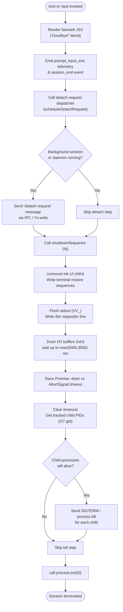

# `/exit`

> Analysis basis: CC v2.1.156 bundle.js (AST extraction + Claude interpretation)
> Minimum version: v2.1.156

---

## Overview

The `/exit` command (aliased as `/quit`) terminates the Claude Code CLI session. When invoked, it renders a farewell JSX element, fires a `prompt_input_exit` telemetry event, and then orchestrates a full graceful shutdown sequence — flushing I/O, stopping background services, killing tracked subprocesses, and finally calling `process.exit`. The command is classified `local-jsx` and executes immediately without waiting for an AI model response.

---

## Registration

| Field | Value |
|---|---|
| type | `local-jsx` |
| name | `exit` |
| description | `null` |
| aliases | `["quit"]` |
| immediate | `true` |
| module_id | `pi1` |
| load_inline | `true` |
| loc_byte | `12360444` |
| loc_byte_end | `12360640` |
| loc_line | `9240` |
| arbor_handler.name | `qM5` |
| arbor_handler.fqn | `claude-2.1.156::qM5` |
| arbor_handler.kind | `AsyncFunction` |
| arbor_handler.resolution_path | `module_id` |
| arbor_handler.n_hits | `1` |

Analysis basis: CC v2.1.156 bundle.js:+12360444

---

## Input Branching

The exit flow has more than three distinct phases (JSX render → telemetry → detach-request dispatch → shutdown sequence → process termination), so a flowchart is used.



Analysis basis: CC v2.1.156 bundle.js:+12359693 – +12360640

---

## Behavioral Spec

### 1. Handler Entry — `exitCommandHandler` (`qM5`)

```
async function exitCommandHandler(context):
    // 1. Obtain process-role hint from processRoleChecker (V9→VOH)
    role = processRoleChecker()          // checks "bg", "daemon", "daemon-worker"

    // 2. Schedule a randomised sound/animation callback (soundScheduler H)
    soundScheduler(Math.random(), setTimeout)

    // 3. Dispatch detach-request to any live background session
    detachRequestDispatcher(context)     // m5H

    // 4. Emit "prompt_input_exit" telemetry
    telemetryEmitter("prompt_input_exit")

    // 5. Build and return the JSX farewell node
    node = A8A.createElement(farewellComponent, {text: "Goodbye!"})

    // 6. Kick off the full shutdown pipeline
    shutdownPipeline(context)            // tq
    return node
```

Analysis basis: CC v2.1.156 bundle.js:+12359693

---

### 2. Process-Role Checker — `processRoleChecker` (`V9`)

```
function processRoleChecker():
    // Inspects an internal store (VOH) for the current process role.
    // Known role strings: "bg", "daemon", "daemon-worker"
    // Returns the role string or null for the foreground REPL process.
    return internalRoleStore.get()  // VOH
```

Analysis basis: CC v2.1.156 bundle.js:+12359693 (call edge V9→VOH at +2199145)
Known role literals: `"bg"` (+2199068), `"daemon"` (+2199078), `"daemon-worker"` (+2199092)

---

### 3. Detach-Request Dispatcher — `detachRequestDispatcher` (`m5H`)

```
function detachRequestDispatcher(context):
    // Resolves the active background session handle (Mo6).
    session = backgroundSessionResolver()     // Mo6

    // Calls sessionActionHelper (Av1) which internally:
    //   - resets task state to 0 (literal 0 at +10758323)
    //   - sets task type to "task" (+10758367)
    //   - uses KPH and k8 helpers
    sessionActionHelper(session, {type: "task", index: 0})  // Av1 → KPH, k8

    // Writes a "detach-request" message over the IPC channel (Ds → Ys.write)
    ipcWriter("detach-request")               // Ds, literal at +10763774

    // Registers a post-detach hook (hAH)
    postDetachHook()                          // hAH
```

Analysis basis: CC v2.1.156 bundle.js:+12359709 (call edge qM5→m5H)

---

### 4. Scheduled-Task Handler — `scheduledTaskBuilder` (`xE8`)

```
function scheduledTaskBuilder(args):
    // Appends "scheduled task" label (+10757286) to an internal task list (H.push)
    taskRegistry.push("scheduled task")    // GG→ov, H.push

    // Delegates to scheduleEntryParser (jnL) for the schedule string
    entry = scheduleEntryParser(args)      // jnL

    // Calls terminalWidthHelper (y9) for column layout
    columns = terminalWidthHelper()        // y9
    return {entry, columns}
```

Analysis basis: CC v2.1.156 bundle.js:+12359740 (call edge qM5→xE8)

---

### 5. Shutdown Pipeline — `shutdownPipeline` (`tq`)

The shutdown pipeline is the most complex sub-routine. It coordinates UI teardown, terminal restoration, I/O flushing, and process termination.

```
async function shutdownPipeline(context):
    // Phase A — UI teardown
    unmountInkUI()                          // rNH
        // writes ESC-7 (+3716981) / ESC-8 (+3716992) terminal save/restore
        // unmounts H (Ink root), calls GR, Yq8 for terminal cleanup
        // DVH checks terminal type: "ghostty" ≥1.2.0, "iTerm.app" ≥3.6.6
        // V0 strips tmux escapes ("\x1b\x1b", "screen")

    // Phase B — stdout flush with dim separator
    flushStdout()                           // VV_
        // uses fZ, Mb, k6 helpers
        // BX6 checks cwd via q.statSync, kD.join
        // V3 → U4 → _9 for path resolution
        // writes dim-styled line (j6.dim) via uwH.writeSync (+5327997)
        // ZJ9 for additional line formatting

    // Phase C — signal shutdown to supervisor (vV_)
    signalShutdown()                        // vV_
        // clears any pending timeouts (clearTimeout)
        // retrieves child PID list (O7.get)
        // calls process.kill on each tracked child
        // calls process.exit(0)
        // throws Error("unreachable") as a safety guard (+5328262)

    // Phase D — I/O drain with race timeout
    drainIOBuffers()                        // IxH → f$A.drain
    timeout = Math.max(5000, 3500)          // literals +5329754, +5329761
    await Promise.race([
        drainIOBuffers(),
        AbortSignal.timeout(timeout)
    ])

    // Phase E — session_end telemetry + cache eviction hint
    telemetryEmitter("session_end")         // literal +5330125
    cacheEvictionHint()                     // X96

    // Phase F — multi-promise teardown
    multiTeardown()                         // m58
        // Promise.all + Promise.race combo
        // invokes jV, sQ, Q8 (timeout helper with 500 ms, +5329346)
        // "other" role literal (+5329528) for non-foreground sessions

    // Phase G — final stdout write
    uwH.writeSync(finalNewline)             // +5330194
```

Analysis basis: CC v2.1.156 bundle.js:+12359876

---

### 6. Farewell Component — `farewellComponent` (`AM5`)

```
function farewellComponent():
    // Renders the internal O2 JSX component
    // Displays the literal string "Goodbye!" (bundle.js:+12359657)
    return <O2 text="Goodbye!" />
```

Analysis basis: CC v2.1.156 bundle.js:+12359863 (call edge qM5→AM5→O2, literal at +12359657)

---

### 7. Terminal Cursor Restore — `terminalCursorRestore` (`Yq8`)

```
function terminalCursorRestore():
    // Writes ESC-7 (save cursor, +3716981) and ESC-8 (restore cursor, +3716992)
    // via Fr.writeSync (raw stdout fd)
    Fr.writeSync(ESC_SAVE_CURSOR)
    Fr.writeSync(ESC_RESTORE_CURSOR)

    // DVH: checks terminal identity
    //   - "ghostty" version ≥ "1.2.0"  (+3447359, +3447389)
    //   - "iTerm.app" version ≥ "3.6.6" (+3447428, +3447460)
    //   uses xD, clq.coerce (semver), ZV

    // MVH: additional multiplexer handling

    // V0: strips tmux-specific escape sequences
    //   replaces "\x1b\x1b" (+3369994) around "tmux" (+3369948) / "screen" (+3370021)
```

Analysis basis: CC v2.1.156 bundle.js:+5327671

---

### 8. Startup Performance Report — `startupPerfReporter` (`AK6`)

```
// Triggered as part of session teardown path.
function startupPerfReporter():
    rU8()   // reads perf_hooks marks, rounds timestamps
            // logs "STARTUP PROFILING REPORT" (width 80) if enabled
            // fires tengu_startup_perf telemetry
            // uses 1 048 576-byte buffer limit (+213851)

    zYA()   // locates startup-perf log file via lb6.dirname / lb6.join
            // writes via j0H (openSync→writeFileSync→fsyncSync→closeSync)
            // fYA: formats profiling checkpoints; uses db6, xn, A.join
            // N:   logs at "debug" level; checks H.includes, H.trim, _.toUpperCase
```

Analysis basis: CC v2.1.156 bundle.js:+5330052

---

### 9. Scroll Summary Reporter — `scrollSummaryReporter` (`u58`)

```
// Triggered within the shutdown pipeline.
function scrollSummaryReporter():
    fZ()         // flush helper
    TJ9()        // terminal journal helper
    d()          // dispose helper

    GJ9()        // computes scroll stats:
                 //   Date.now() deltas, Math.max, Math.round
                 //   Object.assign into stats object
                 //   PJ9 for persistence

    fq()         // renders scroll summary to terminal
                 //   Z3H: checks baK cache set
                 //   oY_: calls v1, xH for output helpers
                 //   Tr → r47: formatting helper
                 //   N: debug logger
                 //   rY_: Boolean coercion, n6 helper
                 //   i_ → vp: display path
                 //   o47 → E6: event emitter (fires tengu_pewter_brook)
                 //   E6: also fires tengu_amber_creek
                 //     uses hz6, Sz6, Mx, hzH.has, y88, Iz6.add, $U
    emitTelemetry("tengu_scroll_summary")
```

Analysis basis: CC v2.1.156 bundle.js:+5330065

---

## State & Side Effects

| Item | Detail |
|---|---|
| Telemetry — `prompt_input_exit` | Fired by the handler immediately on `/exit` invocation (literal +12359881) |
| Telemetry — `session_end` | Fired in the shutdown pipeline (literal +5330125) |
| Telemetry — `tengu_scroll_summary` | Fired by the scroll summary reporter during teardown (+5329057) |
| Telemetry — `tengu_cache_eviction_hint` | Fired via X96 near end of shutdown (+5330090) |
| Telemetry — `tengu_amber_creek` | Fired inside the fullscreen/layout event path (+3378328) |
| Telemetry — `tengu_pewter_brook` | Fired inside the fullscreen/layout event path (+3378236) |
| Telemetry — `tengu_startup_perf` | Fired by startupPerfReporter if profiling was enabled (+214276) |
| Telemetry — `tengu_bg_dispatch_sigkill_escalate` | Fired if a background subprocess requires SIGKILL escalation (+15478865) |
| Telemetry — `tengu_bg_dispatch_low_mem` | Fired if low-memory condition detected during background teardown (+15479444) |
| Telemetry — `tengu_bg_spare_enable` | Fired when the spare-process pool is enabled (+15480139) |
| Telemetry — `tengu_bg_spare_claim` | Fired when a spare process is claimed (+15480260) |
| Telemetry — `tengu_bg_spare_claim_fail` | Fired when spare-process claim fails (+15480523) |
| Telemetry — `tengu_bg_spare_spawn` | Fired when a new spare process is spawned (+15478558) |
| Telemetry — `tengu_daemon_config_reload` | Fired on daemon config reload during teardown (+15493353) |
| IPC message | Writes `"detach-request"` to the IPC channel via `Ys.write` (+10592421) |
| Ink UI teardown | Calls `H.unmount` to remove the Ink React tree from the terminal |
| Terminal cursor | Writes ESC-7 / ESC-8 escape codes to restore cursor state (+3716981, +3716992) |
| Child process cleanup | Sends SIGTERM (+15480758) or SIGKILL (+15478913) to tracked child processes |
| Stdout drain | Awaits `f$A.drain` with a `Math.max(5000, 3500)` ms ceiling (+5329754, +5329761) |
| `process.exit` | Called unconditionally after child-process cleanup (+5328189) |
| Startup perf log | Optionally written to disk via `j9H.writeFileSync` / `j9H.fsyncSync` if startup profiling was active |
| Sound/animation | `soundScheduler` (`H`) uses `Math.random()` + `setTimeout` for a randomised farewell animation (+13408461) |
| appState changes | `detachRequestDispatcher` resets task index to `0` and type to `"task"` (+10758323, +10758367) |
| `uwH.writeSync` | Final newline written to raw stdout fd as the very last action before exit (+5330194) |

---

## Version History

| Version | Change |
|---|---|
| v2.1.156 | Initial analysis |

---

## Common Mistakes

1. **Using `/exit` mid-task** — Because `immediate: true` is set, the command fires without waiting for any in-flight AI turn to complete. Any running tool calls or streaming responses are abandoned; use `/stop` first if you want a clean task boundary.
2. **Expecting instant termination** — The shutdown pipeline races an I/O drain (up to `max(5000, 3500)` ms) and sends SIGTERM to child processes before calling `process.exit`. On slow systems there can be a noticeable delay.
3. **`/quit` vs `/exit` confusion** — Both names are equivalent; `quit` is registered as an alias and triggers identical behaviour.
4. **Daemon sessions not stopped** — `/exit` sends a `detach-request` to an active background session but does not hard-kill it. The background daemon continues to run and must be stopped separately.
5. **Startup profiling data lost if interrupted** — If the process is killed externally (e.g. `SIGKILL` from the OS) before the teardown pipeline reaches `startupPerfReporter`, the profiling log will not be flushed to disk.

---

## Appendix — Identifier Mapping

> For bundle debugging only. Identifiers change across versions.

| Identifier | Role |
|---|---|
| `qM5` | Main exit command handler (`exitCommandHandler`) — Arbor-resolved entry point |
| `V9` | Process-role checker (reads "bg" / "daemon" / "daemon-worker" from store) |
| `VOH` | Internal role store (read by V9) |
| `H` | Sound / animation scheduler (uses `Math.random` + `setTimeout`) |
| `m5H` | Detach-request dispatcher (sends IPC "detach-request") |
| `Mo6` | Background session resolver |
| `Av1` | Session action helper (resets task state) |
| `KPH` | Task-state helper used by Av1 |
| `k8` | Task-type setter used by Av1 |
| `Ds` | IPC writer (calls `Ys.write` with detach-request payload) |
| `RH` | JSON serialiser helper (calls `JSON.stringify`) |
| `hAH` | Post-detach hook |
| `sM` | Telemetry emitter for `prompt_input_exit` |
| `xE8` | Scheduled-task builder |
| `GG` | Task-registry accessor (calls `ov`) |
| `ov` | Core observable / state store |
| `jnL` | Schedule-entry parser (delegates to UV, fk, FlH) |
| `UV` | Cron-string parser (trim, match, parseInt, toString) |
| `K` | Column formatter (map + padEnd) |
| `w` | Process manager (kill, spawn, freemem, retireIfSettled) |
| `L` | Promise-tracking set (add, finally, delete) |
| `j` | Child-process kill helper (A.values → y.kill) |
| `D` | Daemon session dispose helper |
| `$` | Process-list helper (calls `bo1`) |
| `J` | Date/scheduler helper (wraps `w`) |
| `fk` | Schedule token parser (trim → fv7) |
| `fv7` | Cron-field parser (split, match, parseInt, K.add, Array.from) |
| `A` | Locale normaliser (f.toLowerCase) |
| `FlH` | Date-adjustment helper (setSeconds, setMinutes, setHours, setDate, setMonth) |
| `_` | Generic iterable (used by FlH, m58, VV_) |
| `O` | Background-session state object (calls `k8`) |
| `f` | Stream-pair wrapper (A.close, q.close, L) |
| `q` | File-system helper (PEK.unlinkSync) |
| `iq` | Duration formatter (Math.floor, Math.round) |
| `y9` | Terminal-width helper (indexOf, substring, s6, Tq) |
| `s6` | String-width helper (Bun.stringWidth) |
| `Tq` | Grapheme wrapper (s6, zY) |
| `zY` | Unicode helper used by Tq |
| `AM5` | Farewell JSX component builder (wraps O2) |
| `tq` | Shutdown pipeline coordinator |
| `rNH` | Ink UI unmount + cursor-restore routine |
| `GR` | Post-unmount cleanup helper |
| `Yq8` | Terminal cursor save/restore writer (ESC-7 / ESC-8) |
| `DVH` | Terminal-type detector (ghostty, iTerm.app, semver check) |
| `MVH` | Multiplexer escape handler |
| `V0` | tmux/screen escape stripper (replaceAll) |
| `xH` | String coercion helper |
| `VV_` | Stdout flush + dim separator writer |
| `fZ` | Flush helper used by VV_ and u58 |
| `Mb` | Buffer helper used by VV_ |
| `k6` | Observable accessor (calls `ov`) |
| `BX6` | Working-directory stat helper (q.statSync, kD.join) |
| `WS` | State selector (calls `ov`) |
| `$_` | State sub-selector (calls `ov`) |
| `B6` | File-existence checker |
| `V3` | Path-resolution helper (k6 → U4) |
| `U4` | Path resolver (calls `_9`) |
| `ZJ9` | Line-formatting helper used by VV_ |
| `vV_` | Process-exit finaliser (clearTimeout, process.kill, process.exit) |
| `IxH` | I/O drain helper (f$A.drain) |
| `Y` | Supervisor session manager (stop/start/updateConfig/delete) |
| `E2H` | Session-state serialiser (Object.keys, K.has, J8) |
| `o9` | AsyncLocalStorage getter (Fj7.getStore) |
| `J8` | Session-ID helper |
| `S_A` | Session helper (calls h_A) |
| `ZH` | String coercer (String) |
| `Lt1` | Column-width calculator (Object.keys, Math.max, oY) |
| `T` | Input/keyboard event handler (preventDefault, Z0, Y, H) |
| `b` | Keyboard event object |
| `Z0` | userSettings accessor (U_) |
| `E` | Metrics tracker (stop, updateConfig, start) |
| `QEK` | Heartbeat scheduler (hHH) |
| `hHH` | Heartbeat emitter |
| `V` | Render loop / display engine (V.start) |
| `d` | Dispose/cleanup helper |
| `AK6` | Startup performance reporter coordinator |
| `rU8` | Perf-mark collector and reporter |
| `Kp` | `require("perf_hooks")` wrapper |
| `zYA` | Startup-perf log-file writer |
| `wYA` | Log-file path builder (lb6.join, l8, k6) |
| `j0H` | Atomic file writer (openSync, writeFileSync, fsyncSync, closeSync) |
| `fYA` | Checkpoint formatter (entries, at, xn, A.join) |
| `N` | Debug logger (includes, toUpperCase, RH, yS, HuH, gRK) |
| `u58` | Scroll-summary reporter |
| `TJ9` | Terminal journal helper |
| `GJ9` | Scroll statistics calculator (Date.now, Math.max, Math.round) |
| `PJ9` | Scroll-stats persistence helper |
| `fq` | Scroll-summary renderer |
| `Z3H` | Cache-set checker (baK.has) |
| `oY_` | Output helper (v1, xH) |
| `Tr` | Formatting dispatcher (r47) |
| `rY_` | Boolean coercion helper (n6, Boolean) |
| `i_` | Display-path helper (vp) |
| `o47` | Event emitter wrapper (E6) |
| `E6` | Core event emitter (hz6, Sz6, Mx, hzH, y88, Iz6, $U, b6) |
| `X96` | Cache eviction hint emitter |
| `m58` | Multi-promise teardown (Promise.all, Promise.race, jV, sQ, Q8) |
| `Q8` | Timeout-with-abort helper (500 ms, Error "aborted") |