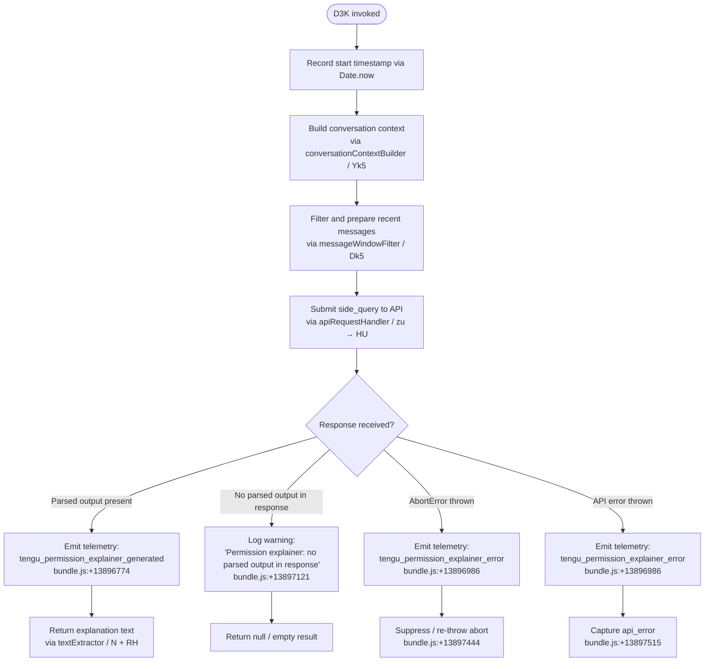

# `/explain_command`

> Analysis basis: CC v2.1.156 bundle.js (AST extraction + Claude interpretation)
> Minimum version: v2.1.156

---

## Overview

`/explain_command` is an internal `tool`-type slash command that generates a natural-language explanation of why a specific tool or permission is required by Claude Code. It is implemented as an async handler (`D3K`) that assembles recent conversation context, submits a side-query to the Anthropic API, then parses and returns the model's plain-text explanation. The command is registered under the internal role `permission_explainer` and is intended for programmatic invocation by the permission-decision subsystem rather than direct user input.

---

## Registration

| Field | Value |
|---|---|
| type | `tool` |
| name | `explain_command` |
| description | `null` |
| loc_byte | `13896291` |
| loc_byte_end | `13896327` |
| loc_line | `11573` |
| arbor_handler.name | `D3K` |
| arbor_handler.fqn | `claude-2.1.156::D3K` |
| arbor_handler.kind | `AsyncFunction` |
| arbor_handler.resolution_path | `direct` |
| arbor_handler.n_hits | `1` |
| internal role (literal) | `permission_explainer` (bundle.js:+13896349) |

Analysis basis: CC v2.1.156 bundle.js:+13896291

---

## Input Branching

The handler exhibits four distinct execution paths: normal success, missing parsed output, abort/cancellation, and API error. A Mermaid flowchart is used below.



---

## Behavioral Spec

### 1. Handler Entry and Timestamp

```
async function permissionExplainerHandler(toolInput):
    startTime = Date.now()                      // bundle.js:+13896010
    context   = buildConversationContext(toolInput)   // Yk5, bundle.js:+13896031
    window    = filterMessageWindow(context)          // Dk5, bundle.js:+13896049
    ...
```

Analysis basis: CC v2.1.156 bundle.js:+13896010

### 2. Conversation Context Builder (`Yk5`)

Constructs a compact representation of the ongoing conversation for use as the prompt context in the side-query.

```
function buildConversationContext(input):
    serialised = toStringRepresentation(input)   // RH → JSON.stringify, bundle.js:+183160
    typed      = String(serialised)              // bundle.js:+13895522
    return typed
```

- The literal `2` at bundle.js:+13895506 and `1000` at bundle.js:+13895550 suggest index or character-limit parameters used during serialisation.
- The literal `"assistant"` at bundle.js:+13895585 and `3` at bundle.js:+13895605 indicate that the builder specifically considers assistant-role messages and likely caps the lookback to 3 turns.

Analysis basis: CC v2.1.156 bundle.js:+13895496

### 3. Message Window Filter (`Dk5`)

Selects and trims the most relevant recent messages before passing them to the model.

```
function filterMessageWindow(messages):
    filtered  = messages.filter(isRelevantMessage)    // H.filter, bundle.js:+13895562
    reversed  = filtered.reverse()                    // A.reverse, bundle.js:+13895630
    sliced    = reversed.slice(...)                   // f.slice, bundle.js:+13895773
    sliced.unshift(headerEntry)                       // q.unshift, bundle.js:+13895794
    result    = sliced.join(separator)                // q.join, bundle.js:+13895827
    // ellipsis literal "..." used as truncation marker (bundle.js:+13895786)
    // only messages of type "text" are retained (bundle.js:+13895688)
    return result
```

Analysis basis: CC v2.1.156 bundle.js:+13895562

### 4. Side-Query API Call (`J9` → `Ce` / `WQ`)

The assembled window is submitted as a `side_query` (literal at bundle.js:+13150309) through the standard API request pipeline (`zu` → `HU`).

```
function buildSideQuery(window, toolInput):
    prompt = assemblePrompt(window, toolInput)    // J9, Ce, WQ chain
    return {
        type: "side_query",
        messages: normaliseMessages(prompt),      // WQ → e9 normalisation chain
        model: resolvedModel,
    }
```

The `WQ` → `e9` chain performs model-string normalisation: it lower-cases the model ID, maps alias tokens (`"sonnet"`, `"haiku"`, `"opus"`, `"best"`, `"opusplan"`) to canonical model strings, and checks for `"anthropic."` prefix (literal at bundle.js:+2183859).

Analysis basis: CC v2.1.156 bundle.js:+2185876

### 5. API Request Orchestrator (`zu` → `HU`)

The full Anthropic API request pipeline is invoked with the side-query payload. Key behaviours visible in the call graph:

- OAuth token refresh with distributed locking (`m3_` / `bzH` subsystem, telemetry: `tengu_oauth_token_refresh_*`)
- HTTP header construction including `User-Agent`, `X-Claude-Code-Session-Id`, `x-app`, and additional protection header (literals at bundle.js:+2916761 through +2917270)
- Proxy authentication helper with 30-second timeout (literal `30000` at bundle.js:+1776833)
- Stream watchdog (telemetry: `tengu_stream_watchdog_default_on`, `tengu_byte_watchdog_fired_late`)
- Byte-level streaming via `lU5` / daemon IPC transport

Analysis basis: CC v2.1.156 bundle.js:+13150277

### 6. Result Parsing and Telemetry (`D3K` post-call)

```
async function permissionExplainerHandler(toolInput):
    ...
    try:
        response = await sideQuery(window)                // zu, bundle.js:+13896209
        parsed   = extractTextContent(response)           // N, RH, bundle.js:+13896389, +13896582

        if parsed is null or empty:
            log("Permission explainer: no parsed output in response")
                                                          // bundle.js:+13897121
            return emptyResult()

        emit("tengu_permission_explainer_generated", {
            duration: Date.now() - startTime,
            ...
        })                                                 // bundle.js:+13896774
        storeResult(parsed)                               // zk5, bundle.js:+13896616
        return formatOutput(parsed)                       // yH, t6, ZH, uH chain

    catch AbortError:
        emit("tengu_permission_explainer_error", { reason: "AbortError" })
                                                          // bundle.js:+13896986, +13897444
        suppress()

    catch apiError:
        emit("tengu_permission_explainer_error", { reason: "api_error" })
                                                          // bundle.js:+13897515
        raise
```

Analysis basis: CC v2.1.156 bundle.js:+13896389

### 7. Permission Type Classifier (`U9`)

Before or after result formatting, `U9` classifies whether the tool call being explained is an MCP tool or a built-in tool by checking the tool name with `Object.hasOwn` and an `H.startsWith` check against `"mcp_tool"` (literal at bundle.js:+3161133).

```
function classifyToolPermission(toolName):
    if Object.hasOwn(toolRegistry, toolName):
        if toolName.startsWith("mcp_tool"):
            return "mcp_tool"
        return "builtin"
    return "unknown"
```

Analysis basis: CC v2.1.156 bundle.js:+3161053

---

## State & Side Effects

| Item | Detail |
|---|---|
| Telemetry — success | `tengu_permission_explainer_generated` (bundle.js:+13896774) |
| Telemetry — error | `tengu_permission_explainer_error` (bundle.js:+13896986) |
| Telemetry — OAuth | `tengu_oauth_token_refresh_*` family (bundle.js:+2960385–+2962049) |
| Telemetry — stream | `tengu_stream_watchdog_default_on`, `tengu_byte_watchdog_fired_late` |
| Telemetry — API | `tengu_api_success` (bundle.js:+13151760) |
| Telemetry — config | `tengu_config_parse_error`, `tengu_config_auth_loss_prevented` |
| Side-query dispatch | Issues a `"side_query"` API call (not a main conversation turn); uses the standard `HU` HTTP pipeline |
| Result storage | Parsed explanation is stored via `zk5` (bundle.js:+13896616); exact storage target not resolved at depth-2 |
| appState changes | None observed at depth-2 traversal |
| Sound | None observed |
| Hook registration | `_9` → `f$A.register` (bundle.js:+58450) reached via `Y17` watcher subsystem; this is the config-file watcher, not a hook specific to this command |

---

## Version History

| Version | Change |
|---|---|
| v2.1.156 | Initial analysis |

---

## Common Mistakes

1. **Treating `/explain_command` as a user-facing slash command.** It is registered as a `tool` type with `description: null`, indicating it is invoked programmatically by the permission-decision subsystem, not typed by users in the prompt input.
2. **Expecting output when no parsed text is returned.** If the model response contains no parseable text block, the handler silently returns an empty result rather than raising an error. Callers must handle `null`/empty output gracefully.
3. **Assuming it works without valid authentication.** The handler invokes the full API pipeline including OAuth token refresh. If credentials are absent or expired (e.g., `"Cloud gateway session expired"`, bundle.js:+2917820), the call will fail with an `api_error` telemetry event.
4. **Confusing `"permission_explainer"` (internal role) with `"explain_command"` (registered name).** The literal `"permission_explainer"` at bundle.js:+13896349 is the internal subsystem label; the command name used in registration is `"explain_command"` (bundle.js:+13896309).
5. **Ignoring the message window limit.** The filter (`Dk5`) reverses and slices the conversation history and prepends a header entry before joining. Passing very long conversations may silently truncate context.

---

## Appendix — Identifier Mapping

> For bundle debugging only. Identifiers change across versions.

| Identifier | Role |
|---|---|
| `D3K` | Main async handler for `/explain_command` (permission explainer entry point) |
| `Y4A` | Pre-call setup / argument validation helper |
| `b6` | Config file reader / project config loader |
| `B6` | Config path resolver |
| `vz_` | Config validation helper |
| `bzH` | Config file reader with backup/migration logic |
| `m6` | JSON-safe parser wrapper |
| `kb` | Config key prefix stripper |
| `J8` | Shared utility (used in config and HTTP layers) |
| `UBq` | Backup directory scanner |
| `N` | Log/output formatter (used across multiple subsystems) |
| `d` | Logger / debug emitter |
| `Sz_` | Backup path builder |
| `Y17` | Config file watcher initialiser |
| `Mr` | File-watch change handler |
| `_9` | Hook registration helper (`f$A.register`) |
| `Yk5` | Conversation context builder for explainer prompt |
| `RH` | JSON serialiser wrapper |
| `Dk5` | Message window filter / recent-turn selector |
| `J9` | Prompt assembly orchestrator |
| `Ce` | Prompt composition helper |
| `av` | Prompt sub-component builder |
| `_9H` | Prompt formatting utility |
| `WQ` | Message normaliser / model-string resolver |
| `Ti6` | Object-entries iterator utility |
| `mBH` | Model-ID inclusion checker |
| `K$q` | Model index lookup |
| `sx4` | Model-string classifier (includes/alias check) |
| `y1H` | Model-ID known-list membership checker |
| `e9` | Full model-string normalisation function |
| `tx4` | Alias-expansion helper |
| `$X` | Side-query payload builder |
| `w0` | API provider selector / request shaper |
| `EA` | First-party provider handler |
| `pe` | Max-tier plan handler |
| `ZOH` | Team-plan handler |
| `BBH` | Enterprise-plan handler |
| `EZ` | Provider-agnostic request finaliser |
| `vP` | Shared provider request wrapper |
| `Bf` | Gateway provider handler |
| `GA` | Base API request builder |
| `M5` | Message-array normaliser |
| `hN` | Message content normaliser |
| `zu` | Top-level API call orchestrator (side_query dispatcher) |
| `HU` | Full Anthropic API request handler (HTTP + auth + streaming) |
| `Aw` | AsyncLocalStorage context accessor |
| `ee4` | Header split/parse utility |
| `V9` | Response-type classifier |
| `VOH` | Background vs daemon mode discriminator |
| `ei` | Session-ID resolver |
| `sr6` | AsyncLocalStorage store getter |
| `k6` | OS/platform info accessor |
| `ov` | Platform detail helper |
| `t9_` | URL encoder for session headers |
| `xH` | String conversion / safe-cast utility |
| `WO` | OAuth token acquisition orchestrator |
| `m3_` | OAuth token refresh with distributed file lock |
| `Y$q` | Boolean coercion helper |
| `TY` | Auth-profile resolver |
| `lK` | Profile-type classifier |
| `bP` | Auth-profile builder |
| `PO` | Provider-type mapper |
| `oJ` | Auth config accessor |
| `u$` | Auth credential resolver (API key / OAuth / WIF) |
| `CO6` | Profile-kind helper |
| `kgH` | String-to-xH typed caster |
| `C$` | Current time / cache-age helper |
| `se4` | Session-state recorder |
| `ZgH` | Session timestamp writer |
| `S_` | Settings accessor |
| `wc6` | Proxy auth helper runner |
| `MTH` | Proxy config reader |
| `diA` | Proxy URL validator |
| `k24` | Integer parser with NaN guard |
| `Ky` | Proxy credential builder |
| `DP` | HTTPS proxy agent factory |
| `AH7` | HTTP request dispatcher (low-level fetch wrapper) |
| `R5` | Request retry budget calculator |
| `qH7` | Response header inspector |
| `_H7` | Request-level event emitter |
| `Z3_` | Numeric max / Number coercion helper |
| `HH7` | Streaming response handler (byte watchdog, ReadableStream) |
| `Hw` | Request header builder |
| `Pi6` | Base header assembler |
| `PR4` | Header prefix filter |
| `Xi6` | Header name case-normaliser |
| `vz` | URL/host validator and proxy resolver |
| `OQ` | URL scheme and host parser |
| `RpH` | TLS cert helper |
| `ciA` | Custom CA loader |
| `aH_` | IP-address / proxy bypass checker |
| `eH_` | No-proxy list parser |
| `te4` | Token/credential refresh coordinator |
| `OH8` | OAuth endpoint resolver |
| `tv` | Token validator |
| `SxH` | Token expiry checker |
| `tWH` | Supported-environment guard |
| `Sq` | OAuth URL validator |
| `IOH` | Gateway JWT refresh handler |
| `Gm8` | Gateway config accessor |
| `au4` | Gateway token HTTP exchange |
| `JC6` | Gateway response parser |
| `Wm8` | Timestamp utility (Date.now wrapper) |
| `VO6` | HTTP response header lower-caser |
| `XzH` | SDK error logger |
| `R` | Supervisor / daemon file-change watcher |
| `lEK` | File realpath + stat resolver |
| `Wz` | Watcher debounce helper |
| `hH` | Feature-flag evaluator |
| `$B5` | Binary integrity checker |
| `z` | Daemon stop controller |
| `h` | Away-summary trigger |
| `_d` | Away-summary state reader |
| `k` | Away-summary generator |
| `V` | Conversation cache accessor |
| `zJK` | Summary request builder |
| `E` | Stream/conversation event emitter |
| `a2` | Conversation state helper |
| `sBH` | WIF credential exchange handler |
| `ho6` | WIF token HTTP exchange |
| `yH` | Success logger (tengu_feature_ok emitter) |
| `uH` | Failure logger (tengu_feature_bad emitter) |
| `Hm4` | WIF error classifier |
| `T` | Remote-control / input-event handler |
| `b` | Input key handler |
| `Z0` | User settings accessor |
| `Y` | Terminal input/output manager |
| `X` | Daemon IPC socket reader |
| `J` | Daemon socket reference |
| `xf` | Socket write helper |
| `lU5` | Daemon IPC message dispatcher / protocol handler |
| `nU5` | IPC sub-handler |
| `$` | IPC write stream |
| `QO` | Background service name resolver |
| `Z5A` | IPC sequence tracker |
| `EEK` | IPC timeout/backoff scheduler |
| `Q8` | Async abort controller |
| `P` | PTY repaint orchestrator |
| `$0` | Path join helper (omH.join) |
| `F3` | Realpath normaliser |
| `b3H` | File line reader |
| `dU5` | Terminal cell-size calculator |
| `p` | Deferred write scheduler |
| `hAH` | PTY heuristic helper |
| `mK` | Temp directory builder |
| `cU5` | Worker lifecycle manager |
| `o` | Voice silence-toggle timer |
| `x` | Voice focus-silence timer |
| `a` | Voice focus-silence timer (alternate) |
| `W` | Conversation history push helper |
| `B` | MCP tool filter |
| `g` | UI render batcher |
| `l` | PTY line filter |
| `r` | IPC read stream |
| `c` | IPC chunk handler |
| `vS6` | IPC write+destroy helper |
| `G` | PTY repaint + view batcher |
| `ZH` | String coercion wrapper |
| `MEH` | Model feature-flag checker |
| `O9` | Model content-type classifier |
| `_w` | Model string scrubber |
| `Hp8` | Model header injector |
| `NP` | Prompt injection sanitiser |
| `eS` | Extended-thinking capability checker |
| `LP5` | Conversation history finder |
| `oqA` | SHA-256 hash builder |
| `er6` | Prompt cache header builder |
| `v1` | String-coercion primitive |
| `l88` | Cache-control tag builder |
| `ykH` | Prompt cache 1h config applicator |
| `am8` | Cache metadata helper |
| `E6` | File-watch event dispatcher |
| `hz6` | Watch event normaliser |
| `Sz6` | Watch debounce helper |
| `Mx` | Watch path resolver |
| `y88` | Deduplicated watch-event emitter |
| `sm8` | Cache thread-label matcher |
| `SZ` | HIPAA flag resolver |
| `I3_` | HIPAA base-config reader |
| `fEH` | HIPAA-aware model filter |
| `F9_` | HIPAA-blocked model list checker |
| `i_K` | Model list mapper |
| `GH8` | Temperature / sampling config builder |
| `EP` | Tool definition mapper |
| `gYH` | Tool-call result formatter |
| `KU` | Conversation turn builder |
| `O8` | Conversation session manager |
| `b7` | Auth+conversation context combiner |
| `kMH` | Metric recorder helper |
| `$J6` | Sub-agent dispatcher |
| `Kf9` | Built-in agent resolver |
| `ak7` | Agent capability checker |
| `MJ6` | Custom agent resolver |
| `Hc` | Agent name parser |
| `ok7` | Agent prefix stripper |
| `y78` | Agent metadata reader |
| `t0_` | Agent name/index extractor |
| `F6H` | Agent thread-label classifier |
| `W96` | Cache-control write helper |
| `U9` | Tool permission type classifier (MCP vs builtin) |
| `t6` | Structured-output logger (tengu_feature_sad emitter) |
| `zk5` | Explanation result store |

---

Note: index built via Arbor fallback; some signals (telemetry, literals) may be missing — see arbor-fallback.js.