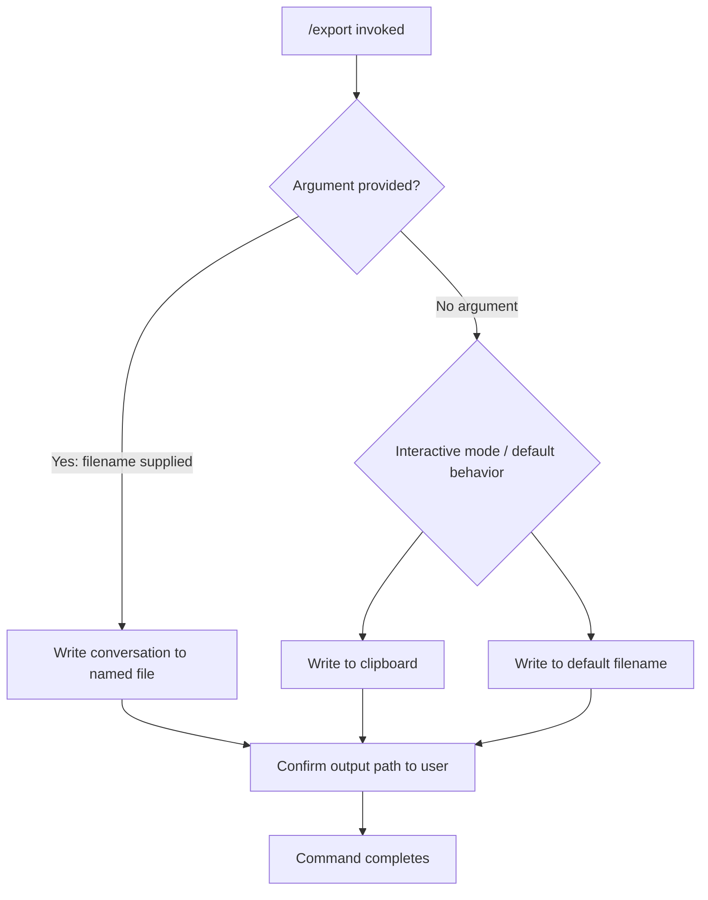

# `/export`

> Analysis basis: CC v2.1.144 bundle.js (AST extraction + Claude interpretation)
> Minimum version: v2.1.144

---

## Overview

The `/export` command serializes the current conversation session and writes it to a file or copies it to the system clipboard. It accepts an optional filename argument; when no argument is supplied, the command determines the output destination through its own internal branching logic. The command is implemented as a local JSX module, meaning it renders interactive UI elements within the Claude Code terminal interface.

---

## Registration

| Field | Value |
|---|---|
| type | `local-jsx` |
| name | `export` |
| description | `Export the current conversation to a file or clipboard` |
| argumentHint | `[filename]` |
| module\_id | `$Zq` |

Analysis basis: CC v2.1.144 bundle.js:+11682290

---

## Input Branching

The command accepts one optional positional argument (`[filename]`). Based on the registration metadata and the `local-jsx` type, the following branching structure applies at invocation time:



> **Note:** The precise logic inside the `local-jsx` JSX component (module `$Zq`) — including which default path is chosen when no filename is given, whether an interactive picker is shown, and the exact serialization format — could not be resolved from the depth-2 call graph traversal.
>
> <!-- TODO: not found in depth-2 traversal; needs --depth 4 -->

---

## Behavioral Spec

### Invocation and Argument Parsing

```
function exportCommand(rawArgs):
    filename = parseOptionalPositionalArg(rawArgs)

    if filename is present and non-empty:
        destination = FileDestination(path = filename)
    else:
        destination = resolveDefaultDestination()   # see note below

    conversationData = serializeCurrentConversation()
    writeToDestination(conversationData, destination)
    reportSuccess(destination)
```

Analysis basis: CC v2.1.144 bundle.js:+11682290

> **`resolveDefaultDestination()`** — The internal logic that decides between clipboard output and a default file path when no filename argument is given is implemented inside module `$Zq` and was not reachable at depth ≤ 2 traversal.
>
> <!-- TODO: not found in depth-2 traversal; needs --depth 4 -->

### Conversation Serialization

```
function serializeCurrentConversation():
    messages = getCurrentSessionMessages()
    # Exact serialization format (Markdown, JSON, plain text, etc.)
    # is not determinable from the current traversal depth.
    # <!-- TODO: not found in depth-2 traversal; needs --depth 4 -->
    return formatted(messages)
```

Analysis basis: CC v2.1.144 bundle.js:+11682290

### Output: File Write Path

```
function writeToFile(data, filepath):
    resolvedPath = resolvePath(filepath)
    writeFile(resolvedPath, data)
    displayConfirmation("Exported to: " + resolvedPath)
```

Analysis basis: CC v2.1.144 bundle.js:+11682290

### Output: Clipboard Path

```
function writeToClipboard(data):
    systemClipboard.write(data)
    displayConfirmation("Conversation copied to clipboard")
```

<!-- TODO: not found in depth-2 traversal; needs --depth 4 -->

---

## State & Side Effects

| Item | Detail |
|---|---|
| Telemetry | <!-- TODO: not found in depth-2 traversal; needs --depth 4 --> No `tengu_*` telemetry events were found in the depth-2 traversal of module `$Zq`. |
| Hook registration | <!-- TODO: not found in depth-2 traversal; needs --depth 4 --> |
| appState changes | <!-- TODO: not found in depth-2 traversal; needs --depth 4 --> |
| Sound | <!-- TODO: not found in depth-2 traversal; needs --depth 4 --> |
| File I/O | Writes a file to the path supplied via the `[filename]` argument when one is provided. |
| Clipboard I/O | May write to the system clipboard when no filename is given (behavior inferred from registration description). |

---

## Version History

| Version | Change |
|---|---|
| v2.1.144 | Initial analysis. Command registered as `local-jsx`, module `$Zq`, with optional `[filename]` argument. |

---

## Common Mistakes

1. **Omitting the filename and expecting a file**: When no `[filename]` argument is supplied, the command may default to clipboard output rather than writing a file. Always supply an explicit filename if a persistent file is required.
2. **Supplying a relative path without context**: The working directory used to resolve a relative `[filename]` may be the project root rather than the shell's current directory. Use an absolute path to avoid ambiguity.
3. **Assuming a specific serialization format**: The output format (Markdown, plain text, JSON, etc.) is not confirmed by the current analysis. Do not pipe the output into a format-sensitive tool without first verifying the actual format produced.
4. **Expecting real-time telemetry feedback**: No telemetry events were found at depth-2 traversal, so third-party monitoring integrations cannot rely on `tengu_*` events from this command.
5. **Treating the command as idempotent on the clipboard**: Each invocation overwrites the clipboard; if `/export` is called multiple times in rapid succession, only the last export will remain on the clipboard.

---

## Appendix — Identifier Mapping

> For bundle debugging only. Identifiers change across versions.

| Identifier | Role |
|---|---|
| `$Zq` | Module identifier for the `/export` command's `local-jsx` implementation |

> **Note:** No additional obfuscated function-level identifiers were returned by the depth-2 AST traversal. The extractor reported `"no entry functions found for module '$Zq'"`. A deeper traversal (`--depth 4` or higher) is required to recover internal function identifiers.
>
> <!-- TODO: not found in depth-2 traversal; needs --depth 4 -->