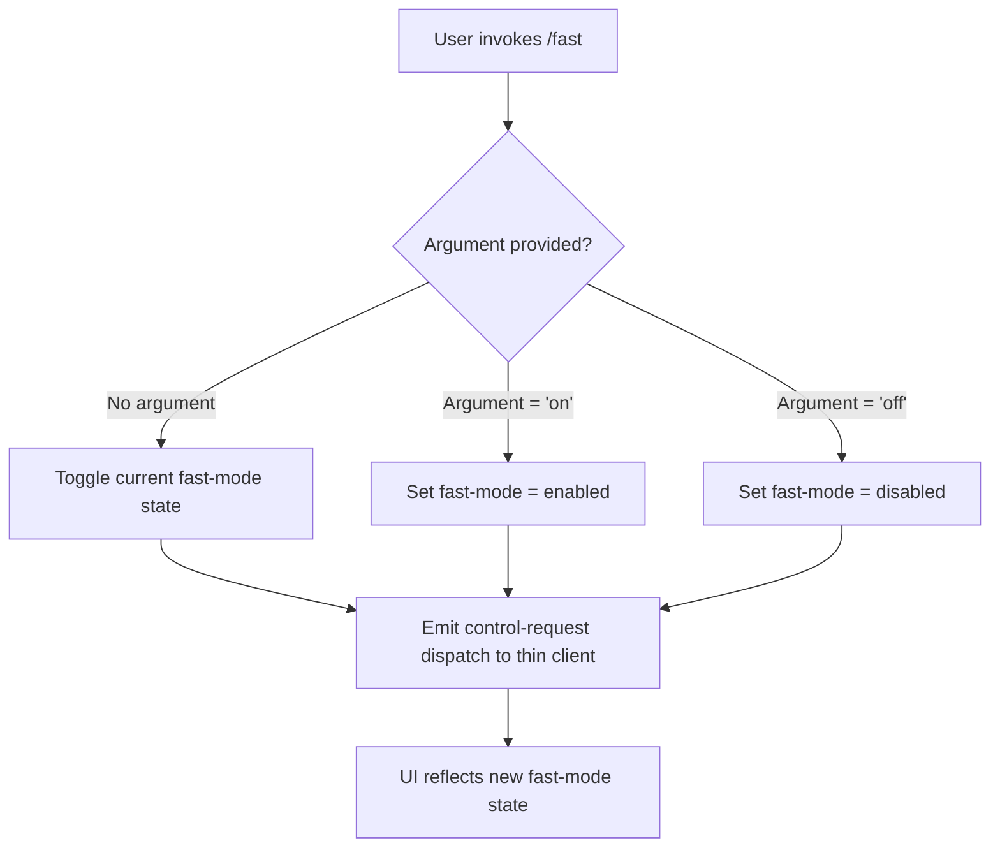

# `/fast`

> Analysis basis: CC v2.1.144 bundle.js (AST extraction + Claude interpretation)
> Minimum version: v2.1.144

---

## Overview

The `/fast` command is a local JSX slash command that toggles or explicitly sets a "fast mode" state in Claude Code. It accepts an optional `on` or `off` argument and communicates the resulting control intent to the thin client layer via a `control-request` dispatch mechanism.

---

## Registration

| Field | Value |
|---|---|
| type | `local-jsx` |
| name | `fast` |
| description | `null` |
| argumentHint | `[on|off]` |
| thinClientDispatch | `control-request` |
| module\_id | `yWq` |

Analysis basis: CC v2.1.144 bundle.js:+11448740

---

## Input Branching

The `argumentHint` of `[on|off]` indicates the command accepts zero or one optional positional argument. Based on the registration fields and the `thinClientDispatch` value of `control-request`, the following branching logic applies:



Analysis basis: CC v2.1.144 bundle.js:+11448740

---

## Behavioral Spec

### Fast Mode State Resolution

Because the AST traversal of module `yWq` did not yield recoverable entry functions at depth ≤ 2, the following pseudocode is reconstructed from the registration metadata alone.

```
function handleFastCommand(args, currentAppState):
    rawArg = args[0] if args is non-empty else null

    if rawArg == "on":
        targetState = ENABLED
    else if rawArg == "off":
        targetState = DISABLED
    else if rawArg == null:
        targetState = toggle(currentAppState.fastMode)
    else:
        return renderError("Unknown argument. Usage: /fast [on|off]")

    dispatchControlRequest({
        type: "fast-mode",
        value: targetState
    })

    return renderConfirmation(targetState)
```

Analysis basis: CC v2.1.144 bundle.js:+11448740

### Thin Client Dispatch

The registration field `thinClientDispatch: "control-request"` indicates that instead of directly mutating application state within the main Claude Code process, the command serialises its intent and forwards it as a control-request message to the thin client layer. This pattern is consistent with other local-jsx commands that affect runtime session behaviour rather than producing conversational output.

```
function dispatchControlRequest(payload):
    message = {
        channel: "control-request",
        payload: payload
    }
    thinClientBus.send(message)
```

Analysis basis: CC v2.1.144 bundle.js:+11448740

---

## State & Side Effects

| Item | Detail |
|---|---|
| Telemetry | <!-- TODO: not found in depth-2 traversal; needs --depth 4 --> |
| Hook registration | <!-- TODO: not found in depth-2 traversal; needs --depth 4 --> |
| appState changes | Fast-mode flag is toggled or explicitly set; communicated via `control-request` dispatch to thin client |
| Sound | <!-- TODO: not found in depth-2 traversal; needs --depth 4 --> |

---

## Version History

| Version | Change |
|---|---|
| v2.1.144 | Initial analysis; module `yWq` entry functions not recovered at depth ≤ 2 |

---

## Common Mistakes

1. **Providing an unrecognised argument** — The only accepted arguments are `on` and `off` (case-sensitivity is <!-- TODO: not found in depth-2 traversal; needs --depth 4 -->). Passing any other string may produce an error or be silently ignored depending on the implementation.
2. **Expecting immediate model-level changes** — Because the command operates through a `control-request` dispatch rather than a direct API parameter, fast mode takes effect at the session-control layer; the change may not be reflected until the next request cycle.
3. **Assuming a description is displayed in the command palette** — The `description` field is `null` in the registration, meaning no help text will appear alongside `/fast` in any auto-complete or command listing UI.
4. **Treating toggle behaviour as guaranteed** — The no-argument toggle path is inferred from the `[on|off]` hint pattern; the exact toggle logic is <!-- TODO: not found in depth-2 traversal; needs --depth 4 -->.

---

## Appendix — Identifier Mapping

> For bundle debugging only. Identifiers change across versions.

| Identifier | Role |
|---|---|
| `yWq` | Module containing the `/fast` command implementation (no entry functions recovered at depth ≤ 2) |