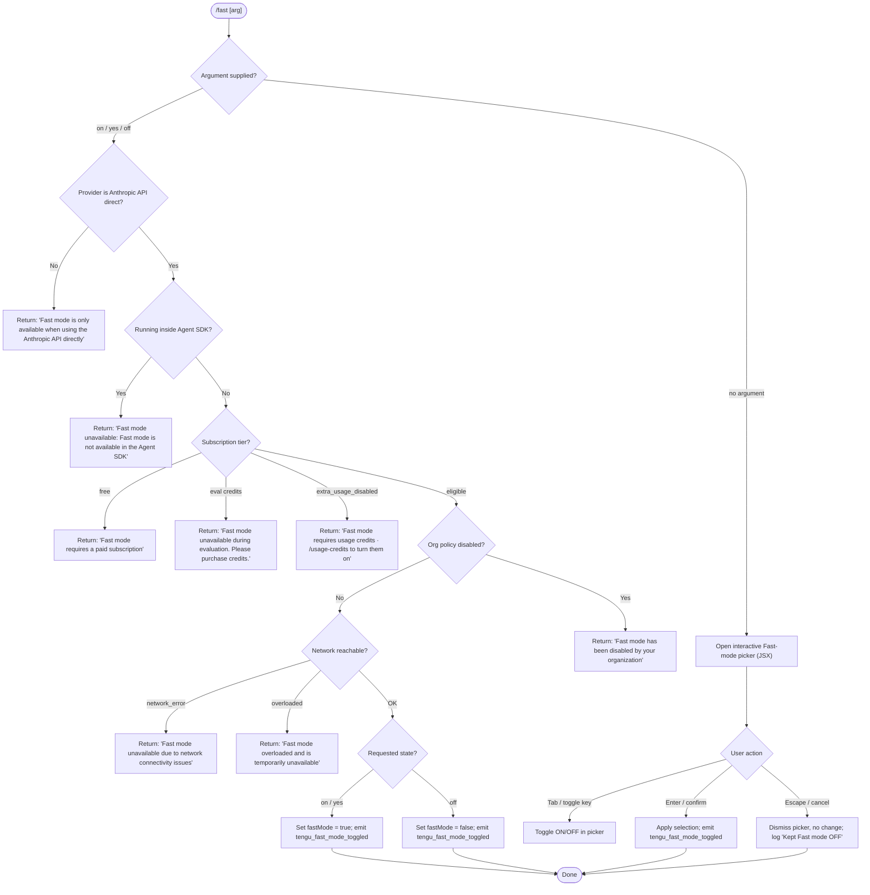

# `/fast`

> Analysis basis: CC v2.1.156 bundle.js (AST extraction + Claude interpretation)
> Minimum version: v2.1.156

---

## Overview

`/fast` toggles **Fast mode** — a research-preview feature that routes requests through a higher-performance inference path — on or off for the current session. When invoked without an argument the command opens an interactive JSX picker; when called with `on`, `off`, `yes`, or their equivalents it immediately applies the requested state. The command enforces several eligibility checks (API provider, subscription tier, org policy, network reachability) before committing the change.

---

## Registration

| Field | Value |
|---|---|
| type | `local-jsx` |
| name | `fast` |
| description | `Toggle fast mode ( ... )` |
| argumentHint | `[on\|off]` |
| immediate | `null` |
| thinClientDispatch | `control-request` |
| isHidden | `null` |
| module_id | `Md1` |
| load_inline | `true` |
| loc_byte | `12135676` |
| loc_byte_end | `12135948` |
| loc_line | `8995` |
| arbor_handler.name | `g75` |
| arbor_handler.fqn | `claude-2.1.156::g75` |
| arbor_handler.kind | `AsyncFunction` |
| arbor_handler.resolution_path | `module_id` |
| arbor_handler.n_hits | `3` |

Analysis basis: CC v2.1.156 bundle.js:+12135676

---

## Input Branching

Five or more distinct execution paths exist (argument value, provider check, subscription tier, org policy, SDK context), so a Mermaid flowchart is used.



---

## Behavioral Spec

### 1. Main handler (`g75`) — top-level dispatch

Analysis basis: CC v2.1.156 bundle.js:+12134714

```
async function fastCommandHandler(args, appState):
    normalizedArg = args.trim().toLowerCase()

    providerOk = checkProviderIsAnthropicDirect(appState)   // calls providerResolver (RK)
    if not providerOk:
        return errorMessage("Fast mode is only available when using the Anthropic API directly")

    if runningInAgentSDK():
        return errorMessage(
            "Fast mode unavailable: Fast mode is not available in the Agent SDK"
        )

    eligibility = await fetchFastModeEligibility(appState)  // calls fastModeEligibilityFetcher (uBH)

    if eligibility.reason == "free":
        return errorMessage("Fast mode requires a paid subscription")
    if eligibility.reason == "eval":
        return errorMessage("Fast mode unavailable during evaluation. Please purchase credits.")
    if eligibility.reason == "extra_usage_disabled":
        return errorMessage(
            "Fast mode requires usage credits · /usage-credits to turn them on"
        )
    if eligibility.reason == "preference" (org-disabled):
        return errorMessage("Fast mode has been disabled by your organization")
    if eligibility.reason == "network_error":
        return errorMessage("Fast mode unavailable due to network connectivity issues")
    if eligibility.reason == "overloaded":
        return errorMessage("Fast mode overloaded and is temporarily unavailable")

    if normalizedArg in ["on", "yes"]:
        setFastMode(true)
        emitTelemetry("tengu_fast_mode_toggled")
        return successView()
    elif normalizedArg == "off":
        setFastMode(false)
        emitTelemetry("tengu_fast_mode_toggled")
        return successView()
    else:
        // No argument — open picker
        emitTelemetry("tengu_fast_mode_picker_shown")
        return renderFastModePickerJSX(appState, eligibility)
```

Analysis basis: CC v2.1.156 bundle.js:+12134714 – +12134847

---

### 2. Provider resolution (`RK` / `GA`)

Checks whether the active API backend is the Anthropic first-party API. The resolver distinguishes providers including `bedrock`, `foundry`, `anthropicAws`, `mantle`, `vertex`, and `firstParty` (Analysis basis: CC v2.1.156 bundle.js:+2044303 – +2044560). Only `firstParty` allows Fast mode to proceed.

```
function isAnthropicDirectProvider(config):
    provider = resolveProvider(config)   // xH / GA
    return provider == "firstParty"
```

Analysis basis: CC v2.1.156 bundle.js:+2174386

---

### 3. Eligibility prefetch / cache (`uBH`)

The eligibility resolver first checks whether a prefetch is already in flight and returns that promise if so (log message: `"Fast mode prefetch in progress, returning in-flight promise"`). It also skips a fresh network call when data was fetched recently (`"Skipping fast mode prefetch, fetched recently"`).

```
async function fetchFastModeEligibility(appState):
    if inFlightPromise exists:
        log("Fast mode prefetch in progress, returning in-flight promise")
        return inFlightPromise

    if cachedAt is recent:
        log("Skipping fast mode prefetch, fetched recently")
        return cachedResult

    promise = callAnthropicAPI(appState)
    inFlightPromise = promise

    try:
        result = await promise
        cache(result)
        return result
    catch err:
        if isAxiosError(err) and status in [401, 403]:
            attemptOAuthRecovery(err)   // xH7 / Bp
        if networkError:
            return { reason: "network_error" }
        return { reason: "unknown" }
    finally:
        inFlightPromise = null
```

When status is `401`, the OAuth recovery sub-path (`Bp` / `xH7`) attempts:
1. SDK `getOAuthToken` callback refresh (emits `tengu_oauth_401_sdk_callback_refreshed`)
2. Disk token read (emits `tengu_oauth_401_recovered_from_disk`)
3. Keychain read (emits `tengu_oauth_401_recovered_from_keychain`)

Analysis basis: CC v2.1.156 bundle.js:+2178737 – +2179870

---

### 4. Interactive JSX picker (`vk8` / `Vk8` / `Nk8`)

When no argument is supplied, an interactive terminal UI is rendered.

```
function renderFastModePickerJSX(appState, eligibility):
    currentState = appState.fastMode     // reads "fastMode" key (bundle.js:+12130388)
    display = currentState ? "ON " : "OFF"

    render picker with:
        title: " Fast mode (research preview)"
        toggle row: "Fast mode" + display
        status indicators:
            "overloaded" → warning badge + "Fast mode overloaded and is temporarily unavailable"
            rate-limited → "You've hit your fast limit · resets in <countdown>"
        doc link: "https://code.claude.com/docs/en/fast-mode"
        key bindings:
            Tab      → "toggle"    (cycle ON/OFF)
            Enter    → "confirm"   (apply)
            Escape   → "cancel"    (dismiss, log "Kept Fast mode OFF")

    on confirm:
        newValue = selectedState
        setAppState({ fastMode: newValue })
        emitTelemetry("tengu_fast_mode_toggled")

    on cancel:
        log("Kept Fast mode OFF")
        return without changes
```

The picker uses a React memoised component with a `Symbol.for("react.memo_cache_sentinel")` sentinel (Analysis basis: CC v2.1.156 bundle.js:+12131610).

The countdown formatter (`iq`) converts a millisecond duration to a human-readable string using 86 400 000 ms/day, 3 600 000 ms/hour, and 60 s/min thresholds, bottoming out at `"0s"` (Analysis basis: CC v2.1.156 bundle.js:+208587 – +208694).

Analysis basis: CC v2.1.156 bundle.js:+12131039 – +12134517

---

### 5. Cooldown re-enable path (`c9_`)

A background listener watches for a cooldown expiry. When the cooldown period ends while Fast mode is suppressed, it automatically re-enables Fast mode and logs `"Fast mode cooldown expired, re-enabling fast mode"`.

```
function onCooldownExpired(appState):
    if appState.fastMode.state == "cooldown":
        setAppState({ fastMode: { state: "active" } })
        log("Fast mode cooldown expired, re-enabling fast mode")
        emit("l3q", "cooldown-expired")
```

Analysis basis: CC v2.1.156 bundle.js:+2176326 – +2176439

---

### 6. Org-policy / flag-settings evaluation (`he` / `E6`)

Before the eligibility API call, the org-policy resolver checks whether Fast mode has been administratively disabled. This fires telemetry `tengu_penguins_off` when the feature is suppressed by policy (Analysis basis: CC v2.1.156 bundle.js:+2175238). Error messages used:

- `"Fast mode is only available when using the Anthropic API directly"` (bundle.js:+2175132)
- `"Fast mode is not available"` (bundle.js:+2175200)
- `"Fast mode is not available in the Agent SDK"` (bundle.js:+2175454)

Analysis basis: CC v2.1.156 bundle.js:+2175100 – +2175528

---

### 7. appState `fastMode` flag persistence

The `fastMode` boolean is stored under the `"fastMode"` key in app state (bundle.js:+12130388). State reads and writes go through `useAppState` / `useSetAppState`; calling these outside `<AppStateProvider />` throws `"useAppState/useSetAppState cannot be called outside of an <AppStateProvider />"` (bundle.js:+3778482). The flag-settings system (`apply_flag_settings`, bundle.js:+12130758) can inject this value from server-side experiment assignments (`GrowthbookExperimentEvent`, bundle.js:+3181221).

---

## State & Side Effects

| Item | Detail |
|---|---|
| Telemetry: `tengu_fast_mode_toggled` | Fired every time Fast mode state is committed (on, off, or picker confirm) — bundle.js:+12131124 |
| Telemetry: `tengu_fast_mode_picker_shown` | Fired when the interactive picker is rendered (no-argument invocation) — bundle.js:+12134937 |
| Telemetry: `tengu_penguins_off` | Fired when org policy blocks Fast mode — bundle.js:+2175238 |
| Telemetry: `tengu_org_penguin_mode_fetch_failed` | Fired when the eligibility fetch fails — bundle.js:+2180239 |
| Telemetry: `tengu_oauth_401_sdk_callback_refreshed` | OAuth 401 recovery via SDK callback — bundle.js:+2957845 |
| Telemetry: `tengu_oauth_401_recovered_from_disk` | OAuth 401 recovery via disk token — bundle.js:+2958553 |
| Telemetry: `tengu_oauth_401_recovered_from_keychain` | OAuth 401 recovery via keychain — bundle.js:+2958906 |
| Telemetry: `tengu_config_parse_error` | Config file parse failure during settings load — bundle.js:+3210789 |
| Telemetry: `tengu_config_lock_contention` | Config lock held too long — bundle.js:+3208214 |
| Telemetry: `tengu_config_stale_write` | Stale config write detected — bundle.js:+3208350 |
| Telemetry: `tengu_config_auth_loss_prevented` | Auth loss in config write prevented — bundle.js:+3208693 |
| Telemetry: `tengu_feature_ok` / `tengu_feature_bad` / `tengu_feature_sad` | Feature flag evaluation outcomes — bundle.js:+965176, +965234, +965311 |
| appState changes | `fastMode` boolean toggled; cooldown state managed as `"cooldown"` → `"active"` |
| In-flight promise | A module-scoped promise prevents duplicate eligibility fetches |
| Settings persistence | Fast mode state MAY be written to `~/.claude/settings.json` (via `tB6` / `g3H.writeFile`) |
| UI render | JSX picker rendered in terminal via React with `tL.createElement` (bundle.js:+12134996) |
| Sound | <!-- TODO: not found in depth-2 traversal; needs --depth 4 --> |
| Hook registration | `_9` → `f$A.register` (bundle.js:+58450); event hooks registered during settings load |

---

## Version History

| Version | Change |
|---|---|
| v2.1.156 | Initial analysis |

---

## Common Mistakes

1. **Using `/fast` on non-Anthropic backends** — The command immediately returns an error when `bedrock`, `vertex`, `foundry`, `anthropicAws`, or `mantle` providers are active. Switch to direct API authentication first.
2. **Expecting `/fast` to work inside the Agent SDK** — Fast mode is explicitly blocked in the Agent SDK context; the error message `"Fast mode is not available in the Agent SDK"` is returned regardless of subscription.
3. **Assuming free-tier accounts can enable Fast mode** — A paid subscription is required; free and evaluation accounts receive distinct error messages.
4. **Ignoring the cooldown state** — After a rate-limit event Fast mode enters a `"cooldown"` state and is re-enabled automatically when the cooldown expires; manually toggling off during cooldown resets the user preference but does not shorten the cooldown timer.
5. **Passing an unrecognised argument** — Any argument other than `on`, `yes`, or `off` causes the picker UI to open rather than directly applying a state; there is no hard parse error, but the argument is silently ignored.
6. **Expecting instant state persistence** — Fast mode availability is fetched asynchronously; a cached result is returned when the data is recent, so the displayed state may lag a network round-trip behind actual server-side changes.

---

## Appendix — Identifier Mapping

> For bundle debugging only. Identifiers change across versions.

| Identifier | Role |
|---|---|
| `g75` | Main handler — `fastCommandHandler` (AsyncFunction, Arbor-resolved) |
| `RK` | Provider string resolver |
| `GA` | API provider enum lookup |
| `xH` | Provider identifier normaliser |
| `he` | Org-policy / flag-settings eligibility checker |
| `E6` | Flag-settings evaluator (Growthbook / experiment) |
| `hz6` | Flag-settings sub-resolver A |
| `Sz6` | Flag-settings sub-resolver B |
| `Mx` | Flag value formatter |
| `fx` | Feature-flag store reader |
| `y88` | Experiment assignment resolver |
| `$z_` | Growthbook experiment emitter |
| `wz_` | Experiment variant writer |
| `b6` | Settings file writer |
| `B6` | Settings directory resolver |
| `vz_` | Settings path helper |
| `bzH` | Config file read/write/backup utility |
| `Y17` | File watcher registration |
| `N` | Logging / output helper |
| `URK` | Log formatter |
| `$$A` | Log level filter |
| `RH` | JSON serialiser wrapper |
| `v4` | Path redaction helper (replaces home dir with `[REDACTED]`) |
| `FzA` | Path segment mapper |
| `HuH` | Terminal write helper |
| `yzA` | Raw stdout write |
| `gRK` | Transcript / debug log writer |
| `kxH` | Batched write scheduler (uses `setTimeout`, `setImmediate`) |
| `cMH` | Log file path builder |
| `B16` | EISDIR error handler |
| `rzA` | Log rotation path resolver |
| `izA` | Log file renamer / unlinker |
| `FRK` | Log file append + rotate |
| `_9` | Hook registration dispatcher |
| `GxH` | VS Code integration guard (`claude-vscode`) |
| `h8` | Settings loader (disk read entry) |
| `iF6` | Settings cache lookup |
| `x3A` | Settings LRU cache has/get |
| `Uo8` | Settings parser (policy + flag layers) |
| `u3A` | Settings LRU cache set |
| `ig` | Settings object builder |
| `$_` | Observable store factory |
| `aL6` | WSL path adapter |
| `Q9_` | Network-error string classifier |
| `Bx4` | Auth-type detector (`oauth` / `api-key`) |
| `uBH` | Fast-mode eligibility fetcher / prefetch cache |
| `q1` | Network traffic classification (`essential-traffic`, `no-telemetry`) |
| `zEA` | Traffic class resolver |
| `a2` | Auth credential assembler |
| `u$` | API key / OAuth token resolver |
| `lK` | Env-var key reader |
| `pN` | API-key-file-descriptor reader |
| `SO6` | `apiKeyHelper` resolver |
| `oJ` | Auth-none handler |
| `lf6` | File-descriptor token reader |
| `bP` | OAuth token builder |
| `_R` | Token string slicer (first 20 chars) |
| `fV` | Auth type validator |
| `Qx4` | Request header builder (beta + x-api-key) |
| `Sq` | OAuth base-URL resolver |
| `AZA` | Environment stage resolver (`prod`, `staging`) |
| `q64` | Localhost URL selector |
| `Bp` | OAuth 401 recovery orchestrator |
| `xH7` | OAuth refresh flow (SDK callback + disk + keychain) |
| `TzH` | OAuth token refresher (Ly) |
| `yH` | Feature-flag "ok" emitter |
| `uH` | Feature-flag "sad" emitter |
| `ki` | Token file-descriptor credential reader |
| `oK` | MCP tool call invoker |
| `hH` | Streaming response accumulator |
| `WO` | Streaming response finaliser |
| `U_` | Settings-to-disk writer |
| `wO` | Settings compound builder |
| `K$H` | Settings path composer (user / project / local) |
| `zP` | Git-ignore rule applier |
| `Mi` | File reader with replaceAll (4096 byte chunk) |
| `P8` | EISDIR + J8 error guard |
| `mr8` | Settings timestamp recorder |
| `mGH` | Settings module path resolver |
| `nF6` | Settings file canonical path resolver |
| `$L6` | Atomic file writer (temp → rename, fchmod, fsync) |
| `Xz` | Settings cache clearer |
| `tB6` | Git-aware settings writer |
| `C6` | Zustand store accessor |
| `Tr8` | I4 transform helper |
| `sB6` | `git check-ignore` runner |
| `Pq4` | Global gitignore path resolver |
| `oNA` | `git ls-files --error-unmatch` runner |
| `hb` | `.claude/settings.json` path builder |
| `t6` | Feature-flag "bad" emitter |
| `vp` | Settings load orchestrator |
| `gE` | Pre-load hook runner |
| `T9` | Memory usage sampler |
| `Bo8` | Settings load event emitter |
| `O8` | Global config save (with lock) |
| `hz_` | Config lock-based save with backup rotation |
| `o$q` | Backup metadata object builder |
| `Sz_` | Backup directory path builder |
| `pBq` | Config entry iterator |
| `JQH` | Config save timestamp recorder |
| `yz_` | Config save (no-lock fallback) |
| `vk8` | Fast-mode picker rendering wrapper |
| `Vk8` | Picker state machine |
| `WOH` | Picker "off" state constant |
| `Qy` | CCR flag reader |
| `W3` | `aWH` flag resolver |
| `xBH` | Model display name builder |
| `Ii` | Model string formatter |
| `vP` | Model capability descriptor |
| `f2H` | Flag-settings type coercer (String / Number / Boolean) |
| `WY` | Model picker row renderer |
| `w0` | Full model list builder |
| `e9` | Model alias resolver (`opusplan`, `sonnet`, `haiku`, `best`) |
| `L2H` | Theme + prompt-border renderer |
| `Ox` | Theme resolver |
| `LY6` | Dark theme constant (`dark`) |
| `R_8` | Light theme variants (`light`, `light-ansi`, `dark-ansi`, …) |
| `UzH` | ANSI colour prefix stripper |
| `KQq` | Auto theme fallback |
| `g4` | MCP server builder helper |
| `tE` | Tool set builder |
| `PA` | Prompt-border colour resolver |
| `lzH` | ANSI/hex/rgb colour name-to-chalk mapper |
| `Hd` | Border style finaliser |
| `Up` | Model string short-name extractor |
| `J9` | Completions renderer |
| `Ce` | Completion item builder |
| `av` | Completion text formatter |
| `_9H` | Completion prefix handler |
| `WQ` | Suggestion list builder |
| `$X` | Suggestion filter |
| `O9` | Input normaliser / sanitiser |
| `Ti6` | Tool-call context reader |
| `i_` | Settings-aware context helper |
| `_w` | Text inclusion filter |
| `Hp8` | Help text renderer |
| `NP` | Input replace helper |
| `$V` | Number display formatter |
| `A$q` | Integer / float discriminator |
| `kTH` | Combined model+input normaliser |
| `Nk8` | Main picker JSX component |
| `w6` | Zustand external store subscriber |
| `ej_` | App-state context accessor |
| `fA` | App-state store snapshot reader |
| `c9_` | Cooldown expiry watcher / re-enabler |
| `bo1` | Background task runner |
| `Si` | Status display builder |
| `C1H` | Status text trimmer |
| `o9` | AsyncLocalStorage store reader |
| `MI6` | Daemon status file path builder (`daemon.status.json`) |
| `MA` | MCP handler registrar |
| `Hj` | MCP context hook |
| `M` | MCP server map manager |
| `vSH` | MCP server connection orchestrator |
| `v8H` | MCP connection slot builder |
| `Pk` | MCP transport picker |
| `H_` | Identity helper |
| `nV6` | MCP slot filter |
| `BpL` | MCP connection pool limiter |
| `IM8` | MCP cache reader |
| `NM8` | MCP tool-call dispatcher |
| `L8` | MCP debug logger |
| `pc_` | MCP OAuth flow handler |
| `Uc_` | MCP OAuth callback completer |
| `j21` | MCP reconnect scheduler |
| `mc_` | MCP error dispatcher |
| `Ak_` | MCP orphan connection disposer |
| `dL` | MCP error logger |
| `ZH` | String error code formatter |
| `O21` | MCP server zoo iterator |
| `iV6` | MCP port parser (parseInt) |
| `Ul_` | MCP second port parser |
| `JGK` | MCP connection result applier |
| `wZ8` | MCP update applier |
| `ok` | MCP slot cleanup runner |
| `Gm5` | Global MCP server reconciler |
| `SM8` | MCP slot has-check (vn7 / Nn7) |
| `Q8` | Abort-controller wrapper with timeout |
| `dH6` | MCP server diagnostics reader |
| `iq` | Duration countdown formatter (ms → human string) |

---

Note: index built via Arbor fallback; some signals (telemetry, literals) may be missing — see arbor-fallback.js.