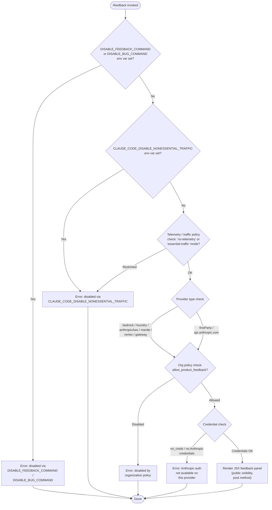

# `/feedback`

> Analysis basis: CC v2.1.154 bundle.js (AST extraction + Claude interpretation)
> Minimum version: v2.1.154

---

## Overview

The `/feedback` command (also accessible as `/share` and `/bug`) opens an interactive JSX-rendered UI panel that allows users to submit product feedback, report bugs, or share their current conversation with Anthropic. Before presenting the UI, the command executes a multi-stage eligibility check that gates access based on environment variables, telemetry policy, provider type, and organizational policy. If any gate fails, the command returns a descriptive error message instead of launching the panel.

---

## Registration

| Field | Value |
|---|---|
| type | `local-jsx` |
| name | `feedback` |
| description | `Submit feedback, report a bug, or share your conversation` |
| argumentHint | `[report]` |
| aliases | `share`, `bug` |
| module_id | `DV1` |
| load_inline | `true` |
| loc_byte | `10729554` |
| loc_byte_end | `10729777` |
| loc_line | `7608` |
| arbor_handler.name | `RlL` |
| arbor_handler.fqn | `claude-2.1.154::RlL` |
| arbor_handler.kind | `AsyncFunction` |
| arbor_handler.resolution_path | `module_id` |
| arbor_handler.n_hits | `0` |

Analysis basis: CC v2.1.154 bundle.js:+10729554

---

## Input Branching

The command's pre-flight eligibility check involves more than three distinct branches, requiring a Mermaid flowchart.



---

## Behavioral Spec

### Handler Entry Point

The Arbor-resolved handler `RlL` (an `AsyncFunction`) is the top-level entry point for `/feedback`. It delegates immediately to the JSX component factory `YV1`, which constructs and returns the rendered panel.

Analysis basis: CC v2.1.154 bundle.js:+10729385

### Stage 1 — Environment Variable Gate

```
function checkDisablementEnvVars(context):
    if env("DISABLE_FEEDBACK_COMMAND") is set:
        return error("/feedback has been disabled via the DISABLE_FEEDBACK_COMMAND environment variable")
    if env("DISABLE_BUG_COMMAND") is set:
        return error("/feedback has been disabled via the DISABLE_BUG_COMMAND environment variable")
    return OK
```

Analysis basis: CC v2.1.154 bundle.js:+10707521, +10707539, +10707693

### Stage 2 — Non-Essential Traffic / Telemetry Policy Gate

```
function checkTrafficPolicy(config):
    policy = resolveTrafficPolicy(config)   // returns "no-telemetry" | "essential-traffic" | "default"
    if policy in ["no-telemetry", "essential-traffic"]:
        return error("/feedback has been disabled via the CLAUDE_CODE_DISABLE_NONESSENTIAL_TRAFFIC environment variable")
    return OK
```

The traffic policy resolver (`zEA` / `q1`) maps the raw config value against the string constants `"no-telemetry"` (bundle.js:+969254), `"essential-traffic"` (bundle.js:+969195), and `"default"` (bundle.js:+969328).

Analysis basis: CC v2.1.154 bundle.js:+10707811, +969195, +969254, +969328

### Stage 3 — Provider Identification

```
function identifyProvider(apiConfig):
    // Checks apiConfig against known provider identifiers in order:
    knownProviders = [
        ("bedrock",       "Amazon Bedrock"),
        ("foundry",       "Microsoft Foundry"),
        ("anthropicAws",  "Claude Platform on AWS"),
        ("mantle",        "Amazon Bedrock (Mantle)"),
        ("vertex",        "Vertex AI"),
        ("gateway",       "an API gateway"),
        ("firstParty",    "Anthropic direct"),   // api.anthropic.com
    ]
    for (providerKey, displayName) in knownProviders:
        if apiConfig matches providerKey:
            return (providerKey, displayName)
    return ("firstParty", "Anthropic direct")
```

The string `"api.anthropic.com"` (bundle.js:+2045234) is the canonical indicator for first-party access. The `GA` / provider-resolver function compares the active API endpoint or config flag against all provider keys.

Analysis basis: CC v2.1.154 bundle.js:+2044343, +2044393, +2044449, +2044503, +2044551, +2044560, +10708107, +10708182, +10708253, +10708337, +10708420, +10708505

### Stage 4 — Organizational Policy Gate

```
function checkOrgPolicy(session):
    if session.plan in ["enterprise", "team"]:
        allowed = session.flags["allow_product_feedback"]
        if not allowed:
            return error("/feedback has been disabled by your organization's policy")
    return OK
```

The flag name `"allow_product_feedback"` (bundle.js:+4105109) is checked against the resolved session flags. The plan values `"enterprise"` (bundle.js:+4104833) and `"team"` (bundle.js:+4104868) trigger this check; other plan types bypass it.

Analysis basis: CC v2.1.154 bundle.js:+4105109, +4104833, +4104868, +10707975

### Stage 5 — Credential Gate

```
function checkCredentials(authState):
    if authState.status == "no_creds":
        return error("no Anthropic credentials")
    // Third-party provider path:
    if provider is thirdParty:
        note("Anthropic auth not used on third-party providers")  // non-fatal info
    // OAuth check:
    if oauthToken is absent:
        if provider is cloudGateway:
            return error("Not available when using a Cloud gateway")
        return error("No OAuth token available")
    // API key fallback:
    if apiKey is absent:
        return error("No API key available")
    return OK
```

Relevant constants: `"no_creds"` (bundle.js:+10708582), `"no Anthropic credentials"` (bundle.js:+10708599), `"No OAuth token available"` (bundle.js:+2978898), `"Not available when using a Cloud gateway"` (bundle.js:+2979048), `"No API key available"` (bundle.js:+2979133), `"ANTHROPIC_API_KEY"` (bundle.js:+2945727).

Analysis basis: CC v2.1.154 bundle.js:+10708582, +10708599, +2978898, +2979133

### Stage 6 — Panel Rendering

```
async function renderFeedbackPanel(context, args):
    sessionId  = generateSessionId()         // uses Math.random (H), Date.now (zV1)
    timeout    = 30000                       // ms; bundle.js:+10728943
    visibility = "public"                    // bundle.js:+10729360
    method     = "post"                      // bundle.js:+10708639
    panel      = createElement(FeedbackUI, {
        sessionId,
        visibility,
        method,
        provider: identifiedProvider,
        ...context,
    })
    return panel
```

The JSX component factory (`YV1`) calls `gr_.createElement` (bundle.js:+10729167) to construct the UI. A session timestamp is computed via `zV1` / `Date.now` with a 30 000 ms expiry window (bundle.js:+10728924, +10728943). A random jitter is applied via `H` / `Math.random` (bundle.js:+13408200) before an internal `setTimeout` (bundle.js:+13408237).

Analysis basis: CC v2.1.154 bundle.js:+10729167, +10729360, +10708639, +10728924, +10728943

### Authentication Header Assembly (qU / credential-builder path)

```
function buildAuthHeaders(provider, authState):
    if provider is thirdParty:
        raise "Anthropic auth not used on third-party providers"
    if oauthToken available:
        headers["anthropic-beta"] = ...   // bundle.js:+2978982
        return headers
    if apiKey available:
        headers["x-api-key"] = apiKey     // bundle.js:+2979173
        return headers
    raise "No API key available"
```

Analysis basis: CC v2.1.154 bundle.js:+2978754, +2978783, +2978838, +2978898, +2978982, +2979048, +2979133, +2979173

---

## State & Side Effects

| Item | Detail |
|---|---|
| Telemetry | No `tengu_*` events detected in depth-2 traversal (`telemetry: []`) |
| Hook registration | None detected at depth ≤ 2 |
| appState changes | None detected directly; session timestamp written via `zV1` / `Date.now` at panel creation (bundle.js:+10728924) |
| Sound | None detected |
| Environment reads | `DISABLE_FEEDBACK_COMMAND`, `DISABLE_BUG_COMMAND`, `CLAUDE_CODE_DISABLE_NONESSENTIAL_TRAFFIC` |
| Network | HTTP `POST` to Anthropic feedback endpoint; uses `api.anthropic.com` base URL (bundle.js:+2045234); visibility set to `"public"` |
| Timeout | 30 000 ms panel/session timeout (bundle.js:+10728943) |
| File I/O | `PEK.unlinkSync` reachable via `q` path (bundle.js:+15456916) — likely temp-file cleanup for shared conversation export |

---

## Version History

| Version | Change |
|---|---|
| v2.1.154 | Initial analysis |

---

## Common Mistakes

1. **Using `/bug` expecting different behavior from `/feedback`** — both aliases (`/share`, `/bug`) resolve to the same handler (`RlL`) with identical eligibility checks; there is no dedicated bug-only flow.
2. **Setting `DISABLE_FEEDBACK_COMMAND` and expecting `/share` to still work** — all three aliases are disabled by the same gate; the error message names the specific env var matched.
3. **Assuming feedback is available on all providers** — third-party providers (Bedrock, Vertex, Foundry, etc.) may be rejected at the credential gate since Anthropic OAuth/API-key auth is not forwarded through those providers.
4. **Expecting feedback to work in `no-telemetry` or `essential-traffic` environments** — the non-essential traffic gate fires before any provider check, so the command is unconditionally disabled in those environments regardless of credentials.
5. **Assuming enterprise/team org policies default to allowing feedback** — `allow_product_feedback` must be explicitly enabled; its absence is treated as disabled (bundle.js:+4105109).

---

## Appendix — Identifier Mapping

> For bundle debugging only. Identifiers change across versions.

| Identifier | Role |
|---|---|
| `RlL` | Top-level async handler for `/feedback` (Arbor-resolved entry point; `fqn: claude-2.1.154::RlL`) |
| `YV1` | JSX panel component factory; constructs and returns the feedback UI element |
| `oSH` | Multi-stage eligibility checker; orchestrates env-var, traffic-policy, provider, org-policy, and credential gates |
| `xH` | String utility / coercion helper (called from multiple sites) |
| `q1` | Traffic/telemetry policy resolver; maps raw config to `"no-telemetry"` / `"essential-traffic"` / `"default"` |
| `zEA` | Inner policy value extractor called by `q1` |
| `v9` | Organizational policy and provider flag checker; reads `allow_product_feedback` |
| `H89` | Sub-check within org policy path |
| `iD6` | Flag resolution helper used inside org policy check |
| `CR` | Credential resolver / auth-state builder |
| `GA` | Provider identifier / API endpoint classifier |
| `R5` | Sub-helper called during credential resolution |
| `u$` | Auth token assembler (OAuth + API-key logic) |
| `bP` | Token fetch / profile-implicit auth helper |
| `VKH` | Auxiliary string helper within provider check |
| `q` | Temp-file path tracker; calls `PEK.unlinkSync` for cleanup |
| `qU` | Auth header builder for feedback HTTP request |
| `FQ` | Inner helper called by auth header builder |
| `PO` | Provider-type predicate used in auth header path |
| `EA` | HTTP credential assembly sub-function |
| `TY` | Token resolution helper within `EA` |
| `HR` | Array/type check utility (uses `Array.isArray`) |
| `a2` | Auxiliary auth-state helper called within `qU` path |
| `H` | Random jitter generator (uses `Math.random` + `setTimeout`) |
| `zV1` | Session timestamp generator (uses `Date.now`; 30 000 ms window) |

---

Note: index built via Arbor fallback; some signals (telemetry, literals) may be missing — see arbor-fallback.js.