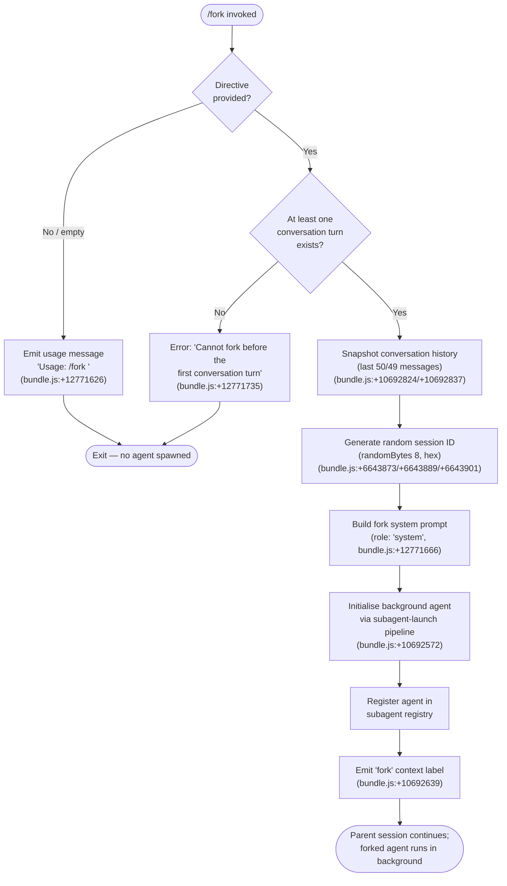

# `/fork`

> Analysis basis: CC v2.1.156 bundle.js (AST extraction + Claude interpretation)
> Minimum version: v2.1.156

---

## Overview

`/fork` spawns a background agent process that inherits the full conversation history of the current session. The user supplies a `<directive>` string that instructs the forked agent what to do independently; the parent session continues running normally. The command requires at least one completed conversation turn before it can be invoked.

---

## Registration

| Field | Value |
|---|---|
| type | `local-jsx` |
| name | `fork` |
| description | `Spawn a background agent that inherits the full conversation` |
| argumentHint | `<directive>` |
| module_id | `yHK` |
| load_inline | `true` |
| loc_byte | `12771998` |
| loc_byte_end | `12772194` |
| loc_line | `9998` |
| arbor_handler.name | `Ww5` |
| arbor_handler.fqn | `claude-2.1.156::Ww5` |
| arbor_handler.kind | `AsyncFunction` |
| arbor_handler.resolution_path | `module_id` |
| arbor_handler.n_hits | `0` |

Analysis basis: CC v2.1.156 bundle.js:+12771998

---

## Input Branching

The command has 3+ distinct paths depending on directive presence and conversation state.



---

## Behavioral Spec

### 1. Handler Entry — directive validation

```
async function forkCommandHandler(ctx, args):
    directive = args.trim()                          // bundle.js:+12771602
    if directive is empty:
        display("Usage: /fork <directive>")          // bundle.js:+12771626
        return

    history = getConversationHistory(ctx)
    if history has no completed turns:
        throw Error("Cannot fork before the first conversation turn")  // bundle.js:+12771735
```

Analysis basis: CC v2.1.156 bundle.js:+12771602, +12771626, +12771735

### 2. Conversation History Snapshot

The handler calls the history-building function (identifer `_lL`) which calls `getAppState`, then takes a slice of the message array capped at 50 characters-worth of recent turns (constants 50 and 49 at bundle.js:+10692824 and +10692837). The history is transformed to the serialisable "resume" format (literal `"resume"` at bundle.js:+10692758).

```
function buildForkHistory(appState):
    allMessages = Array.from(appState.messages)
    // Apply allowed_tools / disallowed_tools / avoid_prompts filters
    // (literals at +10669705, +10669760, +10669821)
    slicedMessages = allMessages.slice(-(50 or 49))  // bundle.js:+10692827
    return slicedMessages
```

Analysis basis: CC v2.1.156 bundle.js:+10692552, +10692827

### 3. Session ID Generation

A cryptographically random 8-byte identifier is generated and encoded as hex, producing a 16-character session ID.

```
function generateForkSessionId():
    raw = randomBytes(8)          // bundle.js:+6643873, constant 8 at +6643889
    return raw.toString("hex")    // bundle.js:+6643901
```

Analysis basis: CC v2.1.156 bundle.js:+6643873

### 4. System Prompt Construction

A `"system"` role message is built for the forked agent. The system prompt is assembled by the system-prompt builder (`kT` → many sub-builders: `az6` for memory, `JX5`/`jX5` for environment info, `PX5` for worktree context, etc.). Key prompt-feature flags consulted at this stage:

- `allowed_tools`, `disallowed_tools`, `avoid_prompts` — tool policy (bundle.js:+10669705–+10669821)
- `effort`, `model` — effort and model selection (bundle.js:+10669923, +10669936)
- `bg-session` output style label applied to the fork (literal at bundle.js:+13085055)
- Default model hint in the system context: `claude-opus-4-7` (bundle.js:+13093729)

```
function buildForkSystemPrompt(config, conversationSnapshot):
    base = buildAgentBasePrompt(config)      // "You are an interactive agent…"
    memorySection = loadMemory(config)       // az6 pipeline
    envSection = buildEnvInfo(config)        // JX5 / jX5
    worktreeSection = buildWorktreeContext() // PX5
    briefSection = buildBriefIfEnabled()     // TX5
    return assemblePrompt(base, memorySection, envSection, worktreeSection, briefSection)
```

Analysis basis: CC v2.1.156 bundle.js:+12771666, +12771694, +13085055

### 5. Background Agent Spawn

The forked agent is launched through the sub-agent pipeline (`peH` → `ahH`). This pipeline:

1. Creates necessary directories (`Bs.mkdir`) and optionally symlinks (bundle.js:+12948406).
2. Opens a transcript file (`Bs.open` via `utH`) for the forked session.
3. Registers the agent in the global subagent registry (`Qy8.add`; registry cleanup via `Qy8.delete` on completion — bundle.js:+12946194, +12946219).
4. Launches the local-agent process (state `"local_agent"`, `"running"`, `"general-purpose"` — bundle.js:+10240494, +10240539, +10240613).
5. Registers a stall watchdog; timeout constant 600,000 ms (10 minutes) with an interval of 10 ms (bundle.js:+6732032, +6732027).

```
async function spawnForkAgent(sessionId, systemPrompt, history, directive):
    ensureDirectory(sessionStorePath)           // bundle.js:+12948088
    transcript = openTranscriptFile(sessionId)  // bundle.js:+12948231
    agentRegistry.add(sessionId)               // bundle.js:+12946194
    process = launchLocalAgent({
        id: sessionId,
        systemPrompt: systemPrompt,
        history: history,
        initialMessage: directive,
        outputStyle: "bg-session",             // bundle.js:+13085055
        status: "running"                      // bundle.js:+10240539
    })
    registerStallWatchdog(process, timeout=600000)  // bundle.js:+6732032
    return process
```

Analysis basis: CC v2.1.156 bundle.js:+10692894, +12948231, +12946194, +6732032

### 6. Post-spawn Telemetry and Context Label

After successful launch the handler emits the `"subagent_launch"` event (bundle.js:+10692572) and writes a context label `"fork"` (bundle.js:+10692639) to the parent session's REPL context via `"resume"` mode (bundle.js:+10692758).

```
function postSpawnSetup(ctx, forkSessionId):
    emitTelemetry("subagent_launch", {sessionId: forkSessionId})
    ctx.setReplContext("fork", forkSessionId)  // bundle.js:+10692639
    ctx.label = "resume"                        // bundle.js:+10692758
```

Analysis basis: CC v2.1.156 bundle.js:+10692572, +10692639, +10692758

### 7. Pre-flight Guard: Missing Directive Telemetry

If the directive is absent the command emits `"subagent_fork_prompt_missing"` before returning (bundle.js:+10692590).

```
function guardEmptyDirective(directive):
    if directive is empty:
        emitTelemetry("subagent_fork_prompt_missing")  // bundle.js:+10692590
        display("Usage: /fork <directive>")
        return ABORT
```

Analysis basis: CC v2.1.156 bundle.js:+10692590

### 8. Stall Watchdog and Lifecycle Events

The spawned background agent is monitored by a watchdog loop (function `krH`). Key lifecycle string constants observed:

| Constant | bundle.js offset |
|---|---|
| `"subagent_complete"` | +6733160 |
| `"subagent_stall_timeout"` | +6733180 |
| `"user_kill_async"` | +6735021 |
| `"subagent_async_errored"` | +6735292 |
| Stall watchdog label `"watchdog_stall"` | +6732518 |
| Watchdog interval 10 ms | +6732027 |
| Watchdog timeout 600,000 ms | +6732032 |
| Progress report label `"query_progress"` | +6733422 |
| Throttle factor 0.1 | +6733362 |
| Max column width 80 | +6735251 |

Analysis basis: CC v2.1.156 bundle.js:+6732027, +6732032, +6733160

---

## State & Side Effects

| Item | Detail |
|---|---|
| Telemetry — subagent launch | `tengu_forked_agent_default_turns_exceeded` (bundle.js:+10668475) emitted when forked agent exceeds default turn count |
| Telemetry — auto-mode | `tengu_auto_mode_decision` (bundle.js:+6730665) — classifier result for sub-agent tool use |
| Telemetry — agent tool | `tengu_agent_tool_completed` (bundle.js:+6729022), `tengu_agent_tool_terminated` (bundle.js:+6734851) |
| Telemetry — agent summary | `tengu_agent_summary_skipped` (bundle.js:+9297066) |
| Telemetry — async stall | `tengu_async_agent_stall_timeout` (bundle.js:+6732923) |
| Telemetry — cache eviction | `tengu_cache_eviction_hint` (bundle.js:+6729565) |
| Telemetry — slim subagent | `tengu_slim_subagent_claudemd` (bundle.js:+9286985) |
| Telemetry — memory prompt | `tengu_moth_copse` (bundle.js:+3298321), `tengu_memdir_disabled` (bundle.js:+3299257), `tengu_herring_clock` (bundle.js:+3299453) |
| Filesystem | Creates session directory; opens transcript `.jsonl` file; optionally creates symlinks; removes `unlinkSync` on cleanup |
| appState changes | Subagent entry added to global agent registry; REPL context updated with fork label and session ID |
| Hook registration | `K.register` called during agent setup (bundle.js:+10240805); stall watchdog registered with `setTimeout`/`clearTimeout` |
| Sound | None observed in depth-2 traversal |
| Abort signal | `AbortController` created per fork; `"abort"` event wired (bundle.js:+4707612); signal propagated on user kill |
| Error codes | `EEXIST` (bundle.js:+12948442), `ENOSPC` (+12948537), `EDQUOT` (+12948551) handled during directory/file creation |

---

## Version History

| Version | Change |
|---|---|
| v2.1.156 | Initial analysis |

---

## Common Mistakes

1. **Invoking `/fork` before the first turn**: The command enforces that at least one completed conversation turn exists. Running `/fork` immediately after starting a session produces the error `"Cannot fork before the first conversation turn"` and no agent is spawned.
2. **Omitting the directive**: Calling `/fork` with no argument or only whitespace produces only the usage hint `Usage: /fork <directive>` and emits `subagent_fork_prompt_missing` telemetry. No background agent is created.
3. **Assuming the fork shares tool permissions interactively**: The forked agent runs as a background session (`"bg-session"` output style) with its own permission context. Permissions are not dynamically inherited from the parent's current interactive state.
4. **Expecting unlimited runtime**: The stall watchdog hard-kills the forked agent after 600,000 ms (10 minutes) of stall with no progress, emitting `"subagent_stall_timeout"`.
5. **Using relative paths inside the fork**: A literal injected into the fork's system prompt warns that agent threads always have their working directory reset between bash calls and absolute file paths must be used (bundle.js:+13090353).

---

## Appendix — Identifier Mapping

> For bundle debugging only. Identifiers change across versions.

| Identifier | Role |
|---|---|
| `Ww5` | Main handler for `/fork` command (AsyncFunction, arbor-resolved) |
| `Zr_` | Fork subagent launch orchestrator |
| `_lL` | Conversation history builder / snapshot helper |
| `Z_` | App-state message accessor |
| `jE8` | Allowed-tools filter builder |
| `JE8` | Disallowed-tools filter builder |
| `kT` | System prompt assembler (coordinates all sub-builders) |
| `dqA` | Prompt base-text selector |
| `iqA` | Model-selection and effort-level handler |
| `vX5` | Wrapper delegating to model-selection handler |
| `$X5` | Tool-policy and schedule/routines section builder |
| `az6` | Memory-load prompt builder (auto memory, team memory) |
| `JX5` | Environment info (static) prompt section builder |
| `jX5` | Environment info (simple / worktree) prompt section builder |
| `PX5` | Worktree context prompt section builder |
| `WX5` | Working-directory section builder |
| `TX5` | Brief-mode section builder |
| `VX5` | Focus / scratchpad section builder |
| `YX5` | Environment label section builder |
| `eJ5` | Tone-and-style / output-style section builder |
| `cV9` | Tool-computation / plugin section builder |
| `qX5` | System section builder |
| `KX5` | Doing-tasks section builder |
| `LX5` | Delegation to model-selection section |
| `fX5` | Using-tools section builder |
| `OX5` | Additional system prompt section builder |
| `BFq` | Memory-combined section finaliser |
| `GzH` | Provider-type section builder (firstParty / anthropicAws) |
| `su` | Agent memory loader |
| `rR` | Memory file reader |
| `G_` | Hook/module registration helper |
| `peH` | Background agent session initialiser |
| `ahH` | Low-level agent session file-system setup |
| `Qy8` | Subagent registry (add/delete/finally) |
| `WqA` | Session directory creator |
| `N3` | Transcript path joiner |
| `utH` | Transcript file opener |
| `ME` | Subagents path resolver |
| `ny` | AbortController factory |
| `C1` | AbortSignal max-listeners setter |
| `eE7` | Abort event handler (deref) |
| `HV7` | Abort event cleanup handler (deref) |
| `J2` | Agent session timestamp recorder |
| `krH` | Background agent watchdog / lifecycle loop |
| `Q` | IPC-file queue helpers |
| `DN6` | IPC read-file handler |
| `rI1` | IPC unlink handler |
| `y` | Stream write helper |
| `z` | Daemon write stream |
| `R` | Agent result renderer |
| `lEK` | Real-path / stat resolver |
| `h` | Away-summary blur handler |
| `k` | Away-summary cache checker |
| `FP6` | Forked-agent state updater |
| `al_` | Timestamp / state update helper |
| `kO` | Flush-and-delete helper for agent state |
| `i7H` | Agent notification dispatcher |
| `J5` | HTML-entity replacer |
| `NrH` | Message filter for subagent events |
| `DK` | Text-type message filter |
| `RkH` | Tool-result accumulator |
| `WK` | Cached-result lookup / memoiser |
| `gP6` | Per-turn agent-event processor |
| `Kg_` | Tool-set change tracker |
| `u0` | Agent turn runner (model call loop) |
| `Z8` | UUID generator wrapper |
| `Ff1` | State-update / Gt pipeline helper |
| `GrH` | Task-progress timestamp recorder |
| `f38` | Subagent-end / completion handler |
| `fE` | Last-assistant-message finder |
| `Y4` | Span event emitter |
| `A7H` | Span hash / classifier helper |
| `hi7` | Span-seen deduplication checker |
| `z38` | Agent state updater on completion |
| `yH` | Logging utility (`d` wrapper) |
| `O38` | Auto-mode decision handler |
| `lk9` | Classifier request builder |
| `mP6` | Auto-mode classifier runner |
| `tm` | Classifier intermediate helper |
| `vjH` | Killed-agent state updater |
| `ZH` | String coercion utility |
| `Eh` | Main REPL session runner (subagent main loop) |
| `E6` | Event-emitter / notification helper |
| `pV9` | DNS/path store setter |
| `QM8` | MCP monitor helper |
| `cN9` | MCP watch-key getter/setter |
| `dN9` | Math.abs / UmH helper |
| `Fn7` | Push-to-Yk_ helper |
| `e4H` | Snapshot load/dump helper |
| `MH` | Interactive REPL UI / input handler |
| `HH` | Voice recording session handler |
| `tH` | MCP server list builder |
| `mH` | Dynamic MCP tool-schema builder |
| `AH` | MCP connection handler |
| `ao` | Tool-permit / classifier permit accumulator |
| `Uk_` | Permission-set filter |
| `BO` | Binary operator / substring helper |
| `y0` | CLI-source context builder |
| `QI8` | Voice-stream WebSocket handler |
| `cNL` | System-prompt getter for subagent |
| `rZ6` | System-prompt feature-flag mapper |
| `aZ6` | Subagent-start event builder |
| `D7` | Tool-description builder |
| `gX` | Core agent query runner (main model loop) |
| `Eq` | UUID generator |
| `tw` | Tool-set include/exclude filter |
| `mKH` | Permission-set has-check helper |
| `pN9` | MCP key-set builder |
| `cK` | ov-wrapper helper |
| `lNL` | Skill/plugin listing helper |
| `beH` | IJ-based skill loader |
| `K9` | Index-slice helper |
| `ghH` | Skill sorter / locale-compare |
| `IJ` | Skill finder |
| `f8` | Command-prompt dispatcher |
| `R6` | Single-turn query runner (API streaming loop) |
| `QNL` | MCP plugin-list builder |
| `S7H` | Tool-search / deferred-tools enablement helper |
| `Jk` | Standard tool-mode selector |
| `I7H` | Model-lowercase / tool-search flag resolver |
| `ehH` | Tool-search flag some-checker |
| `_d_` | Deferred-tools pool manager |
| `K08` | Subagent REPL context initialiser |
| `q08` | MCP-tool and skill aggregator for subagent |
| `QE6` | MCP filter helper |
| `ql` | MCP bundle builder |
| `Y8H` | z6K-based MCP filter |
| `yD1` | VG8 cache getter/setter |
| `DV` | Retry-delay / jitter calculator |
| `QE_` | Token-budget and context-length calculator |
| `tNH` | Exponential back-off timer |
| `uG` | Model-string / origin helper |
| `Mg_` | Fork-context-ref builder |
| `U4` | _9 helper |
| `HAH` | JSH-based filter helper |
| `JSH` | Filter / vy8 / uy8 helper |
| `oZ6` | Agent metadata `.jsonl` writer |
| `E6K` | ME-based path helper |
| `RH` | JSON.stringify wrapper |
| `A6` | Subagent connection / session lifecycle manager |
| `fH` | MCP transport message handler |
| `L1A` | Bridge/worker event-stream manager |
| `GI6` | Session-ID replace helper |
| `iH` | Subagent connect-setup handler |
| `M6` | Abort-scheduler helper |
| `$6` | Working-directory / filter helper |
| `jk9` | OpenTelemetry span starter |
| `qh` | Q7H.active accessor |
| `NkH` | qNH helper |
| `XjH` | Q7H.enterWith helper |
| `au` | Subagent turn runner / vcL wrapper |
| `vcL` | Full agent query function (model streaming loop) |
| `if8` | Subagent-exit state cleaner |
| `C7H` | MCP-monitor filter/push helper |
| `Wj` | MCP Wj helper |
| `Xl7` | H.find helper |
| `Uf1` | Tool-cache getter / kSH helper |
| `Y5H` | SubagentStart event builder |
| `Jv` | MD / sm / $b subagent-context helper |
| `b8K` | Object.values / uX / ub6 helper |
| `x8K` | GG / H.map / ub6 helper |
| `FH` | ap_ / RH hook helper |
| `ap_` | RH-based attachment helper |
| `Pc` | xH / XV9 helper |
| `vV9` | qB.delete / YkH path-cache helper |
| `YkH` | Session-file writer |
| `Lg_` | VG8.delete helper |
| `EkH` | FM8/wk_ delete helper |
| `Jk9` | OpenTelemetry span ender |
| `vkH` | H.setStatus helper |
| `PjH` | qh / Q7H.enterWith re-entry helper |
| `UV9` | DN_.delete helper |
| `mN9` | MCP object-entry updater |
| `ZkH` | _.update / kO / rO helper |
| `xj6` | REPL-context setter helper |
| `iwH` | Post-spawn REPL-state writer |