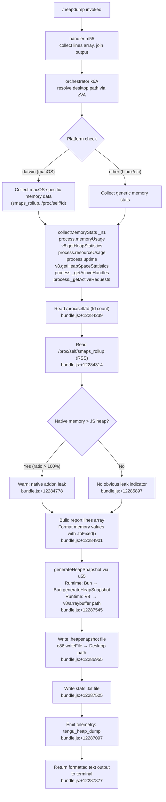

# `/heapdump`

> Analysis basis: CC v2.1.156 bundle.js (AST extraction + Claude interpretation)
> Minimum version: v2.1.156

---

## Overview

`/heapdump` is a hidden diagnostic command that captures a JavaScript heap snapshot, collects comprehensive memory and runtime statistics, and writes both artifacts to `~/Desktop`. It is intended for internal debugging of memory leaks and native-vs-heap imbalances, and supports non-interactive (scripted) execution. The command emits a single telemetry event (`tengu_heap_dump`) on invocation.

---

## Registration

| Field | Value |
|---|---|
| type | `local` |
| name | `heapdump` |
| description | `Dump the JS heap to ~/Desktop` |
| supportsNonInteractive | `true` |
| isHidden | `true` |
| module_id | `qn1` |
| load_inline | `true` |
| loc_byte | `12288976` |
| loc_byte_end | `12289404` |
| loc_line | `9215` |
| arbor_handler.name | `m55` |
| arbor_handler.fqn | `claude-2.1.156::m55` |
| arbor_handler.kind | `AsyncFunction` |
| arbor_handler.resolution_path | `module_id` |
| arbor_handler.n_hits | `0` |

Analysis basis: CC v2.1.156 bundle.js:+12288976

---

## Input Branching

The command follows a linear dispatch flow at the top level (handler `m55` → orchestrator `k6A`), but the orchestrator itself branches across 4+ distinct paths based on runtime state and platform detection. A Mermaid flowchart is used.



---

## Behavioral Spec

### 1. Top-level Handler (`m55`)

The Arbor-resolved async handler is the entry point for the command.

```
async function heapdumpHandler(context):
    lines = []
    lines.push(...)                          # initial status lines
    result = await orchestrateHeapDump(...)  # delegate to k6A
    lines.push(result lines...)
    return lines.join("\n")                  # bundle.js:+12288113
```

Analysis basis: CC v2.1.156 bundle.js:+12287845 (call from `m55` → `k6A`)

The handler also calls `buildSummarySection` (`p55`) which uses `Math.max` for column alignment and `H_6` for formatting hint strings.

```
function buildSummarySection(memStats):
    width = Math.max(column widths...)       # bundle.js:+12288220
    append "— most memory is JS heap…"      # bundle.js:+12288288
    OR append "— most memory is native…"    # bundle.js:+12288348
    OR append "  (no obvious leak indicators)" # bundle.js:+12288485
    return formatted summary block
```

Analysis basis: CC v2.1.156 bundle.js:+12287964

---

### 2. Desktop Path Resolution (`zVA`)

The command always resolves the output directory to the user's Desktop before writing any files.

```
function resolveDesktopPath():
    home = os.homedir()                      # bundle.js:+1014948
    if platform is WSL/Windows:
        # try /mnt/c/Users/.../Desktop       # bundle.js:+1015216
        # skip system accounts: Public, Default, Default User, All Users
        #                        bundle.js:+1015260–1015324
        path = path.join("/mnt/c/Users", <username>, "Desktop")
    else:
        path = path.join(home, "Desktop")    # bundle.js:+1014984 "Desktop" literal
    replace path separators as needed        # bundle.js:+1015124
    ensure directory exists via B6
    return resolved desktop path
```

Analysis basis: CC v2.1.156 bundle.js:+12286803

---

### 3. Memory Statistics Collection (`_n1`)

Gathers all available runtime memory metrics before snapshot generation.

```
async function collectMemoryStats():
    heapUsage    = process.memoryUsage()          # bundle.js:+12284008
    heapStats    = v8.getHeapStatistics()         # bundle.js:+12284032
    resourceUsage= process.resourceUsage()        # bundle.js:+12284058
    uptime       = process.uptime()               # bundle.js:+12284084
    heapSpaces   = v8.getHeapSpaceStatistics()    # bundle.js:+12284109
    activeHandles= process._getActiveHandles()    # bundle.js:+12284151
    activeReqs   = process._getActiveRequests()   # bundle.js:+12284188

    # Linux fd count
    fdEntries = fs.readdir("/proc/self/fd")       # bundle.js:+12284239

    # Linux smaps for RSS breakdown
    smaps = fs.readFile("/proc/self/smaps_rollup", "utf8")  # bundle.js:+12284301

    # JSC (Bun) introspection
    jscStats = require("bun:jsc")                 # bundle.js:+12284399

    # Thresholds for anomaly detection
    # Time window: 3600 seconds                   # bundle.js:+12284540
    # Size unit:   1048576 bytes (1 MiB)          # bundle.js:+12284545
    # Ratio limit: 100 (percent)                  # bundle.js:+12284692

    if nativeMemory > jsHeap:
        warn("Native memory > heap - leak may be in native addons …")
                                                  # bundle.js:+12284778
    format values with .toFixed(N)                # bundle.js:+12284901
    return compiled stats object
```

Analysis basis: CC v2.1.156 bundle.js:+12286520

---

### 4. Heap Snapshot Generation (`u55`)

Branches on the JavaScript runtime available at execution time.

```
async function generateHeapSnapshot(outputPath):
    if runtime is Bun:
        Bun.gc(true)                              # bundle.js:+12287602 (force GC first)
        snapshot = Bun.generateHeapSnapshot()     # bundle.js:+12287545
        fs.writeFileSync(outputPath, snapshot,
                         {format: "v8",           # bundle.js:+12287570
                          type: "arraybuffer"})   # bundle.js:+12287575
    else:
        # V8 path via require('v8') or inspector
        # auto threshold label: "auto-1.5GB"      # bundle.js:+12287163
        write heap snapshot to outputPath

    # File mode 0o600 (decimal 384)               # bundle.js:+12286990
    return outputPath
```

Analysis basis: CC v2.1.156 bundle.js:+12287046

---

### 5. File Output (`k6A` — Orchestrator)

```
async function orchestrateHeapDump(args):
    desktopPath = resolveDesktopPath()            # zVA, bundle.js:+12286803
    timestamp   = now formatted as filename-safe string
    snapFile    = path.join(desktopPath, <timestamp>.heapsnapshot)
                                                  # N6A.join, bundle.js:+12286912
    memStats    = await collectMemoryStats()      # _n1, bundle.js:+12286520
    await generateHeapSnapshot(snapFile)          # u55, bundle.js:+12287046

    reportLines = buildReport(memStats)
    statsFile   = path.join(desktopPath, <timestamp>-stats.txt)
    fs.writeFile(statsFile, reportLines.join("\n"))  # bundle.js:+12286955

    serialized  = JSON.stringify(memStats)        # RH, bundle.js:+12286971
    emit telemetry "tengu_heap_dump"              # bundle.js:+12287097

    # Hint written to output:
    # "Open the .heapsnapshot in Chrome DevTools → Memory → Load to inspect retainers."
    #                                             # bundle.js:+12288001

    return {snapFile, statsFile, summary}
```

Analysis basis: CC v2.1.156 bundle.js:+12287845

---

### 6. Output Formatting (`p55`)

```
function formatOutput(memStats, snapFilePath):
    # Determine dominant memory category
    if jsHeapFraction >= threshold:
        dominance = "— most memory is JS heap (inspect the .heapsnapshot)"
                                                  # bundle.js:+12288288
    else if nativeFraction >= threshold:
        dominance = "— most memory is native (NOT in the .heapsnapshot)"
                                                  # bundle.js:+12288348
    else:
        dominance = "  (no obvious leak indicators)"
                                                  # bundle.js:+12288485

    # Column width normalisation
    colWidth = Math.max(label lengths...)         # bundle.js:+12288220
    # Heap size threshold for display: 1 GiB (1073741824 bytes)
    #                                             # bundle.js:+12288894
    # Column padding: 8 chars                    # bundle.js:+12288620

    return formatted multiline string including dominance line
```

Analysis basis: CC v2.1.156 bundle.js:+12287964

---

## State & Side Effects

| Item | Detail |
|---|---|
| Telemetry | `tengu_heap_dump` (bundle.js:+12287097) |
| Telemetry (background infra, indirect) | `tengu_bg_dispatch_sigkill_escalate`, `tengu_bg_dispatch_low_mem`, `tengu_bg_spare_enable`, `tengu_bg_spare_claim`, `tengu_bg_spare_claim_fail`, `tengu_bg_proto_mismatch`, `tengu_bg_dispatch_stale_drop`, `tengu_bg_attach_legacy_autorespawn`, `tengu_bg_attach`, `tengu_bg_attach_stall_gave_up`, `tengu_bg_attach_stall_respawn`, `tengu_bg_attach_kick` |
| File written (heap snapshot) | `~/Desktop/<timestamp>.heapsnapshot` (file mode `0o600` / decimal `384`; bundle.js:+12286990) |
| File written (stats report) | `~/Desktop/<timestamp>-stats.txt` (bundle.js:+12286955) |
| GC triggered | `Bun.gc(true)` called before snapshot on Bun runtime (bundle.js:+12287602) |
| Hook registration | `_9` → `f$A.register` (bundle.js:+58450); exact hook target not resolvable at depth-2 |
| appState changes | None observed in depth-2 traversal |
| Sound | None observed |
| Platform branch | `darwin` literal present (bundle.js:+12286051); `macos` label (bundle.js:+12285632) |
| WSL Desktop path | Falls back to `/mnt/c/Users/<user>/Desktop`, skipping system accounts (bundle.js:+1015216) |

---

## Version History

| Version | Change |
|---|---|
| v2.1.156 | Initial analysis |

---

## Common Mistakes

1. **Expecting output on screen only** — The command writes two files to `~/Desktop` in addition to printing a summary. Check the desktop for `.heapsnapshot` and `-stats.txt` artifacts.
2. **Running on a headless server without a Desktop directory** — The path resolver (`zVA`) targets `~/Desktop`. On servers where this directory does not exist the write will fail; pre-create it or run on a desktop OS.
3. **Assuming the snapshot is always V8 format** — When Claude Code runs under Bun, `Bun.generateHeapSnapshot()` is used. The resulting file is V8-compatible (format field `"v8"`, type `"arraybuffer"`), but the code path differs from a Node.js / inspector-based capture.
4. **Interpreting native-memory warnings as definitive** — The warning "Native memory > heap — leak may be in native addons" (bundle.js:+12284778) is heuristic; it compares RSS to JS heap size with a 100% ratio threshold (bundle.js:+12284692). False positives are possible under normal operation.
5. **Expecting this command to appear in `/help`** — `isHidden: true` means it is not listed in the standard command menu and is intended for internal diagnostic use only.
6. **Using the snapshot without Chrome DevTools** — The output message instructs users to open the `.heapsnapshot` in Chrome DevTools → Memory → Load. Other tools may not parse the Bun-generated format correctly.

---

## Appendix — Identifier Mapping

> For bundle debugging only. Identifiers change across versions.

| Identifier | Role |
|---|---|
| `m55` | Top-level async command handler (Arbor-resolved entry point) |
| `k6A` | Heap-dump orchestrator (collects stats, writes files, emits telemetry) |
| `k6` | Utility / error-formatting helper (called from orchestrator and stats collector) |
| `ov` | Sub-utility called by `k6` |
| `_n1` | Memory statistics collector (wraps all `process.*` and `v8.*` calls) |
| `G` | Helper called during stats collection; calls `nV6` and `Vb8` |
| `nV6` | Sub-helper of `G` |
| `Vb8` | Sub-helper of `G` and `P` |
| `P` | Connection/transport helper (background session layer) |
| `hH` | Background session event handler (push to queue, log errors) |
| `F_` | Error constructor wrapper |
| `X` | Child-process / IPC channel abstraction |
| `J` | Buffer/byte-array helper used by `X` |
| `w` | Background worker / supervisor manager |
| `xf` | Stream-end helper |
| `lU5` | Background session protocol message dispatcher |
| `ZH` | String coercion helper |
| `N` | Log / write helper (debug-level output) |
| `URK` | Sub-logger calling `mI` and `pRK` |
| `$$A` | Logging utility calling `UyK` and `ByK` |
| `H` | General-purpose map / set / timer object (context-dependent) |
| `RH` | JSON serializer wrapper (`JSON.stringify`) |
| `_` | String manipulation helper |
| `v4` | Path / string normalisation utility |
| `FzA` | Map helper used by `v4` |
| `q` | Queue / set structure |
| `A` | Map / registry used across multiple contexts |
| `HuH` | Write-to-stream helper |
| `yzA` | Inner write helper for `HuH` |
| `gRK` | File-logging sink (mkdir, appendFile, rotate) |
| `kxH` | Log-buffer flush scheduler (setTimeout / setImmediate) |
| `cMH` | Log-chunk formatter |
| `B6` | Directory-ensure / mkdir utility |
| `B16` | Byte-length / size helper |
| `rzA` | File path join helper for log rotation |
| `izA` | File rename/unlink helper for log rotation |
| `FRK` | File log writer (mkdir + appendFile + rotate) |
| `_9` | Hook registration wrapper (`f$A.register`) |
| `K` | Padding / column-alignment helper |
| `L` | Promise lifecycle manager (add/delete/finally) |
| `f` | Resource-close handler |
| `zVA` | Desktop path resolver (`os.homedir` + platform detection) |
| `u55` | Heap snapshot generator (`Bun.generateHeapSnapshot` / V8 path) |
| `d` | Deferred / promise utility |
| `Wz` | Output formatter or writer |
| `p55` | Summary section builder (dominant-memory categorisation, column width) |
| `H_6` | Formatting hint string provider |