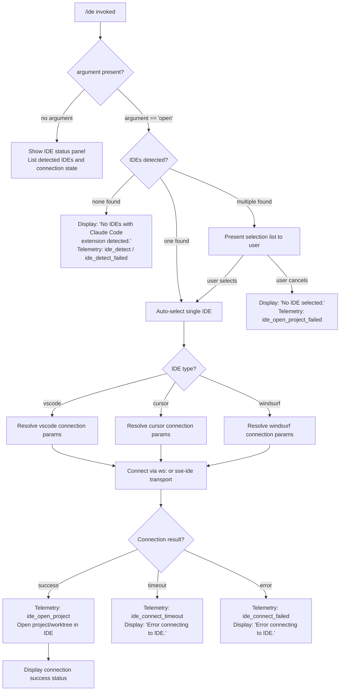

# `/ide`

> Analysis basis: CC v2.1.156 bundle.js (AST extraction + Claude interpretation)
> Minimum version: v2.1.156

---

## Overview

The `/ide` command manages IDE integrations for Claude Code, detecting running IDE instances that have the Claude Code extension installed, and establishing a live connection to a selected IDE. When the optional `open` argument is supplied, it additionally instructs the IDE to open the current project directory. The command also exposes ongoing connection status (connected, disconnected, error) in the UI via a React component rendered as a `local-jsx` type.

---

## Registration

| Field | Value |
|---|---|
| type | `local-jsx` |
| name | `ide` |
| description | `Manage IDE integrations and show status` |
| argumentHint | `[open]` |
| module_id | `Uh1` |
| load_inline | `true` |
| loc_byte | `11300315` |
| loc_byte_end | `11300471` |
| loc_line | `7846` |
| arbor_handler.name | `qeL` |
| arbor_handler.fqn | `claude-2.1.156::qeL` |
| arbor_handler.kind | `AsyncFunction` |
| arbor_handler.resolution_path | `module_id` |
| arbor_handler.n_hits | `0` |

Analysis basis: CC v2.1.156 bundle.js:+11300315

---

## Input Branching

The command has 4+ distinct branches based on argument value and connection state.



---

## Behavioral Spec

### Top-level Handler (`qeL`)

The Arbor-resolved handler `qeL` is an `AsyncFunction` reached via `module_id → Uh1`.

```
async function ideCommandHandler(args, appState):
    emit telemetry("tengu_ext_ide_command")          // loc: +11296431
    subcommand = args[0]                             // "open" or undefined

    detectedIDEs = await detectRunningIDEs()         // calls wiH → N58 → rx7
    if detectedIDEs is empty:
        display("No IDEs with Claude Code extension detected.")  // loc: +11296646
        return

    if subcommand == "open":                         // loc: +11296537
        selectedIDE = await promptIDESelection(detectedIDEs)
        if selectedIDE is null:
            display("No IDE selected.")              // loc: +11296784
            return
        await openProjectInIDE(selectedIDE, appState)
    else:
        renderIDEStatusPanel(detectedIDEs, appState)
```

Analysis basis: CC v2.1.156 bundle.js:+11296429

---

### IDE Detection (`wiH` / `N58` / `rx7`)

```
async function detectRunningIDEs():
    // wiH calls N58, which calls rx7 for each candidate IDE path
    candidates = scanIDEProcessesAndPaths()
    // On Linux, runs: ps aux | grep -E "code|cursor|windsurf|idea|..." | grep -v grep
    // loc: +5304537
    // On macOS/Windows, uses OS-specific discovery
    results = await Promise.all(candidates.map(normalizeIDEEntry))
    // Each normalizeIDEEntry (rx7):
    //   - resolves home dir (Cj9.homedir)
    //   - resolves symlinks (Sj9.realpath)
    //   - skips WSL Windows user paths like /mnt/c/Users/Public, Default, etc.
    //   - skips entries already visited (dedup set)
    //   - classifies IDE kind: "vscode", "cursor", "windsurf", "jetbrains"
    //   - emits telemetry("ide_detect") on success, ("ide_detect_failed") on error
    return results.filter(isValid)
```

Analysis basis: CC v2.1.156 bundle.js:+5299661, +5296215, +5297454

---

### IDE Connection (`ph1` React component + connection logic)

The `local-jsx` type means a React component (`ph1`) is rendered for status display. It hooks into app state via `w6` (app state store hook) and manages a connection lifecycle:

```
function IDEStatusComponent(props):
    [status, setStatus] = useState("pending")   // loc: +11298317
    appState = useAppStateHook()                 // w6, loc: +11298337
    connectionRef = useRef()

    useEffect(() => {
        // Attempt IDE connection
        connectToIDE(selectedIDE)
            .then(() => {
                setStatus("connected")
                emit telemetry("ide_connect")    // loc: +11298534
            })
            .catch((err) => {
                if isTimeout(err):
                    setStatus("error")
                    emit telemetry("ide_connect_timeout")  // loc: +11298728
                else:
                    setStatus("error")
                    emit telemetry("ide_connect_failed")   // loc: +11298621
                display("Error connecting to IDE.")        // loc: +11298846
            })
    }, [selectedIDE])

    useEffect(() => {
        // Monitor for disconnect events
        onDisconnect(() => {
            emit telemetry("ide_disconnect")     // loc: +11299227
            setStatus("disconnected")
        })
    }, [])

    // Render status badge + list of mcp__ide__ tool names
    // mcp__ide__ prefix: loc: +11299124
    return <IDEStatusPanel status=status tools=filteredMCPTools />
```

Analysis basis: CC v2.1.156 bundle.js:+11298317, +11298534

---

### Open Project in IDE (`qeL` → `OV_` → `_u7` → `DP` / `ZGH`)

```
async function openProjectInIDE(ideEntry, appState):
    ideKind = ideEntry.kind   // "vscode" | "cursor" | "windsurf"
    // loc: +11296844, +11296885, +11296926

    openMode = detectOpenMode(appState)
    // openMode = "worktree" if git worktree active, else "project"
    // loc: +11297018, +11297029

    try:
        result = await dispatchOpenCommand(ideKind, openMode)
        // OV_ → _u7 → ZGH (IDE extension bridge)
        // transport is ws: (WebSocket) or sse-ide (SSE)
        // loc: +11299344, +11294416, +11294436

        if result.exited_without_opening:
            warn("Exited without opening IDE")   // loc: +11297381
            emit telemetry("ide_open_project_failed")  // loc: +11297091
            return

        emit telemetry("ide_open_project")       // loc: +11296984
        display("Connecting to " + ideAddress)   // loc: +11299564

    catch (err):
        emit telemetry("ide_open_project_failed")
        suggest("restart your IDE")              // loc: +11297649
```

Analysis basis: CC v2.1.156 bundle.js:+11296984, +11297091, +11297558

---

### Connection Transport (`OV_` / `ZGH`)

```
function buildIDEConnectionBridge(ideKind, params):
    // ZGH orchestrates the IDE extension protocol
    // Supports:
    //   - WebSocket transport (ws: prefix)   loc: +11299344
    //   - SSE transport (sse-ide)            loc: +11294416
    //   - ws-ide variant                     loc: +11294436

    connection = ZGH.connect(params)
    // ZGH calls: WNA, li8, ni8, ri8, kvA, ci8, ANA, NvA, IvA, qvA, HNA, tvA, evA, RvA
    // These handle protocol negotiation, auth, and message framing

    connection.onInstallIDEExtension(handler)   // loc: +11297558
    // Fires if IDE has extension but it needs installation/update

    return connection
```

Analysis basis: CC v2.1.156 bundle.js:+1044445, +11299344

---

### IDE Status Display / Tool List Rendering

```
function renderIDEToolList(mcpTools):
    // Filter tools whose names start with "mcp__ide__"  loc: +11299124
    ideTools = mcpTools.filter(t => t.name.startsWith("mcp__ide__"))

    // Map to display rows
    // Each row: name padded to 40 chars  loc: +15504600
    // Separator: "  "                    loc: +15502629
    rows = ideTools.map(t => padEnd(t.name, 40))

    // ide_disconnect event is surfaced here if connection dropped
    // loc: +11299227

    // Dynamic prefix "mcp__ide__" identifies all IDE-bridged MCP tools
    return rows
```

Analysis basis: CC v2.1.156 bundle.js:+11299124, +15504600

---

### Status String Normalization (`oa_`)

```
function normalizeStatusList(rawConnections):
    // Slices first 100 entries, index 0     loc: +11299773, +11299792
    // Takes up to 3 items for display       loc: +11299846
    // Normalizes strings to NFC             loc: +11299914
    // Maps active connections via q.map     loc: +11299923
    // Appends ", " between entries          loc: +11300071
    // Appends ", …" if truncated            loc: +11300085

    result = rawConnections
        .slice(0, 100)
        .slice(0, 3)
        .map(c => c.normalize("NFC"))
        .join(", ")

    if rawConnections.length > 3:
        result += ", …"

    return result
```

Analysis basis: CC v2.1.156 bundle.js:+11299773, +11299846, +11300071

---

## State & Side Effects

| Item | Detail |
|---|---|
| Telemetry: `tengu_ext_ide_command` | Fired on every `/ide` invocation (bundle.js:+11296431) |
| Telemetry: `ide_detect` | Fired per successfully detected IDE (bundle.js:+5301004) |
| Telemetry: `ide_detect_failed` | Fired when IDE detection for a candidate fails (bundle.js:+5301068) |
| Telemetry: `ide_open_project` | Fired on successful project open in IDE (bundle.js:+11296984) |
| Telemetry: `ide_open_project_failed` | Fired when open-project action fails or user cancels (bundle.js:+11297091) |
| Telemetry: `ide_connect` | Fired on successful IDE connection (bundle.js:+11298534) |
| Telemetry: `ide_connect_failed` | Fired on connection error (bundle.js:+11298621) |
| Telemetry: `ide_connect_timeout` | Fired when IDE connection times out (bundle.js:+11298728) |
| Telemetry: `ide_disconnect` | Fired when IDE disconnects (bundle.js:+11299227) |
| Telemetry: `tengu_daemon_control`, `tengu_bg_spare_*`, `tengu_bg_dispatch_*` | Background daemon telemetry reachable through deep call graph; not IDE-specific |
| Hook registration | `_.onInstallIDEExtension` callback registered when connection bridge is established (bundle.js:+11297558) |
| Transport connections | WebSocket (`ws:`) or SSE (`sse-ide` / `ws-ide`) socket opened to IDE extension server |
| appState changes | IDE connection status (`pending` → `connected` / `error` / `disconnected`) reflected in `w6` store |
| MCP tool registration | `mcp__ide__` prefixed tools are dynamically registered when IDE connection succeeds (bundle.js:+11299124) |
| File system | IDE detection reads `.claude` config directories (bundle.js:+5297545); connection uses auth socket path under `N$.join` |
| Process interaction | On Linux, spawns `sh -c "ps aux | grep ..."` to discover running IDEs (bundle.js:+5304537) |
| Sound | None detected in traversal |

---

## Version History

| Version | Change |
|---|---|
| v2.1.156 | Initial analysis |

---

## Common Mistakes

1. **Running `/ide open` without the Claude Code extension installed in the IDE** — The command will report "No IDEs with Claude Code extension detected." even if the IDE is running. Install the extension first, then retry.
2. **Cancelling the IDE selection prompt** — Produces "No IDE selected." with no further action. Re-run the command and confirm selection.
3. **Network/socket issues blocking the WebSocket or SSE transport** — Results in `ide_connect_timeout` or `ide_connect_failed`. The error message "Error connecting to IDE." is shown; try restarting the IDE per the embedded suggestion (bundle.js:+11297649).
4. **WSL environments** — The detector explicitly skips `/mnt/c/Users/Public`, `Default`, `Default User`, and `All Users` paths (bundle.js:+5297846–5297910). IDE installations under those paths will not be discovered; use a per-user Windows installation instead.
5. **Expecting `/ide` (no argument) to open a project** — Without the `open` argument the command only shows status; it does not trigger an IDE open action.
6. **Assuming `mcp__ide__` tools are always present** — These tools are registered dynamically after a successful IDE connection. If the IDE is disconnected, the tools disappear from the tool list.

---

## Appendix — Identifier Mapping

> For bundle debugging only. Identifiers change across versions.

| Identifier | Role |
|---|---|
| `qeL` | Top-level async handler for `/ide` command (Arbor-resolved) |
| `oa_` | Status list normalization / active-connection display helper |
| `ph1` | React component rendering IDE status panel (local-jsx) |
| `wiH` | IDE detection orchestrator; calls N58/rx7 |
| `N58` | Parallel IDE candidate resolver (Promise.all over rx7 results) |
| `rx7` | Per-candidate IDE path resolution and classification |
| `nx7` | IDE entry normalizer helper (calls e9_) |
| `e9_` | Shell-command executor for process discovery (sh -c) |
| `OV_` | IDE open-project dispatcher (calls _u7) |
| `_u7` | IDE command payload builder; talks to ZGH bridge |
| `DP` | IDE connection parameter builder |
| `ZGH` | IDE extension protocol bridge (WebSocket / SSE) |
| `RX` | IDE kind classifier (vscode / cursor / windsurf / jetbrains) |
| `Gj9` | IDE process name matcher (regex .match) |
| `bj9` | Process signal helper (process.kill) |
| `V8` | IDE selection prompt renderer |
| `W_` | IDE UI wrapper / display helper |
| `C6` | App state / store accessor |
| `YB6` | Store getter (zB6.getStore + kn) |
| `$_` | Async store subscription helper (calls ov) |
| `w6` | App-state hook (useSyncExternalStore wrapper) |
| `ej_` | React context accessor for app state |
| `fA` | Secondary app state hook |
| `C5` | Terminal/display context hook (useContext + useMemo) |
| `ok` | MCP tool cache/hash helper |
| `dH6` | Tool entry descriptor builder |
| `OrH` | SHA-256 hash builder for tool identity |
| `sM` | Argument/subcommand parser |
| `DiH` | UI display helper for IDE status rows |
| `KE` | Keyboard / selection handler |
| `po` | Post-connection callback helper |
| `stL` | Status label formatter |
| `D` | Daemon/background-session manager |
| `w` | Background session worker map manager |
| `R` | Session supervisor |
| `z` | Session write/kill coordinator |
| `N5A` | Background session lifecycle manager |
| `W5A` | Spare-claim and connection claim orchestrator |
| `P5A` | Background PTY host spawn helper |
| `E6` | IDE socket/connection registry |
| `b6` | Config file reader/watcher |
| `Y17` | Config file watcher (B88.watchFile) |
| `bzH` | Config accessor with disk read and migration |
| `bo1` | Daemon status file writer |
| `lU5` | Supervisor message dispatcher / protocol handler |
| `EEK` | Dispatch timeout/retry controller |
| `cU5` | Attach phase handler |
| `dU5` | Attach stall detector |
| `mU5` | Send-claim timeout enforcer |
| `pU5` | Unix socket connector for claim |
| `uU5` | Claim frame builder |
| `N5A` | Session roster lifecycle manager |
| `Q66` | Roster file reader/writer |
| `zF` | Roster entry parser |
| `xsL` | Roster write helper (atomic via gO) |
| `gO` | Atomic file write helper (randomBytes + rename) |
| `a9` | Job metadata reader (pins + order) |
| `mK` | Job directory path resolver |
| `Af` | Job state writer |
| `Lj` | Job lifecycle state helper (yV/tVH) |
| `hH` | Log writer / error logger |
| `F_` | Error code formatter |
| `xH` | String converter |
| `RH` | JSON serializer (JSON.stringify) |
| `m6` | JSON parser (JSON.parse) |
| `gRK` | Terminal output streamer / log appender |
| `kxH` | Buffered write scheduler |
| `cMH` | Log chunk writer |
| `rzA` | Log file path builder |
| `izA` | Log file rotator |
| `FRK` | Log append-with-rotation handler |
| `B16` | Log metadata writer |
| `N` | Structured logger |
| `URK` | Logger transport selector |
| `$$A` | Logger output formatter |
| `v4` | Log line formatter |
| `HuH` | Log output writer |
| `yzA` | Raw write helper |
| `_9` | Signal/hook registrar (f$A.register) |
| `lEK` | Realpath + stat resolver |
| `$B5` | Version path builder |
| `AW8` | Version directory enumerator |
| `FD6` | Pins file reader |
| `yX7` | Job directory scanner |
| `d69` | Roster entry initializer |
| `lh` | PTY pid file path resolver |
| `d5H` | PTY pid file path builder |
| `PRH` | PTY pids directory path builder |
| `OF` | PTY socket path resolver |
| `F66` | PTY socket path builder |
| `Ga_` | Roster socket validator |
| `PN6` | Auth directory path builder |
| `Ea_` | Auth socket path builder |
| `L9A` | Auth socket + config writer |
| `eI8` | Memory/platform check (macOS 1024 MB threshold) |
| `P8` | Error code checker (J8 wrapper) |
| `J8` | Errno/error code constant lookup |
| `AT` | Jobs base directory resolver |
| `lX_` | Pins file path builder |
| `MI6` | Daemon status path builder |
| `Si` | Timestamp/clock helper |
| `o9` | Request context store accessor |
| `yH` | Platform check helper |
| `uH` | Platform check helper (alternate) |
| `t6` | Platform fallback accessor |
| `Ky1` | Spare socket path builder |
| `Ly1` | Spare socket alternate path builder |
| `pl` | Spare directory path helper |
| `UU5` | Spare process argument builder |
| `xU5` | Spawn environment builder |
| `g3` | Array.isArray guard |
| `Y` | Session registry manager |
| `E2H` | Session entry builder |
| `Lt1` | Session display formatter |
| `QEK` | Heartbeat scheduler |
| `T` | Remote-control startup handler |
| `km` | Process exit race handler |
| `vy` | Connection event emitter |
| `AF` | Binary frame encoder (Buffer ops) |
| `X` | Socket message framer / chunker |
| `xf` | Socket end/response helper |
| `vS6` | Socket write helper |
| `lU5` | Full supervisor protocol message handler (large) |
| `nU5` | Sub-handler inside lU5 |
| `QO` | Background service descriptor |
| `Z5A` | Session state resolver |
| `P` | Repaint coordinator |
| `G` | Repaint + Vb8 orchestrator |
| `$0` | Path join helper (omH) |
| `F3` | Realpath + normalize helper |
| `b3H` | Transcript tail reader (readline) |
| `k` | Away-summary rate limiter |
| `o` | Voice toggle silence timeout handler |
| `a` | Voice focus silence timeout handler |
| `x` | Transient write scheduler |
| `r` | Permission-response channel |
| `c` | Permission-response handler |
| `j` | Session kill iterator |
| `y` | Session write + kill helper |
| `l` | HH filter helper |
| `g` | B+$ compositor |
| `b` | Interval-based writer |
| `pH` | Tool-list filter (MCP tools) |
| `_3` | Tool list base accessor |
| `F6` | Tool list filter helper |
| `LH` | Permission set (e/wH/E/k) |
| `M8` | Keycode set (47/60/33) |
| `cH` | Orphaned-permission checker |
| `B` | Session retire-if-settled checker |
| `K9` | String slice/indexOf utility |
| `Wz` | Unknown utility (reached from D, R) |
| `bM` | J8-based helper |
| `ZH` | String() wrapper |
| `d` | Shared utility / accessor |
| `H` | General string/array utility (many uses) |
| `A` | General object/array utility (many uses) |
| `f` | File handle / stream utility |
| `q` | File system sync utility |
| `L` | List/array utility |
| `E` | Environment/state flag |
| `S` | Session state constant |
| `V` | Timer/interval handle |
| `p` | Write scheduler sub-helper |