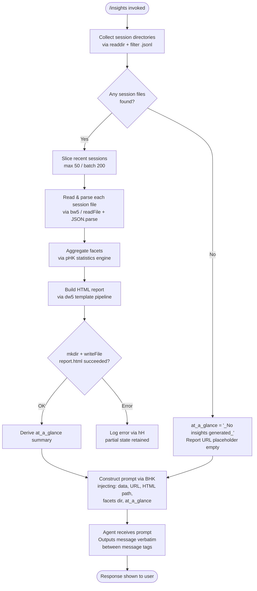

# `/insights`

> Analysis basis: CC v2.1.156 bundle.js (AST extraction + Claude interpretation)
> Minimum version: v2.1.156

---

## Overview

`/insights` generates a shareable HTML usage-analytics report from the user's local Claude Code session data, then instructs the agent to relay a pre-composed confirmation message verbatim. The command reads JSONL session logs and derived facet files, aggregates them into structured metrics, writes a self-contained `report.html` file, and finally injects a prompt into the agent that causes it to announce the report location without improvising any additional text.

---

## Registration

| Field | Value |
|---|---|
| type | `prompt` |
| name | `insights` |
| description | `Generate a report analyzing your Claude Code sessions` |
| loc_byte | `12846555` |
| loc_byte_end | `12847859` |
| loc_line | `10896` |
| handler_method | `getPromptForCommand` |
| handler_method_start | `12846729` |
| handler_method_end | `12847858` |
| prompt_body.length | `513` |
| prompt_body.trace | `call→BHK(...) (1 literals)` |
| arbor_handler.name | `getPromptForCommand` |
| arbor_handler.fqn | `claude-2.1.156::getPromptForCommand` |
| arbor_handler.kind | `Method` |
| arbor_handler.resolution_path | `direct` |
| arbor_handler.n_hits | `1` |

Analysis basis: CC v2.1.156 bundle.js:+12846555

---

## Input Branching

The command has more than three distinct internal paths (session-data present vs. absent, report generation success vs. error, facet-file writing outcomes), so a Mermaid flowchart is used.



Analysis basis: CC v2.1.156 bundle.js:+12846735 (handler entry), +12833598 (session enumeration), +12835596 (mkdir/write), +12847761 (BHK prompt builder)

---

## Behavioral Spec

### 1. Handler Entry (`getPromptForCommand`)

The Arbor symbol graph resolves the handler as `getPromptForCommand` (direct resolution, n_hits=1) at the registration object's byte range. The call graph starts at the synthetic BFS entry `__handler_insights` which immediately delegates to:
- `getPromptForCommand` at +12846735 — the real handler method
- `UHK` (insights data aggregator) at +12846828
- `Math.round` at +12847116 for numeric formatting
- `BHK` at +12847761 for final prompt assembly
- `RH` at +12847779 for JSON serialization
- `Jy8` at +12847825 for path resolution

```
function getPromptForCommand(context):
    aggregatedData  = aggregateInsightsData(context)   // UHK
    numericMetric   = Math.round(...)                  // +12847116
    promptText      = buildInsightsPrompt(             // BHK
                          aggregatedData,
                          reportUrl,
                          htmlFilePath,
                          facetsDir,
                          atAGlanceSummary
                      )
    return { type: "prompt", text: promptText }
```

Analysis basis: CC v2.1.156 bundle.js:+12846735

---

### 2. Session File Discovery (`sessionFileEnumerator` / `lw5`)

Scans the Claude Code data directory for project subdirectories. For each project directory it reads the directory listing, filters entries that are directories (using `K.isDirectory`), joins them as paths, then calls the JSONL file collector (`p_6`).

```
function sessionFileEnumerator(dataRoot):
    baseDir  = pathJoin(dataRoot, "projects")       // literal "projects" +6499813
    entries  = fs.readdir(baseDir)
    dirs     = entries.filter(e => e.isDirectory()) // +12833293
    files    = []
    for dir in dirs:
        jsonlFiles = collectJsonlFiles(dir)         // p_6 +12833383
        files.push(...jsonlFiles)
        yield via setImmediate                      // +12833505 cooperative scheduling
    files.sort(...)                                 // +12833529
    return files
```

Batch thresholds observed in literals: minimum batch size 10 (+12833475), maximum 9 items per micro-batch (+12833480), paging constants 50 (+12833617) and 200 (+12833622).

Analysis basis: CC v2.1.156 bundle.js:+12833598

---

### 3. JSONL File Collector (`jsonlFileCollector` / `p_6`)

Within each project directory, reads all entries, retains only regular files whose names end with `.jsonl` (literal `".jsonl"` at +12917285). For each qualifying file it calls `fs.stat` to get metadata and accumulates an object with path and size. Uses `Promise.all` over the stat calls.

```
function jsonlFileCollector(projectDir):
    entries  = fs.readdir(projectDir)               // +12917179
    files    = entries.filter(e => e.isFile())      // +12917256
    jsonlFiles = files.filter(name => ro(name))     // regex test +12917310
    results  = []
    for file in jsonlFiles:
        fullPath = pathJoin(projectDir,             // kD.basename +12917313
                            file.basename)
        results.push(fullPath)
    stats    = await Promise.all(                   // +12917420
        results.map(p => fs.stat(p))                // +12917488
    )
    return results.map((p, i) => ({path: p, stat: stats[i]}))
```

Analysis basis: CC v2.1.156 bundle.js:+12917179

---

### 4. Session Data Aggregator (`insightsDataAggregator` / `UHK`)

Central orchestration function. Slices the most recent sessions (up to the recent-session limit derived from literal `5` at +12833906), reads each session file, parses JSON, invokes the facets statistics engine, and writes output files.

```
function insightsDataAggregator(sessionFiles, context):
    recent   = sessionFiles.slice(...)              // A.slice +12833671
    parsed   = await Promise.all(                   // +12833694
        recent.map(f => readAndParseSession(f))     // B.map +12833706
    )
    facetsData = computeFacets(parsed)              // bw5 +12833751
    report     = buildHtmlReport(facetsData)        // dw5 +12835577

    // Write facets JSON
    await writeFacetsFile(facetsData)               // xw5 +12834439

    // Write HTML report
    outDir   = pathJoin(insightsDir, timestamp())
    await fs.mkdir(outDir, {recursive: true})       // qS.mkdir +12835596
    filePath = pathJoin(outDir, "report.html")      // literal +12835855
    await fs.writeFile(filePath, report)            // qS.writeFile +12835883

    return {
        facetsData,
        reportUrl: deriveUrl(filePath),             // Jy8 +12847825
        htmlFile:  filePath,
        atAGlance: computeAtAGlance(facetsData)     // pHK / pw5 pipeline
    }
```

The timestamp is derived from a `Date` object decomposed via `.getFullYear()` (+12835687), `.getMonth()` (+12835708), `.getDate()` (+12835729), `.getHours()` (+12835747), `.getMinutes()` (+12835765), `.getSeconds()` (+12835785) — producing a sortable directory name.

Analysis basis: CC v2.1.156 bundle.js:+12833628

---

### 5. Session File Reader (`sessionFileReader` / `bw5`)

Resolves the canonical path to the session's usage-data file and session-meta file (literals `"usage-data"` at +12772550 and `"session-meta"` at +12772646), reads each as UTF-8 (literal `"utf-8"` at +12778681), and parses via `JSON.parse` (delegated to `m6`).

```
function sessionFileReader(sessionPath):
    usageDataPath  = pathJoin(sessionPath, "usage-data")   // rI6 +12772537
    sessionMetaPath= pathJoin(sessionPath, "session-meta") // RAA +12772632
    rawUsage       = await fs.readFile(usageDataPath,      // qS.readFile +12778657
                                       "utf-8")
    rawMeta        = await fs.readFile(sessionMetaPath,    // implicit
                                       "utf-8")
    parsed         = jsonSafeparse(rawUsage)               // uHK +12778698, m6 +12778702
    return { usage: parsed, metaPath: sessionMetaPath }
```

Analysis basis: CC v2.1.156 bundle.js:+12778614

---

### 6. Facets Statistics Engine (`facetsStatsEngine` / `pHK`)

Computes rich per-session statistics used to populate the report sections. Iterates `Object.entries` over the parsed data, sorts and buckets tool usage, computes percentile response-time histograms, groups sessions by time-of-day, and categorises tool errors.

Key computed facets (derived from literals):
- **Tool categories**: `WebSearch`, `WebFetch`, `Edit`, `Write` (+12773243–+12773386), plus `Other` (+12774178)
- **Response-time buckets**: `2-10s`, `10-30s`, `30s-1m`, `1-2m`, `2-5m`, `5-15m`, `>15m` (+12789768–+12789828); numeric boundary constants 120s (+12789988) and 900s (+12790070)
- **Time-of-day buckets**: `Morning (6-12)`, `Afternoon (12-18)`, `Evening (18-24)`, `Night (0-6)` (+12790616–+12790769)
- **Tool error categories**: `exit code` / `Command Failed`, `rejected` / `User Rejected`, `string to replace not found` / `Edit Failed`, `modified since read` / `File Changed`, `exceeds maximum` / `File Too Large`, `file not found` / `File Not Found` (+12774246–+12774657)
- **Git activity**: `git commit` (+12773630), `git push` (+12773662); time window constant 3600 seconds (+12774047)
- **Session limit constants**: maximum 500 sessions (+12777093), batch 300 (+12777385), timeout 30000ms (+12777870), secondary timeout 25000ms (+12777891), output token limit 4096 (+12780499), max summary tokens 8192 (+12788937)

```
function facetsStatsEngine(parsedSessions):
    toolCounts   = {}
    errorCounts  = {}
    rtBuckets    = initBuckets(["2-10s","10-30s","30s-1m","1-2m","2-5m","5-15m",">15m"])
    todBuckets   = initBuckets(["Morning","Afternoon","Evening","Night"])

    for session in parsedSessions:
        for entry in Object.entries(session):
            categorise tool usage    // xHK +12773084
            bucket response times    // IfH +12789119
            bucket time of day       // gw5 +12790848
            tally errors             // Fw5 +12790141
    
    sortedTools  = sortByCount(toolCounts)      // q.sort +12784214
    percentile   = computePercentile(rtBuckets) // Math.floor +12784388
    summary      = rollupSummary(sortedTools,   // nw5 +12835353
                                 percentile,
                                 todBuckets)
    return { toolCounts, errorCounts, rtBuckets, todBuckets, summary }
```

Analysis basis: CC v2.1.156 bundle.js:+12782386

---

### 7. HTML Report Builder (`htmlReportBuilder` / `dw5`)

Constructs a self-contained HTML report string. Applies HTML-entity escaping (`&amp;` +4702117, `&lt;` +4702141, `&gt;` +4702164, `&quot;` +4702215, `&apos;` +4702240) via `x5`/`J5`. Uses chart color constants `#2563eb` (+12827433), `#0891b2` (+12827571), `#10b981` (+12827743), `#8b5cf6` (+12827886) for visual sections, and `#dc2626` (+12831149), `#16a34a` (+12831398), `#eab308` (+12831891) for error/status indicators. Includes a call-to-action literal `"Add to CLAUDE.md"` (+12795112) in a suggestions section. Falls back to `"None captured"` (+12786129) when a section has no data.

```
function htmlReportBuilder(facetsData):
    escaped    = htmlEscape(facetsData)           // x5 +12791432
    toolsHtml  = renderToolsSection(escaped,      // IfH +12789119
                     colors=["#2563eb","#0891b2","#10b981","#8b5cf6"])
    errorsHtml = renderErrorsSection(escaped,     // gw5 +12790848
                     colors=["#dc2626","#16a34a","#eab308"])
    todHtml    = renderTimeOfDaySection(escaped)  // Fw5 +12790141
    rtHtml     = renderResponseTimeSection(escaped)
    atAGlance  = computeAtAGlanceSummary(         // pw5 +12835566
                     facetsData,
                     "at_a_glance" literal +12786795)
    return assembleHtml(toolsHtml, errorsHtml,    // Qw5 +12812489
                        todHtml, rtHtml, atAGlance)
```

Analysis basis: CC v2.1.156 bundle.js:+12791402

---

### 8. Prompt Assembly (`insightsPromptBuilder` / `BHK`)

Called at +12847761, this function receives the fully-assembled data payload and constructs the 513-character prompt string sent to the agent. The prompt:

1. Declares that the user has just run `/insights`.
2. Embeds the full insights data blob.
3. Embeds the report URL, HTML file path, and facets directory path.
4. Provides an at-a-glance summary marked as *for context only — the user has not seen any output yet*.
5. Instructs the agent to output only the text within `<message>` tags verbatim, without omitting any line.
6. The `<message>` block tells the user their shareable report is ready and invites them to explore sections or follow suggestions.

When no insights data was generated, the fallback literal `"_No insights generated_"` (+12847626) is substituted for the at-a-glance summary and the report URL remains empty.

```
function insightsPromptBuilder(payload):
    { data, reportUrl, htmlFile, facetsDir, atAGlance } = payload
    if atAGlance is empty:
        atAGlance = "_No insights generated_"      // +12847626
    separator = " · "                              // +12847187
    prompt = interpolate(PROMPT_TEMPLATE,          // length 513 +12846729
                 data, reportUrl, htmlFile,
                 facetsDir, atAGlance)
    return prompt
```

Analysis basis: CC v2.1.156 bundle.js:+12847761

---

### 9. Facets File Writer (`facetsFileWriter` / `xw5`)

Creates the output directory (recursively), resolves the facets subdirectory path (literal `"facets"` at +12772600), serialises the data to JSON (`RH` → `JSON.stringify` +183160) with a fixed indent (literal `384` at +12779330 is a formatting constant), and writes the file.

```
function facetsFileWriter(facetsData, baseDir):
    await fs.mkdir(baseDir, {recursive: true})     // qS.mkdir +12778441
    facetsPath = pathJoin(baseDir, "facets")        // +12772600
    json       = jsonSerialize(facetsData)          // RH +12779294
    await fs.writeFile(facetsPath, json)            // qS.writeFile +12778529
```

Analysis basis: CC v2.1.156 bundle.js:+12778441

---

### 10. Path Resolution (`insightsDirResolver` / `Jy8` + `rI6`)

Resolves the canonical output directory for insights artefacts:

- `rI6` (+12772537) joins the data root with `"usage-data"` and then `"facets"`.
- `Jy8` (+12772586) wraps `rI6` to produce the base insights path used throughout.

Analysis basis: CC v2.1.156 bundle.js:+12772537

---

## State & Side Effects

| Item | Detail |
|---|---|
| Filesystem writes | Creates timestamped subdirectory under insights path; writes `report.html` (literal +12835855); writes facets JSON file |
| Filesystem reads | Reads `usage-data` and `session-meta` files per session (literals +12772550, +12772646); reads JSONL session files |
| Directory creation | `fs.mkdir` with `{recursive: true}` for output directory (+12835596) and facets directory (+12778441) |
| JSON serialization | Uses `RH` → `JSON.stringify` for facets output (+183160); `m6` → `JSON.parse` for session input (+183900) |
| Cooperative scheduling | `setImmediate` used during session file enumeration to avoid blocking the event loop (+12833505) |
| Telemetry | No `/insights`-specific `tengu_*` events found in depth-2 traversal; events in reachable code are infrastructure-level (see table below) |
| appState changes | None observed at depth ≤ 2 |
| Sound | None observed |
| Hook registration | None observed |
| Fallback literal | `"_No insights generated_"` (+12847626) substituted when session data is absent |

### Reachable infrastructure telemetry (not insights-specific)

| Event | loc_byte |
|---|---|
| `tengu_transcript_phantom_parent` | 12903097 |
| `tengu_relink_walk_broken` | 12882805 |
| `tengu_chain_parent_cycle` | 12884574 |
| `tengu_chain_timestamp_fallback` | 12884723 |
| `tengu_chain_parallel_tr_recovered` | 12886589 |
| `tengu_transcript_parent_cycle` | 12906676 |
| `tengu_daemon_yield` | 15497547 |
| `tengu_daemon_control` | 15514702 |
| `tengu_daemon_config_reload` | 15493353 |
| `tengu_bg_spare_enable` | 15478198 |
| `tengu_bg_spare_spawn` | 15478558 |
| `tengu_bg_dispatch_sigkill_escalate` | 15478865 |
| `tengu_bg_dispatch_low_mem` | 15479444 |
| `tengu_bg_spare_claim` | 15480260 |
| `tengu_bg_spare_claim_fail` | 15480523 |
| `tengu_daemon_idle_exit` | 15498540 |
| `tengu_voice_circuit_breaker_tripped` | 13983385 |
| `tengu_voice_recording_started` | 13984937 |
| `tengu_voice_stream_early_retry` | 13986377 |

---

## Version History

| Version | Change |
|---|---|
| v2.1.156 | Initial analysis |

---

## Common Mistakes

1. **Running `/insights` in a project with no session history** — The command does not error out; instead it substitutes `"_No insights generated_"` for the summary and the report URL will be empty. The agent will still relay the `<message>` block verbatim, so the output may appear misleadingly complete.
2. **Expecting interactive analysis immediately** — The agent is instructed to output the `<message>` block verbatim and then ask whether the user wants to dig into sections. Any follow-up analysis requires a second conversational turn.
3. **Assuming the report is browser-accessible via a remote URL** — The `reportUrl` injected into the prompt is a local file path turned into a file URI. On remote/SSH sessions the HTML file exists on the remote machine; users must transfer or serve it manually.
4. **Modifying or deleting the facets directory mid-run** — The command performs multiple async reads and writes to the `facets` subdirectory. Concurrent filesystem modifications can cause silent partial data in the report.
5. **Treating the `at_a_glance` summary as user-visible output** — The prompt explicitly marks the at-a-glance block as *for your context only — the user has not seen any output yet*. It is provided to help the agent understand the report, not to be paraphrased or quoted to the user.

---

## Appendix — Identifier Mapping

> For bundle debugging only. Identifiers change across versions.

| Identifier | Role |
|---|---|
| `__handler_insights` | Synthetic BFS entry point for the `/insights` command handler |
| `UHK` | Insights data aggregator — main orchestration function |
| `lw5` | Session file enumerator — walks project directories |
| `Gc` | Directory path builder (joins data root with "projects") |
| `p_6` | JSONL file collector — filters and stats files within a project dir |
| `ro` | JSONL filename regex tester |
| `bw5` | Session file reader — reads usage-data and session-meta |
| `RAA` | Session-meta path resolver |
| `rI6` | Usage-data / facets base path resolver |
| `uHK` | Safe JSON parse wrapper (called before `m6`) |
| `m6` | JSON parse helper |
| `pHK` | Facets statistics engine |
| `mHK` | Numeric aggregation helper (percentile / sort) |
| `m_6` | Object.entries iteration helper for facets |
| `K9` | String slice / index helper |
| `pw5` | At-a-glance summary builder |
| `CHK` | Per-session HTML chunk compiler |
| `Tw5` | Error-zone builder |
| `dw5` | HTML report builder — full template pipeline |
| `x5` | HTML entity escaper |
| `J5` | HTML entity replacement helper |
| `jy8` | Secondary HTML escape / format helper |
| `Qw5` | HTML assembler / serializer (calls `RH`) |
| `IfH` | Tool-error section renderer |
| `Fw5` | Time-of-day / tool distribution renderer |
| `gw5` | Response-time bucket renderer |
| `xw5` | Facets file writer (mkdir + writeFile) |
| `Rw5` | Report file reader / cleanup helper |
| `Jy8` | Insights output directory resolver |
| `FHK` | File-not-found / error filter helper |
| `uw5` | Report generation coordinator (calls yXH, bHK, etc.) |
| `Sw5` | Session batch processor |
| `Iw5` | Session entry formatter |
| `yXH` | Report upload / URL derivation helper |
| `GK` | Report URL builder |
| `vT8` | File hash / cache key helper |
| `Z8` | UUID + cache entry builder |
| `aRH` | Assistant-message extractor |
| `sG` | Report finaliser |
| `bHK` | Report output path builder |
| `EZ` | First-party service resolver |
| `DK` | Message filter helper |
| `F_` | Error string wrapper |
| `Cw5` | Alternate facets file writer |
| `nw5` | Key enumeration helper (Object.keys) |
| `xHK` | Tool-usage categorisation engine |
| `bAA` | Session data normaliser |
| `Nw5` | NaN guard helper |
| `bwH` | Diff computation helper |
| `a4` | Array index helper |
| `CAA` | Session data post-processor |
| `RH` | JSON.stringify wrapper |
| `BHK` | Insights prompt builder — constructs the 513-char prompt |
| `iI6` | Tool-name classifier helper |
| `vw5` | File extension extractor |
| `C` | String toLowerCase wrapper |
| `dH6` | Session transcript state initialiser |
| `Xy8` | Transcript state machine |
| `d_H` | Transcript reader / walker |
| `Oj5` | Transcript entry parser |
| `VC` | Transcript validation helper |
| `bzA` | JSON structure walker |
| `Wj` | Timestamp parser |
| `w6K` | Session chain rebuilder |
| `xj5` | Binary JSONL parser (Buffer-based) |
| `uj5` | Low-level JSONL file reader (openSync/readSync) |
| `mj5` | Compact JSONL reader |
| `hGH` | Crypto / hash helper |
| `hH` | Error logger (logs to QmH, Li.logError) |
| `dL` | MCP error logger |
| `L8` | MCP debug logger |
| `ZH` | String coercion helper |
| `sLH` | Chain/link session builder |
| `Vj5` | Chain timestamp validator |
| `vj5` | Chain entry sorter |
| `Zj5` | Chain deduplication helper |
| `S6K` | Chain segment accumulator |
| `ltH` | Session map helper |
| `HqA` | Compact summary text builder |
| `kk6` | Summary line formatter |
| `AqA` | Attachment type checker |
| `Nj5` | Content trim / array checker |
| `kj5` | Array content validator |
| `ky8` | Session cache get/set helper |
| `Iy8` | Session value iterator |
| `A9` | Async job helper |
| `xH` | String coercion (inner) |
| `M` | MCP connection manager |
| `vSH` | MCP server state handler |
| `JGK` | MCP connection result applier |
| `Gm5` | MCP server map rebuilder |
| `SM8` | MCP permission set checker |
| `Q8` | Async retry-with-timeout helper |
| `ok` | MCP cleanup helper |
| `wZ8` | MCP connection result helper |
| `bo1` | Session timestamp builder |
| `pH` | MCP tool filter |
| `LH` | MCP session set manager |
| `M8` | MCP server list helper |
| `cH` | MCP orphaned-permission checker |
| `pc_` | OAuth flow initiator |
| `Uc_` | OAuth callback handler |
| `j21` | MCP reconnect scheduler |
| `mc_` | MCP state logger |
| `Ak_` | MCP tool inclusion checker |
| `BpL` | MCP batch processor |
| `IM8` | MCP slot validator |
| `NM8` | MCP state reset helper |
| `O21` | MCP connection status helper |
| `iV6` | Integer parser (parseInt, type A) |
| `Ul_` | Integer parser (parseInt, type B) |
| `nV6` | MCP config validator |
| `H_` | Async wrapper helper |
| `Pk` | MCP tool descriptor builder |
| `v8H` | MCP tool registration helper |
| `HH` | Voice recording manager |
| `e` | Notification manager |
| `a` | Focus-silence timeout handler |
| `k` | Away-summary generator |
| `h` | Away-summary scheduler |
| `T` | Remote-control startup handler |
| `W` | Worker-state manager |
| `D` | Background-session memory monitor |
| `w` | Background-session lifecycle manager |
| `x` | Daemon idle-exit timer |
| `Y` | MCP server config watcher |
| `z` | Daemon stop handler |
| `G` | MCP config reload helper |
| `P` | MCP connection lifecycle |
| `J` | IPC writer |
| `X` | IPC reader with buffer |
| `O` | Platform-specific helper |
| `Q` | Process signal queue |
| `V` | MCP server slot manager |
| `E` | MCP server entry |
| `S` | Process spawn wrapper |
| `j` | Process kill queue |
| `y` | IPC write queue |
| `d` | Shared deferred resolver |
| `g` | Message type checker |
| `r` | Worker set |
| `c` | Worker pool |
| `B` | Session filter |
| `$` | Session metadata accessor |

---

Note: index built via Arbor fallback; some signals (telemetry, literals) may be missing — see arbor-fallback.js.