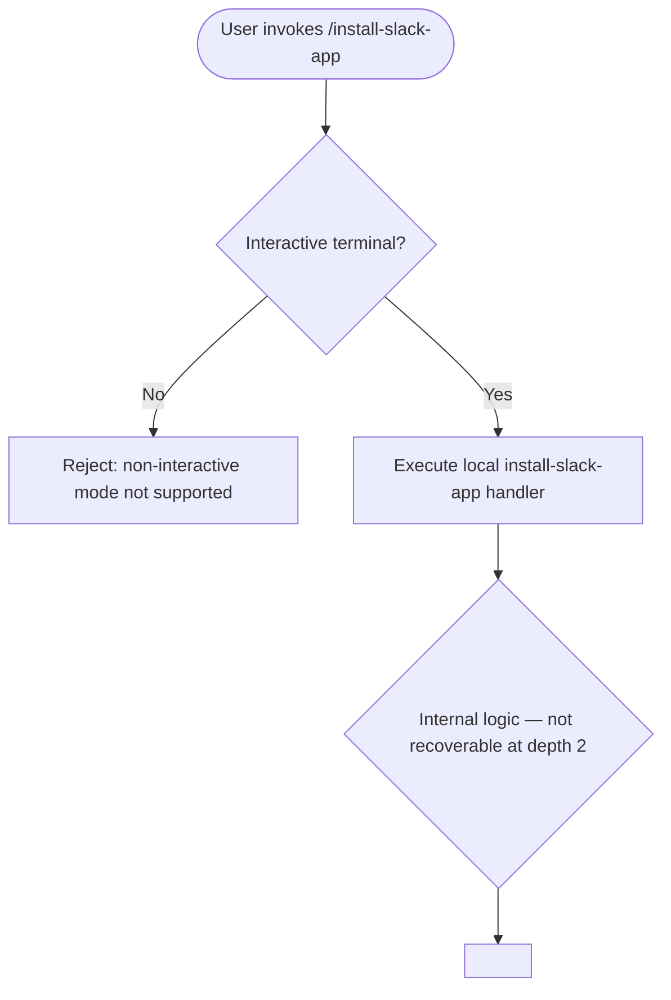

# `/install-slack-app`

> Analysis basis: CC v2.1.144 bundle.js (AST extraction + Claude interpretation)
> Minimum version: v2.1.144

---

## Overview

The `/install-slack-app` slash command initiates the installation flow for the Claude Slack application. It is registered as a `local` command type, meaning it executes entirely within the CLI process without requiring a remote round-trip. The command does not support non-interactive execution, indicating it depends on an interactive terminal session to complete the Slack app installation process.

---

## Registration

| Field | Value |
|---|---|
| type | `local` |
| name | `install-slack-app` |
| description | `Install the Claude Slack app` |
| supportsNonInteractive | `false` |
| module_id | `e$q` |

Analysis basis: CC v2.1.144 bundle.js:+10745971

---

## Input Branching

The depth-2 AST traversal returned an empty call graph (`callGraph: []`), no literals (`literals: []`), and no telemetry events (`telemetry: []`) for module `e$q`. The extractor also recorded the note: `"no entry functions found for module 'e$q'"`. Accordingly, the internal branching logic cannot be reconstructed from the available data.

<!-- TODO: not found in depth-2 traversal; needs --depth 4 -->

The only behaviorally verified facts are:

1. The command is registered as `type: "local"`.
2. `supportsNonInteractive: false` — the command will refuse or fail to execute in non-interactive (headless / piped) environments.



Analysis basis: CC v2.1.144 bundle.js:+10745971 (`supportsNonInteractive: false`)

---

## Behavioral Spec

### Guard: Non-Interactive Rejection

Because `supportsNonInteractive` is `false`, the CLI framework evaluates the current execution context before delegating to the command handler. If the session is non-interactive (e.g., stdout is not a TTY, or the `--no-interactive` flag is active), the framework aborts execution and surfaces an appropriate error to the caller.

```
function guardInteractiveSession(context):
    if context.isNonInteractive:
        raise CommandError("install-slack-app does not support non-interactive mode")
    else:
        proceed to installSlackAppHandler(context)
```

Analysis basis: CC v2.1.144 bundle.js:+10745971

### Core Handler: installSlackAppHandler

The entry-point function(s) for module `e$q` were not resolved during depth-2 traversal. The internal steps of the Slack app installation flow — such as OAuth handshake, browser launch, token exchange, or credential persistence — cannot be documented as verified facts from the available data.

```
function installSlackAppHandler(context):
    // Internal implementation not recoverable at depth-2 traversal
    // TODO: re-run AST extractor with --depth 4 targeting module e$q
    ...
```

<!-- TODO: not found in depth-2 traversal; needs --depth 4 -->

---

## State & Side Effects

| Item | Detail |
|---|---|
| Telemetry | None detected at depth-2 traversal — `telemetry: []`. <!-- TODO: needs --depth 4 --> |
| Hook registration | <!-- TODO: not found in depth-2 traversal; needs --depth 4 --> |
| appState changes | <!-- TODO: not found in depth-2 traversal; needs --depth 4 --> |
| Sound | <!-- TODO: not found in depth-2 traversal; needs --depth 4 --> |
| Non-interactive guard | Command is blocked when `supportsNonInteractive: false` and session is headless |

Analysis basis: CC v2.1.144 bundle.js:+10745971

---

## Version History

| Version | Change |
|---|---|
| v2.1.144 | Initial analysis — registration confirmed; call graph unresolved at depth-2 |

---

## Common Mistakes

1. **Running in CI / headless environments**: Because `supportsNonInteractive` is `false`, invoking `/install-slack-app` inside a non-TTY pipeline (e.g., `echo "/install-slack-app" | claude`) will fail. Always run this command in a live interactive terminal session.
2. **Expecting programmatic output**: As a `local` command with no confirmed non-interactive support, callers should not attempt to parse stdout output in scripts without first verifying that future versions have set `supportsNonInteractive: true`.
3. **Assuming idempotency**: The installation side-effects (credential storage, OAuth tokens, etc.) are not confirmed from the current traversal depth. Re-running the command when the Slack app is already installed may or may not be safe — verify with a deeper traversal or empirical testing before automating.

---

## Appendix — Identifier Mapping

> For bundle debugging only. Identifiers change across versions.

| Identifier | Role |
|---|---|
| `e$q` | Module ID for the `install-slack-app` command registration and handler |

> No additional obfuscated identifiers were present in the depth-2 traversal (`identifiers: []`).
> <!-- TODO: re-run with --depth 4 to recover handler-level identifiers -->