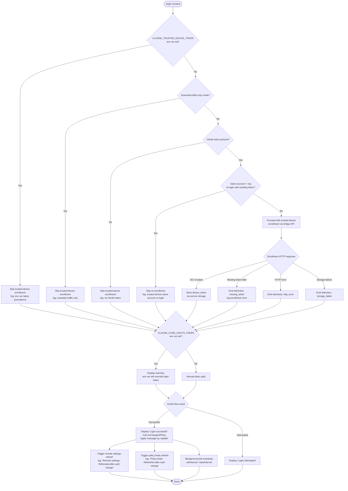

# `/login`

> Analysis basis: CC v2.1.154 bundle.js (AST extraction + Claude interpretation)
> Minimum version: v2.1.154

---

## Overview

The `/login` command allows users to switch Anthropic accounts or sign in with their Anthropic account via an OAuth flow directly within Claude Code. It renders a JSX-based interactive UI component (`local-jsx` type) that guides the user through authentication, handles token storage, and triggers downstream side effects including API key updates, remote settings refresh, and trusted-device enrollment.

---

## Registration

| Field | Value |
|---|---|
| type | `local-jsx` |
| name | `login` |
| description | `Switch Anthropic accounts \| Sign in with your Anthropic account` |
| loc_byte | `11335242` |
| loc_byte_end | `11335475` |
| loc_line | `8330` |
| module_id | `M71` |
| load_inline | `true` |
| arbor_handler.name | `eh1` |
| arbor_handler.fqn | `claude-2.1.154::eh1` |
| arbor_handler.kind | `Function` |
| arbor_handler.resolution_path | `direct` |
| arbor_handler.n_hits | `2` |

Analysis basis: CC v2.1.154 bundle.js:+11335242

---

## Input Branching

The `/login` flow involves more than three distinct branches (trusted-device checks, token presence, environment-variable override, OAuth success vs. interruption, same-account re-login shortcut, and policy/remote-settings refresh). A Mermaid flowchart is used.



---

## Behavioral Spec

### 1. Top-Level Login Handler (`eh1` / `LW8`)

The main handler renders the login React component. On mount it:

1. Reads current `appState` via `H.getAppState` (bundle.js:+9076612).
2. Calls the API-key change helper (`onChangeAPIKey`) once authentication completes (bundle.js:+9076204).
3. Applies a message operation of type `"update"` to the active conversation (bundle.js:+9076246).
4. Invokes the credentials-write pipeline, the trusted-device enrollment flow, and the remote-settings / policy-limits refresh chain.
5. Calls `H.setAppState` (bundle.js:+9076708) with the new session data after success.

```
function loginHandler(context):
    currentState = context.getAppState()

    if sameAccountReloginWithExistingToken(currentState):
        log("[trusted-device] Same account+org re-login with existing token, skipping re-enrollment")
        # skip enrollment entirely
    else:
        enrollTrustedDevice(currentState)

    result = await runOAuthFlow(context)

    if result.success:
        context.onChangeAPIKey(result.token)
        context.applyMessageOp("update")
        triggerRemoteSettingsRefresh()
        triggerPolicyLimitsRefresh()
        context.setAppState(newState)
        renderOutcome("Login successful")
    else:
        renderOutcome("Login interrupted")
```

Analysis basis: CC v2.1.154 bundle.js:+9076204, +9076246, +9076291, +9076612, +9076708

---

### 2. Credential Resolution Pipeline (`credentialResolver` / `u$`)

Determines which authentication credential is active. Evaluated in priority order:

1. `ANTHROPIC_API_KEY` environment variable (bundle.js:+2945727).
2. `CLAUDE_CODE_API_KEY_FILE_DESCRIPTOR` file-descriptor path (bundle.js:+2065835).
3. `apiKeyHelper` external helper process (bundle.js:+2945821).
4. OAuth token from secure storage.
5. WIF (Workload Identity Federation) — requires `ANTHROPIC_FEDERATION_RULE_ID` + `ANTHROPIC_ORGANIZATION_ID`.

If none of the above are present, throws an error with the message:
> "ANTHROPIC_API_KEY, CLAUDE_CODE_OAUTH_TOKEN, or WIF env vars (ANTHROPIC_FEDERATION_RULE_ID + ANTHROPIC_ORGANIZATION_ID) required"
(bundle.js:+2946155)

```
function resolveCredential():
    if env.ANTHROPIC_API_KEY:
        return apiKeyCredential(env.ANTHROPIC_API_KEY)
    if env.CLAUDE_CODE_API_KEY_FILE_DESCRIPTOR:
        fd = readFd(env.CLAUDE_CODE_API_KEY_FILE_DESCRIPTOR, maxBytes=20)
        return apiKeyCredential(fd.trim())   # max 20 chars sliced (bundle.js:+2067501)
    if config.apiKeyHelper != "none":
        return helperCredential(config.apiKeyHelper)
    if oauthToken := secureStorage.read():
        return oauthCredential(oauthToken)
    if env.ANTHROPIC_FEDERATION_RULE_ID and env.ANTHROPIC_ORGANIZATION_ID:
        return wifCredential()
    throw Error("ANTHROPIC_API_KEY, CLAUDE_CODE_OAUTH_TOKEN, or WIF env vars ... required")
```

Analysis basis: CC v2.1.154 bundle.js:+2945727, +2945821, +2946155, +2067501

---

### 3. Profile & Auth-Type Detection (`profileDetector` / `CR` → `GA`)

Classifies the active credential into one of several backend types that affect which API endpoint is used:

| Literal | Meaning | loc_byte |
|---|---|---|
| `bedrock` | AWS Bedrock endpoint | +2044343 |
| `foundry` | Azure AI Foundry endpoint | +2044393 |
| `anthropicAws` | Anthropic-managed AWS | +2044449 |
| `mantle` | Mantle proxy | +2044503 |
| `vertex` | Google Vertex AI | +2044551 |
| `firstParty` | Direct Anthropic API | +2044560 |
| `gateway` | Custom gateway | +6810280 |
| `local-agent` | Local agent mode | +6810420 |
| `enterprise` | Enterprise plan | +6810508 |
| `team` | Team plan | +6810530 |

Default first-party API base URL: `api.anthropic.com` (bundle.js:+2045234).

Analysis basis: CC v2.1.154 bundle.js:+2044303, +6810280

---

### 4. OAuth Flow & Token Exchange (`oauthFlow` / `bP`)

Handles the browser-based OAuth round-trip:

1. Generates a random state parameter via `Math.random` (bundle.js:+13408200).
2. Opens the browser to the Anthropic OAuth authorization URL (resolved via environment: `prod`, `staging`, `local`, or `CLAUDE_CODE_CUSTOM_OAUTH_URL`).
3. Spins up a local callback listener on a randomly chosen port; waits up to `setTimeout` (bundle.js:+13408237).
4. Exchanges the authorization code for tokens.
5. Classifies the resulting credential type as `user_oauth` (bundle.js:+2942772) or `profile-implicit` (bundle.js:+2942699).

OAuth endpoint selection:
- Production: resolved from approved list (bundle.js:+950090)
- Custom URL guard: if `CLAUDE_CODE_CUSTOM_OAUTH_URL` is not an approved endpoint, throws: `"CLAUDE_CODE_CUSTOM_OAUTH_URL is not an approved endpoint."` (bundle.js:+950481)
- Local dev ports tried in order: `8000`, `4000`, `3000`, `8205` (bundle.js:+949416, +949503, +949593, +950176)

```
function runOAuthFlow(config):
    env = determineEnvironment()     # prod / staging / local / custom
    authUrl = buildAuthUrl(env, state=Math.random())
    openBrowser(authUrl)
    code = awaitCallbackWithTimeout()
    tokens = exchangeCodeForTokens(code)
    tokens.type = "user_oauth"
    return tokens
```

Analysis basis: CC v2.1.154 bundle.js:+2942772, +950481, +949416, +13408200

---

### 5. Trusted-Device Enrollment (`trustedDeviceEnroller` / `urH`)

Executed after a successful OAuth token is obtained. Conditions that cause enrollment to be **skipped**:

| Condition | Log message | loc_byte |
|---|---|---|
| `CLAUDE_TRUSTED_DEVICE_TOKEN` env var is set | `"[trusted-device] CLAUDE_TRUSTED_DEVICE_TOKEN env var is set, skipping enrollment…"` | +6776820 |
| Essential-traffic-only mode active | `"[trusted-device] Essential traffic only, skipping enrollment"` | +6777134 |
| No OAuth token present | `"[trusted-device] No OAuth token, skipping enrollment"` | +6777247 |
| Same account + org re-login with existing token | `"[trusted-device] Same account+org re-login with existing token, skipping re-enrollment"` | +9076457 |

When enrollment proceeds, the handler:
1. Checks policy via `K.isPolicyAllowed` / `K.isPolicyEnforced` (bundle.js:+6776997, +6777020).
2. Posts to the bridge enrollment endpoint (macOS: `darwin` — bundle.js:+6777443) with:
   - `Content-Type: application/json` (bundle.js:+6777493, +6777508)
   - Timeout: `10000` ms (bundle.js:+6777536)
   - Retry delay: `500` ms (bundle.js:+6777562)
3. Emits telemetry `bridge_trusted_device_enroll` on success (bundle.js:+6777638).
4. Expects HTTP `201` (bundle.js:+6777724); any other status triggers `http_error` path.
5. Validates response contains `device_token` field; missing field triggers `missing_token` path (bundle.js:+6778022).
6. Persists token via secure storage writer (`secureStorageCredentialsWrite` — bundle.js:+2227777).

Analysis basis: CC v2.1.154 bundle.js:+6776820, +6777443, +6777638, +6778022

---

### 6. Remote Settings Refresh (`remoteSettingsRefresher` / `crH` → `xI_`)

Triggered immediately after successful login. Fetches remote managed settings and applies them:

1. Calls `qa` (auth resolver) to obtain a valid bearer token.
2. Issues HTTP GET with headers `User-Agent` (bundle.js:+6812176) and `If-None-Match` (bundle.js:+6812202) for ETag-based caching.
3. Handles response codes:

| HTTP Code | Action | Log/Telemetry |
|---|---|---|
| 200 | Parse and apply new settings | `"Remote settings: Fetched successfully"` (+6813004) |
| 204 | No content, keep existing | — |
| 304 | Cache still valid | `"Remote settings: Using cached settings (304)"` (+6812356) |
| 401 | Force-refresh auth, retry | `tengu_remote_settings_401_force_refresh_retry` (+6813305) |
| 404 | Delete cached file | `"Remote settings: Deleted cached file (404 response)"` (+6815120) |

4. On fetch failure, uses stale cache: `"Remote settings: Using stale cache after fetch failure"` (bundle.js:+6814418).
5. Validates settings structure; invalid format logs `"Invalid remote settings format"` (bundle.js:+6812714) or `"Invalid settings structure"` (bundle.js:+6812952).
6. When user is shown a security dialog for new managed settings, emits:
   - `tengu_managed_settings_security_dialog_shown` (bundle.js:+6809439)
   - `tengu_managed_settings_security_dialog_accepted` or `tengu_managed_settings_security_dialog_rejected`
7. Notifies subscribers via `cR.notifyChange` (bundle.js:+6816024) after applying.
8. Logs on post-auth refresh: `"Remote settings: Refreshed after auth change"` (bundle.js:+6815929).
9. Background poll interval uses `setInterval` / `clearInterval` (bundle.js:+6769357, +6769425); settings file written atomically using a `384`-byte-minimum temp file (bundle.js:+6813679) with `utf-8` encoding (bundle.js:+6813729).

Analysis basis: CC v2.1.154 bundle.js:+6815929, +6812176, +6813305, +6815120

---

### 7. Policy Limits Refresh (`policyLimitsRefresher` / `Zy9`)

Runs in parallel with remote settings refresh after auth change:

1. Issues authenticated fetch for policy limits.
2. Reports auth type used as one of: `wif`, `oauth`, `api_key` (bundle.js:+6770716, +6770755, +6770772).
3. On 304 Not Modified: `"Policy limits: Cache still valid (304 Not Modified)"` (bundle.js:+6773159).
4. On success: `"Policy limits: Applied new restrictions successfully"` (bundle.js:+6773317).
5. On failure: uses stale cache and emits `tengu_policy_limits_fetch` (bundle.js:+6772746).
6. Loading-promise timeout causes resolve with log: `"Policy limits: Loading promise timed out, resolving anyway"` (bundle.js:+6770073).
7. Logs `"Policy limits: Refreshed after auth change"` (bundle.js:+6774054) on completion.

Analysis basis: CC v2.1.154 bundle.js:+6772746, +6774054, +6770073

---

### 8. Secure-Storage Credential Writer (`secureStorageWriter` / `AOq`)

Persists the OAuth token after login. Attempts storage in priority order and emits telemetry reflecting the outcome:

| Outcome | Telemetry literal | loc_byte |
|---|---|---|
| Primary storage succeeded | `secure_storage_credentials_write` | +2227777 |
| Primary transient error, skipped fallback | `primary_transient_skip_fallback` | +2227875 |
| Plaintext fallback used | `plaintext_fallback_used` | +2228024 |
| Both primary and fallback failed | `primary_and_fallback_failed` | +2228127 |

Internally calls `Promise.all` (bundle.js:+2228232) for concurrent storage operations.

Analysis basis: CC v2.1.154 bundle.js:+2227777, +2228024, +2228127

---

### 9. Login UI Component (`LoginComponent` / `PXH`)

A React functional component rendered by the `local-jsx` handler:

- Uses `f71.useState` (bundle.js:+9077301) for local state.
- Registers a `confirm:no` handler (bundle.js:+9077608) via the `Settings`/`Global` handler registry (bundle.js:+9077574).
- Invokes `H.onDone` callback (bundle.js:+9077449) on completion.
- Renders a fixed-width column of `21` characters (bundle.js:+9077277).
- Shows post-login warning when `CLAUDE_CODE_OAUTH_TOKEN` env var is detected:
  > "Warning: CLAUDE_CODE_OAUTH_TOKEN is set in your environment and will override this login token at runtime. After logging in, unset that variable for your new credentials to take effect." (bundle.js:+9076831)
- Displays `"Login successful"` (bundle.js:+9077206) or `"Login interrupted"` (bundle.js:+9077225) as the terminal outcome.
- Interrupt keys wired: `Esc` exits with `"cancel"` outcome (bundle.js:+9077829, +9077860); `Ctrl-C` / `Ctrl-D` dispatch `app:interrupt` / `app:exit` (bundle.js:+4061862, +4061880).
- Final rendered heading: `"Login"` (bundle.js:+9078313) with `"permission"` tag (bundle.js:+9078338).

Analysis basis: CC v2.1.154 bundle.js:+9077206, +9077225, +9076831, +9077277

---

## State & Side Effects

| Item | Detail |
|---|---|
| Telemetry | `tengu_remote_settings_401_force_refresh_retry` (+6813305); `tengu_feature_bad` (+965234); `tengu_feature_ok` (+965176); `tengu_managed_settings_security_dialog_shown` (+6809439); `tengu_managed_settings_security_dialog_accepted` (+6809123); `tengu_managed_settings_security_dialog_rejected` (+6809173); `tengu_policy_limits_fetch` (+6772746); `tengu_feature_sad` (+965311); `tengu_disable_bypass_permissions_mode` (+10409668); `tengu_auto_mode_config` (+10407696); `tengu_daemon_config_reload` (+15493092); `bridge_trusted_device_enroll` (+6777638) |
| Hook registration | `L_.registerHandler` called at +4019247 to register `confirm:no` interrupt; `fQH.subscribe` at +3184700 for store subscription; `process.removeListener` / `process.off` for cleanup (+3189198, +3188506) |
| appState changes | `H.getAppState` read at +9076612; `H.setAppState` write at +9076708 after successful login |
| Remote settings | `cR.notifyChange` fired at +6816024 and +6816356; background poll via `setInterval`/`clearInterval` at +6769357/+6769425 |
| Policy limits | Background poll registered via `Zy9`; `_9` → `f$A.register` at +58450 |
| Cache files | Atomic temp-file write (+6813679, utf-8); `QkH.unlink` for cache cleanup at +6815104; `H26.writeFile` for settings persistence at +6772408 |
| Secure storage | OAuth token stored via `AOq`; telemetry emitted for all storage outcomes |
| Cleanup | `$QH` clears multiple maps (`hzH`, `k88`, `Iz6`, `Oz_`, `$U`) and removes process listeners on teardown (+3188625–+3188673); `clearTimeout` at +6773926 |
| Sound | <!-- TODO: not found in depth-2 traversal; needs --depth 4 --> |

---

## Version History

| Version | Change |
|---|---|
| v2.1.154 | Initial analysis |

---

## Common Mistakes

1. **Leaving `CLAUDE_CODE_OAUTH_TOKEN` set after `/login`**: The command itself warns about this at runtime (bundle.js:+9076831). The env var takes precedence over the freshly stored token, so the user must `unset CLAUDE_CODE_OAUTH_TOKEN` in their shell for the new credentials to take effect.
2. **Using `/login` in essential-traffic-only mode**: Trusted-device enrollment is silently skipped when essential-traffic-only mode is active (bundle.js:+6777134), which may lead to unexpected device trust state.
3. **Custom OAuth URL not on the approved list**: Setting `CLAUDE_CODE_CUSTOM_OAUTH_URL` to an unapproved endpoint will throw an error immediately (bundle.js:+950481) before any OAuth flow begins.
4. **Expecting instant remote settings propagation**: After login, settings are refreshed asynchronously. If a background poll is already running (`setInterval`), the new fetch is scheduled rather than immediate; stale cache may briefly be used.
5. **Interrupting mid-flow with Ctrl-C**: This dispatches `app:interrupt` (bundle.js:+4061862), which exits the entire app rather than just cancelling the login dialog. Use `Esc` to cancel only the login (bundle.js:+9077829).

---

## Appendix — Identifier Mapping

> For bundle debugging only. Identifiers change across versions.

| Identifier | Role |
|---|---|
| `LW8` | Main login component logic / handler body |
| `eh1` | Arbor-resolved top-level login handler (Function) |
| `jxH` | Timestamp utility (wraps `Date.now`) |
| `crH` | Post-auth side-effects orchestrator (remote settings + policy refresh trigger) |
| `Ph9` | Auth-state pre-check helper |
| `RI_` | Auth resolution initializer |
| `LyA` | Auth lookup utility |
| `qa` | Auth token resolver / bearer-token provider |
| `i9H` | Directory/path helper |
| `$e` | Config accessor utility |
| `GA` | Provider type classifier (bedrock/foundry/vertex/etc.) |
| `xH` | String coercion utility |
| `lWH` | Locale/string formatting helper |
| `C$` | Configuration reader |
| `R5` | API request builder |
| `RZ` | Retry/backoff utility (calls `Uq`) |
| `BO6` | Retry variant (calls `Uq`) |
| `u$` | Credential resolution pipeline |
| `lK` | Low-level string/key helper |
| `pN` | Flag-settings loader |
| `SO6` | Secondary config reader |
| `oJ` | Auth helper subprocess launcher |
| `GxH` | VS Code integration check (`claude-vscode`) |
| `lf6` | File-descriptor credential reader |
| `bP` | OAuth flow executor |
| `b6` | Token storage / credential persistence helper |
| `_R` | String slice utility (max 20 chars) |
| `CI_` | Remote settings change notifier |
| `hH` | Settings notification queue manager |
| `F_` | Error formatter |
| `q1` | Essential-traffic-only mode checker |
| `D84` | Notification queue shift/push handler |
| `xI_` | Remote settings fetch-and-apply pipeline |
| `N` | HTTP network request executor |
| `URK` | Request construction helper |
| `RH` | JSON serializer (wraps `JSON.stringify`) |
| `v4` | URL path builder |
| `HuH` | Hash/digest utility |
| `gRK` | File write pipeline (with buffer length check) |
| `q$H` | Cache state manager (clear on reset) |
| `r94` | Cache entry reader |
| `Xz` | Cache clear helper (clears `lR6`, `Hu8`) |
| `hy9` | Settings hash calculator (SHA-256) |
| `jI_` | Deep-object serializer (recursive) |
| `rr7` | Remote settings HTTP fetch loop |
| `nr7` | Request normalizer |
| `jh9` | Remote settings HTTP fetch implementation |
| `b8H` | Exponential backoff calculator |
| `Q8` | Async abort/timeout controller |
| `uH` | State reader (React context) |
| `c` | React context accessor |
| `IpH` | Intermediate settings parser |
| `yH` | App state selector |
| `Dh9` | Settings diff/apply helper |
| `fP` | Deep clone utility (wraps `structuredClone`) |
| `yb` | Settings structure validator |
| `$h9` | Managed-settings security-check orchestrator |
| `x38` | Settings key extractor |
| `BrH` | Settings entry enumerator |
| `py9` | Settings diff presenter |
| `fZ` | Settings approval dialog helper |
| `Mh9` | Dialog state machine |
| `Fr7` | Requester queue manager |
| `vU` | Dialog write-permission helper |
| `q` | File unlink helper |
| `A` | Case-normalizer / lowercase helper |
| `hc` | Dialog cleanup handler |
| `Oh9` | Settings post-apply notifier |
| `SK` | Settings change notification dispatcher |
| `or7` | Atomic file writer (temp file + datasync) |
| `iL6` | Path join helper (uses `KyA.join`) |
| `J8` | File operation error handler |
| `Xh9` | Background poll scheduler for remote settings |
| `v38` | Poll interval controller (`setInterval`/`clearInterval`) |
| `sr7` | Background poll fetch-and-apply cycle |
| `_9` | Plugin/hook registration helper (`f$A.register`) |
| `_26` | API key update pipeline |
| `KI_` | API key change debounce handler |
| `MI_` | API key validator |
| `I4H` | API key format checker |
| `g3q` | Key format pattern matcher |
| `VgH` | Key type detector |
| `k38` | API key commit and write helper |
| `CR` | Full credential set builder |
| `VcH` | Config file path resolver |
| `y38` | Policy-limits refresh orchestrator |
| `Zy9` | Policy limits fetch-and-apply pipeline |
| `nD6` | Policy limits file reader |
| `lD6` | Policy limits cache writer |
| `Xr7` | Policy limits hash calculator |
| `Pr7` | Policy limits credential extractor |
| `Wr7` | Policy limits HTTP fetch loop |
| `t6` | Context reader helper |
| `Tr7` | Policy limits atomic file writer |
| `Ey9` | Policy limits background poll scheduler |
| `Zr7` | Policy limits background poll cycle |
| `VzH` | Session teardown helper |
| `IHH` | Session cleanup orchestrator |
| `Mx` | Store accessor |
| `fx` | Store subscription helper |
| `wR` | Store change listener |
| `$QH` | Full session cleanup (clears all maps, removes process listeners) |
| `Jz_` | Process-exit cleanup handler |
| `b7` | Token/credential builder |
| `TY` | Token serializer |
| `PO` | Provider config accessor |
| `CO6` | Key-generation helper |
| `kgH` | Key encoding utility |
| `YI_` | Trusted-device enrollment entry point |
| `G_` | Module initializer / `__esModule` setter |
| `MR6` | Module binding helper |
| `t7H` | Trusted-device enrollment flow controller |
| `E6` | Enrollment state machine |
| `hz6` | Store getter |
| `Sz6` | Store setter |
| `y88` | Enrollment deduplication guard |
| `oK` | Credential storage read/write coordinator |
| `AOq` | Secure-storage credential writer |
| `pTH` | Primary storage writer |
| `urH` | Trusted-device enrollment HTTP handler |
| `ky` | Enrollment state updater |
| `NBq` | Feature-flag-aware enrollment helper |
| `L` | Promise lifecycle manager |
| `Er7` | Enrollment retry helper |
| `$I_` | Enrollment guard |
| `K` | Policy checker (`isPolicyAllowed`/`isPolicyEnforced`) |
| `f` | File handle lifecycle manager |
| `Sq` | OAuth URL validator |
| `AZA` | OAuth base URL resolver |
| `q64` | OAuth endpoint config reader |
| `ZH` | String coercion wrapper |
| `A71` | App-state accessor alias |
| `yZ6` | Permission mode state machine entry |
| `KW8` | Permission mode initializer |
| `jz_` | Permission mode store accessor |
| `FkH` | Permission update dispatcher |
| `nM` | Permission rules manager |
| `XM` | Permission rule parser |
| `Z_` | Tool-filter state accessor |
| `jE8` | Allowed-tools filter |
| `aA` | Tool filter applicator |
| `JE8` | Disallowed-tools filter |
| `_F_` | Flag-settings loader |
| `hZ6` | Model-selector state machine |
| `SZ6` | Full model-selection component |
| `yHH` | Model feature checker |
| `h88` | Model feature-flag helper |
| `en_` | Model list enumerator |
| `tn_` | Model selection handler |
| `J9` | Model name normalizer |
| `Ce` | Model capability checker |
| `e9` | Model alias resolver |
| `$X` | Model display formatter |
| `EgH` | Extended-thinking model gater |
| `O9` | Inference-profile checker |
| `_66` | Auto-mode gate helper |
| `rg` | Gate result reporter |
| `Y` | Terminal output renderer |
| `E2H` | Terminal render engine |
| `Lt1` | Column layout calculator |
| `T` | Keyboard input handler |
| `E` | Spinner/progress controller |
| `QEK` | Heartbeat emitter |
| `V` | Supervisor start helper |
| `$s` | Settings summary renderer |
| `ZS` | Status bar renderer |
| `_7H` | Permission-mode-changed event emitter |
| `Y4` | Event emitter wrapper |
| `h5H` | Permission display builder |
| `QEL` | Login outer wrapper component |
| `PXH` | Login UI React component |
| `Ew` | App-state store connector |
| `w6` | Zustand store context bridge |
| `ej_` | React context validator |
| `_71` | Store subscription React hook |
| `iQ` | External store subscriber |
| `GBq` | Microtask-safe state resolver |
| `w0` | Theme/model selector context |
| `EA` | Credential-aware request builder |
| `HR` | Array-safe include helper |
| `pe` | Plan-type resolver |
| `K1` | Plan accessor |
| `ZOH` | Default-Claude-max plan handler |
| `BQ` | Enterprise-usage-based plan handler |
| `BBH` | Enterprise-plan token builder |
| `EIq` | Enterprise credential finalizer |
| `EZ` | Model-capability resolver |
| `Bf` | Base model feature extractor |
| `M5` | Extended model metadata loader |
| `vP` | Pro-plan handler |
| `S1H` | String key hasher |
| `R1H` | Pro-plan key builder |
| `hN` | Model name display helper |
| `OD` | Notification context reader |
| `L_` | Handler registration hook |
| `Hj` | Key-binding context reader |
| `TM` | Text-input component |
| `P69` | Text-input with model selector |
| `mX_` | Input field component |
| `IR` | Debounced input handler |
| `M` | Conversation context accessor |

---

*Note: index built via Arbor fallback; some signals (telemetry, literals) may be missing — see arbor-fallback.js.*