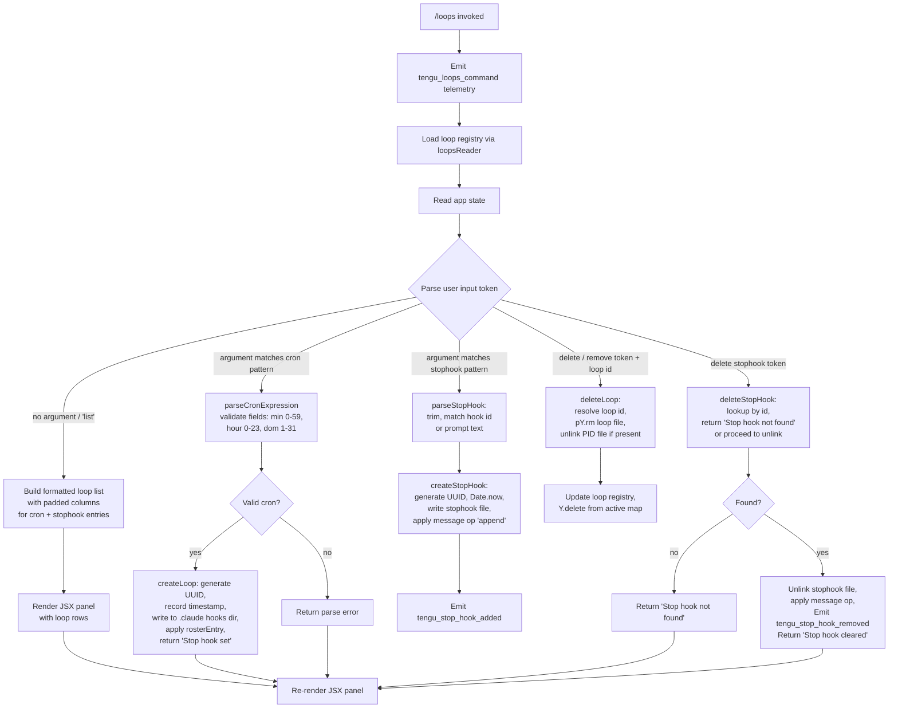

# `/loops`

> Analysis basis: CC v2.1.156 bundle.js (AST extraction + Claude interpretation)
> Minimum version: v2.1.156

---

## Overview

The `/loops` command provides a management interface for Claude Code's recurring-loop and stop-hook subsystem. It allows users to list currently active loops and stop-hooks, create new recurring loops (backed by cron-style scheduling), and delete existing ones. The command renders a JSX UI panel and dispatches operations against the background daemon's loop registry.

---

## Registration

| Field | Value |
|---|---|
| type | `local-jsx` |
| name | `loops` |
| description | `List, create, and delete recurring loops and stop-hooks` |
| loc_byte | `12192158` |
| loc_byte_end | `12192340` |
| loc_line | `9093` |
| immediate | `true` |
| module_id | `_c1` |
| load_inline | `true` |
| arbor_handler.name | `wL5` |
| arbor_handler.fqn | `claude-2.1.156::wL5` |
| arbor_handler.kind | `AsyncFunction` |
| arbor_handler.resolution_path | `module_id` |
| arbor_handler.n_hits | `0` |

Analysis basis: CC v2.1.156 bundle.js:+12192158

---

## Input Branching

The handler processes at least five distinct operation modes derived from user input and current app state: **list** (no arguments or explicit listing), **create cron loop**, **create stop-hook**, **delete loop**, and **delete stop-hook**. A Mermaid flowchart is used because there are more than three distinct branches.



---

## Behavioral Spec

### Main Handler — `loopsCommandHandler` (bundle: `wL5`)

The handler is an `AsyncFunction` resolved via `module_id` path through module `_c1`.

```
async function loopsCommandHandler(commandContext):
    emit telemetry("tengu_loops_command")           // bundle.js:+12191115
    registry = await loopsReader(commandContext)    // reads loop definitions
    stophookList = await stophookReader()           // Q6H call at +12191153
    buildLoopTable(registry, stophookList)          // $66 at +12191161
    appState = getAppState()                        // +12191165
    loopType = appState.get("cron")                 // literal "cron" at +12191211

    // Map loop entries to display rows
    displayRows = registry.map(loopEntry => formatRow(loopEntry))  // +12191193

    // Parse the user's subcommand/argument
    parsedInput = parseUserInput(commandContext.userInput)          // UV at +12191244

    if parsedInput.action == "create_cron":
        cronSpec = parseCronSchedule(parsedInput.args)             // DL5 at +12191665
        newLoop = createLoop(cronSpec)                             // clH at +12191763
        applyLoopToState(newLoop)                                  // z66 at +12191539
        return renderPanel(displayRows, status="Stop hook set")    // literal at +12191875

    elif parsedInput.action == "create_stophook":
        hookDef = buildStopHookDef(parsedInput.args)
        applyStopHookToState(hookDef)                              // O66 at +12191851
        emit telemetry("tengu_stop_hook_added")                    // +10532161
        return renderPanel(displayRows, status="Stop hook set")

    elif parsedInput.action == "delete_loop":
        result = deleteLoopEntry(parsedInput.id)                   // g6H at +12191400
        return renderPanel(displayRows, status=result)

    elif parsedInput.action == "delete_stophook":
        result = deleteStopHook(parsedInput.id)
        if not result.found:
            return renderPanel(displayRows, status="Stop hook not found")  // +12191557
        emit telemetry("tengu_stop_hook_removed")                  // +10532529
        return renderPanel(displayRows, status="Stop hook cleared") // +12191579

    else:  // default: list
        return renderPanel(displayRows)

    createElement(panelComponent, props)                           // +12191918
```

Analysis basis: CC v2.1.156 bundle.js:+12191113

---

### Loop Registry Reader — `loopsReader` (bundle: `ivH`)

Reads the persistent loop store from disk and parses the UTF-8 encoded definition file.

```
async function loopsReader(context):
    basePath = buildLoopPath(context)         // r4H at +4784442, n48.join at +4784362
    rawBytes = await fs.readFile(basePath, encoding="utf-8")  // +4784431, literal "utf-8" at +4784459
    parsed = parseLoopDefinitions(rawBytes)   // A9 at +4784481
    if not Array.isArray(parsed):             // +4784575
        return []
    hooks = buildHookList(parsed)             // hH at +4784503
    processedItems = parsed.map(item => normalizeItem(item))  // N at +4784754
    serialize = serializeRegistry(processedItems)             // RH at +4784801
    cronEntries = parseCronEntries(serialize)                 // fk at +4784823
    registry.push(cronEntries)                                // +4784918
    return registry
```

Analysis basis: CC v2.1.156 bundle.js:+4786419

---

### Cron Schedule Parser — `parseCronSchedule` (bundle: `DL5`)

Converts a human-readable or cron-notation string into a validated schedule object.

```
function parseCronSchedule(inputString):
    match = inputString.match(cronPattern)    // H.match at +12190701
    if not match:
        return error("invalid cron expression")

    minuteField = parseInt(match.groups.minute)   // parseInt at +12190738
    hourField   = parseInt(match.groups.hour)

    // Clamp and validate
    minuteField = Math.max(0, minuteField)         // Math.max at +12190823
    minuteField = Math.ceil(minuteField)           // Math.ceil at +12190834; max minute = 59 (+12190880)
    hourField   = Math.round(hourField)            // Math.round at +12190907; max hour = 23 (+12190951)
    dayField    = validated in range [1, 31]       // literal 31 at +12191004; literal 60 at +12190846 (minute upper bound)

    // Fallback human descriptions
    if schedule == "every_minute":
        label = "Every minute"                    // literal at +4782323
    elif schedule == "every_hour":
        label = "Every hour"                      // literal at +4782540
    elif schedule matches range notation "1-5":   // literal at +4783247
        label = formatRangeLabel(schedule)

    // Day-of-week UTC alignment
    utcDay  = date.getUTCDay()                    // J.getUTCDay at +4783080
    utcDate = date.setUTCDate(...)                // J.setUTCDate at +4783099
    hours   = date.setUTCHours(...)               // J.setUTCHours at +4783130
    local   = date.getDay()                       // J.getDay at +4783159

    return { minute: minuteField, hour: hourField, dom: dayField, label }
```

Analysis basis: CC v2.1.156 bundle.js:+12190701

---

### Create Loop Entry — `createLoop` (bundle: `clH`)

Materialises a new loop record and writes it to the `.claude` hooks directory.

```
async function createLoop(cronSpec, context):
    loopId   = crypto.randomUUID()              // S79.randomUUID at +4785759
    timestamp = Date.now()                      // +4785821
    hookData  = buildHookPayload(cronSpec)      // rWH at +4785867
    loopRecord = { id: loopId, createdAt: timestamp, ...hookData }

    await loopsReader(context)                  // ivH at +4785911 — refresh before write
    loopList.push(loopRecord)                   // M.push at +4785924

    // Write to .claude directory
    await writeLoopFile(loopList)               // dlH at +4786018, literal ".claude" at +4785600
    //   dlH internally: mkdir + path.join + writeFile + serialize

    k6(context)                                 // k6 at +4785956 — invalidate display cache
    renderSummary(loopRecord)                   // Si at +4786005
    return loopRecord
```

Analysis basis: CC v2.1.156 bundle.js:+4785759

---

### Write Loop Files — `writeLoopFiles` (bundle: `dlH`)

Persists the updated loop list to the `.claude` configuration directory.

```
async function writeLoopFiles(loopList, basePath):
    hookPath = path.join(basePath, ".claude")   // n48.join at +4785589, literal ".claude" at +4785600
    await fs.mkdir(hookPath, recursive=true)    // l48.mkdir at +4785579
    rows = loopList.map(entry => serializeEntry(entry))  // H.map at +4785640
    serialized = serialize(rows)                // RH at +4785697
    await fs.writeFile(hookPath, serialized)    // l48.writeFile at +4785676
    checksumPath = buildChecksumPath(hookPath)  // r4H at +4785690
```

Analysis basis: CC v2.1.156 bundle.js:+4785568

---

### Delete Loop / Stop-Hook — `deleteLoopEntry` (bundle: `g6H`)

Removes a loop or stop-hook from the registry and from disk.

```
async function deleteLoopEntry(targetId, context):
    hasEntry = checkRegistry(targetId)          // Vt at +4786089, _.has at +51371
    fresh = await loopsReader(context)          // ivH at +4786138
    candidates = fresh.filter(e => e.id != targetId)  // q.filter at +4786147
    if not candidates.has(targetId):            // A.has at +4786162
        return "Stop hook not found"            // literal at +12191557

    await writeLoopFiles(candidates)            // dlH at +4786211
    return "Stop hook cleared"                  // literal at +12191579
```

Analysis basis: CC v2.1.156 bundle.js:+4786089

---

### Apply Stop-Hook to App State — `applyStopHookToState` (bundle: `O66`)

Applies a newly created or cleared stop-hook into the conversation's app state.

```
async function applyStopHookToState(hookDef, context):
    gateCheck = policyCheck("hooks_gate")       // literal "hooks_gate" at +10531671
    trustCheck = policyCheck("trust_gate")      // literal "trust_gate" at +10531725
    goalStatus = appState.get("goal_status")    // literal "goal_status" at +10532688

    current = context.getAppState()             // H.getAppState at +10532274
    updated = { ...current, stophook: hookDef }
    context.setAppState(updated)                // H.setAppState at +10532403

    msgOp = buildMessageOp(kind="append",       // literal "append" at +10532495
                           role="system",       // literal "system" at +12191446
                           content=hookDef.prompt)
    context.applyMessageOp(msgOp)              // H.applyMessageOp at +10532472

    messageId = generateUUID()                  // kT1 → VT1.randomUUID at +10532619
    if hookDef.isNew:
        emit telemetry("tengu_stop_hook_added") // +10532161
        status = "Stop hook set"                // literal at +12191875
    else:
        emit telemetry("tengu_stop_hook_removed") // +10532529
        status = "Stop hook cleared"            // literal at +12191579

    context.log(status)
    await debugLogger(status)                  // d at +10532527
```

Analysis basis: CC v2.1.156 bundle.js:+10531775

---

### Build Loop Table Display — `buildLoopTable` (bundle: `$66`)

Formats the loop registry into padded columns for the JSX panel.

```
function buildLoopTable(registry, stophookList):
    columnMap = new Map()
    for each entry in registry:
        columnMap.set(entry.id, entry)          // K.set at +8756616
        rows = entry.map(field => formatField(field))  // L91 → H.map at +8756385
        // Pad each column to align display
        padded = field.padEnd(columnWidth, "  ")  // f.padEnd at +15502608, literal "  " at +15502629
        // columnWidth capped at 40 chars        // literal 40 at +15504600

    displayRows = []
    for each stophook in stophookList:
        displayRows.push(formatStopHookRow(stophook))   // A.push at +10531599
    return displayRows
```

Analysis basis: CC v2.1.156 bundle.js:+10531475

---

### Parse Cron Entry String — `parseCronEntryString` (bundle: `fk` / `fv7`)

Parses a cron specification string into a structured schedule object.

```
function parseCronEntryString(raw):
    trimmed = raw.trim()                        // H.trim at +4781032
    parts = splitCronFields(trimmed)            // fv7 at +4781118

    function splitCronFields(s):
        fields = s.split(separator)             // H.split at +4780452
        for each field in fields:
            match = field.match(fieldPattern)   // L.match at +4780472
            value = parseInt(match, radix=10)   // parseInt at +4780517; max field slots = 10 at +4780531
            if match.isRange:
                // Expand range: day positions 3,6,7 (Mon=1,Sat=6,Sun=7)  // literals at +4780693, +4780729, +4780735
                expanded = Array.from(rangeSet) // Array.from at +4780980
                rangeSet.add(value)             // K.add at +4780578
        return fields

    // At most 5 cron fields                    // literal 5 at +4781068
    // At most 4 entries per day-range          // literal 4 at +4781231
    result.push(parsedEntry)                    // A.push at +4781153
    return result
```

Analysis basis: CC v2.1.156 bundle.js:+4781032

---

### Stop-Hook Reader — `stophookReader` (bundle: `Q6H`)

Reads stop-hook definitions from the project configuration.

```
async function stophookReader(context):
    loopDefs = await loopsReader(context)       // ivH at +4786419
    stophooks = filterStophooks(loopDefs)       // GG at +4786455; GG uses ov at +50968
    return stophooks
```

Analysis basis: CC v2.1.156 bundle.js:+4786419

---

## State & Side Effects

| Item | Detail |
|---|---|
| Telemetry — `tengu_loops_command` | Fired once on every invocation of `/loops` (bundle.js:+12191115) |
| Telemetry — `tengu_stop_hook_added` | Fired when a new stop-hook is successfully registered (bundle.js:+10532161) |
| Telemetry — `tengu_stop_hook_removed` | Fired when an existing stop-hook is deleted (bundle.js:+10532529) |
| Telemetry — `tengu_bg_dispatch_sigkill_escalate` | Fired from background daemon when SIGKILL escalation occurs (bundle.js:+15478865) |
| Telemetry — `tengu_daemon_control` | Fired on daemon start/stop control operations (bundle.js:+15514702) |
| Telemetry — `tengu_feature_bad` / `tengu_feature_ok` / `tengu_feature_sad` | Feature health probes used indirectly via `uH`/`yH`/`t6` (bundle.js:+965234, +965176, +965311) |
| Telemetry — `tengu_bg_low_mem_mb` | Memory guard, emitted when free memory falls below threshold (bundle.js:+12714592) |
| Telemetry — `tengu_bg_dispatch_low_mem` | Emitted when a background dispatch is deferred due to low memory (bundle.js:+15479444) |
| Telemetry — `tengu_bg_spare_enable` / `tengu_bg_spare_claim` / `tengu_bg_spare_claim_fail` / `tengu_bg_spare_spawn` | Background spare-worker pool lifecycle events (bundle.js:+15480139, +15480260, +15480523, +15478558) |
| Telemetry — `tengu_bg_sendclaim_failed` | Fired when the daemon claim handshake times out (bundle.js:+15459587) |
| Telemetry — `tengu_daemon_yield` | Emitted when the background daemon yields to a foreground process (bundle.js:+15497547) |
| Telemetry — `tengu_daemon_config_reload` | Emitted when the daemon reloads its configuration (bundle.js:+15493353) |
| Telemetry — `tengu_bg_low_mem_mb` | macOS-specific memory guard; 1024 MB threshold (bundle.js:+12714614) |
| Filesystem writes | Loop definition files are written under `.claude/` directory (literal at bundle.js:+4785600) |
| Filesystem writes | Stop-hook files written; on Windows, PID unlink path is separate (literal "windows" at bundle.js:+15485203) |
| App state changes | `setAppState` / `applyMessageOp` called on stop-hook create/delete (bundle.js:+10532403, +10532472) |
| Message operation | An `"append"` message op with `"system"` role is applied when a stop-hook is registered (literals at bundle.js:+10532495, +12191446) |
| Background daemon | Loop scheduling ultimately drives the background daemon (`Bun.spawn` at bundle.js:+15458292); daemon sends SIGTERM then escalates to SIGKILL (literals at bundle.js:+15459825, +15478913) |
| Stop-hook IDs | New stop-hook IDs are generated via `crypto.randomUUID()` (bundle.js:+4785759) |
| Timeout — send-claim | 5000 ms timeout on claim handshake (literal at bundle.js:+15460008); error string "send-claim timeout" (bundle.js:+15460064) |
| Timeout — SIGKILL escalation | 2000 ms before SIGKILL escalation after SIGTERM (literal at bundle.js:+15478491) |
| Timeout — retry interval | 300 000 ms (5 min) loop retry timer (literal at bundle.js:+15485629) |
| Column display width | Loop table columns padded to 40 characters maximum (literal at bundle.js:+15504600) |
| Sound | None observed in depth-2 traversal |

---

## Version History

| Version | Change |
|---|---|
| v2.1.156 | Initial analysis |

---

## Common Mistakes

1. **Passing an invalid cron expression**: The parser (`DL5`) validates minute (0–59), hour (0–23), and day-of-month (1–31) bounds strictly. Strings that do not match the expected pattern return a parse error rather than creating a loop.
2. **Expecting immediate loop execution**: Loops are scheduled via the background daemon. If the daemon is not running or the claim handshake times out (5 000 ms), the loop will not fire until the daemon is available.
3. **Deleting a non-existent stop-hook**: If the provided ID is not in the registry, the command returns "Stop hook not found" and emits no telemetry. No error is thrown.
4. **Assuming Windows behaves identically**: The delete path contains a platform branch for Windows (literal "windows" at bundle.js:+15485203) that handles PID-file unlinking differently.
5. **Confusing loop types**: The command handles two distinct object types — `cron` loops (keyed by literal `"cron"` at bundle.js:+12191211) and `stophook` entries (literal `"stophook"` at bundle.js:+12191297). Create and delete operations must target the correct type.
6. **Memory pressure causing dispatch deferral**: On macOS, background dispatch is deferred when free memory is below 1 024 MB (bundle.js:+12714614). Loops may appear to not fire under low-memory conditions.

---

## Appendix — Identifier Mapping

> For bundle debugging only. Identifiers change across versions.

| Identifier | Role |
|---|---|
| `wL5` | Main handler (`loopsCommandHandler`) — AsyncFunction, resolved via module_id `_c1` |
| `d` | Generic debug/log utility called at command entry |
| `Q6H` | Stop-hook reader — reads stop-hook definitions from config |
| `ivH` | Loop registry reader — reads loop list from disk, UTF-8 |
| `B6` | Path builder helper used by loop reader |
| `r4H` | Loop file path constructor (joins base path segments) |
| `cK` | Path component helper (calls `ov`) |
| `A9` | Loop definition parser — deserialises raw file content |
| `J8` | General-purpose error/result wrapper |
| `hH` | Hook list builder — processes parsed loop definitions |
| `F_` | Error factory used inside hook list builder |
| `xH` | String coercion utility |
| `q1` | Traffic classifier — uses literal "essential-traffic" |
| `D84` | Queue rotation helper (shift/push on `LB6`) |
| `N` | Loop item normaliser — calls UUID generator and HTTP utilities |
| `URK` | Normaliser sub-step — calls `mI`, `pRK`, `$$A` |
| `H` | Multi-role: random delay scheduler (`Math.random` + `setTimeout`) |
| `RH` | JSON serialiser (`JSON.stringify`) |
| `v4` | String/path segment extractor (slice, lastIndexOf, replace) |
| `HuH` | Loop entry enricher (calls `yzA`) |
| `gRK` | HTTP/network request helper (Buffer.byteLength, then-chain) |
| `fk` | Cron entry string parser (outer) |
| `fv7` | Cron field splitter/expander (inner, handles ranges) |
| `A` | General array accumulator (push, toLowerCase) |
| `L` | Stream/resource wrapper (add, finally, delete) |
| `q` | Active-resource set (unlinkSync on cleanup) |
| `f` | Closeable resource (close, finally) |
| `GG` | Stop-hook filter (calls `ov`) |
| `ov` | Core utility/predicate used by multiple helpers |
| `$66` | Loop table formatter — builds padded display columns |
| `eJH` | Column map populator (Map.set + row mapper) |
| `K` | Column map / registry store |
| `L91` | Row mapper (H.map) inside table formatter |
| `k6` | Display cache invalidator (calls `ov`) |
| `UV` | User-input parser — parses subcommand arguments, cron fields, date alignment |
| `w` | Background worker / loop runner object (kill, setTimeout, freemem, hH) |
| `R` | Worker lifecycle manager (kill, write, spawn) |
| `lEK` | Filesystem realpath/stat resolver |
| `Wz` | Worker state helper |
| `$B5` | Worker auxiliary — calls `AW8` |
| `z` | IPC write stream (daemon_stop, daemon_stop_failed) |
| `uH` | Feature-bad probe emitter |
| `yH` | Feature-ok probe emitter |
| `eI8` | Memory/platform probe (macOS freemem, 1024 MB threshold) |
| `E6` | Low-memory dispatch guard |
| `FD6` | Pins file reader (`pins.json`) |
| `lX_` | Pins path builder (dP.join + AT) |
| `m6` | JSON.parse wrapper |
| `P8` | Result wrapper (calls `J8`) |
| `yX7` | Directory loop reader (readdir + stat + readFile) |
| `B` | Connection state checker (`retireIfSettled`) |
| `pH` | Active-session filter |
| `cH` | Permission cache (orphaned-permission handler) |
| `W5A` | Daemon claim sender (connect, write, kill, SIGTERM) |
| `L9A` | Daemon config writer (mkdir + writeFile + JSON.stringify) |
| `mU5` | Claim timeout enforcer (5000 ms, "send-claim timeout") |
| `uU5` | Claim frame builder (`CF.buildClaimFrame`) |
| `bM` | Claim error handler |
| `ZH` | String coercion utility (wraps `String()`) |
| `AF` | Binary frame encoder (Buffer.from, writeUInt32BE, writeUInt8, copy) |
| `N5A` | Loop runner / background task scheduler |
| `mK` | Loop directory path builder (dP.join + AT) |
| `a9` | Per-loop stat reader with cache (`CYH`) |
| `Lj` | Loop state setter (calls `yV`, state "active") |
| `Af` | Loop file path resolver (gO + dP.join + RH + qj) |
| `Q66` | Loop completion handler (Date.now + xsL + catch) |
| `d5H` | Loop PID file path builder |
| `lh` | Loop log path builder (H.split) |
| `OF` | Loop output dir builder (Ga_, F66) |
| `PN6` | Loop roster path builder (N$.join + Ea_) |
| `Y` | Loop lifecycle controller (stop, updateConfig, start, config reload) |
| `D` | Spare worker pool manager (dispose, freemem, P5A, SIGKILL, 2000 ms) |
| `$` | Disposable resource wrapper (`bo1`) |
| `P5A` | Spare worker spawner (Bun.spawn, randomBytes, hex, --bg-spare, 200×50 pty) |
| `S` | Spare slot object (dispose) |
| `j` | Worker map iterator (values, kill) |
| `y` | Worker killer (z.write, d) |
| `J` | Date object used for UTC day/date/hours alignment |
| `g6H` | Delete loop/stophook entry — filters registry and rewrites |
| `Vt` | Registry existence check (`_.has`) |
| `dlH` | Loop file writer (mkdir + path.join + writeFile + checksum) |
| `z66` | App-state applier for loops (getAppState, setAppState, applyMessageOp) |
| `kT1` | UUID generator wrapper (`VT1.randomUUID`) |
| `DL5` | Cron schedule parser (match, parseInt, Math.max/ceil/round, field validation) |
| `clH` | Create loop entry (randomUUID, Date.now, ivH refresh, dlH write) |
| `rWH` | Hook payload builder called by `clH` |
| `M` | MCP/loop connection manager (vSH, JGK, Gm5) |
| `vSH` | MCP server connection driver (Object.entries, tool dispatch, OAuth) |
| `v8H` | MCP tool entry builder |
| `Pk` | MCP tool dispatch helper (GO, Mk_) |
| `H_` | Hook filter helper |
| `nV6` | MCP entry validator |
| `BpL` | MCP batch processor (pl_, kM8, Date.now) |
| `IM8` | MCP item processor (kM8, CX) |
| `NM8` | MCP notification handler (oK) |
| `L8` | MCP debug logger (QmH.push + Li.logMCPDebug) |
| `pc_` | OAuth flow initiator (authenticate, complete_authentication) |
| `Uc_` | OAuth callback handler (callback_url, kuL, yH6) |
| `j21` | MCP connection retrier (zZ8.then, pl_, DZ8) |
| `mc_` | MCP error mapper (CX, oK, L8) |
| `Ak_` | MCP capability checker (O8, A.includes) |
| `dL` | MCP error logger (QmH.push + Li.logMCPError) |
| `O21` | MCP connection state observer (zo) |
| `iV6` | MCP slot id parser (parseInt) |
| `Ul_` | MCP timeout parser (parseInt) |
| `JGK` | MCP connection result applier (applyMcpUpdate, wZ8, ok, ZJ) |
| `wZ8` | MCP update helper (OrH) |
| `ok` | MCP cleanup handler (dH6, K.cleanup) |
| `Gm5` | MCP server group manager (vSH, JGK, dH6, retry logic) |
| `SM8` | MCP server capability set checker (vn7, Nn7) |
| `Q8` | Promise retry/abort helper (setTimeout, clearTimeout, L.unref) |
| `dH6` | MCP connection result dispatcher (OrH) |
| `Si` | Render summary formatter (C1H) |
| `C1H` | Summary string builder (st, trim) |
| `st` | String slicer/formatter (H.slice, TNA, C6, pipe, 200-char limit, 1 000 000 cap) |
| `O66` | Apply stop-hook to app state (hooks_gate, trust_gate, setAppState, applyMessageOp) |
| `Ci_` | Policy gate checker (zU, MD, S_, IL) |
| `zU` | Policy settings reader (h8, policySettings) |
| `h8` | Settings accessor (iF6, ig) |
| `MD` | Policy field reader (h8, JA) |
| `S_` | Trust-gate evaluator |
| `IL` | Hooks-gate evaluator (M17) |
| `M17` | Gate rule evaluator (xH, ZxH, V9, b6, PQH, Fg, C6, fD.resolve) |
| `t6` | Feature-sad probe emitter |
| `Fw` | Output-token counter (zxH, Object.values, "outputTokens") |

---

Note: index built via Arbor fallback; some signals (telemetry, literals) may be missing — see arbor-fallback.js.