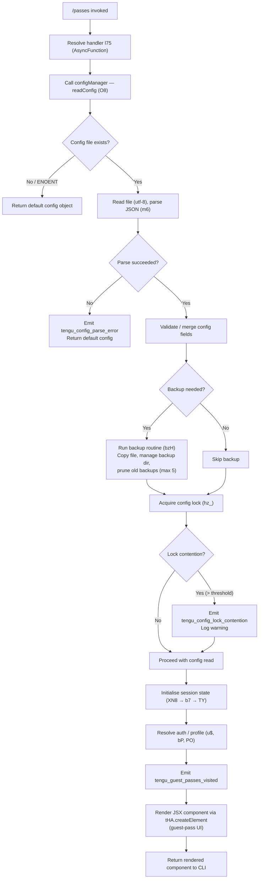

# `/passes`

> Analysis basis: CC v2.1.156 bundle.js (AST extraction + Claude interpretation)
> Minimum version: v2.1.156

---

## Overview

The `/passes` command allows users to share a free week of Claude Code with friends via a "guest pass" mechanism. It is implemented as a `local-jsx` command that renders a React-based UI component, and its execution path reads and manages local configuration state while emitting a dedicated telemetry event upon visitation.

---

## Registration

| Field | Value |
|---|---|
| type | `local-jsx` |
| name | `passes` |
| description | `Share a free week of Claude Code with friends` |
| loc_byte | `12140707` |
| loc_byte_end | `12141029` |
| loc_line | `8995` |
| isHidden | `null` (not hidden) |
| module_id | `Jd1` |
| load_inline | `true` |
| arbor_handler.name | `l75` |
| arbor_handler.fqn | `claude-2.1.156::l75` |
| arbor_handler.kind | `AsyncFunction` |
| arbor_handler.resolution_path | `module_id` |
| arbor_handler.n_hits | `2` |

Analysis basis: CC v2.1.156 bundle.js:+12140707

---

## Input Branching

The command handler (`l75`) follows a moderately branched execution path: it initialises configuration/session data, fires telemetry, then renders a JSX component. The supporting config subsystem (`O8` / `hz_` / `bzH`) has multiple branches for config-file state, backup management, and lock contention. The overall flow has more than three distinct paths and is best represented as a flowchart.



---

## Behavioral Spec

### Top-level handler — `passesCommandHandler`

The handler (`l75`) is an `AsyncFunction` resolved via `module_id` → `Jd1`.

```
async function passesCommandHandler(context):
    configData   = await readCurrentConfig(context)          // O8
    sessionState = await initSession(configData)             // XN8 → b7 → TY
    authProfile  = resolveAuthProfile(sessionState)          // u$, bP, PO

    emitTelemetry("tengu_guest_passes_visited")              // loc_byte:12140530

    element = createElement(GuestPassComponent, {            // tHA.createElement
        config: configData,
        session: sessionState,
        auth: authProfile
    })
    return element
```

Analysis basis: CC v2.1.156 bundle.js:+12140390, +12140424, +12140430, +12140528, +12140579

---

### Config read subsystem — `readConfig`

The config subsystem (`O8`) orchestrates reading the on-disk `~/.claude.json` (or equivalent) configuration file, with backup and lock management delegated to helpers.

```
function readConfig(context):
    rawText = filesystem.readFileSync(configPath, "utf-8")   // bzH, loc_byte:3210214
    if rawText is missing (ENOENT):                          // literal:3210388
        return defaultConfigObject(0 fields, status="unknown")

    parsed = JSON.parse(rawText)                             // m6, loc_byte:183900
    if parse fails:
        emitTelemetry("tengu_config_parse_error")            // loc_byte:3210789
        return defaultConfigObject(status="unknown")

    merged = mergeWithDefaults(parsed)
    // Status literals resolved at this stage:
    //   "unknown", "local", "migrated", "native", "installed",
    //   "disabled", "enabled", "no_permissions",
    //   "not_configured", "global"
    //   (bundle.js:+3205789–3206016)

    if backupRequired(merged):
        runBackup(merged)                                    // bzH

    return merged
```

Analysis basis: CC v2.1.156 bundle.js:+3205150, +3205331, +3210158, +3210214, +3210241

---

### Backup routine — `configBackupManager`

Manages a `backups/` subdirectory alongside the config file. Retains at most **5** backup copies (literal at bundle.js:+3209144).

```
function configBackupManager(configObject):
    backupDir = path.join(configDir, "backups")              // literal:3209726
    if not exists(backupDir):
        filesystem.mkdirSync(backupDir, {recursive:true})    // loc_byte:3210968

    existing = filesystem.readdirStringSync(backupDir)       // loc_byte:3211026
    pruneCount = max(0, existing.length - 5)                 // loc_byte:3209144
    for each oldest entry to prune:
        filesystem.unlinkSync(entry)                         // hz_, loc_byte:3209262

    timestamp = Date.now()                                   // loc_byte:3211279
    destName  = path.basename(configPath) + "." + timestamp  // loc_byte:3210941
    destPath  = path.join(backupDir, destName)               // loc_byte:3211180
    filesystem.copyFileSync(configPath, destPath)            // loc_byte:3211297
```

Analysis basis: CC v2.1.156 bundle.js:+3210941, +3211026, +3209144, +3211180, +3211297

---

### Config lock — `acquireConfigLock`

Handles file-based locking to prevent concurrent writes. Emits `tengu_config_lock_contention` when acquisition takes longer than expected.

```
function acquireConfigLock(configPath):
    lockStart = Date.now()                                   // loc_byte:3207986
    acquireLock(configPath)                                  // hz_ lock path

    elapsed = Date.now() - lockStart
    if elapsed > LOCK_WARN_THRESHOLD:
        log.warn("Lock acquisition took longer than expected…")
        // literal: "Lock acquisition took longer than expected…" :+3208125
        emitTelemetry("tengu_config_lock_contention")        // loc_byte:3208214

    return lockHandle
```

Stale-write protection: if a re-read of config after lock acquisition is missing auth data that was present in the cache, the write is refused and `tengu_config_auth_loss_prevented` is emitted (loc_byte:3208693). The guard text is `"saveConfigWithLock: re-read config is missing auth…"` (bundle.js:+3208541).

Analysis basis: CC v2.1.156 bundle.js:+3208125, +3208214, +3208541, +3208693

---

### Session initialisation — `sessionInit`

Invoked via call chain `l75 → XN8 → b7 → TY`. Sets up the in-process session before the UI component is rendered.

```
async function sessionInit(configData):
    sessionContext = buildContext(configData)                 // TY, loc_byte:2962573
    authHandle     = resolveAuth(sessionContext)              // u$, bP
    profile        = selectProfile(authHandle)               // PO → GA "firstParty"
    if not authHandle.isValid():
        throw Error("ANTHROPIC_API_KEY, CLAUDE_CODE_OAUTH_TOKEN, or WIF env vars … required")
        // literal :+2946155
    return { sessionContext, authHandle, profile }
```

Analysis basis: CC v2.1.156 bundle.js:+11767492, +2962573, +2943708, +2943827, +2946155

---

### Background session eligibility check — `bgSessionCheck`

`O8` also queries the background-session manager (`w`, `E6`) to determine whether a spare daemon is available for the guest-pass flow.

```
function checkBackgroundSessionEligibility():
    freeMem = os.freemem()                                   // k5A.freemem, loc_byte:15479274
    if freeMem < LOW_MEM_THRESHOLD:
        emitTelemetry("tengu_bg_dispatch_low_mem")           // loc_byte:15479444
        return INELIGIBLE

    spareAvailable = spareDaemonPool.claim()                 // W5A, loc_byte:15480193
    if spareAvailable:
        emitTelemetry("tengu_bg_spare_claim")                // loc_byte:15480260
        return SPARE_CLAIMED

    emitTelemetry("tengu_bg_spare_enable")                   // loc_byte:15480139
    return ELIGIBLE_NO_SPARE
```

Analysis basis: CC v2.1.156 bundle.js:+15479274, +15479444, +15480139, +15480193, +15480260

---

## State & Side Effects

| Item | Detail |
|---|---|
| Telemetry — `tengu_guest_passes_visited` | Fired once per `/passes` invocation (loc_byte:+12140530) |
| Telemetry — `tengu_config_parse_error` | Fired when on-disk config JSON cannot be parsed (loc_byte:+3210789) |
| Telemetry — `tengu_config_lock_contention` | Fired when config lock takes longer than expected (loc_byte:+3208214) |
| Telemetry — `tengu_config_stale_write` | Fired when a stale config write is detected (loc_byte:+3208350) |
| Telemetry — `tengu_config_auth_loss_prevented` | Fired when a write is blocked to avoid wiping auth (loc_byte:+3208693) |
| Telemetry — `tengu_bg_spare_enable` | Fired when background spare-daemon eligibility is checked (loc_byte:+15480139) |
| Telemetry — `tengu_bg_spare_claim` | Fired when a spare daemon is successfully claimed (loc_byte:+15480260) |
| Telemetry — `tengu_bg_spare_claim_fail` | Fired when spare-daemon claim fails (loc_byte:+15480523) |
| Telemetry — `tengu_bg_dispatch_low_mem` | Fired when free memory is below threshold during dispatch (loc_byte:+15479444) |
| Telemetry — `tengu_bg_dispatch_sigkill_escalate` | Fired when a background process requires SIGKILL escalation (loc_byte:+15478865) |
| Telemetry — `tengu_bg_sendclaim_failed` | Fired when sending a claim to a background session fails (loc_byte:+15459587) |
| Telemetry — `tengu_feature_ok` / `tengu_feature_bad` | Feature health probes from the session layer (loc_bytes:+965176, +965234) |
| Telemetry — `tengu_bg_low_mem_mb` | macOS-specific low-memory metric (loc_byte:+12714592) |
| Config file access | Reads `~/.claude.json` (utf-8); may copy a backup to the `backups/` subdirectory |
| Backup pruning | Keeps at most 5 config backups; older entries are unlinked (loc_byte:+3209144) |
| File permissions | Backup files written with mode `0o600` (decimal 384, loc_byte:+3209426) |
| Lock acquisition | File lock acquired before any config write; contention is logged and reported |
| Auth-loss guard | Refuses to overwrite config if re-read is missing auth fields (loc_byte:+3208541) |
| JSX rendering | Renders a React element (`tHA.createElement`) for the guest-pass UI (loc_byte:+12140579) |
| Hook registration | `_9` calls `f$A.register` (loc_byte:+58450); exact hook type not determined at depth 2 |
| Sound | <!-- TODO: not found in depth-2 traversal; needs --depth 4 --> |

---

## Version History

| Version | Change |
|---|---|
| v2.1.156 | Initial analysis |

---

## Common Mistakes

1. **Expecting plain-text output**: `/passes` is a `local-jsx` command; it returns a rendered React component, not a markdown or plain-text string. Tooling that expects raw text output will receive a JSX element instead.
2. **Assuming no disk I/O**: The command reads and may update `~/.claude.json` before rendering. Running it in an environment with a read-only home directory will trigger a `tengu_config_parse_error` or filesystem error.
3. **Triggering it in low-memory conditions**: Free-memory checks are performed as part of the dispatch path; on macOS, a `tengu_bg_low_mem_mb` metric is emitted and the background-session flow may be skipped.
4. **Concurrent invocations**: A file lock is taken on the config. Launching two `/passes` invocations simultaneously from the same user account may cause lock-contention warnings and the `tengu_config_lock_contention` event.
5. **Missing auth credentials**: If `ANTHROPIC_API_KEY`, `CLAUDE_CODE_OAUTH_TOKEN`, or the WIF environment variables are absent, session initialisation throws before the guest-pass UI is rendered.

---

## Appendix — Identifier Mapping

> For bundle debugging only. Identifiers change across versions.

| Identifier | Role |
|---|---|
| `l75` | Top-level handler for `/passes` (AsyncFunction, arbor_handler) |
| `b6` | Config-read orchestrator, depth-1 call from `l75` |
| `B6` | Utility / base helper called by multiple config functions |
| `vz_` | Config-path resolver called from `b6` |
| `bzH` | Config backup-and-copy routine |
| `m6` | JSON parse wrapper (calls `JSON.parse`) |
| `kb` | String utility — prefix check / slice (`startsWith` / `slice`) |
| `H` | Miscellaneous helper with `Math.random` / `setTimeout` usage |
| `_` | Filesystem abstraction (readdirStringSync, statSync, toUpperCase) |
| `J8` | Shared utility called across config and session layers |
| `UBq` | Backup-directory file-listing helper |
| `Sz_` | Path join helper for backup paths |
| `M` | State-map helper (`vSH`, `JGK`, `L.get`, `L.values`) |
| `$` | Miscellaneous helper (`startsWith`, `bo1`) |
| `N` | HTTP/API request builder (calls `URK`, `RH`, `v4`, `gRK`) |
| `URK` | Auth token helper (`mI`, `pRK`, `$$A`) |
| `RH` | JSON-stringify wrapper |
| `v4` | URL / path manipulation helper (`FzA`, `replace`, `lastIndexOf`) |
| `HuH` | Utility calling `yzA` |
| `gRK` | HTTP send helper (`kxH`, `cMH`, `Buffer.byteLength`, `mb6.then`) |
| `d` | Logging / diagnostics sink |
| `w` | Background-session manager (orchestrates daemon lifecycle) |
| `A` | Process-map / tool-name registry (`f.toLowerCase`) |
| `R` | Background-process kill/write helper (`lEK`, `Wz`, `z.write`) |
| `uH` | Session-health probe — "feature bad" path (`d`) |
| `yH` | Session-health probe — "feature ok" path (`d`) |
| `eI8` | macOS memory-check helper (`n6`, `E6`) |
| `FD6` | Session-roster file reader (`QP.readFile`, `lX_`, `m6`) |
| `hH` | Error-logging helper (`F_`, `xH`, `q1`, `D84`, `Li.logError`) |
| `B` | Session-retirement filter (`pH.filter`, `cH.has`) |
| `E6` | Background-session dispatcher / cache manager (`hz6`, `Sz6`, `Mx`) |
| `W5A` | Spare-daemon claim/spawn helper (`CF.claim`, `bb8.connect`) |
| `N5A` | Session-lifecycle manager (add/delete/rm/unlink/rosterEntry) |
| `L` | Alias / partial for session-lifecycle queue (shared with `N5A`) |
| `D` | Background-session supervisor loop (`E6`, `eI8`, `n6`, `Wz`) |
| `S` | Disposable session handle |
| `Y17` | Config file-watcher setup (`B88.watchFile` / `unwatchFile`) |
| `Mr` | Watcher callback helper |
| `_9` | Hook-registration helper (`f$A.register`) |
| `XN8` | Session pre-init helper (`b7`, `b6`) |
| `b7` | Session wrapper (`TY`, `b6`) |
| `TY` | Session-context builder (`lK`, `bP`, `PO`, `oJ`, `u$`, `CO6`, `kgH`) |
| `lK` | Context-field initialiser (`xH`) |
| `bP` | Profile builder (`Ii6`, `lK`, `kgH`, `ki`, `pN`, `jQ`, `TTH`) |
| `PO` | Auth-type resolver (`GA` → `"firstParty"`) |
| `oJ` | Session sub-option helper |
| `u$` | Auth-validation and credential-resolution (`lK`, `pN`, `SO6`, `bP`, `b6`) |
| `CO6` | Context-option helper (`kgH`) |
| `kgH` | Context-field setter (`xH`, `E3H`) |
| `O8` | Top-level config-read and session-bootstrap orchestrator |
| `hz_` | Config-file write-with-lock helper (mkdir, statSync, copyFileSync) |
| `o$q` | Config-object factory (`k1_`, `Object.assign`) |
| `k1_` | Default-config builder (`r$q`) |
| `uz6` | Config-path utility called from `O8` and `hz_` |
| `V` | String variable used for `startsWith` check in `hz_` |
| `P` | MCP-server connection manager (`Vb8`, `mh`, `ou`, `Promise.all`, `hH`) |
| `Vb8` | MCP transport factory |
| `F_` | Error-wrapping utility (`Error`, `String`) |
| `E` | Array/string slice operand in `hz_` |
| `$L6` | Atomic safe-write helper (readlink, randomBytes, writeFileSync, renameSync) |
| `O` | Symbolic-link stat helper (`k8`) |
| `P8` | Path-validation helper (`J8`) |
| `f` | Stream / file-descriptor abstraction (`A.close`, `q.close`) |
| `jQH` | Session-info helper called from `O8` |
| `pBq` | Object-entries iterator called from `O8` |
| `JQH` | Timestamp helper (`Date.now`) called from `O8` |
| `yz_` | Config-write path helper (`fD.dirname`, `B6`, `K0`, `RH`, `$L6`) |