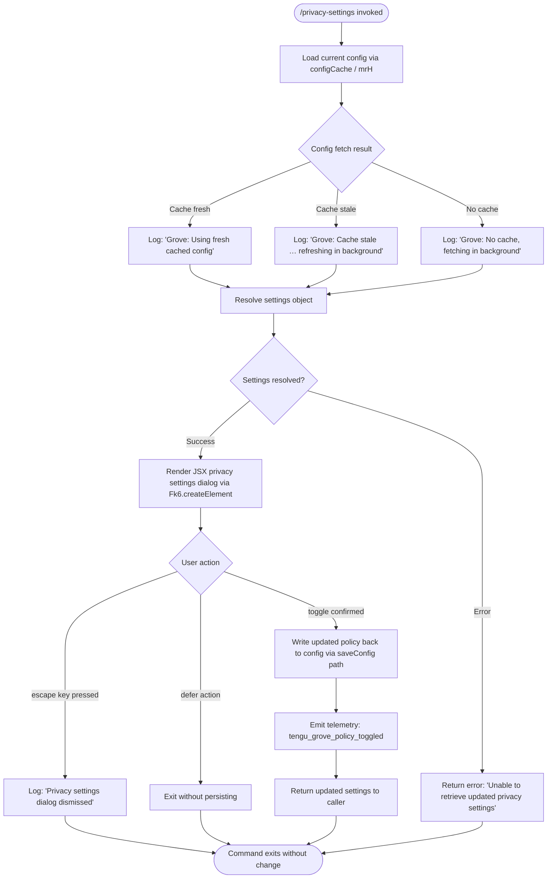

# `/privacy-settings`

> Analysis basis: CC v2.1.154 bundle.js (AST extraction + Claude interpretation)
> Minimum version: v2.1.154

---

## Overview

`/privacy-settings` opens an interactive JSX dialog that lets the user view and toggle privacy-related policies (e.g., telemetry/data-collection opt-ins). The command is handled by an async function that loads the current configuration, renders a React component, and persists any changes back to the global config — emitting a `tengu_grove_policy_toggled` telemetry event on each confirmed change.

---

## Registration

| Field | Value |
|---|---|
| type | `local-jsx` |
| name | `privacy-settings` |
| description | `View and update your privacy settings` |
| module_id | `Td1` |
| load_inline | `true` |
| loc_byte | `12151829` |
| loc_byte_end | `12152021` |
| loc_line | `9005` |
| arbor_handler.name | `a75` |
| arbor_handler.fqn | `claude-2.1.154::a75` |
| arbor_handler.kind | `AsyncFunction` |
| arbor_handler.resolution_path | `module_id` |
| arbor_handler.n_hits | `0` |

Analysis basis: CC v2.1.154 bundle.js:+12151829

---

## Input Branching

The handler has four or more distinct paths based on user interaction with the dialog (dismiss via escape, defer, confirm toggle, error retrieving settings), so a flowchart is used.



Analysis basis: CC v2.1.154 bundle.js:+12150833 (handler entry `a75`), +12150996 (`"escape"`), +12151010 (`"defer"`), +12151021 (`"Privacy settings dialog dismissed"`), +12151147 (`"Unable to retrieve updated privacy settings"`), +12151369 (`tengu_grove_policy_toggled`)

---

## Behavioral Spec

### 1. Handler Entry — `privacySettingsHandler` (`a75`)

The handler is an `AsyncFunction` resolved via `module_id` path (`Td1`). It is the sole entry point for the command.

```
async function privacySettingsHandler(context):
    // Parallel initialisation
    await Promise.all([
        loadHelperA(_a),          // internal helper
        loadHjH(hjH),             // likely i18n / label helper
    ])

    // Fetch current config through caching layer
    configResult = await fetchConfigCached(configCacheLayer)  // calls mrH → b6/b7/Ny9

    if configResult is error:
        return errorResult("Unable to retrieve updated privacy settings")

    // Render the JSX dialog
    element = Fk6.createElement(privacySettingsComponent, {
        settings: configResult,
        context:  context,
    })

    // Await user interaction (returns "escape" | "defer" | settingsObject)
    outcome = await renderDialog(element)

    if outcome == "escape" or outcome == "defer":
        log("Privacy settings dialog dismissed")
        return

    // Persist toggled values
    await saveUpdatedSettings(outcome)       // calls saveConfig path
    emit("tengu_grove_policy_toggled")

    return outcome
```

Analysis basis: CC v2.1.154 bundle.js:+12150833, +12150846, +12150873, +12150886, +12150891, +12151090, +12151367, +12151476

---

### 2. Config Cache Layer — `configCacheFetch` (`mrH`)

`mrH` is the caching front-end for the global config. It coordinates three sub-paths depending on cache freshness and handles lock contention during writes.

```
async function configCacheFetch():
    now = Date.now()

    // Path A — no existing cache
    if cache is empty:
        log("Grove: No cache, fetching config in background (dialog skipped this session)")
        rawConfig = readConfigFromDisk(configReader)   // b6
        storeInCache(rawConfig, now)
        return rawConfig

    // Path B — cache stale (older than TTL)
    if (now - cache.timestamp) > CACHE_TTL:
        log("Grove: Cache stale, returning cached data and refreshing in background")
        scheduleBackgroundRefresh(backgroundRefresher)   // Ny9
        return cache.data

    // Path C — cache fresh
    log("Grove: Using fresh cached config")
    return cache.data
```

Analysis basis: CC v2.1.154 bundle.js:+6779952 (`mrH`→`DHH`), +6779973 (`mrH`→`b7`), +6780012 (`mrH`→`b6`), +6780041 (`Date.now`), +6780065 (`N` logging), +6780067 (literal "Grove: No cache…"), +6780147 (`Ny9`), +6780187 (literal "Grove: Cache stale…"), +6780293 (literal "Grove: Using fresh cached config")

---

### 3. Config Reader — `configFileReader` (`b6`)

Reads, parses, and optionally watches the config file on disk. Calls a file-watcher helper (`Y17`) and a backup/rotation helper (`bzH`).

```
function configFileReader(filePath):
    raw = fs.readFileSync(filePath, "utf-8")   // bzH path

    if raw is missing (ENOENT):
        return defaultConfig()

    parsed = JSON.parse(raw)

    if parse fails:
        emit("tengu_config_parse_error")
        return defaultConfig()

    // Atomically rotate backup if needed (keeps up to 5 backups)
    maybeRotateBackup(parsed, filePath)   // bzH

    // Register file watcher for live reload
    watchConfigFile(filePath, onChangeCallback)   // Y17

    return parsed
```

Analysis basis: CC v2.1.154 bundle.js:+3207040 (`b6`→`B6`), +3207054 (`b6`→`rG`), +3207073 (`b6`→`vz_`), +3207077 (`b6`→`bzH`), +3207130 (`Date.now`), +3207183 (`Y17`), +3210158 ("Config accessed before allowed."), +3210214 (`readFileSync`), +3210388 ("ENOENT"), +3209144 (literal `5` — backup count), +3210789 (`tengu_config_parse_error`)

---

### 4. Background Refresh — `backgroundConfigRefresher` (`Ny9`)

Called when cache is stale. Re-reads config in background and merges result back into cache; also triggers a follow-up save if needed.

```
async function backgroundConfigRefresher():
    freshConfig = await readConfigFromDisk(configReader)   // b6
    now = Date.now()

    // Safety check: refuse to overwrite if auth keys would be erased
    if freshConfig is missing auth AND cache has auth:
        log("saveConfigWithLock: re-read config is missing auth …")
        return  // Guard against GH#3117

    updateCache(freshConfig, now)
    emit(N)           // general log/notify
    await saveIfDirty(O8)
```

Analysis basis: CC v2.1.154 bundle.js:+6780383 (`hjH`), +6780439 (`b6`), +6780491 (`Date.now`), +6780526 (`O8`), +6780637 (`N`), +3208541 (literal "saveConfigWithLock: re-read config is missing auth …")

---

### 5. Global Config Persistence — `globalConfigSaver` (`O8` / `hz_`)

Handles atomic writes to `~/.claude.json`, including lock acquisition, backup rotation, and auth-loss prevention.

```
async function globalConfigSaver(configData):
    dirPath = path.dirname(configFilePath)
    fs.mkdirSync(dirPath, { recursive: true })

    // Acquire write lock with contention tracking
    acquired = acquireLock(lockFile)
    if lock took too long:
        emit("tengu_config_lock_contention")
        log("Lock acquisition took longer than expected …")

    try:
        // Re-read from disk before writing (safety re-check)
        reRead = readSync(configFilePath)

        if reRead is missing auth AND cachedConfig has auth:
            emit("tengu_config_auth_loss_prevented")
            log("saveGlobalConfig fallback: re-read config is missing auth …")
            return  // guard GH#3117

        if writing would produce a stale overwrite:
            emit("tengu_config_stale_write")

        // Rotate backups (keep 5, timestamped, lock timeout 60 000 ms)
        rotateDatedBackups(configFilePath, maxBackups=5, lockTimeout=60000)

        atomicWrite(configFilePath, JSON.stringify(configData), "utf-8")

    finally:
        releaseLock(lockFile)
```

Analysis basis: CC v2.1.154 bundle.js:+3205150 (`O8`→`hz_`), +3207941 (`mkdirSync`), +3207986 (`Date.now`), +3208041 (`N` log), +3208125 ("Lock acquisition took longer than expected…"), +3208214 (`tengu_config_lock_contention`), +3208350 (`tengu_config_stale_write`), +3208503 (`bzH`), +3208693 (`tengu_config_auth_loss_prevented`), +3208895 (literal `60000`), +3209144 (literal `5`)

---

### 6. Telemetry Emission — `policyToggledTelemetry`

After a confirmed toggle, the handler calls the telemetry reporter with event `tengu_grove_policy_toggled`.

```
function emitPolicyToggled(settingName, newValue):
    emit({
        event: "tengu_grove_policy_toggled",
        payload: {
            setting: settingName,
            value:   newValue,
        }
    })
```

Analysis basis: CC v2.1.154 bundle.js:+12151369

---

## State & Side Effects

| Item | Detail |
|---|---|
| Telemetry: `tengu_grove_policy_toggled` | Fired once per confirmed privacy toggle (bundle.js:+12151369) |
| Telemetry: `tengu_config_parse_error` | Fired when `~/.claude.json` cannot be parsed (bundle.js:+3210789) |
| Telemetry: `tengu_config_lock_contention` | Fired when the config write-lock is held longer than expected (bundle.js:+3208214) |
| Telemetry: `tengu_config_stale_write` | Fired when a stale config overwrite is detected (bundle.js:+3208350) |
| Telemetry: `tengu_config_auth_loss_prevented` | Fired when a write that would erase auth credentials is blocked (bundle.js:+3208693) |
| Config file write | Atomically updates `~/.claude.json` on confirmed toggle; up to 5 timestamped backups kept |
| File watcher | `Y17` / `B88.watchFile` registers a live-reload watcher on the config file (bundle.js:+3206546) |
| JSX render | `Fk6.createElement` renders the privacy dialog into the CLI UI (bundle.js:+12151476) |
| appState changes | Config cache is updated in memory after a successful save |
| Sound | None observed in traversal |
| Log messages | "Grove: No cache…" / "Grove: Cache stale…" / "Grove: Using fresh cached config" / "Privacy settings dialog dismissed" emitted to debug log |

---

## Version History

| Version | Change |
|---|---|
| v2.1.154 | Initial analysis |

---

## Common Mistakes

1. **Invoking the command without an active session** — The command renders a JSX dialog; running it in a non-interactive pipe context will not display the UI.
2. **Concurrent Claude instances holding the config lock** — If another Claude Code process is running, the write lock may be contended; the CLI will log a warning and may skip the write for safety.
3. **Expecting immediate disk persistence** — When the cache is stale the command returns the cached value immediately and schedules a background refresh; the on-disk state may not reflect the UI until the background job completes.
4. **Dismissing with Escape vs. Defer** — Both `"escape"` and `"defer"` result in no settings being saved; only an explicit confirmation writes back to config.
5. **Auth-key safety guard** — If `~/.claude.json` is missing or corrupt at the time of the write, the saver refuses to overwrite to avoid erasing authentication credentials (see GH #3117); no error is surfaced to the user.

---

## Appendix — Identifier Mapping

> For bundle debugging only. Identifiers change across versions.

| Identifier | Role |
|---|---|
| `a75` | Main async handler for `/privacy-settings` (Arbor-resolved entry point) |
| `mrH` | Config cache fetch coordinator ("Grove" cache layer) |
| `DHH` | Config data transformer / normaliser called by mrH |
| `K1` | Config schema validator / field extractor |
| `SA_` | Config field accessor A |
| `hA_` | Config field accessor B |
| `TY` | Config model builder; reads env vars (`ANTHROPIC_API_KEY`, `apiKeyHelper`) |
| `EA` | Config entry combiner / merge helper |
| `HR` | Array/include validation helper |
| `vIq` | Auxiliary config post-processor |
| `b7` | Disk config reader wrapper (calls TY and b6) |
| `b6` | Raw config file reader (readFileSync, backup rotation, file watcher) |
| `B6` | Config file path resolver |
| `vz_` | Config default-value provider |
| `bzH` | Config file backup-rotation utility (reads, copies, timestamped backups) |
| `Y17` | Config file watcher registration helper (watchFile / unwatchFile) |
| `N` | Structured logger / telemetry emitter |
| `URK` | Log-record formatter |
| `$$A` | Log-level utility |
| `H` | Generic utility / random / setTimeout holder |
| `RH` | JSON.stringify wrapper |
| `_` | String/value utility |
| `v4` | Path / identifier normaliser |
| `FzA` | CRK mapper utility |
| `q` | File-system proxy (unlinkSync et al.) |
| `A` | String casing utility (toLowerCase) |
| `HuH` | Write-stream helper |
| `yzA` | H.write wrapper |
| `gRK` | Config-to-disk async writer (atomic append-file with rename) |
| `kxH` | Debounce / flush scheduler (clearTimeout, setTimeout, setImmediate) |
| `cMH` | Config path join + file-write helper |
| `B16` | EISDIR / file-error classifier |
| `rzA` | Config path join helper |
| `izA` | Config file rename/unlink helper (handles `.txt` suffix) |
| `FRK` | Full config write pipeline (mkdir, appendFile, rename) |
| `_9` | Hook-registration helper (f$A.register) |
| `Ny9` | Background config refresh coordinator |
| `O8` | Global config saver (lock, backup, atomic write) |
| `hz_` | Low-level global config write with backup rotation and auth-loss guard |
| `jQH` | Config lock acquisition helper |
| `pBq` | Config entry iterator (Object.entries) |
| `JQH` | Config write timestamp helper (Date.now) |
| `uz6` | Config merge / patch helper |
| `c` | General async/promise utility |
| `yz_` | Config write helper B (dirname, B6, K0, RH) |
| `M` | MCP server manager / supervisor entry |
| `vSH` | MCP connection orchestrator |
| `v8H` | MCP per-server connection driver |
| `hP6` | MCP server capability resolver |
| `U7H` | MCP server connection state machine |
| `vc` | MCP SDK client builder |
| `hM8` | MCP error colour formatter (red / yellow) |
| `yP6` | MCP SSE / HTTP transport handler |
| `Pk` | Config-read + MCP slot reader |
| `GO` | Config path provider for MCP |
| `Mk_` | MCP slot metadata helper |
| `K` | MCP server list / map helper |
| `L` | Async task queue (add/delete/finally) |
| `f` | Connection handle (close / queue) |
| `H_` | String underscore utility |
| `nV6` | MCP server filter helper |
| `BpL` | MCP needs-auth cache loader |
| `pl_` | MCP needs-auth path builder |
| `kM8` | MCP server-id key builder (Object.keys) |
| `IM8` | MCP identity-hash builder (CX / kM8) |
| `CX` | SHA-256 hash utility (createHash "sha256" "hex") |
| `NM8` | MCP server name normaliser |
| `oK` | AOq message channel wrapper |
| `L8` | MCP debug log emitter (logMCPDebug) |
| `pc_` | MCP stdio/SSE/WS/IDE transport connector |
| `yuL` | MCP OAuth URL builder |
| `lg` | MCP transport logger (Vp / uK) |
| `jAH` | MCP OAuth flow handler (local callback server, token exchange) |
| `hH6` | MCP in-flight request tracker (bT8 map) |
| `D` | Background spare worker lifecycle manager |
| `gT8` | MCP needs-auth cache checker (o9, DZ8) |
| `Tl` | MCP reconnect orchestrator |
| `Vp` | MCP transport base (uK) |
| `Y` | Daemon config-reload / supervisor writer |
| `dL` | MCP error log emitter (logMCPError) |
| `ZH` | String coercion wrapper |
| `huL` | MCP promise-race timeout helper |
| `IuL` | MCP SSH/URL transport selector |
| `Uc_` | MCP complete-authentication tool handler |
| `yH6` | MCP CT8 (in-progress cache) getter |
| `SH6` | MCP bT8 (needs-auth cache) getter |
| `j21` | MCP needs-auth cache writer |
| `o9` | AsyncLocalStorage getStore wrapper |
| `DZ8` | MCP needs-auth cache path resolver |
| `mc_` | MCP connection cache reader (CX, oK) |
| `Ak_` | MCP server active-check helper |
| `j` | Process-group kill helper (values / kill) |
| `y` | Worker write helper (z.write) |
| `O21` | Async mapper / Promise.all wrapper (zo) |
| `zo` | Generic async iterator / event-emitter utility |
| `iV6` | MCP concurrency parseInt (base-10) |
| `Ul_` | MCP concurrency parseInt (base-20) |
| `JGK` | MCP connection result applier (applyMcpUpdate) |
| `wZ8` | MCP config-hash checker |
| `OrH` | MCP config canonical hash builder (SHA-256) |
| `ok` | MCP server cleanup coordinator |
| `dH6` | MCP per-server cleanup helper |
| `$` | Daemon supervisor root |
| `bo1` | Daemon status reader (daemon.status.json) |
| `Si` | C1H initialiser helper |
| `MI6` | Daemon status path builder |
| `Gm5` | MCP full-refresh orchestrator (reconcile servers) |
| `SM8` | MCP duplicate-server suppression checker |
| `Q8` | Child-process spawn / abort helper |
| `O` | k8 background session wrapper |