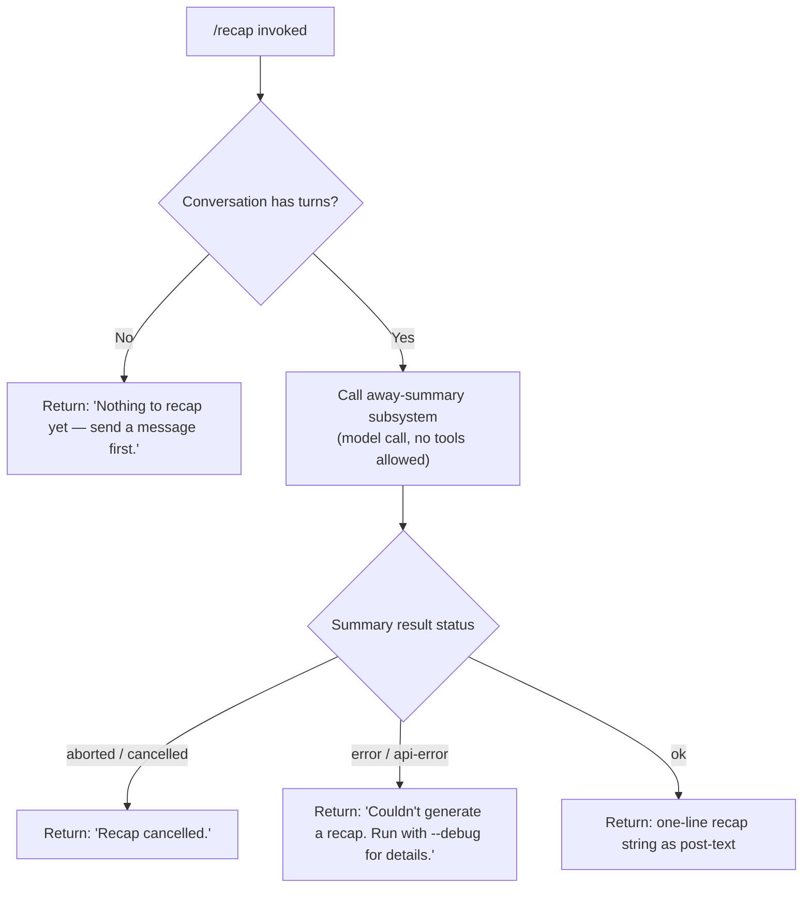

# `/recap`

> Analysis basis: CC v2.1.156 bundle.js (AST extraction + Claude interpretation)
> Minimum version: v2.1.156

---

## Overview

`/recap` generates a one-line summary of the current Claude Code session on demand. It delegates to the "away summary" subsystem, which calls the model with a restricted (no-tools) context and returns a brief recap string. If no conversation turns have occurred yet, or if the generation fails, the command surfaces a short plain-text error message instead.

---

## Registration

| Field | Value |
|---|---|
| type | `local` |
| name | `recap` |
| description | `Generate a one-line session recap now` |
| loc_byte | `12661167` |
| loc_byte_end | `12661383` |
| loc_line | `9777` |
| supportsNonInteractive | `false` |
| thinClientDispatch | `post-text` |
| load_inline | `true` |
| load_ident | `zY5` |
| arbor_handler.name | `zY5` |
| arbor_handler.fqn | `claude-2.1.156::zY5` |
| arbor_handler.kind | `AsyncFunction` |
| arbor_handler.resolution_path | `load_ident` |
| arbor_handler.n_hits | `0` |

Analysis basis: CC v2.1.156 bundle.js:+12661167

---

## Input Branching

The handler produces four distinct outcomes based on session state and away-summary result. A flowchart is used because there are more than three branches.



Analysis basis: CC v2.1.156 bundle.js:+12660917, +12661009, +12661067, +12660775

---

## Behavioral Spec

### Handler Entry — `recapHandler` (bundle ident: `zY5`)

The handler is an `AsyncFunction` resolved via `load_ident`. It is inlined into a `load: () => Promise.resolve({ call: zY5 })` shape inside the registration object.

```
async function recapHandler(context):
    result = await generateAwaySummary(context)
    return result
```

Analysis basis: CC v2.1.156 bundle.js:+12660775

---

### Away-Summary Dispatcher — `awaySummaryDispatcher` (bundle ident: `Q58`)

This function is the primary callee of `recapHandler`. It checks for pre-saved cache parameters before invoking the model.

```
async function awaySummaryDispatcher(context):
    params = getCacheSafeParams(context)          // J8H
    if params is null:
        log("[awaySummary] no CacheSafeParams saved, skipping")
        return { status: "no-turn" }

    abortController = new AbortController()
    context.signal.addEventListener("abort", () => abortController.abort())

    summaryResult = await runAwaySummaryQuery(params, abortController)  // u0

    // thinClientDispatch: "post-text" — result is emitted as text to the REPL
    outputText = formatSummaryResult(summaryResult)   // nJ9
    return outputText
```

Analysis basis: CC v2.1.156 bundle.js:+5361041, +5361060, +5361120, +5361157, +5361188, +5361235

---

### Away-Summary Query Runner — `awaySummaryQueryRunner` (bundle ident: `u0`)

Invokes the core query pipeline in a restricted mode. Tools are denied; the guard literal `"Away summary cannot use tools"` is enforced.

```
async function awaySummaryQueryRunner(params, abortController):
    startTime = Date.now()

    // Build a restricted conversation context
    queryContext = buildQueryContext(params)         // K08
    queryContext.toolPolicy = "deny"                // no tools allowed
    queryContext.label = "away_summary"

    // Run the main agent query loop
    rawResult = await agentQueryLoop(queryContext)  // au → vcL

    // Post-process: flatten final assistant messages
    summaryLines = flattenAssistantMessages(rawResult)  // nJ9 → H.flatMap

    // Classify outcome
    status = classifyResult(rawResult)
    // status ∈ { "ok", "aborted", "api-error", "other" }

    return { status, summaryLines }
```

Analysis basis: CC v2.1.156 bundle.js:+10666940, +10667063, +10667277, +10667339, +10667470, +10667650, +10667740, +10667769, +10667790, +10667895, +10667907, +10668251, +10668473, +10668567

---

### Tool-Denial Guard inside Query Context Builder — `queryContextBuilder` (bundle ident: `K08`)

When the away-summary label is active, the query context builder sets `avoid_prompts` mode and blocks tool calls.

```
function buildQueryContext(params):
    appState = context.getAppState()
    ctx = initQueryContext(params)              // ny
    ctx.mode = "avoid_prompts"                 // literal at +10664684
    ctx.sessionId = randomUUID()               // ME1.randomUUID
    ctx.conversationId = generateHex(8)        // Kh → Gk9.randomBytes, "hex"

    ctx.onToolUse = (tool) =>
        return { action: "deny", reason: "Away summary cannot use tools" }  // +5361368

    loadConversationDump(ctx)                  // e4H → H.dump
    return ctx
```

Analysis basis: CC v2.1.156 bundle.js:+10664351, +10664454, +10664813, +10665093, +10665234, +10665333, +10665861, +10666136, +10666335, +5361353, +5361368

---

### Output Formatter — `summaryResultFlattener` (bundle ident: `nJ9`)

Flattens the assistant message stream into a post-text string for REPL display.

```
function summaryResultFlattener(rawResult):
    lines = rawResult.messages
        .flatMap(msg => extractTextBlocks(msg))  // H.flatMap
    return lines.join(", ")                      // literal ", " at +10668275
```

Analysis basis: CC v2.1.156 bundle.js:+5361597, +5361686, +5361896, +10668275

---

### Session Recap Logger — `sessionRecapWriter` (bundle ident: `N`)

Handles writing the final summary to the conversation log / transcript file. Called inside the query pipeline when the `away_summary` turn completes.

```
function sessionRecapWriter(summaryText, sessionMeta):
    logEntry = buildLogEntry(summaryText)        // RH → JSON.stringify
    uniqueId = generateUUID()                    // v4
    trimmed = summaryText.trim()                 // H.trim
    upperKind = summaryText.toUpperCase()        // _.toUpperCase (label normalisation)

    writeToTranscript(trimmed, uniqueId)         // HuH → yzA → H.write
    persistToLogFile(logEntry, sessionMeta)      // gRK → FRK → uI.appendFile
    registerShutdownHook(uniqueId)               // _9 → f$A.register
```

Analysis basis: CC v2.1.156 bundle.js:+203730, +203748, +203770, +203788, +203832, +203852, +203855, +203871, +203877, +203891

---

### Log File Manager — `logFileManager` (bundle ident: `gRK`)

Manages the on-disk session log. Handles directory creation, file rotation, byte-size checking, and append operations.

```
function logFileManager(logEntry, sessionMeta):
    logDir = path.dirname(sessionMeta.logPath)  // X0H.dirname
    ensureDir(logDir)                            // mI

    filename = buildFilename(sessionMeta)        // rzA → X0H.join + k6
    rotateIfNeeded(filename)                     // izA → uI.stat, uI.rename, uI.unlink

    byteLen = Buffer.byteLength(logEntry)
    if byteLen > sizeLimit:
        compact(logEntry)                        // azA
    
    appendResult = await mb6.then(...)
    writeHandler = FRK.bind(context)
    writeHandler(filename, logEntry)             // FRK → uI.mkdir, uI.appendFile

    checkRotationAfterWrite(filename)            // B16 → J8
    registerShutdownHook(logDir)                 // _9 → f$A.register
```

Analysis basis: CC v2.1.156 bundle.js:+203218, +203243, +203251, +203281, +203296, +203371, +203388, +203420, +203426, +203459, +203476, +203485, +203581

---

### User-Facing Error Strings

Three terminal outcome strings are surfaced directly to the user:

| Condition | Message |
|---|---|
| No session turns yet | `"Nothing to recap yet — send a message first."` |
| User cancelled | `"Recap cancelled."` |
| Generation failed | `"Couldn't generate a recap. Run with --debug for details."` |

Analysis basis: CC v2.1.156 bundle.js:+12660917, +12661009, +12661067

---

## State & Side Effects

| Item | Detail |
|---|---|
| Telemetry | `tengu_auto_compact_rapid_refill_breaker`, `tengu_auto_compact_succeeded`, `tengu_ptl_surfaced_to_user`, `tengu_refusal_fallback_triggered`, `tengu_orphaned_messages_tombstoned`, `tengu_model_fallback_triggered`, `tengu_query_error`, `tengu_model_response_keyword_detected`, `tengu_malformed_tool_use_response`, `tengu_stop_hook_block_count`, `tengu_loop_dynamic_wakeup_ends_turn`, `tengu_post_autocompact_turn`, `tengu_query_before_attachments`, `tengu_query_after_attachments`, `tengu_mcp_tools_refreshed_mid_turn`, `tengu_feature_ok`, `tengu_feature_bad`, `tengu_forked_agent_default_turns_exceeded`, `tengu_fork_agent_query` (emitted by the shared query pipeline reachable from `u0 → au → vcL`) |
| Hook registration | Shutdown hook registered via `_9 → f$A.register` after log write completes (bundle.js:+203581, +58450) |
| appState changes | `getAppState` read (bundle.js:+10664454); `setAppState` write may occur post-summary via `K08 → H.setAppState` (bundle.js:+10665234) |
| Log file | Session log appended via `uI.appendFile`; rotation handled by `izA`; directory created via `uI.mkdir` if absent |
| Sound | <!-- TODO: not found in depth-2 traversal; needs --depth 4 --> |
| Tool calls | Denied for the entire away-summary turn; denial reason: `"Away summary cannot use tools"` (bundle.js:+5361368) |
| thinClientDispatch | `"post-text"` — output is posted as plain text into the REPL transcript |

---

## Version History

| Version | Change |
|---|---|
| v2.1.156 | Initial analysis |

---

## Common Mistakes

1. **Running `/recap` at session start** — If no messages have been exchanged, the command immediately returns `"Nothing to recap yet — send a message first."` without making any API call. This is expected behaviour, not a bug.
2. **Expecting tool use in the recap** — The away-summary call unconditionally denies all tool invocations. Any model attempt to call a tool will be rejected with `"Away summary cannot use tools"`. The recap is strictly text-only.
3. **Assuming recap works in non-interactive mode** — `supportsNonInteractive: false` means `/recap` is silently unavailable in headless / `--print` pipelines.
4. **Misreading the "cancelled" message** — `"Recap cancelled."` surfaces when the parent `AbortController` fires (e.g., the user presses `Ctrl+C` during the model call), not when the session itself was cancelled.
5. **Using `--debug` to diagnose missing output** — The error string explicitly advises `Run with --debug for details`. The `"debug"` log-level literal (bundle.js:+203706) is the relevant flag to enable verbose output from the log-file manager and query pipeline.

---

## Appendix — Identifier Mapping

> For bundle debugging only. Identifiers change across versions.

| Identifier | Role |
|---|---|
| `zY5` | `recapHandler` — top-level async handler for `/recap`; resolved via `load_ident` |
| `Q58` | `awaySummaryDispatcher` — checks for cached params, sets up abort, calls query runner |
| `J8H` | `getCacheSafeParams` — retrieves saved CacheSafeParams for the session |
| `N` | `sessionRecapWriter` — builds log entries, writes transcript, persists to file |
| `URK` | `logEntryBuilder` — constructs structured log entry objects |
| `$$A` | `logEntrySerializer` — serialises log entries (calls `UyK`, `ByK`) |
| `H` | Various — overloaded; context-dependent (timer, stream, array) |
| `RH` | `jsonStringifyWrapper` — wraps `JSON.stringify` |
| `_` | `labelNormaliser` — `toUpperCase` call for label canonicalisation |
| `v4` | `uuidGenerator` — generates UUIDs for log entries |
| `FzA` | `uuidCharMapper` — maps bytes to UUID character set |
| `q` | `fileUnlinkHelper` — calls `PEK.unlinkSync` for file cleanup |
| `A` | `lowercasePathHelper` — `f.toLowerCase` for path normalisation |
| `HuH` | `transcriptWriter` — writes summary text to transcript |
| `yzA` | `streamWriter` — writes to output stream via `H.write` |
| `gRK` | `logFileManager` — orchestrates log directory, rotation, append |
| `kxH` | `batchedLogFlusher` — batches and flushes log lines with `setTimeout`/`setImmediate` |
| `cMH` | `logLineFormatter` — formats individual log lines for file output |
| `B6` | `filePathResolver` — resolves file paths for log output |
| `B16` | `postWriteRotationChecker` — checks rotation after write; calls `J8` |
| `rzA` | `logFilenameBuilder` — builds log filenames via `X0H.join` + `k6` |
| `izA` | `logFileRotator` — stats, renames, unlinks old log files |
| `FRK` | `logFileAppender` — bound write handler: mkdir + appendFile |
| `_9` | `shutdownHookRegistrar` — registers cleanup hooks via `f$A.register` |
| `u0` | `awaySummaryQueryRunner` — orchestrates the model call for the recap |
| `K08` | `queryContextBuilder` — builds restricted query context with tool-deny policy |
| `ny` | `queryContextInitialiser` — initialises base query context |
| `e4H` | `conversationDumpLoader` — loads/dumps conversation state |
| `mYH` | `queryMetricsCollector` — collects timing/usage metrics |
| `R59` | `queryStateValidator` — validates query state before execution |
| `f` | `sessionCloser` — closes streams on query teardown |
| `RZ8` | `queryRetryHandler` — handles retry logic in query loop |
| `Kh` | `hexTokenGenerator` — generates hex random bytes for session ID |
| `L08` | `queryLoopOrchestrator` — outer loop controller for the query |
| `HAH` | `postTurnSummaryHandler` — processes post-turn summaries |
| `U4` | `hookRegistryAccessor` — accesses hook registry via `_9` |
| `JSH` | `messageFilter` — filters messages by source (e.g., `"ant"`) |
| `au` | `agentQueryEntryPoint` — entry into the full agent query pipeline |
| `vcL` | `agentQueryLoop` — core agent loop: model call, tool execution, state management |
| `if8` | `subagentExitHandler` — handles subagent exit signalling |
| `yH` | `turnEventEmitter` — emits `"turn"` events |
| `uH` | `featureFlagReader` — reads feature flags |
| `$v6` | `jglSetChecker` — checks presence in `JgL` set |
| `NAH` | `notificationDispatcher` — dispatches OS notifications |
| `XE8` | `expandedViewSetter` — sets expanded view state |
| `jG1` | `toolUseSummaryEmitter` — emits tool-use summary events |
| `D` | `daemonPushHandler` — pushes events to daemon / background process |
| `E6` | `sparePtyEnableHandler` — enables background spare PTY |
| `$` | `disposableTracker` — tracks disposable resources |
| `eI8` | `lowMemoryHandler` — handles low-memory events |
| `P5A` | `bgSpareSpawner` — spawns background spare processes |
| `d` | `debugLogger` — internal debug logging utility |
| `Wz` | `daemonWatcher` — monitors daemon process health |
| `J8` | `eisDirErrorHandler` — handles `EISDIR` file-system errors |
| `hH` | `errorEventLogger` — logs error events via `Li.logError` |
| `C7H` | `activeTurnTracker` — tracks in-progress tool use IDs |
| `Wj` | `activeGoalTracker` — tracks active goal state |
| `Xl7` | `turnFinderHelper` — finds matching turns in message list |
| `L` | `pendingPromiseTracker` — tracks pending async operations |
| `ucL` | `forkAgentQueryRunner` — handles forked-agent sub-queries |
| `Z8` | `bgSessionCreator` — creates background session with UUID |
| `X` | `bgIpcChannel` — IPC channel to background PTY process |
| `J` | `ipcMessageQueue` — queues IPC messages |
| `w` | `bgWorkerManager` — manages background worker lifecycle |
| `xf` | `ipcMessageSender` — sends IPC messages; calls `H.end`, `RH` |
| `lU5` | `bgPtyDispatcher` — full PTY session message dispatcher |
| `ZH` | `stringCoercer` — coerces values to `String` |
| `nJ9` | `summaryResultFlattener` — flattens assistant messages to output text |

Note: index built via Arbor fallback; some signals (telemetry, literals) may be missing — see arbor-fallback.js.