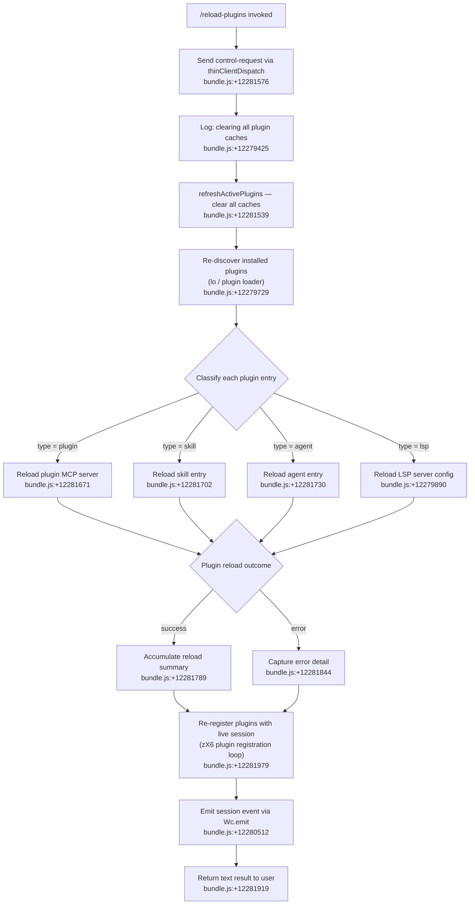

# `/reload-plugins`

> Analysis basis: CC v2.1.156 bundle.js (AST extraction + Claude interpretation)
> Minimum version: v2.1.156

---

## Overview

`/reload-plugins` is a local slash command that activates pending plugin changes within the current Claude Code session without requiring a full restart. It works by clearing all plugin caches, re-resolving installed plugins (including MCP servers, LSP servers, skills, and agent plugins), and then re-registering them with the live session. The command dispatches its work via a `control-request` thin-client dispatch path, making it suitable for use inside thin-client environments.

---

## Registration

| Field | Value |
|---|---|
| type | `local` |
| name | `reload-plugins` |
| description | `Activate pending plugin changes in the current session` |
| loc_byte | `12282517` |
| loc_byte_end | `12282736` |
| loc_line | `9208` |
| supportsNonInteractive | `false` |
| thinClientDispatch | `"control-request"` |
| module_id | `ll1` |
| load_inline | `true` |
| arbor_handler.name | `h55` |
| arbor_handler.fqn | `claude-2.1.156::h55` |
| arbor_handler.kind | `AsyncFunction` |
| arbor_handler.resolution_path | `module_id` |
| arbor_handler.n_hits | `0` |

Analysis basis: CC v2.1.156 bundle.js:+12282517

---

## Input Branching

The command has 4+ distinct execution branches based on plugin type classification and per-plugin reload outcome. A Mermaid flowchart is used.



---

## Behavioral Spec

### Handler: `h55` (AsyncFunction, resolved via module_id `ll1`)

The primary handler (`h55`) is an `AsyncFunction` resolved by Arbor via the `module_id` path (`ll1`). Its execution proceeds in four logical phases.

Analysis basis: CC v2.1.156 bundle.js:+12281539

#### Phase 1 — Control-Request Dispatch

```
async function reloadPluginsHandler(context):
    sendControlRequest(context, "ccr")   // literal "ccr" identifies this control type
    // Analysis basis: bundle.js:+12281557, +12281576
```

The string literal `"ccr"` (bundle.js:+12281557) is the internal control-request identifier sent to the thin-client dispatch layer (`A.sendControlRequest`, bundle.js:+12281576).

#### Phase 2 — Cache Clearing (`refreshActivePlugins`)

```
async function refreshActivePlugins():
    log("debug", "refreshActivePlugins: clearing all plugin caches")
    // Analysis basis: bundle.js:+12279425, +203706
    clearInstalledPluginsCache()          // Ow1 → N: "Cleared installed plugins cache"
    clearSkillIndexCache()                // Xu → H.clearSkillIndexCache
    clearVGCache()                        // go → VG8.clear
    // Then re-run plugin discovery
```

The log literal `"refreshActivePlugins: clearing all plugin caches"` (bundle.js:+12279425) and `"Cleared installed plugins cache"` (bundle.js:+9766301) confirm the sequence. The `clearSkillIndexCache` call (bundle.js:+12851526) is the explicit skill-cache invalidation step.

#### Phase 3 — Plugin Re-Discovery and Classification (`lo`)

```
async function discoverAndClassifyPlugins(session):
    plugins = await loadPluginList()        // lo → kv9, FN_
    for each plugin in plugins:
        if plugin.type == "plugin":
            reloadPluginMCPServer(plugin)   // literal "plugin MCP server": bundle.js:+12281762
        elif plugin.type == "skill":
            reloadSkill(plugin)             // literal "skill": bundle.js:+12281702
        elif plugin.type == "agent":
            reloadAgent(plugin)             // literal "agent": bundle.js:+12281730
        elif plugin.isLSP:
            reloadLSPConfig(plugin)         // EyH → .lsp.json discovery: bundle.js:+8151636
    // Results accumulated with separator " · " (bundle.js:+12281789)
    // Errors captured under "error" key (bundle.js:+12281844)
```

Plugin type discriminators are the string literals `"plugin"` (bundle.js:+12281671), `"skill"` (bundle.js:+12281702), `"agent"` (bundle.js:+12281730), and `"plugin MCP server"` (bundle.js:+12281762). LSP configurations are discovered from `.lsp.json` files (bundle.js:+8151636).

The plugin loader (`lo`) inspects files with `.mcpb` (bundle.js:+5149176) and `.dxt` (bundle.js:+5149197) extensions in addition to `.mcp.json` (bundle.js:+6566689) configuration files.

#### Phase 4 — Plugin Re-Registration (`zX6`) and Session Event Emission

```
async function reRegisterPlugins(resolvedPlugins, session):
    for each plugin in resolvedPlugins:
        pluginRecord = buildPluginRecord(plugin)    // i5H: resolves configs, dependencies
        registerWithSession(pluginRecord)           // zX6: full registration loop
        // dependency errors: "dependency-unsatisfied" (bundle.js:+11452249)
        // missing plugin: "not-found" (bundle.js:+11452286)
    session.emit("reload_plugins")                 // Wc.emit, bundle.js:+12280512
    return { type: "text", ... }                   // literal "text": bundle.js:+12281919
```

The telemetry event name `"reload_plugins"` (bundle.js:+12281606) is fired alongside the session-level event.

The plugin registration path (`zX6`) is deeply recursive and handles:
- Policy blocking (`"blocked-by-policy"`, bundle.js:+5171953; `"marketplace-blocked-by-policy"`, bundle.js:+5172045)
- Dependency resolution failures (`"dependency-resolution"`, bundle.js:+11453261; `"resolution-failed"`, bundle.js:+5173200)
- Version range checking via semver (`p78`, bundle.js:+5172979; `wJ6`, bundle.js:+5175571)
- Cross-marketplace dependency restrictions (`"cross-marketplace"`, bundle.js:+4959223)
- Circular dependency detection (`"cycle"`, bundle.js:+4959307)

#### Sub-feature: LSP Configuration Reload (`EyH`)

```
async function reloadLSPConfig(pluginDir):
    lspConfigPath = join(pluginDir, ".lsp.json")    // bundle.js:+8151636
    raw = await readFile(lspConfigPath)
    config = parseJSON(raw)                          // m6 → JSON.parse
    validate(config, schema)                         // I.record, I.string
    if parseError:
        recordError("lsp-config-invalid")            // bundle.js:+8151906
        return
    // Merge with existing LSP config via Object.assign
    // Validate relative paths (must not escape plugin dir via "..")
    //   error: "Invalid path: must be relative and within plugin directory"
    //   bundle.js:+8152836
```

#### Sub-feature: Hook and Plugin LSP Server Summary Output

After all reloads complete, `h55` formats a summary message. The output mentions `"hook"` (bundle.js:+12282196) and `"plugin LSP server"` (bundle.js:+12282255) categories, distinguishing them from MCP plugin entries in the displayed result. The separator literal `" · "` (bundle.js:+12281789) is used between summary items. Errors surface under the key `"error"` (bundle.js:+12281844).

#### Sub-feature: `ll` / `k8` — Internal Plugin Registry Lookup

```
function lookupPluginRegistry():
    return pluginRegistrySnapshot()   // ll → k8
    // bundle.js:+12281502, +12281651
```

This provides the pre-reload snapshot used to diff against the post-reload state.

#### Sub-feature: `i5H` — Plugin Record Builder

```
async function buildPluginRecord(pluginSpec):
    existing = state.get(pluginSpec.id)    // _.get: bundle.js:+11452313
    state.set(pluginSpec.id, record)       // _.set: bundle.js:+11452349
    addedSet.add(pluginSpec.id)            // $.add: bundle.js:+11452371
    if missingDependency:
        flag("dependency-unsatisfied")     // bundle.js:+11452249
    if notFound:
        flag("not-found")                  // bundle.js:+11452286
    readConfigFromDisk(pluginSpec)         // _u → yf: reads known_marketplaces.json
    //   "known_marketplaces.json" bundle.js:+9736944
    mergeWithProjectConfig(pluginSpec)     // j7H: reads .claude-plugin/marketplace.json
    //   ".claude-plugin" bundle.js:+9758740
    //   "marketplace.json" bundle.js:+9758757
```

#### Sub-feature: `e6H` — Dependency Label Formatter

```
function formatDependencyLabel(deps):
    // Extracts up to 5 dependency names (number literal 5: bundle.js:+4962422)
    // Joins with ", " and appends "dependency"/"dependencies" suffix
    // bundle.js:+12282022, +4962463
```

---

## State & Side Effects

| Item | Detail |
|---|---|
| Telemetry | `tengu_feature_ok` (bundle.js:+965176), `tengu_feature_bad` (bundle.js:+965234), `tengu_feature_sad` (bundle.js:+965311), `tengu_daemon_control` (bundle.js:+15514702), `tengu_daemon_config_reload` (bundle.js:+15493353) |
| Plugin caches cleared | All installed-plugin caches via `refreshActivePlugins`; skill index cache via `clearSkillIndexCache`; MCP connection cache via `VG8.clear` |
| Session event emitted | `Wc.emit` fires a reload event after re-registration (bundle.js:+12280512) |
| Plugin registry updated | `zX6` re-populates the session's plugin registry with re-resolved entries |
| Settings files read | `.claude/settings.json`, `.claude/settings.local.json` may be re-read during plugin scope resolution (bundle.js:+1218079, +1218089, +1218151) |
| `daemon.status.json` | Read by `MI6` during daemon state check (bundle.js:+12434766) |
| Hook registration | `_9 → f$A.register` re-registers plugin hooks after reload (bundle.js:+58450) |
| appState changes | Plugin registry and LSP manager state (`"lsp-manager"`, bundle.js:+12280927) are updated in-place |
| Sound | None identified |
| Non-interactive support | `supportsNonInteractive: false` — command requires an interactive session |

---

## Version History

| Version | Change |
|---|---|
| v2.1.156 | Initial analysis |

---

## Common Mistakes

1. **Running in non-interactive mode**: `supportsNonInteractive` is `false`; attempting to invoke `/reload-plugins` from a script or pipeline will fail silently or be rejected.
2. **Expecting MCP server process restart**: The command reloads plugin *configuration and registration* within the current session but does not kill and restart external MCP server processes — process-level restarts require a full session restart.
3. **Expecting immediate effect on managed-scope plugins**: Plugins in a `"managed"` scope (bundle.js:+4923676) cannot be modified; the command will report `"Cannot install plugins to managed scope"` (bundle.js:+4923698) for any such plugins attempted during re-registration.
4. **Using yarn or pnpm lockfiles**: Plugin source resolution explicitly skips `yarn.lock` and `pnpm-lock.yaml` (bundle.js:+4969177, +4969197) with the message "Skipped: yarn/pnpm lockfiles are not supported…" (bundle.js:+4969235). Use npm or bun for plugin dependencies.
5. **Assuming `.lsp.json` paths can escape the plugin directory**: Path validation will reject any LSP config path containing `".."` (bundle.js:+8151535) with "Invalid path: must be relative and within plugin directory" (bundle.js:+8152836).

---

## Appendix — Identifier Mapping

> For bundle debugging only. Identifiers change across versions.

| Identifier | Role |
|---|---|
| `h55` | Main async handler for `/reload-plugins` (Arbor-resolved via module_id `ll1`) |
| `W3` | Cache-clear helper called at start of reload |
| `aWH` | Internal utility called by cache-clear helper |
| `ll` | Plugin registry snapshot lookup |
| `k8` | Plugin registry data accessor |
| `w2H` | `refreshActivePlugins` — orchestrates full plugin cache invalidation and re-discovery |
| `N` | General-purpose logger / notification utility |
| `URK` | Telemetry/logging dispatcher |
| `$$A` | Sub-logger used by telemetry dispatcher |
| `H` | General utility / buffer-like object referenced throughout |
| `RH` | JSON serialisation helper (`JSON.stringify` wrapper) |
| `v4` | String/path manipulation utility |
| `FzA` | Character-map builder used by path utility |
| `HuH` | Write-to-stream helper |
| `yzA` | Low-level stream write |
| `gRK` | Log-file writer / rotating file sink |
| `kxH` | Buffered log flush scheduler (uses `setTimeout`, `setImmediate`) |
| `cMH` | Log-record formatter |
| `B6` | Error-classification / known-error-code helper |
| `B16` | Log-level checker |
| `rzA` | Log-file path builder |
| `izA` | Log-file rotation helper (stat/rename/unlink) |
| `FRK` | Log-file append-and-rotate implementation |
| `_9` | Hook re-registration dispatcher (`f$A.register`) |
| `Ow1` | Installed-plugins cache clearer |
| `E3` | Plugin loader runner (calls `_RL`, `$C`, `PX6`, etc.) |
| `_RL` | Full plugin-set loader (aggregates all plugin sources) |
| `AE` | Individual plugin loader |
| `SG8` | Plugin schema validator |
| `z58` | Plugin config parser |
| `uf8` | Plugin feature-flag checker |
| `MN_` | Plugin-root mapper |
| `hH` | Plugin error collector / push-to-error-list |
| `rL8` | Plugin reload-result accumulator |
| `$d_` | Plugin diff helper |
| `rD1` | Plugin state reconciler |
| `$C` | Skill cache clearer and skill-set reloader |
| `Xu` | Skill index cache invalidation entry point |
| `QD1` | Skill post-load validator |
| `YSH` | Skill registry updater |
| `PX6` | Plugin config path resolver |
| `lE_` | Plugin lifecycle event emitter |
| `go` | MCP connection-map clearer (`VG8.clear`) |
| `ek9` | Plugin event subscription handler |
| `Fs9` | Plugin finalisation helper |
| `$_` | React/state subscription utility |
| `ov` | Core subscription/observable primitive |
| `K` | Display formatter (pad/map for plugin names) |
| `lo` | Plugin file discovery — reads `.mcp.json`, `.mcpb`, `.dxt` sources |
| `j78` | Plugin directory enumerator |
| `rU` | File-extension checker (`.mcpb`, `.dxt`) |
| `Bg` | Plugin source-type classifier |
| `FN_` | `.mcp.json` config file reader and parser |
| `P8` | Error code normaliser (ENOENT / EISDIR mapper) |
| `m6` | JSON parse wrapper |
| `kv9` | Plugin status checker / installed-list builder |
| `qX6` | Plugin manifest loader (reads `manifest.json`) |
| `ZH` | String coercion utility |
| `EyH` | LSP server config loader (reads `.lsp.json`) |
| `ijL` | LSP config validator and path-safety checker |
| `njL` | LSP relative-path resolver |
| `$` | Process/stream abstraction |
| `bo1` | Daemon status reader |
| `Si` | Session context accessor |
| `o9` | AsyncLocalStorage store getter |
| `MI6` | `daemon.status.json` path builder and reader |
| `O` | Process/daemon interface |
| `I55` | Plugin filter — identifies loaded plugins with errors |
| `cl1` | Plugin error-code classifier |
| `y55` | Plugin filter — identifies loaded plugins needing restart |
| `i5H` | Plugin record builder (resolves config, dependencies, marketplace data) |
| `_u` | Plugin-config upstream reader |
| `yf` | Known-marketplaces.json reader |
| `uG8` | Marketplace data path builder |
| `MNH` | Plugin tool/capability mapper |
| `h8` | Plugin tool-list builder |
| `iF6` | Tool descriptor constructor |
| `ig` | Full tool-schema builder (all tool types) |
| `HE` | Plugin dependency error constructor |
| `BA` | Plugin scope checker (project/user/managed) |
| `eP` | Dependency policy evaluator |
| `HJ6` | Host-pattern policy checker |
| `P78` | Policy settings extractor |
| `Z59` | Host-pattern matcher |
| `E59` | Path-pattern matcher |
| `Nk7` | GitHub/git source policy checker |
| `s6H` | Policy settings reader |
| `v59` | Combined host+path policy evaluator |
| `T59` | URL policy resolver |
| `j7H` | `.claude-plugin/marketplace.json` reader |
| `iE6` | Plugin marketplace data path resolver |
| `Yd_` | Marketplace JSON schema parser |
| `J8` | EISDIR/ENOENT error handler |
| `YT` | Plugin config merger (project + user + marketplace) |
| `hE_` | Project-level plugin config reader |
| `seL` | Plugin installed-set membership checker |
| `zX6` | Full plugin registration loop (the main re-registration engine) |
| `OT` | Plugin tool capability extractor |
| `_58` | Plugin scope + policy combined checker |
| `BL6` | Local-source path validator (`./` prefix check) |
| `z` | MCP server process manager |
| `yH` | Daemon stop handler |
| `uH` | Daemon stop-failed handler |
| `vy` | Daemon first-party config handler |
| `km` | Daemon process race/exit handler |
| `C6` | User-settings accessor |
| `YB6` | Settings store getter |
| `_E` | Plugin settings file reader (`readFileSync` based) |
| `wd_` | Raw settings file reader |
| `jd_` | Settings entry iterator |
| `J` | MCP active-server set |
| `w` | MCP server process controller (spawn/kill/retire) |
| `G` | MCP server registry map |
| `nV6` | MCP registry lookup helper |
| `Vb8` | MCP server state initialiser |
| `lV` | Plugin source-location validator |
| `$k` | Plugin local-path resolver |
| `p78` | Semver validity/coerce/satisfies checker |
| `T` | Input event handler set (keyboard events) |
| `b` | Key-event object |
| `Z0` | User-settings path resolver |
| `Y` | MCP server lifecycle manager (start/stop/updateConfig) |
| `Pf9` | Dependency graph resolver (cycle detection, cross-marketplace checks) |
| `M` | MCP server connection pool |
| `tE` | Flag-settings updater |
| `x96` | Feature-flag reader |
| `P` | MCP server connection handler |
| `F_` | Generic error formatter |
| `C` | MCP transport factory |
| `R` | MCP stdio/SSE writer |
| `p` | MCP write-timeout manager |
| `dD9` | Plugin dependency queue manager |
| `S` | MCP server settings store |
| `x` | MCP server heartbeat/timeout controller |
| `d` | Core async feature-flag evaluator |
| `U_` | Full plugin installation/registration entry (writes settings, emits events) |
| `wO` | Plugin installer pre-flight checker |
| `Uo8` | Plugin installer core (copies files, validates) |
| `zP` | Plugin post-install settings writer |
| `mr8` | Plugin install timestamp recorder |
| `mGH` | Plugin install notification emitter |
| `$L6` | Atomic settings file writer (temp-file + rename pattern) |
| `Xz` | Settings cache clearer (`lR6.clear`, `Hu8.clear`) |
| `tB6` | Git-ignore / project-settings tracker |
| `hb` | `.claude` directory path builder |
| `t6` | Feature-flag evaluator (calls `d`) |
| `vp` | Settings load-from-disk tracer |
| `$X6` | Plugin source path safety checker (resolve + startsWith) |
| `l` | MCP server filter (active connections) |
| `HH` | Voice input/recording session manager |
| `MH` | Keyboard input event router |
| `bCH` | Key-event pre-processor |
| `by6` | Modifier-key state tracker |
| `OH` | Audio/WebSocket stream object |
| `_H` | Silence-timeout handler |
| `tH` | MCP tool list builder (all connected servers) |
| `e` | Notification/banner emitter |
| `wH` | Output queue writer |
| `mH` | MCP tool schema mapper |
| `xy6` | Modifier-key combination dispatcher |
| `AH` | MCP server tool sync handler |
| `wqH` | Key-event queue flusher |
| `wA6` | Compose-key state manager |
| `uy6` | Compose-key sequence dispatcher |
| `jH` | Plugin-id-to-server map |
| `UH` | Active-timers / streaming state tracker |
| `W` | Output layout manager |
| `o` | Focus-silence-timeout handler |
| `LH` | MCP server list helpers |
| `zH` | Plugin version-conflict map |
| `wJ6` | Semver range validator and version-set builder |
| `XT_` | Semver range normaliser |
| `sL8` | Git-subdir source builder |
| `bD9` | Git-subdir path parser |
| `tL8` | Git tag resolver (ls-remote + semver filter) |
| `$b7` | Git remote URL builder |
| `V8` | Git process runner |
| `j` | MCP process kill helper |
| `OX6` | Plugin binary installer / archive extractor |
| `enH` | `.dxt` archive extraction orchestrator |
| `q58` | Plugin write-lock manager |
| `lD9` | Plugin lock-file helper |
| `M8H` | Plugin content hasher (SHA-256) |
| `Yk` | Plugin binary path builder |
| `X` | MCP stdio stream reader |
| `g78` | npm/yarn/pnpm package installer |
| `oU` | Plugin install output formatter |
| `EwH` | Plugin binary path existence checker |
| `H58` | Plugin temp-file cleaner |
| `EE_` | Plugin record updater (Added/Updated diff) |
| `Q` | Daemon socket read/unlink helper |
| `DN6` | Daemon socket file reader |
| `rI1` | Daemon socket file unlinker |
| `FH` | Plugin install-event push list |
| `ap_` | Plugin install-event serialiser |
| `WH` | Remote-control / supervisor mode checker |
| `qF` | Supervisor mode UI renderer |
| `k6` | React render / UI update primitive |
| `r` | MCP allow/deny permission set |
| `VH` | Full MCP server list renderer (tool count, status) |
| `$l` | MCP tool sort/concatenation helper |
| `oRH` | MCP coordinator-mode server sorter |
| `ES` | MCP server status badge renderer |
| `DH` | Voice transcription display handler |
| `ao` | MCP server tool-set reconciler |
| `s` | Keyboard shortcut filter |
| `y4` | MCP tool count badge |
| `WC6` | MCP server warning indicator |
| `ElH` | MCP tool-description cache |
| `vH` | MCP server list concatenator |
| `V` | MCP server list sub-component |
| `jb7` | Plugin dependency pre-checker |
| `c` | UI component list |
| `gh8` | UI component base |
| `a` | Focus-gain handler |
| `oy` | Plugin name case-normaliser |
| `j3` | String formatter |
| `xH` | String coercion helper |
| `Y4` | OTEL metrics emitter (plugin_installed event) |
| `iu8` | OTEL attribute builder |
| `qNH` | OTEL counter/histogram recorder |
| `Q96` | OTEL metric finaliser |
| `qH` | Voice focus-gain dispatcher |
| `e6H` | Dependency label formatter (up to 5 deps, bundle.js:+4962422) |

---

Note: index built via Arbor fallback; some signals (telemetry, literals) may be missing — see arbor-fallback.js.