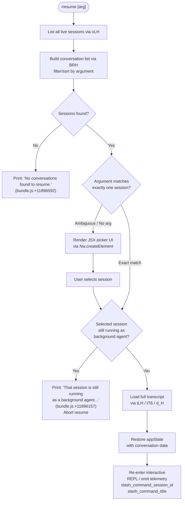

# `/resume`

> Analysis basis: CC v2.1.156 bundle.js (AST extraction + Claude interpretation)
> Minimum version: v2.1.156

---

## Overview

`/resume` (alias: `/continue`) allows a user to pick up a previously saved Claude Code conversation by supplying an optional conversation ID or search term. The handler loads all persisted sessions, filters and sorts them against the argument, presents a selection UI, and then restores the chosen conversation's full transcript state before re-entering the interactive REPL loop.

---

## Registration

| Field | Value |
|---|---|
| type | `local-jsx` |
| name | `resume` |
| aliases | `["continue"]` |
| description | Resume a previous conversation |
| argumentHint | `[conversation id or search term]` |
| module_id | `wB1` |
| load_inline | `true` |
| loc_byte | `11897555` |
| loc_byte_end | `11897752` |
| loc_line | `8681` |
| arbor_handler.name | `F15` |
| arbor_handler.fqn | `claude-2.1.156::F15` |
| arbor_handler.kind | `AsyncFunction` |
| arbor_handler.resolution_path | `module_id` |
| arbor_handler.n_hits | `0` |

Analysis basis: CC v2.1.156 bundle.js:+11897555

---

## Input Branching

The handler has five distinct outcome branches based on session lookup results and session state, so a Mermaid flowchart is used.



---

## Behavioral Spec

### 1. Session Discovery (`oLH` / `listAllLiveSessions`)

```
async function listAllSessions(context):
    await Promise.resolve()           # micro-task yield
    sessions = await context.listAllLiveSessions()
    filter sessions where type == "interactive"
    return sessions
```

Analysis basis: CC v2.1.156 bundle.js:+8787699, +8787751

The session query is restricted to sessions whose stored type equals `"interactive"` (bundle.js:+8787842). Non-interactive (daemon/background) sessions are excluded from the candidate list at this stage.

---

### 2. Candidate Filtering and Sorting (`BRH`)

```
function buildCandidateList(sessions, rawArg):
    # Run git worktree detection for path context
    emit telemetry "tengu_worktree_detection"
    worktreeInfo = runGitWorktreeList()           # ["worktree", "list", "--porcelain"]

    candidates = sessions
    if rawArg is not empty:
        argLower = rawArg.toLowerCase()
        # Prefer exact UUID prefix match
        exactMatch = candidates.find(s => s.id.startsWith(argLower))
        if exactMatch:
            return [exactMatch]
        # Fall back to fuzzy title/content search
        candidates = candidates.filter(s =>
            s.title.toLowerCase().includes(argLower) or
            s.id.startsWith(argLower))
    # Sort survivors by locale-aware title comparison
    candidates.sort((a, b) => a.title.localeCompare(b.title))
    return candidates
```

Analysis basis: CC v2.1.156 bundle.js:+11893113, +11893338, +11893534, +11893561, +11893594

Git worktree detection uses the literal arguments `["worktree", "list", "--porcelain"]` (bundle.js:+11893157, +11893168, +11893175). Path strings are normalised to NFC Unicode form (bundle.js:+11893420). The string `"worktree "` (9 characters, bundle.js:+11893376, +11893407) is used to strip the prefix when parsing porcelain output.

---

### 3. No-Result Short-Circuit

```
function handleNoResults(candidates):
    if candidates.length == 0:
        print "No conversations found to resume."
        return "skip"           # sentinel to abort the command
```

Literal: `"No conversations found to resume."` (bundle.js:+11896592). The sentinel value `"skip"` (bundle.js:+11896360) causes the caller to abort without further UI.

---

### 4. Background-Agent Guard

```
function checkBackgroundConflict(selectedSession, liveSessions):
    if liveSessions.has(selectedSession.id) and
       selectedSession.status == "background agent":
        print "That session is still running as a background agent. " +
              "Open `claude agents` to attach to it, or stop it there first to resume here."
        return true    # conflict — do not resume
    return false
```

Literal message (bundle.js:+11896157). The check is performed immediately after the user selects a session — before any transcript loading begins.

---

### 5. Transcript Restoration (`tLH` / `tT6` / `d_H`)

```
async function restoreTranscript(sessionId):
    # Phase 1 — locate conversation store entry (tLH)
    conversationRecord = await loadConversationRecord(sessionId)
    sortKey = deriveSortKey(conversationRecord)     # Ny8 — Date.parse based

    # Phase 2 — hydrate full state map (d_H)
    stateMap = initialiseStateMap()
    stateMap.set("summary",             conversationRecord.summary)
    stateMap.set("last-prompt",         conversationRecord.lastPrompt)
    stateMap.set("custom-title",        conversationRecord.customTitle)
    stateMap.set("ai-title",            conversationRecord.aiTitle)
    stateMap.set("tag",                 conversationRecord.tag)
    stateMap.set("agent-name",          conversationRecord.agentName)
    stateMap.set("agent-color",         conversationRecord.agentColor)
    stateMap.set("agent-setting",       conversationRecord.agentSetting)
    stateMap.set("mode",                conversationRecord.mode)
    stateMap.set("permission-mode",     conversationRecord.permissionMode)
    stateMap.set("isolation-latch",     conversationRecord.isolationLatch)
    stateMap.set("worktree-state",      conversationRecord.worktreeState)
    stateMap.set("pr-link",             conversationRecord.prLink)
    stateMap.set("bridge-session",      conversationRecord.bridgeSession)
    stateMap.set("file-history-snapshot",   ...)
    stateMap.set("attribution-snapshot",    ...)
    stateMap.set("content-replacement",     ...)
    stateMap.set("fork-context-ref",        ...)
    stateMap.set("marble-origami-commit",   ...)
    stateMap.set("marble-origami-snapshot", ...)

    # Phase 3 — read binary transcript blobs (uj5 / xj5)
    rawMessages = readTranscriptFile(sessionId)     # KS.openSync / KS.readSync
    messages = parseMessageChain(rawMessages)       # xj5 → b6K → bj5

    # Phase 4 — resolve message graph (sLH / vj5 / Zj5)
    chain = resolveParentChain(messages)
    sortChain(chain)                                # Vj5 + j.sort / J.sort

    # Phase 5 — rebuild context for the model (tT6 / x6K / d_H)
    context = buildContextObject(chain, stateMap)
    return context
```

Analysis basis: CC v2.1.156 bundle.js:+12896607, +12897035, +12904013, +12904331, +12904427, +12904505, +12904575, +12904636, +12904710, +12904786, +12904866, +12904929, +12905013, +12905087, +12905171, +12905302, +12905423, +12905485, +12905556, +12905762, +12905817, +12905868

Binary blob parsing uses `Buffer.from`, `Buffer.allocUnsafe`, and sync file reads via `KS.openSync` / `KS.readSync` / `KS.closeSync` (bundle.js:+12900531, +12900849, +12900879, +12902253). Max single-blob size implied by constant `1048576` bytes (bundle.js:+12900868). UUID fields are 36-character strings (bundle.js:+12900811).

---

### 6. Context Document Generation (`dN8` / `Ly6` / `u6K`)

```
async function buildContextDocuments(workingDir, conversationRecord):
    projectRoot = resolveProjectRoot(workingDir)     # Gc → "projects" dir

    # Collect relevant files
    files = await gatherFiles(projectRoot)           # u6K → lAA, _7.readdir
    files = files.filter(f => not f.startsWith(".")) # hidden-file exclusion

    # Build compact summary string
    summary = formatSummary(files, conversationRecord)   # PCH → lj5
    return summary
```

Analysis basis: CC v2.1.156 bundle.js:+12910654, +12910760, +12910789, +12910882, +6499799, +6499813

The project store root path is assembled by joining path segments with `"projects"` (bundle.js:+6499813). File summaries are joined with `", "` separators (bundle.js:+12910767). Column padding uses 40-character `padEnd` (bundle.js:+15504600 → constant `40`).

---

### 7. Selection UI Rendering

```
function renderSessionPicker(candidates):
    element = Nw.createElement(...)     # JSX picker component
    # Each row: session title (bold via j6.bold — zB1)
    #           session id substring
    #           relative timestamp
    return element
```

Analysis basis: CC v2.1.156 bundle.js:+11896443, +11897127

Title display uses bold ANSI formatting via `j6.bold` (bundle.js:+11893836).

---

### 8. Away-Summary Generation (opportunistic, `k` / `h`)

When the window was blurred for more than 1 hour (constant `3600000` ms, bundle.js:+14923558) and the cache freshness ratio exceeds 0.8 (bundle.js:+14923614), an "away summary" is generated automatically on resume:

```
async function maybeGenerateAwaySummary(session):
    if cacheAgeUnknown:
        log "[awaySummary] skipped: cache age unknown"
        return
    if cacheStalenessRatio > 0.9:            # constant bundle.js:+14922776
        log "[awaySummary] skipped: cache stale"
        return
    if atOrNearRateLimit:
        log "[awaySummary] skipped: at or near rate limit"
        return
    if draftInputPresent:
        log "[awaySummary] skipped: draft input present"
        return
    emit telemetry "away_summary_generate"
    result = await callModel(awayParams)
    if result.failed:
        emit telemetry with "generate_failed"
        return
    applyAwaySummary(result)
```

Analysis basis: CC v2.1.156 bundle.js:+14922707, +14922783, +14922871, +14922954, +14923185, +14923209

The away-summary model call itself emits `"away_summary"` and `"api_metrics"` events (bundle.js:+14921816, +14921615). Maximum retry depth for the away-summary chain is 3 (bundle.js:+14923260).

---

## State & Side Effects

| Item | Detail |
|---|---|
| Telemetry: `tengu_worktree_detection` | Emitted when git worktree scan runs during candidate filtering (bundle.js:+11893257) |
| Telemetry: `tengu_transcript_phantom_parent` | Emitted when a message references a non-existent parent UUID during transcript loading (bundle.js:+12903097) |
| Telemetry: `tengu_transcript_parent_cycle` | Emitted if a parent-UUID cycle is detected in the transcript graph (bundle.js:+12906676) |
| Telemetry: `tengu_chain_parent_cycle` | Emitted during chain resolution if a cycle appears in the conversation chain (bundle.js:+12884574) |
| Telemetry: `tengu_chain_timestamp_fallback` | Emitted when timestamp ordering falls back to insertion order (bundle.js:+12884723) |
| Telemetry: `tengu_chain_parallel_tr_recovered` | Emitted when a parallel transcript branch is recovered (bundle.js:+12886589) |
| Telemetry: `tengu_relink_walk_broken` | Emitted when the relink walk encounters a broken parent pointer (bundle.js:+12884084) |
| Telemetry: `away_summary_generate` | Emitted when an opportunistic away-summary generation is triggered on resume (bundle.js:+14923185) |
| Telemetry: `away_summary` | Emitted for the away-summary model call result (bundle.js:+14921816) |
| Telemetry: `tengu_feature_ok` / `tengu_feature_bad` | Feature-flag OK/bad events touched during initialisation (bundle.js:+965176, +965234) |
| Telemetry (literal) | `"slash_command_session_id"` stored after successful resume (bundle.js:+11896853) |
| Telemetry (literal) | `"slash_command_title"` stored after successful resume (bundle.js:+11897077) |
| appState changes | Full conversation state map populated with keys: `summary`, `last-prompt`, `custom-title`, `ai-title`, `tag`, `agent-name`, `agent-color`, `agent-setting`, `mode`, `permission-mode`, `isolation-latch`, `worktree-state`, `pr-link`, `bridge-session`, `file-history-snapshot`, `attribution-snapshot`, `content-replacement`, `fork-context-ref`, `marble-origami-commit`, `marble-origami-snapshot` |
| File I/O | Transcript binary blobs read synchronously via `KS.openSync` / `KS.readSync` / `KS.closeSync`; project file tree scanned via `_7.readdir` / `_7.realpath` |
| JSX UI | Picker component rendered via `Nw.createElement`; session titles bolded via ANSI helper |
| Hook registration | None detected in depth-2 traversal |
| Sound | None detected in depth-2 traversal |

---

## Version History

| Version | Change |
|---|---|
| v2.1.156 | Initial analysis |

---

## Common Mistakes

1. **Passing a partial title instead of a UUID prefix** — If the partial string matches more than one session title, the picker UI is shown rather than an immediate resume. Supply the leading characters of the full conversation UUID for a deterministic single-match.
2. **Trying to resume a session that is still a background agent** — `/resume` will refuse and print the background-agent message. Use `/agents` to attach to or stop the live session first.
3. **Using `/resume` when no conversations exist** — The command prints `"No conversations found to resume."` and exits immediately; there is no error raised, so scripts that check exit codes may not detect this case.
4. **Expecting instant away-summary on resume** — The away-summary is skipped silently if the cache is stale (staleness ratio > 0.9), the window was focused less than 1 hour ago, the rate limit is close, or a draft input is present. Check the log output for `[awaySummary] skipped:` lines to understand why.
5. **Alias confusion** — `/continue` is a registered alias and behaves identically to `/resume`; there is no behavioural difference between the two forms.

---

## Appendix — Identifier Mapping

> For bundle debugging only. Identifiers change across versions.

| Identifier | Role |
|---|---|
| `F15` | Main async handler for `/resume` (arbor_handler, AsyncFunction) |
| `DB1` | Pre-filter helper that filters session list and calls `_3` |
| `oLH` | Session lister — wraps `listAllLiveSessions`, yields via `Promise.resolve` |
| `BRH` | Candidate builder — runs git worktree detection, filters/sorts sessions |
| `W_` | Subprocess / daemon spawn orchestrator called by `BRH` |
| `ZGH` | Child-process lifecycle manager (spawn, kill, timeout, pipe) |
| `hH` | Error-logging / telemetry helper (calls `Li.logError`) |
| `F_` | Error normaliser (wraps native `Error` + `String`) |
| `xH` | String coercion utility |
| `q1` | Telemetry routing helper (calls `zEA`) |
| `zEA` | Telemetry emitter (uses `xH`) |
| `D84` | Telemetry queue manager (shift/push on `LB6`) |
| `ZH` | String-to-output formatter |
| `$_` | Working-directory resolver |
| `ov` | Platform path helper |
| `dN8` | Context-document generation entry point |
| `Ly6` | File-list formatter — joins paths with `", "`, calls `u6K` and `PCH` |
| `u6K` | File-system walker / gatherer (readdir, realpath, filter, sort) |
| `Gc` | Project-root path resolver (joins with `"projects"`) |
| `PCH` | Summary chunk builder (Buffer.alloc, calls `lj5`) |
| `lj5` | Chunk content formatter (calls `m6K`, `N`) |
| `k2H` | Session-file slicer and line pusher |
| `lAA` | Recursive directory scanner (readdir, isDirectory, Buffer.allocUnsafe) |
| `sI6` | Key-value store accessor (get/set/values/zGH) |
| `Zz` | String normaliser (replace, slice, `o84`) |
| `ro` | Regex test helper (`cn7.test`) |
| `ma` | Message-array helper |
| `tLH` | Transcript loader — hydrates conversation record and state map |
| `d_H` | State-map hydrator — sets all conversation metadata keys |
| `Oj5` | Sub-state initialiser |
| `VC` | Validation check helper |
| `bzA` | JSON-path normaliser (pop, Array.isArray, `RzA`, `CzA`) |
| `RzA` | Path regex tester (`hRK.test`) |
| `CzA` | Path string replacer |
| `Wj` | Watcher / journal helper |
| `M` | MCP-state manager (calls `vSH`, `JGK`, `Gm5`) |
| `vSH` | MCP connection applicator (Object.entries, filter, push, Promise.all) |
| `JGK` | MCP update applier (`applyMcpUpdate`, cleanup, `ZJ`) |
| `Gm5` | MCP slot reconciler (getClients, filter, fromEntries) |
| `O` | Output channel wrapper (`k8`) |
| `z` | Background-session state machine (`yH`, `uH`, `vy`, `km`) |
| `yH` | State-machine helper A |
| `uH` | State-machine helper B |
| `vy` | First-party telemetry emitter (`fx`, `lQ.push`, `yEH`, `Mz_`) |
| `km` | Process-exit orchestrator (`Promise.race`, `Promise.all`, `process.exit`) |
| `w` | Worker-session manager (get, kill, setTimeout, eI8, FD6, etc.) |
| `R` | Session writer (`lEK`, `Wz`, `N`, `hH`, `z.write`) |
| `FD6` | Config file reader (`QP.readFile`, JSON parse, filter) |
| `B` | Background-session filter (`pH.filter`, `cH.has`) |
| `W5A` | Daemon connection handler (`CF.claim`, socket connect, on/once/write/end) |
| `N5A` | Session roster manager (add, delete, rm, unlink, rosterEntry, etc.) |
| `S` | Sentinel / state object |
| `V` | Context variable |
| `Q` | Queue wrapper (`DN6`, `rI1`) |
| `DN6` | File-based queue reader (`zm.readFile`, `EPH`, `P8`, `E9`) |
| `rI1` | File-based queue unlinker (`zm.unlink`, `EPH`, `P8`) |
| `k` | Away-summary scheduler (Date.now, `VW8`, `aC5`, `Q58`, `oG1`) |
| `VW8` | Cache-state reader (`f5H.getState`) |
| `aC5` | Away-summary parameter builder (`m7A`) |
| `Q58` | Model call wrapper (AbortController, `u0`, `Z8`, `nJ9`) |
| `oG1` | UUID generator (`Zv.randomUUID`) |
| `h` | Away-summary window-focus tracker (Date.now, Math.min, `k`, `zJK`) |
| `_d` | Focus-state constant |
| `uj5` | Binary transcript parser (openSync, readSync, Buffer ops) |
| `xj5` | Transcript index parser (Buffer.from, indexOf, compare) |
| `b6K` | Transcript record accessor (`A.at`) |
| `wH` | Stream chunker / comparer |
| `bj5` | Buffer comparator (`H.compare`) |
| `mj5` | Auxiliary file reader (openSync, readSync, closeSync, JSON parse) |
| `hGH` | SSE/JSON stream parser (`kq4`, `Iq4`, `hq4`, `yq4`) |
| `kq4` | Stream header constant |
| `Iq4` | SSE event-name parser |
| `hq4` | SSE data-line parser (JSON.parse) |
| `yq4` | SSE chunk reassembler |
| `x` | Debounced writer (setTimeout, clearTimeout, `z.write`, Math.round) |
| `w6K` | Conversation-index cache (values, set, get, delete, has) |
| `Tj5` | Index-chain builder (get, has, add, push, reverse) |
| `H_` | Index helper (`_`) |
| `A9` | Error helper (`J8`) |
| `c` | Permission-set A (`gh8`) |
| `r` | Permission-set B (`w`, `c`) |
| `Ny8` | Sort-key extractor (`Date.parse`) |
| `sLH` | Chain loader (has, add, push, get, `Vj5`, `vj5`, `Zj5`, `S6K`) |
| `Vj5` | NaN-safe value filter (`Number.isNaN`) |
| `vj5` | Message-chain sorter (filter, set, sort) |
| `Zj5` | Message-chain shift/push sorter |
| `S6K` | Store key-value snapshot helper |
| `ltH` | Message list mapper (`H.map`) |
| `HqA` | Compact-boundary processor (replaceAll, slice) |
| `kk6` | Message-block normaliser (push, Array.isArray, `i1`, `GC`) |
| `i1` | Markdown block parser (trim, regex exec, slice) |
| `AqA` | Attachment-type filter (`Nj5`, `kj5`) |
| `Nj5` | Attachment some-test (trim, Array.isArray, some) |
| `kj5` | Attachment array-test (Array.isArray, some) |
| `ky8` | Message-key accessor (get, set, push) |
| `Iy8` | Message-value extractor (Array.from, values) |
| `tT6` | State snapshot builder (keys, values, sLH, get accessors, dAA, filter) |
| `x6K` | State initialiser (`pj5`, `d_H`, Object.assign) |
| `pj5` | Working-directory probe (`WS`, `$_`, `kD.join`, `vO`, `YZ`, `_7.stat`) |
| `WS` | Home-directory constant (`ov`) |
| `YZ` | Directory lister (`Jp.readdir`, push, `Zz`, slice, `MN`, isDirectory) |
| `dAA` | Message-block dispatcher (at, `HqA`, `ltH`, `AqA`) |
| `KfH` | Key-frame / context-frame helper |
| `Sl` | Session-list renderer (filter, sort, slice, Array.from, `_3`) |
| `zB1` | Bold-title formatter (`j6.bold`) |
| `D` | Daemon-worker orchestrator (E6, dispose, eI8, freemem, n6, P5A, Date.now, hH) |
| `E6` | Worker-pool event emitter (hz6, Sz6, Mx, hzH.has, y88, Iz6.add) |
| `P5A` | Spare-process spawner (randomBytes, mkdir, Bun.spawn, unref, kill, onExit) |
| `N` | Platform-string normaliser (o16, URK, includes, RH, toUpperCase, trim) |
| `J8` | Error-serialiser |
| `gA4` | String coercer |
| `Wz` | Warning-logger |
| `aA` | Path-ancestry checker |
| `vO` | Volume/mount resolver |
| `lj5` | (see `lj5` above — also used in `PCH` chain) |
| `_3` | Render/output flush helper |