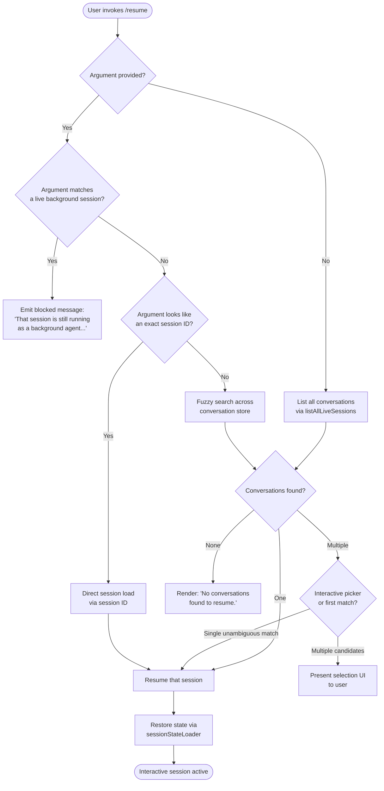

# `/resume`

> Analysis basis: CC v2.1.150 bundle.js (AST extraction + Claude interpretation)
> Minimum version: v2.1.150

---

## Overview

The `/resume` command (also aliased as `/continue`) allows a user to reattach to a previous Claude Code conversation by supplying either a specific session ID or a free-text search term. The command resolves the target session through a multi-stage lookup pipeline — worktree detection, live-session filtering, and conversation-list search — then initialises all required application state before handing control back to the interactive REPL. If the target session is currently running as a background agent, the command refuses to resume it and instead instructs the user to use `claude agents`.

---

## Registration

| Field | Value |
|---|---|
| type | `local-jsx` |
| name | `resume` |
| description | `Resume a previous conversation` |
| argumentHint | `[conversation id or search term]` |
| aliases | `["continue"]` |
| module_id | `MC1` |

Analysis basis: CC v2.1.150 bundle.js:+11809417

---

## Input Branching

The command entry point (`commandEntryPoint`) accepts a single optional argument string. The high-level branching is as follows:



Analysis basis: CC v2.1.150 bundle.js:+11807905, +11808009, +11808019, +11808454, +11808555

---

## Behavioral Spec

### 1. Conversation List Retrieval

The command first obtains the full set of resumable sessions. It calls `listAllLiveSessions`, which resolves through `Promise.resolve` and then delegates to the session enumeration subsystem. Sessions are filtered to retain only those whose mode field equals `"interactive"`.

```
async function retrieveResumableSessions():
    rawSessions = await listAllLiveSessions()
    interactiveSessions = rawSessions.filter(
        session => session.mode == "interactive"
    )
    return interactiveSessions
```

Analysis basis: CC v2.1.150 bundle.js:+8656437, +8656467, +8656489, +8656580

---

### 2. Background-Agent Guard

Before attempting to load a matched session, the command checks whether that session is currently active as a background agent. If the session is live and running in background mode, resumption is blocked and a fixed error message is emitted to the user.

```
function checkNotBackgroundAgent(session):
    if session.isLiveBackgroundSession:
        emit("That session is still running as a background agent. " +
             "Open `claude agents` to attach to it, " +
             "or stop it there first to resume here.")
        return BLOCKED
    return ALLOWED
```

Analysis basis: CC v2.1.150 bundle.js:+11808019, +11808240

---

### 3. Worktree Detection

When computing session metadata (title, last-prompt display, directory information), the command invokes the worktree detection helper. This helper runs `git worktree list --porcelain` to enumerate Git worktrees associated with the current repository and then normalises the result to Unicode NFC form. The worktree path is extracted by stripping the leading `"worktree "` prefix (9 characters).

```
function detectWorktree(sessionPath):
    rawOutput = exec("git", ["worktree", "list", "--porcelain"])
    lines = rawOutput.split(newline)
    for each line in lines:
        if line.startsWith("worktree "):
            path = line.slice(9).normalize("NFC")
            worktrees.push(path)
    match = worktrees.find(wt => sessionPath.startsWith(wt))
    emit telemetry("tengu_worktree_detection")
    return match or null
```

Analysis basis: CC v2.1.150 bundle.js:+11804846, +11804881, +11804890, +11804901, +11804908, +11805071, +11805096, +11805109, +11805132, +11804990

---

### 4. Session Search and Filtering

When the user supplies a search term that does not map directly to an exact session ID, the command performs a case-insensitive substring search across the conversation store. Results are sorted by `localeCompare` for deterministic ordering. An additional regex guard (`regexValidator`) is applied to the argument before it is used as a filter predicate.

```
function searchSessions(sessions, term):
    termLower = term.toLowerCase()
    candidates = sessions.filter(s =>
        s.title.toLowerCase().includes(termLower) OR
        s.id.startsWith(term)
    )
    candidates.sort((a, b) => a.title.localeCompare(b.title))
    return candidates
```

Analysis basis: CC v2.1.150 bundle.js:+11808555, +11808573, +11808587, +12789581, +12789606, +11805267, +11805294, +11805327

---

### 5. Zero-Results Path

If the search or listing step produces an empty array, the command renders the fixed message `"No conversations found to resume."` and exits without modifying application state.

```
function handleEmptyResults():
    render("No conversations found to resume.")
    return
```

Analysis basis: CC v2.1.150 bundle.js:+11808454

---

### 6. Result Disambiguation (Multiple Matches)

When more than one conversation matches, the command presents an interactive selection component rendered via `createElement`. The component uses bold formatting (via `boldTextRenderer`) for session titles. The user's selection is recorded and passed on to the session state loader.

```
function renderPicker(candidates):
    element = Mw.createElement(SelectionComponent, {
        items: candidates,
        renderItem: item => boldTextRenderer(item.title)
    })
    return element
```

Analysis basis: CC v2.1.150 bundle.js:+11808305, +11805569, +11805605

---

### 7. Session State Restoration

Once a session is identified, `sessionStateLoader` (calling `stateRestorationOrchestrator`) reads and reconstitutes the full application state from disk. This involves:

1. Reading the JSONL transcript file from disk (`readFile`).
2. Rehydrating all named state stores (summary, last-prompt, custom-title, ai-title, tag, agent-name, agent-color, agent-setting, mode, permission-mode, isolation-latch, worktree-state, pr-link, bridge-session, file-history-snapshot, attribution-snapshot, content-replacement, fork-context-ref, marble-origami-commit, marble-origami-snapshot).
3. Verifying there are no parent-cycle anomalies in the transcript chain; emitting `tengu_transcript_parent_cycle` if a cycle is detected.
4. Computing conversation summary display metadata via `messageDisplayFormatter`.
5. Firing the `slash_command_session_id` telemetry property with the resolved session ID.

```
async function sessionStateLoader(sessionId):
    raw = await fs.readFile(sessionPath, "utf8")
    state = parseJSONL(raw)
    detectAndReportCycles(state.messages)   // emits tengu_transcript_parent_cycle if needed
    restoreAllNamedStores(state.metadata)
    emitProperty("slash_command_session_id", sessionId)
    return state
```

Analysis basis: CC v2.1.150 bundle.js:+12797327, +12795293, +12795405, +12795472, +12795568, +12795646, +12795716, +12795777, +12795851, +12795927, +12796007, +12796070, +12796154, +12796228, +12796312, +12796443, +12796564, +12796626, +12796697, +12796903, +12796958, +12797009, +12797808, +11808715

---

### 8. Session Title Telemetry

After the session is loaded, the command emits an additional property `slash_command_title` containing the display title resolved for the resumed session (custom title if set, otherwise AI-generated title, otherwise last-prompt snippet). The last-prompt snippet is truncated to 200 characters.

```
function resolveDisplayTitle(session):
    if session.metadata["custom-title"]:
        return session.metadata["custom-title"]
    if session.metadata["ai-title"]:
        return session.metadata["ai-title"]
    lastPrompt = session.metadata["last-prompt"] or "No prompt"
    return lastPrompt.slice(0, 200)
```

Analysis basis: CC v2.1.150 bundle.js:+11808939, +12773483, +12773535, +12773442

---

### 9. Message Display Formatting

Each restored message is passed through `messageDisplayFormatter`, which categorises message roles and omits messages of type `"attachment"`, `"system"`, and `"progress"` from the rendered summary. Only `"user"` and `"assistant"` roles are surfaced in the resume preview.

```
function messageDisplayFormatter(messages):
    visible = messages.filter(m =>
        m.type NOT IN ["attachment", "system", "progress"]
    )
    return visible.map(m => formatForDisplay(m))
```

Analysis basis: CC v2.1.150 bundle.js:+12780917, +12780953, +12780974, +12780991, +12781004, +11808160

---

### 10. Chain / Conversation Graph Construction

The full conversation dependency graph is built by `chainBuilder`. It uses a queue-based traversal that detects and logs timestamp fallbacks and parent-cycle anomalies.

```
function chainBuilder(sessions):
    visited = new Set()
    queue = []
    for each session in sessions:
        if visited.has(session.id): continue
        try:
            chain = buildChain(session, visited, queue)
            chains.push(chain)
        catch CycleError:
            emit telemetry("tengu_chain_parent_cycle")
        if usedTimestampFallback:
            emit telemetry("tengu_chain_timestamp_fallback")
    return chains
```

Analysis basis: CC v2.1.150 bundle.js:+12776170, +12776185, +12776287, +12776421, +12776436, +12776477, +12776495, +12776513

---

## State & Side Effects

| Item | Detail |
|---|---|
| Telemetry events | `tengu_worktree_detection` (bundle.js:+11804990), `tengu_transcript_parent_cycle` (bundle.js:+12797808), `tengu_chain_parent_cycle` (bundle.js:+12776287), `tengu_chain_timestamp_fallback` (bundle.js:+12776436), `tengu_daemon_control` (bundle.js:+15296981), `tengu_daemon_config_reload` (bundle.js:+15275657), `tengu_bg_spare_enable` (bundle.js:+15260204), `tengu_bg_spare_spawn` (bundle.js:+15260564), `tengu_bg_dispatch_sigkill_escalate` (bundle.js:+15260871), `tengu_bg_dispatch_low_mem` (bundle.js:+15261450), `tengu_bg_spare_claim` (bundle.js:+15262266), `tengu_bg_spare_claim_fail` (bundle.js:+15262529) |
| Telemetry properties | `slash_command_session_id` (bundle.js:+11808715), `slash_command_title` (bundle.js:+11808939) |
| Named store writes | All 20 metadata stores rehydrated: `summary`, `last-prompt`, `custom-title`, `ai-title`, `tag`, `agent-name`, `agent-color`, `agent-setting`, `mode`, `permission-mode`, `isolation-latch`, `worktree-state`, `pr-link`, `bridge-session`, `file-history-snapshot`, `attribution-snapshot`, `content-replacement`, `fork-context-ref`, `marble-origami-commit`, `marble-origami-snapshot` (bundle.js:+12795293–+12797009) |
| File system reads | JSONL transcript file read via `fs.readFile` (bundle.js:+12797327); Git worktree enumeration via `git worktree list --porcelain` (bundle.js:+11804901) |
| Background agent guard | Session blocked if live background agent; no state mutation occurs (bundle.js:+11808019) |
| Error logging | Errors during chain build are passed to `errorLogger.logError` (bundle.js:+968915) |
| Hook registration | <!-- TODO: not found in depth-2 traversal; needs --depth 4 --> |
| appState changes | Full session state restored to interactive REPL; `mode` store set to `"interactive"` (bundle.js:+8656580) |
| Sound | <!-- TODO: not found in depth-2 traversal; needs --depth 4 --> |
| Daemon interactions | May trigger background-session spare-pool operations (`bB.spawn`, `C.kill`) if background daemon is involved (bundle.js:+15262588, +15260912) |

---

## Version History

| Version | Change |
|---|---|
| v2.1.150 | Initial analysis |

---

## Common Mistakes

1. **Trying to resume a running background agent session.** If the session is currently active as a background agent, `/resume` will refuse and emit a guidance message. Use `claude agents` to attach to or stop the session first.
2. **Supplying an ambiguous search term.** If the term matches multiple conversation titles, an interactive picker is displayed. Providing a more specific term or the exact session ID skips the picker entirely.
3. **Expecting `/resume` to work outside a Git repository for worktree matching.** Worktree detection runs `git worktree list`; in a non-Git directory this step produces no matches and path-based filtering falls back gracefully, but worktree-scoped sessions may not be found.
4. **Assuming `/continue` behaves differently.** The alias `continue` is registered identically to `resume` and follows exactly the same code path.
5. **Searching by partial session ID prefix with a very short string.** Short prefixes may match multiple sessions and trigger the disambiguation picker unexpectedly. Use at least 8 characters of the session ID for reliable direct lookup.
6. **Expecting the full message history to render immediately.** The restore pipeline reads the JSONL transcript asynchronously; rendering is gated on the completion of `sessionStateLoader` and may appear to pause briefly for large transcripts.

---

## Appendix — Identifier Mapping

> For bundle debugging only. Identifiers change across versions.

| Identifier | Role |
|---|---|
| `LC1` | Pre-filter helper: filters conversation list before passing to command entry point |
| `Cf` | Shared utility called during filtering and session search steps |
| `qsL` | Command entry point / main render function for `/resume` |
| `S7H` | Live session enumerator; wraps `listAllLiveSessions` |
| `RH` | Session restore orchestrator; coordinates state loading from disk |
| `c_` | Error construction helper used inside session restore |
| `mH` | String coercion utility used during restore |
| `G1` | Sub-step within session restore pipeline (calls `Z2A`) |
| `xiK` | Queue rotation helper: shifts and pushes to a bounded queue (`Hm6`) |
| `EH` | String formatting helper for display output |
| `shH` | Worktree detection helper (runs `git worktree list --porcelain`) |
| `G_` | Worktree-aware session initialiser (calls multiple subsystems) |
| `c` | Generic async utility / context helper used in multiple places |
| `$` | Session path / string context object (uses `startsWith`, `slice`, `localeCompare`) |
| `L` | Pending-operation tracker (uses `add`, `finally`, `delete` pattern) |
| `j_` | Text rendering / formatting utility (calls `Dv`) |
| `Dv` | Low-level text primitive used by `j_` |
| `iE8` | Summary line builder (calls `KN6`) |
| `KN6` | Conversation summary formatter (joins parts with `", "`) |
| `kr` | Regex validator applied to user argument before search |
| `M` | Session closer / cleanup helper (calls `A.close`, `q.close`) |
| `q` | File-handle or socket resource (calls `hJK.unlinkSync` on close) |
| `wo` | Shared context / application state accessor used in rendering |
| `b7H` | Full session state loader; reads all named stores from transcript |
| `b8H` | Named-store hydration engine; writes all 20 metadata stores |
| `Rv8` | Date parser used during session sorting (calls `Date.parse`) |
| `h` | Focus/blur timer manager (tracks `blurred`/`focused` state with 3 600 000 ms window) |
| `C7H` | Conversation chain builder (cycle detection, timestamp fallback) |
| `ZaH` | Message mapping helper (produces display records via `H.map`) |
| `Ge_` | Title normaliser (calls `replaceAll`, slices to 200 characters) |
| `Ee_` | Message type classifier (identifies `attachment`, `system`, `progress`) |
| `K` | Column layout formatter (pads entries to fixed width of 40 characters) |
| `f` | Conversation store accessor (reads from multiple sub-stores) |
| `O` | Sub-store accessor keyed by `k8` |
| `J` | Sub-store accessor using `w` helper |
| `X` | Binary/stream buffer handler (handles `ETOOLARGE`, `EUNKNOWN` error codes) |
| `P` | SDK connection manager (states: `connected`, `failed`; calls `Promise.all`) |
| `T` | Session presence tracker (uses `has`/`get` pattern) |
| `z` | Daemon control accessor (calls `bH`, `uH`, `Rk`, `pu`) |
| `Y` | Supervisor/config update manager (calls `Z.start`, `Z.stop`, `Z.updateConfig`) |
| `D` | Background spare-pool manager (emits `tengu_bg_spare_enable`, monitors free memory) |
| `w` | Background process dispatcher (spawns via `bB.spawn`, kills via `C.kill`) |
| `j` | Background process registry (kills via `y.kill`) |
| `Cv8` | Cache lookup helper for session chain graph |
| `bv8` | Session value enumerator (uses `Array.from(H.values())`) |
| `Z` | Filtered session result set |
| `V` | Filter predicate result set |
| `sW6` | Full application state snapshot builder; aggregates all sub-store getters |
| `_r1` | State initialiser called before snapshot (calls `b8H`, `Object.assign`) |
| `_` | Conversation record object (used for `replaceAll`, `keys`, `values`) |
| `I` | Away-summary generator (emits `away_summary_generate`, `generate_failed`) |
| `$e_` | Full message display record builder (calls `Ge_`, `ZaH`, `Ee_`) |
| `G` | Input event interceptor (calls `preventDefault`, `FW`, `Y`, `H`) |
| `dLH` | Display layout helper called during result rendering |
| `Zc` | Conversation picker / search-and-sort function (calls `shH`, `Ar1`, `GSH`) |
| `Ar1` | File-system completion / path resolver used for session directory lookup |
| `GSH` | Binary buffer builder used during session data serialisation |
| `qC1` | Title bold-render component (calls `j6.bold`) |