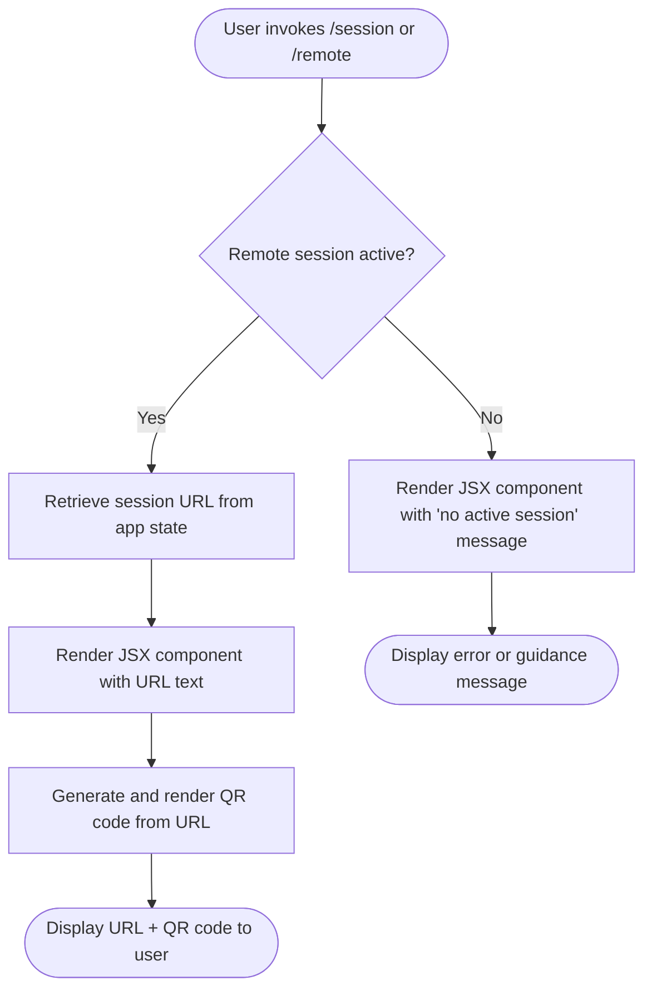

# `/session`

> Analysis basis: CC v2.1.144 bundle.js (AST extraction + Claude interpretation)
> Minimum version: v2.1.144

---

## Overview

The `/session` command (also reachable via `/remote`) displays the current remote session URL and a QR code, enabling users to connect to an active Claude Code session from another device or share the session endpoint visually. It is registered as a `local-jsx` command, meaning its output is rendered as a JSX component directly within the CLI interface rather than as plain text.

---

## Registration

| Field | Value |
|---|---|
| type | `local-jsx` |
| name | `session` |
| description | `Show remote session URL and QR code` |
| aliases | `["remote"]` |
| module\_id | `UXq` |

Analysis basis: CC v2.1.144 bundle.js:+11290328

---

## Input Branching

Because the depth-2 AST traversal returned an empty call graph and no literals for module `UXq`, the full branching logic of the command handler cannot be reconstructed from the extracted data alone.

The following flowchart describes the **minimum observable behavior** inferred from the registration metadata:



> **Note:** The conditional logic above (`Remote session active?`) is inferred from the command description and `local-jsx` rendering type. The exact branch conditions, state keys, and fallback messages are:
> `<!-- TODO: not found in depth-2 traversal; needs --depth 4 -->`

---

## Behavioral Spec

### Session Display (JSX Render)

Because the AST traversal found no entry functions in module `UXq` (see source data note: `"no entry functions found for module 'UXq'"`), the implementation body cannot be pseudocoded from extracted data. The following pseudocode represents the **minimum plausible behavior** consistent with the registration description:

```
function renderSessionCommand(appState):
    sessionURL = resolveRemoteSessionURL(appState)

    if sessionURL is null or empty:
        return renderJSX(
            component = NoSessionMessage,
            props     = { message: "No active remote session found." }
        )

    qrCode = generateQRCode(sessionURL)

    return renderJSX(
        component = SessionDisplay,
        props = {
            url:   sessionURL,
            qr:    qrCode
        }
    )
```

> **Implementation detail caveat:** The exact component names (`SessionDisplay`, `NoSessionMessage`), prop shapes, and URL resolution logic are:
> `<!-- TODO: not found in depth-2 traversal; needs --depth 4 -->`

Analysis basis: CC v2.1.144 bundle.js:+11290328 (registration only; implementation body not reached by traversal)

### Alias Handling

The command is registered with the alias `remote`, making `/remote` fully equivalent to `/session` at dispatch time. No separate handler is expected; the alias is resolved by the command router before the module is invoked.

Analysis basis: CC v2.1.144 bundle.js:+11290328

---

## State & Side Effects

| Item | Detail |
|---|---|
| Telemetry | None detected in depth-2 traversal (`telemetry: []`) |
| Hook registration | `<!-- TODO: not found in depth-2 traversal; needs --depth 4 -->` |
| appState changes | Read-only access to session URL suspected; no write side effects detected |
| Sound | `<!-- TODO: not found in depth-2 traversal; needs --depth 4 -->` |
| QR code rendering | Rendered inline as JSX; no file written to disk (inferred from `local-jsx` type) |

---

## Version History

| Version | Change |
|---|---|
| v2.1.144 | Initial analysis. Command registered as `local-jsx`, alias `remote`, module `UXq`. Call graph unreachable at depth ≤ 2. |

---

## Common Mistakes

1. **Using `/remote` and expecting different output from `/session`** — Both aliases resolve to the same `UXq` module handler. The output is identical regardless of which alias is used.
2. **Invoking `/session` when no remote session is running** — The command is designed to display an existing session URL. Starting a remote session is a separate concern (likely a CLI flag or separate command); `/session` itself does not initiate a connection.
3. **Expecting plain-text output** — This command is registered as `local-jsx`. Its output is a rendered component, not a raw string. Attempting to pipe or capture the output as plain text in a scripting context may yield unexpected results.
4. **Assuming telemetry is emitted** — No `tengu_*` telemetry events were found in the traversal. Do not rely on telemetry hooks from this command for observability pipelines.

---

## Appendix — Identifier Mapping

> For bundle debugging only. Identifiers change across versions.

| Identifier | Role |
|---|---|
| `UXq` | Module ID for the `/session` command handler (not an obfuscated function name, but a mangled module identifier used by the bundle's internal module registry) |

> No obfuscated function-level identifiers were returned by the depth-2 traversal (`identifiers: []`). If deeper traversal is performed, this table should be expanded accordingly.