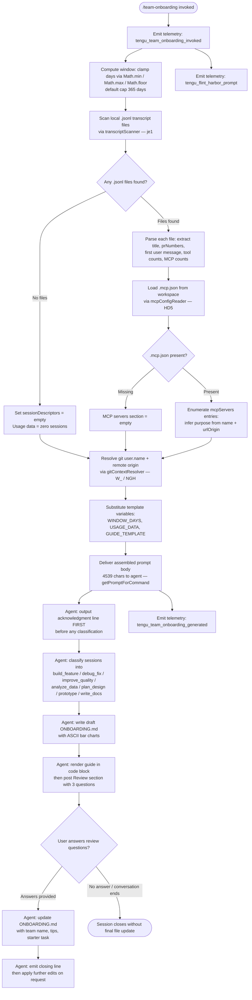

# `/team-onboarding`

> Analysis basis: CC v2.1.156 bundle.js (AST extraction + Claude interpretation)
> Minimum version: v2.1.156

---

## Overview

`/team-onboarding` is a `prompt`-type slash command that scans the invoking user's local Claude Code session transcripts (up to a configurable window of days), derives a usage-pattern summary, and instructs the Claude agent to co-author a markdown onboarding guide (`ONBOARDING.md`) tailored for teammates who are new to Claude Code. The command operates through a multi-step, conversational flow: it immediately renders a concrete draft guide, then asks three targeted review questions before writing the final file.

---

## Registration

| Field | Value |
|---|---|
| type | `prompt` |
| name | `team-onboarding` |
| description | Help teammates ramp on Claude Code with a guide from your usage |
| isHidden | `false` |
| handler_method | `getPromptForCommand` |
| handler_method_start (byte) | `12694962` |
| handler_method_end (byte) | `12695672` |
| loc_byte | `12694624` |
| loc_byte_end | `12695673` |
| loc_line | `9919` |
| prompt_body.length | `4539` characters |
| prompt_body.trace | `identifier→$ (local→1 ext vars)` |
| arbor_handler.name | `getPromptForCommand` |
| arbor_handler.kind | `Method` |
| arbor_handler.fqn | `claude-2.1.156::getPromptForCommand` |
| arbor_handler.resolution_path | `direct` |
| arbor_handler.n_hits | `2` |
| `handler_method_start` | `12694962` |
| `handler_method_end` | `12695672` |

Analysis basis: CC v2.1.156 bundle.js:+12694624

---

## Input Branching

The handler executes five distinct phases with branching at transcript scan, session classification, MCP enumeration, guide rendering, and revision. A Mermaid flowchart is used because there are more than three distinct paths.



---

## Behavioral Spec

### 1. Handler Entry — `getPromptForCommand`

The Arbor-resolved handler `getPromptForCommand` is an ObjectMethod defined directly inside the registration object (byte range `12694962`–`12695672`).

```
function getPromptForCommand(context):
    emit telemetry("tengu_flint_harbor_prompt")          // +12694999
    emit telemetry("tengu_team_onboarding_invoked")      // +12695222

    windowDays = Math.floor(
        Math.max(1,
            Math.min(365, context.windowDays ?? 365)     // cap: 365 days (+12695211)
        )
    )                                                    // +12695165–12695183

    usageData   = collectTranscriptData(windowDays)      // calls transcriptScanner
    mcpConfig   = readMcpConfig()                        // calls mcpConfigReader
    gitContext  = resolveGitContext()                    // calls gitContextResolver

    promptText = PROMPT_TEMPLATE
        .replaceAll("{{WINDOW_DAYS}}", String(windowDays))   // +12695409, +12695440
        .replaceAll("{{USAGE_DATA}}",  JSON.stringify(usageData))
        .replaceAll("{{GUIDE_TEMPLATE}}", GUIDE_TEMPLATE_CONSTANT)

    emit telemetry("tengu_team_onboarding_generated")    // +12695541

    return { type: "text", content: promptText }         // literal "text" +12695656
```

Analysis basis: CC v2.1.156 bundle.js:+12694962

---

### 2. Transcript Scanner — `transcriptScanner` (`je1`)

Reads all `.jsonl` files from the Claude Code projects directory, filters by modification time within `windowDays`, and extracts session descriptors.

```
async function transcriptScanner(windowDays):
    cutoffMs = Date.now() - (windowDays * 24 * 60 * 1000)  // +12683460–12683469
                                                            // values: 24, 60, 1000

    projectsDir = resolveProjectsPath()                     // via $0 / MN (+1001449–1001511)
    allEntries  = await fs.readdir(projectsDir)             // I_6.readdir +12683488

    jsonlFiles = allEntries
        .filter(entry => path.extname(entry) === ".jsonl")  // ".jsonl" +12683575
        .map(name => path.join(projectsDir, name))

    results = await Promise.all(                            // +12683594
        jsonlFiles.map(async filePath =>
            stat = await fs.stat(filePath)                  // I_6.stat +12683659
            if not stat.isFile(): return null               // +12683675

            raw = await fs.readFile(filePath, "utf-8")      // I_6.readFile +12683831
            lines = raw.split("\n")                         // +12683945

            session = {}
            for line in lines:
                if line includes MCP tool pattern:          // z.includes +12683986
                    // parse MCP name from "\"name\":\"mcp__" +12684154
                    match = MCP_NAME_REGEX.exec(line)       // oY5.exec +12684295
                    session.mcpCount++
                if line includes content marker:            // "\"content\":[" +12684504
                    prMatch  = PR_REGEX.exec(line)          // aY5.exec +12684351
                    seq      = Number(capture)              // +12684375
                if line.startsWith(FIRST_MSG_MARKER):       // D.startsWith +12684611
                    session.firstMessage = line.slice(3)    // +12684644
                    // limit: first 10 chars used as snippet // value 10 +12683971

            return session descriptor object
        )
    )
    return results.filter(Boolean)
```

Analysis basis: CC v2.1.156 bundle.js:+12683447

---

### 3. MCP Config Reader — `mcpConfigReader` (`HD5`)

Reads the workspace `.mcp.json` file and returns the `mcpServers` map.

```
async function mcpConfigReader(workspaceRoot):
    configPath = path.join(workspaceRoot, ".mcp.json")     // iI8.join +12685675
                                                           // literal ".mcp.json" +12685686
    try:
        raw  = await fs.readFile(configPath, "utf8")       // Xe1.readFile +12685662
                                                           // encoding "utf8" +12685699
        data = JSON.parse(raw)                             // m6 +12685709
        servers = data["mcpServers"] ?? {}                 // literal "mcpServers" +12685742

        return servers.map(entry =>
            name      = entry.name
            urlOrigin = entry.urlOrigin ?? null
            return { name, urlOrigin }
        )
    catch P8:                                              // error handler P8 +12685838
        if errorCode is ENOENT:
            return {}                                      // no MCP config present
        raise
```

Analysis basis: CC v2.1.156 bundle.js:+12685662

---

### 4. Git Context Resolver — `gitContextResolver` (`W_` / `NGH`)

Resolves the guide creator's name and the repo's remote origin URL by running `git config` and `git remote get-url origin`.

```
async function gitContextResolver():
    userName = await runGitCommand(["config", "user.name"])    // literals +12686316, +12686325
    remoteUrl = await runGitCommand(["remote", "get-url", "origin"])
                                                               // literals +12686381, +12686390, +12686400
    repoName  = path.basename(iI8.basename(...))               // iI8.basename +12686497

    normalizedRemote = normalizeRemoteUrl(remoteUrl)           // NGH: trim, match, slice +1065359–1065637
        // strips "git/" prefix (+1065622)
        // lowercases result (+1065705)
        // resolves localhost URLs (+1069741)

    return { userName, remoteUrl: normalizedRemote, repoName }
```

Analysis basis: CC v2.1.156 bundle.js:+12686306

---

### 5. Usage Data Aggregator — `usageDataAggregator` (`_D5`)

Combines transcript scan results, git context, and current repo information into the `USAGE_DATA` JSON object that is injected into the prompt.

```
function usageDataAggregator(windowDays):
    currentRepo     = resolveCurrentRepo()           // $_ / ov +12685987, +41163
    projectsPath    = resolveProjectsPath()          // $0 +12685994
    sessionDescs    = transcriptScanner(windowDays)  // je1 +12686008
    mcpServers      = mcpConfigReader(workspaceRoot) // HD5 +12686125
    gitCtx          = gitContextResolver()           // W_ +12686306
    generatedBy     = gitCtx.userName ?? null        // RH +12686451

    return {
        windowDays,
        currentRepo,
        sessionDescriptors: sessionDescs,
        mcpServers,
        generatedBy,
        repoName: gitCtx.repoName,
    }
```

Analysis basis: CC v2.1.156 bundle.js:+12685987

---

### 6. Agent Prompt Instructions (Behavioral Contract)

The 4,539-character prompt body instructs the agent to follow a strict ordering and output contract. The key behavioral commitments grounded in the prompt body are:

**Step 1 — Immediate acknowledgment (non-negotiable first output):**
The agent must emit the acknowledgment line (`"Looking at how you've used Claude over the last {{WINDOW_DAYS}} days…"`) as its very first visible text — before any classification, reasoning, or tool calls. The prompt explicitly warns that the guide creator "is staring at a blank screen."

**Step 2 — Session classification:**
The agent reads the `sessionDescriptors` array and classifies each session into exactly one of seven task types: `build_feature`, `debug_fix`, `improve_quality`, `analyze_data`, `plan_design`, `prototype`, or `write_docs`. Display names use title case with spaces (e.g., "Build Feature"). The agent selects the top 3–5 categories with rough percentages. If session data is absent (~0 sessions), the breakdown is left as a TODO placeholder.

**Step 3 — Resource gathering:**
The agent identifies repos (starting from `currentRepo`, then checking workspace siblings), and for each MCP server entry uses `name` and `urlOrigin` to describe purpose and access method. Team Tips and Get Started sections remain as TODO placeholders at this stage.

**Step 4 — Draft guide rendering:**
The agent writes `ONBOARDING.md` using the injected `{{GUIDE_TEMPLATE}}`. Real numbers from usage data must be used (no placeholder values). `generatedBy` is used for the author name; omitted if missing. ASCII bar charts use `█` for filled segments and `░` for empty segments, 20 characters wide. An HTML comment instruction at the bottom of the template must be preserved verbatim.

**Step 5 — Review loop:**
After rendering the guide in a fenced code block, the agent adds a horizontal rule and a `**Review**` heading, then asks exactly three numbered questions:
1. Team name confirmation (or request if unknown)
2. Starter task (ticket or doc link — optional)
3. Team tips not already in `CLAUDE.md`

After receiving answers, the agent updates `ONBOARDING.md` and closes with the exact line: `Saved to \`ONBOARDING.md\`. Drop it in your team docs and channels — when a new teammate pastes it into Claude Code, they get a guided onboarding tour from there.`

Subsequent edits from the user are applied to the file on request.

Analysis basis: CC v2.1.156 bundle.js:+12694962 (prompt body, length 4539)

---

## State & Side Effects

| Item | Detail |
|---|---|
| Telemetry: `tengu_flint_harbor_prompt` | Fired at handler entry (+12694999) |
| Telemetry: `tengu_team_onboarding_invoked` | Fired immediately after invocation with context (+12695222) |
| Telemetry: `tengu_team_onboarding_generated` | Fired after prompt assembly is complete (+12695541) |
| Telemetry: `tengu_config_parse_error` | Fired if config file cannot be parsed (+3210789) |
| Telemetry: `tengu_config_lock_contention` | Fired on config lock contention (+3208214) |
| Telemetry: `tengu_config_stale_write` | Fired if stale config write is detected (+3208350) |
| Telemetry: `tengu_config_auth_loss_prevented` | Fired if auth-loss guard trips (+3208693) |
| Telemetry: `tengu_flint_harbor_share` | Fired via share path in `HH6` (+9532232) |
| File read: transcript `.jsonl` files | Read from Claude Code projects directory; not modified |
| File read: `.mcp.json` | Read from workspace root; not modified |
| File write: `ONBOARDING.md` | Written to current working directory after agent completes the review loop |
| Git subprocess | Runs `git config user.name` and `git remote get-url origin` |
| Config file access | Reads global Claude config (with lock, backup, and auth-loss guards via `hz_` / `bzH`) |
| Hook registration | `_9` calls `f$A.register` (+58450) — file-watch hook registered during config access |
| appState changes | None directly in handler; config subsystem may update cached state |
| Sound | None identified in depth-2 traversal |

---

## Version History

| Version | Change |
|---|---|
| v2.1.156 | Initial analysis |

---

## Common Mistakes

1. **Running the command in a directory with no transcript history.** If no `.jsonl` files exist (or all are outside the time window), `sessionDescriptors` will be empty and the work-type breakdown will be a TODO placeholder. The guide will still be generated but will contain minimal usage insight.

2. **Missing `.mcp.json`.** If no `.mcp.json` file exists in the workspace root, the MCP server section of the onboarding guide will be empty. This is expected and not an error, but users who rely on MCP tools should create or commit this file before running the command.

3. **Git not configured or not in a git repo.** If `git config user.name` or `git remote get-url origin` fail, `generatedBy` and `remoteUrl` will be omitted from the usage data. The guide will be generated without the author name.

4. **Expecting an interactive Q&A before a draft.** The command is designed to produce a concrete draft immediately. Users should not attempt to answer questions before the guide is rendered — the agent will produce the draft first, then ask.

5. **Confusing the `{{WINDOW_DAYS}}` cap.** The window is clamped to a maximum of 365 days (`Math.min(365, ...)` at +12695165–12695183). Passing a larger value will silently be capped.

6. **Editing `ONBOARDING.md` manually before answering the Review questions.** The agent will overwrite `ONBOARDING.md` when it processes the review answers. Manual edits made between the draft and the review response will be lost.

---

## Appendix — Identifier Mapping

> For bundle debugging only. Identifiers change across versions.

| Identifier | Role |
|---|---|
| `__handler_team-onboarding` | Synthetic BFS entry point for the command handler (not a real bundle symbol) |
| `E6` | Session/process launcher / background session orchestrator |
| `hz6` | Sub-helper within session orchestrator (exact role unclear at depth-2) |
| `Sz6` | Sub-helper within session orchestrator (exact role unclear at depth-2) |
| `Mx` | Template variable formatter / string interpolator |
| `xH` | String coercion utility |
| `fx` | Feature-flag / config reader |
| `wR` | Feature flag evaluation wrapper |
| `y88` | Session deduplication / cache lookup helper |
| `$z_` | New session creation function |
| `yEH` | Session initializer sub-step |
| `KU` | Random session ID generator (uses `BBq.randomBytes`, 32 bytes hex) |
| `RH` | JSON serializer wrapper |
| `m97` | Session metadata emitter |
| `wz_` | Session state writer |
| `mIq` | Background task registrar |
| `i_` | Viewport/state accessor |
| `vBq` | Config entry formatter |
| `Z3H` | Feature-gate checker (uses `baK.has`) |
| `b6` | Config file accessor (main entry for global config read) |
| `B6` | Config base-path resolver |
| `vz_` | Config version resolver |
| `bzH` | Config file reader / parser (reads, parses, backups config JSON) |
| `q` | Filesystem namespace (sync ops: `readFileSync`, `statSync`, `mkdirSync`, etc.) |
| `m6` | JSON.parse wrapper |
| `kb` | String prefix stripper (startsWith + slice) |
| `_` | Filesystem or utility namespace (context-dependent) |
| `J8` | Error classifier / typed error constructor |
| `UBq` | Backup directory enumerator for config |
| `N` | String formatter / log-level dispatcher |
| `d` | Logger or debug output sink |
| `Sz_` | Config backup path resolver |
| `w` | Background daemon process manager |
| `Y17` | Config file watcher (uses `B88.watchFile` / `B88.unwatchFile`) |
| `Mr` | File-watch event handler |
| `_9` | Hook registrar (calls `f$A.register`) |
| `O8` | Transcript data collector / usage aggregator entry |
| `hz_` | Config read-with-lock function (full locking, backup, auth-loss guard) |
| `L` | Async resource set / disposable scope manager |
| `f` | Async handle with close semantics |
| `o$q` | Config object merger (uses `Object.assign`) |
| `k1_` | Config schema validator |
| `uz6` | Config migration helper |
| `A` | Process / handle map or global registry |
| `V` | Filtered iterator |
| `P` | MCP server connector / transport manager |
| `Vb8` | MCP transport factory |
| `hH` | MCP connection state handler |
| `F_` | Error wrapper (converts to Error with String coercion) |
| `E` | Array slice helper |
| `$L6` | Atomic file writer (write-to-temp + rename, with fchmod/fsync) |
| `O` | Stat result / file-type discriminator |
| `P8` | Error code checker |
| `H` | Various: random delay, process host, event emitter (context-dependent) |
| `jQH` | Session list formatter |
| `pBq` | Object entries iterator for session map |
| `JQH` | Timestamp formatter (uses `Date.now`) |
| `yz_` | Config save-with-fallback function |
| `_D5` | Usage data aggregator (combines transcript scan, git context, MCP config) |
| `$_` | Current repo resolver |
| `ov` | Workspace root accessor |
| `$0` | Projects path resolver |
| `MN` | Projects directory path joiner |
| `Zz` | Relative path formatter |
| `o84` | Absolute-value helper for path depth calculation |
| `je1` | Transcript file scanner (reads `.jsonl` files, extracts session descriptors) |
| `A9` | Error type checker |
| `K` | Array map/pad utility |
| `$` | Line splitter / content dispatcher |
| `bo1` | Session record parser |
| `z` | Daemon/session handle with stop semantics |
| `yH` | Daemon stop handler |
| `uH` | Daemon stop-failure handler |
| `vy` | Active session tracker |
| `km` | Multi-promise race/all coordinator (includes `process.exit`) |
| `D` | Background process dispatcher / OS-level process manager |
| `eI8` | Platform detector (macos check at +12714565) |
| `P5A` | Bun-based spare session spawner (`Bun.spawn`, `--bg-spare` flag) |
| `Wz` | Warning logger |
| `HD5` | MCP config file reader (`.mcp.json` parser) |
| `eY5` | Guide template constant holder |
| `W_` | Git command runner / git context resolver entry |
| `ZGH` | Child-process spawner with timeout, kill, and stdio binding |
| `WNA` | Command-line argument builder (Win32-aware, appends `.exe`/`cmd`) |
| `li8` | Stdio stream `$NA` initializer |
| `ni8` | Stderr stream initializer |
| `ri8` | Combined stdio initializer |
| `kvA` | Numeric argument validator (uses `Number.isFinite`) |
| `zL6` | Process exit-code resolver |
| `ci8` | `Reflect.apply` / `Reflect.defineProperty` wrapper for stream proxy |
| `ANA` | Process `exit` event listener registrar |
| `NvA` | Timeout-with-race helper (`setTimeout` + `Promise.race`) |
| `IvA` | Process kill helper (`H.kill` + `q.finally`) |
| `VvA` | Stdout data handler |
| `vvA` | SIGTERM kill wrapper |
| `HNA` | Promise.all coordinator for stdio draining |
| `jL6` | Stream pipe helper |
| `tvA` | Output stream pipe setup |
| `evA` | `ovA.default` stream add helper |
| `RvA` | stdout/stderr reader binder |
| `gA4` | String coercion for command output |
| `NGH` | Git remote URL normalizer (trim, match, slice, lowercase) |
| `Xq4` | URL hostname extractor |
| `K9` | indexOf + slice string utility |
| `HH6` | Harbor/share prompt dispatcher (calls `q1`, `RZ`, `E6`) |
| `q1` | Telemetry event builder |
| `zEA` | Telemetry string formatter |
| `RZ` | Share/export handler (calls `Uq`) |