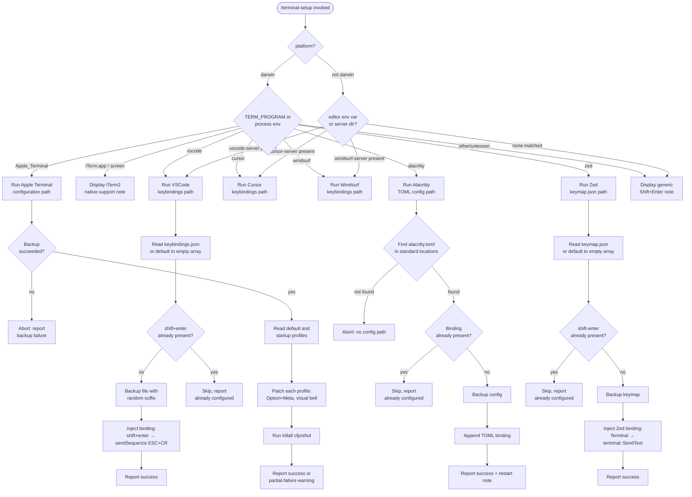

# `/terminal-setup`

> Analysis basis: CC v2.1.156 bundle.js (AST extraction + Claude interpretation)
> Minimum version: v2.1.156

---

## Overview

`/terminal-setup` detects the user's active terminal emulator and installs a Shift+Enter key binding that sends a newline sequence to the Claude Code input, enabling multi-line entry without submitting. On macOS with Apple Terminal it also enables the Option-as-Meta key and disables the audio bell. The command operates on platform-specific configuration files (plist, JSON, TOML) and creates timestamped backups before any modification.

---

## Registration

| Field | Value |
|---|---|
| type | `local-jsx` |
| name | `terminal-setup` |
| description | Install Shift+Enter key binding for newlines |
| loc_byte | 12074922 |
| loc_byte_end | 12075554 |
| loc_line | 8990 |
| module_id | `ieq` |
| load_inline | `true` |
| arbor_handler.name | `Qj7` |
| arbor_handler.fqn | `claude-2.1.156::Qj7` |
| arbor_handler.kind | `AsyncFunction` |
| arbor_handler.resolution_path | `module_id` |
| arbor_handler.n_hits | 1 |

Analysis basis: CC v2.1.156 bundle.js:+12074922

---

## Input Branching

The command has 7+ distinct execution paths determined by detected terminal identity and platform. A Mermaid flowchart is used.



---

## Behavioral Spec

### Top-level handler (`Qj7`)

The main async handler is `Qj7` (resolved via `module_id → ieq`).

```
async function terminalSetupHandler(context):
    platform = os.platform()

    // Step 1 — detect terminal
    terminalName = detectCurrentTerminal(platform)
    // returns one of: "Apple_Terminal", "iTerm.app", "screen",
    //   "vscode", "cursor", "windsurf", "alacritty", "zed", or null

    // Step 2 — branch by detected terminal
    if terminalName == "Apple_Terminal":
        results = await configureAppleTerminal()
        renderResults(results)
        return

    if terminalName in ["iTerm.app", "screen"]:
        print(dim("Note: iTerm2, WezTerm, Ghostty, Kitty, Warp, and Windows Terminal support Shift+Enter natively."))
        return

    if terminalName == "vscode":
        await configureVSCodeKeybindings("VSCode")
        return

    if terminalName == "cursor":
        await configureVSCodeKeybindings("Cursor")
        return

    if terminalName == "windsurf":
        await configureVSCodeKeybindings("Windsurf")
        return

    if terminalName == "alacritty":
        await configureAlacritty()
        return

    if terminalName == "zed":
        await configureZed()
        return

    // fallback
    print("Note: You can already use backslash (\\) + return to add newlines.")
    print("Note: iTerm2, WezTerm, Ghostty, Kitty, Warp, and Windows Terminal support Shift+Enter natively.")
```

Analysis basis: CC v2.1.156 bundle.js:+3960892

---

### Terminal detection (`detectCurrentTerminal`)

```
function detectCurrentTerminal(platform):
    // Check server-side editor directories first (remote/SSH environments)
    if homeDir contains ".vscode-server":  return "vscode"
    if homeDir contains ".cursor-server":  return "cursor"
    if homeDir contains ".windsurf-server": return "windsurf"

    // On macOS, use TERM_PROGRAM or process environment
    if platform == "darwin":
        termProgram = env["TERM_PROGRAM"]
        if termProgram == "Apple_Terminal": return "Apple_Terminal"
        if termProgram == "iTerm.app":      return "iTerm.app"
        if termProgram == "vscode":         return "vscode"
        if termProgram == "cursor":         return "cursor"
        if termProgram == "windsurf":       return "windsurf"
        if termProgram == "alacritty":      return "alacritty"
        if termProgram == "zed":            return "zed"
        if env["TERM"] == "screen":         return "screen"

    return null   // unknown / unsupported
```

Analysis basis: CC v2.1.156 bundle.js:+3958532 (server dir checks), +3958972 (darwin literal), +3959028 (vscode literal)

---

### Apple Terminal configuration (`configureAppleTerminal`)

The implementation shells out to macOS `defaults` and `/usr/libexec/PlistBuddy`.

```
async function configureAppleTerminal():
    prefPath = path.join(homedir(), "Library", "Preferences", "com.apple.Terminal.plist")

    // 1. Export current prefs to a temp plist for safe reading
    exitCode = await runCommand("defaults", ["export", "com.apple.Terminal", prefPath])
    if exitCode != 0:
        throw Error("Failed to create backup of Terminal.app preferences, bailing out")

    // 2. Read default and startup profile names
    defaultProfile = await plistRead(prefPath, "Default Window Settings")
    if defaultProfile fails:
        throw Error("Failed to read default Terminal.app profile")

    startupProfile = await plistRead(prefPath, "Startup Window Settings")
    if startupProfile fails:
        throw Error("Failed to read startup Terminal.app profile")

    profiles = unique([defaultProfile, startupProfile])
    results = []
    anySuccess = false

    // 3. For each profile: enable Option as Meta, disable audio bell
    for each profile in profiles:
        ok = await patchTerminalProfile(prefPath, profile)
        results.push(ok)
        if ok: anySuccess = true

    if not anySuccess:
        warn("Failed to enable Option as Meta key or disable audio bell for any Terminal.app profile")

    // 4. Flush macOS preferences daemon
    await runCommand("killall", ["cfprefsd"])

    // 5. Build result lines
    lines = []
    if metaKeyEnabled:  lines.push("- Enabled \"Use Option as Meta key\"")
    if bellDisabled:    lines.push("- Switched to visual bell")

    print(success("Configured Terminal.app settings:"))
    print(lines.join("\n"))
    print(dim("Shift+Return will now enter a newline."))
    print(dim("Option+Enter will now enter a newline."))
    print(dim("You must restart Terminal.app for changes to take effect."))
```

Analysis basis: CC v2.1.156 bundle.js:+3955092 (Library/Preferences path), +3955215 (defaults export), +3967167 (backup failure message), +3967851 (killall cfprefsd), +3967971 (result strings)

---

### PlistBuddy helper (`plistBuddySet`)

```
async function plistBuddySet(plistPath, keyPath, value):
    // Calls /usr/libexec/PlistBuddy -c "..." <path>
    // Uses V8 (spawn wrapper) with exit-code and stdout capture
    command = ["/usr/libexec/PlistBuddy", "-c", `Set :${keyPath} ${value}`, plistPath]
    return await spawnAndCapture(command)
```

Analysis basis: CC v2.1.156 bundle.js:+3966394 (`/usr/libexec/PlistBuddy`), +3966421 (`-c`)

---

### VSCode-family keybindings configuration (`configureVSCodeKeybindings`)

Used for VSCode, Cursor, and Windsurf (same code path, different config directory).

```
async function configureVSCodeKeybindings(appName):
    configDir = resolveVSCodeConfigDir(appName)
    // Resolves to platform-appropriate path:
    //   win32:  %APPDATA%\Code\User
    //   darwin: ~/Library/Application Support/Code/User
    //   linux:  ~/.config/Code/User
    // (Substitute "Cursor" or "Windsurf" for the app-specific folder)

    keybindingsPath = path.join(configDir, "keybindings.json")

    // Read existing bindings or start from []
    raw = await fs.readFile(keybindingsPath, "utf-8") catch "[]"
    bindings = parseJSON(raw)    // uses JSON-comment-aware parser (KF6)

    // Check if already configured
    if bindings.find(b => b.key == "shift+enter"): 
        print("shift+enter binding already configured")
        return

    // Backup before writing
    backupPath = keybindingsPath + "." + randomHex() + ".backup"
    await fs.copyFile(keybindingsPath, backupPath)

    // Inject new binding
    newBinding = {
        key: "shift+enter",
        command: "workbench.action.terminal.sendSequence",
        args: { text: "\u001b\r" },    // ESC + CR  (bundle.js:+3965581)
        when: "terminalFocus"
    }
    bindings.push(newBinding)

    await fs.writeFile(keybindingsPath, JSON.stringify(bindings, null, 2), "utf-8")
    print(success(`Configured ${appName} keybindings`))
```

Analysis basis: CC v2.1.156 bundle.js:+3965507 (`shift+enter`), +3965529 (`workbench.action.terminal.sendSequence`), +3965581 (ESC+CR sequence), +3965596 (`terminalFocus`), +3962939 (`Code` dir name), +3963084 (`Application Support`), +3963010 (`AppData/Roaming`)

---

### Alacritty configuration (`configureAlacritty`)

```
async function configureAlacritty():
    // Search standard config locations for alacritty.toml
    configPath = findAlacrittyConfig()    // checks platform-appropriate dirs
    if configPath == null:
        throw Error("No valid config path found for Alacritty")

    content = await fs.readFile(configPath, "utf-8")

    // Check if Shift+Enter binding already present
    if content.includes("mods = \"Shift\"") and content.includes("key = \"Return\""):
        print("Alacritty Shift+Enter key binding already configured")
        return

    // Backup
    backupPath = configPath + "." + randomHex()
    ok = await fs.copyFile(configPath, backupPath)
    if not ok:
        throw Error("Error backing up existing Alacritty config. Bailing out.")

    // Append TOML binding block
    await fs.writeFile(configPath, content + alacrittyTomlBinding, "utf-8")

    print(success("Installed Alacritty Shift+Enter key binding"))
    print(dim("You may need to restart Alacritty for changes to take effect"))
```

Analysis basis: CC v2.1.156 bundle.js:+3968856 (`alacritty.toml`), +3969219 (no-config error), +3969287 (`mods = "Shift"`), +3969317 (`key = "Return"`), +3969360 (already-configured message), +3969944 (success message)

---

### Zed configuration (`configureZed`)

```
async function configureZed():
    keymapPath = path.join(homedir(), ".config", "zed", "keymap.json")
    // (or platform equivalent)
    await fs.mkdir(path.dirname(keymapPath), { recursive: true })

    raw = await fs.readFile(keymapPath, "utf-8") catch "[]"
    keymap = JSON.parse(raw)

    // Check existing
    if keymap finds entry with key "shift-enter":
        print("Zed Shift+Enter key binding already configured")
        return

    // Backup
    backupPath = keymapPath + "." + randomHex()
    ok = await fs.copyFile(keymapPath, backupPath)
    if not ok:
        throw Error("Error backing up existing Zed keymap. Bailing out.")

    // Inject binding
    newEntry = {
        context: "Terminal",
        bindings: { "shift-enter": "terminal::SendText" }
    }
    if not Array.isArray(keymap): keymap = []
    keymap.push(newEntry)

    await fs.writeFile(keymapPath, JSON.stringify(keymap, null, 2), "utf-8")
    print(success("Installed Zed Shift+Enter key binding"))
```

Analysis basis: CC v2.1.156 bundle.js:+3970374 (`keymap.json`), +3970540 (`shift-enter`), +3970580 (already-configured), +3970784 (backup error), +3970993 (`Terminal` context), +3971029 (`terminal::SendText`), +3971140 (success message)

---

### Backup utility (`createTimestampedBackup`)

A shared helper used across all configuration paths:

```
async function createTimestampedBackup(originalPath):
    // Reads file, writes copy alongside with a random hex suffix
    suffix = crypto.randomBytes(4).toString("hex")
    backupPath = originalPath + ".backup." + suffix
    stat = await fs.stat(originalPath)
    if stat succeeds:
        await fs.copyFile(originalPath, backupPath)
        return { path: backupPath, status: "ok" }
    else:
        return { status: "no_backup" }
```

Analysis basis: CC v2.1.156 bundle.js:+3955499 (`no_backup` literal), +3955562 (`lJ_.stat` call in backup helper)

---

### Spawn helper (`spawnAndCapture` / `V8`)

```
async function spawnAndCapture(args, options):
    // Spawns child process, collects stdout line-by-line
    // Timeout: 10 chunks or 1 000 000 μs  (bundle.js:+1048709, +1049231)
    // Returns { exitCode, stdout, stderr }
    // On error level "error": logs via Li.logError
```

Analysis basis: CC v2.1.156 bundle.js:+1048709 (limit 10), +1049231 (1 000 000), +1049658 (`error` level)

---

## State & Side Effects

| Item | Detail |
|---|---|
| Telemetry | `tengu_config_auth_loss_prevented` (+3205485), `tengu_bg_spare_enable` (+15478198), `tengu_bg_low_mem_mb` (+12714592), `tengu_bg_spare_spawn` (+15478558), `tengu_config_lock_contention` (+3208214), `tengu_config_stale_write` (+3208350), `tengu_config_parse_error` (+3210789), `tengu_feature_ok` (+965176) |
| File writes | Modifies `keybindings.json` (VSCode/Cursor/Windsurf), `alacritty.toml`, `keymap.json` (Zed), `com.apple.Terminal.plist` (Apple Terminal) |
| File backups | Creates timestamped `.backup.<hex>` copies before every write |
| External processes | Shells out to `defaults export/write`, `/usr/libexec/PlistBuddy -c`, `killall cfprefsd` on macOS |
| Config file permissions | Backup helper (`$L6`) copies original file permissions via `fchmodSync` / `fsyncSync` (bundle.js:+1011870, +1011936) |
| Hook registration | <!-- TODO: not found in depth-2 traversal; needs --depth 4 --> |
| appState changes | <!-- TODO: not found in depth-2 traversal; needs --depth 4 --> |
| Sound | None detected |

---

## Version History

| Version | Change |
|---|---|
| v2.1.156 | Initial analysis |

---

## Common Mistakes

1. **Running on non-macOS for Apple Terminal**: The Apple Terminal path is gated behind `platform == "darwin"` (bundle.js:+3958972). Running in a Linux environment will fall through to the generic or editor-detection branch.
2. **Remote SSH / server environments**: The command checks for `.vscode-server`, `.cursor-server`, and `.windsurf-server` directories in the home directory to detect editor-hosted terminals. If these directories are absent even though the user is in a remote terminal, detection falls through to the fallback note.
3. **Binding already present**: For VSCode-family editors, the check is case-sensitive on the `"shift+enter"` key string; for Zed it checks `"shift-enter"` (hyphen, not plus). A manually added entry using different capitalisation or syntax may not be detected, causing a duplicate binding to be injected.
4. **No `alacritty.toml` found**: Alacritty configuration is only updated when a `toml`-format config file is found. Legacy `alacritty.yml` is not handled; the command aborts with "No valid config path found for Alacritty" in that case.
5. **Restart required**: Changes to Apple Terminal, Alacritty, and Zed require a manual application restart (or `killall cfprefsd` for Apple Terminal, which the command performs automatically). Users who do not restart their terminal will not see the new binding.
6. **iTerm2 / Kitty / WezTerm / Warp / Windows Terminal**: These terminals support Shift+Enter natively. The command prints an informational note and exits without making any changes; no action is required.

---

## Appendix — Identifier Mapping

> For bundle debugging only. Identifiers change across versions.

| Identifier | Role |
|---|---|
| `Qj7` | Main async handler for `/terminal-setup` (arbor_handler) |
| `FVH` | Platform detection wrapper (reads `$6H.platform`) |
| `G98` | Per-terminal dispatch router |
| `cj7` | Apple Terminal configuration orchestrator |
| `Ueq` | Apple Terminal plist backup helper |
| `wcH` | Home-directory plist path builder (`Library/Preferences/com.apple.Terminal.plist`) |
| `V8` | Child-process spawn-and-capture utility |
| `W_` | Spawn internals / stream reader |
| `C6` | Stdout/stderr line accumulator |
| `Uj7` | PlistBuddy command runner |
| `O8` | Global config read/write (used for auth-loss guard) |
| `hH` | Async command execution queue manager |
| `F_` | Error factory with errno/code fields |
| `xH` | String coercion helper |
| `q1` | Essential-traffic traffic classifier |
| `D84` | Command queue shift/push manager |
| `Qeq` | PlistBuddy "Set" wrapper for default profile |
| `deq` | PlistBuddy "Set" wrapper for startup profile |
| `DcH` | Backup restore / import helper |
| `PA` | ANSI colour string renderer for terminal output |
| `lzH` | Chalk/colour-code mapper (maps colour names to chalk methods) |
| `Hd` | Hyperlink renderer |
| `D` | Background spare process manager |
| `E6` | Background process event emitter |
| `y88` | Spare-pool set membership tracker |
| `b6` | Background process record constructor |
| `bo1` | Background process telemetry emitter |
| `eI8` | Background low-memory event handler |
| `P5A` | Background spare daemon spawner |
| `j1` | Pipe/stream utility |
| `Ky1` | Spare socket path builder |
| `Ly1` | Spare lock path builder |
| `pl` | Spare base directory resolver |
| `UU5` | Spare process readiness checker |
| `xU5` | Spare process metadata builder |
| `lh` | Socket line reader for spare processes |
| `X98` | Backup validation / import orchestrator |
| `Bj7` | Backup record constructor |
| `aJ_` | VSCode-family keybindings installer |
| `sJ_` | Remote-server editor directory detector (`.vscode-server`, etc.) |
| `qX_` | VSCode config directory resolver (per-platform) |
| `KF6` | JSON-with-comments parser |
| `kb` | JSON comment stripper |
| `A9` | File-system error classifier |
| `Gx` | File URL helper (`pathToFileURL`) |
| `BP` | Hyperlink support detector |
| `xD` | Terminal capability probe |
| `zkA` | JSON AST patch helper (modify keybindings array) |
| `br8` | JSON AST node inserter |
| `_kA` | JSON AST insertion-index calculator |
| `xr8` | JSON AST node replacer |
| `AF6` | JSON AST substring extractor |
| `oJ_` | Cursor keybindings installer (VSCode-family variant) |
| `OkA` | Cursor JSON patch helper |
| `lj7` | Alacritty TOML config installer |
| `nj7` | Zed keymap.json installer |
| `m6` | JSON.parse wrapper |
| `YcH` | Onboarding / project-complete state handler |
| `GO` | Project state emitter |
| `beq` | Project config writer |
| `cJ_` | CLAUDE.md path resolver |
| `yB6` | File existence checker |
| `yz` | Project config save-with-lock |
| `hz_` | Config save-with-lock core (handles backup rotation, lock contention) |
| `o$q` | Lock acquisition helper |
| `bzH` | Config file reader with backup fallback |
| `uz6` | Config object merger |
| `Sz_` | Config backup rotation (keeps last N backups) |
| `$L6` | Atomic file writer (temp + rename + fchmod + fsync) |
| `jQH` | Config write timestamp recorder |
| `JQH` | Config write timestamp getter |
| `yz_` | Project config path resolver |
| `yH` | App-state accessor |
| `AX_` | Windsurf keybindings installer (VSCode-family variant) |
| `dj7` | Windsurf config directory resolver |
| `_X_` | Background process exit handler |
| `eJ_` | Background process stdout handler |
| `HX_` | Background process stderr handler |
| `neq` | iTerm2 clipboard-access enabler (macOS `defaults write`) |
| `P98` | iTerm2 / screen detection and note renderer |