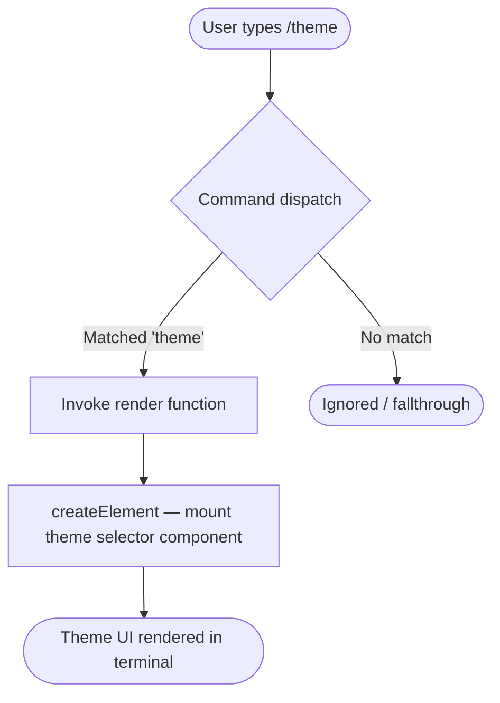

# `/theme`

> Analysis basis: CC v2.1.143 bundle.js (AST extraction + Claude interpretation)
> Minimum version: v2.1.143

---

## Overview

The `/theme` command allows the user to change the visual theme of the Claude Code CLI interface. It is implemented as a `local-jsx` command, meaning its output is rendered as a JSX component directly within the terminal UI rather than producing plain text output. The command delegates its entire presentation and interaction logic to a dedicated React-style component tree.

---

## Registration

| Field | Value |
|---|---|
| type | `local-jsx` |
| name | `theme` |
| description | `Change the theme` |
| module\_id | `EXq` |
| loc\_line | `6978` |

Analysis basis: CC v2.1.143 bundle.js:+11384642

---

## Input Branching

The depth-2 call graph for this command contains a single call edge: the command's render function invoking `xLH.createElement` (i.e., React's `createElement`). No argument-conditional branching was detected at depth ≤ 2. The command appears to unconditionally mount a JSX component when invoked, regardless of any user-supplied arguments.



Analysis basis: CC v2.1.143 bundle.js:+11384489

---

## Behavioral Spec

### Theme Selector Component Mount

When `/theme` is dispatched, the command's render function is called by the CLI's slash-command runner. It produces a React element via `createElement`, mounting a theme-selection UI component into the active terminal pane.

```
function renderThemeCommand(props):
    element = createElement(ThemeSelectorComponent, props)
    return element
```

The returned element is handed back to the CLI rendering layer, which is responsible for displaying it inline within the conversation or command output area.

Analysis basis: CC v2.1.143 bundle.js:+11384489

### Argument Handling

No string or numeric literals were extracted from the implementation at depth ≤ 2, and no conditional branches on user-supplied arguments were observed. The command does not appear to accept sub-commands or named flags at this traversal depth.

<!-- TODO: not found in depth-2 traversal; needs --depth 4 -->

### Theme Application Logic

The internal logic that reads, validates, and applies a selected theme value — including persistence to disk or in-memory state, available theme names/identifiers, and any default fallback — was not reachable within the depth-2 call graph.

<!-- TODO: not found in depth-2 traversal; needs --depth 4 -->

---

## State & Side Effects

| Item | Detail |
|---|---|
| Telemetry | None detected at depth ≤ 2 traversal |
| Hook registration | <!-- TODO: not found in depth-2 traversal; needs --depth 4 --> |
| appState changes | <!-- TODO: not found in depth-2 traversal; needs --depth 4 --> |
| Sound | <!-- TODO: not found in depth-2 traversal; needs --depth 4 --> |

> **Note on telemetry:** No `tengu_*` event strings were found in the extracted implementation data. It is possible that telemetry is emitted from a child component mounted by `createElement` that was not reached in this traversal. A deeper analysis pass is recommended before concluding that the command is fully telemetry-free.

---

## Version History

| Version | Change |
|---|---|
| v2.1.143 | Initial analysis — `local-jsx` render pattern confirmed; full theme logic pending deeper traversal |

---

## Common Mistakes

1. **Expecting plain-text output:** Because this command's `type` is `local-jsx`, it does not print a text response to stdout. Automation or scripting that captures stdout after invoking `/theme` will receive no output; the result is rendered only inside the interactive terminal UI.
2. **Assuming argument-driven selection:** No evidence was found at this traversal depth that passing a theme name as a direct argument (e.g., `/theme dark`) is supported. Users should interact with the mounted UI component to make a selection rather than assuming CLI-flag-style input works.
3. **Expecting immediate persistence without interaction:** The command mounts a selector component; the theme change most likely takes effect only after the user completes an interaction within that component, not at the moment `/theme` is typed.
4. **Version-pinning the module ID:** The module identifier `EXq` is a bundle-level obfuscated ID that will change across build versions. Do not reference it in any external tooling or tests.

---

## Appendix — Identifier Mapping

> For bundle debugging only. Identifiers change across versions.

| Identifier | Role |
|---|---|
| `tI7` | Theme command render function — produces the JSX element returned to the CLI rendering layer |