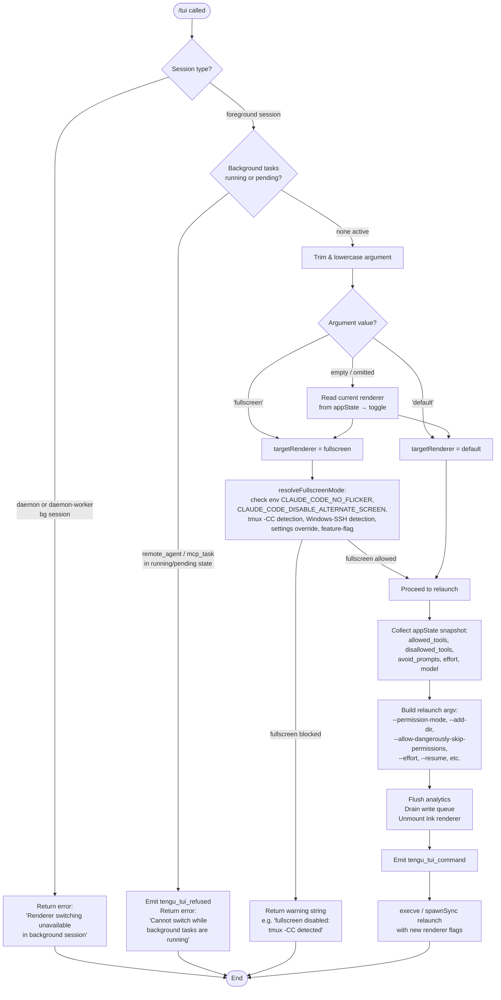

# `/tui`

> Analysis basis: CC v2.1.156 bundle.js (AST extraction + Claude interpretation)
> Minimum version: v2.1.156

---

## Overview

The `/tui` command switches the terminal UI renderer between `default` and `fullscreen` modes at runtime. It validates the current session context, checks for active background tasks that would make switching unsafe, then tears down the existing renderer and relaunches the process under the requested mode. When called with no argument it toggles to the opposite of the current renderer.

---

## Registration

| Field | Value |
|---|---|
| type | `local-jsx` |
| name | `tui` |
| description | `Set the terminal UI renderer (default \| fullscreen)` |
| argumentHint | `[default\|fullscreen]` |
| module_id | `VQ1` |
| load_inline | `true` |
| loc_byte | `12100141` |
| loc_byte_end | `12100323` |
| loc_line | `8993` |
| arbor_handler.name | `z75` |
| arbor_handler.fqn | `claude-2.1.156::z75` |
| arbor_handler.kind | `AsyncFunction` |
| arbor_handler.resolution_path | `module_id` |
| arbor_handler.n_hits | `0` |

Analysis basis: CC v2.1.156 bundle.js:+12100141

---

## Input Branching

The handler has more than three distinct decision paths (background-session guard, active-task guard, argument parsing, per-renderer selection, and environment-override checks). A Mermaid flowchart is used.



Analysis basis: CC v2.1.156 bundle.js:+12098071 – +12099857

---

## Behavioral Spec

### 1. Handler Entry — `tuiCommandHandler` (bundle: `z75`)

```
async function tuiCommandHandler(args, context):
    rawArg = args.trim()                          // bundle:+12098071
    sessionInfo = getSessionInfo()                 // bundle:+12098096 (i_)
    rendererConfig = getFullscreenConfig()         // bundle:+12098107 (fq)

    // Guard 1 — background session
    sessionType = getAppStateField("session_type") // bundle:+12098153
    if sessionType in ["daemon", "daemon-worker"]:
        return errorJSX(
          "Renderer switching isn't available in a background session — " +
          "press ← to detach and run /tui from a foreground session."
        )                                          // bundle:+12098393

    // Guard 2 — active background tasks
    activeTasks = Object.values(taskRegistry)      // bundle:+12098718
    for task in activeTasks:
        if task.type in ["remote_agent", "mcp_task"] and
           task.state in ["running", "pending"]:
            emit("tengu_tui_refused")              // bundle:+12098846
            return errorJSX(
              "Cannot switch renderers while background tasks are running — " +
              "wait for them to finish (or stop them via /tasks), " +
              "then run /tui again."
            )                                      // bundle:+12098887

    // Argument resolution
    target = resolveTargetRenderer(rawArg, context)// bundle:+12098359 (Gk8)

    // Fullscreen-mode check (only when target == "fullscreen")
    if target == "fullscreen":
        blockReason = checkFullscreenAllowed(rendererConfig) // bundle:+12099058 (gzH)
        if blockReason != null:
            return warningJSX(blockReason)

    // Telemetry snapshot
    uptime = Math.round(process.uptime())          // bundle:+12099397–12099408
    emit("tengu_tui_command", {target, uptime, ...}) // bundle:+12099318

    // Relaunch
    relaunchArgs = buildRelаunchArgv(target, context) // bundle:+12099185 (gN)
    await flushAndRelaunch(relaunchArgs)           // bundle:+12099756 (EQ1)
```

Analysis basis: CC v2.1.156 bundle.js:+12098071

---

### 2. Target Renderer Resolution — `resolveTargetRenderer` (bundle: `Gk8`)

```
function resolveTargetRenderer(rawArg, context):
    // Collect precedence layers:
    //   "system"  — compiled defaults
    //   "cliArg"  — CLI flag passed at startup    // bundle:+12095231
    //   "session" — per-session override           // bundle:+12095252
    layers = Array.from(settingsLayers)            // bundle:+12095156

    if rawArg == "fullscreen":
        return "fullscreen"                        // bundle:+3378145
    elif rawArg == "default":
        return "default"                           // bundle:+3378171
    else:
        // Toggle: read current value, return opposite
        current = readCurrentRenderer(layers)
        return (current == "fullscreen") ? "default" : "fullscreen"

    // Additional flags forwarded from existing session:
    //   --add-dir, --allow-dangerously-skip-permissions // bundle:+12095331/12095500
    //   --effort, --permission-mode               // bundle:+12095642/12095659
```

Analysis basis: CC v2.1.156 bundle.js:+12095156

---

### 3. Fullscreen Compatibility Check — `checkFullscreenConfig` (bundle: `gzH` / `fq`)

```
function checkFullscreenConfig(config):
    // Priority order (highest wins):

    // 1. env CLAUDE_CODE_NO_FLICKER=1 forces fullscreen even on bad terminals
    //    → reason tag "bg_forced_on"              // bundle:+3378564

    // 2. env CLAUDE_CODE_DISABLE_ALTERNATE_SCREEN → "env_off" // bundle:+3378594
    // 3. env CLAUDE_CODE_FORCE_FULLSCREEN_UPSELL  → "env_on"  // bundle:+3378652

    // 4. tmux -CC (iTerm2 control-mode) detection:
    //    spawnSync("tmux", ["display-message","-p","#{client_control_mode}"])
    //    timeout 2000 ms                          // bundle:+3377065/3377139
    //    if client_control_mode indicates CC → "tmux_cc_auto_off"
    //    error message: "fullscreen disabled: tmux -CC (iTerm2 integration
    //      mode) detected · set CLAUDE_CODE_NO_FLICKER=1 to override"
    //                                             // bundle:+3377811

    // 5. Windows-over-SSH detection:
    //    platform == "windows" and SSH env present
    //    → "win_ssh_auto_off"                     // bundle:+3378710
    //    error message: "fullscreen disabled: Windows over SSH (ConPTY
    //      re-rendering) detected · set CLAUDE_CODE_NO_FLICKER=1 to override"
    //                                             // bundle:+3377997

    // 6. settings file value → "settings_on" / "settings_off" // bundle:+3378769/3378803

    // 7. feature-flag / downsell → "downsell_on" // bundle:+3378876

    // 8. gradual-rollout gate → "gb_on" / "gb_off" // bundle:+3378941/3378949

    // IDE terminal overrides (Cursor, VS Code, JetBrains)
    //    IDE terminal version ranges checked      // bundle:+3450492/3450541/3449815

    return {allowed: bool, reason: string | null}
```

Analysis basis: CC v2.1.156 bundle.js:+3377592

---

### 4. Terminal Capability Detection — `detectTerminalCapabilities` (bundle: `gN`)

```
function detectTerminalCapabilities():
    // Check JetBrains IDE terminal                // bundle:+3449815
    // Check terminal emulator family:
    //   Cursor: versions 1092000–1105000          // bundle:+3450617/3450628
    //   VS Code (xterm.js)                        // bundle:+3450661
    // Platform checks: darwin / win32             // bundle:+3450025/3450072
    // Query tmux client control mode if inside tmux/screen // bundle:+3376855/3376880
    // Fallback: "unset"                           // bundle:+3450195
    // Scale factor capped at 20                   // bundle:+3450999
    return terminalProfile
```

Analysis basis: CC v2.1.156 bundle.js:+3449746

---

### 5. Flush and Relaunch — `flushAndRelaunch` (bundle: `EQ1` → `A2H`)

```
async function flushAndRelaunch(argv):
    // 1. Drain the in-flight write queue (IxH → f$A.drain) // bundle:+12093925
    // 2. Race against flush timeout 30 000 ms     // bundle:+12093874
    //    label: "flush timeout (relaunch)"        // bundle:+12093880
    // 3. Race analytics flush, 500 ms timeout     // bundle:+5329346
    //    label: "analytics flush timeout"         // bundle:+12093992
    // 4. Cleanup timeout label "cleanup timeout"  // bundle:+12093936
    // 5. Remove all process signal listeners:
    //    SIGINT, SIGTERM, SIGHUP                  // bundle:+12094347–12094366
    // 6. process.removeAllListeners()             // bundle:+12094376
    // 7. Unmount Ink JSX renderer                 // bundle:+5327589 (rNH)
    //    Write terminal restore sequences ESC-7 / ESC-8 // bundle:+3716981/3716992
    // 8. spawnSync or execve with new argv        // bundle:+12094433
    //    stdio: "inherit"                         // bundle:+12094468
    //    On execve failure → write error file (ij) // bundle:+190553
    //    exit(128 + signal) on fatal              // bundle:+12094795
```

Analysis basis: CC v2.1.156 bundle.js:+12093853

---

### 6. Settings Load (called during session-info resolution) — `loadSettingsFromDisk` (bundle: `vp` / `i_`)

```
function loadSettingsFromDisk():
    // Performance mark: "loadSettingsFromDisk_start" // bundle:+1225618
    // Layers merged in order:
    //   flagSettings    (compile-time flags)      // bundle:+1214617
    //   policySettings  (enterprise policy)       // bundle:+1214639
    //   userSettings    (~/.claude/settings.json) // bundle:+1217825
    //   projectSettings (.claude/settings.json)   // bundle:+1217876
    //   localSettings   (.claude/settings.local.json) // bundle:+1217898
    //   SDK inline settings                       // bundle:+1216897
    // Emit telemetry: "settings_load_started"     // bundle:+1222237
    // Emit telemetry: "settings_load_completed"   // bundle:+1222962
    // Performance mark: "loadSettingsFromDisk_end"// bundle:+1225674
    return mergedSettings
```

Analysis basis: CC v2.1.156 bundle.js:+1225285

---

## State & Side Effects

| Item | Detail |
|---|---|
| Telemetry — `tengu_tui_refused` | Fired when a background task blocks the switch (bundle.js:+12098846) |
| Telemetry — `tengu_tui_command` | Fired on every successful relaunch attempt, carries target renderer and uptime (bundle.js:+12099318) |
| Telemetry — `tengu_amber_creek` | Fired inside fullscreen-config evaluation path (bundle.js:+3378328) |
| Telemetry — `tengu_pewter_brook` | Fired inside fullscreen-config evaluation path (bundle.js:+3378236) |
| Telemetry — `tengu_feature_ok` | Generic feature success event emitted from settings layer (bundle.js:+965176) |
| Telemetry — `tengu_feature_sad` | Generic feature degraded event (bundle.js:+965311) |
| Telemetry — `tengu_feature_bad` | Generic feature error event (bundle.js:+965234) |
| Telemetry — `tengu_scroll_summary` | Emitted during renderer teardown scroll-summary flush (bundle.js:+5329057) |
| Telemetry — `tengu_bg_dispatch_sigkill_escalate` | Background worker SIGKILL escalation during shutdown (bundle.js:+15478865) |
| Telemetry — `tengu_bg_dispatch_low_mem` | Low-memory eviction during shutdown (bundle.js:+15479444) |
| Telemetry — `tengu_bg_spare_enable` / `tengu_bg_spare_claim` / `tengu_bg_spare_claim_fail` | Spare-process pool events during relaunch (bundle.js:+15480139/15480260/15480523) |
| Telemetry — `tengu_daemon_control` | Daemon lifecycle event emitted during relaunch (bundle.js:+15514702) |
| Process replacement | `execve` (or `spawnSync` fallback) replaces the current process image — no return to the calling JS context (bundle.js:+12094433) |
| Signal listeners | All existing `SIGINT` / `SIGTERM` / `SIGHUP` listeners removed before relaunch (bundle.js:+12094347–12094366) |
| Ink renderer unmounted | JSX UI torn down; terminal cursor-save/restore escape sequences written (bundle.js:+3716981) |
| Write queue drained | In-flight file writes flushed with 30 000 ms hard timeout (bundle.js:+12093874) |
| Analytics flushed | Analytics queue drained with 500 ms timeout (bundle.js:+5329346) |
| appState read | `allowed_tools`, `disallowed_tools`, `avoid_prompts`, `effort`, `model` forwarded to relaunched process (bundle.js:+10669705–10669936) |
| Environment variables | `CLAUDE_CODE_NO_FLICKER`, `CLAUDE_CODE_DISABLE_ALTERNATE_SCREEN`, `CLAUDE_CODE_FORCE_FULLSCREEN_UPSELL` read at decision time (bundle.js:+12095860–12095924) |

---

## Version History

| Version | Change |
|---|---|
| v2.1.156 | Initial analysis |

---

## Common Mistakes

1. **Running `/tui` inside a daemon background session** — the command immediately returns an error directing you to detach first. Use the ← key to detach, then run `/tui` in the foreground session.
2. **Running `/tui` while background tasks are active** — tasks with type `remote_agent` or `mcp_task` in `running` or `pending` state block renderer switching. Use `/tasks` to inspect and stop them first.
3. **Expecting a tmux-CC (iTerm2 integration) terminal to support fullscreen** — tmux control-mode (`-CC`) is auto-detected and fullscreen is suppressed. Set `CLAUDE_CODE_NO_FLICKER=1` to override if you understand the flicker risk.
4. **Windows over SSH blocking fullscreen** — ConPTY re-rendering is also auto-detected and suppresses fullscreen. Same `CLAUDE_CODE_NO_FLICKER=1` escape hatch applies.
5. **Omitting the argument and expecting a specific mode** — without an argument the command *toggles* the current renderer, not necessarily switching to fullscreen.

---

## Appendix — Identifier Mapping

> For bundle debugging only. Identifiers change across versions.

| Identifier | Role |
|---|---|
| `z75` | Main `/tui` command handler (`tuiCommandHandler`), AsyncFunction |
| `i_` | Session info / settings bootstrap entry point |
| `vp` | `loadSettingsFromDisk` orchestrator |
| `gE` | Settings load helper (sub-step of `vp`) |
| `T9` | Performance-mark emitter for settings load |
| `Kp` | `perf_hooks` require wrapper |
| `Bo8` | Settings telemetry / merge helper |
| `I8` | Settings file append/write helper |
| `iR6` | Settings merge sub-step |
| `oL6` | Flag-settings collector (`flagSettings`, `policySettings`) |
| `zyA` | Settings object key enumerator / merger |
| `K` | Column-padding helper (pad to 40 chars) |
| `K$H` | User-settings path resolver (`userSettings`, `projectSettings`, `localSettings`) |
| `ng` | Settings-read orchestrator |
| `MyA` | SDK inline settings injector |
| `ig` | Settings subsystem initializer (multiple sub-registrations) |
| `$_` | Core state accessor |
| `x96` | Settings sub-init step |
| `Dm8` | Settings sub-init step |
| `S96` | Settings sub-init step |
| `QWH` | Settings sub-init step |
| `dWH` | Settings sub-init step |
| `u96` | Settings sub-init step |
| `H$H` | Settings sub-init step |
| `_$H` | Settings sub-init step |
| `Ro8` | Settings sub-init step |
| `lIA` | Settings sub-init step |
| `Di` | Settings sub-init step |
| `aL6` | WSL-environment detector (`wsl` literal) |
| `nR6` | Settings finalizer |
| `fq` | Fullscreen-config resolver (tmux, Windows-SSH, env checks) |
| `Z3H` | Local-agent type check |
| `oY_` | Color/mode value normalizer (`yes`/`on` → true) |
| `v1` | Negative color-mode normalizer (`no`/`off`) |
| `xH` | Generic string-to-boolean normalizer |
| `Tr` | Terminal capability probe orchestrator |
| `r47` | tmux control-mode probe (spawnSync) |
| `i47` | iTerm.app terminal check (`H.startsWith`) |
| `N` | Logging / output writer |
| `URK` | Log-output formatter |
| `$$A` | Log-level utility |
| `H` | Random-delay / general utility (Math.random, setTimeout) |
| `RH` | JSON serializer wrapper |
| `_` | String upper-case / misc utility |
| `v4` | Redaction helper (`[REDACTED]`) |
| `FzA` | Redaction map builder |
| `HuH` | Terminal write helper |
| `yzA` | Raw terminal write (`H.write`) |
| `gRK` | Persistent log writer (append-file, rotate) |
| `kxH` | Batched-write queue (setTimeout / setImmediate, 1000 ms / 100 ms limits) |
| `cMH` | Log-line formatter |
| `B6` | Error normalizer |
| `B16` | Log-level threshold check |
| `rzA` | Log-file path resolver |
| `izA` | Log-file rotate helper (stat, rename, unlink, `.txt` extension) |
| `FRK` | Log-file append worker (mkdir, appendFile) |
| `_9` | Atexit / drain-on-exit hook registrar (`f$A.register`) |
| `rY_` | Boolean coercion helper for renderer flags |
| `o47` | Renderer-state reader |
| `E6` | React/Ink rendering context resolver |
| `hz6` | Ink context sub-resolver |
| `Sz6` | Ink context sub-resolver |
| `Mx` | Ink component mount helper |
| `y88` | Renderer deduplication guard |
| `b6` | Renderer event emitter with timestamp |
| `Gk8` | Target-renderer argument parser / settings-layer merger |
| `T96` | Settings-layer value extractor |
| `Z_` | appState reader for tool-permission fields |
| `jE8` | `allowed_tools` appState reader |
| `aA` | appState field accessor |
| `JE8` | `disallowed_tools` appState reader |
| `v3` | Effort/model appState reader |
| `V9` | Daemon/daemon-worker session type checker |
| `VOH` | Session type constant holder |
| `d` | Generic async operation dispatcher |
| `gzH` | Full fullscreen-mode reason resolver (env + tmux + ssh + settings + gb) |
| `U_` | Full session / workspace initializer (pre-relaunch setup) |
| `wO` | Settings + UI bootstrap helper |
| `Uo8` | Workspace-context assembler |
| `zP` | File-context loader |
| `Mi` | File reader with encoding detection |
| `m3` | Path lstat / real-path resolver |
| `DB6` | File-read error handler |
| `wB6` | File-content slicer |
| `P8` | Error-code classifier (ENOENT, EISDIR) |
| `J8` | Error constructor helper |
| `mr8` | LRU timestamp cache updater |
| `mGH` | Config-path + UI sub-init |
| `nF6` | Settings-file path builder (`.claude/settings.json`) |
| `$L6` | Atomic file-write helper (randomBytes temp, fchmod, fsync, rename) |
| `O` | Symbolic-link stat helper |
| `k8` | Link-stat sub-helper |
| `Xz` | Cache-clear helper (`lR6.clear`, `Hu8.clear`) |
| `tB6` | Conversation / CLAUDE.md file loader |
| `C6` | AsyncLocalStorage context accessor |
| `YB6` | Store-get + config-path joiner |
| `Tr8` | Markdown parser entry |
| `sB6` | git-ignore check helper |
| `W_` | git spawn wrapper (`check-ignore`, `ls-files`) |
| `Pq4` | Path normalizer (homedir `~/`, absolute check) |
| `oNA` | Already-tracked file checker |
| `aNA` | Excludes-file writer |
| `hb` | Settings-file path joiner (`.claude/settings.json`, `settings.local.json`) |
| `yH` | Feature-ok telemetry emitter (`tengu_feature_ok`) |
| `t6` | Feature-sad telemetry emitter (`tengu_feature_sad`) |
| `uH` | Feature-bad telemetry emitter (`tengu_feature_bad`) |
| `hH` | Error-display / Ink error-boundary renderer |
| `F_` | Error-to-string formatter |
| `q1` | Ink render wrapper |
| `zEA` | Ink render inner |
| `D84` | Render-history ring-buffer |
| `gN` | Terminal-profile detector (JetBrains, Cursor, VS Code, darwin, win32) |
| `IY6` | Terminal-profile type helper |
| `xD` | Terminal-profile property reader |
| `dD_` | IDE-terminal version checker |
| `if7` | Version-range comparator |
| `PX` | Terminal capability query helper |
| `rf7` | Fractional-scale factor calculator (parseFloat, Math.min, cap 20) |
| `cD_` | Terminal scale environment reader |
| `fx` | Ink render context accessor |
| `wR` | Ink component-tree walker |
| `Qq7` | Ink tree-node renderer |
| `PO` | Telemetry category resolver (`firstParty`) |
| `C$` | Ink sub-renderer |
| `_L6` | Ink render string builder |
| `v9` | Analytics / feedback gate (enterprise, team, allow_product_feedback) |
| `H89` | Analytics event dispatcher |
| `iD6` | Analytics sender |
| `CR` | Analytics HTTP client |
| `nD6` | Analytics payload file reader |
| `I4H` | Analytics feature-flag checker |
| `VKH` | Analytics string helper |
| `EQ1` | Flush-and-relaunch orchestrator |
| `A2H` | Process-relaunch worker (drain, unmount, spawnSync/execve, exit) |
| `bh` | Claude binary path resolver |
| `AW8` | Path join helper for claude binary |
| `W_H` | `.local/bin` path helper |
| `g3` | Array.isArray guard |
| `ak` | Process argument collector |
| `k6` | JSX element factory |
| `ov` | JSX base renderer |
| `UX6` | clearInterval wrapper |
| `hV_` | Interval clear helper |
| `rNH` | Ink unmount + terminal restore |
| `GR` | Ink unmount helper |
| `Yq8` | Terminal cursor-save/restore writer (ESC-7 / ESC-8) |
| `u58` | Scroll-summary flush (`tengu_scroll_summary`) |
| `fZ` | Scroll-summary sub-helper |
| `TJ9` | Scroll-summary sub-helper |
| `GJ9` | Scroll-summary animator (Date.now, Math.max, Math.round, Object.assign) |
| `nL` | Promise.race timeout helper |
| `RT` | Atexit-queue drain helper |
| `U4` | Drain-registered callbacks |
| `IxH` | Write-queue drain (`f$A.drain`) |
| `m58` | Analytics flush with 500 ms timeout |
| `Q8` | Timeout-race factory (aborted / abort, clearTimeout) |
| `gHA` | Post-relaunch environment assembler |
| `cK` | JSX element helper |
| `JQ1` | execve / native relaunch (bun:ffi, dlopen, libSystem / libc.so.6) |
| `$` | Background-process registry |
| `w` | Background-task supervisor (SIGKILL escalation, low-mem eviction) |
| `M` | Daemon IPC channel manager |
| `z` | Daemon-stop helper |
| `ZH` | String coercion wrapper |
| `ij` | Error-file writer on relaunch failure (`relaunch_spawn_error`) |