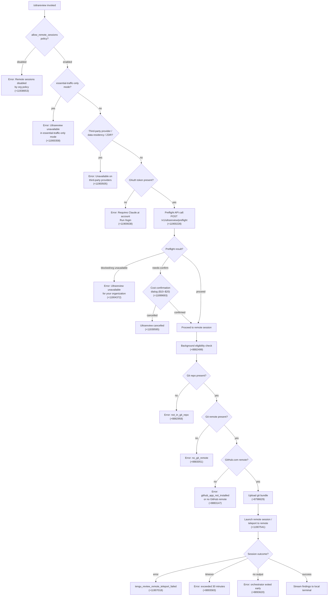

# `/ultrareview`

> Analysis basis: CC v2.1.154 bundle.js (AST extraction + Claude interpretation)
> Minimum version: v2.1.154

---

## Overview

`/ultrareview` is an alias for `/code-review ultra` that finds and verifies bugs in the current git branch by launching a remote Claude Code session running in the cloud (Claude.ai web). It performs a deep, multi-phase preflight check covering organization policy, authentication, git repository state, and GitHub connectivity before dispatching the review to a remote agent, then streams findings back to the local terminal.

---

## Registration

| Field | Value |
|---|---|
| type | `local-jsx` |
| name | `ultrareview` |
| description | `Alias of /code-review ultra · ... · Est. cost ... USD · Finds and verifies bugs in your branch. Runs in Claude Code on the web. See ...` |
| loc_byte | `11940961` |
| loc_byte_end | `11941252` |
| loc_line | `8797` |
| module_id | `aB1` |
| load_inline | `true` |
| arbor_handler.name | `NK5` |
| arbor_handler.fqn | `claude-2.1.154::NK5` |
| arbor_handler.kind | `AsyncFunction` |
| arbor_handler.resolution_path | `module_id` |
| arbor_handler.n_hits | `1` |

Analysis basis: CC v2.1.154 bundle.js:+11940961

---

## Input Branching

The command involves 8+ distinct decision branches across policy checks, auth checks, git environment checks, and session lifecycle. A flowchart is used.



---

## Behavioral Spec

### 1. Entry Point and Policy Gate

The handler `NK5` (AsyncFunction, module `aB1`) is invoked when the user runs `/ultrareview`.

```
async function ultrareviewHandler(context):
    # Check org policy: allow_remote_sessions (+11938619)
    if policy("allow_remote_sessions") == false:
        emit_random_delay()  # Math.random * 2, setTimeout (+13408200, +13408237)
        raise Error("Remote sessions are disabled by your organization's policy. Contact your organization admin to enable them.")
        emit telemetry: tengu_review_overage_blocked (+11938951)
        return
    
    # Parse flags from user input
    flags = parseCommandFlags(context.input)  # CB1 (+11938818)
    # Recognized flags: --fix, --comment, /code-review ultra alias (+11901844)
    if flags.contains("fix"):
        set fix_mode = true
    
    # Load preflight data
    preflightResult = runPreflight(context)  # se_ (+11938833)
    if preflightResult fails:
        return
    
    # Load remote session config
    sessionConfig = buildRemoteSession(context, flags, preflightResult)  # te_ (+11938913)
    
    # Launch session
    outcome = launchRemoteAgent(sessionConfig)  # vK5 (+11939507)
    
    if outcome == cancelled:
        display("Ultrareview cancelled.")  # (+11939595)
    
    # Cleanup
    runCleanup()  # ae_ (+11939573)
```

Analysis basis: CC v2.1.154 bundle.js:+11938616

---

### 2. Preflight Checks (`se_`)

`se_` orchestrates all local and remote preflight validations before a session can be dispatched.

```
async function runPreflight(context):
    # Step 1: Fetch session config (eP8 +11901876)
    sessionContext = fetchSessionContext()
    
    # Step 2: Check network / traffic mode
    trafficMode = getTrafficMode()  # (+969195, +969254)
    if trafficMode == "essential-traffic-only":
        raise "Ultrareview unavailable in essential-traffic-only mode"  # (+11900358)
    
    # Step 3: Check provider / data residency
    providerTag = getProviderTag()
    if providerTag == "zdr" or providerTag == "data-residency":
        raise "Ultrareview unavailable on third-party providers"  # (+11900505)
    
    # Step 4: OAuth token check
    oauthToken = getOAuthToken()  # C6 (+11902033)
    if not oauthToken:
        raise "Ultrareview requires a Claude.ai account. Run /login to authenticate."  # (+11900638)
        record reason = "no-auth" / "no_oauth_token"  # (+11900617, +11900710)
    
    # Step 5: Remote preflight API call
    response = httpPost("/v1/ultrareview/preflight", timeout=5000)  # (+11900228, +11900285)
    # Teleport-org header included  # (+11900262)
    
    preflightStatus = parse(response)  # hB1 (+11904130)
    
    if preflightStatus == "blocked":
        record telemetry("api_ultrareview_preflight", reason="blocked")  # (+11900849)
        raise "Ultrareview is unavailable for your organization."  # (+11904372)
    
    if preflightStatus == "schema_mismatch":
        record telemetry reason = "schema_mismatch"  # (+11900877)
        raise error
    
    if preflightStatus == "request_failed":
        record telemetry reason = "request_failed"  # (+11901038)
        raise error
    
    if preflightStatus == "needs-confirm":
        # Show cost confirmation dialog  # (+11904534)
        # Estimated cost: $10–$20, duration: ~10–20 min  # (+11899693, +11899785)
        confirmed = awaitUserConfirmation()
        tengu: tengu_review_overage_dialog_shown  # (+11939288)
        if not confirmed:
            return cancelled
    
    # Determine branch info
    currentBranch = getGitBranch()        # BD (+11903197), --abbrev-ref HEAD (+1070912)
    defaultBranch = getDefaultBranch()    # ON (+11903176), symbolic-ref (+1071084)
    mergeBase = findMergeBase()           # merge-base git call (+11903231)
    diffStat = getDiffShortstat()         # diff --shortstat (+11903738, +11903745)
    
    # Precondition telemetry
    if precondition fails:
        tengu: tengu_review_remote_precondition_failed  # (+11901891)
    
    return preflightResult
```

Analysis basis: CC v2.1.154 bundle.js:+11901876

---

### 3. Remote Eligibility Check (`W11` / background check)

```
async function checkRemoteEligibility(context):
    # Policy: allow_remote_sessions  # (+8882477 "policy_blocked")
    if policy blocked:
        record "policy_blocked"
        return ineligible
    
    # Authentication state
    if not logged_in:
        record "not_logged_in"  # (+8882616)
        display "Please run /login and sign in with your Claude.ai account (not Console)."  # (+8884365)
        return ineligible
    
    # BYOC check
    if isBYOC():
        record "byoc"  # (+8882802)
        return ineligible
    
    # Git repository check  # eP8 (+8882938)
    inGitRepo = checkGitWorkTree()   # git rev-parse --is-inside-work-tree (+8768237, +8768249)
    if not inGitRepo:
        record "not_in_git_repo"
        return ineligible
    
    # Git remote check  # BS (+8882583)
    remoteUrl = getRemoteUrl()   # git config --get remote.origin.url (+1062346, +1062354)
    if not remoteUrl:
        record "no_git_remote"  # (+8883051)
        display "Background tasks require a GitHub remote. Add one with `git remote add origin REPO_URL`."  # (+8884604)
        return ineligible
    
    # GitHub.com check
    if not remoteUrl.includes("github.com"):  # (+8883090)
        record "github_app_not_installed"  # (+8883147)
        return ineligible
    
    tengu: tengu_ccr_bundle_seed_enabled  # (+8882894)
    return eligible
```

Analysis basis: CC v2.1.154 bundle.js:+8882429

---

### 4. Git Bundle Upload (`yU_`)

```
async function uploadGitBundle(context):
    tengu: tengu_ccr_bundle_upload  # (+8798629)
    
    # Check repo has commits
    refCount = gitForEachRef("--count=1", "refs/")  # (+8798539, +8798554, +8798566)
    if refCount == 0:
        raise "Repository has no commits yet"  # (+8798743)
    
    # Create stash for upload
    stashRef = gitStashCreate()  # git stash create (+8798821, +8798829)
    if stash fails:
        record "stash_failed"  # (+8799267)
    
    # Determine bundle size limit
    tengu: tengu_ccr_bundle_max_bytes  # (+8795252)
    maxBytes = checkRepoSize()   # git count-objects -v (+8795337, +8795353), limit 5000000 bytes (+8795778)
    
    # Create bundle file
    bundleFile = createBundleFile("ccr-seed.bundle")  # (+8799624, +8799635)
    
    # Attempt upload strategies in order:
    for strategy in ["head", "fallback_head", "squashed", "fallback_squashed"]:  # (+8800285..+8800402)
        result = attemptBundleUpload(bundleFile, strategy)
        if result == "success":  # (+8800221)
            return result
    
    # Cleanup seed bundle file  # itH.unlink (+8800560)
    cleanupBundleFile("_source_seed.bundle")  # (+8799927)
    
    if all attempts failed:
        record "upload_failed"  # (+8800072)
        raise error
    
    return uploadResult
```

Analysis basis: CC v2.1.154 bundle.js:+8798307

---

### 5. Remote Session Launch (`Ml` / teleportToRemote)

```
async function teleportToRemote(context, bundleResult, flags):
    # Determine bundle mode
    tengu: tengu_teleport_bundle_mode  # (+8813983)
    bundleMode = determineBundleMode()
    # Modes: "too_large", "bundle", "explicit_env_bundle", "git_repository"  # (+8813909..+8814135)
    
    # Determine source decision
    tengu: tengu_teleport_source_decision  # (+8819128)
    
    # Setup request headers
    headers = {
        "anthropic-beta": "ccr-byoc-2025-07-29",  # (+8813573)
        "x-organization-uuid": orgUuid,            # (+8813595)
        "Content-Type": "application/json",        # (+3153352)
        "anthropic-version": "2023-06-01"          # (+3153406)
    }
    
    # List available environments  # ua (+8815475)
    tengu: teleport_environments_list  # (+8766290)
    environments = fetchEnvironments(timeout=15000)  # (+8766805)
    
    # If no environments exist, auto-create default cloud env  # QtH (+8815510)
    if environments empty:
        tengu: teleport_default_environment_create  # (+8767090)
        defaultEnv = createDefaultCloudEnv()
        # Default env: anthropic_cloud, python 3.11, node 20  # (+8767553..+8767599)
        if creation fails:
            raise "Could not create a cloud environment. Set one up at https://claude.ai/code/onboarding?magic=env-setup"  # (+8815687)
    
    # GitHub preflight  # oyH (+8817717)
    githubPreflightStatus = checkGithubAppInstalled()
    tengu: (tengu_review_remote_teleport_failed on error)  # (+11907018)
    
    # Create remote session
    sessionResponse = httpPost(remoteSessionEndpoint)  # c_.post (+8814815)
    # Expected status: 201  # (+8814907)
    # On 401/403/429: error  # (+8814975, +8814979, +8814983)
    
    # Validate session ID  # (+8815332)
    if not sessionResponse.session_id:
        raise "Server returned a malformed session response (no session id)"
    
    tengu: tengu_ccr_session_link  # (+8808384)
    
    # If --fix mode: inject fix instruction into task  # (+11938354)
    if fix_mode:
        append to task: " The user passed --fix: when the findings arrive, apply them to the local working tree."
    
    # Monitor session  # MhH (+11907403), E11 (+8889778)
    monitorRemoteSession(sessionId)
    # Poll interval: 1000ms, max duration: 1800000ms (30 min)  # (+8890934, +8890941)
    
    return sessionResult
```

Analysis basis: CC v2.1.154 bundle.js:+8812755

---

### 6. Remote Session Monitoring (`E11`)

```
async function monitorRemoteSession(sessionId):
    # Session states: pending → starting → running → completed/archived/error
    # (+12949175, +8892968, +8889364, +8891460, +8891385)
    
    poll every 1000ms for up to 1800000ms:  # (+8890934, +8890941)
        status = fetchSessionStatus(sessionId)
        
        switch status:
            case "running":
                streamProgressToTerminal()
            case "completed":
                extractResult()    # result field (+8891948)
                streamFindingsToLocal()
                break
            case "archived":
                raise "remote session returned an error"  # (+8893542)
            case timeout (>30 min):
                raise "remote session exceeded 30 minutes"  # (+8893583)
    
    if no review output received:
        raise "no review output — orchestrator may have exited early"  # (+8893620)
    
    # Hook lifecycle events tracked:
    # hook_progress, hook_response, hook_started, SessionStart  # (+8892131..+8892741)
```

Analysis basis: CC v2.1.154 bundle.js:+8889778

---

### 7. Task Title Generation (`iGL`)

```
async function generateRemoteTaskTitle(description):
    # Max title length: 75 characters  # (+8801624)
    # Task type: "claude/task"  # (+8801630)
    # Uses {description} template placeholder  # (+8801666)
    # Schema: json_schema with "title" field  # (+8801750, +8801854)
    tengu: teleport_generate_title  # (+8801928)
    return generatedTitle
```

Analysis basis: CC v2.1.154 bundle.js:+8801619

---

### 8. Flag Parsing (`cN8` / `CB1`)

```
function parseCommandFlags(rawInput):
    trimmed = rawInput.trim()
    parts = trimmed.split()
    
    recognized = {}
    for part in parts:
        cleaned = part.replace(escapePattern)  # IS (+11901578), replace "\\$&" (+192290)
        
        if cleaned == "fix":      # (+11901759)
            recognized.fix = true
        if cleaned == "comment":  # (+11901765)
            recognized.comment = true
    
    # Check if invoked as "/code-review ultra" alias
    if rawInput.includes("/code-review ultra"):  # (+11901844)
        recognized.alias = true
    
    # pr mode detection
    if rawInput.includes("pr"):  # (+11902593)
        recognized.prMode = true
    
    return recognized
```

Analysis basis: CC v2.1.154 bundle.js:+11901752

---

## State & Side Effects

| Item | Detail |
|---|---|
| Telemetry: tengu_bg_spare_enable | Fired when background spare process is enabled (+15477937) |
| Telemetry: tengu_bg_spare_spawn | Fired when background spare process is spawned (+15478297) |
| Telemetry: tengu_review_remote_precondition_failed | Fired when any preflight precondition fails (+11901891) |
| Telemetry: tengu_ccr_bundle_max_bytes | Fired to record bundle size ceiling check (+8795252) |
| Telemetry: tengu_daemon_config_reload | Fired on daemon configuration reload (+15493092) |
| Telemetry: tengu_feature_sad | Fired on feature degradation/error path (+965311) |
| Telemetry: tengu_feature_ok | Fired on feature success path (+965176) |
| Telemetry: tengu_review_bughunter_config | Fired when bughunter configuration is loaded (+11899576) |
| Telemetry: tengu_review_overage_blocked | Fired when overage/policy blocks the review (+11938951) |
| Telemetry: tengu_review_overage_dialog_shown | Fired when cost confirmation dialog is displayed (+11939288) |
| Telemetry: tengu_ccr_bundle_seed_enabled | Fired when seed bundle strategy is selected (+8882894) |
| Telemetry: tengu_ccr_bundle_upload | Fired at bundle upload start (+8798629) |
| Telemetry: tengu_teleport_bundle_mode | Fired to record which bundle mode was selected (+8813983) |
| Telemetry: tengu_ccr_session_link | Fired when remote session link is established (+8808384) |
| Telemetry: tengu_teleport_source_decision | Fired to record source repository decision (+8819128) |
| Telemetry: tengu_review_remote_teleport_failed | Fired when remote teleport fails (+11907018) |
| Telemetry: tengu_review_remote_launched | Fired on successful remote session launch (+11907541) |
| Filesystem | Creates temporary git bundle file (`ccr-seed.bundle`, `_source_seed.bundle`); cleaned up after upload (+8799624, +8799635, +8799927) |
| Filesystem | Cleans up via `itH.unlink` (+8800560), `PEK.unlinkSync` (+15456916) |
| Git operations | Reads: `rev-parse`, `config --get remote.origin.url`, `symbolic-ref`, `--abbrev-ref HEAD`, `merge-base`, `diff --shortstat`, `count-objects -v`, `for-each-ref`, `stash create` |
| Network | `POST /v1/ultrareview/preflight` (timeout 5000ms) (+11900228, +11900285) |
| Network | Environments list, session create, session status polling |
| Network | Headers include `anthropic-beta: ccr-byoc-2025-07-29`, `x-organization-uuid` (+8813573, +8813595) |
| appState | Remote session state tracked: `pending → starting → running → completed/archived` |
| Polling | 1000ms interval, 1800000ms (30 min) maximum (+8890934, +8890941) |
| Cost estimate | Displayed as `$10–$20` (+11899693); duration estimate `~10–20 min` (+11899785) |
| Admin URL | Admin settings link formed with `/admin-settings/` prefix (+11939073) |
| Sound | Not observed in depth-2 traversal |

---

## Version History

| Version | Change |
|---|---|
| v2.1.154 | Initial analysis; `ultrareview` registered as `local-jsx` alias for `/code-review ultra`; handler `NK5` resolved via module `aB1`; full preflight, bundle upload, and remote session lifecycle documented |

---

## Common Mistakes

1. **Running `/ultrareview` without a Claude.ai OAuth session.** The command explicitly requires OAuth authentication (not an API key). API key users will receive the error "Claude Code web sessions require authentication with a Claude.ai account" (+8766374). Run `/login` first.

2. **Running in a repository without a GitHub.com remote.** The eligibility check verifies that `remote.origin.url` contains `github.com`. Non-GitHub remotes (GitLab, Bitbucket, GHES without special handling) trigger a `no_git_remote` or `github_app_not_installed` failure (+8883051, +8883147).

3. **Running in a repository with no commits.** The bundle upload step validates that the repo has at least one ref. An empty repository will fail with "Repository has no commits — run `git add . && git commit -m \"initial\"` then retry" (+8818565).

4. **Expecting instant results.** The remote session can run for up to 30 minutes (+8890941). The local terminal streams progress but the review is executed remotely; do not interrupt the process.

5. **Using `/ultrareview` in an organization with `allow_remote_sessions` disabled.** Org policy is checked first; the command cannot proceed without policy approval. Contact the org admin to enable remote sessions (+11938619, +11938653).

6. **Using `/ultrareview` in essential-traffic-only mode or with a data-residency / ZDR provider.** The command runs on Anthropic's cloud infrastructure and is incompatible with these network modes (+11900322, +11900358, +11900477, +11900505).

7. **Confusing the `--fix` flag behavior.** Passing `--fix` instructs the remote agent to apply findings to the local working tree after the review completes (+11938354). This modifies local files automatically; review the changes before committing.

---

## Appendix — Identifier Mapping

> For bundle debugging only. Identifiers change across versions.

| Identifier | Role |
|---|---|
| `NK5` | Main handler (AsyncFunction) for `/ultrareview`; entry point resolved via module `aB1` |
| `v9` | Remote eligibility precondition checker (policy / auth / git / remote checks) |
| `H89` | Precondition sub-check orchestrator |
| `iD6` | Individual eligibility check runner |
| `CR` | Auth/session-type classifier (firstParty, enterprise, team checks) |
| `nD6` | File-based config reader (readFileSync, utf-8 encoding) |
| `I4H` | Feature flag / inclusion list checker |
| `q1` | Telemetry mode resolver |
| `zEA` | Traffic-mode string resolver |
| `xH` | String conversion utility |
| `VKH` | String formatter helper |
| `CB1` | Command-line flag parser (fix, comment, pr flags) |
| `cN8` | Flag tokenizer (trim, split, replace) |
| `IS` | Escape-replacement utility |
| `se_` | Full preflight orchestrator (auth, network, API preflight, git info) |
| `eP8` | Session context fetcher (git rev-parse, work-tree check) |
| `C6` | OAuth/auth token accessor |
| `YB6` | AsyncLocalStorage-based session store reader |
| `$_` | Auth state resolver |
| `W_` | Remote session connection manager (ZGH-based) |
| `ZGH` | WebSocket/SSE connection factory |
| `D` | Background spare process manager (freemem, setTimeout, spawn) |
| `gA4` | String builder for connection URLs |
| `hH` | Error logger / diagnostics pusher |
| `BS` | Git remote URL fetcher (`git config --get remote.origin.url`) |
| `Nb` | Remote URL cache retriever |
| `fr8` | B9H cache getter for `remoteUrl` key |
| `$pH` | URL credential scrubber (`://***@` replacement) |
| `et` | Git URL parser / type detector (https, ssh) |
| `FNA` | Git URL scheme splitter |
| `K9` | Substring extractor (indexOf/slice) |
| `p91` | Repository size / git count-objects checker |
| `m91` | Git count-objects executor |
| `u91` | Remote session provisioning caller |
| `E6` | Cloud environment state manager |
| `V8` | Session configuration builder |
| `Y` | Supervisor/daemon config reload handler |
| `E2H` | File-not-found (ENOENT) error handler for supervisor |
| `o9` | AsyncLocalStorage store reader for session context |
| `S_A` | Supervisor startup helper |
| `ZH` | String coercion wrapper |
| `Lt1` | Terminal column width calculator |
| `T` | Remote control / keyboard event handler |
| `Z0` | User-settings accessor |
| `E` | MCP server instance manager (stop/updateConfig/start) |
| `QEK` | Heartbeat scheduler |
| `ON` | Default branch resolver (`git symbolic-ref --short refs/remotes/origin/HEAD`) |
| `Mr8` | B9H cache getter for `defaultBranch` key |
| `BD` | Current branch resolver (`git branch --abbrev-ref HEAD`) |
| `Kr8` | B9H cache getter for `branch` key |
| `O` | Background session state display handler |
| `k8` | "stopped" / "background session" state label |
| `te_` | Remote session config builder (bughunter config, preflight result) |
| `hB1` | Preflight API response parser (`/v1/ultrareview/preflight`) |
| `m6` | JSON.parse wrapper |
| `re_` | Preflight response normalizer |
| `t6` | Feature-ok telemetry emitter |
| `yH` | Feature-sad / error telemetry emitter |
| `FRH` | Bughunter config accessor |
| `b86` | Configuration store reader (bughunter / review config) |
| `GeH` | Admin settings URL builder (`/admin-settings/`) |
| `WZ` | URL base resolver |
| `EzH` | Subscription-type / eligibility classifier |
| `b7` | Account type and subscription resolver |
| `TY` | API key vs. OAuth credential discriminator |
| `b6` | Session token and timestamp recorder |
| `EA` | User role/tier classifier (max, pro, admin, billing, owner) |
| `HR` | Array-based inclusion checker |
| `mb` | Role-to-permission mapper |
| `K1` | Permission set builder |
| `SA_` | Role hierarchy resolver |
| `hA_` | Permission inheritance helper |
| `ks` | Bughunter config loader |
| `vK5` | Main review flow dispatcher |
| `ee_` | Remote review execution engine (main loop) |
| `fXH` | Review pre-launch preparation |
| `W11` | Background eligibility multi-check runner |
| `_5H` | Review progress display component |
| `IB1` | Cost/duration estimation display |
| `Ml` | `teleportToRemote` — full remote session lifecycle manager |
| `WO` | MCP update / protocol message formatter |
| `bU_` | Permission-mode setter for remote task |
| `pb` | Session object builder |
| `Sq` | OAuth URL validator (local/staging/prod check) |
| `jX` | HTTP request builder with auth headers |
| `yU_` | Git bundle uploader (`teleport_git_bundle_upload`) |
| `k6` | Process/env variable reader |
| `B91` | Control-request event builder (set_permission_mode) |
| `RH` | JSON.stringify wrapper |
| `U91` | Session-link recorder |
| `ua` | Environment list fetcher (`teleport_environments_list`) |
| `QtH` | Default cloud environment creator (`teleport_default_environment_create`) |
| `iGL` | Remote task title generator (`teleport_generate_title`) |
| `ky` | Session-available / provisioning-state checker |
| `oyH` | GitHub App installation checker |
| `J9` | Diff content extractor (Ce, e9, $X components) |
| `d` | gh8-based feature data accessor |
| `F_` | Error message formatter |
| `LP` | Cancellation handler |
| `OY` | Axios error detail extractor |
| `MhH` | Remote agent session monitor (polling loop) |
| `Sk` | Session ID generator (randomBytes) |
| `utH` | Session open/status initializer |
| `J2` | Session timestamp recorder |
| `kTL` | Progress string builder |
| `E11` | Session polling engine (status checks, result extraction) |
| `MXH` | Session cleanup / teardown handler |
| `Ow` | Output stream flusher |
| `VK5` | Findings result mapper |
| `ae_` | Post-review cleanup / cancellation finalizer |

---

Note: index built via Arbor fallback; some signals (telemetry, literals) may be missing — see arbor-fallback.js.