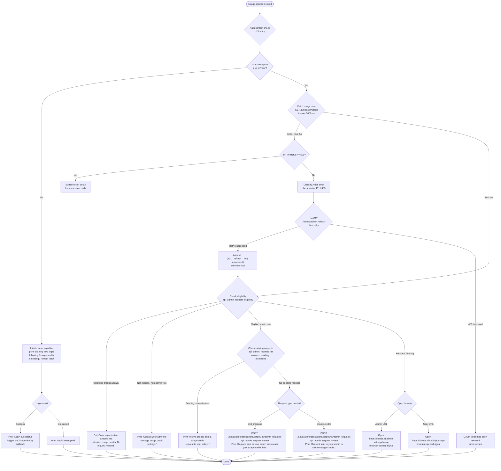

# `/usage-credits`

> Analysis basis: CC v2.1.154 bundle.js (AST extraction + Claude interpretation)
> Minimum version: v2.1.154

---

## Overview

`/usage-credits` is an interactive command that helps users configure usage credits to continue working when they have hit a usage limit on their Claude account. It communicates with the Anthropic API to check eligibility, list existing admin requests, and create new admin requests for credit limit increases or activation — and for users on personal plans it falls back to opening a browser to the claude.ai usage settings page.

---

## Registration

| Field | Value |
|---|---|
| type | `local-jsx` |
| name | `usage-credits` |
| description | `Configure usage credits to keep working when you hit a limit` |
| loc_byte | `9127759` |
| loc_byte_end | `9127969` |
| loc_line | `4033` |
| module_id | `$F_` |
| load_inline | `true` |
| arbor_handler.name | `uZ6` |
| arbor_handler.fqn | `claude-2.1.154::uZ6` |
| arbor_handler.kind | `AsyncFunction` |
| arbor_handler.resolution_path | `module_id` |
| arbor_handler.n_hits | `0` |

Analysis basis: CC v2.1.154 bundle.js:+9127759

---

## Input Branching

The command has six or more distinct execution branches depending on account type, subscription status, existing requests, and plan eligibility. A Mermaid flowchart is used below.



Analysis basis: CC v2.1.154 bundle.js:+9126180 (handler entry), +9126342 (main orchestration function fW8), +9126447 (login message literal), +9079761 (API endpoint), +9081797 (browser URL)

---

## Behavioral Spec

### 1. Handler Entry — Account Plan Gate

The async handler `uZ6` (arbor-resolved, module_id path) is invoked when the user types `/usage-credits`.

```
async function usageCreditsHandler(context):
    plan = getAccountPlan(context)          // checks 'pro' / 'max' literals
    if plan not in ['pro', 'max']:
        emit telemetry event 'tengu_ember_latch'
        print "Starting new login following /usage-credits. Exit with Ctrl-C to use existing account."
        loginResult = await performLoginFlow(context)   // calls WZ
        if loginResult.success:
            print "Login successful"
            triggerOnChangeAPIKeyCallback()             // _.onChangeAPIKey
        else:
            print "Login interrupted"
        return
    await runUsageCreditOrchestration(context)          // fW8
```

Analysis basis: CC v2.1.154 bundle.js:+9126180, +9126191 (`"pro"`), +9126202 (`"max"`), +9126227 (telemetry), +9126447 (login message), +9126549 (`_.onChangeAPIKey`)

---

### 2. Usage Data Fetch

```
async function fetchUsageData(httpClient, authToken):
    response = await httpClient.get(
        "/api/oauth/usage",
        timeout = 5000,                         // ms
        headers = {
            "Content-Type": "application/json"
        },
        authMode = "no-auth"                    // passes token manually
    )
    return response
```

- Endpoint: `/api/oauth/usage` (bundle.js:+9079761)
- Timeout: 5000 ms (bundle.js:+9079789)
- On 401: token refresh is attempted; on success a `" (401→refresh→retry succeeded)"` suffix is appended to the log entry (bundle.js:+9080004)
- On 403 with revoked message: surfaces `"OAuth token has been revoked"` (bundle.js:+2979401)

Analysis basis: CC v2.1.154 bundle.js:+9079761, +9079789, +9080004

---

### 3. Eligibility Check

```
function checkEligibility(usageData, userRole):
    if usageData.unlimitedCredits == true:
        return { action: "already_unlimited",
                 message: "Your organization already has unlimited usage credits. No request needed." }

    if userRole not in ['admin', 'billing', 'owner', 'primary_owner']:
        return { action: "contact_admin",
                 message: "Contact your admin to manage usage credit settings." }

    // Check for teleport-org special handling
    if orgType == "teleport-org":
        handleTeleportOrg()

    return { action: "eligible", requestType: determineRequestType(usageData) }
```

- Role constants: `"admin"`, `"billing"`, `"owner"`, `"primary_owner"` (bundle.js:+2049793–+2049819)
- Unlimited message literal (bundle.js:+9080797)
- Contact-admin message literal (bundle.js:+9080956)
- Eligibility endpoint key: `"api_admin_request_eligibility"` (bundle.js:+9079264)

Analysis basis: CC v2.1.154 bundle.js:+9079264, +9080797, +9080956, +2049793

---

### 4. Existing Request Check

```
async function checkExistingRequests(orgUUID, httpClient):
    response = await httpClient.get(
        listRequestsEndpoint,
        params = { statuses: ["pending", "dismissed"] }
    )
    existing = response.data
    pendingRequest = existing.find(r => r.status == "pending")
    if pendingRequest:
        return { alreadySent: true,
                 message: "You've already sent a usage credit request to your admin." }
    return { alreadySent: false, existingList: existing }
```

- Endpoint key: `"api_admin_request_list"` (bundle.js:+9078913)
- Status filter: `"pending"`, `"dismissed"` (bundle.js:+9081122, +9081132)
- Already-sent message (bundle.js:+9081191)

Analysis basis: CC v2.1.154 bundle.js:+9078913, +9081122, +9081132, +9081191

---

### 5. Admin Request Creation

```
async function createAdminRequest(orgUUID, requestType, httpClient):
    payload = buildRequestPayload(requestType)     // type: 'limit_increase' or enable
    response = await httpClient.post(
        "/api/oauth/organizations/:orgUUID/admin_requests",
        body = payload
    )
    if requestType == "limit_increase":
        print "Request sent to your admin to increase your usage credit limit."
    else:
        print "Request sent to your admin to turn on usage credits."
    return response
```

- Endpoint template: `"/api/oauth/organizations/:orgUUID/admin_requests"` (bundle.js:+9078705)
- Endpoint key: `"api_admin_request_create"` (bundle.js:+9078648)
- Request type constant: `"limit_increase"` (bundle.js:+9080892)
- Success messages (bundle.js:+9081430, +9081496)

Analysis basis: CC v2.1.154 bundle.js:+9078648, +9078705, +9080892, +9081430, +9081496

---

### 6. Error Handling — HTTP Errors

```
function handleHttpError(error):
    if isAxiosError(error):
        status = error.response.status
        if status >= 500:
            detail = error.response.data.detail
            surfaceError(detail)
            return
        if status == 401:
            attemptTokenRefresh()
            return
        if status == 403:
            surfaceError("OAuth token has been revoked")
            return
    // Generic error path
    surfaceError(error.message)
```

- HTTP 500 threshold: `500` (bundle.js:+9080207)
- HTTP 401 handling (bundle.js:+2979307)
- HTTP 403 handling (bundle.js:+2979335)
- `"detail"` field key (bundle.js:+9080413)

Analysis basis: CC v2.1.154 bundle.js:+9080207, +9080413, +2979307, +2979335

---

### 7. Browser Fallback (Personal Plan)

```
function openBrowserForUsageSettings(isAdmin):
    if isAdmin:
        url = "https://claude.ai/admin-settings/usage"
    else:
        url = "https://claude.ai/settings/usage"
    openBrowser(url)                // platform-aware: darwin→open, win32→rundll32, linux→xdg-open
    emit signal "browser-opened"
```

- Admin URL (bundle.js:+9081797)
- User URL (bundle.js:+9081838)
- `"browser-opened"` signal (bundle.js:+9081905)
- Platform detection strings: `"darwin"`, `"win32"` (bundle.js:+6590902, +6590918)
- Commands: `"open"` (macOS), `"rundll32"` / `"url,OpenURL"` (Windows), `"xdg-open"` (Linux) (bundle.js:+6591002, +6591014, +6591076, +6591083)

Analysis basis: CC v2.1.154 bundle.js:+9081797, +9081838, +9081905, +6590902

---

### 8. Authentication Context Resolution

The handler resolves the auth context via a shared credential-checking subsystem before taking any action. It checks for:

- `ANTHROPIC_API_KEY` environment variable (bundle.js:+2945727)
- `CLAUDE_CODE_OAUTH_TOKEN_FILE_DESCRIPTOR` (bundle.js:+2065692)
- `CLAUDE_CODE_API_KEY_FILE_DESCRIPTOR` (bundle.js:+2065835)
- WIF environment variables (`ANTHROPIC_FEDERATION_RULE_ID` + `ANTHROPIC_ORGANIZATION_ID`) — referenced in the composite error message at bundle.js:+2946155

Provider type detection distinguishes: `"bedrock"`, `"foundry"`, `"anthropicAws"`, `"mantle"`, `"vertex"`, `"firstParty"` (bundle.js:+2044343–+2044560).

Profile type: `"profile-implicit"` is the default flow (bundle.js:+2942699); `"user_oauth"` is the OAuth path (bundle.js:+2942772).

Analysis basis: CC v2.1.154 bundle.js:+2945727, +2065692, +2065835, +2946155, +2044343

---

## State & Side Effects

| Item | Detail |
|---|---|
| Telemetry | `tengu_ember_latch` (emitted when re-login is triggered, bundle.js:+9126227); `tengu_feature_ok` (feature flag gate success, bundle.js:+965176); `tengu_feature_bad` (feature flag gate failure, bundle.js:+965234) |
| API calls | `GET /api/oauth/usage` (usage data); eligibility check endpoint; `GET` existing admin requests; `POST /api/oauth/organizations/:orgUUID/admin_requests` (create request) |
| Token refresh | 401 responses trigger an OAuth token refresh cycle before retrying the failed request |
| Browser side effect | Opens system browser to `https://claude.ai/admin-settings/usage` or `https://claude.ai/settings/usage` depending on role; emits `"browser-opened"` signal |
| Login flow | If plan is not `pro` or `max`, a fresh login is initiated and `_.onChangeAPIKey` callback is invoked on success |
| Growthbook experiment | `$z_` path emits `"growthbook_experiment"` / `"GrowthbookExperimentEvent"` (bundle.js:+3181221, +3181648) for feature flag evaluation |
| appState changes | `onChangeAPIKey` callback is triggered after a successful re-login (bundle.js:+9126549) |
| Sound | <!-- TODO: not found in depth-2 traversal; needs --depth 4 --> |

---

## Version History

| Version | Change |
|---|---|
| v2.1.154 | Initial analysis |

---

## Common Mistakes

1. **Invoking on a non-OAuth / non-pro account**: The command silently redirects to a full re-login flow instead of displaying credit options. Users expecting a settings UI will instead be prompted to log in again.
2. **Expecting instant credit activation**: The command only *sends a request* to the organization admin. The admin must approve before credits are activated — the confirmation messages (e.g. `"Request sent to your admin…"`) do not mean credits are immediately available.
3. **Confusing the two success messages**: `"…to increase your usage credit limit."` means credits were already on but the limit was low; `"…to turn on usage credits."` means credits were entirely disabled. These are distinct request types (`limit_increase` vs. a generic enable).
4. **Running as a non-admin team/enterprise member**: Users with roles other than `admin`, `billing`, `owner`, or `primary_owner` will see `"Contact your admin to manage usage credit settings."` and no request will be sent.
5. **Network timeout**: The `/api/oauth/usage` call has a hard 5000 ms timeout. On slow connections this may fail before any eligibility check is performed.
6. **Already-unlimited organizations**: If the organization already has unlimited usage credits, the command exits immediately with an informational message and takes no further action.

---

## Appendix — Identifier Mapping

> For bundle debugging only. Identifiers change across versions.

| Identifier | Role |
|---|---|
| `uZ6` | Main async handler for `/usage-credits` (arbor-resolved entry point) |
| `K1` | Auth context / credential resolution helper |
| `SA_` | Sub-helper called from credential resolution (role unclear at depth 2) |
| `hA_` | Sub-helper called from credential resolution (role unclear at depth 2) |
| `TY` | Auth profile construction / provider detection |
| `lK` | String normalization / encoding utility |
| `xH` | Low-level string construction primitive |
| `bP` | OAuth profile builder / flag settings assembler |
| `Ii6` | Sub-helper in profile building (calls jQ) |
| `kgH` | String helper used in profile and CO6 paths |
| `ki` | OAuth token file descriptor reader |
| `pN` | HTTP header / auth header builder |
| `HR` | Array inclusion check utility |
| `PO` | Provider type classifier (bedrock / foundry / vertex etc.) |
| `GA` | Provider string mapper |
| `oJ` | Utility called during auth profile construction |
| `u$` | Credential validation / API key resolution orchestrator |
| `SO6` | Sub-step in credential validation |
| `GxH` | VSCode client-type check (`"claude-vscode"`) |
| `lf6` | API key file descriptor reader |
| `b6` | Session / token storage writer |
| `_R` | Array slice utility (last-20 items) |
| `CO6` | Alternate credential path invoking kgH |
| `WZ` | Login flow initiator (called on non-pro/max plan) |
| `E6` | Experiment/feature flag evaluation engine |
| `hz6` | Sub-step in feature flag evaluation |
| `Sz6` | Sub-step in feature flag evaluation |
| `Mx` | Feature flag HTTP client wrapper |
| `fx` | HTTP fetch wrapper for feature flags |
| `wR` | Low-level HTTP request executor |
| `y88` | Growthbook experiment assignment resolver |
| `$z_` | Growthbook experiment event emitter |
| `yEH` | Experiment variant resolver |
| `KU` | Token/session generator (uses randomBytes, 32 bytes, hex) |
| `RH` | JSON stringifier wrapper |
| `m97` | Experiment metadata builder |
| `wz_` | Experiment cache/dedup layer |
| `mIq` | Background task helper in experiment dedup |
| `i_` | Promise utility in experiment path |
| `vBq` | Sub-utility in experiment dedup |
| `Z3H` | Set membership check (baK.has) |
| `EzH` | Subscription type resolver |
| `b7` | Subscription type sub-resolver |
| `EA` | Subscription list / HR-check wrapper |
| `q1` | Network traffic class resolver (`"essential-traffic"`, `"no-telemetry"`, `"default"`) |
| `zEA` | Traffic-class string builder |
| `fW8` | Main orchestration function: eligibility, requests, browser |
| `mb` | Role eligibility checker (admin / billing / owner / primary_owner) |
| `WXH` | Usage data fetch + 401-retry orchestrator |
| `j1` | HTTP client factory / request builder |
| `_` | Low-level config accessor |
| `yH` | Config getter variant |
| `uH` | Config getter variant |
| `fV` | Response type validator |
| `H` | Retry delay / jitter utility (Math.random + setTimeout) |
| `iG` | Axios error classifier (401 / 403 / revoked-token detector) |
| `Bp` | Token cache manager (C3\_ map: get / delete / set) |
| `N` | HTTP request executor with auth header injection |
| `URK` | URL builder / request composer |
| `v4` | Path normalization utility |
| `HuH` | Header sanitization helper |
| `gRK` | File-based request writer (Buffer.byteLength, mb6 pipe) |
| `z71` | Admin request eligibility fetcher (`api_admin_request_eligibility`) |
| `O71` | Admin request list fetcher (`api_admin_request_list`) |
| `A` | FormData / append helper |
| `f` | Stream close utility |
| `$71` | Admin request creator (`api_admin_request_create`, POST) |
| `D71` | HTTP error handler (Axios error, status >= 500) |
| `OY` | Request type selector (`limit_increase` vs. enable) |
| `ZH` | String coercion wrapper |
| `hH` | Result printer / message display |
| `F_` | Error string formatter |
| `D84` | Message queue manager (LB6 shift/push) |
| `wK` | Browser launcher (platform detection + open/rundll32/xdg-open) |
| `Yn7` | URL scheme validator (`http:` / `https:`) |
| `xD` | Sub-utility in browser launch |
| `V8` | Process spawner for browser open |
| `W_` | Child process wrapper with timeout (1 000 000 ms max) |
| `C6` | Process result collector |

---

Note: index built via Arbor fallback; some signals (telemetry, literals) may be missing — see arbor-fallback.js.