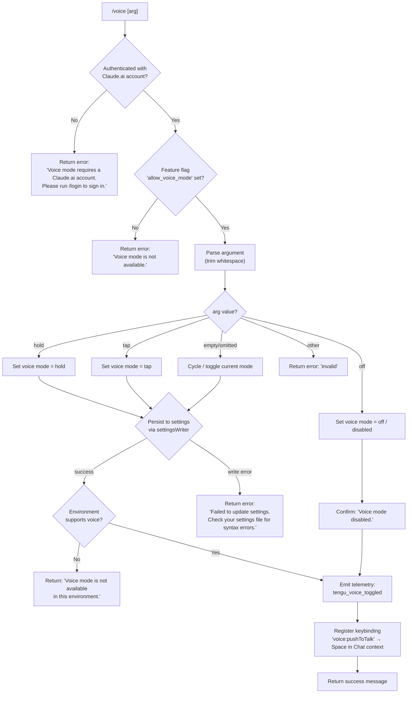

# `/voice`

> Analysis basis: CC v2.1.156 bundle.js (AST extraction + Claude interpretation)
> Minimum version: v2.1.156

---

## Overview

The `/voice` command toggles voice input mode in Claude Code, supporting three sub-modes: `hold` (push-to-talk), `tap` (toggle-on/toggle-off), and `off` (disabled). It validates account eligibility and feature availability before persisting the new mode to settings, and registers a default keybinding (`Space` in the `Chat` context) for the `voice:pushToTalk` action.

---

## Registration

| Field | Value |
|---|---|
| type | `local` |
| name | `voice` |
| description | `Toggle voice mode` |
| argumentHint | `[hold\|tap\|off]` |
| supportsNonInteractive | `false` |
| isHidden | `null` |
| module_id | `pt1` |
| load_inline | `true` |
| loc_byte | `12660452` |
| loc_byte_end | `12660694` |
| loc_line | `9777` |
| arbor_handler.name | `MY5` |
| arbor_handler.fqn | `claude-2.1.156::MY5` |
| arbor_handler.kind | `AsyncFunction` |
| arbor_handler.resolution_path | `module_id` |
| arbor_handler.n_hits | `1` |

Analysis basis: CC v2.1.156 bundle.js:+12660452

---

## Input Branching

The command has 5+ distinct top-level branches (auth check, feature flag check, argument parsing, mode application, and environment guard), so a Mermaid flowchart is used.



Analysis basis: CC v2.1.156 bundle.js:+12657906, +12657934, +12657947, +12658046, +12658084, +12658131, +12658198, +12658267, +12658365, +12658446, +12658503, +12658747

---

## Behavioral Spec

### 1. Authentication Check

```
async function voiceCommandHandler(args, context):
    authInfo = await getAuthStatus(context)         // calls TY → lK, bP
    if authInfo.type == "text" or authInfo is unauthenticated:
        return errorResult(
            "Voice mode requires a Claude.ai account. " +
            "Please run /login to sign in."
        )
```

The handler first resolves the current authentication state. When the result type is `"text"` (unauthenticated or non-OAuth session), it returns an error string immediately without proceeding.

Analysis basis: CC v2.1.156 bundle.js:+12657917, +12657934, +12657947

---

### 2. Feature Flag Check

```
    featureEnabled = checkFeatureFlag("allow_voice_mode", authInfo)   // calls B_A → v9
    if not featureEnabled:
        return errorResult("Voice mode is not available.")
```

The flag `"allow_voice_mode"` is evaluated against the resolved account context. If the account does not have the flag set, the command exits early.

Analysis basis: CC v2.1.156 bundle.js:+12648389, +12648445, +12658046

---

### 3. Argument Parsing

```
    rawArg = args.trim()                               // calls fY5 → H.trim
    mode   = parseVoiceMode(rawArg)
    // valid values: "hold", "tap", "off"
    // empty string → cycle/toggle logic
    // anything else → mode = "invalid"
```

The argument hint is `[hold|tap|off]`. Whitespace is trimmed before matching. Unrecognised values map to `"invalid"` and produce an error response.

Analysis basis: CC v2.1.156 bundle.js:+12657776, +12657823, +12657835, +12657846, +12657867, +12658131, +12658198

---

### 4. Settings Persistence

```
    if mode == "off":
        writeResult = await settingsWriter(
            { voiceMode: null },
            context
        )
        if writeResult.error:
            return errorResult(
                "Failed to update settings. " +
                "Check your settings file for syntax errors."
            )
        return confirmResult("Voice mode disabled.")

    elif mode == "invalid":
        return errorResult("invalid")

    else:  // "hold" or "tap" or cycle
        writeResult = await settingsWriter(
            { voiceMode: mode },
            context
        )                                              // calls U_ → tB6, $L6, RH
        if writeResult.error:
            return errorResult(
                "Failed to update settings. " +
                "Check your settings file for syntax errors."
            )
```

Settings are written to disk via the settings-writer subsystem (`U_`), which uses path helpers and atomic-write primitives (`$L6` → `pM.openSync`, `pM.writeFileSync`, `pM.fsyncSync`, `q.renameSync`).

Analysis basis: CC v2.1.156 bundle.js:+12658267, +12658365, +12658503, +1227590, +1011812, +1011936, +1012064

---

### 5. Environment Availability Guard

```
    environmentOk = checkVoiceEnvironment()            // calls ZX → Uq8 → DD6
    if not environmentOk:
        return infoResult(
            "Voice mode is not available in this environment."
        )
```

After the settings write succeeds, a second runtime check verifies the host environment supports microphone access. The message `"System Settings → Privacy & Security → Microphone"` is also present in the literal pool, indicating that on macOS the command may surface a guidance hint about granting microphone permissions.

Analysis basis: CC v2.1.156 bundle.js:+12659713, +12658747, +12659254

---

### 6. Keybinding Registration

```
    registerDefaultKeybinding(
        action  = "voice:pushToTalk",
        context = "Chat",
        key     = "Space"
    )                                                  // calls ZX → keybinding loader
```

The `voice:pushToTalk` action is registered with the `Space` key in the `Chat` context. This uses the keybinding subsystem (`ZX → Uq8 → DD6 → LJ_, fJ_`) which reads `keybindings.json`, validates the `"bindings"` array structure, and merges the default.

Analysis basis: CC v2.1.156 bundle.js:+12659716, +12659735, +12659742

---

### 7. Telemetry Emission

```
    emitTelemetry("tengu_voice_toggled", {
        mode: mode,
        // additional context fields from d(...)
    })                                                 // calls MY5 → d at +12658446
```

Analysis basis: CC v2.1.156 bundle.js:+12658446, +12658448

---

### 8. MCP Refresh on Mode Change (side-effect)

```
    if voiceModeChanged:
        await applyMcpUpdate(context)                  // calls MY5 → M → vSH → JGK
```

When voice mode is toggled, the handler triggers an MCP configuration refresh cycle (`M → vSH → JGK → H.applyMcpUpdate`). This ensures MCP-connected subsystems observe the new mode state.

Analysis basis: CC v2.1.156 bundle.js:+12659022, +15181200, +15181488

---

## State & Side Effects

| Item | Detail |
|---|---|
| Telemetry | `tengu_voice_toggled` (bundle.js:+12658448); `tengu_feature_ok` (bundle.js:+965176); `tengu_feature_sad` (bundle.js:+965311); `tengu_feature_bad` (bundle.js:+965234); `tengu_custom_keybindings_loaded` (bundle.js:+3800029); `tengu_keybinding_fallback_used` (bundle.js:+3809062) |
| Settings write | Persists `voiceMode` field to user settings JSON via atomic rename; reads back settings layers (flagSettings, policySettings, userSettings, projectSettings, localSettings) |
| Keybinding registration | Registers `voice:pushToTalk` → `Space` in `Chat` context via `keybindings.json` subsystem |
| MCP refresh | Triggers `applyMcpUpdate` cycle when mode changes |
| Microphone permission hint | On macOS, may surface guidance: `"System Settings → Privacy & Security → Microphone"` (bundle.js:+12659254) |
| appState changes | `voiceMode` field updated in persisted settings |
| Sound | <!-- TODO: not found in depth-2 traversal; needs --depth 4 --> |

---

## Version History

| Version | Change |
|---|---|
| v2.1.156 | Initial analysis |

---

## Common Mistakes

1. **Running `/voice` without a Claude.ai login.** The command requires OAuth authentication; API-key-only sessions receive the "Please run /login to sign in" error immediately.
2. **Passing an unrecognised argument.** Only `hold`, `tap`, and `off` are valid tokens. Any other string (including `on`, `yes`) is classified as `"invalid"` and returns an error.
3. **Broken `settings.json` syntax.** If the user's settings file contains a JSON parse error before `/voice` is run, the settings writer will fail and return "Check your settings file for syntax errors."
4. **Using voice mode in unsupported environments.** Even with a valid account and feature flag, the environment guard may block activation and print "Voice mode is not available in this environment."
5. **Expecting immediate keybinding effect.** The `Space` push-to-talk binding is registered as part of the command flow; if the terminal or host intercepts `Space` globally the binding will not fire as expected.

---

## Appendix — Identifier Mapping

> For bundle debugging only. Identifiers change across versions.

| Identifier | Role |
|---|---|
| `MY5` | Main async handler for `/voice` command (arbor_handler) |
| `V_6` | Voice-mode eligibility resolver (auth + feature flag chain entry) |
| `U_A` | Authentication state unwrapper |
| `TY` | Authentication context builder |
| `lK` | Low-level auth token reader |
| `bP` | Auth profile resolver (profile-implicit / user_oauth) |
| `PO` | First-party auth check |
| `u$` | API key / OAuth credential validator |
| `CO6` | Config accessor helper |
| `kgH` | Config key getter |
| `RZ` | Auth result wrapper |
| `B_A` | Feature flag evaluator for `allow_voice_mode` |
| `v9` | Feature flag lookup with Set cache (`BX7`) |
| `H89` | Feature flag sub-resolver |
| `CR` | Feature configuration reader |
| `q1` | Network traffic classifier (`essential-traffic`) |
| `VKH` | Flag value coercion helper |
| `iD6` | Feature flag detail fetcher |
| `i_` | Settings-load orchestrator |
| `vp` | Settings load from disk (primary entry) |
| `gE` | Settings cache retriever |
| `T9` | Performance mark emitter (`loadSettingsFromDisk_start`) |
| `Kp` | `perf_hooks` module loader |
| `Bo8` | Settings load execution core |
| `I8` | Settings log writer (`settings_load_started`) |
| `iR6` | Settings layer initialiser |
| `oL6` | Flag-settings loader |
| `zyA` | Settings merge/aggregation helper |
| `K$H` | Settings path builder (userSettings, projectSettings, localSettings) |
| `ng` | Settings file watcher registrar |
| `MyA` | SDK inline settings merger |
| `ig` | Settings object constructor |
| `$_` | Settings change event emitter |
| `aL6` | WSL-aware settings path resolver |
| `nR6` | Settings reload debouncer |
| `fY5` | Argument trimmer / voice-mode token parser |
| `H` | Random/timer utility (also string manipulation context) |
| `U_` | Settings writer (persists voice mode to disk) |
| `wO` | Settings writer path resolver |
| `Uo8` | Settings writer merge helper |
| `zP` | Git-ignore aware file path checker |
| `Mi` | File reader with encoding detection (UTF-8/UTF-16) |
| `m3` | File stat + realpath resolver |
| `N` | Settings value normaliser |
| `DB6` | Settings read-back helper |
| `wB6` | Settings post-processor |
| `P8` | ENOENT error classifier |
| `J8` | Error code extractor |
| `mr8` | Settings write timestamp recorder |
| `mGH` | Settings write path helper |
| `nF6` | Settings path resolver (PN.resolve / dirname) |
| `$L6` | Atomic file writer (open→write→fsync→rename) |
| `O` | Symbolic-link stat helper |
| `RH` | JSON serialiser wrapper |
| `Xz` | Cache-clear helper (`lR6`, `Hu8`) |
| `tB6` | Git-ignore rule writer |
| `C6` | Async-local-storage config accessor |
| `YB6` | Config store getter |
| `Tr8` | Settings write transaction helper |
| `sB6` | Git check-ignore runner |
| `W_` | Git command executor |
| `Pq4` | Git global excludesfile path resolver |
| `oNA` | Git ls-files tracker |
| `hb` | `.claude/settings.json` path builder |
| `yH` | Telemetry `tengu_feature_ok` emitter |
| `d` | Core telemetry dispatcher |
| `t6` | Telemetry `tengu_feature_sad` emitter |
| `uH` | Telemetry `tengu_feature_bad` emitter |
| `hH` | Error-queue push + log helper |
| `F_` | Error string formatter |
| `xH` | String coercion utility |
| `D84` | Circular error-log buffer manager |
| `M` | MCP state manager (applyMcpUpdate entry) |
| `vSH` | MCP connection orchestrator |
| `v8H` | MCP server connection dispatcher |
| `hP6` | MCP server option builder |
| `U7H` | MCP server connector (stdio/sse/http) |
| `vc` | MCP SDK server connector |
| `hM8` | MCP connection error coloriser |
| `yP6` | MCP server state tracker (sse/http) |
| `Pk` | MCP permission gate |
| `GO` | MCP permission evaluator |
| `Mk_` | MCP permission record builder |
| `H_` | MCP tool list helper |
| `nV6` | MCP tool name formatter |
| `BpL` | MCP needs-auth cache loader |
| `pl_` | MCP cache path builder |
| `kM8` | MCP cache key builder |
| `IM8` | MCP cache entry writer |
| `CX` | SHA-256 hash helper |
| `NM8` | MCP cache entry reader |
| `oK` | MCP capability checker |
| `L8` | MCP debug logger |
| `pc_` | MCP server connection runner |
| `yuL` | MCP OAuth tool injector |
| `lg` | MCP logger (Vp + uK) |
| `jAH` | MCP OAuth flow handler (full OAuth PKCE + callback server) |
| `hH6` | MCP in-flight request tracker |
| `D` | Background spare session manager |
| `gT8` | MCP needs-auth cache path accessor |
| `Tl` | MCP reconnect loop |
| `Vp` | MCP verbose logger |
| `Y` | MCP supervisor writer |
| `dL` | MCP error logger |
| `ZH` | String coercion + error wrapper |
| `huL` | MCP connection timeout helper |
| `IuL` | MCP SSH environment detector |
| `Uc_` | MCP complete-authentication tool handler |
| `yH6` | MCP in-progress auth state getter |
| `SH6` | MCP cached auth state getter |
| `j21` | MCP needs-auth cache writer |
| `o9` | Async-local-storage getter (`Fj7`) |
| `DZ8` | MCP cache path joiner |
| `mc_` | MCP message sender |
| `Ak_` | MCP server type classifier |
| `O8` | Global config reader / saver |
| `j` | Background process list helper |
| `y` | Background session writer |
| `O21` | MCP protocol version negotiator |
| `zo` | Async-iterator / protocol-pump utility |
| `iV6` | MCP integer parser (tools count) |
| `Ul_` | MCP integer parser (resources count) |
| `JGK` | MCP apply-connection-result handler |
| `wZ8` | MCP connection hash builder |
| `OrH` | MCP config hash serialiser |
| `ok` | MCP slot cleanup dispatcher |
| `dH6` | MCP connection hash reader |
| `$` | Background session state machine |
| `bo1` | Daemon status writer |
| `Si` | Session initialiser |
| `MI6` | Daemon status path builder |
| `Gm5` | MCP config diff + refresh orchestrator |
| `SM8` | MCP server active-connection checker |
| `Q8` | MCP abort-controller wrapper |
| `ZX` | Keybinding loader + `voice:pushToTalk` registration |
| `Uq8` | Keybinding file reader |
| `DD6` | Keybinding parser and validator |
| `MJ_` | Keybinding block structure validator |
| `kU` | Keybinding error formatter |
| `w4H` | Keybinding file path builder (`keybindings.json`) |
| `m6` | JSON.parse wrapper |
| `uq8` | Keybinding array shape validator |
| `Cq8` | Keybinding entry extractor |
| `Saq` | Keybinding load telemetry emitter |
| `LJ_` | Keybinding duplicate-key detector |
| `fJ_` | Keybinding action registrar |
| `Bq8` | Keybinding default-binding merger |
| `DJ_` | Default keybinding table builder |
| `YJ_` | Push-to-talk default entry builder |
| `tHH` | Keybinding map transformer |
| `YxH` | Locale/language detector (`en`) |
| `b6` | Global config watcher |
| `vz_` | Config path validator |
| `bzH` | Config file reader with backup |
| `kb` | Config key prefix stripper |
| `UBq` | Config backup directory scanner |
| `Sz_` | Config backup path builder |
| `w` | Daemon background-session dispatcher |
| `R` | Background session runner |
| `eI8` | macOS memory monitor |
| `FD6` | Daemon file-based notification reader |
| `B` | Background session pool manager |
| `E6` | Session event emitter |
| `W5A` | Daemon socket connector |
| `N5A` | Background session lifecycle manager |
| `S` | Session state holder |
| `Y17` | Config file watcher registrar |
| `Mr` | Config change merge helper |
| `_9` | File-change registration helper (`f$A.register`) |