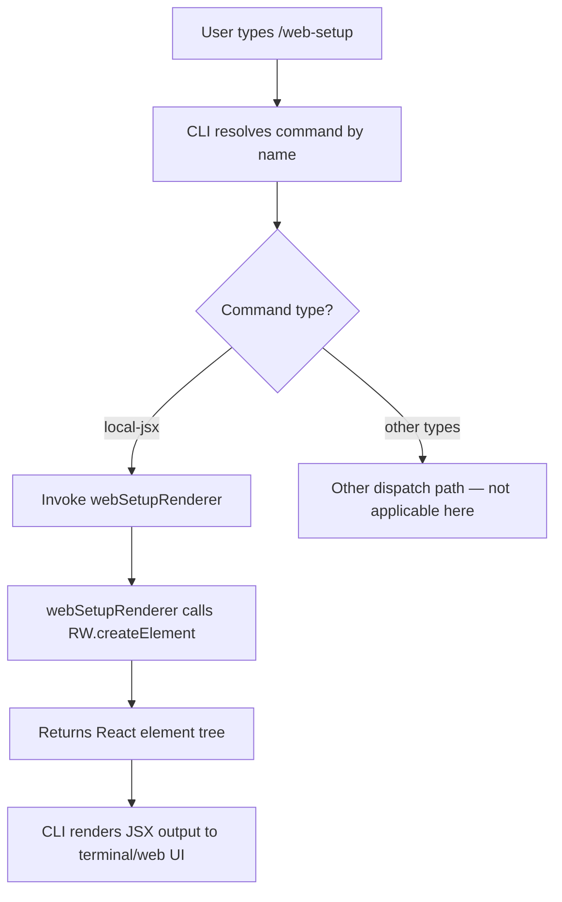

# `/web-setup`

> Analysis basis: CC v2.1.143 bundle.js (AST extraction + Claude interpretation)
> Minimum version: v2.1.143

---

## Overview

The `/web-setup` command initiates the process of connecting Claude Code to a web environment by guiding the user through GitHub account integration. It is implemented as a local JSX command, meaning its output is rendered directly as a React element tree rather than as plain text. The command's primary mechanism is the invocation of a JSX render function that produces the setup UI component.

---

## Registration

| Field | Value |
|---|---|
| type | `local-jsx` |
| name | `web-setup` |
| description | `Setup Claude Code on the web (requires connecting your GitHub account)` |
| module_id | `dvq` |

Analysis basis: CC v2.1.143 bundle.js:+11943586

---

## Input Branching

The depth-2 call-graph traversal for this command yielded a single call edge: the render function (`webSetupRenderer`) calls `RW.createElement` to produce its JSX output. No conditional branch literals, argument-dependent paths, or multi-step sub-command logic were found within the traversal depth.



Analysis basis: CC v2.1.143 bundle.js:+11943362 (createElement call edge), +11943586 (type: local-jsx)

---

## Behavioral Spec

### Web Setup Renderer

The sole implementation unit discovered at depth ≤ 2 is the render function responsible for producing the command's visual output.

```
function webSetupRenderer(props):
    element = createReactElement(
        componentType  = <SetupUIComponent>,   // resolved via RW.createElement
        componentProps = props
    )
    return element
```

- The function does not perform any detected branching based on input arguments within the traversal depth.
- No string literals, numeric constants, or configuration values were extracted from the implementation at depth ≤ 2.
- No telemetry events are fired within the traversal boundary (see State & Side Effects).
- Because the command type is `local-jsx`, the returned element is handled by the CLI's JSX rendering pipeline rather than printed as raw text.

Analysis basis: CC v2.1.143 bundle.js:+11943362

<!-- TODO: The internal structure of the SetupUIComponent (sub-components, GitHub OAuth flow steps, error handling, success state) was not reachable within depth-2 traversal; needs --depth 4 -->

<!-- TODO: Any argument or flag parsing logic for /web-setup was not found in depth-2 traversal; needs --depth 4 -->

---

## State & Side Effects

| Item | Detail |
|---|---|
| Telemetry | No `tengu_*` events detected within depth-2 traversal |
| Hook registration | <!-- TODO: not found in depth-2 traversal; needs --depth 4 --> |
| appState changes | <!-- TODO: not found in depth-2 traversal; needs --depth 4 --> |
| Sound | <!-- TODO: not found in depth-2 traversal; needs --depth 4 --> |
| GitHub OAuth flow | <!-- TODO: not found in depth-2 traversal; needs --depth 4 --> |
| Network side effects | <!-- TODO: not found in depth-2 traversal; needs --depth 4 --> |

---

## Version History

| Version | Change |
|---|---|
| v2.1.143 | Initial analysis — command registered as `local-jsx`, single render function confirmed, GitHub account connection noted in description |

---

## Common Mistakes

1. **Running `/web-setup` in a purely offline or local-only environment** — the command description explicitly states it requires connecting a GitHub account, implying network access is necessary for the setup flow to complete successfully.
2. **Expecting plain-text output** — because the command type is `local-jsx`, the output is a rendered React component tree. Tooling or scripts that intercept raw CLI text output may not capture the full interaction surface.
3. **Assuming the command is idempotent without verification** — whether re-running `/web-setup` on an already-connected account is safe or produces side effects is <!-- TODO: not found in depth-2 traversal; needs --depth 4 -->.
4. **Confusing `/web-setup` with other setup commands** — this command is specifically scoped to the web integration path (GitHub); local project setup or authentication commands are separate.

---

## Appendix — Identifier Mapping

> For bundle debugging only. Identifiers change across versions.

| Identifier | Role |
|---|---|
| `ob7` | Web setup render function — the top-level `local-jsx` handler for the `/web-setup` command; calls `RW.createElement` to produce its output |