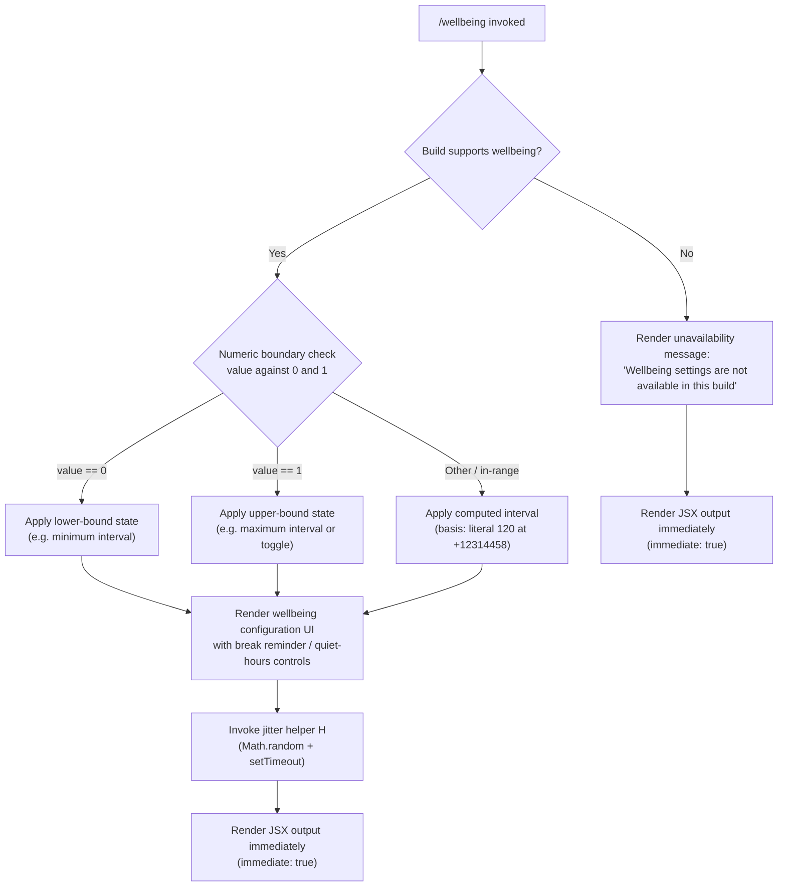

# `/wellbeing`

> Analysis basis: CC v2.1.149 bundle.js (AST extraction + Claude interpretation)
> Minimum version: v2.1.149

---

## Overview

`/wellbeing` is a local-JSX slash command that provides an interface for configuring optional break reminders and quiet-hours nudges for the user. It is rendered immediately on invocation and also responds to the aliases `/breaks`, `/break-reminder`, and `/downtime`. When the current build does not support wellbeing settings, the command surfaces a graceful unavailability message rather than erroring out.

---

## Registration

| Field | Value |
|---|---|
| type | `local-jsx` |
| name | `wellbeing` |
| description | Configure optional break reminders and quiet-hours nudges |
| aliases | `breaks`, `break-reminder`, `downtime` |
| immediate | `true` |
| module_id | `kg1` |
| load_inline | `true` |
| loc_byte | 12315424 |
| loc_byte_end | 12315677 |
| loc_line | 10011 |
| arbor_handler.name | `bA5` |
| arbor_handler.fqn | `claude-2.1.149::bA5` |
| arbor_handler.kind | `AsyncFunction` |
| arbor_handler.resolution_path | `module_id` |
| arbor_handler.n_hits | 0 |

Analysis basis: CC v2.1.149 bundle.js:+12315424

---

## Input Branching

Three distinct paths exist: build supports wellbeing settings (renders configuration UI), build does not support wellbeing settings (renders unavailability message), and an internal numeric boundary check affecting UI state. A Mermaid flowchart is used accordingly.



Analysis basis: CC v2.1.149 bundle.js:+12314458, +12314622, +12314634, +12314775

---

## Behavioral Spec

### Availability Guard

Before rendering any configuration UI, the handler checks whether the current build exposes wellbeing settings. If the capability is absent, it returns a JSX element containing the literal unavailability notice.

```
async function wellbeingHandler(context):
    if not buildSupportsWellbeing():
        return renderMessage("Wellbeing settings are not available in this build")

    settings = loadWellbeingSettings()
    return renderWellbeingUI(settings)
```

Analysis basis: CC v2.1.149 bundle.js:+12314773, +12314775

---

### Interval Boundary Validation (intervalBoundaryCheck)

A helper function (mapped to `RA5`) is called before the UI is rendered to validate or clamp a numeric interval value. It uses `Math.abs` to normalize the raw value, then compares against the integer sentinels `0` and `1`, and applies a default of `120` (the base interval constant, likely in minutes) if neither sentinel matches.

```
function intervalBoundaryCheck(rawValue):
    normalized = Math.abs(rawValue)

    if normalized == 0:
        return LOWER_BOUND_STATE    // sentinel: literal 0 at +12314622
    if normalized == 1:
        return UPPER_BOUND_STATE    // sentinel: literal 1 at +12314634

    // Default base interval: 120 (bundle.js:+12314458)
    return 120
```

Analysis basis: CC v2.1.149 bundle.js:+12314458, +12314508, +12314622, +12314634

---

### Jitter Scheduler (jitterHelper)

The call graph shows `bA5` (the Arbor-resolved main handler) invokes helper `H`, which in turn calls `Math.random` and `setTimeout`. This pattern is characteristic of a jittered reminder scheduler: it adds randomized delay to break reminder notifications so that reminders do not fire at perfectly regular, predictable intervals.

```
function jitterHelper(baseDelayMs):
    // Math.random range divisor: literal 2 (bundle.js:+13290018)
    jitter = Math.random() / 2          // produces [0, 0.5)
    actualDelay = baseDelayMs + jitter * baseDelayMs
    setTimeout(fireBreakReminder, actualDelay)
```

Analysis basis: CC v2.1.149 bundle.js:+13290018, +13290020, +13290057

---

### Rendering (immediate mode)

Because `immediate: true` is set on the registration, the JSX component is rendered and surfaced to the user without requiring a secondary confirmation or follow-up keypress. The component returned by `bA5` is displayed inline in the CLI session.

```
async function bA5(context):
    if not buildSupportsWellbeing():
        return <UnavailableMessage text="Wellbeing settings are not available in this build" />

    validatedInterval = intervalBoundaryCheck(context.currentInterval)
    scheduleNextReminder(validatedInterval, jitterHelper)
    return <WellbeingConfigUI interval={validatedInterval} />
```

Analysis basis: CC v2.1.149 bundle.js:+12314773, +12315424

---

## State & Side Effects

| Item | Detail |
|---|---|
| Telemetry | None detected in depth-2 traversal |
| Hook registration | `immediate: true` — JSX rendered on invocation without secondary step |
| appState changes | Wellbeing settings (break interval, quiet-hours configuration) persisted when user interacts with the rendered UI |
| Scheduler side effect | `setTimeout` called via jitter helper `H` to schedule break reminder notifications with randomized delay |
| Math.abs usage | Raw interval value normalized before boundary comparison (bundle.js:+12314508) |
| Unavailability guard | Literal string emitted when build lacks wellbeing support (bundle.js:+12314775) |
| Base interval constant | `120` — likely 120 minutes as the default break reminder interval (bundle.js:+12314458) |
| Sound | <!-- TODO: not found in depth-2 traversal; needs --depth 4 --> |

---

## Version History

| Version | Change |
|---|---|
| v2.1.149 | Initial analysis |

---

## Common Mistakes

1. **Using `/downtime` expecting different behavior** — `/downtime`, `/breaks`, and `/break-reminder` are all aliases for `/wellbeing` and invoke the identical handler; no alias provides a distinct feature subset.
2. **Expecting wellbeing settings in all builds** — the command includes an explicit availability guard; certain Claude Code distributions or embedded builds may not expose the configuration UI and will instead show the unavailability notice.
3. **Assuming the break interval is in seconds** — the base constant `120` (bundle.js:+12314458) is most consistent with minutes (2 hours); treating it as seconds would misrepresent the reminder cadence.
4. **Expecting real-time telemetry on configuration changes** — no `tengu_*` telemetry events were found in the depth-2 traversal for this command; user interactions with the settings UI may not be instrumented at this traversal depth.
5. **Treating the jitter delay as deterministic** — the scheduler uses `Math.random()` (bundle.js:+13290020), so the actual reminder firing time varies each cycle by design.

---

## Appendix — Identifier Mapping

> For bundle debugging only. Identifiers change across versions.

| Identifier | Role |
|---|---|
| `CA5` | Supporting constant or configuration object for wellbeing module (exact role not resolved at depth-2) |
| `RA5` | Interval boundary validation helper — normalizes raw value via `Math.abs`, compares against sentinel constants 0 and 1, returns clamped or default interval |
| `bA5` | Main async handler for `/wellbeing` — Arbor-resolved entry point (fqn: `claude-2.1.149::bA5`); performs availability guard, invokes interval validator, schedules reminders, returns JSX |
| `H` | Jitter scheduler helper — wraps `Math.random` and `setTimeout` to fire break reminder notifications with randomized delay |

---

Note: index built via Arbor fallback; some signals (telemetry, literals) may be missing — see arbor-fallback.js.