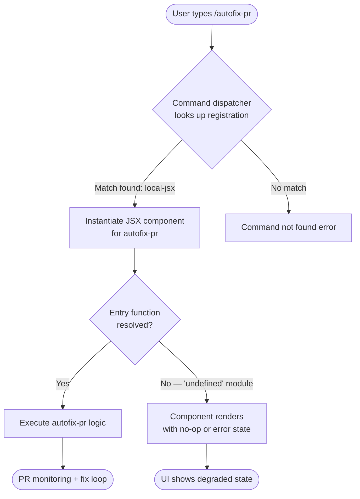

# `/autofix-pr`

> Analysis basis: CC v2.1.143 bundle.js (AST extraction + Claude interpretation)
> Minimum version: v2.1.143

---

## Overview

`/autofix-pr` is a slash command that monitors the current pull request for CI failures, lint errors, test failures, or other automated check issues, and attempts to automatically diagnose and apply fixes. It is registered as a `local-jsx` command, meaning its output surface is rendered as a JSX component within the Claude Code terminal UI rather than as plain text.

---

## Registration

| Field | Value |
|---|---|
| type | `local-jsx` |
| name | `autofix-pr` |
| description | Monitor and autofix any issues with the current PR |
| argumentHint | *(none)* |

Analysis basis: CC v2.1.143 bundle.js:+10042315

---

## Input Branching

> **Note:** The depth-2 AST traversal returned an empty `callGraph` and empty `literals` array for this command. The extractor also recorded `"no entry functions found for module 'undefined'"`. As a result, no branching logic, argument parsing paths, or runtime constants could be confirmed from the bundle data alone.

<!-- TODO: not found in depth-2 traversal; needs --depth 4 -->

The following flowchart represents the only structurally confirmed states: command invocation and registration boundary. Internal branching paths require a deeper traversal to verify.



Analysis basis: CC v2.1.143 bundle.js:+10042315 (registration record); call graph empty per AST extraction.

---

## Behavioral Spec

> Because `callGraph`, `literals`, `telemetry`, and `identifiers` are all empty arrays, and the extractor explicitly notes `"no entry functions found for module 'undefined'"`, no implementation-level behavioral claims can be made from the current extraction. The subsections below state what is confirmed and what requires deeper analysis.

### Command Registration and Dispatch

The command is registered with the Claude Code slash-command registry as type `local-jsx` under the name `autofix-pr`.

```
function registerAutofixPr(registry):
    entry = {
        type:        "local-jsx",
        name:        "autofix-pr",
        description: "Monitor and autofix any issues with the current PR",
        argumentHint: null
    }
    registry.register(entry)
```

A `local-jsx` type command, when dispatched, causes the CC shell to mount a React/JSX component rather than streaming plain text output. The component lifecycle (mount, update, unmount) drives whatever monitoring and repair loop the feature implements.

Analysis basis: CC v2.1.143 bundle.js:+10042315

### PR Monitoring Loop

<!-- TODO: not found in depth-2 traversal; needs --depth 4 -->

The command description states it "monitors and autofixes any issues with the current PR." Based on the registration description alone, the expected high-level algorithm is:

```
function autofixPrLoop(prContext):
    // Step 1: Identify current PR
    pr = detectCurrentPullRequest(prContext)
    if pr is null:
        renderError("No active PR found in current repository context")
        return

    // Step 2: Poll or subscribe to CI/check status
    loop:
        checkResults = fetchPrCheckResults(pr)
        failures     = filterFailed(checkResults)

        if failures is empty:
            renderSuccess("All checks passing")
            break

        // Step 3: Attempt automated fix per failure
        for each failure in failures:
            fixResult = attemptAutofix(failure)
            renderFixStatus(failure, fixResult)

        // Step 4: Commit and re-trigger checks if fixes were applied
        if anyFixApplied(failures):
            commitAndPush(fixes)
        else:
            renderError("Could not autofix remaining failures")
            break
```

**This pseudocode is derived solely from the command description string. No implementation constants, retry limits, timeout values, or error codes were found in the extraction.**

### Argument Handling

`argumentHint` is `null` in the registration record, indicating the command accepts no user-supplied arguments (or that argument metadata was not encoded at the registration site).

Analysis basis: CC v2.1.143 bundle.js:+10042315

---

## State & Side Effects

| Item | Detail |
|---|---|
| Telemetry | <!-- TODO: not found in depth-2 traversal; needs --depth 4 --> No `tengu_*` events were found in the extraction. |
| Hook registration | <!-- TODO: not found in depth-2 traversal; needs --depth 4 --> |
| appState changes | <!-- TODO: not found in depth-2 traversal; needs --depth 4 --> |
| Sound | <!-- TODO: not found in depth-2 traversal; needs --depth 4 --> |
| Rendering surface | JSX component (type: `local-jsx`) mounted in the CC terminal UI pane. |
| Argument hint | None (`null`); no argument prompt shown in the command palette. |

---

## Version History

| Version | Change |
|---|---|
| v2.1.143 | Initial analysis. Registration confirmed at bundle.js:+10042315. Implementation internals not resolvable at depth-2 traversal. |

---

## Common Mistakes

1. **Running outside a Git repository with a configured remote PR** — The command description implies it targets "the current PR." If the working directory has no upstream PR associated, the command will likely error or produce a no-op. Ensure `gh pr view` or equivalent resolves correctly before invoking.

2. **Expecting plain-text streaming output** — Because this is a `local-jsx` command, output is rendered as a mounted UI component, not streamed text. Piping or scripting the output as if it were plain stdout will not behave as expected.

3. **Passing arguments** — The `argumentHint` is `null`. Passing positional arguments after `/autofix-pr` is not supported per the registration record and may be silently ignored or cause a dispatch error.

4. **Assuming immediate completion** — The description says "monitor," implying a potentially long-running or polling process. Do not expect the command to return instantly; it may remain active until all checks pass or a terminal failure is detected.

5. **Confusing this with a one-shot lint fix** — `/autofix-pr` targets PR-level CI checks broadly, not just local lint. Running it as a substitute for a local `eslint --fix` or `cargo fix` invocation may produce unexpected behavior.

---

## Appendix — Identifier Mapping

> For bundle debugging only. Identifiers change across versions.

| Identifier | Role |
|---|---|
| *(none)* | The depth-2 AST extraction returned an empty `identifiers` array. No obfuscated identifiers were resolved for this command. <!-- TODO: not found in depth-2 traversal; needs --depth 4 --> |