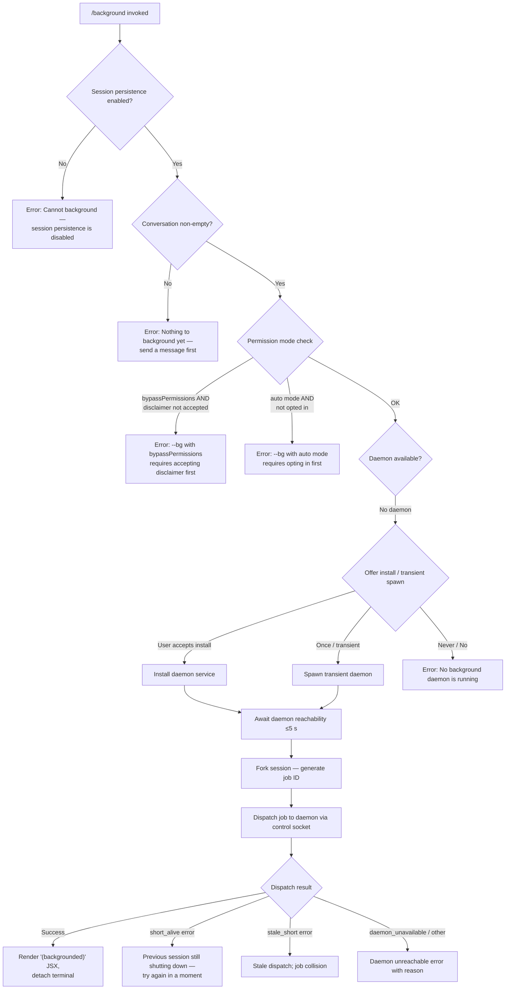

# `/background`

> Analysis basis: CC v2.1.157 bundle.js (AST extraction + Claude interpretation)
> Minimum version: v2.1.157

---

## Overview

`/background` (alias `/bg`) detaches the current interactive Claude Code session from the terminal and hands it off to the background daemon, freeing the controlling terminal for other use. The command validates preconditions (session persistence, daemon availability, permission mode), forks the session state, dispatches a background job via the daemon's control socket, and renders a confirmation JSX component in the terminal before detaching.

---

## Registration

| Field | Value |
|---|---|
| type | `local-jsx` |
| name | `background` |
| description | `Send this session to the background and free the terminal` |
| aliases | `["bg"]` |
| argumentHint | `[prompt]` |
| immediate | `null` |
| module_id | `n6K` |
| load_inline | `true` |
| loc_byte | `12784613` |
| loc_byte_end | `12784853` |
| loc_line | `9020` |
| arbor_handler.name | `Lj5` |
| arbor_handler.fqn | `claude-2.1.157::Lj5` |
| arbor_handler.kind | `AsyncFunction` |
| arbor_handler.resolution_path | `module_id` |
| arbor_handler.n_hits | `0` |

Analysis basis: CC v2.1.157 bundle.js:+12784613

---

## Input Branching

The command has more than three distinct execution paths depending on session state, persistence configuration, permission mode, and daemon availability.



Analysis basis: CC v2.1.157 bundle.js:+12783954 (handler `Lj5`), +12784035, +12784211, +12777449, +12777611

---

## Behavioral Spec

### 1. Handler Entry — `backgroundCommandHandler` (`Lj5`)

```
async function backgroundCommandHandler(context):
    sessionMode = getSessionMode(context)           // v9 call
    appState    = getAppState(context)              // d, H fields

    if not sessionPersistenceEnabled(appState):
        return errorJsx("Cannot background — session persistence is disabled, ...")
        // literal at +12784035

    if conversationIsEmpty(appState):
        return errorJsx("Nothing to background yet — send a message first.")
        // literal at +12784211

    renderUI = buildBackgroundUI(context)           // HfH, U2H calls
    return renderUI
```

Analysis basis: CC v2.1.157 bundle.js:+12783954

---

### 2. Permission Pre-flight — `permissionPreflight` (`Aj5`)

```
function permissionPreflight(argv, settings):
    // Check --dangerously-skip-permissions / bypassPermissions gate
    if argv contains "--dangerously-skip-permissions"
       or argv contains "--allow-dangerously-skip-permissions"
       or permissionMode == "bypassPermissions":
        if disclaimerNotAccepted(settings):
            throw "--bg with bypassPermissions requires accepting the disclaimer first. ..."
            // literal at +12777449

    // Check auto mode gate
    if permissionMode == "auto" and not optedIn(settings):
        throw "--bg with auto mode requires opting in first. ..."
        // literal at +12777611

    // Build forwarded argv, stripping separator "--"
    // literal "--" at +12777216
    // passes --permission-mode, --dangerously-skip-permissions, etc.
    return filteredArgv
```

Analysis basis: CC v2.1.157 bundle.js:+12777206, +12777249, +12777280, +12777312, +12777358

---

### 3. Daemon Acquisition — `ensureDaemonRunning` (`gF`)

```
async function ensureDaemonRunning(options):
    status = getDaemonStatus()   // "up" / "ask" / absent

    if status == "up":
        return daemonHandle

    if executableIsStale():
        emit telemetry("tengu_bg_daemon_service_stale_exec")
        // literal at +12720138: "daemon service exec path is stale"
        // fall back to transient spawn

    if mode == "ask":
        // Prompt: "Install as a service now? [y/N/never, or 'once' just for now]"
        // literal at +12727682
        answer = promptUser()
        emit telemetry("tengu_bg_daemon_cold_start_ask_answer")
        if answer in ["yes", "y"]:
            installDaemonService()
            emit telemetry("tengu_bg_daemon_install")
            awaitReachability(timeout=5000)   // literal at +12728213
            if not reachable:
                warn("service installed but the daemon did not become reachable within 5s")
                // literal at +12728241
        else if answer == "once":
            spawnTransient()
        else if answer == "never":
            persistNeverChoice()
        else:
            // "no" or empty
            throw "No background daemon is running. Run 'claude daemon install'..."
            // literal at +12721226

    if transientSpawnFailed:
        emit telemetry("tengu_bg_daemon_spawn_failed")

    return daemonHandle
```

Analysis basis: CC v2.1.157 bundle.js:+12720095, +12720138, +12720596, +12721161, +12721226, +12727682, +12728213

---

### 4. Session Fork & Job Dispatch — `forkAndDispatch` (`Dn` → `nw5` → `wqA`)

```
async function forkAndDispatch(sessionState, argv, daemonHandle):
    // Generate a unique job ID (8 hex chars)
    jobId = crypto.randomUUID().slice(0, 8)   // literal 8 at +12760362

    // Detect and forward resume / session-id / continue flags
    // literals: "--resume=", "-r=", "--resume", "-r" at +12776433..+12776544
    // literals: "--session-id=", "--session-id" at +12776787..+12776846
    // literals: "-c", "--continue" at +12760959..+12760969

    // Write daemon status file
    statusFile = joinPath(configDir, "daemon.status.json")   // literal at +12448301

    // Prepare tmp directory and dispatch file
    tmpDir = joinPath(jobsDir, "tmp")   // literals "jobs" at +4088582, "tmp" at +12760411
    IqH.mkdir(tmpDir, recursive=true)

    // Build child argv forwarding:
    //   --agent, --name / -n for job naming
    //   --allowed-tools, --disallowed-tools, --model, --effort
    //   --add-dir for additional directories
    //   --reply-on-resume flag
    //   AWS / GCP credential env vars: AWS_REGION, AWS_PROFILE,
    //     GOOGLE_APPLICATION_CREDENTIALS, GOOGLE_CLOUD_PROJECT, etc.
    //   literal: "--reply-on-resume" at +12780365
    //   literal: "--allowed-tools" at +12780452
    //   literal: "--disallowed-tools" at +12780493
    //   literal: "--model" at +12780524
    //   literal: "--effort" at +12780546
    //   literal: "--add-dir" at +12780417

    dispatchResult = dispatchToSocket(daemonHandle, jobPayload)
    // IPC via "cli-bg-dispatch" message type; literal at +12756034

    return dispatchResult
```

Analysis basis: CC v2.1.157 bundle.js:+12760330, +12760352, +12760390, +12760400, +12756034

---

### 5. Dispatch via Control Socket — `socketDispatch` (`wqA`)

```
async function socketDispatch(socketPath, payload, options):
    // Write dispatch file atomically (randomBytes + writeFile + rename)
    // B3 sub-routine: fK_.randomBytes(4), LHH.writeFile, LHH.rename
    // literals: 384 (0x180) mode at +12756757, 448 (0x1C0) at +12756834

    sock = openControlSocket(socketPath)   // gO call: Wv8.connect
    sendMessage(sock, "dispatch", payload)

    // Wait for ack with 6000 ms timeout
    // literal 6000 at +12756275

    response = await Promise.race([ackPromise, timeoutPromise])

    if response.code == "EALIVE":
        // literal at +12756377: prior dispatch still alive
        throw "a previous dispatch with this id is still being cleaned up — retry"

    if response.code == "ESTALE":
        // literal at +12756507
        handleStale()

    if timeout (no ack):
        emit telemetry("tengu_bg_dispatch_fallback")
        // literal "no ack" at +12756119

    emit telemetry("tengu_bg_dispatch")
    return response
```

Analysis basis: CC v2.1.157 bundle.js:+12756034, +12756130, +12756275, +12756377, +12756507, +12757888

---

### 6. Dispatch Error Classification — `classifyDispatchError` (`nw5` final block)

The dispatch result is mapped to a user-facing message:

| Internal code | User message |
|---|---|
| `not running` | Daemon not running |
| `timed out` | Dispatch timed out |
| `couldn't write dispatch file` | File write failure |
| `socket missing` | IPC socket absent |
| `service still starting` | Daemon not yet ready |
| `id collision with a prior job` | UUID collision |
| `short_alive` | "Previous session is still shutting down — try again in a moment" (literal +12764682) |
| `stale_short` | Stale short-lived session |
| `daemon_unavailable` | emit `tengu_background_spawn_failed` |

Analysis basis: CC v2.1.157 bundle.js:+12767033..+12767249, +12764620, +12764760, +12764897

---

### 7. Success Path — Detach and Render

```
function renderBackgroundSuccess(jobId, sessionName):
    // Render JSX with text "(backgrounded)"
    // literal "(backgrounded)" at +12781673

    emit telemetry("tengu_background")
    // Wait up to 120 s for terminal release
    // literal 120 at +12781443

    detachTerminal()
    // The daemon worker process now owns the PTY session
    // literal "daemon-worker" at +12780003... 
    // literal "background session" at +15502665
```

Analysis basis: CC v2.1.157 bundle.js:+12780989, +12781443, +12781673

---

### 8. Flush Timeout Guard — `flushTimeout` (`sL`)

Before detaching, a 2000 ms flush timeout ensures in-flight I/O drains:

```
async function flushWithTimeout(writeStream):
    timer = setTimeout(resolve, 2000)   // literal 2000 at +12780245
    result = await Promise.race([flushComplete, timer])
    clearTimeout(timer)
    // literal "flush timeout" at +12780250
    return result
```

Analysis basis: CC v2.1.157 bundle.js:+12780237, +12780245, +12780250

---

### 9. Already-Backgrounded Guard

If the session is already running as a background job, the command short-circuits:

```
if sessionIsAlreadyBackground(appState):
    emit telemetry("tengu_background_already_bg")
    return infoJsx("Session is already running in the background")
```

Analysis basis: CC v2.1.157 bundle.js:+12783968

---

## State & Side Effects

| Item | Detail |
|---|---|
| Telemetry: `tengu_background` | Emitted on successful dispatch (bundle.js:+12780989) |
| Telemetry: `tengu_background_spawn_failed` | Emitted when dispatch fails / daemon unavailable (bundle.js:+12780926) |
| Telemetry: `tengu_background_already_bg` | Emitted when session is already backgrounded (bundle.js:+12783968) |
| Telemetry: `tengu_bg_daemon_cold_start_ask` | Emitted when user is prompted to install daemon (bundle.js:+12721161) |
| Telemetry: `tengu_bg_daemon_cold_start_ask_answer` | Emitted after user answers the install prompt (bundle.js:+12727757) |
| Telemetry: `tengu_bg_daemon_install` | Emitted when daemon service is installed (bundle.js:+12720596) |
| Telemetry: `tengu_bg_daemon_spawn_failed` | Emitted on transient daemon spawn failure (bundle.js:+12721680) |
| Telemetry: `tengu_bg_daemon_service_stale_exec` | Emitted when daemon binary path is stale (bundle.js:+12720213) |
| Telemetry: `tengu_bg_dispatch` | Emitted on socket dispatch attempt (bundle.js:+12757888) |
| Telemetry: `tengu_bg_dispatch_fallback` | Emitted when dispatch ack times out (bundle.js:+12758414) |
| Telemetry: `tengu_bg_dispatch_rescued` | Emitted on rescued dispatch (bundle.js:+12763759) |
| Telemetry: `tengu_bg_dispatch_sigkill_escalate` | Emitted when SIGKILL is escalated to a stuck worker (bundle.js:+15466951) |
| Telemetry: `tengu_bg_dispatch_low_mem` | Emitted on low-memory dispatch condition (bundle.js:+15467530) |
| Telemetry: `tengu_bg_dispatch_stale_drop` | Emitted when a stale dispatch is dropped (bundle.js:+15456530) |
| Telemetry: `tengu_bg_spare_enable` | Daemon spare-pool enabled event (bundle.js:+15468225) |
| Telemetry: `tengu_bg_spare_claim` | Spare session claimed (bundle.js:+15468346) |
| Telemetry: `tengu_bg_spare_claim_fail` | Spare claim failed (bundle.js:+15468609) |
| Telemetry: `tengu_bg_spare_spawn` | New spare session spawned (bundle.js:+15466644) |
| Telemetry: `tengu_bg_attach` | Attach to background session event (bundle.js:+15459017) |
| Telemetry: `tengu_bg_attach_kick` | Kicked attach (bundle.js:+15461115) |
| Telemetry: `tengu_bg_attach_stall_ms` | Attach stall duration (bundle.js:+15450870) |
| Telemetry: `tengu_bg_attach_stall_gave_up` | Gave up waiting for stalled session (bundle.js:+15459929) |
| Telemetry: `tengu_bg_attach_stall_respawn` | Stalled session force-respawned (bundle.js:+15460198) |
| Telemetry: `tengu_bg_attach_legacy_autorespawn` | Legacy job auto-respawned on attach (bundle.js:+15458606) |
| Telemetry: `tengu_bg_low_mem_mb` | Low-memory megabyte reading (bundle.js:+12729087) |
| Telemetry: `tengu_bg_daemon_service_poll_fallthrough` | Daemon poll fallthrough (bundle.js:+12720837) |
| Telemetry: `tengu_bg_proto_mismatch` | Protocol version mismatch (bundle.js:+15455291) |
| Telemetry: `tengu_daemon_control` | Daemon control event (bundle.js:+15502788) |
| Telemetry: `tengu_daemon_idle_exit` | Daemon idle exit (bundle.js:+15486626) |
| Telemetry: `tengu_daemon_config_reload` | Daemon config reloaded (bundle.js:+15481439) |
| Telemetry: `tengu_rename_full_session_fork` | Full session fork for rename (bundle.js:+12780926 area) |
| File I/O | Writes `daemon.status.json` in config dir; creates `jobs/tmp/` directory; writes dispatch file atomically |
| IPC socket | Connects to daemon control socket via `Wv8.connect`; sends `"cli-bg-dispatch"` message |
| Terminal | Detaches controlling terminal after successful dispatch; 120 s timeout for terminal release |
| appState changes | Session marked as backgrounded; UI renders `"(backgrounded)"` string |
| Hook registration | Registers signal handler via `_OA.register` (K9 sub-call) |
| Flush guard | 2000 ms flush timeout on write stream before detach |
| Environment forwarding | Forwards `CLAUDE_CONFIG_DIR`, `CLAUDE_INTERNAL_FC_OVERRIDES`, `AWS_REGION`, `AWS_DEFAULT_REGION`, `AWS_PROFILE`, `GOOGLE_APPLICATION_CREDENTIALS`, `GOOGLE_CLOUD_PROJECT`, `GCLOUD_PROJECT` to background child |

---

## Version History

| Version | Change |
|---|---|
| v2.1.157 | Initial analysis |

---

## Common Mistakes

1. **Running `/background` before sending any message.** The command checks that the conversation is non-empty and returns "Nothing to background yet — send a message first." before attempting to fork.
2. **Using `/background` with `bypassPermissions` without first accepting the disclaimer interactively.** Run `claude --dangerously-skip-permissions` once in an interactive session to unlock background use of that mode.
3. **Using `/background` with `--permission-mode auto` without prior opt-in.** Run `claude --permission-mode auto` interactively first.
4. **No daemon installed.** If no background daemon is running and the user declines installation, the command will fail. Use `claude daemon install` or answer "once" to use a transient daemon for that invocation only.
5. **Retrying too quickly after detach.** If a prior job is still shutting down, the daemon returns `EALIVE`/`short_alive` and the command asks the user to wait a moment.
6. **Session persistence disabled.** In environments where session persistence is turned off (e.g., certain API-only configurations), `/background` is fundamentally unavailable.

---

## Appendix — Identifier Mapping

> For bundle debugging only. Identifiers change across versions.

| Identifier | Role |
|---|---|
| `ny8` | Background command JSX render function (caller of all top-level sub-routines) |
| `Lj5` | Main async handler for `/background` command (Arbor-resolved) |
| `qN` | Session enumeration utility |
| `K` | Active session map / collection |
| `L` | Session list / supervisor map |
| `q` | File-system or socket reference (context-dependent) |
| `f` | Supervisor or connection handle |
| `A` | Worker or connection object |
| `HM` | Session state helper |
| `EqA` | Permission environment builder |
| `U4` | App-state accessor |
| `K9` | Signal/hook registration |
| `sL` | Flush-with-timeout wrapper |
| `BT` | Background task builder |
| `Dn` | Session fork + dispatch orchestrator |
| `Aj5` | Permission preflight check |
| `H` | Generic collection / timer ref |
| `wn` | Argument slice helper |
| `bp` | Settings loader (userSettings / localSettings / flagSettings / policySettings) |
| `I8` | Settings multi-source merger |
| `S6` | Config file writer / watcher init |
| `g6` | Config path resolver |
| `sz_` | Config schema validator |
| `szH` | Config file reader with backup |
| `b17` | File watcher registrar |
| `OQ` | Argv forwarding filter |
| `$` | Session or stream handle |
| `Ls1` | Daemon status file writer |
| `ii` | Timestamp utility |
| `s9` | AsyncLocalStorage store accessor |
| `uI6` | Status-file path builder |
| `RH` | JSON serializer / error formatter |
| `gK` | Jobs directory path builder |
| `YT` | Config directory path builder |
| `nw5` | Background job dispatch + classification logic |
| `g6K` | `--resume` flag parser |
| `Kj5` | `--fork-session` / `--session-id` flag parser |
| `Y` | Supervisor instance or session worker |
| `u2H` | Session state serializer |
| `Re1` | Session status formatter |
| `G` | Stop-event handler |
| `E` | Supervisor / session controller |
| `FVK` | Heartbeat registrar |
| `V` | Session runner |
| `d` | Generic data / diagnostic object |
| `a` | Permission-mode resolver |
| `w` | Daemon worker spawn manager |
| `c` | Daemon child process wrapper |
| `Hj5` | `--session-id` extraction helper |
| `_` | Generic array / buffer |
| `d6K` | Additional directory flag parser |
| `Q6K` | `--fork-session` / session-flag collector |
| `h6` | Logging sink |
| `lB6` | Logger store accessor |
| `O_` | Telemetry emitter |
| `t9` | Dispatch file cache reader |
| `P8` | Error logger |
| `N` | Message formatter |
| `p6` | JSON parser |
| `ff` | Dispatch file atomic writer |
| `B3` | Atomic file write sub-routine |
| `$j` | Dispatch cache invalidator |
| `b6H` | Path sanitizer |
| `v4` | Relative path builder |
| `S6K` | Session list formatter |
| `EH` | String coercer |
| `lw5` | Shell launcher for Windows/Unix |
| `sB6` | Platform-specific shell selector |
| `_j5` | Forwarded-argv accumulator |
| `wqA` | Control socket dispatch (main IPC routine) |
| `zy6` | Daemon install + service manager |
| `gF` | Daemon ensure-running orchestrator |
| `YqA` | Dispatch error classifier |
| `Gv8` | Lease socket connector |
| `CRH` | Dispatch message builder |
| `gO` | Control socket send/receive |
| `C6K` | Dispatch result state tracker |
| `g8` | Socket timeout manager |
| `kg` | Job list refresher |
| `tO` | Service background checker |
| `rzH` | Service type detector |
| `rw5` | Status display helper |
| `aHH` | Background service installer |
| `iKH` | Launchd/systemd service writer |
| `QM` | Error message builder |
| `j8` | Log emitter |
| `p96` | Argv builder for background spawn |
| `D` | Daemon worker or process manager |
| `G6` | Process render / terminal cell writer |
| `az6` | ANSI escape prefix |
| `sz6` | ANSI escape suffix |
| `Ex` | Render cell builder |
| `CH` | String coercer/cell |
| `Zx` | Virtual-terminal state |
| `e88` | Terminal render cache |
| `uz_` | Cell emission |
| `Fz_` | Cell flush |
| `uy8` | Memory check before spawn |
| `YfA` | Spare session spawn manager |
| `X1` | Feature flag checker (ok) |
| `hH` | Feature flag — positive case |
| `bH` | Feature flag — negative case |
| `Th1` | PTY host path builder |
| `tl` | Config path helper |
| `Zh1` | PTY slave path builder |
| `SB5` | PTY setup helper |
| `l$` | Array detection utility |
| `QT` | PID file helper |
| `bRH` | PID file path builder |
| `kB5` | Spawn option merger |
| `M` | Process manager for daemon children |
| `cS6` | Plugin path validator |
| `z` | Daemon stop sub-routine |
| `hy` | Terminal snapshot pusher |
| `Fm` | Process exit race handler |
| `kz` | Idle exit timer |
| `SH` | Error queue / error-log writer |
| `F_` | Error string normalizer |
| `L1` | Error log appender |
| `fVA` | Error log entry builder |
| `X_4` | Rolling error-log ring buffer |
| `X` | Attach transport handler |
| `J` | Daemon lease map |
| `Qf` | Socket end helper |
| `pB5` | Attach session protocol handler |
| `UB5` | Row/column calculator |
| `JfA` | Deferred send queue |
| `TVK` | Send-queue flush timer |
| `P` | Terminal repaint engine |
| `Lx8` | PTY resize helper |
| `X0` | Project path resolver |
| `jN` | Project directory helper |
| `hz` | Path normalizer |
| `c$` | Realpath resolver |
| `s$H` | Conversation log reader |
| `uB5` | Stall-height calculator |
| `p` | Write-with-clear-timeout helper |
| `b` | Repaint interval handler |
| `tAH` | Detach-request sender |
| `mB5` | Attach re-init routine |
| `k` | Away-summary scheduler |
| `w08` | App-state getter for away summary |
| `eb5` | Away summary generator |
| `cXK` | Rate-limit checker |
| `uf8` | Away summary API caller |
| `zZ1` | UUID generator wrapper |
| `g` | Conversation slice accessor |
| `o` | Voice toggle handler |
| `W` | Voice ref holder |
| `Q` | Voice session timeout |
| `x` | Idle write flusher |
| `R` | Idle timer holder |
| `r` | Voice focus handler |
| `T` | Voice streaming ref |
| `B` | MCP tool filter |
| `VH` | MCP plugin manifest reader |
| `dH` | Orphaned-permission checker |
| `l` | Attach event listener |
| `t` | Voice session main handler |
| `eS6` | Socket write helper |
| `CS` | Argument collector for background spawn |
| `LP6` | `--model` flag forwarder |
| `MkH` | `--effort` flag forwarder |
| `e86` | Session rename sub-flow |
| `sr_` | Rename telemetry helper |
| `x96` | Rename event tag |
| `Pq5` | Session name generator |
| `p8H` | AbortController factory |
| `d0` | Main conversation turn runner |
| `i08` | App-state mutation handler |
| `r08` | Turn result processor |
| `jh` | Random bytes generator |
| `VAH` | Turn-level permission resolver |
| `Om` | Subagent exit logger |
| `Rv6` | Permission tombstone checker |
| `rAH` | Tool-call result collector |
| `qV8` | Stream event processor |
| `hT1` | Tombstone check helper |
| `e7H` | Tool-result accumulator |
| `klL` | Turn-end handler |
| `E8` | Session message builder |
| `Xp1` | Text-content extractor |
| `sS` | String trimmer |
| `QN8` | Message origin tagger |
| `ey` | API query orchestrator |
| `EK` | Model selector |
| `YZ8` | System-prompt loader |
| `zZ8` | Cache key builder |
| `ZT` | Message normalizer |
| `IuL` | Image block processor |
| `cX1` | Cache-safe params builder |
| `jCH` | Main query entry |
| `Ll_` | System-prompt file loader |
| `TqK` | Core query + stream handler |
| `hP` | Auth header builder |
| `TA` | API client factory |
| `u5` | Request option builder |
| `y1_` | Managed-key detector |
| `J9` | Auth strategy selector |
| `LFH` | OAuth token loader |
| `fT` | Fallback request builder |
| `jK` | Tool-list filter |
| `HO` | Compact boundary finder |
| `IE8` | Compact marker extractor |
| `Ej` | Message type discriminator |
| `eYH` | Dispatch-file pre-writer |
| `iy8` | Background JSX renderer / confirmation UI |
| `XB` | Array.isArray wrapper |
| `O` | Background session label object |
| `k8` | Terminal size reader |
| `VE8` | Tool-result presence check |
| `Ph` | Permission-result renderer |
| `Rl` | Permission list renderer |
| `nAH` | `mcp__` prefix detector |
| `I$` | `--reply-on-resume` injector |
| `k6` | App-state updater |
| `AN` | Global app-state store |
| `wF` | Background flag writer |
| `Lj5` | Main background command async handler (see arbor_handler) |
| `v9` | Worker-type resolver ("daemon-worker") |
| `QOH` | Worker-type string map |
| `HfH` | Detach-request UI sender |
| `do6` | Detach message type |
| `WN1` | Task-type tagger |
| `EPH` | Task descriptor builder |
| `Is` | Control-socket write helper |
| `U2H` | Session-persistence checker |
| `s8K` | Persistence environment reader |
| `Zb` | Persistence flag evaluator |

---

Note: index built via Arbor fallback; some signals (telemetry, literals) may be missing — see arbor-fallback.js.