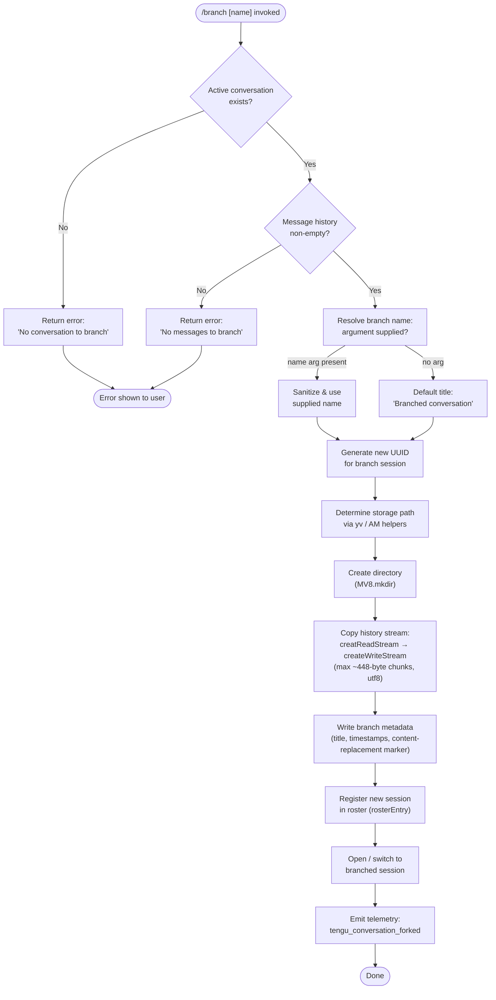

# `/branch`

> Analysis basis: CC v2.1.157 bundle.js (AST extraction + Claude interpretation)
> Minimum version: v2.1.157

---

## Overview

`/branch` (aliased as `/fork`) creates a divergent copy of the current conversation at the point it is invoked. The command reads the existing message history up to the current turn, writes it into a new conversation file with a fresh UUID, and then opens that new session — leaving the original conversation intact. An optional name argument lets the user label the branch.

---

## Registration

| Field | Value |
|---|---|
| type | `local-jsx` |
| name | `branch` |
| description | `Create a branch of the current conversation at this point` |
| aliases | `["fork"]` |
| argumentHint | `[name]` |
| module_id | `fo_` |
| load_inline | `true` |
| loc_byte | `12203684` |
| loc_byte_end | `12203878` |
| loc_line | `8114` |
| arbor_handler.name | `rlL` |
| arbor_handler.fqn | `claude-2.1.157::rlL` |
| arbor_handler.kind | `AsyncFunction` |
| arbor_handler.resolution_path | `module_id` |
| arbor_handler.n_hits | `0` |

Analysis basis: CC v2.1.157 bundle.js:+12203684

---

## Input Branching

The command has four distinct outcomes depending on conversation state and the presence of messages, so a Mermaid flowchart is used.



---

## Behavioral Spec

### Entry-Point Handler (`rlL`)

The Arbor-resolved handler is the async function `rlL` (FQN `claude-2.1.157::rlL`), reached via `module_id` resolution on `fo_`.

```
async function branchCommandHandler(args, appContext):
    # --- guard: active conversation required ---
    conversation = findActiveConversation(appContext)   # eV1 / _.find
    if conversation is null:
        return displayError("No conversation to branch")   # literal @ +10705452

    # --- guard: non-empty history required ---
    messages = getMessagesUpToCurrentPoint(conversation)
    if messages is empty:
        return displayError("No messages to branch")       # literal @ +10706473

    # --- resolve branch title ---
    rawName = args.trim() if args else null
    sanitizedName = sanitizeName(rawName)                  # A.replace @ +10705135
    title = sanitizedName if sanitizedName else "Branched conversation"  # literal @ +10705005

    # --- create new session identity ---
    newSessionId = crypto.randomUUID()                     # aV1.randomUUID @ +10705244
    newPath = resolveSessionStoragePath(newSessionId)      # yv, AM helpers

    # --- persist branch ---
    mkdir(newPath, recursive=true)                         # MV8.mkdir @ +10705306
    readStream = fs.createReadStream(sourceFile, {         # fV8.createReadStream @ +10705355
        encoding: "utf8",                                  # literal @ +10705388
        highWaterMark: 448                                 # literal @ +10705337 (bytes)
    })
    writeStream = fs.createWriteStream(destFile)           # fV8.createWriteStream @ +10705501
    copyStreamWithProgressCallback(readStream, writeStream,
        onData: markProgress("content-replacement"))       # literal @ +10705932

    waitForStreamFinish(writeStream)                       # tV1.finished @ +10706883

    # --- metadata / roster ---
    writeBranchMetadata(newSessionId, title, messageType="text")  # literal @ +10705078
    registerInRoster(newSessionId, title)                  # _.rosterEntry @ +15473457

    # --- switch to branch ---
    openSession(newSessionId, mode="fork")                 # literal "fork" @ +10708223
    waitForOpen("open")                                    # literal @ +10705414

    # --- telemetry ---
    emit("tengu_conversation_forked")                      # @ +10707702

    return success
```

Analysis basis: CC v2.1.157 bundle.js:+10708487 (rlL → _v1 call chain)

---

### Pre-flight Validation (`_v1` / `eV1`)

```
function validateBranchPreconditions(conversation, args):
    # Check conversation slot
    found = _.find(conversations, matchCurrent)   # _.find @ +10705057
    if not found:
        return { ok: false, reason: "No conversation to branch" }

    # Sanitize optional name argument (< 100 chars enforced downstream)
    cleanName = args.replace(forbiddenChars, "")  # A.replace @ +10705135

    # Confirm messages exist
    if messageCount == 0:
        return { ok: false, reason: "No messages to branch" }

    return { ok: true, title: cleanName or defaultTitle }
```

Analysis basis: CC v2.1.157 bundle.js:+10707565 (`_v1` → `eV1`)

---

### Stream Copy Sub-routine (`Hv1`)

`Hv1` is the internal async helper that performs the physical file duplication.

```
async function copyConversationFile(srcPath, destPath, options):
    readStream  = fs.createReadStream(srcPath, encoding="utf8", highWaterMark=448)
    writeStream = fs.createWriteStream(destPath)

    # Wire "drain" event for back-pressure        # literal "drain" @ +10705812
    readStream.once("open", ...)                  # literal "open" @ +10705414

    # Pipe with content-replacement header        # literal @ +10705932
    on("data", chunk):
        progress.push(chunk)                      # j.push @ +10705972
        writeStream.write(chunk)

    on("error", err):
        if err.code == "ENOENT":                  # literal @ +174141
            throw new Error("No conversation to branch")
        propagate(err, formatError)               # F_ @ +10705581

    await streamFinished(writeStream)             # tV1.finished @ +10706883
    writeStream.end()                             # O.end @ +10706869
```

Maximum chunk size: **448 bytes** (bundle.js:+10705337)

Analysis basis: CC v2.1.157 bundle.js:+10707506

---

### Session Path Resolution (`yv` / `AM`)

```
function resolveSessionPath(sessionId):
    base    = getConfigDir()           # k6 @ +12877403
    variant = getOSPathVariant()       # MI @ +12877415
    parts   = [base, variant, sessionId]
    return path.join(...parts)         # yD.join @ +12877448
```

Analysis basis: CC v2.1.157 bundle.js:+10705281 (Hv1 → yv)

---

### Name Deduplication / Roster Registration (`ilL` / `ll`)

```
function registerBranch(sessionId, title, existingSessions):
    # Deduplicate title suffix
    seen = new Set()
    for each existing in existingSessions:
        index = parseInt(extractSuffix(existing.title))  # ilL @ +10707075
        seen.add(index)

    suffix = nextAvailableIndex(seen)   # K.has / K.add @ +10707270-10707323
    finalTitle = suffix ? title + " " + suffix : title

    roster.add({ id: sessionId, title: finalTitle })
    return finalTitle
```

Analysis basis: CC v2.1.157 bundle.js:+10707638

---

### Conversation Title Writer (`th` / `s5H`)

```
function writeTitleMetadata(sessionPath, title, mode):
    if mode == "custom-title":          # literal @ +12906486
        appendToLog(sessionPath, encodeTitle(title))
        emit("tengu_session_renamed")   # @ +12906578
    elif mode == "agent-name":          # literal @ +12909509
        appendToLog(sessionPath, encodeAgentName(title))
        emit("tengu_agent_name_set")    # @ +12909607
```

Analysis basis: CC v2.1.157 bundle.js:+10707669 (th), +10707687 (s5H)

---

## State & Side Effects

| Item | Detail |
|---|---|
| Telemetry | `tengu_conversation_forked` (+10707702) — emitted on every successful branch |
| Telemetry (indirect) | `tengu_session_renamed` (+12906578), `tengu_agent_name_set` (+12909607) — emitted if title or agent name is set during branch setup |
| Telemetry (background infra) | `tengu_bg_spare_claim`, `tengu_bg_spare_spawn`, `tengu_bg_sendclaim_failed`, `tengu_bg_dispatch_sigkill_escalate`, `tengu_bg_dispatch_low_mem`, `tengu_bg_spare_enable`, `tengu_bg_spare_claim_fail`, `tengu_daemon_control`, `tengu_daemon_yield`, `tengu_daemon_idle_exit`, `tengu_bg_attach`, `tengu_bg_attach_kick`, `tengu_bg_attach_stall_ms`, `tengu_bg_attach_stall_gave_up`, `tengu_bg_attach_stall_respawn`, `tengu_bg_attach_legacy_autorespawn`, `tengu_bg_proto_mismatch`, `tengu_bg_dispatch_stale_drop`, `tengu_daemon_config_reload`, `tengu_amber_anchor`, `tengu_bg_low_mem_mb`, `tengu_feature_ok`, `tengu_feature_bad`, `tengu_worktree_detection` — reached via background-session infrastructure used when switching to the new branch |
| Filesystem writes | New session directory created (`MV8.mkdir` @ +10705306); conversation file copied via read/write streams |
| Roster mutation | `_.rosterEntry` (@ +15473457) adds the new session; `Y.delete` (@ +15473702) / `H.delete` (@ +15473757) remove stale roster entries |
| appState changes | Active session pointer switches to newly created branch session after open |
| Hook registration | `Lo_.once` (@ +10705403) used on stream-open; `O.on` (@ +10705560) for data events |
| Sound | None detected in depth-2 traversal |
| Error strings surfaced | `"No conversation to branch"` (+10705452), `"No messages to branch"` (+10706473), `"Unknown error occurred"` (+10708371) |

---

## Version History

| Version | Change |
|---|---|
| v2.1.157 | Initial analysis |

---

## Common Mistakes

1. **Invoking `/branch` with no active conversation** — the command guards against this and returns `"No conversation to branch"` immediately; ensure a conversation is open before branching.
2. **Expecting the original conversation to be modified** — `/branch` copies history at the current point; the source session remains unchanged. All subsequent edits happen in the new branch.
3. **Using `/fork` and expecting different behavior** — `/fork` is a registered alias; it is functionally identical to `/branch`.
4. **Providing a name with special characters** — the name argument is sanitized via `A.replace` (@ +10705135) before use; characters outside the allowed set are stripped silently.
5. **Branching an empty conversation** — the command checks for at least one message and rejects the operation with `"No messages to branch"` if the history is empty.
6. **Assuming instant availability** — the branch is opened through the background-session dispatch infrastructure; a brief "starting" phase is normal while the new session is adopted.

---

## Appendix — Identifier Mapping

> For bundle debugging only. Identifiers change across versions.

| Identifier | Role |
|---|---|
| `rlL` | Main async handler for `/branch` command (Arbor-resolved) |
| `_v1` | Primary branch orchestration function (called by `rlL`) |
| `eV1` | Active-conversation finder and argument sanitizer |
| `Hv1` | Async file-copy helper (stream duplication) |
| `ilL` | Branch title deduplication / roster index resolver |
| `ll` | Session listing and sorting utility used by `ilL` |
| `ACH` | Worktree / git context detection helper |
| `$_K` | Directory-scanning autocomplete helper (reached via `ll`) |
| `uCH` | Buffer assembly helper used in session listing |
| `th` | Custom-title metadata writer |
| `s5H` | Agent-name metadata writer |
| `cfH` | Log-append helper used by `th` and `s5H` |
| `mQ` | Session metadata read/write coordinator |
| `iM6` | Low-level session file read/write (JSON) |
| `nq` | String slice helper (indexOf + slice pattern) |
| `$N` | String escape helper (replace with `\$&`) |
| `z$` | Session cache invalidation helper |
| `g6` | Log-file path resolver used by `cfH` |
| `yv` | Session storage path builder |
| `AM` | OS-variant path builder |
| `RS` | Config-dir resolver used by `AM` |
| `k6` | Config-directory accessor |
| `O_` | OS path variant selector |
| `AN` | Platform detection primitive |
| `MI` | Platform-specific path segment provider |
| `CO` | Home-directory resolver |
| `SH` | Structured error reporter |
| `F_` | Error code classifier (`ENOENT`, etc.) |
| `CH` | String coercion helper |
| `L1` | Error formatting helper |
| `fVA` | Error format assembler |
| `X_4` | Rolling error-log queue (shift/push) |
| `P8` | Promise utility (resolve/reject wrapper) |
| `j8` | Async scheduler / microtask helper |
| `eS6` | Socket write/destroy helper |
| `RH` | JSON serializer wrapper |
| `Qf` | Response-end helper |
| `DF` | Binary frame encoder (Buffer pack) |
| `DfA` | Background-session claim dispatcher |
| `yB5` | Claim send with timeout (5000 ms) |
| `IB5` | Claim frame builder |
| `a9A` | Roster-file writer (JSON, mkdir + writeFile) |
| `QM` | Claim acknowledgement helper |
| `EH` | String coercer (String()) |
| `GfA` | Background-session lifecycle manager |
| `K` | Session label formatter (padEnd) |
| `gK` | Session state-directory path builder |
| `t9` | Session-state reader with cache |
| `YD` | Active-session directory resolver |
| `ff` | Session roster-path builder |
| `G86` | Background session keep-alive / heartbeat |
| `MfH` | Session log-path resolver |
| `QT` | Session log reader (split lines) |
| `GF` | Session log appender |
| `gN6` | Session directory initializer |
| `Y` | Session supervisor lifecycle controller |
| `D` | Spare-pool spawn controller |
| `YfA` | Spare PTY worker spawner (Bun.spawn) |
| `w` | Background-dispatch main loop |
| `GfA` | (same as above — background lifecycle wrapper) |
| `J` | Process kill coordinator |
| `j` | Active-process set iterator |
| `y` | PTY write/kill helper |
| `S` | Worker adoption / identity verification |
| `dVK` | Worker realpath / stat verifier |
| `kz` | Daemon socket path builder |
| `N` | Shell-command builder (platform-aware) |
| `HF5` | noop/warmup helper |
| `z` | IPC write multiplexer |
| `hH` | Feature-ok telemetry emitter |
| `bH` | Feature-bad telemetry emitter |
| `uy8` | Memory-pressure sampler (macOS) |
| `G6` | Background memory monitor |
| `Lw6` | Pinned-context file reader |
| `XP_` | pins.json path builder |
| `p6` | JSON parse wrapper |
| `sX7` | Pinned-directory recursive reader |
| `B` | MCP server retirement checker |
| `VH` | MCP plugin manifest loader |
| `dH` | Orphaned-permission set |
| `DfA` | (see above — claim dispatcher) |
| `pB5` | Daemon protocol message router |
| `TVK` | Dispatch-timeout controller (30 000 ms) |
| `g8` | Timer/promise with abort |
| `M` | Tool-use path normalizer |
| `cS6` | Plugin path safety checker |
| `tO` | Service-type resolver |
| `rzH` | Background-service context builder |
| `JfA` | Dispatch-slot tracker |
| `P` | MCP server repaint orchestrator |
| `Lx8` | Ink/terminal repaint primitive |
| `X0` | Project path resolver |
| `jN` | Projects-directory path builder |
| `hz` | Path normalization helper |
| `c$` | Realpath + normalize helper |
| `s$H` | File-type detector (user/assistant line scan) |
| `uB5` | Stall-time accumulator |
| `mB5` | Session-restart orchestrator |
| `k` | Away-summary controller |
| `w08` | Global state accessor |
| `eb5` | Away-summary generator |
| `uf8` | Turn-request builder with abort |
| `zZ1` | Request UUID generator |
| `g` | Conversation message store accessor |
| `o` | Voice toggle-mode handler |
| `Q` | Daemon supervisor IPC channel |
| `a` | Voice permission checker |
| `x` | Cursor/terminal blink controller |
| `r` | Voice focus-mode handler |
| `T` | MCP transport container |
| `l` | Input-stream frame filter |
| `t` | Voice-session manager |
| `c` | Voice permission grant handler |
| `vS8` | Voice permission state machine |
| `W` | Commit/push helper |
| `DL` | Git diff utility |
| `CC` | Conversation-complete marker |