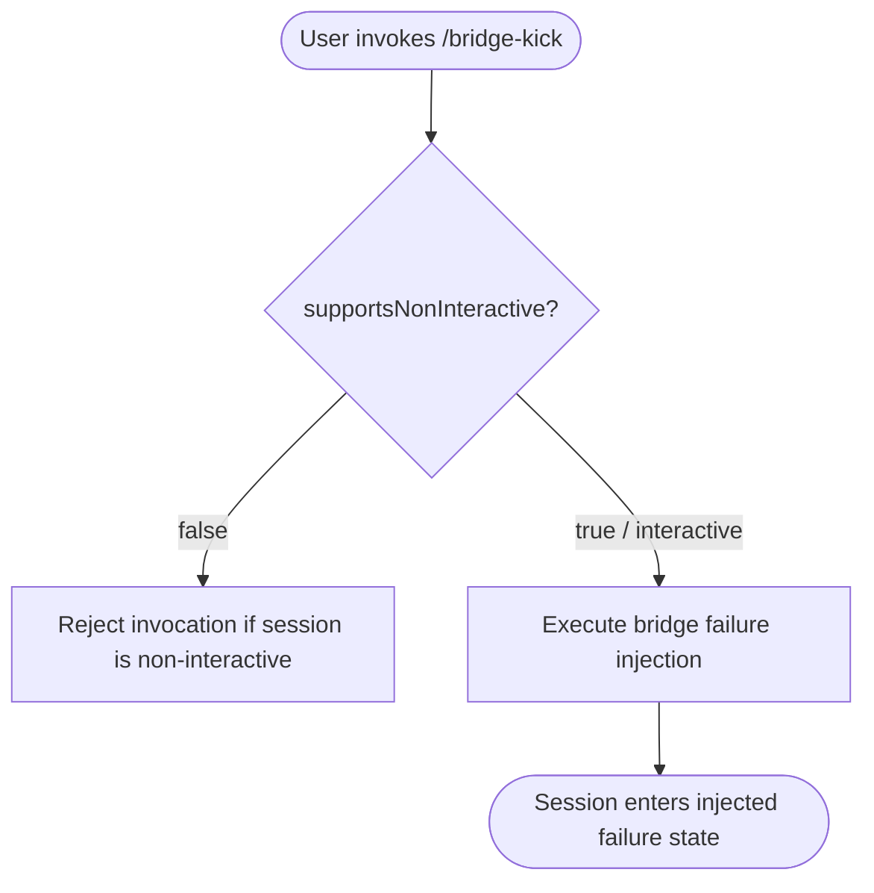

# `/bridge-kick`

> Analysis basis: CC v2.1.143 bundle.js (AST extraction + Claude interpretation)
> Minimum version: v2.1.143

---

## Overview

`/bridge-kick` is a local diagnostic command that injects simulated bridge failure states into the running Claude Code session, enabling engineers and advanced users to exercise manual recovery paths without requiring an actual upstream bridge disruption. It is classified as a testing/debugging utility and is not intended for use in normal interactive workflows.

---

## Registration

| Field | Value |
|---|---|
| type | `local` |
| name | `bridge-kick` |
| description | `Inject bridge failure states for manual recovery testing` |
| supportsNonInteractive | `false` |

Analysis basis: CC v2.1.143 bundle.js:+11588855

---

## Input Branching

The depth-2 AST traversal returned an empty call graph and no literal constants for this command's implementation module. The note field explicitly states `"no entry functions found for module 'undefined'"`, indicating that the implementation body was either tree-shaken, lazily loaded beyond the traversal boundary, or registered under a module reference that was not resolved during extraction.

Because no branching data was recovered, a flowchart cannot be constructed from verified facts. What can be stated from the registration record alone is the following single-path stub:



> **Note:** Nodes D and E represent the intended semantic purpose stated in the `description` field (Analysis basis: CC v2.1.143 bundle.js:+11588855). The internal branching inside the execution body is <!-- TODO: not found in depth-2 traversal; needs --depth 4 -->.

---

## Behavioral Spec

### Non-Interactive Guard

The registration field `supportsNonInteractive: false` means the CLI framework will refuse to dispatch this command when the session is running in non-interactive mode (e.g., piped input, `--no-interactive` flag, or headless CI invocation).

```
function checkInteractiveGuard(sessionContext):
    if sessionContext.isNonInteractive:
        raise CommandNotSupportedError(
            command = "bridge-kick",
            reason  = "non-interactive mode not supported"
        )
    return ALLOW
```

Analysis basis: CC v2.1.143 bundle.js:+11588855

### Bridge Failure Injection

The description field states the command's purpose is to "inject bridge failure states for manual recovery testing." The precise failure modes, injection targets, and recovery prompts presented to the user are:

<!-- TODO: not found in depth-2 traversal; needs --depth 4 -->

A high-level pseudocode sketch consistent with the stated description is provided below for orientation only. It must not be treated as a verified behavioral claim.

```
function executeBridgeKick(session):
    // Select or receive a failure state specifier
    failureState = resolveFailureStateFromArgs(session.args)

    // Inject the selected failure condition into the bridge layer
    injectFailureIntoSessionBridge(session.bridge, failureState)

    // Notify the user that injection has occurred and manual recovery is expected
    renderInjectionConfirmation(session.ui, failureState)
```

> All sub-function names above are descriptive placeholders derived solely from the command description. No implementation identifiers were recovered.

---

## State & Side Effects

| Item | Detail |
|---|---|
| Telemetry | None detected — telemetry array is empty (Analysis basis: CC v2.1.143 bundle.js:+11588855) |
| Hook registration | <!-- TODO: not found in depth-2 traversal; needs --depth 4 --> |
| appState changes | <!-- TODO: not found in depth-2 traversal; needs --depth 4 --> |
| Sound | <!-- TODO: not found in depth-2 traversal; needs --depth 4 --> |
| Non-interactive support | `false` — command is blocked outside interactive sessions (Analysis basis: CC v2.1.143 bundle.js:+11588855) |
| Command scope | `local` — executes entirely within the local CLI process, not forwarded to the Anthropic API (Analysis basis: CC v2.1.143 bundle.js:+11588855) |

---

## Version History

| Version | Change |
|---|---|
| v2.1.143 | Initial analysis — registration confirmed; implementation body not recovered at depth-2 traversal |

---

## Common Mistakes

1. **Invoking in non-interactive mode.** Because `supportsNonInteractive` is `false`, running `/bridge-kick` in a piped or headless session will be rejected by the framework before any injection logic executes. Always invoke from a live interactive terminal session.
2. **Expecting telemetry confirmation.** No `tengu_*` telemetry events were found for this command. Do not rely on telemetry pipelines to confirm that a bridge-kick injection was applied; verify the resulting failure state directly within the session.
3. **Assuming it affects the API layer.** The command type is `local`, meaning all effects are scoped to the local CLI process. It does not inject failure states into upstream Anthropic services or remote bridge infrastructure.
4. **Using it in production sessions.** The description explicitly frames this command as a tool for "manual recovery testing." Using it in a live work session will deliberately corrupt bridge state and require manual recovery steps.

---

## Appendix — Identifier Mapping

> For bundle debugging only. Identifiers change across versions.

| Identifier | Role |
|---|---|
| *(none recovered)* | The identifiers array returned empty from the depth-2 AST traversal. No obfuscated identifiers are available for mapping. |