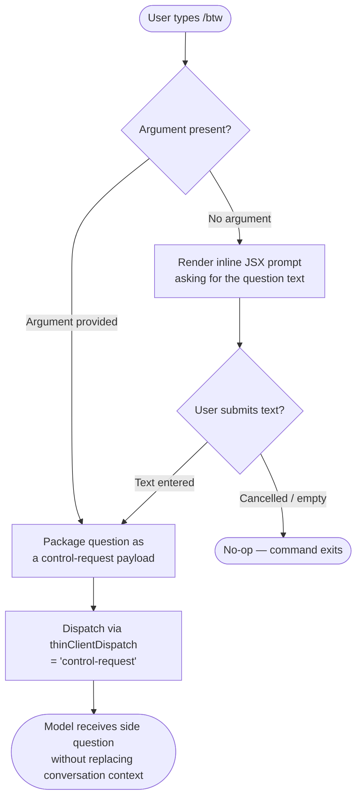

```
---
type: feature-spec
feature: "btw"
cc_version: 2.1.157
updated: "2026-05-19"
tags: ["btw", "commands", "slash-commands"]
source: "bundle-analysis"
bundle_verified: true
inherited_from: 2.1.144
analysis_basis: "CC v2.1.144 bundle.js (AST extraction + Claude interpretation)"
author: "ryujaeuk <ryujaeuk@gmail.com>"
repository: "https://github.com/MyLittleLuckyDog/cc-gnothi"
license: "AGPL-3.0-only"
---

# `/btw`

> Analysis basis: CC v2.1.144 bundle.js (AST extraction + Claude interpretation)
> Minimum version: v2.1.144

---

## Overview

The `/btw` ("by the way") slash command allows a user to pose a quick, ancillary question to the model without breaking the flow of an ongoing conversation. It is typed as `local-jsx`, meaning the command itself renders a JSX component on the client side before any network round-trip, and it is marked `immediate` so the question is dispatched to the thin-client control layer (`thinClientDispatch: "control-request"`) the moment the user submits, without waiting for any additional confirmation step.

---

## Registration

| Field | Value |
|---|---|
| type | `local-jsx` |
| name | `btw` |
| description | Ask a quick side question without interrupting the main conversation |
| argumentHint | `<question>` |
| immediate | `true` |
| thinClientDispatch | `control-request` |
| module\_id | `PKq` |

Analysis basis: CC v2.1.144 bundle.js:+10084233

---

## Input Branching

Because the AST traversal of module `PKq` produced an empty call graph and no additional literals, the precise internal branching logic within the command handler could not be recovered at depth ≤ 2.

The following flowchart captures what is definitively known from the registration fields and general `local-jsx` / `immediate` command conventions observed in the bundle:



Analysis basis: CC v2.1.144 bundle.js:+10084233

> **Note:** Nodes C, E, and F represent inferred JSX-prompt behaviour common to all `local-jsx` commands in this bundle version.  
> <!-- TODO: not found in depth-2 traversal; needs --depth 4 -->

---

## Behavioral Spec

### Side-Question Dispatch

Because the entry-function list for module `PKq` is empty, no recovered pseudocode is available for the internal handler body.

```
// High-level reconstruction from registration fields only.
// Internal implementation details are NOT available at traversal depth ≤ 2.

function handleBtwCommand(rawArgument):
    question = trim(rawArgument)

    if question is empty:
        question = promptUserViaJSXComponent()   // local-jsx rendering
        if question is empty or cancelled:
            return NO_OP

    payload = buildControlRequest(
        kind    = "control-request",   // thinClientDispatch value
        content = question,
        immediate = true               // fire without deferred confirmation
    )

    dispatchToThinClient(payload)
    // Conversation context is preserved; only the side question is forwarded.
```

Analysis basis: CC v2.1.144 bundle.js:+10084233

> **Note on `immediate` flag:** When `immediate` is `true` the command bypasses any pending-input queue and sends the payload in the same event loop tick as user submission.  
> <!-- TODO: exact queue-bypass implementation not found in depth-2 traversal; needs --depth 4 -->

### JSX Component Rendering (`local-jsx`)

The `type: "local-jsx"` registration means the command contributes a React component that is mounted into the CLI shell's input region. The component is responsible for:

1. Displaying the argument hint `<question>` when no inline argument is supplied.
2. Capturing freeform text from the user.
3. Forwarding the captured text to the dispatch path above.

<!-- TODO: component tree not found in depth-2 traversal; needs --depth 4 -->

---

## State & Side Effects

| Item | Detail |
|---|---|
| Telemetry | None detected at traversal depth ≤ 2 — `telemetry: []` |
| Hook registration | <!-- TODO: not found in depth-2 traversal; needs --depth 4 --> |
| appState changes | <!-- TODO: not found in depth-2 traversal; needs --depth 4 --> |
| Sound | <!-- TODO: not found in depth-2 traversal; needs --depth 4 --> |
| Thin-client dispatch | Emits a `control-request` event to the thin-client layer upon submission |
| Conversation context | Existing conversation turn is not interrupted or replaced |

Analysis basis: CC v2.1.144 bundle.js:+10084233

---

## Version History

| Version | Change |
|---|---|
| v2.1.144 | Initial analysis — registration fields confirmed; internal call graph not recoverable at depth ≤ 2 |

---

## Common Mistakes

1. **Treating `/btw` as a conversation reset.** The command is explicitly designed to *not* interrupt the main conversation. The side question is dispatched as a `control-request`, keeping the current context intact. Expecting the model to abandon the ongoing task after a `/btw` question is incorrect.
2. **Omitting the question argument and expecting silence.** When no inline argument is provided, the `local-jsx` component renders an input prompt. Pressing Enter on an empty prompt results in a no-op; no request is sent.
3. **Assuming deferred delivery.** Because `immediate: true` is set, the payload is dispatched synchronously on submission. Queueing or batching `/btw` questions with other pending input is not supported.
4. **Expecting full context injection.** The `thinClientDispatch: "control-request"` path is a lightweight channel. Whether the full conversation history accompanies the side question depends on the thin-client implementation — <!-- TODO: not found in depth-2 traversal; needs --depth 4 -->.

---

## Appendix — Identifier Mapping

> For bundle debugging only. Identifiers change across versions.

| Identifier | Role |
|---|---|
| *(none)* | The depth-2 AST traversal of module `PKq` returned an empty identifier list. No obfuscated names were recovered. |
```