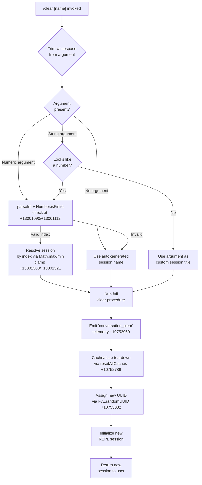

# `/clear`

> Analysis basis: CC v2.1.157 bundle.js (AST extraction + Claude interpretation)
> Minimum version: v2.1.157

---

## Overview

`/clear` (also aliased as `/reset` and `/new`) starts a fresh Claude Code session with an empty context window, discarding the current conversation from active memory while leaving the previous session safely persisted on disk. The old session remains resumable via `/resume`. Internally the command triggers a full conversation-state teardown: it clears in-memory caches, reassigns a new session UUID, resets the message log, and emits a `conversation_clear` telemetry event before initializing a new REPL loop.

---

## Registration

| Field | Value |
|---|---|
| type | `local` |
| name | `clear` |
| description | `Start a new session with empty context; previous session stays on disk (resumable with /resume)` |
| argumentHint | `[name]` |
| aliases | `reset`, `new` |
| supportsNonInteractive | `true` |
| thinClientDispatch | `post-text` |
| module_id | `dv1` |
| load_inline | `true` |
| loc_byte | `10755916` |
| loc_byte_end | `10756207` |
| arbor_handler.name | `gnL` |
| arbor_handler.fqn | `claude-2.1.157::gnL` |
| arbor_handler.kind | `AsyncFunction` |
| arbor_handler.resolution_path | `module_id` |
| arbor_handler.n_hits | `0` |

Analysis basis: CC v2.1.157 bundle.js:+10755916

---

## Input Branching

The command accepts an optional `[name]` argument and has at least three distinct behavioral paths: (1) no argument — anonymous new session; (2) argument provided — named new session; (3) numeric argument — session index lookup. A Mermaid flowchart is used.



---

## Behavioral Spec

### Top-level handler (`gnL`)

The primary handler is the `AsyncFunction` resolved by Arbor as `gnL` (fqn: `claude-2.1.157::gnL`), reached via `module_id` → `dv1`.

```
async function sessionClearHandler(userInput, context):
    trimmedArg = userInput.trim()                      // +10755742
    if trimmedArg is empty:
        sessionName = null
    else:
        sessionName = trimmedArg

    result = await executeClear(sessionName, context)  // calls clearOrchestrator (DN6)
    return result
```

Analysis basis: CC v2.1.157 bundle.js:+10755742, +10755778

---

### Clear orchestrator (`DN6`)

`DN6` is the main orchestration function that coordinates all sub-steps of tearing down the current session and starting a new one.

```
async function clearOrchestrator(sessionName, context):
    // 1. Resolve target session index (if numeric name given)
    resolvedSession = resolveSessionByIndex(sessionName)   // jN6, +10753821

    // 2. Terminate background workers associated with the session
    terminateBackgroundWorkers(resolvedSession)             // wRH, +10753833

    // 3. Set AbortSignal with timeout for graceful teardown
    abortSignal = AbortSignal.timeout(...)                 // +10753881

    // 4. Emit telemetry for cache eviction hint
    emit("tengu_cache_eviction_hint")                      // b96, +10753912/10753925

    // 5. Collect and iterate over running conversation values
    Object.values(runningConversations)                    // +10754091

    // 6. Kill any active background subprocesses
    killActiveProcesses(processMap)                        // w, +10754120

    // 7. Reset all in-memory caches and subsystem state
    resetAllCaches()                                       // bo_, +10754223

    // 8. Change working directory / resolve CWD
    resolveWorkingDirectory(sessionName)                   // GD, +10754232

    // 9. Clear conversation message list
    clearConversationMessages()                            // O_, _.clear, +10754235/+10754241

    // 10. Assign new session UUID
    newSessionId = Fv1.randomUUID()                        // +10755082

    // 11. Emit conversation_clear telemetry event string
    emit("conversation_clear")                             // mu8, +10753960/+10755100

    // 12. Register signal handlers for new session
    registerSignalHandlers()                               // nl, +10755213

    // 13. Start transcript logging for new session
    startTranscriptLogging()                               // th, +10755226

    // 14. Set up task/worktree session directory
    initSessionDirectory()                                 // YSH, +10755333

    // 15. Assign role (coordinator or normal)
    // Literals: "coordinator" (+10755435), "normal" (+10755449)
    assignSessionRole(context)                             // +10755429/+10755431

    // 16. Initialize hook manager for new session
    initHookManager()                                      // HM, +10755465

    // 17. Emit session-start event
    emitSessionStart()                                     // jm, +10755475

    // 18. Record session-start to append log
    appendSessionStartLog()                                // aAH, +10755495

    // 19. Load plugin hooks for new session
    loadPluginHooks()                                      // JB, +10755522

    return newSessionContext
```

Analysis basis: CC v2.1.157 bundle.js:+10753821–+10755522

---

### Session index resolution (`jN6`)

When the user provides a numeric-looking argument, this function converts it to an integer and validates it.

```
function resolveSessionByIndex(nameOrIndex):
    parsed = parseInt(nameOrIndex, 10)        // +13001090 (radix 10)
    if not Number.isFinite(parsed):           // +13001112
        return defaultSession()              // $D, +13001155
    loadSessionList()                        // Mp, +13001163
    totalSessions = sessionList.length       // TU, +13001190
    // Clamp index to valid range [0, totalSessions-1]
    index = Math.max(0, Math.min(parsed, totalSessions - 1))  // +13001308/+13001321
    // Scale by 1000 (Ms per session tick unit)
    // Literal 1000 at +13001277
    return sessionList[index]
```

Analysis basis: CC v2.1.157 bundle.js:+13001090, +13001112, +13001308, +13001321

---

### Background-worker termination (`wRH`)

Runs a `SessionEnd` lifecycle event against the outgoing session before freeing its resources.

```
async function terminateBackgroundWorkers(session):
    sessionEndPayload = buildSessionEndPayload(session)   // j7, +12991621
    // Literal "SessionEnd" at +12991648
    emit("SessionEnd", sessionEndPayload)
    waitForWorkerDrain(session)                           // eW, +12991679
    releaseWorkerSlot(session)                            // k6, +12991876
    cleanupBackgroundSession(session)                     // $hH, +12991881
```

Analysis basis: CC v2.1.157 bundle.js:+12991621, +12991648, +12991679

---

### Cache and subsystem reset (`bo_`)

Iterates through every registered subsystem and clears its in-memory state. This is the widest-scope side-effect of `/clear`.

```
function resetAllCaches():
    clearSkillIndexCache()                  // hu → H.clearSkillIndexCache, +12866179
    clearConversationIndex()                // Hk9 → jB.clear, +6616091
    clearAgentRegistrations()               // Ka → rM8, +6664242
    clearCompactState()                     // Ka → aM8 → nG1.clear, +10375044
    clearMcpHookState()                     // hk9 → QP6.clear/vk_.clear, +6652591/+6652603
    clearSubagentRegistry()                 // Nk9, +6652409
    clearToolPermissionState()              // vjH, +6651499
    resetAutonomousLoopDelivered()          // Or7.resetAutonomousLoopDelivered, +6664354
    clearOutputTokenCounters()              // dw → CxH/Object.values, +43040
    clearNotificationCache()               // Aa → YT8.clear, +9716353
    clearWatchFileState()                   // DK1 → jhH.clear/tU_.clear, +8835356/+8835368
    clearTaskGraph()                        // jt9 → asH.clear/lG6.clear, +8138580/+8138592
    clearProcessHandleCache()               // ir8 → hpH.clear, +1062947
    clearConnectionState()                  // UN9 → NM8.clear, +6604619
    clearMacOSFeatureFlag()                 // Ep8 → H.has, +54222
    clearMediaCache()                       // mr8 → ypH.clear, +1055726
    clearSettingsLayerCache()              // LH1 → Fa.clear/eJH.clear, +8205153/+8205164
    Promise.resolve()                       // sync barrier, +10753149
    // Additional: EU_, q, xG8, fz, rNH cleared
```

Analysis basis: CC v2.1.157 bundle.js:+10752786–+10753433

---

### New session initialization — transcript + role assignment

```
function startTranscriptLogging(sessionId):
    // Logs user role and custom-title for new session
    // Literal "user" at +12906448
    // Literal "custom-title" at +12906486
    buildTranscriptEntry(sessionId)     // yv, +12906465
    writeTranscriptEntry()              // cfH, +12906474
    emitConversationReset()             // Cy6.emit("conversation_reset"), +10755043

function assignSessionRole(context):
    // Literals: "coordinator" (+10755435), "normal" (+10755449)
    role = context.isCoordinator ? "coordinator" : "normal"
    setSessionRole(role)
```

Analysis basis: CC v2.1.157 bundle.js:+12906448, +12906465, +10755043, +10755435, +10755449

---

### Plugin hook reload on session start (`JB`)

After the new session is established, `/clear` reloads all plugin hooks, exactly as a fresh startup does.

```
async function loadPluginHooks(session):
    // Check managed-hooks-only policy
    if policySettings.allowManagedHooksOnly and no managed plugins:
        log("Skipping plugin hooks - allowManagedHooksOnly is enabled and no managed plugins")
        // Literal at +6628059
        return

    // Load built-in hooks ($D)
    builtinHooks = readBuiltinHooks()              // $D, +6628038

    // Clone/validate external plugin repos (rEH)
    externalHooks = cloneAndValidatePlugins()       // rEH, +6628044

    // Emit load_plugin_hooks telemetry
    // Literal "load_plugin_hooks" at +6628161
    recordTimestamp()                               // IpH, +6628157

    // For each hook source: push to active hook lists
    activeHooks.push(builtinHooks)                 // f.push, +6629106
    activeHooks.push(externalHooks)                // M.push, +6629179

    // Trigger skill-index cache reload
    reloadSkillIndex()                              // WC, +6629386

    // Clear notification state
    clearNotificationState()                        // Aa, +6629391

    // Emit "hook_session_start_reload_skills"
    // Literal at +6629409
    uc.emit("hook_session_start_reload_skills")

    // Compute additional context for new session hooks
    hookAdditionalContext()                         // Vq, +6629528
    // Literal "hook_additional_context" at +6629537
```

Analysis basis: CC v2.1.157 bundle.js:+6628038–+6629537

---

## State & Side Effects

| Item | Detail |
|---|---|
| Telemetry emitted | `tengu_cache_eviction_hint` (+10753925), `tengu_run_hook` (+13040410), `tengu_feature_bad` (+966091), `tengu_feature_ok` (+966033), `tengu_hook_plugin_metrics` (+13018848), `tengu_repl_hook_finished` (+13024297), `tengu_hook_plugin_injected` (+13038750), `tengu_shell_set_cwd` (+8191294), `tengu_session_renamed` (+12906578), `tengu_bg_dispatch_sigkill_escalate` (+15466951), `tengu_daemon_control` (+15502788), `tengu_bg_low_mem_mb` (+12729087), `tengu_bg_dispatch_low_mem` (+15467530), `tengu_bg_spare_enable` (+15468225), `tengu_bg_sendclaim_failed` (+15447680), `tengu_daemon_config_reload` (+15481439), `tengu_bg_spare_claim` (+15468346), `tengu_bg_spare_spawn` (+15466644), `tengu_bg_spare_claim_fail` (+15468609) |
| Internal event strings emitted | `"conversation_clear"` (+10753960), `"conversation_reset"` (+10755043), `"hook_session_start_reload_skills"` (+6629409), `"SessionEnd"` (+12991648), `"session_start"` (+4927737) |
| In-memory caches cleared | Skill index, conversation index, agent registrations, compact state, MCP hook state, subagent registry, tool permission state, autonomous loop counter, output token counters, notification cache, watch-file state, task graph, process handle cache, connection state, macOS feature flags, media cache, settings-layer cache (all via `bo_`) |
| Conversation message list | Cleared via `_.clear` (+10754241) |
| Session UUID | Replaced with a fresh UUID from `Fv1.randomUUID` (+10755082) |
| Transcript log | New session entry appended by `cfH` / `L_K` (+12906474, +12910498) |
| Plugin hooks | Fully reloaded as if at startup (`JB`, +10755522) |
| Signal handlers | Re-registered for the new session (`nl` → `U4`, +10755213) |
| Background workers | Gracefully shut down with `SessionEnd` event; SIGKILL escalation possible (`wRH`, +10753833) |
| AbortController | Previous session's abort controller cleared; new one set up (+10754577) |
| Session role | Re-evaluated as `"coordinator"` or `"normal"` (+10755435, +10755449) |
| Task/worktree directory | Symlinked/initialized for the new session (`YSH`, +10755333) |
| Hook registration | Hooks reloaded via `JB`/`WC`; previous hook state in `QP6`, `vk_`, `NM8` cleared |
| Sound | <!-- TODO: not found in depth-2 traversal; needs --depth 4 --> |
| appState changes | `f.getAppState` consulted during hook execution (`cX` → `f.getAppState`, +13023749); new session state propagated |

---

## Version History

| Version | Change |
|---|---|
| v2.1.157 | Initial analysis |

---

## Common Mistakes

1. **Expecting immediate context loss in thin-client mode.** The command sets `thinClientDispatch: "post-text"`, meaning in thin-client deployments the clear action is dispatched after a text acknowledgement is sent — the context may persist briefly on the server side until the post-text round-trip completes.
2. **Confusing `/clear` with data deletion.** The prior session is written to disk and remains fully resumable via `/resume`. `/clear` only resets the active in-memory context; no conversation history is deleted.
3. **Using a purely numeric argument expecting an exact session ID.** Numeric arguments are treated as a zero-based index into the session list and are clamped by `Math.max`/`Math.min` — an out-of-range number silently wraps to the nearest valid index rather than returning an error.
4. **Assuming plugin hooks survive the clear.** All hook subsystem state is fully torn down and rebuilt during `/clear`. Any in-flight hook execution from the previous session is cancelled.
5. **Using `/reset` or `/new` and expecting different behavior.** All three names (`clear`, `reset`, `new`) are aliases pointing to the same handler (`gnL`). They are functionally identical.

---

## Appendix — Identifier Mapping

> For bundle debugging only. Identifiers change across versions.

| Identifier | Role |
|---|---|
| `gnL` | Top-level handler for `/clear` (AsyncFunction, arbor_handler) |
| `DN6` | Clear orchestrator — coordinates all teardown and init sub-steps |
| `jN6` | Session index resolver — parses numeric arguments, clamps to valid range |
| `$D` | Default/built-in session loader |
| `I8` | Policy settings reader (`policySettings`) |
| `Mp` | Session list loader |
| `AN` | Core append/notify utility |
| `TU` | Session count / total sessions provider |
| `GY_` | Session registry get/set helper |
| `vz` | Cache clear dispatcher (`kC6.clear`, `Ru8.clear`) |
| `TY_` | Hook state initializer |
| `wRH` | Background worker terminator (emits `SessionEnd`) |
| `j7` | Session-end payload builder |
| `k6` | Key-value state accessor |
| `uS` | Utility: signal/event emission helper |
| `XW` | Model string classifier (checks model name prefixes) |
| `bV` | Effort-level resolver (e.g., `"high"`) |
| `yv` | Transcript entry builder |
| `h6` | Transcript/log path resolver |
| `eW` | REPL main loop / hook execution engine |
| `CH` | String coercion / display helper |
| `GU` | App state reader |
| `N` | Logger / structured output helper |
| `lfH` | Hook input serialization helper |
| `Z9A` | Hook configuration loader / plugin settings resolver |
| `O` | Observable/reactive collection |
| `VAK` | Hook variant resolver A |
| `T9A` | Hook type filter |
| `NAK` | Hook variant resolver B |
| `d` | Diagnostic / debug logger |
| `RH` | JSON serializer wrapper |
| `SH` | Hook execution scheduler |
| `bH` | Background diagnostics helper |
| `XGH` | Hook error reporter |
| `Lv` | Abort/timeout manager |
| `J` | Callback registry |
| `B8H` | Hook batch handler |
| `_v` | State snapshot utility |
| `uh8` | Hook metadata assembler |
| `X9A` | MCP tool result handler |
| `Uh8` | Hook output parser (JSON vs plain-text routing) |
| `SAH` | Hook metadata mapper (Object.entries/fromEntries) |
| `J9A` | HTTP hook executor |
| `EAK` | Command-hook executor |
| `IfH` | Internal hook filter |
| `Bh8` | Subprocess hook spawner (main shell hook engine) |
| `xyH` | Async hook watcher |
| `hH` | Stdio read helper |
| `$hH` | Background session cleanup helper |
| `b96` | Cache eviction hint emitter |
| `L` | Promise lifecycle tracker (add/finally/delete) |
| `q` | File cleanup set (unlinkSync) |
| `f` | File/stream handle |
| `A` | General array / collection |
| `w` | Background process manager (kill, freemem, spare pool) |
| `S` | Supervisor process wrapper |
| `dVK` | Realpath/stat resolver |
| `kz` | Process state checker |
| `HF5` | Mtime watcher |
| `z` | Write-stream wrapper |
| `uy8` | Low-memory detector |
| `G6` | Memory pressure tracker |
| `Lw6` | Pins file reader (`pins.json`) |
| `XP_` | Pin path resolver |
| `p6` | JSON parse wrapper |
| `P8` | Error code checker (`ENOENT`, `errno`) |
| `sX7` | Directory scanner for plugin roots |
| `B` | Background session registry |
| `VH` | Plugin/MCP session validator |
| `dH` | Orphaned-permission tracker |
| `DfA` | Background session claim sender |
| `a9A` | Session file writer |
| `yB5` | Claim timeout handler |
| `IB5` | Claim frame builder |
| `QM` | Error code extractor |
| `EH` | String error formatter |
| `DF` | Binary frame encoder (Buffer operations) |
| `GfA` | Background session spawner/lifecycle manager |
| `K` | Session status formatter |
| `gK` | Session directory path builder |
| `t9` | Session state reader/writer (stat, readFile, cache) |
| `YD` | Session status resolver (`CV`) |
| `ff` | Session roster file writer |
| `G86` | Session idle timer |
| `MfH` | Session symlink path builder |
| `QT` | Session symlink updater |
| `GF` | Session directory initializer |
| `gN6` | Session directory creator (`fs_`, `h3.join`) |
| `Y` | Background session config updater (start/stop/updateConfig) |
| `D` | Process-level lifecycle manager (spawn/dispose/freemem) |
| `$` | Daemon connection handle (`Ls1`) |
| `YfA` | Spare session spawner (`Bun.spawn`) |
| `j8` | Error/exit code handler |
| `R` | Daemon resource handle |
| `lX` | Session lock handle |
| `Zj` | Session state transition helper |
| `bo_` | Full cache/subsystem reset orchestrator |
| `yo_` | Pre-reset state snapshot |
| `WC` | Skill index / hook reset coordinator |
| `hu` | Skill index cache invalidator |
| `WT8` | Watcher teardown helper |
| `_j1` | Internal state latch reset |
| `ISH` | Isolation state handler |
| `Hk9` | Conversation index clearer (`jB.clear`) |
| `IkH` | Conversation index writer |
| `K16` | In-process teammate registry clearer |
| `Ka` | Agent/subagent registry full reset |
| `KNH` | Main agent handle |
| `rM8` | Agent registration remover |
| `WJ6` | Session start event emitter (`LE`) |
| `Q8H` | Tool permission pair clearer |
| `aM8` | Compact notification state clearer (`nG1.clear`) |
| `hk9` | MCP hook state clearer (`QP6.clear`, `vk_.clear`) |
| `Nk9` | Subagent registry clearer |
| `vjH` | Tool permission state reset |
| `dw` | Output token counter reset |
| `Ck_` | Compact cleanup scheduler |
| `Aa` | Notification cache clearer (`YT8.clear`) |
| `DK1` | Watch-file state clearer (`jhH.clear`, `tU_.clear`) |
| `jt9` | Task-graph state clearer (`asH.clear`, `lG6.clear`) |
| `ir8` | Process handle cache clearer (`hpH.clear`) |
| `zA9` | Internal subsystem state A |
| `UN9` | MCP connection state clearer (`NM8.clear`) |
| `Ep8` | macOS feature flag checker (`H.has`) |
| `mr8` | Media cache clearer (`ypH.clear`) |
| `HX1` | Internal subsystem state B |
| `LH1` | Settings layer cache clearer (`Fa.clear`, `eJH.clear`) |
| `GD` | Working directory resolver (path.isAbsolute/resolve) |
| `g6` | CWD getter |
| `pi8` | Path normalizer with store context |
| `P9H` | Path normalize helper |
| `O_` | Output/message list clearer |
| `DvH` | Dangling variable handle D |
| `jE` | Internal timer/job entry |
| `xO` | Pending flush manager (`Zh8`, `k_K`) |
| `Vh8` | Promise-set tracker (`k_K.add/delete`) |
| `riH` | CLI subsystem resetter |
| `XP9` | CLI reset target |
| `Qv1` | Compact metadata resetter (`cMH`) |
| `cMH` | Compact state store |
| `I$` | Hook/tool executor |
| `U4` | Universal executor (tool calls, hook dispatch) |
| `K9` | Signal handler registrar (`_OA.register`) |
| `MI` | Model identifier |
| `AM` | Context assembler (RS, CO, O_, VjH.join, k6) |
| `RS` | Role-string constant source |
| `wN6` | New-session executor |
| `mu8` | UUID emitter + `bC6.emit` for `conversation_clear` |
| `nl` | Signal handler setup |
| `th` | Transcript logging initializer |
| `cfH` | Transcript file appender (appendFileSync, mkdirSync) |
| `YSH` | Task/worktree session directory initializer |
| `z9A` | Task directory creator (`At.mkdir`) |
| `ftH` | Task path builder |
| `h$` | Task symlink path builder |
| `KeH` | Task directory opener |
| `wE` | Subagent context builder |
| `CM` | Context metadata |
| `Z_` | Module export initializer |
| `QR6` | Module binding helper |
| `W` | UI layout driver (`DL`) |
| `DL` | Display layer |
| `G` | Global event/input handler |
| `b` | Browser/remote event source |
| `h0` | Settings loader on startup |
| `U_` | Settings-layer merger |
| `HM` | Hook manager initializer |
| `jm` | Session-start event emitter (`iE8.emit`) |
| `aAH` | Append-log session-start writer |
| `L_K` | Append-log file writer (M7.appendFile/mkdir) |
| `JB` | Plugin hook loader (full startup/clear reload) |
| `BK` | Bare-clone helper |
| `rEH` | External plugin hook loader |
| `IpH` | Hook load timestamp recorder |
| `w8` | Append-log writer |
| `UP6` | Hook execution pipeline |
| `SX` | Session execution context |
| `cX` | REPL core execution loop |
| `M` | Plugin staging helper |
| `cS6` | Plugin path resolver |
| `Vq` | Additional context hook runner |