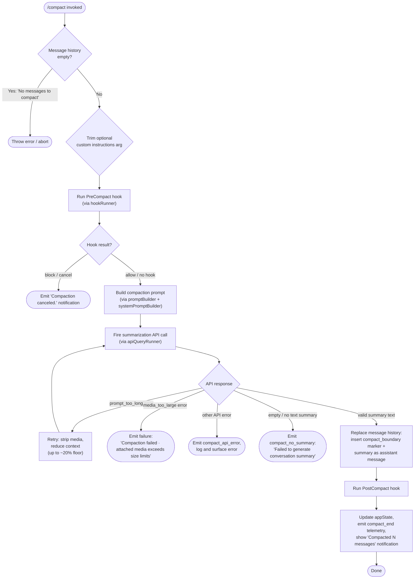

# `/compact`

> Analysis basis: CC v2.1.157 bundle.js (AST extraction + Claude interpretation)
> Minimum version: v2.1.157

---

## Overview

`/compact` summarizes the current conversation to free up context window space, replacing the full message history with a condensed summary. It can be invoked manually by the user or triggered automatically when the context window is near capacity, and supports optional custom summarization instructions passed as an argument.

---

## Registration

| Field | Value |
|---|---|
| type | `local` |
| name | `compact` |
| description | `Free up context by summarizing the conversation so far` |
| argumentHint | `<optional custom summarization instructions>` |
| supportsNonInteractive | `true` |
| thinClientDispatch | `post-text` |
| module_id | `BN1` |
| load_inline | `true` |
| loc_byte | `10789173` |
| loc_byte_end | `10789486` |
| loc_line | `6760` |
| arbor_handler.name | `XiL` |
| arbor_handler.fqn | `claude-2.1.157::XiL` |
| arbor_handler.kind | `AsyncFunction` |
| arbor_handler.resolution_path | `module_id` |
| arbor_handler.n_hits | `0` |

Analysis basis: CC v2.1.157 bundle.js:+10789173

---

## Input Branching

The `/compact` handler follows 5+ distinct paths based on preconditions and results, so a Mermaid flowchart is used.



Analysis basis: CC v2.1.157 bundle.js:+10788204 (handler entry `XiL`), +10788229 (empty-check error), +10788267 (trim arg), +10788284 (hook call), +10788302 (prompt build), +10785248 (prompt_too_long message), +10785370 (media_too_large message), +10787635 ("Compacted " string), +10788775 ("Compaction canceled.")

---

## Behavioral Spec

### Top-Level Handler (`XiL`)

```
async function compactHandler(commandArgs, appContext):
    customInstructions = commandArgs.trim()           // loc:+10788267

    if messageHistory is empty:                        // loc:+10788229
        throw Error("No messages to compact")          // loc:+10788235

    hookResult = await runPreCompactHook(appContext)   // loc:+10788284
    if hookResult.decision == "block":                 // loc:+9947658
        emit notification("Compaction canceled.")      // loc:+10788775
        return

    updateSDKStatus("compacting")                     // loc:+10784266

    // Build summarization prompt (delegates to promptBuilder)
    promptData = await buildCompactionPrompt(
        messageHistory,
        customInstructions,
        appContext.systemPrompt
    )                                                  // loc:+10788302

    // Fire API call loop (delegates to apiQueryRunner)
    summaryResult = await runCompactionQuery(promptData, appContext)

    if summaryResult.error == "prompt_too_long":       // loc:+9949717
        summaryResult = await retryWithReducedContext(promptData)

    if summaryResult.error == "media_too_large":       // loc:+10785370
        emitFailure("Compaction failed · attached media exceeds size limits")
        return

    if summaryResult.text is empty / missing:          // loc:+10785494
        emitFailure("compact_no_summary")
        return

    // Replace history with compact boundary + summary
    replaceHistoryWithSummary(
        summaryResult.text,
        boundaryMarker = "compact_boundary"            // loc:+10493635
    )                                                  // loc:+10788339

    // Post-compact lifecycle
    await runPostCompactHook(appContext)               // loc:+10788469
    await resetAppState(appContext)                    // loc:+10788494
    await showProgressNotification("Compacted ...")   // loc:+10787635
    emitTelemetry("tengu_compact")                    // loc:+9951690
    updateSDKStatus("compact_end")                    // loc:+10786122
```

### Pre-Compact Hook Runner (`pc` → `G6`)

```
async function runPreCompactHook(appContext):
    // Resolves and executes hooks registered for the "PreCompact" event
    // loc:+10788284, +9967232
    hooks = resolveHooks(eventType = "PreCompact")    // loc:+12986807
    for hook in hooks:
        result = await executeHook(hook, appContext)
        if result.decision == "block":
            emit("compaction-blocked-by-hook")        // loc:+9947658
            return { decision: "block" }
    return { decision: "allow" }
```

### Prompt Builder (`PiL`)

```
async function buildCompactionPrompt(history, customInstructions, appContext):
    startTime = performance.now()                     // loc:+10784287

    // Gather context slices in parallel
    [systemPromptParts, contextParts] = await Promise.all([
        buildSystemPromptSlices(appContext),           // loc:+10784338 (UN1)
        buildMessageSlices(history, appContext)        // loc:+10784338 (Uc)
    ])

    // Optionally attach custom instructions
    if customInstructions is non-empty:
        append customInstructions to prompt

    // Mark progress milestones
    recordMilestone("compact_progress")               // loc:+10784150
    recordMilestone("hooks_start")                    // loc:+10784181
    recordMilestone("pre_compact")                    // loc:+10784204

    return assembledPrompt
```

### Compaction Query Runner (`keH`)

```
async function runCompactionQuery(promptData, appContext):
    // Validates there are enough messages before proceeding
    // loc:+9948485
    startTime = performance.now()
    triggerType = promptData.manual ? "compact_manual" : "compact_auto"
                                                      // loc:+9948460, +9948445

    // Tool use explicitly blocked during compaction
    // "Tool use is not allowed during compaction"    // loc:+9959239

    span = startOtelSpan("claude_code.compaction")    // loc:+9948509

    response = await apiQuery(promptData, {
        systemMessage: "You are a helpful AI assistant tasked with summarizing conversations.",
                                                      // loc:+9961558
        allowToolUse: false
    })

    if response has no text content:
        emitTelemetry("tengu_compact_failed")         // loc:+9962837
        return { error: "no_summary" }                // loc:+9950026

    if response indicates prompt_too_long:
        emitTelemetry("tengu_compact_ptl_retry")      // loc:+9949757
        return { error: "prompt_too_long" }

    if response is API error:
        emitTelemetry("tengu_compact")                // loc:+9951690
        return { error: "api_error" }                 // loc:+9959127

    return { text: response.summaryText }
```

### Message History Replacement (`HO` → `IE8`)

```
function replaceHistoryWithCompactSummary(summaryText, currentHistory):
    // Inserts a special boundary marker message then the summary
    // loc:+10788204, +10493635
    boundaryMessage = {
        type: "system",
        subtype: "compact_boundary",                  // loc:+10493635
        index: 1                                      // loc:+10493689
    }
    summaryMessage = {
        role: "assistant",
        content: summaryText
    }
    // Slice history to retain messages after boundary
    newHistory = [boundaryMessage, summaryMessage]    // loc:+10493765
    apply newHistory to conversation store
    emit("Conversation compacted")                    // loc:+10493191
```

### Post-Compact Cleanup (`Ka`)

```
async function runPostCompactCleanup(appContext):
    // Resets internal loop state, clears pending queues, re-initializes
    // subagent tracking
    // loc:+6664248
    clearPendingQueues()                              // loc:+6664322 (hk9)
    resetAutonomousLoopDelivered()                    // loc:+6664354
    clearInternalCaches()                             // loc:+6664316 (aM8)
    emitTelemetry("tengu_precomputed_compact_discarded") // loc:+6663667
    runPostCompactHooks()                             // loc:+6664248
```

### Reactive Compact Subsystem (`xk_` → `QM8`)

```
async function reactiveCompact(appContext):
    // Automatically triggered when context usage is high
    // loc:+6668603 (tM8 call), +6650721

    messageGroups = groupMessagesByTurn(history)
    if messageGroups.length < 2:
        log("Reactive compact: fewer than 2 groups, nothing to compact")
                                                      // loc:+6649057
        emitTelemetry("tengu_reactive_compact_attempt") // loc:+6649780
        return { result: "too_few_groups" }           // loc:+6649147

    summarizeSet = selectGroupsForSummarization(
        messageGroups,
        targetSlice = last N groups                   // loc:+6649294 (N=3)
    )

    if summarizeSet has no assistant messages:
        log("Reactive compact: no assistant messages in summarize set, bailing")
                                                      // loc:+6649619
        return { result: "exhausted" }                // loc:+6649721

    summaryResult = await callSummarizationAPI(summarizeSet)

    if summaryResult.error == "media_too_large":
        log("Reactive compact: summarize hit media-size error, retrying stripped")
                                                      // loc:+6650503
        summaryResult = await callSummarizationAPI(summarizeSet, stripMedia=true)
        if still error:
            return { result: "media_unstrippable" }   // loc:+6650618

    if summaryResult is empty:
        log("Reactive compact: empty summary text")   // loc:+6648217
        return { result: "summarization produced empty response" }
                                                      // loc:+6648313

    applyCompactSummary(summaryResult)
    emitTelemetry("tengu_reactive_compact_succeeded") // loc:+6670371
    return { result: "success" }
```

---

## State & Side Effects

| Item | Detail |
|---|---|
| Telemetry — primary | `tengu_compact` (loc:+9951690) — fired at end of each compaction run |
| Telemetry — failure | `tengu_compact_failed` (loc:+9962837), `tengu_compact_ptl_retry` (loc:+9949757), `tengu_compact_api_error` (implied by literal `compact_api_error` loc:+9950389) |
| Telemetry — reactive | `tengu_reactive_compact_attempt` (loc:+6649780), `tengu_reactive_compact_succeeded` (loc:+6670371), `tengu_reactive_compact_failed` (loc:+6667990) |
| Telemetry — pre/post | `tengu_precomputed_compact_consumed` (loc:+6663048), `tengu_precomputed_compact_discarded` (loc:+6663667) |
| Telemetry — cache | `tengu_compact_cache_prefix` (loc:+9949285), `tengu_compact_cache_sharing_success` (loc:+9960116), `tengu_compact_cache_sharing_fallback` (loc:+9960746) |
| Telemetry — post-restore | `tengu_post_compact_file_restore_success` (loc:+9963319), `tengu_post_compact_file_restore_error` (loc:+9963361) |
| Hook invocations | `PreCompact` hook fired before summarization; `PostCompact` hook fired after history replacement |
| appState changes | SDK status set to `"compacting"` during run (loc:+10784266); `compact_end` milestone emitted on completion (loc:+10786122); `compactMetadata` written to state (loc:+10785578) |
| Message history | Entire prior conversation replaced by `compact_boundary` system marker + summary assistant message |
| Abort guard | If `PreCompact` hook returns `block`, emits `"Compaction canceled."` and returns without modifying history (loc:+10788775) |
| Non-interactive | `supportsNonInteractive: true` — can be invoked in headless/pipe mode |
| OTel tracing | Opens span `claude_code.compaction` with `span.type` attribute (loc:+9948509) |
| Sound | `<!-- TODO: not found in depth-2 traversal; needs --depth 4 -->` |

---

## Version History

| Version | Change |
|---|---|
| v2.1.157 | Initial analysis |

---

## Common Mistakes

1. **Passing instructions that look like a command**: The optional argument is treated as raw custom summarization instructions appended to the compaction prompt — not as a secondary slash command. Ensure any custom text does not start with `/`.
2. **Invoking `/compact` when the conversation has no messages**: The handler throws immediately with `"No messages to compact"` (loc:+10788235). There must be at least one prior exchange.
3. **Expecting tool use to continue during compaction**: Tool use is explicitly blocked while compaction is in progress (`"Tool use is not allowed during compaction"`, loc:+9959239). Any in-flight tool calls will be denied.
4. **Assuming `/compact` always succeeds on the first attempt**: When the assembled prompt exceeds context limits (`prompt_too_long`), the handler automatically retries with reduced/stripped context rather than failing immediately. Observing a delay is normal.
5. **Forgetting that a `PreCompact` hook can silently abort**: If a hook registered for the `PreCompact` event returns a block decision, the operation silently cancels with only a brief notification — the message history remains unchanged.

---

## Appendix — Identifier Mapping

> For bundle debugging only. Identifiers change across versions.

| Identifier | Role |
|---|---|
| `XiL` | Top-level `/compact` async handler (Arbor-resolved entry point) |
| `HO` | Message history slice helper — extracts conversation segments for compaction |
| `IE8` | Boundary marker insertion — writes `compact_boundary` into history |
| `Ej` | Low-level history append / mutation helper |
| `pc` | Pre-compact hook orchestrator |
| `G6` | Hook resolution and dispatch engine |
| `PiL` | Compaction prompt builder — assembles system prompt + message slices |
| `fE` | API query facade used inside prompt builder |
| `CuL` | Message normalization for API submission |
| `Ol_` | Attachment / content-block normalizer (handles image, pdf, file, MCP resource types) |
| `Uc` | Message slice collector (PreCompact context gatherer) |
| `UN1` | System-prompt builder for compaction |
| `bT` | Full system prompt assembler (aggregates environment, memory, tools sections) |
| `keH` | Compaction query runner — calls API, handles retries and error branches |
| `yX1` | Core API interaction loop with streaming and caching logic |
| `WiL` | Streaming response handler within compaction query |
| `tM8` | Token-budget and metrics tracker for the compaction turn |
| `xk_` | Reactive compact coordinator (auto-triggered path) |
| `QM8` | Reactive compact message group selector and summarization caller |
| `Hr7` | Summarization API call executor within reactive compact |
| `Ka` | Post-compact cleanup handler (clears queues, resets loop state) |
| `SkH` | App state setter — updates `gP6` state store after compact |
| `pN1` | Notification emitter for compact completion message |
| `DwH` | OTel metrics emitter (records compaction span attributes) |
| `keH` | Compaction span and telemetry wrapper (also houses `tengu_compact` event) |
| `KNH` | Token-count prefix helper |
| `Jj` | Tool-use filter applied during compaction (enforces no-tool constraint) |
| `L26` | OTel span initializer for `claude_code.compaction` |
| `wh` | Active-process guard checked before compaction proceeds |
| `V_` | App-state reader (fetches current conversation state) |
| `zm` | System-prompt context loader (loads agent memory and system prompt) |
| `bkH` | Message deduplication / sorting used in compaction context build |
| `JB` | Session-start hook and plugin-hook loader |
| `Yr7` | Context-state parallel fetcher (files, plans, tool results) |
| `H$8` | File-restore data fetcher used in post-compact restore |
| `K$8` | App-state values fetcher for post-compact restore |
| `_$8` | Plan-file reference resolver |
| `A$8` | Local-agent context assembler |
| `s7H` | Message classification helper (human vs assistant grouping) |
| `ZT` | Message rendering / normalization pipeline |
| `hM8` | Turn-level token counting helper |
| `SM8` | Token rounding utility |
| `ci7` | Per-message token-cache recorder |
| `Wu` | Path sanitizer (redacts home dir, IPs, emails in display strings) |
| `Sk_` | Boundary UUID finder — locates `compact_boundary` in history to slice |
| `iM8` | Timing recorder for compaction milestones |
| `krH` | Timing aggregator for compaction span |
| `hk_` | Pre-compaction readiness check (waits for pending turns) |
| `NX1` | Context-reduction helper for `prompt_too_long` retry |
| `AlH` | Prompt-length estimation utility |
| `oc_` | State reset helper called at end of compact flow |
| `FkH` | Status-line updater (`H.setStatus`) |
| `E8` | Subprocess / IPC message dispatcher |
| `dP6` | Random UUID generator for compaction boundary ID |
| `AM` | Model-identifier builder (RS + CO + O_ components) |
| `x0` | Context type resolver (`cli` / `remote`) |

Note: index built via Arbor fallback; some signals (telemetry, literals) may be missing — see arbor-fallback.js.