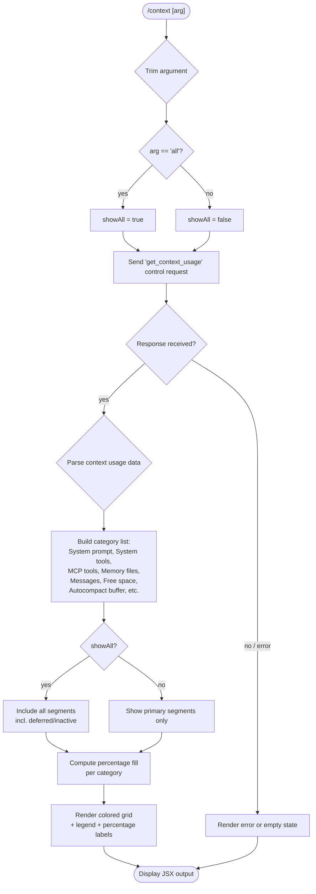

# `/context`

> Analysis basis: CC v2.1.157 bundle.js (AST extraction + Claude interpretation)
> Minimum version: v2.1.157

---

## Overview

`/context` is a local-JSX command that visualizes the current conversation's context window usage as a colored grid. It dispatches a `get_context_usage` control request to retrieve token-consumption data from the host environment, then renders a structured breakdown of how different context categories (system prompt, memory files, tools, messages, etc.) are filling the available context window. An optional `all` argument expands the display to include every tracked context segment.

---

## Registration

| Field | Value |
|---|---|
| type | `local-jsx` |
| name | `context` |
| description | `Visualize current context usage as a colored grid` |
| argumentHint | `[all]` |
| thinClientDispatch | `control-request` |
| module_id | `Gy1` |
| load_inline | `true` |
| loc_byte | `11190115` |
| loc_byte_end | `11190341` |
| loc_line | `6812` |
| arbor_handler.name | `TsL` |
| arbor_handler.fqn | `claude-2.1.157::TsL` |
| arbor_handler.kind | `AsyncFunction` |
| arbor_handler.resolution_path | `module_id` |
| arbor_handler.n_hits | `0` |

Analysis basis: CC v2.1.157 bundle.js:+11190115

---

## Input Branching

The command has 3+ distinct branches based on the argument value and the data returned by the control request.



---

## Behavioral Spec

### Handler: contextCommandHandler (TsL)

The Arbor-resolved handler is `TsL`, an `AsyncFunction` resolved via `module_id` path.

Analysis basis: CC v2.1.157 bundle.js:+11188809

```
async function contextCommandHandler(args, appContext):
    trimmedArg = args.trim()                          // +11188815
    showAll    = (trimmedArg == "all")                // +11188840

    // Dispatch control request to retrieve live context usage
    response = await sendControlRequest("get_context_usage", appContext)
                                                      // +11188875, +11188905

    // Register a data-event listener on the response stream
    listenForData(response, onDataCallback)           // +11188935

    // Retrieve context window segments from app state
    segments = getContextWindowBreakdown(appContext)  // CN6, +11189045

    // Filter segments based on showAll flag
    if not showAll:
        segments = segments.filter(s => s.visible)   // +11186913

    // Find the autocompact boundary marker in segment list
    compactBoundary = segments.find(s =>
        s.type == "compact_boundary")                 // +11187231, +10493635

    // Resolve segment labels
    //   "Free space", "Autocompact buffer", "Project",
    //   "User", "Local", "Flag", "Policy", "Plugin",
    //   "Built-in", "Messages", "System prompt",
    //   "System tools", "MCP tools", "Memory files",
    //   "Skills", "Custom agents", "Permissions"     // literals cluster +11186948..+11188122

    // Compute fill percentage using rounded arithmetic
    totalUsed   = sum(segment.tokenCount for segment in segments)
    fillPercent = Math.round(totalUsed / contextLimit * 100)
                                                      // st -> Math.round, +11188648

    // Format percentage for display (locale "en-US", style "compact")
    formattedPct = formatNumber(fillPercent, "en-US", "compact")
                                                      // HK -> wK, +11186872; literals +211984, +212002

    // Render JSX grid component
    gridElement = renderContextGrid(segments, showAll, compactBoundary)
                                                      // bN6.createElement, +11188939

    // Render summary line (token counts, percentage)
    summaryElement = renderSummary(totalUsed, fillPercent)
                                                      // EH -> String, +11189129

    // Wrap in styled container (max-width 80 columns)
    return wrapOutput(gridElement, summaryElement, width=80)
                                                      // +11189251
```

### Sub-feature: Context Grid Computation (CN6)

```
function buildContextSegments(appState, showAll):
    // Pull system-prompt token estimate
    systemPromptBlock = getSystemPromptTokens(appState)   // "System prompt", +9980979

    // Pull tool blocks
    systemTools = getSystemToolsTokens(appState)           // "System tools", +9981058
    mcpTools    = getMcpToolsTokens(appState)              // "MCP tools", +9981122

    // Pull memory file segments
    memoryFiles = getMemoryFileTokens(appState)            // "Memory files", +9981440

    // Pull message history tokens
    messages = getMessageTokens(appState)                  // "Messages", +9982004

    // Free space = contextLimit - used
    freeSpace = contextLimit - totalUsed                   // "Free space", +11186948

    // Autocompact buffer zone
    autocompactBuffer = getAutocompactBuffer(appState)     // "Autocompact buffer", +11186971

    // Collect all segments in display order
    all = [systemPromptBlock, systemTools, mcpTools,
           memoryFiles, messages, freeSpace, autocompactBuffer]

    if showAll:
        // Also include deferred/inactive tool blocks
        deferredMcpTools    = getMcpDeferredTokens(appState)  // "MCP tools (deferred)", +9981198
        deferredSystemTools = getSystemDeferredTokens(appState)// "System tools (deferred)", +9981284
        all += [deferredMcpTools, deferredSystemTools]

    return all
```

Analysis basis: CC v2.1.157 bundle.js:+11186872 (CN6), +9980965 (HH.push segment loop)

### Sub-feature: Percentage Formatting (st / HK)

```
function formatFillPercent(used, limit):
    raw = used / limit * 100
    rounded = Math.round(raw)               // +210034

    // Threshold labeling
    if rounded < 20:
        label = "< 20"                      // +210014
    else:
        label = rounded.toLocaleString("en-US", {notation:"compact"}) + ".0"
                                            // +209976, literals +211984

    return label
```

Analysis basis: CC v2.1.157 bundle.js:+210031 (st), +209962 (HK)

### Sub-feature: Control Request Dispatch

`/context` uses `thinClientDispatch: "control-request"`, meaning the command sends a `control_request` message with type `get_context_usage` over the bridge transport rather than invoking a local computation directly.

```
async function sendGetContextUsage(appContext):
    // Send control_request via bridge
    requestId = uuid()
    payload = { type: "get_context_usage", requestId }
    appContext.sendControlRequest(payload)           // K.sendControlRequest, +11188875

    // Wait for matching control_response
    response = await waitForControlResponse(requestId)
                                                    // AsH -> K.on "data", +7831929
    return response
```

If the host does not support `get_context_usage`, the bridge replies with the error string `"get_context_usage is not supported in this context (onGetContextUsage callback not registered)"` (Analysis basis: CC v2.1.157 bundle.js:+12379924).

### Sub-feature: Grid Color Legend

The grid assigns one color per context category. Category color tokens found in literals:

| Category Label | Color Token |
|---|---|
| System prompt | `promptBorder` |
| System tools | `inactive` |
| MCP tools | `cyan_FOR_SUBAGENTS_ONLY` |
| Memory files | `claude` |
| Messages | `purple_FOR_SUBAGENTS_ONLY` |
| Skills | `warning` |
| Permissions | `permission` |

Analysis basis: CC v2.1.157 bundle.js:+9981010, +9981088, +9981149, +9981470, +9982030, +9981526, +9981404

---

## State & Side Effects

| Item | Detail |
|---|---|
| Telemetry | No `tengu_*` events fire directly inside the `/context` handler itself at depth ≤ 2. Indirect call through `G6` (context-window accessor) may fire `tengu_pewter_brook` (+3377379) and `tengu_amber_creek` (+3377471). |
| Control request | Emits `control_request` with body `{ type: "get_context_usage" }` over the bridge transport (thinClientDispatch). |
| appState changes | Read-only; does not mutate app state. |
| Sound | None detected. |
| Hook registration | None detected directly in handler. |
| Output | Renders a local JSX component; does not add a message to conversation history. |

---

## Version History

| Version | Change |
|---|---|
| v2.1.157 | Initial analysis |

---

## Common Mistakes

1. **Running `/context` in a non-interactive thin client** — if the host environment does not implement `onGetContextUsage`, the command returns a "not supported" error. Use only in standard CLI / desktop sessions.
2. **Expecting `/context` to show all segments by default** — inactive, deferred MCP/system tool segments are hidden unless `all` is explicitly passed (`/context all`).
3. **Interpreting "Free space" as "available tokens"** — the free-space segment includes the autocompact buffer zone, which Claude Code reserves and does not use for user content directly.
4. **Comparing raw token counts across models** — the context limit varies per model (e.g., 1 000 000, 128 000, 64 000; Analysis basis: CC v2.1.157 bundle.js:+2928178, +2928186, +2928274). The percentage bar is relative to the current model's limit.
5. **Confusing `< 20` label** — fill percentages below 20 % are displayed as the literal string `"< 20"` rather than a numeric value (Analysis basis: CC v2.1.157 bundle.js:+210014).

---

## Appendix — Identifier Mapping

> For bundle debugging only. Identifiers change across versions.

| Identifier | Role |
|---|---|
| `TsL` | Main async handler for `/context` command |
| `Aq` | Fullscreen/terminal environment resolver |
| `B$H` | Terminal type check helper (psK.has) |
| `ED_` | Terminal color-support detector |
| `y1` | "no"/"off" string resolver |
| `CH` | "yes"/"on" string resolver |
| `mr` | Terminal multiplexer detector (tmux/screen) |
| `J77` | iTerm detection + tmux control-mode probe |
| `j77` | Terminal name prefix checker (startsWith) |
| `N` | Process/environment info gatherer (UUID, env vars) |
| `QCK` | Environment info sub-collector |
| `qOA` | Additional env info helpers |
| `RH` | JSON.stringify wrapper |
| `v4` | UUID/path builder |
| `uYA` | mCK.map-based token mapper |
| `EuH` | Write-to-stream helper |
| `VYA` | H.write wrapper |
| `lCK` | Conversation log manager |
| `rxH` | Async queue / batch flusher |
| `M$H` | Log batch writer |
| `g6` | Path join utility |
| `qK6` | Log file key builder (j8) |
| `dYA` | Log path join helper |
| `QYA` | Log file rotation helper (stat/rename/unlink) |
| `cCK` | Log append-file writer |
| `K9` | Hook registrar (_OA.register) |
| `ZD_` | Windows-over-SSH fullscreen disabler |
| `B_` | Settings loader |
| `Cp` | Settings orchestrator (YZ/Z9/Ta8/$Q) |
| `Z9` | Memory usage recorder (process.memoryUsage) |
| `Ta8` | Settings load tracker (Date.now/timers) |
| `$Q` | Settings sub-module loader |
| `IC6` | Post-settings-load initializer |
| `X77` | Fullscreen mode initializer |
| `G6` | Context window state accessor |
| `az6` | Context window open helper |
| `sz6` | Context window close helper |
| `Ex` | Context entry builder |
| `e88` | Context window dedup/merge helper |
| `S6` | Context window segment recorder (Date.now) |
| `V$` | App state accessor for current session |
| `f0H` | Session state field accessor |
| `K` | Control request sender (sendControlRequest / padEnd) |
| `L` | Async promise set manager |
| `f` | Promise finalizer (close streams) |
| `AsH` | Data event listener registrar (K.on "data") |
| `bU` | Bridge write + JSX renderer |
| `EJ_` | Hsq.createElement wrapper |
| `v4H` | Render context grid outer component |
| `_cH` | Context grid inner layout component |
| `CN6` | Context segment list builder (filter/find) |
| `HK` | Number formatter (locale en-US compact) |
| `wK` | rCK locale wrapper |
| `rCK` | Core locale number formatter |
| `ppH` | Grid color palette helper |
| `st` | Percentage rounding helper (Math.round) |
| `EH` | String coercion utility |
| `GsL` | Compact-boundary label resolver |
| `HO` | compact_boundary segment finder |
| `IE8` | Ej-based marker extractor |
| `Ej` | Marker symbol |
| `qZ8` | System prompt / context assembly orchestrator |
| `SZ` | Model/provider resolver |
| `se` | Provider sub-resolver |
| `qN` | Provider key lookup |
| `G9H` | Provider name lookup |
| `bQ` | Model string parser (startsWith / includes) |
| `Z0` | Model info builder |
| `iM` | TA-based model info assembler |
| `w5` | Model context-limit calculator |
| `TA` | CH-based string builder |
| `pN` | Provider fallback resolver |
| `ET` | Auto-compact enablement checker |
| `Q4` | Config reader (legacyGlobalConfig) |
| `qV` | Tool-search feature flag checker |
| `I8` | Settings field accessor ($Q/Ng6) |
| `xl` | Auto-compact window calculator |
| `f9` | Model feature flag resolver |
| `ti6` | B_ settings + Object.entries loader |
| `fw` | Model name normalizer (toLowerCase/includes/replace) |
| `Cp8` | Model capability probe |
| `yP` | String replacement helper |
| `XV` | Context limit resolver (parseInt/isNaN) |
| `E0` | o1H-based limit lookup |
| `ap` | claude-3 model limit resolver |
| `te` | Lw/u5 limit helper |
| `pH8` | Numeric finite limit resolver |
| `f0` | Fallback limit constant |
| `J8H` | CLAUDE_CODE_MAX_OUTPUT_TOKENS parser |
| `mX1` | Auto-compact window configuration reader |
| `R_` | Config reader helper |
| `lc_` | Token window string parser (parseFloat/parseInt/Math.round) |
| `bT` | System prompt assembler (main orchestrator) |
| `x9A` | System prompt CH-builder |
| `h6` | Async store reader (lB6/O_) |
| `lB6` | cB6.getStore caller |
| `O_` | AN-based fallback resolver |
| `JT8` | Tool listing formatter (Object.values/N/_.map) |
| `Av` | Additive system-prompt appender |
| `tX5` | Code-style system prompt segment |
| `eX5` | Task-continuity system prompt segment |
| `Oa6` | Task-reminder segment injector |
| `HP5` | Scratchpad segment builder |
| `U9A` | Additive system prompt segment builder |
| `IP5` | Wrapper for U9A additive segment |
| `YP5` | SDK/schedule/routines prompt segment |
| `Ng` | Feature flag checker |
| `xX` | SDK type string resolver |
| `zP5` | KE-based keyed segment builder |
| `ZV_` | Context-management segment |
| `KE` | H59 keyed entry builder |
| `DL` | Tool deduplication helper |
| `CF` | w_6/zeH/d_ output-style segment |
| `$F` | flatMap/Array.isArray segment mapper |
| `PY6` | Memory system prompt assembler |
| `Y4` | Memory config reader |
| `f4H` | Memory dir mkdir/j8/N helper |
| `Ir` | Memory dir isFile/isDirectory checker |
| `hH` | d-based error/path helper |
| `zw` | G6 context-window writer for memory |
| `Ggq` | Team memory path builder |
| `Wgq` | aEH memory scope builder |
| `Pgq` | aEH private memory scope builder |
| `CY_` | aEH memory combined builder |
| `d` | Error/result wrapper |
| `WP5` | Env-info static system prompt builder |
| `sw` | Model display-name resolver (TA/toLowerCase) |
| `u9A` | f9-based simple env info builder |
| `PP5` | Full env-info system prompt builder |
| `p9A` | OS info reader (BCH.version/release/type) |
| `HM` | Working directory segment |
| `m9A` | Shell detector (zsh/bash/PowerShell) |
| `qP5` | Language system prompt segment |
| `KP5` | Output-style system prompt segment |
| `TP5` | Background-session (worktree/none) segment |
| `Dm_` | B_ worktree settings reader |
| `ZP5` | Scratchpad/tmp segment builder |
| `RqH` | G6 scratchpad context-window writer |
| `Q2H` | Scratchpad path builder (j4.join/EA6/k6) |
| `VP5` | Brief-mode system prompt segment |
| `kP5` | Focus system prompt segment (R_/B_/S6/P$) |
| `jP5` | Heron-brook system prompt segment (CH/G6/N) |
| `AP5` | Reproduce-verify-workflow segment (S6/G6) |
| `Gk9` | MCP dynamic context injector (nMH/Promise.all) |
| `nMH` | MCP context fetch helper |
| `Np8` | MCP context post-processor |
| `wP5` | GrowthBook segment injector |
| `LP5` | Agent-memory segment injector |
| `fP5` | System auto-compact segment builder |
| `_P5` | Auto-compact reminder text |
| `MP5` | Verified-vs-assumed segment (G6/$F) |
| `$P5` | U9A wrapper for custom additive segment |
| `OP5` | Tool-pear (x0/$F/xX) segment builder |
| `x0` | Tool entry builder (Ad/y1/CH/G6) |
| `DP5` | $F-based deferred segment |
| `ygq` | Memory + team-memory combined context |
| `Igq` | Team memory enablement checker |
| `UzH` | UZ/u5/TA combined context writer |
| `UZ` | _3_/WEH combined helper |
| `u5` | TA-based utility |
| `zm` | System prompt final assembler |
| `EK` | Environment constant |
| `qC` | CH/jZ/d_ context segment formatter |
| `jZ` | Context segment joiner |
| `d_` | Context segment finalizer |
| `Z_` | Module init (UWH/gR6.call/QR6.bind/sfA.set) |
| `QR6` | Module bind helper |
| `M` | File-system cache manager (cS6/f.has/A0.rm) |
| `cS6` | Plugin path resolver (RI.join/relative/isAbsolute) |
| `XD` | Context assembly post-processor |
| `LuL` | Full context window token analyzer |
| `KuL` | Token segment string parser (H.match/split/trim) |
| `LZ8` | Per-session context loader |
| `GP5` | Per-session system prompt builder |
| `hgq` | Memory prompt builder for session |
| `UAK` | Section header parser (H.indexOf/slice) |
| `_66` | Token segment analyzer (bSH/N/EH/SH/BX1) |
| `bSH` | Built-in tool token analyzer |
| `SH` | F_/CH/L1/X_4 error logger |
| `BX1` | Global/count token segment analyzer |
| `fuL` | File-based context segment loader |
| `GJ6` | G6 context filter |
| `MuL` | MCP context segment loader |
| `$PH` | Per-segment token counter (Promise.all/H.map/fZ8) |
| `fZ8` | Tool token counter (TA/hP5/P$/G6) |
| `z` | Process manager (hH/bH/hy/Fm) |
| `bH` | d-based background helper |
| `hy` | Zx/fd.push/FEH/xz_ output writer |
| `Fm` | Promise.race/all process supervisor |
| `T` | Jv6/Lx8 task handle |
| `Jv6` | Task reference A |
| `Lx8` | Task reference B |
| `X` | Buffer/IPC message writer (Buffer.concat/J.indexOf) |
| `J` | w-based IPC stream |
| `w` | Process/subprocess supervisor (A.get/S.kill/G6/cF.spawn) |
| `Qf` | H.end/RH stream finisher |
| `pB5` | Main IPC protocol handler (large multi-method) |
| `zuL` | Per-message token counter with rounding |
| `Rf` | Math.round wrapper |
| `O` | k8-based output handler |
| `k8` | Output key constant |
| `D` | Process lifecycle manager (G6/$.dispose/Date.now) |
| `$` | Ls1-based stream |
| `uy8` | i6/G6 macOS memory helper |
| `YfA` | Background spare session spawner |
| `kz` | Process cleanup helper |
| `j8` | File key builder |
| `YuL` | Conversation message token summarizer |
| `$uL` | yV_/h6/UX1/$PH context usage aggregator |
| `yV_` | IW/b8H/Ng MCP filter |
| `b8H` | H.filter/_.some/p8K MCP server filter |
| `UX1` | ZK-based permission checker |
| `ZK` | Object.hasOwn/dFq.get/cFq.has recursive checker |
| `JuL` | Conversation token set builder |
| `DuL` | RH/Rf tool-result token counter |
| `wuL` | Rf/RH/A.get message token counter |
| `juL` | RH/Rf attachment token counter |
| `ZT` | Full message-history token analyzer (large) |
| `wQL` | mv6/K.push/q.push/q.reverse block builder |
| `ci_` | Context window block filter |
| `GQL` | x_9 block resolver |
| `WQL` | q2_/K2_/L2_/t18/f2_/KlH block type handlers |
| `TQL` | Array.isArray/A.some/_.has block type checker |
| `h` | Xd/Date.now/Math.min/cXK focus state manager |
| `VE8` | _.some tool-result validator |
| `CQL` | Nv.randomUUID canonical block ID generator |
| `E8` | X/Nv.randomUUID/J block entry builder |
| `UT` | Block usage tracker |
| `Fg_` | Block filtering helper |
| `vE8` | NE8/AZ1/vQL block version handler |
| `Ik` | Al_/N/TA/u5 system-standard block builder |
| `oi_` | Array.isArray/_.some/_.map/Ts role mapper |
| `jQL` | Array.isArray/A.some/Ts/_.has/VZ content checker |
| `E` | Block type set |
| `V` | Block version set |
| `JQL` | H.some/Array.isArray message type checker |
| `RQL` | Array.isArray/_.get/nq/hQL.has/SQL.has MCP tool filter |
| `y4` | Block key resolver |
| `GZ1` | Block group resolver |
| `EQL` | N/A.filter/q.some/HZ1 block content validator |
| `HZ1` | d/f.push/M.push error accumulator |
| `Ol_` | Large message block normalizer |
| `bQL` | _.push/ii_/_.join/A.trim text concatenator |
| `G` | b.preventDefault/h0/Y/H input event handler |
| `ZQL` | NE8/AZ1/NQL version reconciler |
| `ZZ6` | Array.isArray/K.some/_.add/L.every/_.has/H.slice orphan-thinking filter |
| `gQL` | H.at/A.at/xV6/d/A.slice trailing-thinking filter |
| `TZ6` | Array.isArray/BT1/f.some/A.add/H.filter whitespace filter |
| `QQL` | Array.isArray/d/H.slice empty-assistant fixer |
| `VQL` | _.at/H.slice/_.push/E8/UT/_Z1 content slice builder |
| `eT1` | H.map/Array.isArray/A.some/K.push/L.findLastIndex block merger |
| `_Z1` | A.at/vE8/A.push version builder |
| `PQL` | Array.isArray/$.every/$.filter/O.join/K.slice/H.slice block filter |
| `OuL` | hV_/h6/UX1/$PH/cG/K.map/DL/SV6/IW/SH/F_ MCP segment loader |
| `hV_` | b8H/IW/Ng MCP server filter |
| `cG` | _1/f9/Km4.has tool config resolver |
| `_1` | H.trim/_.toLowerCase/E0/i1H/pN/LFH/Z0/iM/Co6/fFH tool name normalizer |
| `SV6` | Rf/yc_ token scale calculator |
| `yc_` | Token scale helper |
| `F_` | Error/String error wrapper |
| `hAH` | Math.min/a7H/ET/xl max-output token cap |
| `a7H` | mzH/J8H output token resolver |
| `mzH` | f9/BIq/Math.min model output limit calculator |
| `HH` | G.current/Q.setTimeout/N/a recording/timer manager |
| `Q` | mN6/zh1 file read/unlink manager |
| `mN6` | vm.readFile/BPH/P8/V9 file reader |
| `zh1` | vm.unlink/BPH/P8 file unlinker |
| `a` | w/c process+stream holder |
| `c` | vS8 stream helper |
| `i78` | X8H/vnH.has context usage validator |
| `X8H` | vnH.has usage-record checker |
| `pc` | R_/G6 context-window prompt reader |
| `nH` | LH.setOnConnect/clearTimeout/N/w8/B/d/I6/O6/LH.setOnData/Xo1/w/uH/Po1/LH.setOnClose/E6 MCP server session manager |
| `LH` | AH.has/f8/RH/d/rV6/PEK/oV6/jl/y.enqueue/cj.randomUUID/k6/AH.add MCP server connection handler |
| `AH` | vH.abort/y/p4K/_6.delete/e/OH/String/E/k/mH.delete MCP connection abortable |
| `f8` | YpH.push/Vi.logMCPDebug debug logger |
| `rV6` | aV6/SL MCP response router |
| `PEK` | q elicitation form handler |
| `oV6` | sV6/jl/SL MCP output handler |
| `jl` | j7/eW notification handler |
| `y` | z.write/d async queue writer |
| `k6` | AN key builder |
| `w8` | rq4/g6/RH/L.appendFileSync/L.mkdirSync/GkA.dirname log writer |
| `rq4` | Log rotate helper |
| `B` | VH.filter/dH.has MCP tool permission filter |
| `VH` | LB/Array.isArray/GH.some/tb1.readFile/p6/N/v6 plugin file loader |
| `dH` | E permission state store |
| `I6` | b6.filter/u6.slice/N/M/u6.at/uH/LH.writeBatch MCP message batcher |
| `b6` | zB1/F6/cK.createElement/Y6/k8 MCP message renderer |
| `u6` | MCP message buffer slice |
| `uH` | Math.min/x.slice/kH.writeMessages message writer |
| `O6` | zH.end/_H.add/M/b6.some/uH/N/LH.writeBatch MCP session finalizer |
| `zH` | MCP session stream |
| `_H` | Object.keys/KH.map/Array.from/VH.has/JH.has/KH.some/_H/l6.cleanup/uW1/H.sendMcpMessage/aA/$/L6.some/Rp/y49/qEK MCP server state manager |
| `Xo1` | EM8/p6/z$5/N/Y$5/r8A/_.has/A.has/A.add/d/hH/EH/bH bridge message parser |
| `EM8` | Bridge message type constant |
| `p6` | JSON.parse wrapper |
| `z$5` | Bridge request-ID extractor |
| `Y$5` | Bridge response matcher |
| `r8A` | Bridge message uuid extractor |
| `Po1` | N/A.write/Y/EH/D/w/j/J/k bridge message dispatcher |
| `Y` | u2H/q.write/Re1/f.get/G.stop/f.delete/E.stop/E.updateConfig/E.start/FVK/f.set/V.start/d session lifecycle manager |
| `j` | A.values/y.kill subprocess killer |
| `k` | N/Date.now/w08/eb5/cXK/V/uf8/bH/_/zZ1/g.at/g.slice/hH stall detector |
| `E6` | mq.startsWith/mq.slice/J4.indexOf/n9.push/Nq.push/J4.slice/UA/n9.join plugin message router |
| `mq` | Y6/nH plugin message type A |
| `J4` | nH/rH/HH.push plugin message type B |
| `n9` | Y6/vH/nH plugin output buffer |
| `Nq` | h.push/vH/Y6/nH plugin header buffer |
| `UA` | console.error/j6.red/ej/process.exit fatal error handler |
| `wH` | H-based working-directory list |
| `WH` | G6 context window writer |
| `kH` | O/V/_H MCP message write handle |
| `rH` | Promise.all/Promise.resolve/IpH/U38/SH/Object.keys/Qc/MEK/performance.now/v6/CH/oT/N/EH MCP server reconciler |
| `IpH` | Date.now/w8/_/A log timestamp helper |
| `U38` | Session metrics reporter |
| `Qc` | _26/r8H/xjH/gc/v$8/D0/q.has/H26/Object.assign MCP settings reconciler |
| `_26` | Dh/w1H settings field builder |
| `r8H` | Y2/Dh/Object.entries/ujH/Aj/Of/iz/N/Promise.all/L$8/knH/D0/w/D.add/Object.assign/yk/D.has/No7/k.split/Y.push/y.slice/D.delete MCP server reconciler |
| `gc` | Object.entries/ujH/A.push MCP config entry builder |
| `v$8` | sk_/j6.red/j6.yellow MCP status colorizer |
| `H26` | T$8/Object.entries/yk/V$8/yI9/ALH/q.has/q.set/q.get/N/L.push MCP tool registry |
| `MEK` | fB/N/vT8/eXH/F0/g6/ow9/aw9/Object.keys/Xm/IpH/yb8/ew9/LEK/jS8/EH/d headless plugin installer |
| `fB` | CH-based plugin field extractor |
| `vT8` | zwH/mf/tRL/Object.entries/A.has/eRL/N/A.add/sY/Ws marketplace version tracker |
| `eXH` | ET8.clear marketplace cache cleaner |
| `F0` | N/yC6/vz/p3A feature flag checker |
| `ow9` | SX6/Error/Mh.join marketplace join error |
| `aw9` | SX6/Error/Mh.join plugin zip cache error |
| `Xm` | XNH/B_/Object.entries/BA/dT_ plugin settings reconciler |
| `yb8` | Xm/Object.keys/mf/N/EH/mLA/O_/A2K/L.push/Sp/E7/f.push/f.map/HPH/M.push/$.push/O.push/Wj1 plugin install executor |
| `ew9` | Plugin diff reporter |
| `LEK` | Ek/Object.entries/zU5/N/$U5/OU5 MCP plugin entry normalizer |
| `jS8` | mb1/fG/U86/Ek/Object.keys/oV/NW5/$.some/wfH/N/EH/pb1/q.push MCP tool schema builder |
| `v6` | Qc/$$H/Object.keys/Object.entries/mH/_H/N MCP server state writer |
| `$$H` | Object.assign state merge |
| `mH` | KH.map/Object.keys/Object.entries/qI_/yEK/Object.fromEntries/L6.has/Object.assign/aA/$/l6.some/Rp/QH.then MCP server config updater |
| `oT` | Math.round timing rounder |
| `BH` | bU_ session cache map |
| `bU_` | RH session cache entry builder |