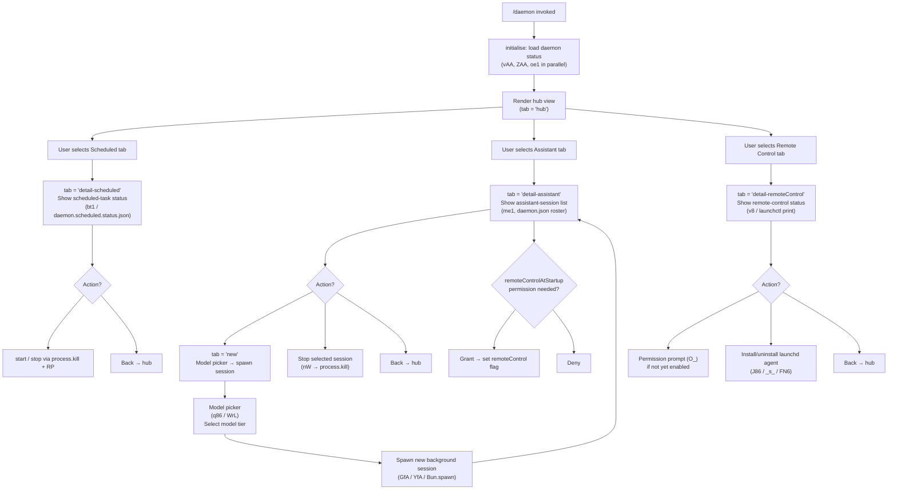

# `/daemon`

> Analysis basis: CC v2.1.157 bundle.js (AST extraction + Claude interpretation)
> Minimum version: v2.1.157

---

## Overview

The `/daemon` command provides a full-screen interactive management interface for Claude Code's background service layer. It surfaces three subsystems — **assistant sessions**, **scheduled tasks**, and **remote control** — letting the user inspect status, start/stop services, adjust the model, and tail log output from a single TUI panel. The command is of type `local-jsx`, meaning it renders a React/Ink component tree rather than producing a prompt for the agent.

---

## Registration

| Field | Value |
|---|---|
| type | `local-jsx` |
| name | `daemon` |
| description | `Manage background services: assistants, scheduled tasks, and remote control` |
| immediate | `true` |
| module_id | `kAA` |
| load_inline | `true` |
| loc_byte | `12661705` |
| loc_byte_end | `12661909` |
| loc_line | `8787` |
| arbor_handler.name | `yY5` |
| arbor_handler.fqn | `claude-2.1.157::yY5` |
| arbor_handler.kind | `AsyncFunction` |
| arbor_handler.resolution_path | `module_id` |
| arbor_handler.n_hits | `0` |

Analysis basis: CC v2.1.157 bundle.js:+12661705

---

## Input Branching

The command presents a multi-tab navigation UI with at least five distinct top-level display states (hub, detail-scheduled, detail-assistant, detail-remoteControl, and a "new" sub-view within assistant detail), plus transient modal states for permission prompts. A Mermaid flowchart is used.



---

## Behavioral Spec

### 1. Top-level async initialisation (`yY5`)

The Arbor-resolved main handler (`yY5`) is an `AsyncFunction` reached via `module_id` → `kAA`.

```
async function daemonCommandHandler(context):
    [daemonData, assistantDir, sessionList] = await Promise.all([
        loadDaemonStatusData(),    // vAA
        resolveAssistantDir(),     // ZAA
        buildSessionOverview()     // oe1
    ])
    renderDaemonUI(daemonData, assistantDir, sessionList)
```

Analysis basis: CC v2.1.157 bundle.js:+12650455

---

### 2. Daemon status aggregation (`vAA`)

Collects status from three independent service files concurrently.

```
async function loadDaemonStatusData():
    rawConfig = await readScheduledConfig()           // de1
    assistantStatus = await readAssistantStatus()     // me1
    scheduledStatus = await readScheduledStatus()     // bt1 → "daemon.scheduled.status.json"
    mainDaemonStatus = await readMainDaemonStatus()   // Ms1 → "daemon.status.json"
    rosterData = await readRosterFile()               // TF  → "roster.json"
    serviceInfo = await queryLaunchdService()         // sl  → launchctl print
    return aggregate(rawConfig, assistantStatus, scheduledStatus,
                     mainDaemonStatus, rosterData, serviceInfo)
```

Analysis basis: CC v2.1.157 bundle.js:+12649976

---

### 3. Scheduled-task configuration reader (`de1`)

```
async function readScheduledConfig():
    [configEntries, processStatus, pidInfo] = await Promise.all([
        loadScheduledEntries(),    // r_6  (reads files tagged "scheduled")
        queryServiceStatus(),      // SH
        readPidInfo()              // nW
    ])
    return { configEntries, processStatus, pidInfo }
```

`r_6` iterates task definitions, calling `loadTaskFile()` (`h_A`) which:
- Opens each task file with `readFile` (encoding: `"utf8"`)
- Trims whitespace and calls `JSON.parse`
- Validates that the result `Array.isArray` before returning

Analysis basis: CC v2.1.157 bundle.js:+12644678

---

### 4. Assistant session reader (`me1`)

```
async function readAssistantStatus():
    sessionDir = buildSessionDir()     // u2H → resolves ENOENT gracefully
    daemonCfg  = readDaemonJson()      // FC  → "daemon.json"
    pidData    = readPidFile()         // nW
    sessionNames = sessions.map(s => path.basename(s))   // pfH.basename
    return { sessionDir, daemonCfg, pidData, sessionNames }
```

`u2H` handles the `"ENOENT"` error code (file not found) gracefully — it checks `err.code === "ENOENT"` and returns a safe empty result rather than propagating the error.

Analysis basis: CC v2.1.157 bundle.js:+12638192

---

### 5. PID-file reader and process-kill helper (`nW`)

```
async function readPidAndMaybeKill(action):
    pid = await readPidFromFile()   // mN6 → vm.readFile → JSON.parse via V9
    if action == "stop":
        process.kill(pid, signal)
        await waitForExit()         // aa_ → reads /proc or ps slice
        notifyResult(RP)
    return pid
```

`aa_` reads a `/proc`-style or `ps`-output file, splits on whitespace, and slices the relevant columns to extract process metadata.

Analysis basis: CC v2.1.157 bundle.js:+11228327

---

### 6. Roster file parser (`TF`)

Reads the roster of running background sessions.

```
async function readRosterFile():
    raw = await fs.readFile(rosterFilePath)   // "roster.json"
    parsed = JSON.parse(raw)
    if not valid(parsed):
        emit telemetry("tengu_bg_roster_parse_failed")
        throw Error
    normalise timestamps via Ms_()   // Ms_ uses Date.now()
    entries = NtL(parsed)            // validates Array.isArray + Object.keys
    return entries
```

File path is built by joining with `h3.join` through `ffH → RRH`.

Analysis basis: CC v2.1.157 bundle.js:+11238449

---

### 7. launchd service query (`sl` / `v8` / `G_`)

Used to surface remote-control daemon status on macOS.

```
async function queryLaunchdService():
    result = runCommand("launchctl", ["print", serviceIdentifier])
    // timeout: 5000 ms (literal at +11232397)
    return parseServiceOutput(result)   // G_ parses stdout
```

`G_` invokes error logging (`SH`) if the exit code is non-zero and tracks a buffer limit of 10 items (literal `10` at +1049606) with a 1 000 000-byte cap (literal at +1050128).

Analysis basis: CC v2.1.157 bundle.js:+11232347

---

### 8. Model picker and session spawner (`q86` / `WrL` / `GfA` / `YfA`)

When the user selects **new assistant session**, the model-picker component (`WrL`) is mounted.

```
function modelPickerComponent(props):
    models = buildModelList()   // WrL aggregates tier constants
    // Tier options surfaced (from literals):
    //   "default", "opus", "sonnet", "haiku",
    //   "opus[1m]", "sonnet[1m]", "opusplan",
    //   gateway-sourced models ("gateway-models.json")
    selected = userPicks(models)
    return selected
```

After model selection, `GfA` (session lifecycle manager) calls `YfA` to spawn the subprocess:

```
async function spawnBackgroundSession(model, options):
    token   = randomBytes(hex)                 // jVK.randomBytes
    sockDir = path.join(dataDir, token)
    fs.mkdir(sockDir)
    child = Bun.spawn([execPath, "--bg-pty-host", "200", "50",
                       "--", "--bg-spare"], { stdin: "ignore" })
    // "--bg-pty-host" cols=200 rows=50, literal at +15446187/+15446205/+15446211
    child.unref()
    // idle timeout: 300 000 ms (literal at +15473715)
    // spare-refill telemetry: "daemon_bg_spare_refill"
```

Analysis basis: CC v2.1.157 bundle.js:+10834292 (WrL), +15445842 (YfA)

---

### 9. Session lifecycle states (`GfA`)

Background sessions transition through a defined set of string-keyed states:

| State string | Meaning |
|---|---|
| `"spare"` | Pre-warmed, unclaimed |
| `"exec"` | Being promoted to active |
| `"done"` | Completed normally |
| `"killed"` | Terminated by signal |
| `"failed"` | Non-zero exit |
| `"crashed"` | Unexpected exit |
| `"blocked"` | Waiting on permission |
| `"working"` | Processing a task |
| `"bg"` | Running in background |
| `"idle"` | Waiting for next task |
| `"active"` | Claimed by a foreground session |
| `"resuming"` | Being reconnected |

Analysis basis: CC v2.1.157 bundle.js:+15472148 through +15473929

---

### 10. Remote-control install / uninstall (`J86`, `_s_`, `FN6`)

```
async function installRemoteControlAgent():
    agentPlistPath = path.join(homedir(), "Library", "LaunchAgents", ...)
    // Hs_ builds the path: "Library" + "LaunchAgents" literals at +11229135/+11229145
    writeAgentPlist(agentPlistPath)
    runLaunchctl("kickstart", agentPlistPath)

async function uninstallRemoteControlAgent():
    runLaunchctl("bootout", agentPlistPath)   // "bootout" literal at +11230908
    fs.unlink(agentPlistPath)
    // Note: "service uninstall not available on darwin" literal at +11231040
    //       is emitted as a warning on non-macOS platforms

async function restartRemoteControlAgent():
    sendSIGTERM(pid)
    waitUpTo(200 polls × 50 ms = 10 s)   // literals at +11231425/+11231564
    if not exited:
        logError("daemon did not exit within 10s of SIGTERM; restart aborted before kickstart")
    runLaunchctl("kickstart")
```

Analysis basis: CC v2.1.157 bundle.js:+11230880, +11231154

---

### 11. Send-claim protocol (`DfA` / `IB5`)

When the daemon hub promotes a spare session to active, it opens a Unix socket and sends a claim frame.

```
async function sendClaimToSpare(sockPath, claimData):
    frame = buildClaimFrame(claimData)   // IB5 → cF.buildClaimFrame
    // frame is a length-prefixed binary envelope (DF):
    //   4-byte big-endian length (writeUInt32BE)
    //   1-byte message type (writeUInt8)
    //   payload bytes (_.copy)
    socket = net.connect(sockPath)
    socket.write(frame)
    await waitForAck(timeout: 2000 ms)   // literal at +15447007
    // On timeout → emit "daemon_bg_sendclaim_failed"
    // On ECONNREFUSED → retry / mark spare as failed
```

Analysis basis: CC v2.1.157 bundle.js:+15447524

---

### 12. Memory pressure monitor (`uy8` / `w`)

The background session dispatcher periodically checks free memory.

```
function checkMemoryPressure():
    freeMB = os.freemem() / 1024   // literal 1024 at +12729109
    if freeMB < threshold:
        emit telemetry("tengu_bg_low_mem_mb", { freeMB })
        emit telemetry("tengu_bg_dispatch_low_mem")
        pauseSpareRefill()
    // platform check: "macos" literal at +12729060
```

The main session-dispatch loop (`w`) also escalates to `SIGKILL` when SIGTERM does not terminate a session within the grace window (literals: 30 s / 15 s at +15466906/+15466917).

Analysis basis: CC v2.1.157 bundle.js:+12729053, +15466951

---

### 13. Hub UI component (`NAA`)

The root JSX component mounts with React hooks and co-ordinates all sub-panels.

```
function DaemonHubComponent(props):
    [tab, setTab] = useState("hub")   // j1.useState
    clock = useClock()                 // oA → xaq.useContext
    // "useClock must be used within a ClockProvider" error guard at +3764103
    inputHandler = useInputHandler()   // RK → fo hooks
    sessionMap   = useSessionStore()   // J → w (Map of sessions)
    assistantCtrl = useAssistantCtrl() // Y
    scheduler     = useScheduler()     // E
    remoteControl = useRemoteCtrl()    // G → handles "remoteControlAtStartup" key

    render switch(tab):
        "hub"                 → HubPanel
        "detail-scheduled"    → ScheduledDetailPanel
        "detail-assistant"    → AssistantDetailPanel
        "detail-remoteControl"→ RemoteControlDetailPanel
        "new"                 → NewSessionPanel (model picker)
```

The string key `"hub"` appears at literal +12650793; detail-tab names at +12651286/+12651444/+12651565; `"new"` at +12651384.

Analysis basis: CC v2.1.157 bundle.js:+12650666

---

## State & Side Effects

| Item | Detail |
|---|---|
| Telemetry — `tengu_bg_roster_parse_failed` | Emitted when `roster.json` cannot be parsed (bundle.js:+11238539) |
| Telemetry — `tengu_config_parse_error` | Emitted on general config JSON parse failure (bundle.js:+3210553) |
| Telemetry — `tengu_feature_ok` / `tengu_feature_bad` / `tengu_feature_sad` | Feature-gate probes (bundle.js:+966033/+966091/+966168) |
| Telemetry — `tengu_daemon_control` | Emitted on daemon start/stop control actions (bundle.js:+15502788) |
| Telemetry — `tengu_bg_dispatch_sigkill_escalate` | SIGTERM → SIGKILL escalation event (bundle.js:+15466951) |
| Telemetry — `tengu_bg_low_mem_mb` | Low free-memory reading (bundle.js:+12729087) |
| Telemetry — `tengu_bg_dispatch_low_mem` | Dispatch paused due to memory pressure (bundle.js:+15467530) |
| Telemetry — `tengu_bg_spare_enable` | Spare-session pool re-enabled (bundle.js:+15468225) |
| Telemetry — `tengu_bg_sendclaim_failed` | Claim frame delivery timeout (bundle.js:+15447680) |
| Telemetry — `tengu_daemon_config_reload` | Config reloaded at runtime (bundle.js:+15481439) |
| Telemetry — `tengu_bg_spare_claim` | Spare session successfully claimed (bundle.js:+15468346) |
| Telemetry — `tengu_bg_spare_spawn` | New spare session spawned (bundle.js:+15466644) |
| Telemetry — `tengu_bg_spare_claim_fail` | Spare claim failed (bundle.js:+15468609) |
| Telemetry — `tengu_bg_session_create` | Background session created (bundle.js:+15467261) |
| Telemetry — `daemon_bg_spare_refill` | Spare pool refill triggered (bundle.js:+15445881) |
| File reads | `daemon.json`, `daemon.status.json`, `daemon.scheduled.status.json`, `roster.json`, `gateway-models.json`, `pins.json` |
| File writes / deletes | Socket directory creation, agent plist, unlink on stop |
| Process signals | `SIGTERM` then `SIGKILL` for stop; `process.kill(pid, sig)` |
| launchd interaction | `launchctl print`, `launchctl kickstart`, `launchctl bootout` (macOS only) |
| Subprocess spawn | `Bun.spawn([..., "--bg-pty-host", "200", "50", "--", "--bg-spare"])` |
| appState changes | `remoteControlAtStartup` flag, session map (get/set/delete), config reload |
| Sound | <!-- TODO: not found in depth-2 traversal; needs --depth 4 --> |
| Hook registration | `_OA.register` (via `K9` / log-sink registration path) |
| Unix socket | `net.connect(sockPath)` for send-claim; `z.write` for supervisor pipe |

---

## Version History

| Version | Change |
|---|---|
| v2.1.157 | Initial analysis |

---

## Common Mistakes

1. **Expecting a text response**: `/daemon` is `local-jsx` with `immediate: true` — it renders an interactive TUI immediately and never sends a prompt to the model. Scripting tools that wait for text output will hang.
2. **Platform assumptions**: Remote-control install/uninstall via `launchctl` is macOS-only. On other platforms the command shows a warning (`"service uninstall not available on darwin"`).
3. **Killing the daemon from outside**: The daemon uses a two-stage termination (SIGTERM → SIGKILL with a 10-second grace window). Sending SIGKILL directly skips teardown and may leave stale socket files.
4. **Stale `daemon.status.json`**: The UI reads the status file at mount time; it does not hot-reload. Re-open `/daemon` to get current state after external changes.
5. **Spare-session pool confusion**: Sessions in `"spare"` state are pre-warmed processes and are listed in the roster. They are not idle user sessions — do not stop them manually unless you want to shrink the warm pool.
6. **Memory-pressure throttling**: On macOS with < 1 024 MB free RAM the spare-refill logic is suppressed; the UI may show fewer available sessions than expected without any visible error.

---

## Appendix — Identifier Mapping

> For bundle debugging only. Identifiers change across versions.

| Identifier | Role |
|---|---|
| `yY5` | Arbor-resolved main async handler for `/daemon` (entry point) |
| `mY5` | Alternate top-level render entry seen in callGraph (BFS root) |
| `NAA` | Root daemon hub JSX component (mounts tab state, hooks) |
| `vAA` | Daemon status aggregator (fan-out to all status readers) |
| `de1` | Scheduled-task config reader (parallel fetch) |
| `r_6` | Scheduled-task entry file iterator |
| `h_A` | Individual task-file loader (readFile + JSON.parse) |
| `AAA` | Array.isArray validator for task lists |
| `SH` | Service status query helper / error logger |
| `nW` | PID-file reader and process-kill dispatcher |
| `mN6` | PID file JSON parser |
| `aa_` | Process-metadata extractor (reads proc/ps output) |
| `RP` | Result notification / error reporter |
| `me1` | Assistant session status reader |
| `u2H` | Session directory resolver (ENOENT-safe) |
| `s9` | AsyncLocalStorage store getter |
| `TAA` | Session aggregator helper |
| `EH` | String error coercion helper |
| `K` | Session display formatter (padEnd columns) |
| `FC` | `daemon.json` reader (joins path via `sa_`) |
| `Ms1` | `daemon.status.json` reader + stop handler |
| `uI6` | Status file path builder (`Ks1.join` + `F8`) |
| `bt1` | `daemon.scheduled.status.json` reader + stop handler |
| `Ct1` | Scheduled status file path builder |
| `TF` | Roster file (`roster.json`) parser and validator |
| `Ms_` | Timestamp normaliser using `Date.now` |
| `NtL` | Roster entry structure validator |
| `ffH` | Roster file path builder |
| `RRH` | Roster directory path builder |
| `vh1` | Roster file atomic rename helper |
| `sl` | launchd service query dispatcher |
| `v8` | launchctl command runner |
| `G_` | launchctl stdout parser |
| `Dv8` | launchd service detail fetcher |
| `jh1` | UID lookup via `process.getuid` |
| `ZAA` | Assistant directory resolver (stat + homedir) |
| `$F6` | Path stat helper with error handling |
| `oe1` | Session overview builder (mounts `q86`) |
| `q86` | Session list component (model picker + session table) |
| `WrL` | Model-picker component (renders all model tiers) |
| `WA` | Model entry base component |
| `AHH` | "max" plan model entry |
| `FOH` | "team" / "default_claude_max_5x" model entry |
| `MFH` | "enterprise" / "enterprise_usage_based" model entry |
| `bV8` | Default-model entry with description |
| `IP` | First-party model entry |
| `Da` | Gateway-model entry |
| `Ka_` | Model sub-action handler |
| `vk1` | Opus (1M context) model entry |
| `XLH` | Gateway model detail entry |
| `Vk1` | Opus model entry |
| `yk1` | Opus 4.8 (1M) model entry |
| `Ik1` | Opus base model entry |
| `Gk1` | Model-group header component |
| `Zk1` | Sonnet (1M) model entry |
| `Pk1` | Sonnet model-group |
| `Wk1` | Sonnet model entry |
| `Tk1` | Sonnet (1M) variant entry |
| `Ek1` | Haiku model-group |
| `kk1` | Haiku model entry |
| `$rL` | Opus Plan mode entry |
| `YrL` | Opus 4.7 (1M) entry |
| `Jk1` | Gateway model list loader |
| `Dk1` | Gateway model entry renderer |
| `jk1` | Gateway-models.json path builder |
| `GrL` | Model-picker interaction handler |
| `sw` | Model case-insensitive match helper |
| `f9` | Model type filter (inference-profile check) |
| `pN` | Model picker "no results" panel |
| `LFH` | Model picker footer component |
| `GfA` | Background session lifecycle manager (spawn, claim, state transitions) |
| `YfA` | Spare-session subprocess spawner (`Bun.spawn`) |
| `DfA` | Send-claim protocol handler |
| `IB5` | Claim frame builder |
| `DF` | Binary frame encoder (UInt32BE length prefix) |
| `a9A` | Session metadata writer (mkdir + writeFile) |
| `yB5` | Claim timeout / retry handler |
| `t9` | Session roster entry manager |
| `G86` | Scheduled-task runner (TF + timestamp) |
| `MfH` | Daemon socket path builder |
| `QT` | Roster entry socket-path resolver |
| `GF` | Session folder path builder |
| `gN6` | Session directory creator |
| `Y` | Assistant manager (start/stop/updateConfig) |
| `D` | Session dispatch loop (memory check, SIGKILL escalation) |
| `w` | Session map manager (get/set/kill/freemem) |
| `S` | Session supervisor entry (realpath + stat + SH + write) |
| `dVK` | Session realpath resolver |
| `HF5` | Supervisor notification writer |
| `uy8` | macOS memory-pressure reader |
| `G6` | Background session state machine |
| `Lw6` | Pins file reader (`pins.json`) |
| `XP_` | Pins file path builder |
| `sX7` | Plugin directory scanner |
| `B` | MCP-tool permission filter |
| `VH` | Plugin manifest reader (`.claude-plugin` / `marketplace.json`) |
| `dH` | Orphaned-permission tracker |
| `J86` | Remote-control agent uninstall handler |
| `Hs_` | LaunchAgents directory path builder |
| `FN6` | Remote-control agent restart handler |
| `_s_` | Remote-control agent start/kickstart helper |
| `E` | Scheduled-task controller (start/stop/updateConfig) |
| `G` | Remote-control key-press handler (`remoteControlAtStartup`) |
| `h0` | Settings key handler |
| `U_` | Settings loader (policy/flag/user/project/local layers) |
| `ZO` | Settings composite reader |
| `Ga8` | Per-layer settings merger |
| `$Q` | Settings layer dispatcher |
| `wP` | Settings helper (Ni) |
| `iGH` | Settings cache invalidator |
| `yL6` | Atomic settings file writer |
| `vz` | Cache clear helper |
| `bF6` | Git-aware settings tracker |
| `cb` | `.claude/settings.json` path builder |
| `Cp` | Settings change applicator |
| `O_` | React ink element renderer / permission-prompt renderer |
| `AN` | Ink element creator |
| `P` | MCP connection manager (stdio/sse/http/dynamic) |
| `J` | Foreground session map wrapper |
| `z` | Input / key-event router |
| `hH` | "daemon_stop" event emitter |
| `bH` | "daemon_stop_failed" event emitter |
| `hy` | Daemon shutdown sequencer |
| `Zx` | Shutdown signal receiver |
| `FEH` | Shutdown notification formatter |
| `xz_` | UUID-keyed shutdown event emitter |
| `Fm` | Process exit orchestrator (`Promise.race` + `process.exit`) |
| `Md` | MCP server shutdown invoker |
| `Yd` | Timeout clear on exit |
| `g8` | Abort-signal timeout controller |
| `O` | Background session store accessor |
| `k8` | Session store implementation |
| `T` | Terminal/display abstraction |
| `M` | Ink render controller (`render` / `unmount`) |
| `cS6` | Plugin name resolver / path validator |
| `lS6` | Plugin synced-directory path builder |
| `RK` | Key-repeat / input hook (`fo.useRef`, `fo.useMemo`, `fo.useSyncExternalStore`) |
| `oA` | Clock context consumer |
| `V` | Panel / view stack controller |

---

Note: index built via Arbor fallback; some signals (telemetry, literals) may be missing — see arbor-fallback.js.