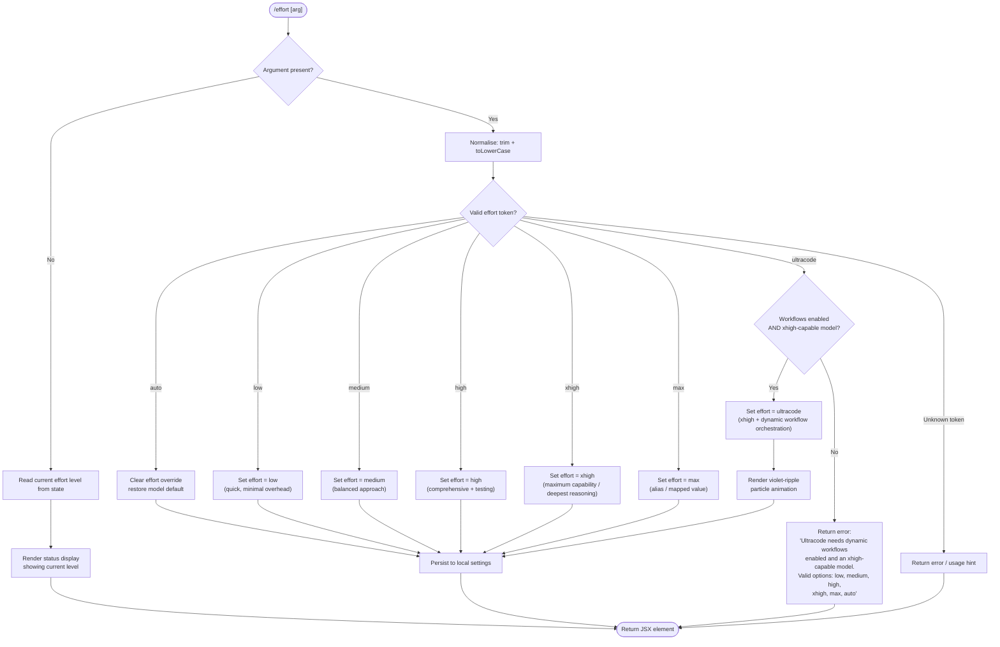

# `/effort`

> Analysis basis: CC v2.1.154 bundle.js (AST extraction + Claude interpretation)
> Minimum version: v2.1.154

---

## Overview

The `/effort` command sets the inference effort level that Claude Code uses for subsequent model calls within the current session. It accepts a named tier (`low`, `medium`, `high`, `xhigh`, `max`, `ultracode`, or `auto`) and persists the chosen level to local settings, optionally rendering a visual animation for the special `ultracode` tier. When invoked with no argument it reports the current effort level.

---

## Registration

| Field | Value |
|---|---|
| type | `local-jsx` |
| name | `effort` |
| description | Set effort level for model usage |
| argumentHint | `[low\|medium\|high\|xhigh\|max\|ultracode\|auto] \| [low\|medium\|high\|xhigh\|max\|auto]` |
| immediate | `null` |
| thinClientDispatch | `control-request` |
| module_id | `tr1` |
| load_inline | `true` |
| loc_byte | `12416859` |
| loc_byte_end | `12417186` |
| loc_line | `9253` |
| arbor_handler.name | `X35` |
| arbor_handler.fqn | `claude-2.1.154::X35` |
| arbor_handler.kind | `AsyncFunction` |
| arbor_handler.resolution_path | `module_id` |
| arbor_handler.n_hits | `2` |

Analysis basis: CC v2.1.154 bundle.js:+12416859

---

## Input Branching

Six or more distinct input paths exist (no argument, `auto`, `low`, `medium`, `high`, `xhigh`, `max`, `ultracode`, and error cases), so a Mermaid flowchart is required.



Analysis basis: CC v2.1.154 bundle.js:+12415062 (handler entry `X35`), +12405402 (ultracode error string), +12406248 (ultracode feature flag path)

---

## Behavioral Spec

### 1 — Handler Entry Point

The Arbor-resolved handler is `X35` (AsyncFunction, resolved via `module_id` path).

```
async function effortCommandHandler(args, appContext):
    rawArg = args.trim()

    if rawArg is empty:
        return renderCurrentEffortStatus(appContext)

    normalised = rawArg.toLowerCase()

    if normalised == "ultracode":
        return handleUltracodeRequest(appContext)

    if normalised in VALID_EFFORT_LEVELS:
        return applyEffortLevel(normalised, appContext)

    return renderError("Unknown effort level: " + rawArg)
```

Analysis basis: CC v2.1.154 bundle.js:+12415062

---

### 2 — Effort Level Validation

The set of supported named levels is derived from the literals and the `argumentHint` field.

```
VALID_EFFORT_LEVELS = { "low", "medium", "high", "xhigh", "max", "auto" }
# "ultracode" is handled on a separate path (feature-gated)

function isValidEffortLevel(token):
    return token in VALID_EFFORT_LEVELS

EFFORT_DESCRIPTIONS = {
    "low":    "Quick, straightforward implementation with minimal overhead",
    "medium": "Balanced approach with standard implementation and testing",
    "high":   "Comprehensive implementation with extensive testing and documentation",
    "xhigh":  "Maximum capability with deepest reasoning",
    "max":    (mapped to xhigh internally),
    "auto":   "Use the default effort level for your model"
}
```

Analysis basis: CC v2.1.154 bundle.js:+4110097 (`low`), +4110175 (`medium`), +4110268 (`high`), +4110432 (`xhigh`), +4109182 (`max`), +4108735 (`auto`)

---

### 3 — Effort Application and Settings Persistence

```
function applyEffortLevel(level, appContext):
    if level == "auto":
        clearEffortOverride(appContext.settings)     # removes the stored override
    else:
        setEffortOverride(level, appContext.settings)

    persistToLocalSettings(appContext)
    emitTelemetry("tengu_effort_command")
    return renderEffortConfirmation(level, isRemoteTransport(appContext))
```

When the active transport is a remote (CCR / thin-client) transport, the confirmation message appends the suffix `" (applied locally — this remote transport can't change server effort)"`.

Analysis basis: CC v2.1.154 bundle.js:+12403428 (remote transport suffix), +12403551 (`apply_flag_settings` literal), +12404993 (telemetry `tengu_effort_command`)

---

### 4 — Ultracode Feature Gate

`ultracode` is a super-tier that combines `xhigh` effort with dynamic workflow orchestration. It is gated on two simultaneous conditions:

```
function handleUltracodeRequest(appContext):
    workflowsEnabled = checkFeatureFlag("allow_workflows", appContext)
    modelCapable     = isXhighCapableModel(appContext.currentModel)

    if NOT (workflowsEnabled AND modelCapable):
        return renderError(
            "Ultracode needs dynamic workflows enabled (see /config) " +
            "and an xhigh-capable model. " +
            "Valid options are: low, medium, high, xhigh, max, auto"
        )

    setEffortOverride("ultracode", appContext.settings)   # internally "xhigh + workflows"
    persistToLocalSettings(appContext)
    emitTelemetry("tengu_effort_command")
    playVioletRippleAnimation(appContext)
    return renderConfirmation(
        "Current effort level: ultracode " +
        "(xhigh + dynamic workflow orchestration; this session only)"
    )
```

The `ultracode` effect is explicitly session-scoped as indicated by the `" (this session only)"` suffix literal.

Analysis basis: CC v2.1.154 bundle.js:+12405402 (error string), +12407846 (`ultracode` literal), +12408134 (`xhigh + workflows` internal label), +12404562 (status string), +12404389 (`(this session only)`)

---

### 5 — Xhigh-Capable Model Check

The implementation checks the active model ID against a hard-coded allow-list of xhigh-capable models. Partial string matching against the `"claude-opus-4-"` prefix family as well as explicit model IDs is performed.

```
XHIGH_CAPABLE_MODELS = [
    "claude-opus-4-0",
    "claude-opus-4-1",
    "claude-opus-4-5",
    "claude-opus-4-6",
    "claude-opus-4-7",
    "claude-opus-4-8",
    "claude-sonnet-4-0",
    "claude-sonnet-4-5",
    "claude-sonnet-4-6",
    "claude-haiku-4-5"
]
# Models beginning with "claude-3-" are explicitly excluded.

function isXhighCapableModel(modelId):
    if modelId.startsWith("claude-3-"):
        return false
    return XHIGH_CAPABLE_MODELS.includes(modelId)
       OR modelId passes provider-profile check (non-firstParty routes included)
```

Analysis basis: CC v2.1.154 bundle.js:+4106868 (`claude-3-` exclusion prefix), +4106886–+4107147 (model ID literals), +4107078–+4107147 (additional opus/sonnet entries)

---

### 6 — Status Display (No-Argument Invocation)

When `/effort` is invoked without an argument, the handler reads the current effort from application state and renders a JSX status element.

```
function renderCurrentEffortStatus(appContext):
    current = readEffortFromState(appContext)   # may be "unset", "auto", or a named level
    return JSX(
        type: "status",
        props: { current: current }
    )
```

The string `"unset"` is used internally when no override has been applied.

Analysis basis: CC v2.1.154 bundle.js:+12415102 (`current` key), +12415117 (`status` key), +4108707 (`unset` literal), +12415081 (call to `fI8` from `X35`)

---

### 7 — Ultracode Visual Animation

When `ultracode` is successfully activated, a particle animation named `violet-ripple` is rendered using trigonometric helpers.

```
function playVioletRippleAnimation(appContext):
    particles = buildParticleSet(count=17, radius=3)   # 17 particles, radius 3
    for each frame:
        positions = particles.map(p =>
            computePosition(p, Math.cos, Math.sqrt, Math.round, Math.min)
        )
        renderFrame(positions, color="violet-ripple")
    scheduleCleanup(setTimeout)
```

Animation constants: particle count `17`, visual radius `3`, frame step `8.5`, arc count `18`.

Analysis basis: CC v2.1.154 bundle.js:+12407822 (value `3`), +12407826 (value `17`), +12407846 (`ultracode`), +12407882 (`violet-ripple`), +12408001 (value `8.5`), +12408097 (value `18`), +12409523 (`Math.cos`), +12409422 (`Math.sqrt`)

---

### 8 — Settings Write Path

Effort changes are persisted through the standard settings save subsystem.

```
function persistToLocalSettings(appContext):
    settings = loadCurrentSettings()          # reads userSettings, localSettings, projectSettings
    settings.effort = newLevel
    atomicWriteFile(targetPath, JSON.stringify(settings))
    # Uses rename-over-temp-file pattern with fchmodSync + fsyncSync for durability
    invalidateSettingsCache()
```

Analysis basis: CC v2.1.154 bundle.js:+1227571 (`userSettings`), +1227709 (`localSettings`), +1227686 (`projectSettings`), +1011812 (`writeFileSync`), +1011870 (`fchmodSync`), +1011936 (`fsyncSync`), +1012064 (`renameSync`)

---

## State & Side Effects

| Item | Detail |
|---|---|
| Telemetry | `tengu_effort_command` (+12404993), `tengu_workflows_enabled` (+4106475), `tengu_slate_finch` (+4110555), `tengu_feature_ok` (+965176), `tengu_feature_sad` (+965311), `tengu_feature_bad` (+965234), `tengu_config_auth_loss_prevented` (+3205485) |
| appState changes | Effort override stored in local settings (`flagSettings` / `apply_flag_settings` key); `"ultracode"` label maps internally to `"xhigh + workflows"` |
| Settings files | Writes to `.claude/settings.local.json` (local-scoped), read also from `settings.json` and `settings.local.json` under `.claude/` |
| Animation | `violet-ripple` particle animation rendered only for successful `ultracode` activation |
| Remote transport caveat | When transport type is `ccr`, effort is applied client-side only; server effort cannot be changed; confirmation message includes an explicit notice |
| Session scope | `ultracode` activation is explicitly session-only; standard levels persist across sessions |
| Hook registration | Settings write emits `kpH.emit` (internal config-change event bus) |
| Sound | None detected in depth-2 traversal |

---

## Version History

| Version | Change |
|---|---|
| v2.1.154 | Initial analysis — seven effort tiers documented; ultracode tier with violet-ripple animation and dual feature-gate; remote transport awareness; xhigh-capable model allow-list |

---

## Common Mistakes

1. **Using `ultracode` without enabling workflows**: The command requires both the `allow_workflows` feature flag (set via `/config`) and an xhigh-capable model. If either condition is missing, the command returns an error and does not change the effort level.
2. **Expecting `ultracode` to persist across sessions**: The `ultracode` tier is explicitly session-scoped. After restarting Claude Code, the effort level reverts to whatever is stored in persistent settings (which will not include `ultracode`).
3. **Using a Claude 3 model with xhigh or ultracode**: Model IDs beginning with `claude-3-` are explicitly excluded from the xhigh-capable allow-list; those tiers will be rejected or silently ineffective.
4. **Invoking `/effort` over a remote CCR transport and expecting server-side effect**: The command confirms that effort is applied locally only and the remote server's effort setting is unaffected.
5. **Confusing `max` and `ultracode`**: `max` is a named tier that maps to maximum model capability. `ultracode` is a distinct super-tier that additionally enables dynamic workflow orchestration and requires a separate feature flag.
6. **Omitting the argument to change effort**: Invoking `/effort` with no argument reports status; it does not reset or toggle the level. Pass an explicit token to change it.

---

## Appendix — Identifier Mapping

> For bundle debugging only. Identifiers change across versions.

| Identifier | Role |
|---|---|
| `X35` | Primary effort command handler (AsyncFunction; Arbor-resolved via module_id `tr1`) |
| `MI8` | Effort command registration object / outer module wrapper |
| `Ho` | Inner command dispatch coordinator |
| `k0` | Effort level state reader / current-level accessor |
| `$18` | String normalisation helper (trim + case) |
| `xH` | Low-level string utility |
| `gE` | General configuration accessor |
| `A89` | Model capability check dispatcher |
| `v9` | xhigh-capable model validator (checks model ID against allow-list) |
| `fP_` | Effort-level description resolver |
| `gX7` | Effort description formatter (maps tier → human string) |
| `FX7` | Settings accessor for effort configuration |
| `er` | Effort application core logic |
| `$W` | Effort-level normalisation and routing |
| `O9` | Provider/transport type resolver |
| `eS` | Settings update emitter |
| `Hw` | Settings persistence writer |
| `LvH` | "Allow workflows" feature-flag reader |
| `b6` | Telemetry event emitter |
| `z18` | Remote transport detection helper |
| `KvH` | Budget / token-count accessor |
| `Ix` | Numeric effort budget parser (parseInt / isNaN guard) |
| `rD6` | max_effort application branch |
| `vcH` | xhigh_effort application branch |
| `W3` | Session-local effort state store |
| `aWH` | Session state initialiser |
| `hV` | Ultracode activation coordinator |
| `y4H` | Ultracode status renderer |
| `AvH` | Valid effort token validator |
| `j6H` | String coercion helper (String cast) |
| `zP_` | Slate-finch telemetry emitter |
| `QX7` | Telemetry payload builder |
| `R1H` | Settings save dispatcher |
| `K1` | Persistent settings writer |
| `TY` | Core settings file write implementation |
| `E6` | Effort configuration persistence layer |
| `Mx` | Configuration key resolver |
| `fx` | Configuration file I/O helper |
| `y88` | Settings cache manager |
| `$z_` | GrowthBook experiment event emitter |
| `wz_` | Settings update propagator |
| `sr1` | Cosine-based animation position calculator |
| `ar1` | Square-root animation distance calculator |
| `ir1` | Violet-ripple animation orchestrator |
| `kx` | Effort display state reader |
| `dr1` | Particle-set builder for animation |
| `fI8` | Effort status JSX renderer |
| `$I8` | Top-level effort token dispatcher |
| `rM5` | Standard effort level application path |
| `k8A` | Settings read + write coordinator |
| `Qy` | Session settings accessor |
| `aD6` | Settings persistence + event emission |
| `UYH` | Config update event emitter |
| `U_` | Full settings load/save subsystem |
| `wO` | Policy settings loader |
| `B6` | Base settings builder |
| `Uo8` | Settings file locator |
| `ig` | Settings merge / hydration helper |
| `zP` | Gitignore rule checker |
| `P8` | ENOENT file-not-found handler |
| `N` | Config log formatter |
| `mr8` | Settings cache timestamp writer |
| `mGH` | Settings cache refresher |
| `$L6` | Atomic file write utility (temp + rename) |
| `RH` | JSON.stringify wrapper |
| `Xz` | Settings cache invalidator |
| `tB6` | Config file append/write helper |
| `hb` | `.claude` directory path builder |
| `$_` | Observable / event-bus helper |
| `yH` | Feature-ok telemetry helper |
| `t6` | Feature-sad telemetry helper |
| `uH` | Feature-bad telemetry helper |
| `vp` | Settings loader with telemetry |
| `hH` | Error logger |
| `bR` | Config save gatekeeper (auth-loss prevention) |
| `O8` | Global config save implementation |
| `c` | Core React / Ink rendering primitive |
| `oM5` | Ultracode eligibility check + error branch |
| `J9` | Model ID parser and normaliser |
| `Ce` | Model ID structured record builder |
| `av` | Model family extractor |
| `_9H` | Model version extractor |
| `WQ` | Model ID tokeniser |
| `e9` | Model alias resolver |
| `j0` | Alias map lookup |
| `y1H` | Model ID inclusion checker |
| `hN` | Model family classifier (haiku/sonnet branch) |
| `pBH` | Model tier classifier |
| `EZ` | Model capability flag setter |
| `L$q` | Model capability resolver |
| `Bf` | Model API configuration builder |
| `ar6` | Model ID include-list checker |
| `UBH` | String-based model ID processor |
| `$X` | Model configuration composer |
| `w0` | Full model descriptor assembler |
| `qvH` | Input trim + validation helper |
| `iM5` | Effort command full execution flow (normal tiers) |
| `IF` | Animation frame renderer (JSX) |
| `O` | Animation particle collection |
| `k8` | Background session state checker |

---

Note: index built via Arbor fallback; some signals (telemetry, literals) may be missing — see arbor-fallback.js.