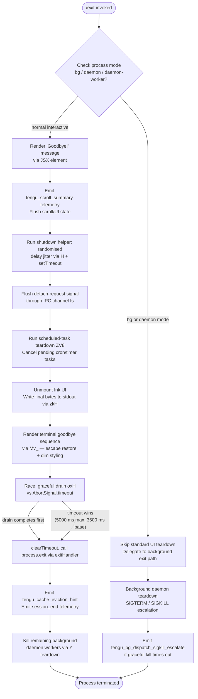

# `/exit`

> Analysis basis: CC v2.1.157 bundle.js (AST extraction + Claude interpretation)
> Minimum version: v2.1.157

---

## Overview

`/exit` (also aliased as `/quit`) immediately terminates the Claude Code CLI session. When invoked, it performs an orderly shutdown sequence: flushing pending output, emitting a farewell message ("Goodbye!"), persisting telemetry and scroll summary data, cleaning up background daemon resources, and finally calling `process.exit`. The command is registered as `immediate`, meaning it bypasses normal prompt processing and executes synchronously before any further input handling.

---

## Registration

| Field | Value |
|---|---|
| type | `local-jsx` |
| name | `exit` |
| description | `null` |
| aliases | `["quit"]` |
| immediate | `true` |
| module_id | `Oo1` |
| load_inline | `true` |
| loc_byte | `12374315` |
| loc_byte_end | `12374511` |
| loc_line | `8261` |
| arbor_handler.name | `M$5` |
| arbor_handler.fqn | `claude-2.1.157::M$5` |
| arbor_handler.kind | `AsyncFunction` |
| arbor_handler.resolution_path | `module_id` |
| arbor_handler.n_hits | `1` |

Analysis basis: CC v2.1.157 bundle.js:+12374315

---

## Input Branching

The exit flow has more than three distinct phases and conditional branches (process mode check, UI cleanup, scroll summary flush, goodbye rendering, process termination race, and background daemon teardown). A flowchart is used.



---

## Behavioral Spec

### Top-Level Handler — `exitCommandHandler` (bundle name: `M$5`)

Analysis basis: CC v2.1.157 bundle.js:+12374315 – +12374511 (registration block); handler body resolved via `module_id` → `Oo1`.

```
async function exitCommandHandler(context):
    # 1. Detect process role
    mode = detectProcessMode()          # checks "bg", "daemon", "daemon-worker" literals
    if mode in ["bg", "daemon", "daemon-worker"]:
        return backgroundExitPath(mode)

    # 2. Record prompt_input_exit telemetry marker
    emitMarker("prompt_input_exit")     # literal at bundle.js:+12373752

    # 3. Render farewell JSX element
    createElement("Goodbye!")           # literal at bundle.js:+12373528
                                        # via n8A.createElement call at +12373641

    # 4. Shutdown helper with jitter
    shutdownJitter()                    # function H, uses Math.random + setTimeout
                                        # Analysis basis: bundle.js:+12373576

    # 5. Flush IPC detach-request
    flushDetachRequest()                # function HfH → Is → ks.write
                                        # literal "detach-request" at +10773898
                                        # Analysis basis: bundle.js:+12373580

    # 6. Cancel scheduled tasks
    cancelScheduledTasks()              # function ZV8, literal "scheduled task" at +10767360
                                        # Analysis basis: bundle.js:+12373611

    # 7. Unmount Ink UI + write terminal restore sequences
    unmountUI()                         # function zkH → H.unmount + AjH.writeSync
                                        # ESC-7 / ESC-8 save/restore cursor sequences
                                        # Analysis basis: bundle.js:+12373747

    # 8. Flush goodbye line with dim styling
    renderGoodbyeLine()                 # function Mv_ → j6.dim + AjH.writeSync
                                        # Analysis basis: bundle.js:+5357592

    # 9. Graceful drain race
    timeout_ms = Math.max(5000, 3500)   # literals at bundle.js:+5357615, +5357622
    winner = await Promise.race([
        drainOutput(),                  # function oxH → _OA.drain  (+5357711)
        AbortSignal.timeout(timeout_ms) # (+5357877)
    ])
    clearTimeout(...)                   # (+5357812)

    # 10. Final process exit
    exitHandler()                       # function $v_ → process.exit (+5356050)
                                        # or process.kill fallback (+5356075)

    # 11. Post-exit telemetry / cache hint
    emitTelemetry("tengu_cache_eviction_hint")  # (+5357951)
    emitTelemetry("session_end")                # literal at +5357986
```

Analysis basis: CC v2.1.157 bundle.js:+12373564 (first callGraph edge from `M$5`)

---

### Process Mode Detection — `processRoleCheck` (bundle name: `v9`)

```
function processRoleCheck():
    role = getEnvOrFlag()
    if role == "bg":          return "bg"       # literal at +2201979
    if role == "daemon":      return "daemon"   # literal at +2201989
    if role == "daemon-worker": return "daemon-worker"  # literal at +2202003
    return "interactive"
```

Analysis basis: CC v2.1.157 bundle.js:+12373564 (`M$5` → `v9` → `QOH`)

---

### Shutdown Jitter — `shutdownJitter` (bundle name: `H`)

```
function shutdownJitter():
    delay = Math.random() * 2 + 1      # literals: 2 at +13423029, 1 at +13423045
    setTimeout(callback, delay)
```

Analysis basis: CC v2.1.157 bundle.js:+12373576 (`M$5` → `H`)

---

### Detach-Request Flush — `flushDetachRequest` (bundle name: `HfH`)

```
function flushDetachRequest():
    do6()                    # preliminary cleanup step
    ipcState = WN1()         # retrieves IPC channel state (EPH, k8 sub-calls)
    writeToChannel(Is, {     # Is → ks.write
        type: "detach-request"   # literal at +10773898
    })
    tAH()                    # finalise / drain channel
```

Analysis basis: CC v2.1.157 bundle.js:+12373580 (`M$5` → `HfH`)

---

### Scheduled Task Cancellation — `cancelScheduledTasks` (bundle name: `ZV8`)

```
function cancelScheduledTasks():
    taskList = getScheduledTasks()   # yG → AN
    for task in taskList:            # H.push accumulate
        entry = resolveTimingEntry(task)   # LiL sub-call
        cancelEntry = truncateDisplay(entry, maxWidth)  # R9 sub-call
        H.push(cancelEntry)
    # LiL internally computes remaining time using Math.max, Date.now, A.getTime
    # R9 truncates display strings via H.indexOf, H.substring, Bun.stringWidth
```

Literal "scheduled task" at bundle.js:+10767360; `Math.max` for remaining-time clamping at +10767565.

Analysis basis: CC v2.1.157 bundle.js:+12373611 (`M$5` → `ZV8`)

---

### UI Unmount + Terminal Restore — `unmountUI` (bundle name: `zkH`)

```
function unmountUI():
    AjH.writeSync(ESC_SAVE_CURSOR)     # ESC-7 literal at +3716184
    inkInstance = A7.get(currentKey)
    inkInstance.unmount()              # H.unmount at +5355450
    hR()                               # cursor/screen restore helper
    renderFinalOutput(mq8)             # mq8 → Ao.writeSync + NVH terminal detection
    applyEscapeRestore(CH)             # CH → String coercion
```

Terminal detection inside `NVH` checks for `ghostty` (≥1.2.0) and `iTerm.app` (≥3.6.6) to apply compatibility escape sequences.
ESC restore literal `\ESC8` at bundle.js:+3716195.

Analysis basis: CC v2.1.157 bundle.js:+12373747 (`M$5` → `_9` → `zkH`)

---

### Goodbye Line Render — `renderGoodbyeLine` (bundle name: `Mv_`)

```
function renderGoodbyeLine():
    jZ()                        # clear current line
    Zb()                        # position cursor
    workingDir = k6()           # resolve working directory path (AN helper)
    gitInfo = $P6()             # resolve git repo path, calls q.statSync
    pathDisplay = I$()          # abbreviated path display (U4 → K9)
    line = replaceAll(pathDisplay, "\\", "\\\\")    # literal at +5355761
    line = replaceAll(line, '"', '\\"')             # literal at +5355784
    AjH.writeSync(j6.dim(line))                     # dim styling at +5355858
```

Analysis basis: CC v2.1.157 bundle.js:+5357592 (`_9` → `Mv_`)

---

### Exit Handler (Process Kill) — `exitHandler` (bundle name: `$v_`)

```
async function exitHandler():
    clearTimeout(drainTimer)
    inkRef = A7.get(key)
    if inkRef:
        # graceful path
        process.exit(0)           # at +5356050
    else:
        # fallback hard kill
        process.kill(process.pid) # at +5356075
    # guard: if neither succeeded, throw "unreachable"
    throw new Error("unreachable")   # literal at +5356123
```

Analysis basis: CC v2.1.157 bundle.js:+5357598 (`_9` → `$v_`)

---

### Background Daemon Teardown — `supervisorTeardown` (bundle name: `Y`)

```
function supervisorTeardown():
    sessionData = u2H()          # writes session summary (s9 → $J7.getStore)
    q.write(supervisorPayload)   # at +15480638, label "supervisor" at +15480646
    reportStats = Re1()          # Object.keys + Math.max + sY sub-call
    timer = f.get(key)
    G.stop()                     # stop heartbeat (literal "heartbeat" at +15479867)
    f.delete(key)
    E.stop(); E.updateConfig(); E.start()   # config reload cycle
    emitTelemetry("tengu_daemon_config_reload")  # at +15481439
    FVK()                        # oHH heartbeat renewal
    f.set(key, newTimer)
    V.start()                    # restart supervisor watcher
    d()                          # dispose
```

Analysis basis: CC v2.1.157 bundle.js:+5357789 (`_9` → `Y`)

---

### Background Daemon Worker Exit — `bgWorkerExit` (bundle name: `D`)

```
function bgWorkerExit():
    G6()                         # flush pending events
    $.dispose()
    memFree = TfA.freemem()
    uy8(memFree)
    if platform == "windows":    # literal at +15466447
        i6()
    elif elapsed > 2000:         # literal at +15466577
        YfA()
    timestamp = Date.now()
    D()                          # recursive: retry loop
    d()
    kz()
    N()                          # telemetry N call
    j8()
    SH()
```

SIGTERM sent first (literal `"SIGTERM"` at +15468844); if worker does not exit within 30 s (literal `30` at +15466906) or 15 s (literal `15` at +15466917), SIGKILL is escalated (literal `"SIGKILL"` at +15466999) with a 100 ms grace `setTimeout` (literal `100` at +15467023).
Telemetry `tengu_bg_dispatch_sigkill_escalate` emitted on escalation (bundle.js:+15466951).

Analysis basis: CC v2.1.157 bundle.js:+4786405 (`gV` → `D`)

---

### Scroll Summary Flush — `scrollSummaryFlush` (bundle name: `yf8`)

```
function scrollSummaryFlush():
    jZ()                    # clear scroll state
    CX9()                   # compute column/row metrics
    d()                     # dispose scroll handle
    stats = RX9()           # Date.now, Math.max, Math.round, Object.assign
    Aq()                    # agent/session context aggregation
    emitTelemetry("tengu_scroll_summary")  # literal at +5356918
```

Analysis basis: CC v2.1.157 bundle.js:+5357926 (`_9` → `yf8`)

---

### Telemetry Flush — `telemetryFlush` (bundle name: `ZK6`)

```
function telemetryFlush():
    batch = IB8()           # IB8 → ODA (Object.entries, Math.round, Number.parseInt)
    profile = KDA()         # KDA → MDA, HDA, $DA, JSON.stringify
    writeProfileToDisk(K$H) # b9H.openSync, writeFileSync, fsyncSync, closeSync
    emitTelemetry("tengu_startup_perf")  # at +215155
```

Startup profiling report uses literal `"STARTUP PROFILING REPORT"` (at +213140); width fixed at 80 chars (literal `80` at +213128).

Analysis basis: CC v2.1.157 bundle.js:+5357913 (`_9` → `ZK6`)

---

## State & Side Effects

| Item | Detail |
|---|---|
| Telemetry — `tengu_scroll_summary` | Emitted during scroll state flush at +5356918 |
| Telemetry — `tengu_cache_eviction_hint` | Emitted just before final exit at +5357951 |
| Telemetry — `tengu_daemon_config_reload` | Emitted if daemon config is updated during teardown at +15481439 |
| Telemetry — `tengu_startup_perf` | Emitted when startup profiling data is present at +215155 |
| Telemetry — `tengu_bg_dispatch_sigkill_escalate` | Emitted when background worker does not exit after SIGTERM within grace window at +15466951 |
| Telemetry — `tengu_bg_dispatch_low_mem` | Emitted if low-memory condition detected during bg teardown at +15467530 |
| Telemetry — `tengu_bg_spare_enable` | Background spare-worker pool enabled event at +15468225 |
| Telemetry — `tengu_bg_spare_claim` | Spare worker claimed event at +15468346 |
| Telemetry — `tengu_bg_spare_claim_fail` | Spare worker claim failed at +15468609 |
| Telemetry — `tengu_bg_spare_spawn` | Spare worker spawned event at +15466644 |
| Telemetry — `tengu_amber_creek` | Fullscreen mode telemetry during teardown at +3377471 |
| Telemetry — `tengu_pewter_brook` | Fullscreen mode telemetry during teardown at +3377379 |
| `session_end` marker | Written as final literal string event at +5357986 |
| `prompt_input_exit` marker | Written at the point `/exit` is accepted at +12373752 |
| Ink UI | `H.unmount()` called; removes all React/Ink rendering |
| stdout writes | `AjH.writeSync` called twice: once for cursor save/restore, once for dimmed path line |
| Scheduled tasks | All pending cron/timer tasks cancelled via `ZV8` / `LiL` |
| IPC channel | `detach-request` message sent to any connected daemon worker |
| process.exit | Called via `$v_` with code `0`; `process.kill(pid)` used as hard fallback |
| SIGTERM / SIGKILL | Sent to bg workers sequentially; SIGKILL escalation after 30 s / 15 s thresholds |
| Telemetry disk write | Startup perf profile written with `fsyncSync` for durability |
| Drain timeout | Max wait for output drain: `Math.max(5000, 3500)` ms = 5000 ms |
| Timer unrefs | `qjH.unref()` at +5357631 ensures drain timer does not prevent exit |

---

## Version History

| Version | Change |
|---|---|
| v2.1.157 | Initial analysis |

---

## Common Mistakes

1. **Invoking `/quit` expecting different behaviour**: `/quit` is a registered alias for `/exit` (same handler `M$5`); both perform identical shutdown sequences.
2. **Expecting instant termination**: The command is `immediate` (bypasses prompt queue) but the handler is `async` and races a 5000 ms drain timeout before calling `process.exit`. In very rare cases a hung drain can delay exit up to 5 seconds.
3. **Confusing background vs. interactive exit paths**: When Claude Code is running as a `daemon` or `daemon-worker`, `/exit` routes to the background teardown path (`bgWorkerExit` / `supervisorTeardown`) which sends SIGTERM/SIGKILL rather than calling `process.exit` directly.
4. **Missing telemetry on abrupt kill**: If the process receives an external SIGKILL before the `tengu_cache_eviction_hint` flush completes, telemetry events may be lost. The `fsyncSync` in the perf-profile path mitigates data loss for profiling data only.
5. **Scheduled task state after exit**: Any cron or timer tasks registered via background scheduling are cancelled synchronously by `ZV8`; do not expect them to survive a `/exit` → relaunch cycle without re-registration.

---

## Appendix — Identifier Mapping

> For bundle debugging only. Identifiers change across versions.

| Identifier | Role |
|---|---|
| `M$5` | Top-level exit command handler (AsyncFunction) |
| `v9` | Process role/mode detection helper |
| `QOH` | Mode flag reader (called by v9) |
| `H` | Shutdown jitter helper (Math.random + setTimeout) |
| `HfH` | Detach-request IPC flush orchestrator |
| `do6` | Preliminary IPC cleanup step (called by HfH) |
| `WN1` | IPC channel state retrieval (called by HfH) |
| `EPH` | IPC sub-state accessor (called by WN1) |
| `k8` | IPC channel key accessor (called by WN1) |
| `Is` | IPC channel writer (ks.write wrapper) |
| `RH` | JSON.stringify wrapper for IPC payloads |
| `tAH` | IPC channel drain/finalise helper |
| `HM` | Intermediate state helper (called by M$5) |
| `ZV8` | Scheduled task cancellation orchestrator |
| `yG` | Task list accessor (called by ZV8, uses AN) |
| `AN` | Generic application-state accessor |
| `LiL` | Task timing/display entry resolver |
| `gV` | Task display string formatter (trim, match, parseInt) |
| `K` | Column/padding formatter (map + padEnd) |
| `w` | Background session/daemon worker manager |
| `L` | Async task set manager (q.add / q.delete) |
| `j` | Worker kill helper (A.values + y.kill) |
| `D` | Background worker exit / retry loop |
| `$` | Ls1 wrapper / spare worker accessor |
| `J` | UTC date/day calculator for cron scheduling |
| `Jk` | Cron expression line parser |
| `yv7` | Cron token splitter/matcher |
| `A` | Cron weekday / name normaliser (f.toLowerCase) |
| `OnH` | Cron next-run time calculator |
| `_` | Generic disposable context |
| `O` | Background session state object (k8 backing) |
| `f` | Session timer map (A.close / q.close) |
| `q` | Temp-file cleanup set (JVK.unlinkSync) |
| `aq` | Duration formatter (Math.floor + Math.round) |
| `R9` | Display string truncator (indexOf, substring, Bun.stringWidth) |
| `H8` | Terminal string width measurer (Bun.stringWidth) |
| `zq` | Grapheme-aware string slicer (H8 + DY) |
| `DY` | Unicode grapheme cluster boundary helper |
| `f$5` | JSX goodbye element builder (calls J2) |
| `_9` | Core exit sequence orchestrator (async) |
| `zkH` | Ink UI unmounter + cursor-save writer |
| `hR` | Terminal cursor/screen restore helper |
| `mq8` | Final terminal output writer (Ao.writeSync) |
| `NVH` | Terminal emulator compatibility detector (Ghostty, iTerm2) |
| `GVH` | Terminal output format selector |
| `zW` | tmux/screen escape sequence rewriter |
| `CH` | String coercion wrapper |
| `Mv_` | Goodbye path line renderer (dim styling) |
| `jZ` | Current-line clear utility |
| `Zb` | Cursor position utility |
| `k6` | Working directory path resolver (AN-based) |
| `$P6` | Git repository path resolver (q.statSync) |
| `RS` | Path segment helper (AN-based) |
| `O_` | Path abbreviation helper (AN-based) |
| `g6` | Directory existence checker |
| `I$` | Abbreviated path display builder (k6 + U4) |
| `U4` | Path shortening utility (K9 sub-call) |
| `bX9` | Path escaping helper |
| `$v_` | Final process.exit / process.kill handler |
| `oxH` | Output drain awaiter (_OA.drain) |
| `Y` | Supervisor / daemon config reload orchestrator |
| `u2H` | Session summary writer ($J7.getStore, j8, TAA) |
| `s9` | AsyncLocalStorage session context reader |
| `j8` | Session state serialiser |
| `TAA` | Session aggregation helper (GAA) |
| `EH` | String coercion for session data |
| `Re1` | Stats report builder (Object.keys, Math.max, sY) |
| `G` | Heartbeat/input stop handler (h0 + Y + H) |
| `b` | Input event with preventDefault |
| `h0` | User settings accessor (U_ sub-call) |
| `E` | Watcher/observer lifecycle controller (stop/updateConfig/start) |
| `FVK` | Heartbeat renewal helper (oHH) |
| `oHH` | Heartbeat timer factory |
| `V` | Supervisor watcher (V.start) |
| `d` | Generic dispose/cleanup function |
| `ZK6` | Telemetry batch flush + startup profiling writer |
| `IB8` | Telemetry batch aggregator (ODA sub-call) |
| `ODA` | Telemetry record processor (Object.entries, Math.round) |
| `KDA` | Startup profiling report orchestrator |
| `MDA` | Profiling report file writer (WK6.join, F8, k6) |
| `K$H` | Sync file writer (openSync, writeFileSync, fsyncSync, closeSync) |
| `HDA` | Profiling checkpoint formatter (Nb, _.entries, Nx6, en) |
| `Nb` | Node.js `require` wrapper for perf_hooks |
| `$DA` | Secondary profiling output file writer |
| `N` | Telemetry event normaliser/dispatcher |
| `yf8` | Scroll summary flush and telemetry emitter |
| `CX9` | Column/row metrics calculator |
| `RX9` | Scroll stats aggregator (Date.now, Math.max, Math.round, Object.assign) |
| `hX9` | Scroll stats sub-aggregator |
| `Aq` | Agent/session context aggregator for scroll summary |
| `B$H` | psK feature-flag checker |
| `ED_` | Session label builder (y1, CH) |
| `mr` | J77 sub-metric helper |
| `ZD_` | Boolean flag normaliser (i6) |
| `B_` | Cp capability checker |
| `X77` | G6 metric emitter wrapper |
| `G6` | Core telemetry event emitter (az6, sz6, Ex, izH, e88, rz6, PU, S6) |
| `b96` | Pre-exit cache eviction hint emitter |
| `hf8` | Promise.all / Promise.race shutdown fence |
| `g8` | Timeout/abort helper with unref (setTimeout, clearTimeout, L.unref) |

---

Note: index built via Arbor fallback; some signals (telemetry, literals) may be missing — see arbor-fallback.js.