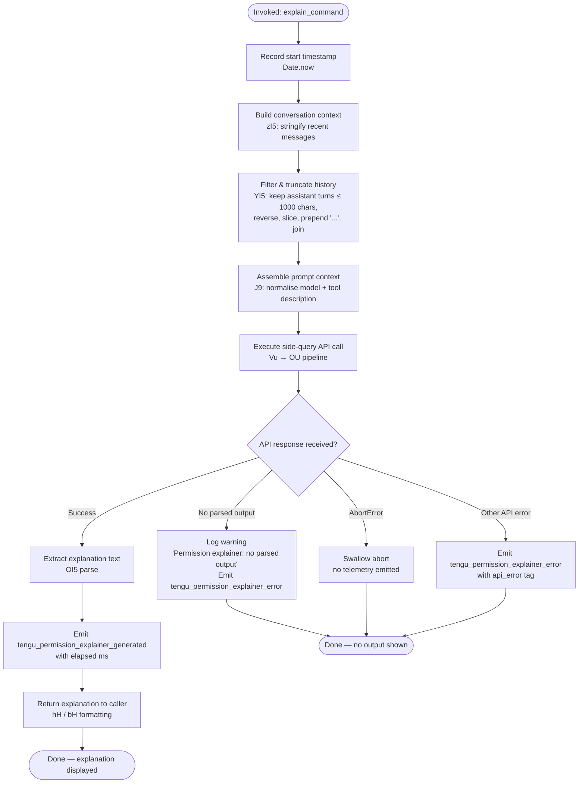

# `/explain_command`

> Analysis basis: CC v2.1.157 bundle.js (AST extraction + Claude interpretation)
> Minimum version: v2.1.157

---

## Overview

`/explain_command` is an internal `tool`-type slash command that generates a human-readable explanation for why a given permission or tool action is being requested. It invokes a side-query against the Anthropic API to produce a natural-language justification, then surfaces the result to the user interface. The command is identified internally as `permission_explainer` and records telemetry for both successful and failed explanation generation.

---

## Registration

| Field | Value |
|---|---|
| type | `tool` |
| name | `explain_command` |
| description | `null` |
| loc_byte | `13912556` |
| loc_byte_end | `13912592` |
| loc_line | `10597` |
| arbor_handler.name | `c3K` |
| arbor_handler.fqn | `claude-2.1.157::c3K` |
| arbor_handler.kind | `AsyncFunction` |
| arbor_handler.resolution_path | `direct` |
| arbor_handler.n_hits | `1` |

Analysis basis: CC v2.1.157 bundle.js:+13912556

---

## Input Branching

The handler has 4+ distinct branches (conversation history extraction, context assembly, API call, and result parsing / error handling), so a Mermaid flowchart is used.



---

## Behavioral Spec

### Handler Entry — `mainHandler` (bundle: `c3K`)

The async handler is resolved directly inside the registration object byte range (resolution_path: `direct`).

```
async function mainHandler(toolInput):
    startTime = Date.now()                        // +13912275

    contextString = buildContextString(toolInput) // zI5  +13912296
    historySnippet = buildHistorySnippet(messages) // YI5 +13912314

    promptContext = assemblePromptContext(         // J9   +13912461
        contextString, historySnippet, toolInput)

    result = await executeSideQuery(promptContext) // Vu   +13912474

    if result has no parsed output:
        log("Permission explainer: no parsed output in response") // +13913386
        emit tengu_permission_explainer_error                     // +13913251
        return null

    emit tengu_permission_explainer_generated(                    // +13913039
        elapsedMs = Date.now() - startTime)

    formatted = formatOutput(result)              // hH   +13913138
    return formatted
```

Analysis basis: CC v2.1.157 bundle.js:+13912251

---

### Context String Builder — `buildContextString` (bundle: `zI5`)

Serialises relevant tool/permission metadata into a compact string for inclusion in the explanation prompt.

```
function buildContextString(toolInput):
    serialised = JSON.stringify(toolInput, null, 2)   // RH +13911761
    return String(serialised).slice(0, 2)             // limit +13911771
    // constant 2 used as a slice boundary indicator
```

Analysis basis: CC v2.1.157 bundle.js:+13911761

---

### History Snippet Builder — `buildHistorySnippet` (bundle: `YI5`)

Selects the most recent assistant-role conversation turns and reduces them to a short prefix for context.

```
function buildHistorySnippet(messages):
    assistantTurns = messages.filter(                // +13911827
        m => m.role == "assistant")                  // literal "assistant" +13911850
    reversed = assistantTurns.reverse()              // +13911895

    // Keep at most 3 turns                          // literal 3 +13911870
    // Truncate each to 1000 chars                   // literal 1000 +13911815
    snippet = reversed
        .slice(0, 3)                                 // +13912038
        .map(extractTextContent)                     // "text" +13911953
        .map(t => t.slice(0, 1000))

    snippet.unshift("...")                           // literal "..." +13912051, +13912059
    return snippet.join("\n")                        // +13912092
```

Analysis basis: CC v2.1.157 bundle.js:+13911827

---

### Prompt Context Assembly — `assemblePromptContext` (bundle: `J9`)

Normalises the target model identifier and assembles structured prompt context, delegating to the shared message-normalisation subsystem.

```
function assemblePromptContext(contextString, historySnippet, toolInput):
    normalisedMessages = normaliseMessages(toolInput)   // se  +2188780
    modelId = resolveModelAlias(toolInput.model)        // _1  +2188816
    extras = buildExtras(normalisedMessages, modelId)   // XX  +2188829
    return { contextString, historySnippet, ...extras }
```

Internally `normaliseMessages` (bundle: `se`) calls `qN`, `G9H`, `JA`, `bQ` to parse and clean message content.
`buildExtras` (bundle: `XX`) delegates to `T0` which assembles provider-specific parameters via `WA`, `AHH`, `FOH`, `MFH`, `Z0`, `IP`, `iM`, `TA`, `w5`, `pN`.

Analysis basis: CC v2.1.157 bundle.js:+2188780

---

### Side-Query Execution — `executeSideQuery` (bundle: `Vu`)

Performs a non-interactive API call (tagged `side_query` — literal at `+13164043`) to obtain the explanation.

```
async function executeSideQuery(promptContext):
    // Build API request via the main request pipeline
    response = await apiRequestPipeline(promptContext)   // OU +13164011

    // Validate response structure
    if not Array.isArray(response.content):              // +13164698
        return null

    // Hash prompt for cache deduplication                // F9A +13164204
    cacheKey = sha256Hash(promptContext)

    // Trim to Math.min budget                           // +13164851
    clampedContent = response.content.slice(0, MIN_BUDGET)

    // Map content blocks                                // +13164961
    return clampedContent
```

The `OU` pipeline (bundle: `OU`) is a fully featured HTTP request executor that: sets request headers (User-Agent, `X-Claude-Code-Session-Id`, `x-app: cli` — literals at `+2914914`, `+2914932`, `+2914908`); manages OAuth token refresh via `z3_`; handles streaming via `vH7` / `EH7`; applies proxy authentication via `lc6`; and resolves model endpoints via `kO` / `Cz`.

Analysis basis: CC v2.1.157 bundle.js:+13164011

---

### Config & Storage Access — `configReadLayer` (bundle: `szH`)

Called transitively during request context initialisation. Reads the on-disk config file (`utf-8` — `+3210005`), parses via `JSON.parse`, manages backups (directory name `"backups"` — `+3209490`), and guards against pre-authorisation access with the error `"Config accessed before allowed."` (`+3209922`). Uses `q.readFileSync`, `q.copyFileSync`, `q.mkdirSync`, `q.readdirStringSync`, and `q.statSync` for filesystem operations. On `ENOENT` (`+3210152`) the config is treated as missing rather than an error.

Analysis basis: CC v2.1.157 bundle.js:+3209916

---

### Output Parsing — `parseOutput` (bundle: `OI5`)

Extracts the explanation string from the raw API response object. If the response content array lacks a `text`-typed block (`"text"` literal at `+13911953`), a warning is logged and `null` is returned, triggering the `tengu_permission_explainer_error` telemetry path.

Analysis basis: CC v2.1.157 bundle.js:+13912881

---

### Error Handling

| Error Condition | Handling |
|---|---|
| No parsed output in response | Log `"Permission explainer: no parsed output in response"` (`+13913386`); emit `tengu_permission_explainer_error` |
| `AbortError` | Caught and swallowed silently (literal `"AbortError"` at `+13913709`) |
| Other API errors | Emit `tengu_permission_explainer_error` with `api_error` tag (`+13913780`) |

Analysis basis: CC v2.1.157 bundle.js:+13913590

---

## State & Side Effects

| Item | Detail |
|---|---|
| Telemetry — success | `tengu_permission_explainer_generated` (bundle.js:+13913039) — includes elapsed milliseconds |
| Telemetry — failure | `tengu_permission_explainer_error` (bundle.js:+13913251) — emitted for missing output and API errors |
| Telemetry — OAuth | `tengu_oauth_token_refresh_*` family emitted by the shared token-refresh layer (`z3_`) during API auth |
| Telemetry — config | `tengu_config_parse_error` (+3210553); `tengu_config_auth_loss_prevented` (+3205246) from the config layer |
| Telemetry — API stream | `tengu_api_success` (+13165494); `tengu_byte_stream_idle_timeout_ms` (+2921310); `tengu_byte_watchdog_fired_late` (+2922521) |
| Side-query tagging | Request tagged with literal `"side_query"` (+13164043) to distinguish from main conversation turns |
| Hook registration | None observed in depth-2 traversal for this command specifically |
| appState changes | None observed — read-only command |
| Sound | None observed |
| Config file access | Read-only access via `szH`; backup directory managed under `"backups"` subdirectory |

---

## Version History

| Version | Change |
|---|---|
| v2.1.157 | Initial analysis |

---

## Common Mistakes

1. **Expecting interactive output**: `/explain_command` is a `tool`-type command invoked programmatically (e.g., from a permission dialog). Typing it manually in the REPL may produce no visible output if the required tool-input schema is absent.
2. **Assuming synchronous completion**: The command is an `AsyncFunction` that makes a live API call; callers must await its result and handle the case where `null` is returned (no parsed output).
3. **Confusing with `/help`**: `/explain_command` targets _permission explainer_ use-cases, not general command documentation. It is registered under the internal tag `"permission_explainer"` (+13912614), not as a general help endpoint.
4. **Ignoring abort signals**: If the parent UI is dismissed before the explanation is ready, an `AbortError` is silently swallowed — callers should not assume a `null` return means an error.
5. **History truncation surprise**: Only the 3 most recent assistant turns are included, each capped at 1000 characters, with an ellipsis prefix — long conversations will have most context stripped.

---

## Appendix — Identifier Mapping

> For bundle debugging only. Identifiers change across versions.

| Identifier | Role |
|---|---|
| `c3K` | Main async handler for `explain_command` (arbor_handler) |
| `L7A` | Top-level dispatch helper called by `c3K` |
| `S6` | Config-backed session/store accessor |
| `g6` | Generic logger / debug emitter |
| `sz_` | Synchronous config reader (low-level) |
| `szH` | Config file read/write manager with backup logic |
| `p6` | JSON parse wrapper |
| `gb` | String prefix-strip utility |
| `j8` | Error type classifier |
| `yFq` | Directory listing / backup path resolver |
| `N` | Log-level normalisation / structured log entry builder |
| `d` | Generic error/exception constructor helper |
| `qY_` | Backup path join helper |
| `b17` | File-watch registration coordinator |
| `Vr` | Config-change broadcast emitter |
| `K9` | File-watcher hook registrar (calls `_OA.register`) |
| `zI5` | Context-string serialiser (JSON.stringify wrapper) |
| `RH` | Structured JSON serialiser (calls `JSON.stringify`) |
| `YI5` | Conversation history snippet builder |
| `J9` | Prompt context assembler |
| `se` | Message normalisation entry point |
| `qN` | Message pre-validator |
| `G9H` | Message field extractor |
| `bQ` | Message content block parser |
| `ti6` | Tool-use block handler |
| `KFH` | MCP tool name checker |
| `t3q` | Tool index resolver |
| `Am4` | Anthropic-prefixed tool identifier checker |
| `i1H` | Internal tool name list membership tester |
| `_1` | Model alias normaliser |
| `qm4` | Model prefix validator |
| `XX` | Extra parameters builder |
| `T0` | Provider-parameter assembler |
| `WA` | First-party provider config builder |
| `AHH` | Max-plan config injector |
| `FOH` | Team-plan config injector |
| `MFH` | Enterprise-plan config injector |
| `Z0` | Base provider config constructor |
| `IP` | Provider-specific parameter injector |
| `iM` | Provider type resolver |
| `TA` | API provider enum/config lookup |
| `w5` | Provider transport config builder |
| `pN` | Provider normaliser combining `iM` + `w5` |
| `Vu` | Side-query executor (wraps `OU` and post-processes) |
| `OU` | Full HTTP API request pipeline |
| `Mw` | Async-local-storage store reader |
| `WH7` | URL query-string parser |
| `v9` | App-context mode resolver |
| `Jr` | Session-ID accessor |
| `bo6` | KOq store getter |
| `k6` | Platform/runtime constant provider |
| `S1_` | URL-encoding helper for additional-protection header |
| `CH` | String-casting utility |
| `kO` | Endpoint/model-URL resolver |
| `z3_` | OAuth token refresh coordinator (with file locking) |
| `LOq` | Boolean-cast helper |
| `EY` | Auth-credential resolver |
| `BK` | Auth-string builder |
| `pP` | Auth-profile selector |
| `NO` | Provider-type guard |
| `AX` | Auth token accessor |
| `F3` | Credential resolution orchestrator |
| `tO6` | rgH wrapper |
| `rgH` | Profile-implicit credential builder |
| `u3` | Timing / elapsed-ms helper |
| `XH7` | Request-header builder |
| `dgH` | Dynamic header injector |
| `R_` | Remote-container/session-ID reader |
| `lc6` | Proxy-auth helper executor |
| `WTH` | Proxy config reader |
| `prA` | Proxy URL parser |
| `SW4` | Integer-timeout parser (parseInt + NaN guard) |
| `zy` | Agent/proxy credential store reader |
| `JP` | Proxy-auth token fetcher |
| `vH7` | Streaming HTTP request manager |
| `u5` | Request-state tracker |
| `QC6` | Request-context builder |
| `Tzq` | Config-backed streaming option resolver |
| `NH7` | Request-header sanitiser / redactor |
| `VH7` | Rate-limit metadata extractor |
| `ZH7` | Response-size clamper |
| `EH7` | Byte-stream watchdog and streaming reader |
| `Lw` | Provider-type normaliser |
| `oi6` | Provider enum validator |
| `ZC4` | Provider-string prefix checker |
| `ri6` | Provider lowercase comparator |
| `Cz` | Proxy config resolver |
| `vQ` | Proxy URL parser/classifier |
| `HUH` | Proxy credential resolver |
| `UrA` | Proxy-auth scheme handler |
| `R6_` | IP/hostname proxy bypass checker |
| `x6_` | NO_PROXY env-var parser |
| `PH7` | Endpoint URL builder |
| `xH8` | Request path assembler |
| `LN` | Base URL normaliser |
| `txH` | API-version injector |
| `$0H` | AWS Bedrock profile finder |
| `Iq` | OAuth endpoint validator |
| `nOH` | Gateway JWT refresh orchestrator |
| `am8` | Token-cache age checker |
| `_p4` | Gateway token-exchange HTTP caller |
| `tC6` | Token-expiry scheduler |
| `om8` | Timestamp utility (Date.now wrapper) |
| `dO6` | Response-header lowercase mapper |
| `uzH` | SDK error/warn logger (console.error) |
| `S` | Supervisor / daemon writer |
| `dVK` | Filesystem realpath + stat resolver |
| `kz` | OS-level signal handler |
| `SH` | Feature-flag evaluator with telemetry |
| `HF5` | Worker liveness prober |
| `z` | Daemon stop writer |
| `h` | Away-summary scheduler |
| `Xd` | Away-summary trigger |
| `k` | Away-summary generator |
| `V` | Session state updater |
| `cXK` | Summary cache writer |
| `E` | API response stream controller |
| `qW` | Tool-execution wrapper calling `F3` |
| `GFH` | WIF credential fetcher |
| `Da6` | WIF token exchange HTTP caller |
| `hH` | Success-formatted output builder |
| `bH` | Error-formatted output builder |
| `Op4` | Response-body inclusion checker |
| `G` | Keyboard/input event handler |
| `b` | Input event detail extractor |
| `h0` | User-settings loader |
| `Y` | Session lifecycle manager |
| `X` | IPC socket reader (Buffer concat + JSON parse) |
| `J` | Socket/stream wrapper |
| `Qf` | Socket write helper |
| `pB5` | Daemon protocol message dispatcher |
| `UB5` | Protocol version checker |
| `$` | Writable-stream proxy |
| `tO` | Background-service descriptor |
| `JfA` | Message-ID generator |
| `TVK` | Daemon heartbeat timer |
| `g8` | Promise-with-timeout utility |
| `P` | PTY repaint coordinator |
| `X0` | PTY path resolver |
| `c$` | PTY realpath normaliser |
| `s$H` | PTY transcript reader |
| `uB5` | Stall-detection timer |
| `p` | Deferred-write scheduler |
| `tAH` | Resize-on-repaint helper |
| `gK` | Socket-path builder |
| `mB5` | Session cleanup / kill coordinator |
| `o` | Voice recording toggle-silence handler |
| `x` | Daemon idle-exit scheduler |
| `r` | Voice focus-silence handler |
| `W` | DL event queue |
| `B` | MCP tool-use filter |
| `g` | Combined B+$ tool wrapper |
| `l` | Session-phase filter |
| `a` | PTY stdin writer |
| `c` | vS8 stream adaptor |
| `eS6` | IPC socket write/destroy helper |
| `T` | PTY terminal bootstrap |
| `EH` | Error string converter |
| `GEH` | Model-generation validator |
| `f9` | Message-format normaliser |
| `fw` | Content-type header parser |
| `Cp8` | Content pre-processor |
| `yP` | Text content replacer |
| `zR` | Provider-type assertion |
| `$25` | Cache-control block finder |
| `F9A` | SHA-256 hash generator |
| `uo6` | Token-cache context builder |
| `y1` | String coercion helper |
| `X_8` | Extended provider config builder |
| `ckH` | Prompt-cache 1-h TTL configurator |
| `yp8` | Cache-control applicator |
| `G6` | Cache-control store manager |
| `az6` | Cache-add helper |
| `sz6` | Cache-size enforcer |
| `Ex` | Cache-entry builder |
| `e88` | Cache deduplication guard |
| `hp8` | Suffix-based cache key matcher |
| `UZ` | HIPAA-mode validator |
| `_3_` | Provider hipaa-compliance checker |
| `WEH` | HIPAA warning emitter |
| `W1_` | HIPAA-forbidden model list checker |
| `ZqK` | Model-list flattener |
| `cH8` | Request-context assembler (wraps `f9`) |
| `NP` | Message-array mapper |
| `fDH` | Final request-object builder |
| `wU` | Request-ID / nonce generator |
| `z8` | Full request dispatcher (calls `szH`, `S6`) |
| `_7` | EY + S6 combined executor |
| `QMH` | Request metadata injector |
| `bJ6` | Agent-pool dispatcher |
| `PM9` | Agent-pool entry lookup |
| `xI7` | Agent-capability checker |
| `pnH` | Agent pool pinger |
| `CJ6` | Agent-pool hash indexer |
| `XL8` | Agent-pool hash function (DM9.createHash) |
| `jc` | Agent-ID parser |
| `bI7` | Agent-prefix classifier |
| `PL8` | Custom-agent prefix handler |
| `NG_` | Agent name/namespace splitter |
| `M8H` | Agent type prefix checker |
| `u96` | Unknown agent-type fallback |
| `g9` | MCP tool hasOwn + prefix checker |
| `t6` | Generic disposer / d-wrapper |

---

Note: index built via Arbor fallback; some signals (telemetry, literals) may be missing — see arbor-fallback.js.