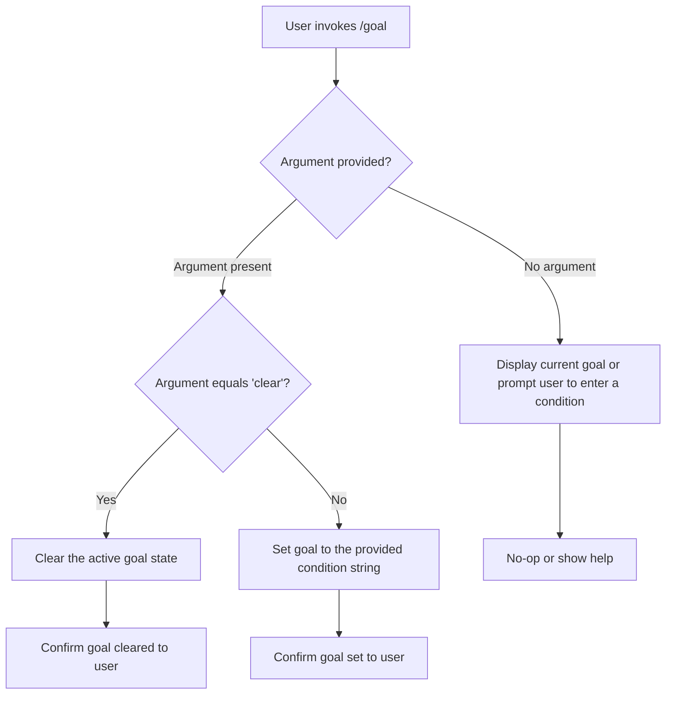

```
---
type: feature-spec
feature: "goal"
cc_version: 2.1.157
updated: "2026-05-19"
tags: ["goal", "commands", "slash-commands"]
source: "bundle-analysis"
bundle_verified: true
inherited_from: 2.1.144
analysis_basis: "CC v2.1.144 bundle.js (AST extraction + Claude interpretation)"
author: "ryujaeuk <ryujaeuk@gmail.com>"
repository: "https://github.com/MyLittleLuckyDog/cc-gnothi"
license: "AGPL-3.0-only"
---

# `/goal`

> Analysis basis: CC v2.1.144 bundle.js (AST extraction + Claude interpretation)
> Minimum version: v2.1.144

---

## Overview

The `/goal` command allows the user to set a persistent goal condition that Claude Code will continue working toward until the stated condition is met. It accepts either a free-text condition string or the literal keyword `clear` to remove an active goal. The command is classified as `local-jsx`, meaning it renders a JSX component inline within the CLI interface rather than delegating to the model.

---

## Registration

| Field | Value |
|---|---|
| type | `local-jsx` |
| name | `goal` |
| description | `Set a goal — keep working until the condition is met` |
| argumentHint | `[<condition> \| clear]` |
| immediate | `true` |
| module_id | `cNq` |

Analysis basis: CC v2.1.144 bundle.js:+11960616

---

## Input Branching

Based on the registered `argumentHint` value `[<condition> | clear]`, the command accepts two mutually exclusive argument forms. Because `immediate: true` is set, the command is processed synchronously without waiting for a model turn.



> **Note:** The exact no-argument behavior (node C) and confirmation messaging (nodes G, H, I) could not be confirmed from depth-2 traversal. See the TODO note in the Behavioral Spec section.

---

## Behavioral Spec

### Goal Dispatch

Because the AST traversal found no entry functions for module `cNq` at depth ≤ 2, the following pseudocode is derived from the registration metadata alone and represents the expected behavioral contract implied by the command's `argumentHint`, `immediate` flag, and description.

```
function handleGoalCommand(rawArgument):
    trimmed = trim(rawArgument)

    if trimmed is empty:
        // No argument supplied
        displayCurrentGoalOrHelp()
        return

    if trimmed equals "clear":
        clearActiveGoal()
        notifyUser("Goal cleared.")
        return

    // Otherwise treat entire trimmed string as condition
    setActiveGoal(condition = trimmed)
    notifyUser("Goal set: " + trimmed)
    return
```

<!-- TODO: not found in depth-2 traversal; needs --depth 4 -->
The internal functions `clearActiveGoal()`, `setActiveGoal()`, and `displayCurrentGoalOrHelp()` are referenced by name above but their implementations reside inside module `cNq`, which yielded no traversable call edges at the current extraction depth.

### Immediate Execution

The `immediate: true` registration field indicates that the command handler is invoked before a model inference turn begins. This means:

1. The goal state is mutated synchronously upon user submission.
2. No model API call is made solely as a result of invoking `/goal`.
3. The updated goal condition is available to subsequent turns within the same session.

Analysis basis: CC v2.1.144 bundle.js:+11960616

### Goal Persistence within Session

The command description states the agent will "keep working until the condition is met," implying that the stored condition is evaluated or surfaced to the model on each subsequent agentic loop iteration. The precise mechanism by which the goal condition is injected into the model's context (e.g., system prompt injection, memory store, or turn prefix) could not be determined from the available traversal data.

<!-- TODO: not found in depth-2 traversal; needs --depth 4 -->

---

## State & Side Effects

| Item | Detail |
|---|---|
| Telemetry | None detected at depth ≤ 2 traversal (`telemetry: []`) |
| Hook registration | <!-- TODO: not found in depth-2 traversal; needs --depth 4 --> |
| appState changes | Goal condition string is written to application state on `set`; cleared on `clear`. Exact state key unknown. |
| Sound | <!-- TODO: not found in depth-2 traversal; needs --depth 4 --> |
| Rendering | Rendered as a JSX component (`type: local-jsx`); output is displayed inline in the CLI without a model round-trip |
| Immediate flag | `immediate: true` — executed synchronously before any model turn |

Analysis basis: CC v2.1.144 bundle.js:+11960616

---

## Version History

| Version | Change |
|---|---|
| v2.1.144 | Initial analysis — registration metadata confirmed; call graph not traversable at depth ≤ 2 |

---

## Common Mistakes

1. **Forgetting the argument**: Running `/goal` with no argument may display current state or a help message rather than clearing the goal. Use `/goal clear` explicitly to remove an active goal.
2. **Expecting model execution**: Because `immediate: true`, invoking `/goal` does not itself trigger a model inference call. The condition will only be acted upon in the *next* agentic turn or message.
3. **Assuming persistence across sessions**: The goal condition is stored in in-session application state. It is expected to be lost when the CLI session ends, unless an explicit persistence mechanism is implemented elsewhere in the bundle.
4. **Using `clear` as a condition string**: The literal string `clear` is reserved as the keyword to remove the active goal. A goal condition that begins with or equals `clear` will trigger goal removal rather than being stored as a condition.
5. **Whitespace-only input**: Passing only whitespace as the condition argument will likely be treated equivalently to no argument after trimming, rather than setting a blank goal.

---

## Appendix — Identifier Mapping

> For bundle debugging only. Identifiers change across versions.

| Identifier | Role |
|---|---|
| `cNq` | Module ID for the `/goal` command implementation (not an obfuscated function name, but included for bundle debugging reference) |

> **Note:** The `identifiers` array returned by the AST extraction was empty (`[]`). No obfuscated short identifiers were resolved at depth ≤ 2 for this command. If deeper traversal is performed, this table should be populated with any mangled names discovered in the `cNq` module internals.
```