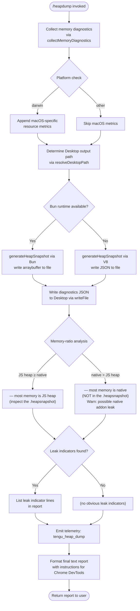

# `/heapdump`

> Analysis basis: CC v2.1.157 bundle.js (AST extraction + Claude interpretation)
> Minimum version: v2.1.157

---

## Overview

`/heapdump` is a hidden developer-diagnostic command that captures a JavaScript heap snapshot of the running Claude Code process, writes it to the user's Desktop directory, and returns a structured memory-usage report alongside instructions for loading the snapshot in Chrome DevTools. It is primarily intended for investigating memory leaks and abnormal heap growth in the Claude Code CLI process itself.

---

## Registration

| Field | Value |
|---|---|
| type | `local` |
| name | `heapdump` |
| description | `Dump the JS heap to ~/Desktop` |
| supportsNonInteractive | `true` |
| isHidden | `true` |
| module_id | `hi1` |
| load_inline | `true` |
| loc_byte | `12302801` |
| loc_byte_end | `12303229` |
| loc_line | `8236` |
| arbor_handler.name | `Ff5` |
| arbor_handler.fqn | `claude-2.1.157::Ff5` |
| arbor_handler.kind | `AsyncFunction` |
| arbor_handler.resolution_path | `module_id` |
| arbor_handler.n_hits | `0` |

Analysis basis: CC v2.1.157 bundle.js:+12302801

---

## Input Branching

The command has four or more meaningful branches depending on runtime state (heap-dump engine availability, platform, memory-ratio analysis, and error conditions), so a Mermaid flowchart is used.



---

## Behavioral Spec

### 1. Entry Point — Handler (`Ff5`)

The async handler (`Ff5`) is the Arbor-resolved entry point for `/heapdump`.

```
async function heapdumpHandler(context):
    lines = []
    diagnosticsResult = await performHeapDumpAndDiagnostics(context)
    lines.push(diagnosticsResult.summaryLines)
    lines.push(
        "Open the .heapsnapshot in Chrome DevTools → Memory → Load to inspect retainers."
    )
    report = lines.join(separator)
    return { type: "text", content: report }
```

Analysis basis: CC v2.1.157 bundle.js:+12301670 (Ff5 → X8A), +12301789 (Ff5 → gf5), +12301816 (Ff5 → _.push), +12301938 (Ff5 → _.join)

---

### 2. Heap Dump Orchestrator (`X8A`)

The core orchestrator function (mapped as `X8A`) coordinates all sub-steps: memory collection, path resolution, file writing, and report formatting.

```
async function orchestrateHeapDump(context):
    // 1. Collect memory diagnostics
    diagnostics = await collectMemoryDiagnostics()   // Ii1

    // 2. Resolve output path
    desktopPath = resolveDesktopPath()               // LvA
    outputDir   = path.join(desktopPath, ...)        // J8A.join

    // 3. Trigger "manual" GC at priority 0 if available
    triggerGarbageCollection(mode="manual", priority=0)  // k6

    // 4. Write diagnostics JSON to Desktop (permissions: 0o600 = 384)
    await fs.writeFile(outputDir + "/diagnostics.json",
                       JSON.stringify(diagnostics),
                       { mode: 384 })                // C_6.writeFile, RH

    // 5. Generate heap snapshot (Bun or V8 path)
    await generateAndWriteHeapSnapshot(outputDir)    // Bf5

    // 6. Handle errors / emit telemetry
    emitTelemetry("tengu_heap_dump")                 // d, F_, kz, SH

    // 7. Build summary report
    report = buildSummaryReport(diagnostics, outputDir)  // N, K
    return report
```

Analysis basis: CC v2.1.157 bundle.js:+12300332 (X8A → k6), +12300345 (X8A → Ii1), +12300628 (X8A → LvA), +12300737 (X8A → J8A.join), +12300780 (X8A → C_6.writeFile), +12300796 (X8A → RH), +12300871 (X8A → Bf5), +12300920 (X8A → d), +12301091 (X8A → F_), +12301178 (X8A → SH)

---

### 3. Memory Diagnostics Collector (`Ii1`)

Gathers a comprehensive snapshot of process and V8 memory state.

```
async function collectMemoryDiagnostics():
    data = {}

    // Node.js / Bun built-ins
    data.memoryUsage    = process.memoryUsage()
    data.heapStats      = v8.getHeapStatistics()          // EI8.getHeapStatistics
    data.resourceUsage  = process.resourceUsage()
    data.uptime         = process.uptime()
    data.heapSpaces     = v8.getHeapSpaceStatistics()     // EI8.getHeapSpaceStatistics

    // Active handles / requests (debug info)
    data.activeHandles   = process._getActiveHandles().length
    data.activeRequests  = process._getActiveRequests().length

    // Linux: open file descriptors
    if platform == "linux":
        fdList = await fs.readdir("/proc/self/fd")        // C_6.readdir
        data.openFDs = fdList.length

    // Linux: smaps_rollup for native RSS breakdown
    if platform == "linux":
        smaps = await fs.readFile("/proc/self/smaps_rollup", "utf8")  // C_6.readFile
        data.smaps = parseSmaps(smaps)

    // JSC diagnostics (bun:jsc module if available)
    jscModule = tryRequire("bun:jsc")
    if jscModule:
        data.jsc = jscModule.diagnostics()               // T (Jv6, Lx8)

    // Connection/session diagnostics
    connDiagnostics = await collectConnectionDiagnostics()  // P.push

    // Uptime converted to hours (divided by 3600)
    // Memory threshold: 1048576 bytes (1 MiB unit)
    // Ratio threshold: 100 (native-vs-heap ratio sentinel)
    data.uptimeHours = (process.uptime() / 3600).toFixed(...)

    // Platform-specific: macOS
    if platform == "macos" (darwin):
        data.platformInfo = collectMacOSMetrics()         // i6

    return data
```

**Key constants:**
- Open-FD path: `/proc/self/fd` (bundle.js:+12298076)
- smaps path: `/proc/self/smaps_rollup` (bundle.js:+12298139)
- File encoding: `"utf8"` (bundle.js:+12298165)
- JSC module name: `"bun:jsc"` (bundle.js:+12298224)
- Uptime divisor: `3600` seconds/hour (bundle.js:+12298365)
- Memory unit: `1048576` bytes = 1 MiB (bundle.js:+12298370)
- Native-vs-heap ratio sentinel: `100` (bundle.js:+12298517)
- Native-leak warning text: `"Native memory > heap - leak may be in native addons…"` (bundle.js:+12298603)
- macOS platform string: `"macos"` / `"darwin"` (bundle.js:+12299457, +12299876)

Analysis basis: CC v2.1.157 bundle.js:+12297833 through +12299450

---

### 4. Desktop Path Resolver (`LvA`)

Determines the correct Desktop directory path cross-platform, including WSL support.

```
function resolveDesktopPath():
    home = os.homedir()                               // ni8.homedir
    candidate = path.join(home, "Desktop")            // e5.join, literal "Desktop"

    // WSL path remapping: /mnt/c/Users/…/Desktop
    if path starts with "/mnt/c/Users":
        // Skip non-user directories: Public, Default, Default User, All Users
        candidate = remapWSLPath(candidate)           // q.replace

    // Ensure directory exists
    ensureDir(candidate)                              // g6

    // Write a test file to verify permissions
    verifyWritable(candidate)                         // N, LvA internal

    return candidate
```

**Key literals:**
- Desktop sub-directory: `"Desktop"` (bundle.js:+1015891)
- WSL prefix: `"/mnt/c/Users"` (bundle.js:+1016113)
- Skipped dirs: `"Public"`, `"Default"`, `"Default User"`, `"All Users"` (bundle.js:+1016157–1016221)

Analysis basis: CC v2.1.157 bundle.js:+1015838 (LvA → i6), +1015845 (LvA → ni8.homedir), +1015881 (LvA → e5.join), +1016021 (LvA → q.replace)

---

### 5. Heap Snapshot Writer (`Bf5`)

Generates and writes the actual `.heapsnapshot` file using either the Bun or V8 API.

```
async function generateAndWriteHeapSnapshot(outputDir):
    if typeof Bun != "undefined":
        // Bun path
        snapshot = Bun.generateHeapSnapshot()         // returns arraybuffer
        Bun.gc(/* force */ true)                      // force GC after snapshot
        fs.writeFileSync(
            path.join(outputDir, "heap.heapsnapshot"),
            Buffer.from(snapshot),
            { encoding: "arraybuffer" }
        )
    else:
        // V8 / Node.js path
        snapshot = v8.writeSnapshot(...)
        fs.writeFileSync(
            path.join(outputDir, "heap.heapsnapshot"),
            snapshot,
            { encoding: "v8" }
        )
```

Analysis basis: CC v2.1.157 bundle.js:+12301350 (Bf5 → ki1.writeFileSync), +12301370 (Bf5 → Bun.generateHeapSnapshot), +12301395 (literal `"v8"`), +12301400 (literal `"arraybuffer"`), +12301427 (Bf5 → Bun.gc)

---

### 6. Report Formatter (`gf5` + `Ff5` assembly)

Builds the human-readable summary returned to the user.

```
function buildTextReport(diagnostics, snapshotPath):
    lines = []

    // Memory ratio determination
    nativeRSS  = diagnostics.memoryUsage.rss
    heapUsed   = diagnostics.memoryUsage.heapUsed
    ratio      = Math.max(nativeRSS / heapUsed, ...)  // gf5 → Math.max

    if heapUsed >= nativeRSS:
        lines.push("— most memory is JS heap (inspect the .heapsnapshot)")
    else:
        lines.push("— most memory is native (NOT in the .heapsnapshot)")

    // Leak indicators
    indicators = detectLeakIndicators(diagnostics)    // b_6
    if indicators.length > 0:
        lines.push(indicators)
    else:
        lines.push("  (no obvious leak indicators)")

    // Footer
    lines.push(
        "Open the .heapsnapshot in Chrome DevTools → Memory → Load to inspect retainers."
    )
    return lines.join("\n")
```

**Key output literals:**
- JS-heap dominant: `"— most memory is JS heap (inspect the .heapsnapshot)"` (bundle.js:+12302113)
- Native dominant: `"— most memory is native (NOT in the .heapsnapshot)"` (bundle.js:+12302173)
- No-indicator line: `"  (no obvious leak indicators)"` (bundle.js:+12302310)
- Chrome DevTools instruction (bundle.js:+12301826)
- Memory ceiling sentinel: `1073741824` bytes = 1 GiB, labeled `"auto-1.5GB"` (bundle.js:+12302719, +12300988)
- Column padding width: `8` characters (bundle.js:+12302445)

Analysis basis: CC v2.1.157 bundle.js:+12302045 (gf5 → Math.max), +12302357 (gf5 → b_6)

---

### 7. GC Trigger (`k6` → `AN`)

Before snapshot generation the orchestrator requests a garbage-collection pass.

```
function triggerGarbageCollection(mode, priority):
    // mode = "manual", priority = 0
    // Calls into AN which wraps the runtime GC API
    gcBridge(mode, priority)   // k6 → AN
```

Analysis basis: CC v2.1.157 bundle.js:+12300332 (X8A → k6), +12300319 (literal `0`), +12300308 (literal `"manual"`)

---

### 8. File Write Permissions

The diagnostics JSON file is written with mode `0o600` (decimal `384`), ensuring it is readable and writable only by the file owner.

File permissions: `384` decimal = `0o600` (bundle.js:+12300815)

---

## State & Side Effects

| Item | Detail |
|---|---|
| Telemetry | `tengu_heap_dump` (bundle.js:+12300922); `tengu_bg_dispatch_sigkill_escalate` (+15466951); `tengu_bg_dispatch_low_mem` (+15467530); `tengu_bg_spare_enable` (+15468225); `tengu_bg_spare_claim` (+15468346); `tengu_bg_spare_claim_fail` (+15468609); `tengu_bg_proto_mismatch` (+15455291); `tengu_bg_dispatch_stale_drop` (+15456530); `tengu_bg_attach_legacy_autorespawn` (+15458606); `tengu_bg_attach` (+15459017); `tengu_bg_attach_stall_gave_up` (+15459929); `tengu_bg_attach_stall_respawn` (+15460198); `tengu_bg_attach_kick` (+15461115) |
| File output | Writes `heap.heapsnapshot` and `diagnostics.json` to the user's Desktop directory |
| File permissions | Diagnostics JSON written with mode `0o600` (384 decimal) |
| GC invocation | Calls runtime GC with `mode="manual"`, `priority=0` before snapshot generation |
| Bun.gc | Forces full garbage collection after heap snapshot (Bun runtime only) |
| appState changes | None observed in depth-2 traversal |
| Sound | None observed in depth-2 traversal |
| Hook registration | `K9` registers with `_OA.register` (bundle.js:+58858); likely a process-lifecycle hook |
| Log writes | Errors routed through `Vi.logError` (bundle.js:+971771) |

---

## Version History

| Version | Change |
|---|---|
| v2.1.157 | Initial analysis |

---

## Common Mistakes

1. **Expecting a visible command**: `/heapdump` is registered with `isHidden: true` — it will not appear in the normal slash-command autocomplete list. You must type it explicitly.
2. **Running on an unsupported platform for native metrics**: The smaps-based native memory breakdown (`/proc/self/smaps_rollup`) is Linux-only. On macOS and WSL the native section of the report will be absent or use a different source.
3. **Confusing the two output files**: The command writes both a `.heapsnapshot` (the V8/Bun heap graph, loadable in Chrome DevTools) and a `diagnostics.json` (structured memory metadata). Only the `.heapsnapshot` is usable in DevTools; `diagnostics.json` is a raw JSON dump for programmatic analysis.
4. **Misreading the "native > heap" warning**: The message `"Native memory > heap - leak may be in native addons (node-pty, sharp, etc.)"` does **not** mean a leak is confirmed — it means the heap snapshot alone will not capture the leak source. Further investigation with native profilers is needed.
5. **Assuming the Desktop path is always `~/Desktop`**: On WSL systems the resolver remaps through `/mnt/c/Users/…` and skips system accounts (`Public`, `Default`, `Default User`, `All Users`). The actual written path may differ from the naive `~/Desktop` expansion.
6. **Not loading the file in the right tool**: The DevTools instruction embedded in the output explicitly directs the user to Chrome DevTools → Memory → Load. Using other snapshot viewers may produce incomplete retainer graphs.

---

## Appendix — Identifier Mapping

> For bundle debugging only. Identifiers change across versions.

| Identifier | Role |
|---|---|
| `Ff5` | Async handler entry point for `/heapdump` (Arbor-resolved) |
| `X8A` | Heap dump orchestrator — coordinates all sub-steps |
| `k6` | GC trigger wrapper (calls `AN`) |
| `AN` | Low-level garbage-collection bridge |
| `Ii1` | Memory diagnostics collector |
| `T` | JSC (bun:jsc) diagnostics accessor; calls `Jv6` and `Lx8` |
| `Jv6` | JSC sub-helper A (called from `T`) |
| `Lx8` | JSC sub-helper B (called from `T` and `P`) |
| `P` | Connection/session diagnostics aggregator |
| `SH` | Structured error/event emitter; calls `F_`, `CH`, `L1`, `X_4`, `Vi.logError` |
| `F_` | Error constructor helper |
| `X` | Subprocess output reader / buffer accumulator |
| `J` | Byte-stream / index helper used by `X` |
| `w` | Background worker / daemon manager |
| `Qf` | Stream-end / flush helper |
| `pB5` | Background daemon protocol handler (message dispatch) |
| `EH` | String-conversion error formatter |
| `N` | Output path builder / file-write orchestrator |
| `QCK` | Subprocess spawner (calls `QI`, `gCK`, `qOA`) |
| `qOA` | Spawn option resolver (calls `QhK`, `dhK`) |
| `H` | Generic timer / random utility (also used as various Map/Set handle) |
| `RH` | JSON serializer wrapper (`JSON.stringify`) |
| `_` | String/array accumulator used in report assembly |
| `v4` | UUID / path-segment generator |
| `uYA` | UUID character-map helper |
| `q` | Queue / array helper (also `JVK.unlinkSync` caller) |
| `A` | Case-normalizer / path-component helper |
| `EuH` | Output writer coordinator; calls `VYA` |
| `VYA` | Low-level stream write helper |
| `lCK` | Log / file-rotation manager |
| `rxH` | Buffered log flusher with timeout |
| `M$H` | Log-file write helper (calls `BYA`, `N0H.join`, `F8`, `k6`) |
| `g6` | Directory ensure / mkdirp utility |
| `qK6` | File-stats helper (calls `j8`) |
| `dYA` | Path join + existence check helper |
| `QYA` | File-rename / rotate helper (`gI.stat`, `gI.rename`, `gI.unlink`) |
| `cCK` | Log-append writer (`gI.mkdir`, `gI.appendFile`) |
| `K9` | Process-lifecycle hook registrar (calls `_OA.register`) |
| `K` | Table / map formatter; pads entries with `padEnd` |
| `L` | Promise-set tracker (`q.add`, `q.delete`, `f.finally`) |
| `f` | Resource-lifecycle manager (`A.close`, `q.close`) |
| `LvA` | Desktop path resolver (homedir + WSL remapping) |
| `Bf5` | Heap snapshot generator and file writer (Bun/V8 dispatch) |
| `d` | Generic error / result handler |
| `kz` | Error classification / re-throw helper |
| `gf5` | Memory-ratio analyser and report line builder |
| `b_6` | Leak-indicator detector (produces indicator lines) |