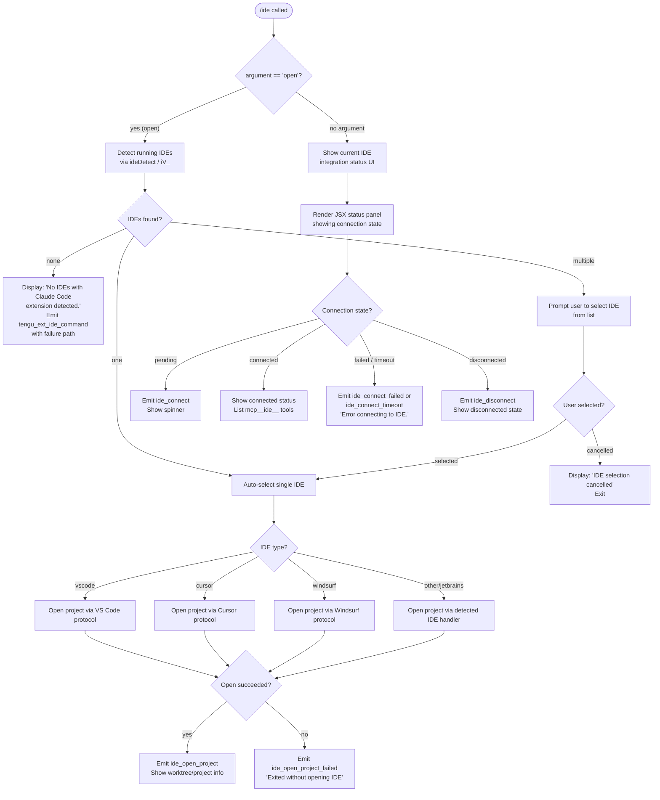

# `/ide`

> Analysis basis: CC v2.1.157 bundle.js (AST extraction + Claude interpretation)
> Minimum version: v2.1.157

---

## Overview

The `/ide` command manages IDE integrations for Claude Code, detecting running IDE instances with the Claude Code extension installed, allowing the user to select one, and optionally opening the project directly in the chosen IDE. It also supports a live connection status UI that reports `ide_connect`, `ide_connect_failed`, and `ide_connect_timeout` events as the integration handshake proceeds.

---

## Registration

| Field | Value |
|---|---|
| type | `local-jsx` |
| name | `ide` |
| description | `Manage IDE integrations and show status` |
| argumentHint | `[open]` |
| module_id | `HR1` |
| load_inline | `true` |
| loc_byte | `11311159` |
| loc_byte_end | `11311315` |
| loc_line | `6867` |
| arbor_handler.name | `oeL` |
| arbor_handler.fqn | `claude-2.1.157::oeL` |
| arbor_handler.kind | `AsyncFunction` |
| arbor_handler.resolution_path | `module_id` |
| arbor_handler.n_hits | `0` |

Analysis basis: CC v2.1.157 bundle.js:+11311159

---

## Input Branching

The command has four or more distinct paths depending on the `[open]` argument and the IDE detection result, making a Mermaid flowchart the appropriate representation.



Analysis basis: CC v2.1.157 bundle.js:+11307273 (handler entry `oeL`), +11307381 (`open` literal), +11307490 (no-IDE message), +11307628 (no-selection message), +11309378 (`ide_connect`), +11310071 (`ide_disconnect`)

---

## Behavioral Spec

### Top-level handler (`oeL`)

The handler is an `AsyncFunction` resolved via `module_id → HR1 → oeL`.

```
async function ideCommandHandler(args, appState):
    emit telemetry("tengu_ext_ide_command", ...)    // +11307275

    if args[0] == "open":
        detectedIDEs = await detectRunningIDEs()    // calls iV_ / ideDetect
        if detectedIDEs is empty:
            display "No IDEs with Claude Code extension detected."
            return
        if detectedIDEs.length == 1:
            selectedIDE = detectedIDEs[0]
        else:
            selectedIDE = await promptUserToSelectIDE(detectedIDEs)
            if selectedIDE is null:
                display "IDE selection cancelled"
                return
        result = await openProjectInIDE(selectedIDE, appState.worktree)
        if result.success:
            emit telemetry("ide_open_project", {type: selectedIDE.type})
            display project info (worktree / project)
        else:
            emit telemetry("ide_open_project_failed", ...)
            display "Exited without opening IDE"
    else:
        // Render JSX status component (eS1)
        render IDEStatusPanel(appState)
```

Analysis basis: CC v2.1.157 bundle.js:+11307273, +11307381, +11307488, +11307801, +11307825, +11307889, +11308031

---

### IDE Detection (`iV_` → `ideDetect` → `mu7`)

```
async function detectRunningIDEs():
    platform = getPlatform()
    if platform == "linux":
        // Run shell command scanning process list for known IDE executables
        // ps aux | grep -E "code|cursor|windsurf|idea|pycharm|..."   // +5332398
        rawOutput = await shellExec(psAuxGrepCommand)
        candidates = parseProcessOutput(rawOutput)
    else:
        candidates = await queryIDERegistryOrProcFS()

    results = []
    for each candidate in candidates:
        ideInfo = await resolveIDEInstance(candidate)   // hu7
        if ideInfo.hasClaudeExtension:
            results.push(ideInfo)
    return results
```

Analysis basis: CC v2.1.157 bundle.js:+11308358 (`iV_`), +5332910 (`mu7`), +5332398 (ps aux grep command), +5325328 (`ide` literal), +5333218 (`IDE` literal)

---

### IDE Instance Resolution (`hu7`)

```
async function resolveIDEInstance(candidate):
    basePaths = [
        path.join(configDir, ".claude"),    // +5325406
        path.join(os.homedir(), ...)
    ]
    // Filter out WSL system paths (/mnt/c/Users/Public, Default, etc.)  // +5325613–5325771
    // Resolve symlinks via QJ9.realpath
    // Check isDirectory / isSymbolicLink
    // Avoid duplicates via a Set
    // Return resolved IDE descriptor with type (vscode/cursor/windsurf/jetbrains)
    return ideDescriptor
```

Analysis basis: CC v2.1.157 bundle.js:+5324076, +5325315, +5325392, +5325451, +5325600, +5325649

---

### Process-list IDE detection (`Wf8`)

```
async function detectFromProcessList(rawArgs):
    port = parseInt(rawArgs[0])      // +5327522
    normalizedPath = normalizePath() // O_
    instances = await buildInstanceList()   // Pf8

    // For each instance, resolve via Iu7 / R1_ using sh -c with 3000ms timeout
    // +2197628 "sh", +2197634 "-c", +2197651 3000 ms timeout
    // Filter by startsWith check
    // Normalize Windows-style path separators
    // Detect jetbrains / appcode   // +5323972, +5332772
    // Emit ide_detect on success   // +5328865
    // Emit ide_detect_failed on error  // +5328929
    return filteredInstances
```

Analysis basis: CC v2.1.157 bundle.js:+5327522, +5327541, +5327571, +5327611, +5327633, +5327940, +5328865, +5328929

---

### Status Panel JSX component (`eS1`)

```
function IDEStatusPanel(props):
    [connectionState, setConnectionState] = useState("pending")  // +11309161
    appState = useAppState()         // J6 / kJ_
    storeRef = useRef()
    useEffect(() => {
        // Subscribe to IDE connection events
        // On connect: setConnectionState("connected"), emit ide_connect  // +11309378
        // On failure: setConnectionState("failed"), emit ide_connect_failed  // +11309465
        // On timeout: setConnectionState("timeout"), emit ide_connect_timeout  // +11309572
        // On disconnect: emit ide_disconnect  // +11310071
    }, [])

    useCallback(handler, deps)      // +11309660

    switch connectionState:
        case "pending":
            render spinner + "Connecting to ..."  // +11310408
        case "connected":
            // List active mcp__ide__ prefixed tools  // +11309968 "mcp__ide__"
            // Show ws: connection info              // +11310188 "ws:"
            // "dynamic" IDE descriptor              // +11310305
            render connection summary
        case "failed":
            render "Error connecting to IDE."       // +11309690
        case "disconnected":
            render disconnected indicator
            suggest "restart your IDE"              // +11308493

    // Display server list (sse-ide / ws-ide endpoints)  // +11305260, +11305280
    // Show up to 100 entries; truncate with ", …"  // +11310617, +11310929
    return JSX panel
```

Analysis basis: CC v2.1.157 bundle.js:+11309161, +11309181, +11309239, +11309253, +11309375, +11309448, +11309534, +11309660, +11309821, +11310061, +11310175, +11310329

---

### Connection list formatting (`bs_`)

```
function formatIDEConnectionList(servers, workers):
    // Take up to 100 entries (literal 100 at +11310617, starting at 0 at +11310636)
    // Math.floor used for index computation  // +11310721
    // Normalize to NFC unicode form          // +11310758
    // Map over queue entries                 // +11310767
    // D.normalize for worker paths           // +11310785
    // Filter by startsWith                   // +11310807
    // Slice server list                      // +11310833
    // Slice worker/daemon list               // +11310892
    // Join with ", " separator               // +11310915
    // Append ", …" if truncated              // +11310929
    return formattedString
```

Analysis basis: CC v2.1.157 bundle.js:+11310617, +11310636, +11310653, +11310660, +11310690, +11310721, +11310746, +11310758, +11310767, +11310785, +11310807, +11310833, +11310892, +11310915, +11310929

---

### IDE open — project launch (`oeL` open branch)

```
async function openIDEProject(selectedIDE, context):
    ideType = selectedIDE.type  // "vscode", "cursor", "windsurf", or JetBrains variant
    emit bold label  // j6.bold  // +11307889
    targetPath = context.worktree ?? context.project  // +11307862, +11307873

    try:
        await triggerIDEOpenProtocol(ideType, targetPath)
        emit "ide_open_project"  // +11307828
    catch error:
        emit "ide_open_project_failed"  // +11307935
        display "Exited without opening IDE"  // +11308225
        suggest "restart your IDE"  // +11308493

    // miH: callback for onInstallIDEExtension hook  // +11308031, +11308402
    // to: additional install/open helper            // +11308429
    // uX: handles IDE name normalization            // +11308468
    // deL: filter/cleanup after open               // +11308884
```

Analysis basis: CC v2.1.157 bundle.js:+11307688 (`vscode`), +11307729 (`cursor`), +11307770 (`windsurf`), +11307828, +11307862, +11307873, +11307889, +11307935, +11308225, +11308402, +11308429, +11308493

---

## State & Side Effects

| Item | Detail |
|---|---|
| Telemetry — `tengu_ext_ide_command` | Fired at handler entry (bundle.js:+11307275) |
| Telemetry — `ide_detect` | Emitted after successful IDE process detection (bundle.js:+5328865) |
| Telemetry — `ide_detect_failed` | Emitted when IDE detection errors (bundle.js:+5328929) |
| Telemetry — `ide_open_project` | Emitted when project opens successfully in IDE (bundle.js:+11307828) |
| Telemetry — `ide_open_project_failed` | Emitted on failure to open project (bundle.js:+11307935) |
| Telemetry — `ide_connect` | Emitted when IDE connection established in status panel (bundle.js:+11309378) |
| Telemetry — `ide_connect_failed` | Emitted on connection failure (bundle.js:+11309465) |
| Telemetry — `ide_connect_timeout` | Emitted on connection timeout (bundle.js:+11309572) |
| Telemetry — `ide_disconnect` | Emitted on disconnect (bundle.js:+11310071) |
| Telemetry — `tengu_bg_spare_enable` | Background spare daemon tracking (bundle.js:+15466284) |
| Telemetry — `tengu_bg_spare_claim` | Spare worker claimed (bundle.js:+15468346) |
| Telemetry — `tengu_bg_spare_claim_fail` | Spare claim failure (bundle.js:+15468609) |
| Telemetry — `tengu_bg_dispatch_sigkill_escalate` | SIGKILL escalation for bg dispatch (bundle.js:+15466951) |
| Telemetry — `tengu_bg_dispatch_low_mem` | Low memory during dispatch (bundle.js:+15467530) |
| Telemetry — `tengu_bg_sendclaim_failed` | Claim send failure to daemon (bundle.js:+15447680) |
| Telemetry — `tengu_bg_roster_parse_failed` | Roster JSON parse error (bundle.js:+11238539) |
| Telemetry — `tengu_bg_attach` | Background attach event (bundle.js:+15459017) |
| Telemetry — `tengu_bg_attach_kick` | Kicked during attach (bundle.js:+15461115) |
| Telemetry — `tengu_bg_attach_legacy_autorespawn` | Legacy PTY auto-respawn during attach (bundle.js:+15458606) |
| Telemetry — `tengu_bg_attach_stall_ms` | Attach stall duration (bundle.js:+15450870) |
| Telemetry — `tengu_bg_attach_stall_gave_up` | Attach stall gave up (bundle.js:+15459929) |
| Telemetry — `tengu_bg_attach_stall_respawn` | Attach stall triggered respawn (bundle.js:+15460198) |
| Telemetry — `tengu_bg_spare_spawn` | Spare process spawned (bundle.js:+15466644) |
| Telemetry — `tengu_daemon_control` | Daemon start/stop control (bundle.js:+15502788) |
| Telemetry — `tengu_daemon_yield` | Daemon yielded to foreground (bundle.js:+15485633) |
| Telemetry — `tengu_daemon_idle_exit` | Daemon exited due to idle (bundle.js:+15486626) |
| Telemetry — `tengu_daemon_config_reload` | Daemon config reloaded (bundle.js:+15481439) |
| Telemetry — `tengu_bg_proto_mismatch` | Background protocol version mismatch (bundle.js:+15455291) |
| Telemetry — `tengu_bg_dispatch_stale_drop` | Stale dispatch dropped (bundle.js:+15456530) |
| Telemetry — `tengu_config_parse_error` | Config file parse error (bundle.js:+3210553) |
| Telemetry — `tengu_bg_low_mem_mb` | Low memory MB report (bundle.js:+12729087) |
| Telemetry — `tengu_feature_ok` / `tengu_feature_bad` / `tengu_feature_sad` | Feature flag result reporting (bundle.js:+966033, +966091, +966168) |
| Telemetry — `tengu_bg_roster_parse_failed` | Roster JSON parse error (bundle.js:+11238539) |
| Hook registration | `onInstallIDEExtension` hook invoked after IDE open attempt (bundle.js:+11308402) |
| appState changes | Connection state tracked via React `useState`; `useEffect` subscribes to IDE connection events (bundle.js:+11309161, +11309253) |
| IDE server endpoints | `sse-ide` (bundle.js:+11305260) and `ws-ide` (bundle.js:+11305280) connections managed |
| Background daemon | Daemon spawned via `Bun.spawn` with `--bg-pty-host`, `--bg-spare` flags (bundle.js:+15446169, +15446187, +15446228) |
| PTY process management | Spare PTY pool maintained; SIGTERM/SIGKILL lifecycle managed (bundle.js:+15446843, +15466999) |
| File I/O | `daemon.status.json` read for daemon status (bundle.js:+12448301); roster JSON written and read |
| Timeout constants | Claim send timeout: 5000 ms (bundle.js:+15448101); stall respawn interval: 300000 ms (bundle.js:+15473715) |
| Sound | <!-- TODO: not found in depth-2 traversal; needs --depth 4 --> |

---

## Version History

| Version | Change |
|---|---|
| v2.1.157 | Initial analysis |

---

## Common Mistakes

1. **Running `/ide open` without the Claude Code extension installed**: The command will report "No IDEs with Claude Code extension detected." even if VS Code, Cursor, or Windsurf is running — the extension must be installed and active in the IDE.
2. **Confusing `/ide` (status) with `/ide open` (launch)**: Invoking `/ide` without `open` only renders the connection status panel; it does not attempt to open or focus the IDE window.
3. **WSL path confusion**: When running inside WSL, the detector intentionally skips system Windows user directories such as `/mnt/c/Users/Public`, `Default`, `Default User`, and `All Users` (bundle.js:+5325613–5325771). User-owned IDE installations under `/mnt/c/Users/<username>` will still be found.
4. **Stale connection after IDE restart**: If the IDE is restarted while Claude Code is open, the status panel will emit `ide_disconnect` and display a disconnected state. The suggestion "restart your IDE" (bundle.js:+11308493) refers to re-triggering the extension's server, not Claude Code itself.
5. **Multiple IDE instances**: When more than one IDE with the extension is detected, the command presents a selection prompt. Dismissing without selecting emits no `ide_open_project` event and exits silently with "IDE selection cancelled" (bundle.js:+11310541).
6. **`mcp__ide__` tool prefix**: Tools provided through the IDE integration all carry the `mcp__ide__` prefix (bundle.js:+11309968). Commands expecting bare tool names will not match these tools.

---

## Appendix — Identifier Mapping

> For bundle debugging only. Identifiers change across versions.

| Identifier | Role |
|---|---|
| `oeL` | Main async handler for `/ide` command (Arbor-resolved, `module_id` path) |
| `bs_` | IDE connection list formatter / truncator |
| `h6` | App-state / context accessor used at handler entry |
| `lB6` | Store retrieval helper (`cB6.getStore`) |
| `O_` | Path normalization helper |
| `AN` | Normalization sub-utility |
| `D` | Daemon/background worker manager; calls normalize, dispose, daemon ops |
| `G6` | Extension/plugin registry normalizer |
| `az6` | Plugin normalization sub-step A |
| `sz6` | Plugin normalization sub-step B |
| `Ex` | Extension entry resolver |
| `CH` | String coercion / charset helper |
| `Zx` | Extension path resolver |
| `e88` | Plugin deduplication / registry lookup |
| `uz_` | UUID-generating extension registrar |
| `Fz_` | Extension finalizer / publisher |
| `S6` | Config file manager (reads, watches, backs up config files) |
| `g6` | Generic logger / debug emitter |
| `sz_` | Config schema validator |
| `szH` | Config file reader/writer with backup rotation |
| `b17` | File watcher for config changes |
| `Ls1` | Daemon status reporter (writes `daemon.status.json`) |
| `ii` | Daemon state introspection helper |
| `s9` | Async store accessor (`$J7.getStore`) |
| `uI6` | Status file path builder |
| `RH` | JSON serializer wrapper |
| `uy8` | macOS memory/freemem query helper |
| `YfA` | Background daemon process spawner and lifecycle manager |
| `X1` | Feature-flag evaluator |
| `hH` | Feature flag "ok" reporter |
| `bH` | Feature flag "bad" reporter |
| `Th1` | Spare PTY socket path builder (main) |
| `tl` | Base PTY directory path builder |
| `Zh1` | Spare PTY socket path builder (alternate) |
| `SB5` | Array validation / capability checker |
| `l$` | `Array.isArray` guard utility |
| `QT` | PTY-pids path builder |
| `bRH` | PTY pid-file path builder |
| `kB5` | Daemon spawn argument assembler |
| `M` | Plugin staging/cleanup manager |
| `cS6` | Plugin name → path resolver (with reserved-path guard) |
| `z` | Daemon stop / teardown controller |
| `hy` | Event emitter / push handler |
| `Fm` | Promise race/all shutdown coordinator |
| `N` | Log/output formatter (handles debug, warn levels, redaction) |
| `QCK` | Log channel selector |
| `v4` | Log line formatter with REDACTED support |
| `EuH` | Log enrichment helper |
| `lCK` | Log writer / file sink |
| `d` | Core utility / shared context object |
| `kz` | Error kind classifier |
| `j8` | Error constructor wrapper |
| `SH` | Message queue / output serializer |
| `F_` | Error/string coercion |
| `L1` | Queue flush helper |
| `fVA` | Queue drain / CH-based formatter |
| `X_4` | Ring buffer (shift/push) for output queue |
| `w` | Background session manager (create, kill, monitor, claim) |
| `S` | Individual background worker / session object |
| `dVK` | Worker realpath / stat resolver |
| `P8` | Error property extractor |
| `HF5` | Worker health-check helper |
| `nW8` | Version directory resolver (`claude/versions`) |
| `Lw6` | Jobs directory / pins.json reader |
| `XP_` | Job path builder |
| `YT` | Base jobs directory path builder |
| `p6` | JSON parser wrapper |
| `sX7` | Job directory scanner and roster loader |
| `K` | Pad/format helper for display columns |
| `u89` | Job directory creator / roster writer |
| `B` | MCP tool filter / `mcp__` prefix handler |
| `VH` | Plugin file loader (`.claude-plugin`, `marketplace.json`) |
| `LB` | File extension checker (`.mcpb`, `.dxt`) |
| `GH` | Plugin detail resolver |
| `l6` | Node type inspectors (`n8`, `AH`) |
| `v6` | MCP transport type mapper (stdio/sse/http/sdk) |
| `dH` | Orphaned-permission checker |
| `E` | Permission entry evaluator |
| `DfA` | Daemon claim sender / IPC handshake manager |
| `a9A` | Auth token writer (creates auth dir, writes JSON with mode 384) |
| `gN6` | Auth directory path builder |
| `fs_` | Auth file path builder |
| `EH` | String coercion (secondary) |
| `yB5` | Claim send-with-timeout implementation |
| `hB5` | TCP connect probe helper |
| `g8` | Promise timeout / abort utility |
| `IB5` | Claim frame builder |
| `QM` | Error message extractor |
| `DF` | Binary frame encoder (UInt32BE + UInt8 for IPC protocol) |
| `GfA` | Background session lifecycle orchestrator (create, adopt, retire, heartbeat) |
| `gK` | Job base-path builder |
| `t9` | Job metadata reader / stat checker / cache manager |
| `YD` | Active-state resolver |
| `CV` | Active-state constant provider |
| `ff` | Roster entry writer (atomic via temp file + rename) |
| `B3` | Atomic file writer (randomBytes temp name, rename, copyFile) |
| `$j` | Roster cache invalidator |
| `G86` | Roster file reader/writer with backup |
| `TF` | Roster JSON parser and validator |
| `ktL` | Roster backup creator |
| `MfH` | MCP frame path builder |
| `GF` | PTY socket path builder (main) |
| `qs_` | PTY socket path resolver |
| `P86` | PTY base directory path builder |
| `Y` | Worker heartbeat / config-reload / start-stop controller |
| `u2H` | Worker config updater |
| `Re1` | Config field max-length enforcer |
| `G` | Remote-control-at-startup handler |
| `FVK` | Heartbeat interval manager |
| `V` | Worker start initiator |
| `R` | Transient write / mtime watcher |
| `oeL` | (see above — primary handler) |
| `HM` | App-state reader at handler entry |
| `Wf8` | Process-list IDE detector (full pipeline) |
| `Pf8` | Instance list builder (parallel via `Promise.all`) |
| `hu7` | Individual IDE instance resolver (path, symlink, WSL filtering) |
| `oq` | Permission error handler (`EACCES`/`EPERM`/etc.) |
| `Iu7` | IDE instance normalizer feeding into `R1_` |
| `R1_` | Shell-command executor with 3000 ms timeout, parseInt, isNaN |
| `G_` | Shell result parser / error handler |
| `seq` | Regex match helper |
| `W` | Platform string uppercaser / `DL` delegator |
| `DL` | Platform detection utility |
| `X` | IPC socket connection handler (data framing, ETOOLARGE, timeouts) |
| `J` | Session reference holder |
| `Qf` | Socket end / response writer |
| `pB5` | Full IPC protocol handler (ping, nudge, yield, lease, dispatch, attach, reply, resize, etc.) |
| `UB5` | Attach stall measurer |
| `tO` | Background-service error formatter |
| `JfA` | Job reply router |
| `TVK` | Dispatch timeout / retry tracker |
| `P` | Terminal repaint coordinator |
| `X0` | PTY PID-file path builder (variant) |
| `c$` | Realpath normalizer for PTY paths |
| `s$H` | Conversation history line reader (identifies user/assistant turns) |
| `uB5` | Stall duration reporter |
| `p` | Deferred write scheduler |
| `b` | Interval-based flush |
| `tAH` | Attach-phase transition helper |
| `mB5` | Running-state supervisor (kill, respawn, phase check) |
| `k` | Away-summary gate (cache age, rate-limit, draft-input checks) |
| `o` | Voice toggle silence-timeout handler |
| `x` | Transient mtime-change watcher |
| `r` | Voice focus silence-timeout handler |
| `g` | React element pair (`B`, `$`) |
| `l` | Filter helper for terminal output lines |
| `a` | IPC write dispatcher (allow/deny) |
| `c` | vS8-based connection wrapper |
| `eS6` | Socket destroy/write helper |
| `T` | Jv6/Lx8 terminal layout helper |
| `lJ9` | Process kill wrapper (`process.kill`) |
| `uX` | IDE name normalizer (toLowerCase, basename, `aNH`) |
| `nq` | String index/slice utility |
| `t6` | Simple value extractor (`d`-based) |
| `v8` | App-state reader variant (`G_`, `h6`) |
| `iV_` | IDE detection entry point (calls `mu7`) |
| `mu7` | Full IDE detection engine (process listing, extension check, push to result array) |
| `JP` | IDE JSON-RPC connector |
| `RGH` | JSON-RPC session manager (wkA, vr8, Nr8, etc.) |
| `to` | Install helper / open-URL delegator |
| `deL` | Post-open filter / cleanup |
| `eS1` | IDE status JSX component (React hooks, connection state machine) |
| `J6` | App-state accessor hook |
| `kJ_` | React context reader with ReferenceError guard |
| `fA` | Secondary app-state accessor |
| `m5` | MCP context hook (useContext, useRef, useMemo, useSyncExternalStore) |
| `fI` | Effect cleanup tracker (`G66`, `K.cleanup`) |
| `G66` | Hash-based deduplication helper (`mrH`) |
| `mrH` | SHA-256 content hasher for command dedup |
| `O` | Output renderer (`k8`) |
| `k8` | Terminal output sink |
| `j` | Worker map iterator (values, kill) |
| `y` | Individual worker kill handler |