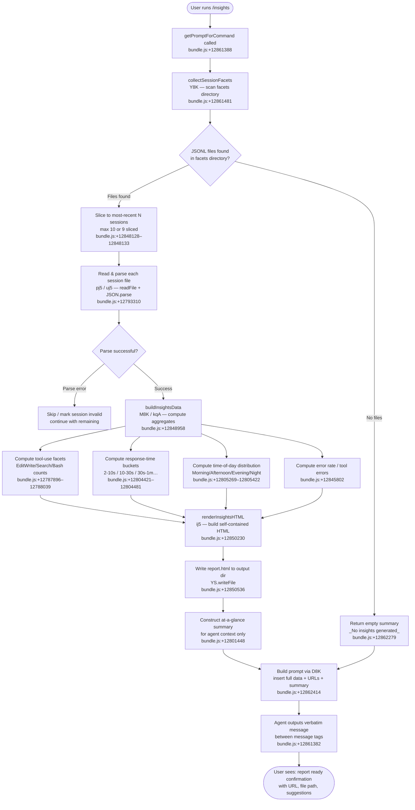

# `/insights`

> Analysis basis: CC v2.1.157 bundle.js (AST extraction + Claude interpretation)
> Minimum version: v2.1.157

---

## Overview

`/insights` generates a shareable HTML report analyzing the user's accumulated Claude Code session data. The command collects session history from on-disk JSONL facets, computes statistical aggregates across multiple dimensions (tool usage, response times, time-of-day patterns, error rates), renders the results into a self-contained HTML file, and then instructs the agent to relay a formatted confirmation message verbatim — including a report URL, file path, and facets directory — so the user can immediately open or share the report.

---

## Registration

| Field | Value |
|---|---|
| type | `prompt` |
| name | `insights` |
| description | Generate a report analyzing your Claude Code sessions |
| loc_byte | `12861208` |
| loc_byte_end | `12862512` |
| loc_line | `9918` |
| handler_method | `getPromptForCommand` |
| handler_method_start | `12861382` |
| handler_method_end | `12862511` |
| prompt_body.length | `513` |
| prompt_body.trace | `call→D8K(...) (1 literals)` |
| arbor_handler.name | `getPromptForCommand` |
| arbor_handler.fqn | `claude-2.1.157::getPromptForCommand` |
| arbor_handler.kind | `Method` |
| arbor_handler.resolution_path | `direct` |
| arbor_handler.n_hits | `1` |

Analysis basis: CC v2.1.157 bundle.js:+12861208

---

## Input Branching

The `/insights` command execution involves more than three distinct branches across session discovery, data aggregation, report rendering, and prompt construction. A Mermaid flowchart is used below.



---

## Behavioral Spec

### 1. Handler Entry — `getPromptForCommand`

The handler is an inline `ObjectMethod` on the registration object, resolved directly by Arbor at `claude-2.1.157::getPromptForCommand` (bundle.js:+12861388).

```
async function getPromptForCommand(context):
    sessionList  = await collectSessionFacets(context)       // Y8K
    insightsData = await buildAndRenderReport(sessionList)   // Y8K sub-calls
    prompt       = buildPromptText(insightsData)             // D8K + RH
    return { type: "prompt", prompt: prompt }
```

Analysis basis: CC v2.1.157 bundle.js:+12861382

---

### 2. Facets Directory Discovery — `listProjectFacetDirs`

The handler calls the facets-directory lister (`oj5`) to enumerate project subdirectories under the user-data path.

```
async function listProjectFacetDirs(basePath):
    entries = await fs.readdir(basePath)                     // YS.readdir :+12847878
    dirs    = entries.filter(e => e.isDirectory())           // K.isDirectory :+12847946
    for each dir in dirs:
        files = await listJsonlFiles(dir)                    // XA6 :+12848036
        if files.length > 0:
            push dir to results
    results = results.sort(...)                              // q.sort :+12848182
    return results
```

`listJsonlFiles` (`XA6`) filters entries whose name ends with `".jsonl"` (bundle.js:+12931946) and are regular files (`K.isFile` :+12931917). It then calls `fs.stat` on each file to collect metadata (`M7.stat` :+12932149).

Analysis basis: CC v2.1.157 bundle.js:+12847859 – +12848182

---

### 3. Session Selection — `selectRecentSessions`

The handler trims the discovered session list to the most recent sessions before expensive processing.

```
function selectRecentSessions(sessionList):
    // Upper bound: 10 entries scanned, 9 sliced
    // bundle.js:+12848128, +12848133
    return sessionList.slice(0, 10 or 9)
```

The slice constants 10 and 9 appear at bundle.js:+12848128 and +12848133 respectively. Sessions are limited to keep prompt construction bounded.

Analysis basis: CC v2.1.157 bundle.js:+12848128

---

### 4. Session File Reading — `readSessionMeta` and `readUsageData`

Two distinct file-reading helpers operate in parallel:

- `readSessionMeta` (`pj5`): joins the session-meta path (`"session-meta"` literal, bundle.js:+12787299), reads the file via `YS.readFile` (bundle.js:+12793310), then JSON-parses it via `p6` (bundle.js:+12793355).
- `readUsageData` (`uj5`): joins the usage-data path (`"usage-data"` literal, bundle.js:+12787203), reads and parses similarly (bundle.js:+12792938 – +12792974). If the parsed file is stale or invalid, it is unlinked via `YS.unlink` (bundle.js:+12793002).

Both helpers call the path-builder helper `vqA` → `Vy6`, which resolves the `"facets"` subdirectory (bundle.js:+12787253).

```
async function readSessionData(sessionDir):
    [meta, usage] = await Promise.all([
        readSessionMeta(sessionDir),   // pj5
        readUsageData(sessionDir)      // uj5
    ])
    return { meta, usage }
```

Analysis basis: CC v2.1.157 bundle.js:+12848404

---

### 5. Aggregate Computation — `buildInsightsData`

The core aggregation pipeline (`M8K` + `kqA`) iterates over all parsed session objects and computes multiple facets:

```
function buildInsightsData(sessions):
    toolCounts   = {}
    timeBuckets  = { "2-10s":0, "10-30s":0, "30s-1m":0,
                     "1-2m":0, "2-5m":0, "5-15m":0, ">15m":0 }
    timeOfDay    = { "Morning (6-12)":0, "Afternoon (12-18)":0,
                     "Evening (18-24)":0, "Night (0-6)":0 }
    errorCounts  = {}

    for each session in sessions:
        // Tool usage: detect WebSearch, WebFetch, Edit, Write, git commit, git push
        // bundle.js:+12787896, +12787920, +12788027, +12788039, +12788283, +12788315
        tally tool invocations into toolCounts

        // Response time bucketing (seconds thresholds: 120, 900)
        // bundle.js:+12804641, +12804723
        classify response durations into timeBuckets

        // Time-of-day bucketing by hour
        // hours: Morning [7,11], Afternoon [12-17], Evening [18-23], Night [0-4]
        // bundle.js:+12805269–12805451
        classify session start-hour into timeOfDay

        // Error detection: "Command Failed", "Edit Failed", "File Not Found", etc.
        // bundle.js:+12788914, +12789086, +12789310
        tally into errorCounts

    // Sessions capped at 3600 seconds for hourly bucketing
    // bundle.js:+12788700
    return { toolCounts, timeBuckets, timeOfDay, errorCounts, sessionCount }
```

Key numeric constants used in aggregation:
- Session hour cap: 3600 seconds (bundle.js:+12788700)
- Response time upper thresholds: 120 s and 900 s for the "1-2m" and "5-15m" buckets (bundle.js:+12804641, +12804723)
- Parallel file read limit: 50 / 200 (bundle.js:+12848270, +12848275)
- Max report token budget: 4096 characters (bundle.js:+12795152)

Analysis basis: CC v2.1.157 bundle.js:+12848958

---

### 6. HTML Report Rendering — `renderInsightsHTML`

The HTML renderer (`ij5`) takes the aggregated data and produces a self-contained HTML document written to `report.html` (bundle.js:+12850508).

```
function renderInsightsHTML(data, outputDir):
    html = buildHtmlSkeleton()
    html += renderToolSection(data.toolCounts)       // dfH :+12842064
    html += renderResponseTimeSection(data.timeBuckets) // cj5 :+12842756
    html += renderTimeOfDaySection(data.timeOfDay)   // lj5 :+12845589
    html += renderErrorSection(data.errorCounts)     // bundle.js:+12845802

    // HTML escape applied via U5/YL (replaceAll & → &amp; etc.)
    // bundle.js:+12806055, +12806100
    // Markdown-to-HTML: bold via <strong>$1</strong> :+12806127
    // Bullet points as "• " :+12806170
    // Line breaks as <br> :+12806200
    // Empty-state messages: "<p class=\"empty\">No data</p>" :+12803912

    // Chart colors used: #2563eb, #0891b2, #10b981, #8b5cf6,
    //                    #dc2626, #16a34a, #eab308
    // bundle.js:+12842086–12846544

    outputPath = path.join(outputDir, "report.html")  // :+12850508
    await fs.mkdir(outputDir, { recursive: true })    // :+12850249
    await fs.writeFile(outputPath, html)              // :+12850536
    return { outputPath, reportUrl }
```

The at-a-glance summary key used internally is `"at_a_glance"` (bundle.js:+12801448). When no data is available the fallback value is `"None captured"` (bundle.js:+12800782).

Analysis basis: CC v2.1.157 bundle.js:+12850230

---

### 7. Report File Path Construction — `buildReportPaths`

Path construction chains `ay8` → `Vy6` → `QF.join`, always anchoring outputs beneath the `"facets"` subdirectory (bundle.js:+12787253) of the user-data root. The output filename is always `report.html` (bundle.js:+12850508). The timestamp embedded in the directory name uses full `Date` components: `getFullYear`, `getMonth`, `getDate`, `getHours`, `getMinutes`, `getSeconds` (bundle.js:+12850340–12850438).

Analysis basis: CC v2.1.157 bundle.js:+12862478

---

### 8. Prompt Construction — `buildInsightsPrompt`

The prompt is assembled by `D8K` (called at bundle.js:+12862414), which interpolates:

1. The full serialized insights data object.
2. The report URL (shareable link).
3. The HTML file path on disk.
4. The facets directory path.
5. An at-a-glance summary (for agent context only — explicitly noted as not yet seen by the user).
6. A `<message>…</message>` block containing the user-facing confirmation text.

The prompt body instructs the agent: output the text between `<message>` tags **verbatim** as its entire response, without omitting any line. This is the mechanism by which the agent relays a consistent, pre-formatted confirmation rather than generating free text.

The `"_No insights generated_"` literal (bundle.js:+12862279) is substituted when no sessions were found, producing a graceful empty-state message instead of a structured report.

The separator `" · "` (bundle.js:+12861840) is used in the at-a-glance summary to join summary fragments.

Analysis basis: CC v2.1.157 bundle.js:+12862414

---

### 9. Session Data Pipeline — `buildSessionReport` (full orchestration via `Y8K`)

```
async function buildSessionReport(context):
    facetDirs     = await listProjectFacetDirs(context.dataRoot)   // oj5
    recentDirs    = selectRecentSessions(facetDirs)                // A.slice :+12848324
    sessionData   = await Promise.all(                             // :+12848347
                        recentDirs.map(d => readSessionData(d))    // B.map :+12848359
                    )
    aggregated    = buildInsightsData(sessionData)                 // kqA :+12848958
    reportPaths   = buildReportPaths(context)                      // Vy6 :+12850258
    await renderAndWriteReport(aggregated, reportPaths)            // ij5 :+12850230
                                                                   // YS.writeFile :+12850536
    atAGlance     = computeAtAGlance(aggregated)                   // gj5 :+12850219
    return { aggregated, reportPaths, atAGlance }
```

Analysis basis: CC v2.1.157 bundle.js:+12861481

---

## State & Side Effects

| Item | Detail |
|---|---|
| Telemetry | `tengu_transcript_phantom_parent` (bundle.js:+12917719); `tengu_relink_walk_broken` (bundle.js:+12897458); `tengu_chain_parent_cycle` (bundle.js:+12899227); `tengu_chain_timestamp_fallback` (bundle.js:+12899376); `tengu_chain_parallel_tr_recovered` (bundle.js:+12901242); `tengu_transcript_parent_cycle` (bundle.js:+12921344); `tengu_daemon_control` (bundle.js:+15502788); various background/daemon events via `wAH` sub-graph |
| File writes | `report.html` written to the timestamped output directory under the facets path (bundle.js:+12850536) |
| Directory creation | Output directory created with `fs.mkdir` recursive (bundle.js:+12850249) |
| File deletions | Stale usage-data files may be unlinked via `YS.unlink` (bundle.js:+12793002); stale JSONL files removed via `JVK.unlinkSync` (bundle.js:+15445005) |
| Hook registration | <!-- TODO: not found in depth-2 traversal; needs --depth 4 --> |
| appState changes | Session metadata maps updated via `wAH` (multiple `.set` calls on internal Maps: `summary`, `last-prompt`, `custom-title`, `ai-title`, `tag`, `agent-name`, `agent-color`, `agent-setting`, `mode`, `permission-mode`, `isolation-latch`, `worktree-state`, `pr-link`, `bridge-session`, `file-history-snapshot`, `attribution-snapshot`, `content-replacement`, `fork-context-ref`, `marble-origami-commit`, `marble-origami-snapshot` — all via `wAH`) |
| Sound | <!-- TODO: not found in depth-2 traversal; needs --depth 4 --> |

---

## Version History

| Version | Change |
|---|---|
| v2.1.157 | Initial analysis |

---

## Common Mistakes

1. **Running `/insights` with no prior sessions**: If no JSONL facet files exist in the facets directory, the command outputs `_No insights generated_` (bundle.js:+12862279) rather than a structured report. Users should run at least one Claude Code session before invoking `/insights`.
2. **Expecting real-time data**: The command reads from pre-written JSONL facet files on disk; it does not introspect the current in-progress session. Events from the current conversation will not appear until they are flushed to disk.
3. **Assuming the report is dynamic**: The HTML file is a static snapshot written at invocation time. Re-running `/insights` is required to refresh the report.
4. **Misinterpreting the at-a-glance summary**: The summary embedded in the agent's prompt context is intended for agent reasoning only and is not shown to the user before the agent's response — the prompt body explicitly marks it as `"for your context only"`.
5. **Expecting more than 10 sessions**: The session slice is capped (constants 10/9 at bundle.js:+12848128, +12848133); only the most recent sessions are included in the aggregation.
6. **Modifying the agent response**: The prompt instructs the agent to output the `<message>` block verbatim. Any agent behaviour that paraphrases or truncates the block will result in an incomplete confirmation message.

---

## Appendix — Identifier Mapping

> For bundle debugging only. Identifiers change across versions.

| Identifier | Role |
|---|---|
| `__handler_insights` | Synthetic BFS entry-point for the `/insights` command handler |
| `Y8K` | Main session-report orchestration function (collects, aggregates, renders) |
| `oj5` | Facets directory lister — enumerates project subdirectories |
| `mc` | Path join helper used during directory listing |
| `XA6` | JSONL file lister — finds `.jsonl` files within a facets subdirectory |
| `$a` | Filename filter predicate (regex test against file extensions) |
| `N` | Log/format utility used in multiple contexts |
| `pj5` | Session-meta file reader (reads and parses `session-meta` JSON) |
| `vqA` | Path resolver — joins facets subdirectory paths |
| `Vy6` | Base path builder for the `facets` directory |
| `$8K` | JSON parse error handler / fallback for session-meta |
| `p6` | JSON.parse wrapper utility |
| `M` | File path resolver / cleanup helper |
| `cS6` | Relative-path normaliser and staging-path validator |
| `lS6` | Plugin path builder using `"plugins"/"synced"` structure |
| `g` | Session state accessor |
| `$` | Session record builder / timestamp utility |
| `Ls1` | Session record constructor (date, uuid, tokens) |
| `sy8` | Session state snapshot builder |
| `wAH` | Session metadata store — large Map-based state manager |
| `wJ5` | Session state initialiser |
| `CC` | Internal constant or config accessor |
| `yYA` | Array/object normalisation helper |
| `Ej` | Session event emitter or change notifier |
| `q_K` | Session chain key-value accumulator |
| `j5H` | Session chain builder — constructs ordered message chains |
| `IJ5` | Chain NaN-guard / deduplication helper |
| `yJ5` | Chain sorting and indexing helper |
| `NJ5` | Chain queue processor (shift/push pipeline) |
| `jeH` | Map-over-entries helper |
| `iqA` | Transcript text cleaner / compact-summary stripper |
| `tk6` | Transcript segment formatter |
| `oqA` | Content-filter predicate (image/document exclusion) |
| `hJ5` | Array-some predicate for content type checking |
| `SJ5` | Array-some predicate for content type checking (variant) |
| `Mh8` | Metric accumulator helper |
| `$h8` | Map-to-array converter for session values |
| `kqA` | Insights data aggregation pipeline |
| `M8K` | Per-session facet extractor (tools, times, errors) |
| `Ey6` | Time-bucketing helper |
| `yj5` | File-extension extractor |
| `HjH` | Diff computation helper |
| `H7` | String index search utility |
| `z$` | Rounding/normalisation helper |
| `NqA` | Summary field extractor |
| `Uj5` | Report output directory writer (mkdir + writeFile) |
| `RH` | JSON.stringify wrapper |
| `uj5` | Usage-data file reader (reads, parses, may unlink stale file) |
| `ay8` | Report output path builder |
| `w8K` | Stale-file detection helper |
| `Bj5` | Full report builder — coordinates HTML rendering pipeline |
| `xj5` | Parallel section renderer with chunked Promise.all |
| `Rj5` | Section data formatter / chunker |
| `rXH` | Report section HTML generator |
| `EK` | HTML template engine or string builder |
| `YZ8` | File-based cache with SHA-1 hashing (uuid + hash) |
| `E8` | Cache entry builder (randomUUID) |
| `jCH` | Report section template renderer |
| `fT` | Final HTML assembly helper |
| `f8K` | Report type registry |
| `Z0` | Report type definition object |
| `jK` | HTML section filter |
| `F_` | Error-to-string converter |
| `mj5` | Per-section file writer (mkdir + writeFile) |
| `aj5` | Object-key iterator for report fields |
| `z8K` | Statistical aggregation engine (percentiles, median, sort) |
| `JA6` | Object.entries iterator for report data |
| `nq` | String slice helper (indexOf + slice) |
| `O8K` | Numeric distribution helper (sort, set, add) |
| `gj5` | At-a-glance summary builder |
| `L8K` | Per-section report renderer |
| `vj5` | Section path resolver |
| `ij5` | Full HTML report renderer — main rendering entry point |
| `U5` | HTML escape utility (replaceAll for &, <, >, ", ') |
| `YL` | HTML entity replacer |
| `oy8` | Markdown-to-HTML converter |
| `nj5` | JSON serialiser for report embedding |
| `dfH` | Tool-usage section renderer |
| `cj5` | Response-time section renderer |
| `lj5` | Time-of-day section renderer |
| `D8K` | Prompt body interpolation function (called 1 time with literals) |
| `hj5` | NaN guard for numeric report fields |
| `VH` | MCP plugin file reader / validator |
| `LB` | File extension matcher (`.mcpb`, `.dxt`) |
| `GH` | Plugin configuration handler |
| `l6` | Plugin metadata accessor |
| `v6` | MCP server configuration builder (stdio/sse/http/sdk) |
| `dH` | Orphaned-permission checker |
| `B` | Session message filter / MCP tool-use filter |
| `SH` | Structured error logger with stack trace |
| `CH` | String coercion utility |
| `BJ5` | Binary JSONL reader (Buffer-based, openSync/readSync) |
| `FJ5` | Binary file header reader |
| `UJ5` | Binary JSONL parser (Buffer.concat + compare) |
| `BGH` | Encoding/compression helper group |
| `oq` | Error code classifier |
| `F8K` | Session relink walker |
| `x` | Debounced writer / progress ticker |