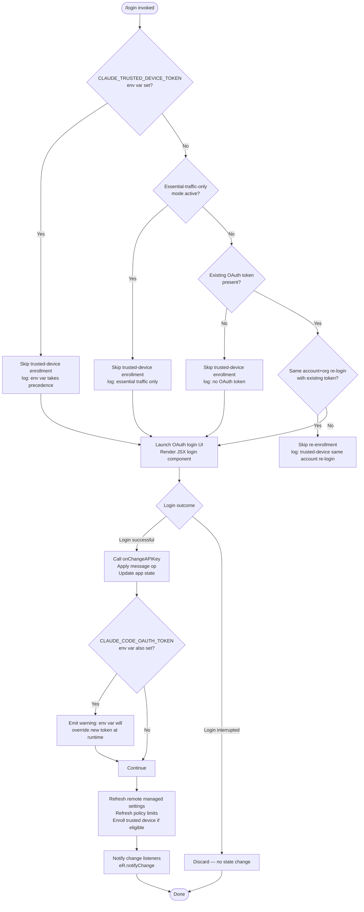

# `/login`

> Analysis basis: CC v2.1.157 bundle.js (AST extraction + Claude interpretation)
> Minimum version: v2.1.157

---

## Overview

The `/login` command allows the user to switch Anthropic accounts or sign in with an Anthropic account from within an active Claude Code session. It launches an interactive OAuth-based authentication flow as a local-JSX UI component, updates the stored API key / OAuth token in application state, and triggers downstream side effects such as policy-limits refresh, remote managed-settings refresh, and trusted-device enrollment.

---

## Registration

| Field | Value |
|---|---|
| type | `local-jsx` |
| name | `login` |
| description | `"Switch Anthropic accounts \| Sign in with your Anthropic account"` |
| module_id | `_51` |
| load_inline | `true` |
| loc_byte | `11346347` |
| loc_byte_end | `11346580` |
| loc_line | `7351` |
| arbor_handler.name | `JR1` |
| arbor_handler.fqn | `claude-2.1.157::JR1` |
| arbor_handler.kind | `Function` |
| arbor_handler.resolution_path | `direct` |
| arbor_handler.n_hits | `2` |

Analysis basis: CC v2.1.157 bundle.js:+11346347–+11346580

---

## Input Branching

The command follows several distinct branches depending on the current authentication environment, prior session state, and the outcome of the OAuth flow. Six or more distinct paths are identifiable from the literals and callGraph, so a Mermaid flowchart is used.



Analysis basis: CC v2.1.157 bundle.js:+9131058, +9131311, +9131685, +9132060, +9132079, +6887084, +6887197, +6886770

---

## Behavioral Spec

### 1. Handler Entry — `loginCommandHandler` (bundle: `JR1` / outer wrapper: `oW8`)

The registered command handler (resolved by Arbor as `JR1`, `direct` path, 2 hits) renders a JSX component (`xVL`/`pXH`) inline. On invocation it:

1. Reads current app state via `H.getAppState` (bundle.js:+9131466).
2. Checks whether this is a same-account-and-org re-login with an existing token (bundle.js:+9131311); if so, skips the full OAuth exchange and logs `"[trusted-device] Same account+org re-login with existing token, skipping re-enrollment"`.
3. Otherwise spawns the interactive login UI.

```
function loginCommandHandler(appContext):
    currentState = appContext.getAppState()
    if isSameAccountRelogin(currentState):
        log("[trusted-device] Same account+org re-login with existing token, skipping re-enrollment")
        return earlyExit()
    result = renderLoginJSXComponent(appContext)
    handleLoginResult(result, appContext)
```

Analysis basis: CC v2.1.157 bundle.js:+9131058, +9131145, +9131303, +9131466

---

### 2. OAuth Flow — `oauthFlowRunner` (bundle: `$oH`)

The JSX login component orchestrates the OAuth flow:

1. Determines the correct OAuth endpoint (production `api.anthropic.com` at bundle.js:+2047139, or environment-overridden local endpoints at +950273 / +950360 / +950450; custom URL validated against approved list at +951338).
2. Posts credentials via `c_.post` (bundle.js:+6887298).
3. Emits telemetry and waits up to 10 000 ms timeout (bundle.js:+6887486) with a 500 ms retry delay (bundle.js:+6887512).
4. On HTTP 201 (bundle.js:+6887674), extracts the returned token.
5. Validates the presence of `device_token`; if missing, logs `"[trusted-device] Enrollment response missing device_token field"` (bundle.js:+6887871).
6. On failure, categorises errors as `http_error`, `missing_token`, `storage_failed`, or `unknown` (bundle.js:+6887793, +6887972, +6888180, +6888133).

```
async function oauthFlowRunner(context):
    endpoint = resolveOAuthEndpoint(context)   // prod or local/staging/custom
    response = await post(endpoint, credentials, timeout=10000)
    if response.status == 201:
        token = response.body.device_token
        if token is missing:
            reportError("missing_token")
            return failure
        storeToken(token)
        return success(token)
    else:
        categoriseHttpError(response.status)
        return failure
```

Analysis basis: CC v2.1.157 bundle.js:+6887298, +6887486, +6887512, +6887674, +6887793, +6887871, +6887972, +6888133, +6888180

---

### 3. API Key / Token Update — `applyAuthChange` (bundle: `oW8` → `H.onChangeAPIKey` + `H.applyMessageOp`)

After a successful login:

1. Calls `H.onChangeAPIKey` (bundle.js:+9131058) to propagate the new API key or OAuth token.
2. Calls `H.applyMessageOp` with opcode `"update"` (bundle.js:+9131077, +9131100) to record the authentication change as a message operation in the session.
3. Calls `H.setAppState` (bundle.js:+9131562) to persist the updated state.

```
function applyAuthChange(newToken, sessionHandle):
    sessionHandle.onChangeAPIKey(newToken)
    sessionHandle.applyMessageOp({ type: "update", payload: newToken })
    sessionHandle.setAppState(mergeAuthState(sessionHandle.getAppState(), newToken))
```

Analysis basis: CC v2.1.157 bundle.js:+9131058, +9131077, +9131100, +9131562

---

### 4. Environment-Variable Override Warning (bundle: `oW8` → literal at +9131685)

After storing the new token, the handler checks whether the `CLAUDE_CODE_OAUTH_TOKEN` environment variable is also set. If it is, the user is shown the following advisory (bundle.js:+9131685):

> "Warning: CLAUDE_CODE_OAUTH_TOKEN is set in your environment and will override this login token at runtime. After logging in, unset that variable for your new credentials to take effect."

This is displayed at severity `"warning"` / priority `"high"` (bundle.js:+9130571, +9130590) via the `"auto-mode-gate-notification"` notification channel (bundle.js:+9130528).

Analysis basis: CC v2.1.157 bundle.js:+9131685, +9130528, +9130571, +9130590

---

### 5. Post-Login Refresh — `authChangePoller` (bundle: `PoH`) and related helpers

On successful authentication the following refresh pipeline runs:

#### 5a. Remote Managed Settings Refresh (`remoteSettingsRefresher` — bundle: `Ry_`)

```
async function remoteSettingsRefresher(authContext):
    hash = computeSettingsHash(currentSettings)   // SHA-256 hex (bundle.js:+6892909)
    response = await fetchRemoteSettings(
        headers = { "User-Agent": ..., "If-None-Match": hash }
    )
    switch response.status:
        case 200: applyNewSettings(response.body); log("Remote settings: Applied new settings successfully")
        case 204: log("Remote settings: Applied new settings successfully")
        case 304: log("Remote settings: Cache still valid (304 Not Modified)")
        case 401: scheduleForceRefreshRetry(); emit tengu_remote_settings_401_force_refresh_retry
        case 404: deleteLocalCacheFile(); log("Remote settings: Deleted cached file (404 response)")
        default:  useStaleCacheIfAvailable(); log("Remote settings: Using stale cache after error")
    notifyChange()
```

HTTP status codes observed: 200, 204, 304, 401, 404 (bundle.js:+6922279, +6922288, +6922297, +6923219, +6922306).

Log messages include `"Remote settings: Refreshed after auth change"` (bundle.js:+6925912) and `"Remote settings: Using stale cache after fetch failure"` (bundle.js:+6924401).

Analysis basis: CC v2.1.157 bundle.js:+6892909, +6922159, +6922185, +6922279–+6922306, +6923219, +6924401, +6925912

#### 5b. Policy Limits Refresh (`policyLimitsLoader` — bundle: `CS9`)

Triggered in parallel with remote-settings refresh (bundle.js:+6882696):

```
async function policyLimitsLoader(authContext):
    authType = detectAuthType()   // "wif" | "oauth" | "api_key"
    response = await fetchPolicyLimits(authContext)
    switch outcome:
        case success_new:    applyPolicyRestrictions(response); log("Policy limits: Applied new restrictions successfully")
        case success_empty:  log("Policy limits: No restrictions (cached empty)")
        case 304:            log("Policy limits: Cache still valid (304 Not Modified)")
        case stale_fallback: log("Policy limits: Using stale cache after fetch failure")
        case error:          log("Policy limits: Using stale cache after error")
    emit tengu_policy_limits_fetch
```

Auth-type literals: `"wif"` (+6880666), `"oauth"` (+6880705), `"api_key"` (+6880722).

Analysis basis: CC v2.1.157 bundle.js:+6880666, +6880705, +6880722, +6882696, +6882819, +6883267

#### 5c. Trusted-Device Enrollment (`trustedDeviceEnroller` — bundle: `$oH`)

Skipped when any of the following is true (evaluated in order):
1. `CLAUDE_TRUSTED_DEVICE_TOKEN` env var is set (bundle.js:+6886770).
2. Essential-traffic-only mode is active (bundle.js:+6887084).
3. No OAuth token is present (bundle.js:+6887197).

When conditions allow enrollment, the enroller calls the bridge endpoint, emitting telemetry event `bridge_trusted_device_enroll` (bundle.js:+6887588). On macOS (`"darwin"`, bundle.js:+6887393), the request carries `Content-Type: application/json` (bundle.js:+6887443).

Analysis basis: CC v2.1.157 bundle.js:+6886770, +6887084, +6887197, +6887393, +6887443, +6887588

---

### 6. Settings Cache Write — `settingsCacheWriter` (bundle: `Qs7`)

When new settings are fetched, they are written atomically:

```
function settingsCacheWriter(settingsData):
    fd = openFile(cacheFilePath, flags=O_RDWR|O_CREAT)    // KIH.open
    writeFile(fd, JSON.stringify(settingsData), encoding="utf-8", maxBytes=384)
    datasync(fd)
    close(fd)
```

File size limit: 384 bytes (bundle.js:+6923662). Encoding: `"utf-8"` (bundle.js:+6923712).

Analysis basis: CC v2.1.157 bundle.js:+6923647, +6923662, +6923677, +6923712, +6923728, +6923755

---

### 7. Settings Hash Computation — `settingsHasher` (bundle: `FS9`)

Settings are hashed before being sent as `If-None-Match` values:

```
function computeSettingsHash(settingsObject):
    canonical = toCanonicalRepresentation(settingsObject)  // Yy_: handles arrays + objects recursively
    raw = JSON.stringify(canonical)
    return crypto.createHash("sha256").update(raw).digest("hex")
```

Algorithm: `"sha256"`, encoding: `"hex"` (bundle.js:+6892909, +6892936).

Analysis basis: CC v2.1.157 bundle.js:+6892863, +6892909, +6892936

---

### 8. Background Polling Setup — `backgroundPoller` (bundle: `W38` / `bS9`)

After login, background polling is registered:
- `setInterval` / `clearInterval` pair at bundle.js:+6879307 / +6879375 drives the polling loop.
- `K9` registers an exit handler via `_OA.register` (bundle.js:+58858) to ensure clean shutdown.

Analysis basis: CC v2.1.157 bundle.js:+6879307, +6879375, +6884365, +6884412

---

### 9. Interrupt / Cancellation Path

If the user cancels the login flow (e.g., presses Ctrl-C / `"app:interrupt"` at bundle.js:+4064417 or Ctrl-D / `"app:exit"` at bundle.js:+4064435), the UI component emits `"Login interrupted"` (bundle.js:+9132079) and returns without modifying authentication state.

Analysis basis: CC v2.1.157 bundle.js:+9132079, +4064417, +4064435

---

## State & Side Effects

| Item | Detail |
|---|---|
| Telemetry — `tengu_remote_settings_401_force_refresh_retry` | Fired when remote-settings endpoint returns HTTP 401, triggering a forced retry (bundle.js:+6923288) |
| Telemetry — `tengu_managed_settings_security_dialog_shown` | Fired when managed-settings security approval dialog is shown (bundle.js:+6919346) |
| Telemetry — `tengu_managed_settings_security_dialog_accepted` | Fired when user accepts managed-settings security dialog (bundle.js:+6919030) |
| Telemetry — `tengu_managed_settings_security_dialog_rejected` | Fired when user rejects managed-settings security dialog (bundle.js:+6919080) |
| Telemetry — `tengu_policy_limits_fetch` | Fired on each policy-limits fetch attempt (bundle.js:+6882696) |
| Telemetry — `tengu_feature_ok` | Fired when feature check succeeds (bundle.js:+966033) |
| Telemetry — `tengu_feature_bad` | Fired when feature check fails (bundle.js:+966091) |
| Telemetry — `tengu_feature_sad` | Fired on feature check unexpected error (bundle.js:+966168) |
| Telemetry — `tengu_disable_bypass_permissions_mode` | Fired when bypassPermissions mode is disabled (bundle.js:+10419357) |
| Telemetry — `tengu_auto_mode_config` | Fired on auto-mode configuration read (bundle.js:+10417385) |
| Telemetry — `tengu_daemon_config_reload` | Fired on daemon config reload (bundle.js:+15481439) |
| `H.onChangeAPIKey` | Updates in-memory API key; called on successful login (bundle.js:+9131058) |
| `H.applyMessageOp` | Applies `"update"` message op to session (bundle.js:+9131077) |
| `H.setAppState` / `H.getAppState` | Reads and writes full application state (bundle.js:+9131466, +9131562) |
| `eR.notifyChange` | Notifies all registered change listeners after auth/settings update (bundle.js:+6926007, +6926339) |
| `_OA.register` (via `K9`) | Registers a process-exit cleanup handler (bundle.js:+58858) |
| Remote managed-settings cache file | Written to disk (384-byte max, utf-8); deleted on 404 response |
| Policy-limits state | Refreshed and applied in-memory after successful login |
| Trusted-device token | Written to secure storage via `aOq` / `oTH` pipeline; falls back to plaintext on primary failure |
| Background poll | `setInterval` started for ongoing remote-settings and policy-limits polling |
| Secure storage | `tengu_secure_storage_credentials_write` path: primary → transient skip fallback → plaintext fallback (bundle.js:+2230690, +2230788, +2230937, +2231040) |
| Sound | `<!-- TODO: not found in depth-2 traversal; needs --depth 4 -->` |

---

## Version History

| Version | Change |
|---|---|
| v2.1.157 | Initial analysis |

---

## Common Mistakes

1. **Leaving `CLAUDE_CODE_OAUTH_TOKEN` set in the environment after `/login`** — the env var takes precedence over the freshly stored token at runtime. The command displays an explicit warning (bundle.js:+9131685), but users may overlook it.
2. **Expecting instant propagation of new policy limits** — the policy-limits and remote-settings fetches happen asynchronously after login completes; stale-cache fallbacks are possible if the network is unavailable at that moment.
3. **Running `/login` in essential-traffic-only mode** — trusted-device enrollment is silently skipped (bundle.js:+6887084), which may leave device trust in an unexpected state on subsequent sessions.
4. **Assuming re-login always re-enrolls the device** — same-account-and-org re-logins with an existing token skip the full enrollment path (bundle.js:+9131311).
5. **Custom OAuth URLs** — `CLAUDE_CODE_CUSTOM_OAUTH_URL` must be an approved endpoint; unapproved values throw `"CLAUDE_CODE_CUSTOM_OAUTH_URL is not an approved endpoint."` (bundle.js:+951338).

---

## Appendix — Identifier Mapping

> For bundle debugging only. Identifiers change across versions.

| Identifier | Role |
|---|---|
| `JR1` | Primary login command handler (Arbor-resolved, `direct` path) |
| `oW8` | Login command render/orchestration function (JSX wrapper) |
| `xVL` | Login JSX component factory |
| `pXH` | Login interactive UI component |
| `Iw` | Inner login UI sub-component |
| `oL1` | Login state reducer/effect manager |
| `$oH` | OAuth flow runner / trusted-device enroller |
| `$y_` | Trusted-device enrollment pre-check handler |
| `PoH` | Auth-change side-effect coordinator |
| `Ry_` | Remote managed-settings refresher (auth-triggered) |
| `cs7` | Settings change notifier / change-detection loop |
| `IR9` | Polling initialiser (post-login) |
| `W38` | Background poll interval manager (setInterval/clearInterval) |
| `bS9` | Poll-session bootstrap (registers poll + exit handler) |
| `js7` | Individual poll tick handler |
| `CS9` | Policy-limits fetcher and applier |
| `zs7` | Policy-limits network request executor |
| `Ys7` | Policy-limits retry scheduler |
| `FS9` | Settings hash computer |
| `Yy_` | Canonical-representation builder for hash input |
| `NR9` | Remote-settings fetch and validation core |
| `gs7` | Remote-settings pull orchestrator |
| `q_H` | Exponential back-off delay calculator |
| `Qs7` | Settings cache file writer |
| `ws7` | Settings file write helper |
| `GR9` | Managed-settings security-check dispatcher |
| `DoH` | Settings structure diff / entry scanner |
| `rS9` | Settings diff reporter |
| `y38` | Settings key enumerator |
| `bs7` | Security-dialog requester queue manager |
| `WR9` | Security-dialog wait/approval handler |
| `VR9` | Managed-settings permission-check router |
| `TR9` | Permission-mode state applier |
| `bK` | Permission-mode change executor |
| `Z3H` | Settings state merger / cache-clear helper |
| `vz` | In-memory settings cache clearer |
| `hy_` | Policy-settings notifier |
| `SH` | Policy-settings writer |
| `L1` | Policy-settings serialiser |
| `X_4` | Policy-settings queue manager |
| `Pa` | Auth-type resolver / API-key inspector |
| `F3` | API-key validation pipeline |
| `pP` | OAuth token resolver |
| `lN` | Flag-settings loader |
| `BZ` | Auth-base-URL builder |
| `Lz6` | Gateway-URL builder |
| `S6` | Credential storage writer |
| `DR` | Credential truncator (last 20 chars — bundle.js:+2070222) |
| `aOq` | Secure-storage credential write orchestrator |
| `oTH` | Secure-storage primary write attempt |
| `aK` | Secure-storage coordinator |
| `iHH` | Session cleanup / shutdown handler |
| `SQH` | Session cleanup executor (clears intervals, removes listeners) |
| `Qz_` | Process-listener removal helper |
| `Ex` | Session context builder |
| `Zx` | Session context sub-builder |
| `vR` | Session context leaf builder |
| `_7` | Session history writer |
| `EY` | Session history entry constructor |
| `tO6` | Request-header builder |
| `rgH` | Request-header formatter |
| `QzH` | Session metadata helper |
| `mxH` | Timestamp generator (Date.now wrapper) |
| `yR9` | Auth-change listener registration |
| `yy_` | Event-listener accessor |
| `eyA` | Event-listener wrapper |
| `D1H` | Settings-path resolver |
| `ye` | Auth credential reader |
| `TA` | Auth-type classifier (bedrock/foundry/anthropicAws/mantle/vertex/firstParty) |
| `CH` | String coercer |
| `_0H` | Gateway-mode checker |
| `u3` | User-agent string builder |
| `u5` | Environment-variable reader |
| `g8` | Abort-controller wrapper |
| `bH` | Debug logger |
| `hH` | Verbose logger |
| `t6` | Info logger |
| `d` | Base logger |
| `RH` | JSON-stringify wrapper |
| `N` | HTTP request dispatcher |
| `v4` | URL normaliser |
| `EuH` | Validation-error formatter |
| `lCK` | File-based settings loader |
| `K9` | Exit-handler registrar (wraps `_OA.register`) |
| `PLH` | App-launch context builder |
| `G6` | Connection-pool entry getter |
| `e88` | Connection-pool miss handler |
| `Ry` | Connection re-use checker |
| `JFq` | Feature-flag-aware connection getter |
| `H_8` | Connection-pool wrapper |
| `rHH` | Connection-pool factory |
| `Js7` | Session initialiser sub-component |
| `Ly_` | Session cleanup sub-component |
| `Iq` | OAuth-URL validator |
| `tZA` | Environment-name resolver |
| `M84` | Approved-endpoint list accessor |
| `EH` | Error-code stringifier |
| `aL1` | App-launch state accessor |
| `sZ6` | App-state subscription manager |
| `rW8` | App-state change dispatcher |
| `gz_` | App-state reconnect trigger |
| `AIH` | App-state subscription hook |
| `_$` | Permission-state updater |
| `vM` | Permission-rule merger |
| `V_` | Session-init config reader |
| `_V8` | Working-directory config applier |
| `AV8` | Tool-allow/deny config applier |
| `BF_` | Feature-flag bootstrap |
| `tZ6` | Main event-loop bootstrapper |
| `eZ6` | Session event-loop core |
| `ui_` | UI layout helper |
| `xi_` | Input-handler registrar |
| `J9` | Command-input parser |
| `se` | Command tokeniser |
| `_1` | Command normaliser |
| `XX` | Command dispatcher |
| `cgH` | Model-capability checker |
| `f9` | Model-name classifier |
| `R66` | Auto-mode gate reader |
| `OQ` | Auto-mode gate value accessor |
| `Y` | Terminal-output renderer |
| `u2H` | Output formatter |
| `Re1` | Column layout calculator |
| `f` | Output stream manager |
| `G` | Keyboard-interrupt handler |
| `E` | Agent-process controller |
| `FVK` | Heartbeat manager |
| `V` | Supervisor process controller |
| `Vs` | Viewport sizer |
| `xS` | Screen clear helper |
| `Z7H` | Daemon-event emitter |
| `D4` | Daemon-event dispatcher |
| `i5H` | Permission-update mapper |
| `J6` | App-state context consumer |
| `kJ_` | React-context accessor with error guard |
| `oL1` | Login reducer+effect hook |
| `$d` | External-store subscriber |
| `OFq` | Microtask-deferred notifier |
| `T0` | Prompt/message renderer |
| `WA` | Message-block renderer |
| `YR` | Message-role classifier |
| `AHH` | Assistant-message renderer |
| `f1` | Inline-text renderer |
| `FOH` | Tool-result renderer |
| `Hd` | Tool-call renderer |
| `MFH` | Mixed-content renderer |
| `Yyq` | Thinking-block renderer |
| `Z0` | System-prompt renderer |
| `iM` | Markdown renderer |
| `w5` | Code-block renderer |
| `IP` | Input-area renderer |
| `o1H` | Input-box renderer |
| `a1H` | Inline-input renderer |
| `pN` | Pending-message renderer |
| `zD` | Theme-context consumer |
| `M_` | Keyboard-handler registrar |
| `Lj` | Keyboard-context consumer |
| `SM` | Confirm-dialog renderer |
| `O89` | Confirm-dialog inner |
| `MP_` | Modal-dialog base |
| `mR` | Focusable-input hook |
| `M` | File-cleanup manager |
| `QCK` | HTTP-request builder |
| `apH` | Async poll helper |
| `ic` | Security-dialog result accessor |
| `jZ` | Settings-diff logger |
| `bU` | File-permission setter |
| `K` | Column-padding formatter |
| `L` | Pending-operation tracker |
| `q` | Temp-file cleanup handler |
| `A` | File-write helper |