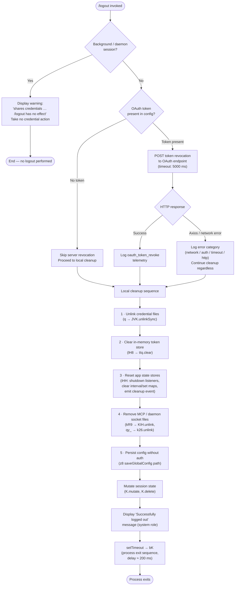

# `/logout`

> Analysis basis: CC v2.1.157 bundle.js (AST extraction + Claude interpretation)
> Minimum version: v2.1.157

---

## Overview

The `/logout` command signs the user out of their Anthropic account by revoking the OAuth token on the server side, removing locally stored credentials, clearing in-memory session state, and terminating the CLI process. It is a destructive, non-reversible action that requires a subsequent `/login` or `claude` startup to re-authenticate.

---

## Registration

| Field | Value |
|---|---|
| type | `local-jsx` |
| name | `logout` |
| description | Sign out from your Anthropic account |
| module_id | `bb_` |
| load_inline | `true` |
| loc_byte | `11346641` |
| loc_byte_end | `11346938` |
| loc_line | `7351` |
| arbor_handler.name | `eOL` |
| arbor_handler.fqn | `claude-2.1.157::eOL` |
| arbor_handler.kind | `AsyncFunction` |
| arbor_handler.resolution_path | `module_id` |
| arbor_handler.n_hits | `0` |

Analysis basis: CC v2.1.157 bundle.js:+11346641

---

## Input Branching

Five distinct execution branches are present; a Mermaid flowchart is used.



Analysis basis: CC v2.1.157 bundle.js:+7823392 (branch entry), +7824728 (background warning literal), +7824399 (oauth_logout telemetry key), +7824927 (success message literal), +7825006 (bK exit call), +7824990 (setTimeout)

---

## Behavioral Spec

### 1 · Background-session guard

```
function checkBackgroundSession(appState):
    if appState.sessionType in ["bg", "daemon", "daemon-worker"]:
        display("This background session shares credentials … Run /logout from your main terminal.")
        return ABORT
    return CONTINUE
```

The check inspects a session-type flag (resolved via `v9` → `QOH`) against the string constants `"bg"`, `"daemon"`, and `"daemon-worker"`.
Analysis basis: CC v2.1.157 bundle.js:+7823534 (`v9` call), +2201979, +2201989, +2202003 (string constants)

---

### 2 · OAuth token revocation (server side)

```
async function revokeOAuthToken(config):
    token = config.oauthToken
    if token is absent:
        return  // skip silently

    try:
        await httpPost(
            url    = buildOAuthEndpoint(config),   // Iq helper
            body   = { grant_type: "refresh_token", token: token },
            headers = { "Content-Type": "application/json" },
            timeout = 5000                          // ms
        )
        logTelemetry("oauth_token_revoke", { result: "ok" })
    catch error:
        if isAxiosError(error):
            category = classifyNetworkError(error)  // "network"|"auth"|"timeout"|"http"
        logTelemetry("oauth_token_revoke", { result: "error", category })
        // cleanup continues regardless
```

Key constants: `"refresh_token"` (bundle.js:+2057889), `"Content-Type"` (+2057944), `"application/json"` (+2057959), timeout `5000` ms (+2057987), telemetry key `"oauth_token_revoke"` (+2057997).

The OAuth endpoint builder (`Iq`) normalises the base URL, validates it against an allowlist, and rejects any `CLAUDE_CODE_CUSTOM_OAUTH_URL` that is not approved (error literal: `"CLAUDE_CODE_CUSTOM_OAUTH_URL is not an approved endpoint."` at +951338).

Analysis basis: CC v2.1.157 bundle.js:+7823692 (`jq_` call), +2057829 (`c_.post`), +2057840 (`Iq`)

---

### 3 · Local credential file removal

```
function removeCredentialFiles(config):
    // Primary credential file
    unlinkSync(config.credentialFilePath)   // q → JVK.unlinkSync

    // Keychain / secure-storage entry
    try:
        kR9.deleteKeychainEntry("claude-code-user")
    catch:
        logWarning("Failed to delete keychain entry")

    // MCP / daemon socket/lock files
    qy_.removeDaemonFiles()                 // k26.unlink
```

The keychain helper (`kR9`) uses `KIH.unlink` and `yy_` → `eyA` (index 0 path) to remove the platform keychain entry identified by the service name `"claude-code-user"` (+2069397). Failure is non-fatal; the error literal `"Failed to delete keychain entry"` appears at +2070155.

Analysis basis: CC v2.1.157 bundle.js:+7823513 (`Rb_`), +15445005 (`JVK.unlinkSync`), +7824572 (`kR9`), +6923986 (`KIH.unlink`), +7824584 (`qy_`), +6884087 (`k26.unlink`)

---

### 4 · In-memory session teardown

```
function teardownSession():
    // Clear token store
    tokenStore.clear()              // lH8 → tIq.clear

    // Full app-state shutdown sequence (iHH)
    shutdownCleanup()               // Ex + Zx
    clearAllIntervals()             // SQH → Qz_ → clearInterval
    process.removeListener(...)     // Qz_ → process.removeListener
    process.off("exit", ...)        // SQH → process.off
    clearMaps([izH, s88, rz6, mz_, PU])   // SQH: five .clear() calls
    eventBus.emit("cleanup")        // yQH.emit

    // Queue/log flush
    flushEssentialTrafficQueue()    // KT + SH (queue category "essential-traffic")
    logError(category="error")      // SH → Vi.logError
```

Analysis basis: CC v2.1.157 bundle.js:+7824488 (`lH8`), +2937353 (`tIq.clear`), +7824519 (`iHH`), +3187869 (`Ex`), +3188009 (`SQH` / `Qz_`), +3188138–3188186 (five map `.clear()` calls), +3187891 (`yQH.emit`)

---

### 5 · Config persistence without auth

```
async function saveConfigWithoutAuth():
    // Uses saveGlobalConfig path (z8)
    // Guard: refuses to write if re-read config is missing auth that cache has
    //        to avoid wiping ~/.claude.json (GH #3117)
    // Acquires config file lock; warns if contention exceeds threshold
    // Writes config with oauthToken and related auth fields removed
```

The save path acquires a file lock; if lock acquisition takes longer than expected the literal `"Lock acquisition took longer than expected - another Claude instance may be running"` (+3207889) is emitted. A stale-write safety check prevents overwriting auth that the cache still holds (literal at +3208305 and +3205118 for fallback path, referencing GH #3117). Backup copies are rotated under the `"backups"` subdirectory (+3209490) with a maximum rotation of 5 backups (+3208908) and a lock timeout of 60 000 ms (+3208659).

Analysis basis: CC v2.1.157 bundle.js:+7824022 (`z8`), +3204911 (`AY_`), +3207978 (`tengu_config_lock_contention`), +3208114 (`tengu_config_stale_write`)

---

### 6 · Session state mutation and UI update

```
function mutateSessionState():
    sessionStore.mutate(...)        // K.mutate  (+7823815)
    sessionStore.delete(...)        // K.delete  (+7823989)
    updateAppState(A0H)             // A0H       (+7824000)

    // Remove subscription-switch marker if present
    // (literal "subscription-switch" at +7824244)
```

Analysis basis: CC v2.1.157 bundle.js:+7823815, +7823989, +7824000, +7824244

---

### 7 · Success message and process exit

```
async function displayAndExit(renderer):
    // Render JSX element via Cb_.createElement
    // Role: "system"  (+7824880)
    // Text: "Successfully logged out from your Anthropic account."  (+7824927)

    // Telemetry event emitted: "oauth_logout"  (+7824399)

    setTimeout(
        () => bK(exitSequence),     // bK at +7825006
        delay = 200                  // ms (+7825022)
    )
    // bK → _9 (process-exit orchestrator):
    //   - flushes output buffers (AjH.writeSync)
    //   - drains I/O queue (_OA.drain)
    //   - races AbortSignal.timeout against cleanup tasks
    //   - calls process.exit or process.kill("SIGKILL") if stuck
    //   - records "session_end" event (+5357986)
```

The exit orchestrator `_9` enforces a maximum graceful-exit window of 3 500 ms (+5357622) with a 2 000 ms secondary fence (+5357800) and falls back to `SIGKILL` (+5356100) if the process does not exit cleanly.

Analysis basis: CC v2.1.157 bundle.js:+7824990 (`setTimeout`), +7825006 (`bK`), +7825022 (`200`), +7824927 (success literal), +7824399 (`oauth_logout`), +5356050 (`process.exit`), +5356075 (`process.kill`)

---

## State & Side Effects

| Item | Detail |
|---|---|
| Telemetry — `tengu_feature_ok` | Emitted on successful credential-store write path (bundle.js:+966033) |
| Telemetry — `tengu_feature_sad` | Emitted on credential-store soft failure (bundle.js:+966168) |
| Telemetry — `tengu_feature_bad` | Emitted on credential-store hard failure (bundle.js:+966091) |
| Telemetry — `tengu_config_lock_contention` | Emitted when config file lock takes longer than expected (bundle.js:+3207978) |
| Telemetry — `tengu_config_stale_write` | Emitted when a stale-write safety check fires (bundle.js:+3208114) |
| Telemetry — `tengu_config_parse_error` | Emitted if config JSON cannot be parsed during re-read (bundle.js:+3210553) |
| Telemetry — `tengu_config_auth_loss_prevented` | Emitted when auth-loss guard prevents overwriting credentials (bundle.js:+3208457) |
| Telemetry — `tengu_daemon_config_reload` | Emitted if daemon config is reloaded during state teardown (bundle.js:+15481439) |
| Telemetry — `tengu_startup_perf` | Emitted during process-exit profiling report path (bundle.js:+215155) |
| Telemetry — `tengu_scroll_summary` | Emitted by scroll-state tracker during exit render (bundle.js:+5356918) |
| Telemetry — `tengu_pewter_brook` | Emitted from display/fullscreen teardown (bundle.js:+3377379) |
| Telemetry — `tengu_cache_eviction_hint` | Emitted during session-cache teardown on exit (bundle.js:+5357951) |
| Credential file deletion | `JVK.unlinkSync` removes stored OAuth token file (bundle.js:+15445005) |
| Keychain entry deletion | `KIH.unlink` removes platform keychain entry `"claude-code-user"` (bundle.js:+6923986) |
| Daemon/MCP socket deletion | `k26.unlink` removes daemon lock/socket files (bundle.js:+6884087) |
| Token store cleared | `tIq.clear()` wipes in-memory token store (bundle.js:+2937353) |
| Five event/cache maps cleared | `izH`, `s88`, `rz6`, `mz_`, `PU` each receive `.clear()` (bundle.js:+3188138–3188186) |
| Process listeners removed | `process.off("exit")` and `process.removeListener("beforeExit")` (bundle.js:+3188019, +3188711) |
| Session store mutations | `K.mutate` and `K.delete` update in-memory session registry (bundle.js:+7823815, +7823989) |
| Config written to disk | `~/.claude.json` rewritten without auth fields via `z8` / `AY_` path (bundle.js:+7824022) |
| Process exit | `process.exit` (or `SIGKILL` fallback) called ≈200 ms after success message (bundle.js:+7824990, +5356050, +5356075) |
| Sound | <!-- TODO: not found in depth-2 traversal; needs --depth 4 --> |

---

## Version History

| Version | Change |
|---|---|
| v2.1.157 | Initial analysis |

---

## Common Mistakes

1. **Running `/logout` in a background or daemon session** — The command detects session types `"bg"`, `"daemon"`, and `"daemon-worker"` and refuses to perform any credential action, displaying a warning instead. Use a main terminal session.
2. **Expecting the process to stay alive after `/logout`** — The command unconditionally schedules process exit (~200 ms after the success message). Any unsaved work or in-progress tasks will be lost.
3. **Assuming network failure prevents logout** — The OAuth token revocation POST is best-effort. A network error (timeout, refused connection, auth error) is logged but does not block local credential removal; the user will still be logged out locally.
4. **Custom OAuth URLs** — If `CLAUDE_CODE_CUSTOM_OAUTH_URL` is set to a non-approved value, the revocation POST will throw before reaching the server. Local cleanup still proceeds, but the server-side token will not be revoked.
5. **Concurrent Claude instances** — If another Claude instance holds the config file lock, a `"Lock acquisition took longer than expected"` warning appears and `tengu_config_lock_contention` is emitted. The logout will eventually complete but may be delayed.

---

## Appendix — Identifier Mapping

> For bundle debugging only. Identifiers change across versions.

| Identifier | Role |
|---|---|
| `eOL` | Main async logout handler (Arbor-resolved, `claude-2.1.157::eOL`) |
| `_sH` | Core logout execution function called by `eOL` |
| `HzL` | Outer logout command wrapper / JSX renderer |
| `q` | Credential file unlink helper (`JVK.unlinkSync`) |
| `v9` | Session-type / background-session checker (`QOH` dispatcher) |
| `QOH` | Session type resolver |
| `U06` | Full app-state teardown orchestrator |
| `R26` | App-state sub-teardown step 1 |
| `lgH` | App-state sub-teardown step 2 |
| `lH8` | Token-store clear wrapper (`tIq.clear`) |
| `QzH` | App-state sub-teardown step 4 |
| `iHH` | Shutdown listener / event-loop cleanup |
| `Ex` | Cleanup sub-step (calls `CH` + `Zx`) |
| `CH` | String / code-path normaliser |
| `Zx` | Cleanup chain step (`vR`) |
| `SQH` | Multi-map clear + process listener removal |
| `Qz_` | Interval clear + `process.removeListener` |
| `SH` | Queue flush / error logger |
| `F_` | Error construction helper |
| `L1` | Essential-traffic queue handler (`fVA`) |
| `X_4` | Queue shift/push manager (`BB6`) |
| `kR9` | Keychain / secure-storage delete handler |
| `yR9` | Keychain sub-step 1 |
| `yy_` | Keychain sub-step 2 (`eyA`) |
| `eyA` | Keychain index-0 path |
| `D1H` | Keychain path helper |
| `w56` | Path join + file write helper |
| `qy_` | Daemon/MCP socket removal orchestrator |
| `_y_` | Daemon socket cleanup sub-step (`Ky_`, `c4H`) |
| `Ky_` | Daemon socket path resolver |
| `c4H` | Socket-list filter (`m3q`, `lgH`) |
| `icH` | Socket path join helper |
| `TA` | Provider-type resolver (bedrock/foundry/vertex/etc.) |
| `aK` | Credential-store read wrapper (`aOq`) |
| `aOq` | Credential-store CRUD dispatcher |
| `oTH` | Credential-store read-through layer |
| `im4` | Credential-store async storage backend |
| `hH` | Telemetry OK emitter (`tengu_feature_ok`) |
| `d` | Telemetry core dispatcher |
| `t6` | Telemetry SAD emitter (`tengu_feature_sad`) |
| `bH` | Telemetry BAD emitter (`tengu_feature_bad`) |
| `L` | Async read-through with finally/cleanup |
| `f` | File-handle close helper |
| `A` | Case-normaliser (toLowerCase) |
| `jq_` | OAuth token revocation HTTP caller |
| `Iq` | OAuth URL builder + validator |
| `tZA` | OAuth URL environment resolver |
| `M84` | OAuth URL sub-resolver |
| `N` | HTTP request factory / logger |
| `QCK` | HTTP client wrapper |
| `qOA` | HTTP client sub-wrapper |
| `RH` | JSON.stringify wrapper |
| `v4` | URL path builder / redactor |
| `uYA` | URL segment mapper |
| `EuH` | Response write helper |
| `VYA` | Response stream writer |
| `lCK` | Log-file append / rotate manager |
| `rxH` | Log buffer / flush scheduler |
| `M$H` | Log file path builder |
| `g6` | Filesystem existence check |
| `qK6` | EISDIR error handler |
| `dYA` | Log directory path resolver |
| `QYA` | Log file rotation helper |
| `cCK` | Log file append + rotation executor |
| `K9` | `_OA.register` wrapper |
| `Qt` | <!-- TODO: not found in depth-2 traversal; needs --depth 4 --> |
| `k3_` | Config file path / lock manager (`zyq`, `z8`) |
| `zyq` | Config path resolver (`jKq`, `N`) |
| `jKq` | Config path constructor (`xN`, `JP`, `DV`) |
| `xN` | Path normalise + SHA-256 hash helper |
| `JP` | Resolved-path store (`RGH`) |
| `DV` | User-info / username resolver |
| `EH` | String coercion helper |
| `z8` | Global config save (main path, `AY_`) |
| `AY_` | Atomic config file writer with lock + backup |
| `dOq` | Config object merge helper |
| `j8` | Config field validator |
| `szH` | Config file reader |
| `AY6` | Config backup step |
| `qY_` | Backup path builder |
| `V` | <!-- TODO: not found in depth-2 traversal; needs --depth 4 --> |
| `P` | Parallel task / SDK session manager |
| `E` | <!-- TODO: not found in depth-2 traversal; needs --depth 4 --> |
| `yL6` | Atomic symlink/file write helper |
| `pQH` | <!-- TODO: not found in depth-2 traversal; needs --depth 4 --> |
| `IFq` | Object.entries iterator |
| `UQH` | Timestamp helper (`Date.now`) |
| `_Y_` | Config file write sub-path |
| `$a6` | Config lock sub-utility |
| `K` | Session store (`.mutate`, `.delete`, `.map`) |
| `A0H` | App-state updater |
| `HzL` | Logout command outer renderer |
| `TNH` | JSX message component builder |
| `KX` | Component sub-helper (`EH`) |
| `D4` | OTEL metrics emitter |
| `vm8` | OTEL metric sub-helper |
| `GNH` | OTEL attribute assembler |
| `wU` | OTEL session writer |
| `k6` | OTEL attribute setter (`AN`) |
| `EL8` | OTEL attribute encoder (`CH`) |
| `B$H` | `psK.has` set-membership check |
| `_7` | OTEL event helper (`EY`, `S6`) |
| `GM9` | OTEL metric type helpers (`UI7`, `pI7`) |
| `ZL8` | OTEL resource freeze helper |
| `f16` | OTEL sub-field helper |
| `bK` | Process-exit entry point |
| `_9` | Process-exit orchestrator (flush + race + kill) |
| `zkH` | Terminal unmount + final write helper |
| `hR` | <!-- TODO: not found in depth-2 traversal; needs --depth 4 --> |
| `mq8` | Terminal write-sync + NVH/GVH/zW teardown |
| `Mv_` | Final output formatter (path escaping, dim text) |
| `jZ` | <!-- TODO: not found in depth-2 traversal; needs --depth 4 --> |
| `Zb` | <!-- TODO: not found in depth-2 traversal; needs --depth 4 --> |
| `$P6` | Session directory stat helper |
| `I$` | Session ID loader |
| `bX9` | Output escape helper |
| `$v_` | Force-kill fallback (`process.exit` / `SIGKILL`) |
| `oxH` | `_OA.drain` I/O drain |
| `Y` | Render/supervisor loop manager |
| `u2H` | Supervisor state builder |
| `Re1` | Supervisor layout calculator |
| `G` | Input event gate (`preventDefault`, `remoteControlAtStartup`) |
| `FVK` | Heartbeat helper (`oHH`) |
| `ZK6` | Startup profiling writer (`IB8`, `KDA`) |
| `IB8` | Profiling record writer |
| `KDA` | Profiling entry serialiser |
| `yf8` | Scroll/session summary emitter (`tengu_scroll_summary`) |
| `CX9` | Scroll sub-helper |
| `RX9` | Timing calculator (`Date.now`, `Math.round`) |
| `Aq` | Display/fullscreen mode manager (`tengu_pewter_brook`) |
| `b96` | <!-- TODO: not found in depth-2 traversal; needs --depth 4 --> |
| `hf8` | Cleanup task runner (`Promise.all` + race) |
| `g8` | Abort-signal / timeout promise helper |