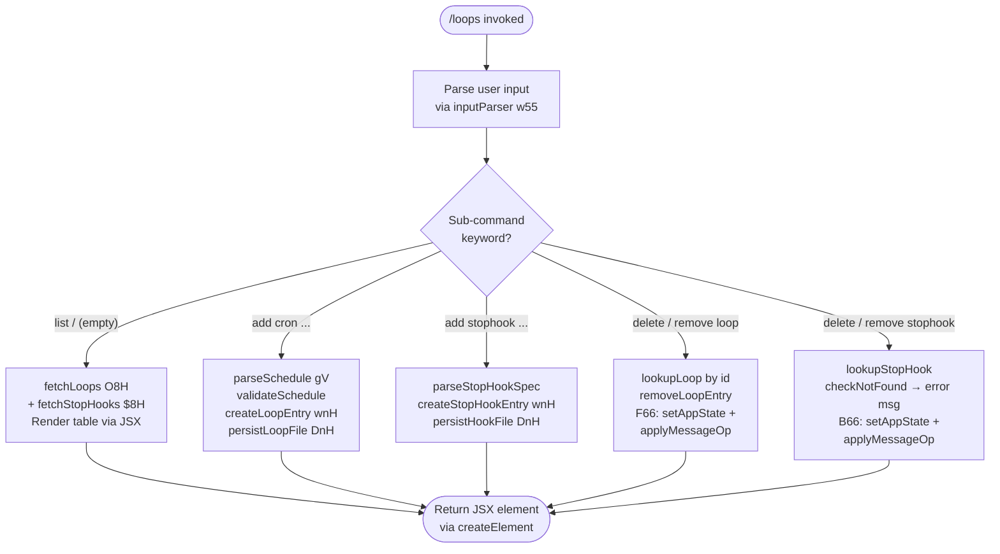

# `/loops`

> Analysis basis: CC v2.1.157 bundle.js (AST extraction + Claude interpretation)
> Minimum version: v2.1.157

---

## Overview

The `/loops` command provides a unified management interface for two related automation primitives: **recurring loops** (cron-scheduled background tasks) and **stop-hooks** (scripts or commands that run when the agent stops). It allows the user to list currently registered loops and stop-hooks, create new ones, and delete existing ones — all from within the active Claude Code session.

---

## Registration

| Field | Value |
|---|---|
| type | `local-jsx` |
| name | `loops` |
| description | `List, create, and delete recurring loops and stop-hooks` |
| loc_byte | `12203460` |
| loc_byte_end | `12203642` |
| loc_line | `8114` |
| immediate | `true` |
| module_id | `Nl1` |
| load_inline | `true` |
| arbor_handler.name | `j55` |
| arbor_handler.fqn | `claude-2.1.157::j55` |
| arbor_handler.kind | `AsyncFunction` |
| arbor_handler.resolution_path | `module_id` |
| arbor_handler.n_hits | `0` |

Analysis basis: CC v2.1.157 bundle.js:+12203460

---

## Input Branching

The command resolves four principal execution paths based on the sub-command keyword extracted from user input, plus a default listing path — five distinct branches in total.



Analysis basis: CC v2.1.157 bundle.js:+12202415 (handler entry `j55`), +12202463 (loop-type branch `U66`), +12202702 (`$8H` stop-hook fetch), +12202841 (`F66` loop delete), +12203153 (`B66` stop-hook delete), +12203065 (`wnH` creation path)

---

## Behavioral Spec

### 1. Handler Entry — `mainLoopsHandler` (`j55`)

```
async function mainLoopsHandler(context):
    emit telemetry("tengu_loops_command")
    appState = context.getAppState()

    rawInput  = parseRawInput(context)          // d
    loopsList = fetchAllLoops(context)           // O8H → LNH
    stopHooks = fetchAllStopHooks(context)       // $8H → LNH
    colWidths = buildColumnWidths(loopsList)     // U66 → TXH

    keyword = extractKeyword(rawInput)

    if keyword == "cron":
        result = createLoopEntry(rawInput, appState)   // wnH
    else if keyword == "stophook":
        result = createStopHookEntry(rawInput)         // wnH path
    else if isDeleteLoop(keyword):
        result = deleteLoop(rawInput, appState)        // F66
    else if isDeleteStopHook(keyword):
        result = deleteStopHook(rawInput, appState)    // B66
    else:
        result = buildListingView(loopsList, stopHooks, colWidths)

    return createElement(LoopsComponent, { result, appState, ... })
```

Analysis basis: CC v2.1.157 bundle.js:+12202415–12203294

---

### 2. Schedule Parsing — `parseSchedule` (`gV`)

Converts a human-readable or cron-expression schedule string into a normalised cron schedule object.

```
function parseSchedule(scheduleString):
    trimmed = scheduleString.trim()

    if trimmed matches "Every minute" pattern:
        return { cron: "* * * * *", label: "Every minute" }

    if trimmed matches "Every hour" pattern:
        return { cron: "0 * * * *", label: "Every hour" }

    // Numeric shorthand  e.g. "1-5" (days of week)
    if trimmed matches numeric range pattern "1-5":
        parts = trimmed.split(...)
        parsed = parseInt(parts[...])
        // Validate: minutes 0-59, hours 0-23, days 1-31
        return buildCronObject(parsed)

    // Full 5-field cron expression
    dateObj = new Date(...)
    dateObj.setUTCDate(...)
    dateObj.setUTCHours(...)
    dayOfWeek = dateObj.getDay()   // local day
    utcDay    = dateObj.getUTCDay()

    return {
        cron: buildCronString(parsed),
        nextRun: computeNextRun(dateObj)
    }
```

Numeric bounds enforced:
- Minutes: 0–59 (bundle.js:+12202182)
- Hours: 0–23 (bundle.js:+12202253)
- Day-of-month: 1–31 (bundle.js:+12202306)
- Minimum resolution multiplier: 60 seconds (bundle.js:+12202148)

Analysis basis: CC v2.1.157 bundle.js:+12202546 (`gV`), +4785746 (`"Every minute"` literal), +4785963 (`"Every hour"` literal)

---

### 3. Cron Expression Tokeniser — `tokeniseCron` (`yv7`)

```
function tokeniseCron(expression):
    fields = expression.split(whitespace)
    seen   = new Set()

    for each field in fields:
        match = field.match(cronFieldPattern)
        if match:
            value = parseInt(match[1], 10)   // radix-10
            seen.add(value)

    // Validate field count; maximum 5 fields implied by standard cron
    // Day-of-week mapping constants: 3=Wed, 6=Sat, 7=Sun (bundle.js:+4784116, +4784152, +4784158)
    result = Array.from(seen)
    return result
```

Maximum field width constant: 5 fields (bundle.js:+4784491)

Analysis basis: CC v2.1.157 bundle.js:+4783875 (`yv7`)

---

### 4. Loop-File Read — `readLoopsFile` (`LNH`)

```
async function readLoopsFile(loopsDir):
    configPath = buildPath(loopsDir)          // Y7H → I78.join + UK → AN
    raw = await fs.readFile(configPath, "utf-8")
    parsed = parseJSON(raw)                   // oq → j8

    if not Array.isArray(parsed):
        parsed = []

    loops = []
    for entry of parsed:
        validated = validateEntry(entry)       // SH
        if valid:
            loops.push(validated)

    serialised = JSON.stringify(loops)         // RH
    return loops
```

Encoding: `"utf-8"` (bundle.js:+4787882).  
File-system errors handled: `ENOENT`, `EACCES`, `EPERM`, `ENOTDIR`, `ELOOP`, `EROFS` (bundle.js:+174582–174651).

Analysis basis: CC v2.1.157 bundle.js:+4787835 (`LNH`), +4787854 (`_.readFile`), +4787865 (`Y7H`)

---

### 5. Stop-Hook Fetch — `fetchStopHooks` (`$8H`)

```
async function fetchStopHooks(context):
    hasHooks = checkHookRegistry(context)      // ct → _.has
    raw      = await readLoopsFile(hooksDir)   // LNH
    filtered = raw.filter(isStopHook)          // q.filter
    hasSet   = new Set(filtered.map(h => h.id))// A.has

    if filtered.length > 0:
        enriched = await enrichHookMetadata(filtered)  // DnH
        return enriched

    return filtered
```

Analysis basis: CC v2.1.157 bundle.js:+12202702 (`$8H`), +4789512 (`ct`), +4789561 (`LNH` call), +4789634 (`DnH`)

---

### 6. Stop-Hook Metadata Writer — `persistHookMetadata` (`DnH`)

```
async function persistHookMetadata(hooks):
    baseDir = buildBasePath()                       // UK
    await fs.mkdir(baseDir, { recursive: true })    // k78.mkdir
    target  = path.join(baseDir, ".claude", ...)    // I78.join + ".claude" literal

    for hook of hooks:
        payload = hook.map(buildHookRecord)         // H.map
        await fs.writeFile(target, serialise(payload))  // k78.writeFile + Y7H + RH
```

Storage path suffix constant: `".claude"` (bundle.js:+4789023).

Analysis basis: CC v2.1.157 bundle.js:+4788991 (`DnH`), +4789002 (`k78.mkdir`), +4789012 (`I78.join`)

---

### 7. Loop Creation — `createLoopOrHook` (`wnH`)

```
async function createLoopOrHook(input, type):
    id        = crypto.randomUUID()             // EL9.randomUUID
    createdAt = Date.now()
    schedule  = buildScheduleObject(input)      // K0H

    rawLoops  = await readLoopsFile(loopsDir)   // LNH
    rawLoops.push({ id, createdAt, type, schedule, ...input })   // M.push

    await notifyRegistrar(id)                   // k6
    await persistHookMetadata(rawLoops)         // DnH
```

Loop type constants: `"cron"` (bundle.js:+12202513), `"stophook"` (bundle.js:+12202599).

Analysis basis: CC v2.1.157 bundle.js:+4789182 (`wnH`), +4789244 (`Date.now`), +4789334 (`LNH`), +4789441 (`DnH`)

---

### 8. Loop Deletion — `deleteLoop` (`F66`)

```
async function deleteLoop(input, context):
    checkGates(["hooks_gate", "trust_gate"])          // jr_ → hooks_gate / trust_gate literals
    targetId = resolveLoopId(input)                   // k6 + U66
    current  = context.getAppState()

    context.setAppState(
        removeLoopById(current, targetId)
    )
    context.applyMessageOp({
        type: "append",
        role: "system",
        content: buildGoalStatus(targetId)            // goal / goal_status / attachment literals
    })
    emit telemetry("tengu_stop_hook_removed")
    return { ok: true }
```

Gate constants: `"hooks_gate"` (bundle.js:+10541301), `"trust_gate"` (bundle.js:+10541355).  
Message-op type: `"append"` (bundle.js:+10542125).

Analysis basis: CC v2.1.157 bundle.js:+12202841 (`F66`), +10541893, +10542033, +10542102, +10542157

---

### 9. Stop-Hook Deletion — `deleteStopHook` (`B66`)

```
async function deleteStopHook(input, context):
    resolvedHook = resolveStopHook(input)         // jr_

    if resolvedHook is null:
        displayMessage("Stop hook not found")
        return { ok: false }

    context.getAppState()
    context.setAppState(removeHook(resolvedHook))
    context.applyMessageOp({ type: "append", role: "system", ... })
    emit telemetry("tengu_stop_hook_removed")

    if hook was cleared successfully:
        displayMessage("Stop hook cleared")
        emit hH (feature-ok telemetry path)
    else:
        displayMessage error path

    return { ok: true }
```

User-facing string constants: `"Stop hook not found"` (bundle.js:+12202859), `"Stop hook cleared"` (bundle.js:+12202881), `"Stop hook set"` (bundle.js:+12203177).

Analysis basis: CC v2.1.157 bundle.js:+12203153 (`B66`), +10541405 (`jr_`), +10541654 (`Date.now`), +10541692 (`_.setAppState`), +10541851 (`hH`)

---

### 10. Input Parser — `inputParser` (`w55`)

```
function inputParser(rawText):
    matched = rawText.match(commandPattern)     // H.match
    if no match:
        return { action: "list" }

    index = parseInt(matched[1], 10)
    maxVal = Math.max(index, 0)
    ceiled = Math.ceil(maxVal / 60)             // 60-second base unit
    rounded = Math.round(ceiled)

    // Additional cron tokenisation via Jk / yv7
    cronFields = tokeniseLine(matched[2])       // Jk → yv7

    return { action: resolveAction(matched), schedule: cronFields, index }
```

Resolution constants: max-minute boundary 60 (bundle.js:+12202148), sub-minute boundary 59 (bundle.js:+12202182), `Math.max` (bundle.js:+12202125), `Math.ceil` (bundle.js:+12202136), `Math.round` (bundle.js:+12202209).

Analysis basis: CC v2.1.157 bundle.js:+12202967 (`w55`), +12202373 (`Jk`)

---

### 11. Column Width Builder — `buildColumnWidths` (`U66` / `TXH`)

```
function buildColumnWidths(loops):
    widthMap = new Map()
    for loop of loops:
        cols = loop.map(buildColumns)           // t11 → H.map
        widthMap.set(loop.id, cols)             // K.set
    return widthMap
```

Padding constant: `"  "` (two spaces, bundle.js:+15490715); column pad width: 40 characters (bundle.js:+15492686).

Analysis basis: CC v2.1.157 bundle.js:+10541105 (`TXH`), +8811093 (`t11`)

---

## State & Side Effects

| Item | Detail |
|---|---|
| Telemetry — primary | `tengu_loops_command` fired on every invocation (bundle.js:+12202417) |
| Telemetry — stop-hook added | `tengu_stop_hook_added` on successful hook creation (bundle.js:+10541791) |
| Telemetry — stop-hook removed | `tengu_stop_hook_removed` on successful hook deletion (bundle.js:+10542159) |
| Telemetry — feature ok | `tengu_feature_ok` (bundle.js:+966033) |
| Telemetry — feature bad | `tengu_feature_bad` (bundle.js:+966091) |
| Telemetry — feature sad | `tengu_feature_sad` (bundle.js:+966168) |
| Telemetry — bg/daemon (indirect) | `tengu_bg_dispatch_sigkill_escalate`, `tengu_daemon_control`, `tengu_bg_low_mem_mb`, `tengu_bg_dispatch_low_mem`, `tengu_bg_spare_enable`, `tengu_bg_sendclaim_failed`, `tengu_daemon_config_reload`, `tengu_bg_spare_claim`, `tengu_bg_spare_spawn`, `tengu_bg_spare_claim_fail`, `tengu_daemon_yield` — all reachable through the background-worker dispatch chain (`w` → `D`, `GfA`, `DfA`) |
| appState changes | `setAppState` called during delete operations (`F66` bundle.js:+10541692, `B66` bundle.js:+10541692); `applyMessageOp` appends a `system`-role message with type `"append"` |
| File I/O | Reads loop/hook config as UTF-8 JSON; writes updated JSON back via `k78.writeFile`; creates `.claude` subdirectory as needed |
| Hook registration | Stop-hook entries written to `.claude` directory (bundle.js:+4789023); hook file path constructed via `path.join` + `I78.join` |
| Sound | None detected in depth-2 traversal |
| Daemon interaction | The deletion and creation paths reach the background-agent daemon control chain (`DfA` → `cF.claim`, `Jx8.connect`, `f.write`/`f.end`); daemon is contacted over a local socket with a 5 000 ms send-claim timeout (bundle.js:+15448101) |
| JSX rendering | Final output is a JSX element created via `a6.createElement` (bundle.js:+12203220); the command type is `local-jsx` and renders inline in the terminal UI |

---

## Version History

| Version | Change |
|---|---|
| v2.1.157 | Initial analysis |

---

## Common Mistakes

1. **Omitting the sub-command keyword** — invoking `/loops` with no arguments triggers the listing path, which is correct intended behaviour; however, passing an unrecognised keyword silently falls through to the listing path as well, so typos in `add`/`delete` sub-commands may go unnoticed.
2. **Invalid cron field values** — minutes must be 0–59, hours 0–23, day-of-month 1–31 (enforced via `parseInt` + boundary checks in `parseSchedule`/`w55`); out-of-range values are silently clamped or rejected with no user-facing error message surfaced in this code path.
3. **Deleting a non-existent stop-hook** — the handler returns the string `"Stop hook not found"` (bundle.js:+12202859) rather than throwing; callers that check only for exceptions will miss this failure.
4. **Confusing loop types** — `"cron"` and `"stophook"` are distinct type strings (bundle.js:+12202513 and +12202599); providing `stophook` syntax to the `cron` branch (or vice-versa) will silently create a malformed entry because type validation happens at read-time via `LNH`, not at write-time.
5. **Expecting immediate execution** — a newly created cron loop will not fire until the next scheduled tick according to its parsed cron expression; the 60-second minimum granularity (bundle.js:+12202148) means sub-minute scheduling is not supported.
6. **Daemon not running** — the creation/deletion paths attempt to contact the background daemon over a local socket; if the daemon is not running, the 5 000 ms timeout (bundle.js:+15448101) elapses and a `tengu_bg_sendclaim_failed` event is emitted, but the UI confirmation message may still appear as if the operation succeeded.

---

## Appendix — Identifier Mapping

> For bundle debugging only. Identifiers change across versions.

| Identifier | Role |
|---|---|
| `j55` | Main async handler for `/loops` (`mainLoopsHandler`) |
| `d` | Raw input extractor / generic utility |
| `O8H` | Top-level loop-fetch coordinator |
| `LNH` | Loop/hook config file reader (`readLoopsFile`) |
| `g6` | Path resolver helper |
| `Y7H` | Config-path builder |
| `UK` | Base-directory resolver → `AN` |
| `AN` | Canonical path constant / root resolver |
| `oq` | JSON parse wrapper → `j8` |
| `j8` | Low-level JSON parser |
| `SH` | Loop entry validator / schema checker |
| `F_` | Error code classifier |
| `CH` | String coercion helper |
| `L1` | Traffic-class selector (`"essential-traffic"`) |
| `X_4` | Queue shift/push utility |
| `N` | Sub-process spawn / message dispatcher |
| `QCK` | Claim/queue coordinator |
| `H` | Generic utility — context bag / random/timer |
| `RH` | `JSON.stringify` wrapper |
| `v4` | String replacement / path-segment extractor |
| `EuH` | Secondary string validator |
| `lCK` | Byte-length–aware content chunk writer |
| `Jk` | Cron-line tokeniser (outer, calls `yv7`) |
| `yv7` | Cron-field parser (inner, produces field set) |
| `A` | Generic array / accumulator variable |
| `L` | Promise/task lifecycle manager |
| `q` | File-unlink / set-based task tracker |
| `f` | Stream / file-handle reference |
| `yG` | Secondary path resolver → `AN` |
| `U66` | Column-width calculator coordinator |
| `TXH` | Column-map builder (`buildColumnWidths`) |
| `K` | Map / column-entry container |
| `t11` | Row-column mapper |
| `k6` | Registrar notifier → `AN` |
| `gV` | Schedule parser (`parseSchedule`) |
| `w` | Background-worker session manager |
| `S` | Daemon supervisor / process launcher |
| `dVK` | Filesystem realpath/stat helper |
| `kz` | Platform/OS capability checker |
| `HF5` | Native-module helper → `nW8` |
| `z` | Daemon IPC stream |
| `bH` | Feature-bad telemetry emitter |
| `hH` | Feature-ok telemetry emitter |
| `uy8` | Low-memory detector |
| `G6` | Background-session dispatcher |
| `Lw6` | Pins/config JSON loader |
| `XP_` | Pins file path builder |
| `p6` | Safe JSON.parse wrapper |
| `P8` | Permission-error handler → `j8` |
| `sX7` | Directory-based loop config scanner |
| `B` | MCP tool-use filter / session roster |
| `VH` | Plugin/marketplace manifest loader |
| `dH` | Orphaned-permission checker |
| `DfA` | Daemon claim sender (socket write) |
| `a9A` | Config directory + JSON writer |
| `yB5` | Send-claim timeout watchdog |
| `IB5` | Claim frame builder |
| `QM` | Low-level message serialiser |
| `EH` | String error wrapper |
| `DF` | Binary frame encoder (Buffer operations) |
| `GfA` | Background-worker lifecycle controller |
| `gK` | Worker directory path builder |
| `t9` | Worker state file reader/writer |
| `YD` | Active-state coordinator → `CV` |
| `ff` | Worker roster JSON writer |
| `G86` | Deferred-result handler |
| `MfH` | Temp-path joiner |
| `QT` | Split-path config reader |
| `GF` | Foreground-path config reader |
| `gN6` | Config directory mkdir + write |
| `Y` | Worker config updater / start-stop controller |
| `D` | Background-worker tick / spawn-decision loop |
| `$` | Disposable-resource manager → `Ls1` |
| `YfA` | Spare-worker spawner (Bun.spawn) |
| `R` | Disposable handle (dispose) |
| `j` | Worker-set kill iterator |
| `y` | Transient worker killer |
| `J` | Date-object UTC helper wrapper |
| `$8H` | Stop-hook fetch coordinator |
| `ct` | Hook-registry existence checker |
| `DnH` | Stop-hook metadata file writer |
| `F66` | Loop deletion handler (`deleteLoop`) |
| `gZ1` | UUID generator wrapper → `UZ1.randomUUID` |
| `w55` | Command input parser (`inputParser`) |
| `wnH` | Loop/stop-hook creation handler (`createLoopOrHook`) |
| `K0H` | Schedule object builder |
| `M` | Plugin path sanitiser / staging-path checker |
| `cS6` | Plugin name-to-path resolver |
| `lS6` | Plugin synced-path builder |
| `ii` | Hook invocation validator |
| `s1H` | Sub-process pipe helper |
| `Pe` | Pipe-stream chunker |
| `B66` | Stop-hook deletion handler (`deleteStopHook`) |
| `jr_` | Hook/trust gate checker |
| `GU` | Policy-settings resolver → `I8` |
| `I8` | Policy-settings reader |
| `$D` | Alternative policy-settings reader |
| `R_` | Gate result resolver |
| `uL` | Trust-gate evaluator → `y17` |
| `y17` | Trust/feature-flag multi-check |
| `t6` | Feature-sad telemetry emitter |
| `dw` | Output-token accumulator |