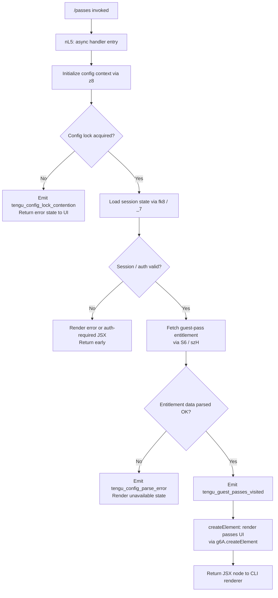

# `/passes`

> Analysis basis: CC v2.1.157 bundle.js (AST extraction + Claude interpretation)
> Minimum version: v2.1.157

---

## Overview

The `/passes` command allows a Claude Code user to share a free week of Claude Code access with friends via "guest passes." When invoked, the command presents a JSX-rendered UI that surfaces available pass entitlements and provides a mechanism for the user to distribute them. It is implemented as a local JSX component and fires a dedicated telemetry event on every visit.

---

## Registration

| Field | Value |
|---|---|
| type | `local-jsx` |
| name | `passes` |
| description | `Share a free week of Claude Code with friends` |
| loc_byte (start) | `12152018` |
| loc_byte_end | `12152340` |
| loc_line | `8016` |
| isHidden | `null` (not hidden) |
| module_id | `Bc1` |
| load_inline | `true` |
| arbor_handler.name | `nL5` |
| arbor_handler.fqn | `claude-2.1.157::nL5` |
| arbor_handler.kind | `AsyncFunction` |
| arbor_handler.resolution_path | `module_id` |
| arbor_handler.n_hits | `2` |

Analysis basis: CC v2.1.157 bundle.js:+12152018

---

## Input Branching

The handler has at least three distinct execution paths depending on: (1) whether a valid session/config is available, (2) whether guest-pass entitlement data can be fetched, and (3) whether the JSX component can be rendered without error.



Analysis basis: CC v2.1.157 bundle.js:+12151701, +12151735, +12151741, +12151839, +12151890

---

## Behavioral Spec

### Handler Entry (`nL5`)

```
async function passesCommandHandler(context):
    # 1. Read & lock configuration
    configState = await initConfigWithLock(context)          # z8 entry

    # 2. Establish session / authentication
    sessionInfo = await loadSessionOrProfile(context)        # fk8 / _7 entry

    if not sessionInfo.isAuthenticated:
        return renderErrorComponent("auth_required")

    # 3. Fetch guest-pass entitlement data
    entitlementData = await fetchEntitlement(configState)    # S6 → szH

    if entitlementData is null:
        return renderErrorComponent("unavailable")

    # 4. Fire visit telemetry
    emit("tengu_guest_passes_visited")

    # 5. Build and return JSX
    return createElement(PassesUIComponent, {
        passes: entitlementData,
        onShare: sharePassCallback
    })
```

Analysis basis: CC v2.1.157 bundle.js:+12151701, +12151735, +12151741, +12151839, +12151890

---

### Config Initialization (`z8` / `AY_`)

```
async function initConfigWithLock(context):
    configDir = path.dirname(configFilePath)
    ensureDirectory(configDir)                    # L.mkdirSync
    lockTimestamp = Date.now()

    try:
        lock = acquireConfigLock(configDir)       # dOq / qK_
    except LockContention:
        emit("tengu_config_lock_contention")
        log.warn("Lock acquisition took longer than expected…")

    rawConfig = readConfigFile()                  # L.statSync, L.readdirStringSync
    parsedConfig = parseConfig(rawConfig)         # p6 → JSON.parse

    # Auth-loss guard (GH #3117)
    if cachedConfig.hasAuth and not parsedConfig.hasAuth:
        emit("tengu_config_auth_loss_prevented")
        log.warn("saveConfigWithLock: re-read config is missing auth…")
        # Refuse to write; return cached version

    configState.status = resolveStatus(parsedConfig)
    # Status values observed: "unknown", "local", "migrated",
    #   "native", "installed", "disabled", "enabled",
    #   "no_permissions", "global", "not_configured"
    return configState
```

Analysis basis: CC v2.1.157 bundle.js:+3204911, +3205027, +3207805, +3207978, +3208267, +3208457, +3205550–3205777

---

### Entitlement Fetch (`S6` → `szH`)

```
async function fetchEntitlement(configState):
    # szH reads a config file, parses it, validates a prefix,
    # and resolves the entitlement directory.

    try:
        raw = fs.readFileSync(entitlementPath, "utf-8")   # encoding literal
    except Error:
        if error.code == "ENOENT":
            return null
        emit("tengu_config_parse_error")
        return null

    parsed = JSON.parse(raw)                              # p6

    # Validate prefix / ownership
    if not parsed.startsWith(expectedPrefix):             # gb → H.startsWith
        return null

    # Resolve backup directory
    backupsDir = path.join(baseDir, "backups")
    entries = readdirStringSync(backupsDir)               # yFq

    # Stat the entitlement file
    stat = fs.statSync(entitlementPath)

    if stat.isFile:
        # Copy to numbered backup slot (max 5)           # literal 5
        backupPath = buildBackupPath(stat)               # qY_
        fs.copyFileSync(entitlementPath, backupPath)

    return parsed
```

Analysis basis: CC v2.1.157 bundle.js:+3206804, +3209916, +3209963, +3209978, +3210005, +3210025, +3210028, +3210152, +3210473, +3210513, +3210551, +3210705, +3210944, +3211061, +3208775, +3208908

---

### Session / Profile Loading (`fk8` / `_7` / `EY`)

```
async function loadSessionOrProfile(context):
    # _7 drives the session resolution chain
    # EY: top-level auth resolver

    profile = resolveProfile(context)                    # pP

    if profile.type == "profile-implicit":
        # OAuth user flow
        oauthToken = resolveOAuthToken()                 # user_oauth path
    elif env.ANTHROPIC_API_KEY is set:
        apiKey = redact(env.ANTHROPIC_API_KEY)           # "[REDACTED]" literal
    else:
        raise Error("ANTHROPIC_API_KEY, ANTHROPIC_AUTH_TOKEN, … required")

    sessionInfo = buildSessionInfo(profile)              # F3

    if not sessionInfo.isValid:
        raise Error("auth_required")

    return sessionInfo
```

Analysis basis: CC v2.1.157 bundle.js:+11786043, +2961269, +2942347, +2942445, +2944366, +2944829, +2940869, +2941338, +2941411

---

### JSX Rendering

```
function renderPassesUI(entitlementData):
    # Uses React-compatible createElement (g6A.createElement)
    node = createElement(
        PassesComponent,
        props = {
            entitlement: entitlementData,
            theme: resolveTheme()          # "dark" | "auto" | "normal"
        }
    )
    return node
```

Analysis basis: CC v2.1.157 bundle.js:+12151890, +3203105, +3203134, +3203163

---

## State & Side Effects

| Item | Detail |
|---|---|
| Telemetry | `tengu_guest_passes_visited` (every invocation, +12151841); `tengu_config_parse_error` (+3210553); `tengu_config_lock_contention` (+3207978); `tengu_config_stale_write` (+3208114); `tengu_config_auth_loss_prevented` (+3208457) |
| Config lock | Acquires a file-system lock on `~/.claude.json` during config read; emits contention event if lock is slow |
| Config backup | Copies entitlement file to a `backups/` sub-directory; maximum 5 backup slots (+3208908) |
| Auth-loss guard | Refuses to write config if re-read copy is missing auth present in cache (GH #3117) |
| appState changes | Renders a JSX component into the CLI UI; no persistent appState mutation identified at depth ≤ 2 |
| Sound | <!-- TODO: not found in depth-2 traversal; needs --depth 4 --> |
| Background daemon events | Several `tengu_bg_*` events are reachable through shared infrastructure (`w`, `G6`, `DfA`, `GfA`) but are not triggered by `/passes` directly |

---

## Version History

| Version | Change |
|---|---|
| v2.1.157 | Initial analysis |

---

## Common Mistakes

1. **Invoking `/passes` without authentication** — the handler exits early and renders an auth-required state rather than displaying any pass entitlements. Ensure a valid API key or OAuth token is configured first.
2. **Missing entitlement file** — if the backing entitlement file is absent (`ENOENT`), the command returns a null entitlement silently. Users may see an "unavailable" UI with no explanation unless they check logs.
3. **Concurrent Claude Code instances holding the config lock** — a second instance running simultaneously can trigger `tengu_config_lock_contention`; `/passes` may be slow or fail to render correctly.
4. **Assuming `/passes` is always visible** — `isHidden` is `null` in this version, meaning visibility is not explicitly forced on; future versions may gate it behind a feature flag.
5. **Backup slot exhaustion** — the backup rotation keeps at most 5 copies of the entitlement file. Rapid repeated invocations under abnormal conditions could rotate out older backups.

---

## Appendix — Identifier Mapping

> For bundle debugging only. Identifiers change across versions.

| Identifier | Role |
|---|---|
| `nL5` | Main async handler for `/passes` command (arbor_handler) |
| `S6` | Entitlement fetch orchestrator |
| `g6` | Logging / error-reporting utility |
| `sz_` | Config state helper (secondary) |
| `szH` | Config file reader and entitlement parser |
| `q` | File-system operations namespace (readFileSync, statSync, mkdirSync, etc.) |
| `p6` | JSON.parse wrapper |
| `gb` | String prefix validator |
| `H` | Random / timer utility; also used as string-check subject in several contexts |
| `_` | Filesystem extended utilities (readdirStringSync, statSync, toUpperCase) |
| `j8` | Logging / journal helper |
| `yFq` | Backup directory enumerator |
| `qY_` | Backup path builder (path.join wrapper) |
| `M` | Session/roster map utility |
| `$` | Entitlement ownership checker / Ls1 caller |
| `N` | Config serializer / network request builder |
| `QCK` | Config query helper |
| `RH` | JSON.stringify wrapper |
| `v4` | String sanitizer / redactor |
| `EuH` | Config value resolver (VYA caller) |
| `lCK` | Config write + lock manager |
| `d` | General-purpose logger / debug emitter |
| `w` | Background worker / daemon dispatcher |
| `A` | Map/collection utility (get, set, values, toLowerCase) |
| `S` | Process supervisor (kill, write) |
| `bH` | Feature-bad telemetry emitter |
| `hH` | Feature-ok telemetry emitter |
| `uy8` | Memory probe (platform: macOS) |
| `Lw6` | Background session config file reader |
| `SH` | Log-error / push helper for session roster |
| `B` | Session retirement manager |
| `G6` | Background session spawner |
| `DfA` | Background session claim/connect handler |
| `GfA` | Session lifecycle manager (spawn, retire, cleanup) |
| `L` | Promise-tracking set utility |
| `D` | Background session recycle / dispose loop |
| `R` | Resource disposable wrapper |
| `b17` | File-watch registration helper |
| `Vr` | Watch-event handler |
| `K9` | Cleanup handler registrar (_OA.register) |
| `fk8` | Session/profile bootstrapper |
| `_7` | Session resolution entry point |
| `EY` | Auth resolver top-level |
| `BK` | Context builder (CH caller) |
| `pP` | Profile resolver |
| `NO` | First-party auth path handler |
| `AX` | Auth-token extractor |
| `F3` | Session-info builder |
| `tO6` | Retry/fallback resolver |
| `rgH` | Auth context builder (CH, F$H caller) |
| `z8` | Config initialization with lock |
| `AY_` | Config read/write with backup logic |
| `dOq` | Lock acquisition helper |
| `qK_` | Lock primitive (QOq caller) |
| `AY6` | Config state transition helper |
| `V` | Version/prefix string subject |
| `P` | MCP server connection manager |
| `Lx8` | MCP transport initializer |
| `F_` | Error/string wrapper utility |
| `E` | Slice buffer utility |
| `yL6` | Atomic file write utility (symlink-safe) |
| `O` | File-stat symbolic-link checker |
| `P8` | Journal/log helper (j8 caller) |
| `f` | Stream/file handle utility |
| `pQH` | Config pre-check helper |
| `IFq` | Object.entries iterator helper |
| `UQH` | Timestamp-based config validator |
| `_Y_` | Config directory diff helper |

---

Note: index built via Arbor fallback; some signals (telemetry, literals) may be missing — see arbor-fallback.js.