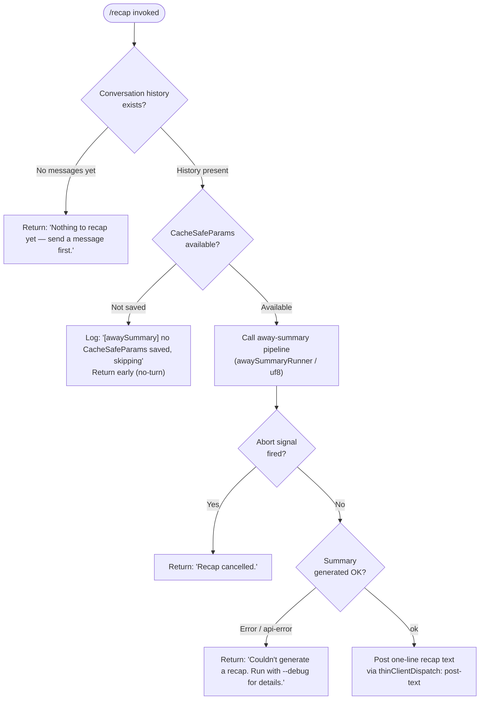

# `/recap`

> Analysis basis: CC v2.1.157 bundle.js (AST extraction + Claude interpretation)
> Minimum version: v2.1.157

---

## Overview

The `/recap` command triggers an immediate, on-demand generation of a one-line session recap summarizing the current conversation. It invokes the same internal "away summary" pipeline that Claude Code uses for background session summarization, but fires it synchronously on user request rather than on a background timer. The result is delivered as a short text message appended to the conversation; if no conversation history exists yet or the recap cannot be generated, a short error message is shown instead.

---

## Registration

| Field | Value |
|---|---|
| type | `local` |
| name | `recap` |
| description | `Generate a one-line session recap now` |
| loc_byte | `12674812` |
| loc_byte_end | `12675028` |
| loc_line | `8798` |
| supportsNonInteractive | `false` |
| thinClientDispatch | `post-text` |
| load_inline | `true` |
| load_ident | `jD5` |
| arbor_handler.name | `jD5` |
| arbor_handler.fqn | `claude-2.1.157::jD5` |
| arbor_handler.kind | `AsyncFunction` |
| arbor_handler.resolution_path | `load_ident` |
| arbor_handler.n_hits | `0` |

Analysis basis: CC v2.1.157 bundle.js:+12674812

The handler was resolved via `load_ident`: the registration object contains an inline `load: () => Promise.resolve({ call: jD5 })` shape. There is no separate `module_id`; `jD5` is the canonical handler identifier in the Arbor symbol graph.

---

## Input Branching

The command has four distinct outcome branches based on session state and the result of the away-summary call, so a Mermaid flowchart is used.



Analysis basis: CC v2.1.157 bundle.js:+12674562 (no-history message), +12674654 (cancelled message), +12674712 (error message), +5388923 (no CacheSafeParams log), +5388981 (no-turn early return), +5389441 (aborted branch), +5389530 (api-error branch), +5389591 (ok branch)

---

## Behavioral Spec

### 1. Handler Entry — `recapCommandHandler` (`jD5`)

The handler is an `AsyncFunction` loaded inline via `Promise.resolve`.

```
async function recapCommandHandler(context):
    history = context.conversationHistory

    if history is empty or has no user turns:
        display "Nothing to recap yet — send a message first."
        return

    result = await awaySummaryRunner(context)

    match result.status:
        "no-turn":
            // CacheSafeParams were not available; already logged
            return silently
        "aborted":
            display "Recap cancelled."
            return
        "api-error" | other error:
            display "Couldn't generate a recap. Run with --debug for details."
            return
        "ok":
            post result.text via thinClientDispatch("post-text")
```

Analysis basis: CC v2.1.157 bundle.js:+12674420 (`jD5` → `uf8` call edge)

---

### 2. Away-Summary Runner — `awaySummaryRunner` (`uf8`)

This function orchestrates the background-recap network request. It is shared with the auto-recap subsystem.

```
async function awaySummaryRunner(context):
    params = getCacheSafeParams(context)   // p8H

    if params is null:
        log debug "[awaySummary] no CacheSafeParams saved, skipping"
        return { status: "no-turn" }

    abortController = new AbortController()
    context.signal.addEventListener("abort", () => abortController.abort())

    // Register tool-denial interceptor: away summary cannot use tools
    toolDenyHandler = buildToolDenyHandler()   // denies all tool calls
    // denial message: "Away summary cannot use tools"

    queryResult = await runQueryWithSessionState(
        params,
        abortController.signal,
        toolDenyHandler,
        sessionType = "away_summary"
    )

    pendingTurn = findPendingTurnInQueue(context)   // q.find

    match queryResult:
        aborted  → return { status: "aborted" }
        api-error → return { status: "api-error" }
        ok        → return { status: "ok", text: queryResult.text }
```

Analysis basis: CC v2.1.157 bundle.js:+5388902 (`uf8` → `p8H`), +5388921 (`uf8` → `N`), +5389018 (abort event listener), +5389049 (abort call), +5389096 (`uf8` → `d0`), +5389214 (deny), +5389229 ("Away summary cannot use tools"), +5389297 ("away_summary"), +5389458 (`q.find`), +5389547 (`uf8` → `KP9`)

---

### 3. Session-State Query — `runQueryWithSessionState` (`d0`)

This is the shared query-execution layer. It sets up the agent loop, loads app state, and calls the model.

```
async function runQueryWithSessionState(params, signal, toolHandler, sessionType):
    startTime = Date.now()
    sessionId  = generateSessionId()   // jh → Sy9.randomBytes (8 bytes, hex)

    appState = context.getAppState()
    loadConversation(appState)         // P7H: qu, _.load, H.dump

    // Build the request context
    requestCtx = buildRequestContext(params, sessionId, sessionType)
    // sessionType tag is "away_summary"

    // Dispatch to agent loop (Om → JlL)
    agentResult = await agentMainLoop(requestCtx, signal)

    context.setAppState(updatedState)

    // Post-query: push to conversation log (D.push)
    // Emit summary notification messages

    return agentResult
```

Key sub-calls detected at depth 2:

- `d0` → `i08`: session bootstrap (app state load, UUID generation via `EV1.randomUUID`)
- `d0` → `VAH`: session-state persistence helper (calls `U4` → `K9` for hook registration, `RSH` for filter — includes `"ant"` literal, suggesting Anthropic-internal filtering at bundle.js:+12930564)
- `d0` → `Om`: dispatches agent main loop (`JlL`)
- `d0` → `Rv6`: checks capability set (`fQL.has`)
- `d0` → `rAH`, `qV8`, `hT1`: auxiliary status / retry helpers
- `d0` → `e7H`: exit / event-filter logic (`Ej`, `Dr7`)
- `d0` → `klL`: forked-agent accounting

Analysis basis: CC v2.1.157 bundle.js:+10676716 (`Date.now`), +10676839 (`i08`), +10677053 (`r08`), +10677071 (`jh`), +10677095 (`VAH`), +10677115 (`N`), +10677246 (`Om`), +10677426 (`Rv6`), +10677516 (`rAH`), +10677545 (`qV8`), +10677566 (`hT1`), +10677671 (`D.push`), +10677683 (`e7H`), +10678027 (`D.map`), +10678343 (`klL`)

---

### 4. Agent Main Loop — `agentMainLoop` (`JlL`)

This is the full REPL/agent loop invoked for every model call, including recap. It is not recap-specific; its breadth is documented here for debugging context.

```
function agentMainLoop(ctx, signal):
    // Setup phase
    emit "query_fn_entry"
    emit "query_started"

    if ctx.type == "agent:":
        // subagent path
    else:
        // main repl path: "repl_main_thread"

    // Autocompact check
    if conversationExceedsLimit():
        emit "query_autocompact_start"
        performAutocompact()
        emit "query_autocompact_end"

    // Rapid-refill circuit breaker
    checkRapidRefillBreaker()   // may emit tengu_auto_compact_rapid_refill_breaker

    // Tool setup
    for each tool in toolset:
        _H.addTool(tool)

    // API streaming loop
    emit "query_api_loop_start"
    loop:
        emit "query_api_streaming_start"
        stream = D.callModel(request)
        for each event in stream:
            handle(event)   // message_delta, tool_use, etc.
        emit "query_api_streaming_end"

        // Tool execution
        emit "query_tool_execution_start"
        executeTools()
        emit "query_tool_execution_end"

        if stopCondition(): break

    // Cleanup and result emission
    updateAppState()
    return result
```

Analysis basis: CC v2.1.157 bundle.js:+10635339 (`HV1`), +10635673 (`sE1`), +10636069 (`stream_request_start`), +10636096 (`query_fn_entry`), +10636128 (`query_started`), +10636392 (`agent:`), +10636643 (`EK`), +10636836 (`D.autocompact`), +10636983 (telemetry), +10640085 (`D.callModel`), +10643326 (`stream_event`), +10643358 (`message_delta`), +10644214 (`query_api_streaming_end`), +10652206 (`query_tool_execution_start`), +10652812 (`query_tool_execution_end`)

---

### 5. Conversation-Log Persistence — `conversationLogWriter` (`lCK`)

After a successful recap, the result is appended to the on-disk conversation log.

```
function conversationLogWriter(entry, logDir):
    logPath = path.join(logDir, computeLogFilename())   // M$H + N0H.join

    // Rotation: if current file exceeds byte threshold, rename it
    currentSize = Buffer.byteLength(currentLogContent)
    if currentSize > rotationThreshold:
        rotateLogFile()   // QYA: gI.stat, gI.rename, gI.unlink

    // Append entry to log
    gI.appendFile(logPath, serializedEntry)   // cCK

    // Register file watcher if not already registered
    K9 → _OA.register(logPath)
```

Analysis basis: CC v2.1.157 bundle.js:+203663 (`rxH` / stream writer), +203688 (`M$H`), +203696 (`N0H.dirname`), +203726 (`QI`), +203833 (`dYA`), +203865 (`QYA`), +203871 (`Buffer.byteLength`), +203904 (`lYA`), +203921 (`Gx6.then`), +203930 (`cCK.bind`), +204026 (`K9`), +58858 (`_OA.register`)

Log rotation handling:
- Files ending in `.txt` (bundle.js:+203121) are subject to a 4-backup rotation scheme (numeric literal `4` at bundle.js:+203143).
- `EISDIR` errors are handled gracefully (bundle.js:+174181).

---

### 6. Tool-Denial for Recap Context

During a recap call, all tool invocations are intercepted and denied.

```
function buildToolDenyHandler():
    return function onToolCall(tool, args):
        return { status: "deny", message: "Away summary cannot use tools" }
```

Analysis basis: CC v2.1.157 bundle.js:+5389214 (`"deny"`), +5389229 (`"Away summary cannot use tools"`)

The `"other"` branch (bundle.js:+5389282) handles unexpected tool responses with the same denial before proceeding.

---

### 7. Abort / Cancellation Handling

The recap respects the session's abort signal.

```
function setupAbortForwarding(sessionSignal, recapAbortController):
    sessionSignal.addEventListener("abort", handler):
        recapAbortController.abort()
```

If the abort fires mid-model-stream, the result status is `"aborted"` and the user sees `"Recap cancelled."` (bundle.js:+12674654).

Analysis basis: CC v2.1.157 bundle.js:+5389018 (`H.addEventListener`), +5389037 (`"abort"`), +5389049 (`A.abort`)

---

## State & Side Effects

| Item | Detail |
|---|---|
| Telemetry — query loop | `tengu_auto_compact_rapid_refill_breaker`, `tengu_auto_compact_succeeded`, `tengu_ptl_surfaced_to_user`, `tengu_refusal_fallback_triggered`, `tengu_orphaned_messages_tombstoned`, `tengu_model_fallback_triggered`, `tengu_query_error`, `tengu_model_response_keyword_detected`, `tengu_malformed_tool_use_response`, `tengu_stop_hook_block_count`, `tengu_loop_dynamic_wakeup_ends_turn`, `tengu_post_autocompact_turn`, `tengu_query_before_attachments`, `tengu_query_after_attachments`, `tengu_mcp_tools_refreshed_mid_turn` |
| Telemetry — feature flags | `tengu_feature_ok` (bundle.js:+966033), `tengu_feature_bad` (bundle.js:+966091) |
| Telemetry — background daemon | `tengu_bg_spare_enable`, `tengu_bg_spare_spawn`, `tengu_bg_spare_claim`, `tengu_bg_spare_claim_fail`, `tengu_bg_low_mem_mb`, `tengu_bg_dispatch_sigkill_escalate`, `tengu_bg_dispatch_low_mem`, `tengu_bg_dispatch_stale_drop`, `tengu_bg_attach`, `tengu_bg_attach_kick`, `tengu_bg_attach_stall_gave_up`, `tengu_bg_attach_stall_respawn`, `tengu_bg_attach_legacy_autorespawn`, `tengu_bg_proto_mismatch` |
| Telemetry — forked agent | `tengu_forked_agent_default_turns_exceeded`, `tengu_fork_agent_query` |
| Hook registration | `_OA.register` called for the conversation log file path after each append (bundle.js:+58858) |
| appState changes | `H.getAppState` / `H.setAppState` called inside `i08`; `G.getAppState` / `G.setAppState` called inside `JlL` (agent loop updates conversation state) |
| Conversation log | Entry appended via `gI.appendFile`; log rotated when size exceeds threshold; up to 4 backup files retained |
| Tool calls | Blocked unconditionally during recap; all tool use returns `"deny"` with message `"Away summary cannot use tools"` |
| Abort forwarding | Session abort signal is forwarded to an internal `AbortController` for the recap sub-request |
| Non-interactive | `supportsNonInteractive: false` — command cannot be used in `--non-interactive` / pipe mode |
| thinClientDispatch | `"post-text"` — output posted as plain text to the conversation view |
| Sound | <!-- TODO: not found in depth-2 traversal; needs --depth 4 --> |

---

## Version History

| Version | Change |
|---|---|
| v2.1.157 | Initial analysis |

---

## Common Mistakes

1. **Running `/recap` before sending any messages** — The command checks whether conversation history exists. If no messages have been sent yet, it returns `"Nothing to recap yet — send a message first."` and performs no model call.
2. **Expecting tool use in the recap** — The recap pipeline unconditionally denies all tool calls. If the model attempts to invoke a tool, it is blocked with `"Away summary cannot use tools"`. The recap will always be tool-free.
3. **Using in non-interactive / CI mode** — `supportsNonInteractive: false` means the command is not available when Claude Code is invoked with `--non-interactive` or used via pipe. Attempting it in that mode will result in a no-op or error.
4. **Assuming a verbose summary** — The registered description is "Generate a **one-line** session recap now". The model is instructed to produce a single-line summary; users expecting a multi-paragraph recap will be disappointed.
5. **Mistaking "Recap cancelled" for an error** — If the user (or an external signal) triggers an abort while the model is still generating the recap, the cancellation message `"Recap cancelled."` is shown. This is normal abort behaviour, not a failure.
6. **Expecting debug output without `--debug`** — The error path explicitly says `"Run with --debug for details."` The standard output provides no further information about the underlying API or network error.

---

## Appendix — Identifier Mapping

> For bundle debugging only. Identifiers change across versions.

| Identifier | Role |
|---|---|
| `jD5` | `recapCommandHandler` — async handler entry point for `/recap` (Arbor: `claude-2.1.157::jD5`) |
| `uf8` | `awaySummaryRunner` — orchestrates the away/recap model call |
| `p8H` | `getCacheSafeParams` — retrieves cached request parameters for the recap request |
| `N` | `buildSessionRequest` — constructs the model request object from params |
| `QCK` | `sessionRequestBuilder` — lower-level request assembly |
| `qOA` | `requestParamsMerger` — merges runtime params into request shape |
| `QhK` | `paramMergeHelper1` — parameter merge utility A |
| `dhK` | `paramMergeHelper2` — parameter merge utility B |
| `QI` | `requestValidator` — validates the assembled request (literal `1` at +202796) |
| `gCK` | `requestBodySerializer` — serializes request body fields |
| `RH` | `jsonStringifyWrapper` — wraps `JSON.stringify` for log/payload use |
| `v4` | `sessionPathBuilder` — computes session file paths (uses `.lastIndexOf`, `.slice`) |
| `uYA` | `sessionPathMapper` — maps session IDs to path components (`mCK.map`) |
| `EuH` | `streamWriter` — writes output to stream (`VYA` → `H.write`) |
| `VYA` | `streamWriteHelper` — low-level stream write wrapper |
| `lCK` | `conversationLogWriter` — manages conversation log append and rotation |
| `rxH` | `streamBatcher` — batches/buffers log entries before writing (uses `clearTimeout`, `setTimeout`, `setImmediate`) |
| `M$H` | `logFilenameBuilder` — builds the log file name from session metadata |
| `g6` | `sessionDirResolver` — resolves the session log directory |
| `qK6` | `logSizeChecker` — checks current log file byte size |
| `dYA` | `logPathJoiner` — joins directory and filename for log path |
| `QYA` | `logRotator` — rotates log files when size threshold exceeded (stat, rename, unlink) |
| `cCK` | `logAppender` — performs `gI.appendFile` for new log entries |
| `lYA` | `logRotationLimit` — enforces backup file count limit |
| `K9` | `fileWatcherRegistrar` — registers log file with `_OA.register` for watching |
| `d0` | `runQueryWithSessionState` — session state query dispatcher |
| `i08` | `sessionBootstrap` — initialises session: loads app state, generates UUIDs |
| `_h` | `abortForwarder` — sets up abort signal propagation (calls `x1`, `ZV7.bind`, `EV7.bind`) |
| `P7H` | `conversationLoader` — loads/dumps conversation state (`qu`, `_.load`, `H.dump`) |
| `_DH` | `sessionContextBuilder` — assembles per-query context object |
| `mf9` | `sessionMetadataWriter` — writes session metadata to app state |
| `f` | `sessionCloser` — closes stream handles (`A.close`, `q.close`) |
| `WE8` | `sessionStateUpdater` — merges updated state fields |
| `jh` | `hexRandomBytesGenerator` — generates 8-byte hex random string via `Sy9.randomBytes` |
| `r08` | `retryStateInitializer` — sets up retry/backoff counters |
| `VAH` | `sessionStatePersistor` — persists session state; calls `U4` and `RSH` |
| `U4` | `hookRegistrar` — registers session hooks (calls `K9`) |
| `RSH` | `messageFilter` — filters conversation messages (includes `"ant"` source filter) |
| `Om` | `agentLoopDispatcher` — dispatches to `JlL` (agent loop) and `rM8` (subagent state manager) |
| `JlL` | `agentMainLoop` — full agent/REPL execution loop (model call, tools, compaction) |
| `rM8` | `subagentStateManager` — manages subagent lifecycle (uses `Tu.get`, `Tu.delete`, `kk_.delete`) |
| `hH` | `featureOkReporter` — emits `tengu_feature_ok` |
| `bH` | `featureBadReporter` — emits `tengu_feature_bad` |
| `Rv6` | `capabilitySetChecker` — checks `fQL.has` for feature flags |
| `rAH` | `retryAuxHandler` — handles auxiliary retry logic |
| `qV8` | `queueVersionChecker` — validates queue version for current request |
| `hT1` | `capabilityRetryGuard` — guards retry path with capability check |
| `D` | `conversationQueue` — main conversation message queue / push handler |
| `G6` | `queueEntryBuilder` — builds a new queue entry object |
| `$` | `queueDisposer` — disposes queue entries |
| `uy8` | `memoryPressureHandler` — handles low-memory events for background processes |
| `YfA` | `daemonSpareSpawner` — spawns background spare processes |
| `d` | `debugLogger` — general debug logging utility |
| `kz` | `killZombieHandler` — kills zombie background processes |
| `j8` | `jobStateLogger` — logs job state transitions |
| `SH` | `errorBoundaryHandler` — catches and reports errors in the queue loop |
| `e7H` | `exitEventFilter` — filters/routes exit events from background processes |
| `Ej` | `exitCodeClassifier` — classifies process exit codes |
| `Dr7` | `processExitFinder` — finds matching process exit records |
| `L` | `pendingJobSet` — set of pending background jobs |
| `klL` | `forkedAgentAccounting` — tracks forked-agent turn counts |
| `E8` | `mcpMessageBroker` — MCP IPC message broker (uses `Nv.randomUUID`) |
| `X` | `mcpTransportLayer` — MCP transport: buffer concat, index, off |
| `J` | `mcpMessageQueue` — MCP inbound message queue |
| `w` | `backgroundProcessManager` — manages background PTY processes |
| `Qf` | `mcpStreamFlusher` — flushes MCP output stream |
| `pB5` | `ptySessionHandler` — full PTY session lifecycle handler |
| `EH` | `stringNormalizer` — normalises strings via `String()` cast |
| `KP9` | `pendingTurnFlatMapper` — flattens pending turn list via `H.flatMap` |

Note: index built via Arbor fallback; some signals (telemetry, literals) may be missing — see arbor-fallback.js.